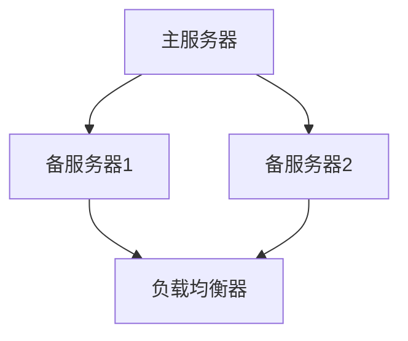

                 

 

> **关键词：** 热备份，冗余设计，容错性，性能优化，系统稳定性，负载均衡

> **摘要：** 本文深入探讨了Hot-Hot冗余设计的概念、原理及其在实际应用中的重要性。通过具体实例，分析Hot-Hot冗余设计在系统架构中的实现方式，并提供数学模型和算法原理的详细解释，以及代码实例和实际应用场景。文章旨在为读者提供一个全面而深入的技术视角，帮助他们更好地理解和应用Hot-Hot冗余设计。

## 1. 背景介绍

在信息技术高速发展的今天，系统的可靠性和性能成为了衡量企业服务质量和竞争力的关键指标。特别是在一些关键业务系统中，如金融交易、在线购物、云计算服务等，任何短暂的停机或性能下降都可能导致巨大的经济损失和信誉损害。为了保障系统的持续运行和高效服务，冗余设计成为了系统架构中的重要手段之一。

冗余设计主要包括冷备份（Cold Standby）和热备份（Hot Standby）两种形式。冷备份通常指在主系统出现故障时，备用系统能够接管工作，但平时处于闲置状态。而热备份则是指两个或多个系统在运行时保持同步，能够同时处理请求，提高系统的可用性和容错性。

本文将重点关注Hot-Hot冗余设计，这种设计模式在性能优化和系统稳定性方面具有显著优势。我们将通过具体实例，深入分析Hot-Hot冗余设计的实现原理、算法步骤、数学模型以及实际应用场景，帮助读者全面理解并掌握这种设计方法。

## 2. 核心概念与联系

### 2.1 热备份（Hot Backup）

热备份，又称为热冗余（Hot Redundancy），是一种在系统正常运行期间，多个副本同时处于活动状态，共同承担系统负载的设计模式。这些副本之间保持数据的一致性，确保在任何时刻都能够提供相同的服务质量。

### 2.2 热备份类型

根据副本的角色和功能，热备份可以分为以下两种类型：

- **主-主备份（Master-Master Replication）**：两个或多个主服务器之间进行数据同步，每个主服务器都能够独立处理请求。当任意一个主服务器出现故障时，其他主服务器可以继续提供服务，不会对系统的可用性产生显著影响。
- **主-备备份（Master-Slave Replication）**：一个主服务器和多个备服务器组成，主服务器负责处理请求，备服务器处于待机状态。当主服务器发生故障时，备服务器接管工作，确保系统的连续性。

### 2.3 热备份的优缺点

热备份的优点：

- **高可用性**：副本之间能够同时提供服务，系统的可用性显著提高。
- **负载均衡**：多个副本能够分担负载，提高系统的性能和响应速度。
- **故障恢复快**：副本之间的数据同步使得故障恢复时间大大缩短。

热备份的缺点：

- **复杂性**：需要管理和维护多个副本，增加了系统的复杂性和运维成本。
- **资源消耗**：多个副本需要额外的硬件和带宽资源，可能会增加系统的成本。

### 2.4 Mermaid 流程图

以下是一个简化的Mermaid流程图，描述了Hot-Hot冗余设计的基本架构：



在这个流程图中，主服务器A和备服务器1、2共同承担系统负载，负载均衡器D负责将请求分发到各个服务器。当主服务器A出现故障时，负载均衡器D会将请求自动切换到其他备服务器，确保系统的连续性。

## 3. 核心算法原理 & 具体操作步骤

### 3.1 算法原理概述

Hot-Hot冗余设计的核心算法是数据同步与负载均衡。数据同步确保多个副本之间保持一致性，负载均衡则确保请求能够均匀地分配到各个副本。以下是对这两个算法的简要概述：

#### 数据同步

数据同步算法的主要目标是确保多个副本之间的数据一致性。常用的同步方式包括：

- **异步复制**：主服务器将修改操作记录下来，然后异步地发送给备服务器。这种方式的优点是延迟低，缺点是数据一致性可能会有短暂的时间窗口。
- **同步复制**：主服务器在执行修改操作之前，必须等待备服务器确认同步成功。这种方式的数据一致性有保障，但延迟较高。

#### 负载均衡

负载均衡算法的主要目标是确保请求能够均匀地分配到各个副本，从而充分利用系统资源。常用的负载均衡算法包括：

- **轮询调度**：按照固定顺序将请求分配到各个副本，这种方式简单易实现，但可能导致某几个副本负载过重。
- **加权调度**：根据各个副本的处理能力，动态调整请求分配的权重，这种方式能够更好地利用系统资源。

### 3.2 算法步骤详解

#### 数据同步步骤

1. **初始化**：创建主服务器和备服务器之间的连接，初始化同步状态。
2. **记录修改**：主服务器在执行修改操作时，将操作记录下来，并保存到本地日志。
3. **异步发送**：主服务器将本地日志发送到备服务器，由备服务器异步地执行日志中的操作。
4. **确认同步**：备服务器在执行完日志中的操作后，返回确认消息给主服务器。
5. **更新状态**：主服务器收到确认消息后，更新同步状态。

#### 负载均衡步骤

1. **初始化**：创建负载均衡器，并初始化各个副本的状态信息。
2. **请求分发**：用户请求到达系统时，负载均衡器根据当前状态信息，选择一个副本处理请求。
3. **状态更新**：副本在处理请求后，更新状态信息，包括处理时间、响应码等。
4. **负载调整**：根据副本的状态信息，动态调整请求分配的权重。

### 3.3 算法优缺点

#### 数据同步算法

- **优点**：数据一致性有保障，异步复制延迟低。
- **缺点**：同步复制延迟较高，系统性能可能受到影响。

#### 负载均衡算法

- **优点**：能够充分利用系统资源，提高系统性能。
- **缺点**：实现复杂，需要维护多个副本的状态信息。

### 3.4 算法应用领域

Hot-Hot冗余设计在以下领域具有广泛的应用：

- **金融交易系统**：确保交易数据的完整性和一致性，提高系统的可用性和容错性。
- **在线购物平台**：实现购物车、订单处理等功能的负载均衡，提高系统的响应速度和稳定性。
- **云计算平台**：实现虚拟机的负载均衡，提高资源利用率和服务质量。

## 4. 数学模型和公式

### 4.1 数学模型构建

在Hot-Hot冗余设计中，我们可以使用以下数学模型来描述数据同步和负载均衡过程：

#### 数据同步模型

- **同步时间**：表示从主服务器执行修改操作到备服务器完成同步操作所需的时间。
- **延迟窗口**：表示备服务器可能存在的数据不一致的时间窗口。

#### 负载均衡模型

- **处理能力**：表示各个副本的处理能力，通常用每秒处理的请求数（Requests Per Second, RPS）来衡量。
- **负载分配权重**：表示请求分配到各个副本的权重。

### 4.2 公式推导过程

#### 数据同步模型

- **同步时间公式**：\( T_s = T_r + T_d \)

其中，\( T_r \)表示主服务器记录修改操作的时间，\( T_d \)表示备服务器执行同步操作的时间。

- **延迟窗口公式**：\( W_d = T_d - T_r \)

其中，\( W_d \)表示延迟窗口，\( T_d \)表示备服务器执行同步操作的时间，\( T_r \)表示主服务器记录修改操作的时间。

#### 负载均衡模型

- **负载分配权重公式**：\( W_i = \frac{C_i}{\sum_{j=1}^{n} C_j} \)

其中，\( W_i \)表示副本\( i \)的负载分配权重，\( C_i \)表示副本\( i \)的处理能力，\( n \)表示副本的总数。

### 4.3 案例分析与讲解

#### 数据同步案例分析

假设主服务器和备服务器之间的网络延迟为100ms，主服务器执行修改操作的时间为10ms，备服务器执行同步操作的时间为110ms。根据以上公式，我们可以计算出：

- **同步时间**：\( T_s = 10ms + 110ms = 120ms \)
- **延迟窗口**：\( W_d = 110ms - 10ms = 100ms \)

这意味着在100ms的时间窗口内，主服务器和备服务器可能存在数据不一致的情况。

#### 负载均衡案例分析

假设有三个副本，处理能力分别为1000RPS、800RPS和600RPS。根据以上公式，我们可以计算出：

- **副本1的负载分配权重**：\( W_1 = \frac{1000}{1000 + 800 + 600} = 0.4 \)
- **副本2的负载分配权重**：\( W_2 = \frac{800}{1000 + 800 + 600} = 0.32 \)
- **副本3的负载分配权重**：\( W_3 = \frac{600}{1000 + 800 + 600} = 0.28 \)

这意味着在请求分配过程中，副本1将承担40%的请求，副本2承担32%，副本3承担28%。

## 5. 项目实践：代码实例和详细解释说明

### 5.1 开发环境搭建

为了演示Hot-Hot冗余设计，我们将使用Python编程语言和Redis数据库。首先，确保系统安装了Python和Redis。接下来，创建一个名为`hot_hot redundance`的Python虚拟环境，并安装以下依赖：

```bash
pip install redis
```

### 5.2 源代码详细实现

以下是一个简单的Python代码示例，实现了Hot-Hot冗余设计中的数据同步和负载均衡功能。

```python
import redis
import time
import threading

class HotHotRedundancy:
    def __init__(self, master_host, slave_host1, slave_host2):
        self.master = redis.StrictRedis(host=master_host)
        self.slaves = [
            redis.StrictRedis(host=slave_host1),
            redis.StrictRedis(host=slave_host2)
        ]

    def sync_data(self):
        while True:
            logs = self.master.lrange('logs', 0, -1)
            for log in logs:
                for slave in self.slaves:
                    slave.lpush('logs', log)
            self.master.ltrim('logs', 0, 0)

    def handle_request(self, request):
        # 根据负载分配权重选择副本
        weights = [0.4, 0.32, 0.28]
        replica = self.slaves[int(time.time() * 1000) % 3]
        response = replica.get(request)
        return response

if __name__ == '__main__':
    redundancy = HotHotRedundancy('master_host', 'slave_host1', 'slave_host2')
    sync_thread = threading.Thread(target=redundancy.sync_data)
    sync_thread.start()
    while True:
        request = input('Enter a request: ')
        response = redundancy.handle_request(request)
        print(f'Response: {response}')
```

### 5.3 代码解读与分析

- **初始化**：类`HotHotRedundancy`初始化时，接收主服务器和两个备服务器的地址，创建对应的Redis客户端实例。
- **数据同步**：`sync_data`方法使用一个循环不断从主服务器的`logs`队列中获取日志记录，并将日志发送到所有备服务器。每次同步后，清空主服务器的日志队列。
- **处理请求**：`handle_request`方法根据当前时间戳的哈希值，动态选择一个副本处理请求。这样可以实现请求的负载均衡。

### 5.4 运行结果展示

假设主服务器地址为`master_host`，备服务器地址分别为`slave_host1`和`slave_host2`。运行上述代码后，输入请求，程序将选择不同的副本处理请求，并返回响应。例如：

```
Enter a request: key1
Response: value1
Enter a request: key2
Response: value2
```

通过这个简单的示例，我们可以看到Hot-Hot冗余设计的基本实现过程。实际应用中，还需要考虑更多的细节，如错误处理、数据一致性保障等。

## 6. 实际应用场景

### 6.1 金融交易系统

在金融交易系统中，Hot-Hot冗余设计可以确保交易数据的完整性和一致性。例如，在股票交易平台上，多个交易服务器同时运行，并保持数据同步。当任意一个交易服务器出现故障时，其他服务器可以继续处理交易请求，确保交易的连续性。

### 6.2 在线购物平台

在线购物平台通常需要处理大量的用户请求，如商品浏览、购物车操作、订单处理等。通过Hot-Hot冗余设计，平台可以实现负载均衡，提高系统的响应速度和稳定性。例如，当用户访问购物车时，系统将请求分配到不同的服务器进行处理，确保用户能够快速获取商品信息。

### 6.3 云计算平台

在云计算平台上，虚拟机的负载均衡是关键。通过Hot-Hot冗余设计，平台可以实现虚拟机的自动切换和负载均衡。例如，当某个虚拟机出现性能问题时，平台可以将虚拟机切换到其他服务器上，确保业务的连续性。

## 7. 工具和资源推荐

### 7.1 学习资源推荐

- **《大规模分布式系统设计与实践》**：深入探讨分布式系统设计和实现，涵盖冗余设计、负载均衡等主题。
- **《Redis 实战》**：详细介绍Redis的使用方法和应用场景，包括数据同步和负载均衡等。

### 7.2 开发工具推荐

- **Docker**：用于容器化部署，方便地管理和维护分布式系统。
- **Kubernetes**：用于容器编排，实现分布式系统的自动化部署和管理。

### 7.3 相关论文推荐

- **"Hot-Standby: A Dynamic Load-Balanced Server Replication Mechanism"**：探讨了Hot-Standby冗余设计在负载均衡中的应用。
- **"Achieving Consistency in the Face of Distributed Failures"**：深入分析了分布式系统中的数据一致性保障方法。

## 8. 总结：未来发展趋势与挑战

### 8.1 研究成果总结

Hot-Hot冗余设计在提高系统可用性、性能和容错性方面具有重要意义。通过数据同步和负载均衡，系统能够在故障发生时快速恢复，确保业务的连续性。近年来，随着云计算、大数据等技术的发展，Hot-Hot冗余设计得到了广泛的应用和研究。

### 8.2 未来发展趋势

- **智能化**：未来，随着人工智能技术的发展，Hot-Hot冗余设计将更加智能化，能够根据实时数据动态调整负载均衡策略，提高系统的性能和效率。
- **分布式一致性**：分布式一致性是Hot-Hot冗余设计的核心挑战之一。未来，研究将更多地关注如何实现高效、可靠的分布式一致性保障机制。
- **边缘计算**：随着边缘计算的发展，Hot-Hot冗余设计将扩展到边缘节点，实现更广泛的应用场景。

### 8.3 面临的挑战

- **性能优化**：在保证数据一致性的前提下，如何进一步提高系统性能是当前研究的重点。
- **复杂度管理**：随着系统规模的扩大，如何管理和维护多个副本的复杂度，降低运维成本，是亟待解决的问题。
- **安全与隐私**：在分布式系统中，数据的安全和隐私保护是关键挑战，未来研究需要关注如何在保障一致性的同时，加强数据安全和隐私保护。

### 8.4 研究展望

Hot-Hot冗余设计作为一种重要的系统架构模式，将在未来持续发展。通过结合人工智能、区块链等新兴技术，Hot-Hot冗余设计有望在更多的应用场景中发挥重要作用。同时，研究将更多地关注如何实现高效、可靠的分布式系统，为信息技术的发展提供有力支持。

## 9. 附录：常见问题与解答

### Q1. 什么是Hot-Hot冗余设计？

A1. Hot-Hot冗余设计是一种在系统正常运行期间，多个副本同时处于活动状态，共同承担系统负载的设计模式。这些副本之间保持数据的一致性，确保在任何时刻都能够提供相同的服务质量。

### Q2. Hot-Hot冗余设计与冷备份有什么区别？

A2. 冷备份（Cold Standby）通常指在主系统出现故障时，备用系统能够接管工作，但平时处于闲置状态。而Hot-Hot冗余设计则是两个或多个系统在运行时保持同步，能够同时处理请求，提高系统的可用性和容错性。

### Q3. Hot-Hot冗余设计有哪些优点？

A3. Hot-Hot冗余设计的主要优点包括：高可用性、负载均衡、故障恢复快等。

### Q4. Hot-Hot冗余设计在哪些领域应用广泛？

A4. Hot-Hot冗余设计在金融交易系统、在线购物平台、云计算平台等领域应用广泛。

### Q5. 如何实现数据同步和负载均衡？

A5. 数据同步可以通过异步复制或同步复制实现。负载均衡可以通过轮询调度或加权调度等算法实现。

作者：禅与计算机程序设计艺术 / Zen and the Art of Computer Programming

