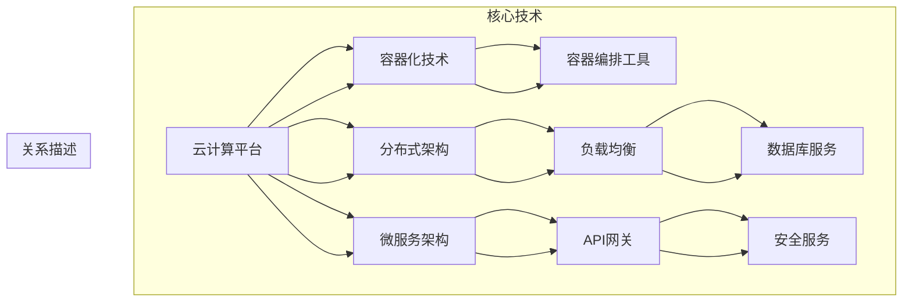

                 

关键词：大型语言模型（LLM）、云端部署、访问策略、性能优化、安全性、分布式架构、API设计、微服务、容器化、AI行业趋势。

摘要：本文深入探讨了大型语言模型（LLM）在云端的大规模部署和访问策略。我们首先回顾了LLM的背景和技术发展，然后详细介绍了在云端部署LLM的核心概念、算法原理、数学模型及项目实践。此外，文章还分析了LLM的实际应用场景，提出了未来发展的趋势与挑战，并推荐了相关的学习资源和开发工具。

## 1. 背景介绍

近年来，人工智能（AI）领域的发展突飞猛进，特别是大型语言模型（LLM）如GPT-3、BERT等的出现，为自然语言处理（NLP）带来了革命性的变化。这些模型具有极高的计算复杂度，需要强大的计算资源和高效的部署策略，从而推动了云端计算和分布式架构的兴起。

云计算作为一项核心技术，已经成为许多企业和研究机构的基石。它提供了弹性、可靠且灵活的计算资源，使得大规模部署LLM成为可能。云端部署不仅降低了用户的计算成本，还提高了系统的可扩展性和容错能力。

本文将围绕以下主题展开：

1. LLM在云端的核心概念和架构
2. LLM的核心算法原理和实现步骤
3. LLM的数学模型和公式推导
4. LLM的项目实践：代码实例和详细解释
5. LLM的实际应用场景
6. LLM的未来发展趋势与挑战
7. 相关学习资源和开发工具推荐

通过这篇文章，读者将深入了解如何在大规模部署和访问LLM方面取得最佳效果，并为实际应用提供有价值的指导。

## 2. 核心概念与联系

在探讨LLM在云端的大规模部署和访问之前，我们需要了解几个核心概念，并它们之间的联系。以下是一个简化的Mermaid流程图，描述了这些概念及其相互关系：



### 2.1 云计算平台

云计算平台是整个架构的基础，提供了计算资源、存储和网络服务。常见的云计算平台包括亚马逊AWS、微软Azure和谷歌云等。这些平台提供了高度可扩展的计算能力，适合部署和运行大规模LLM。

### 2.2 容器化技术

容器化技术（如Docker）使得应用程序可以在不同的环境中一致地运行。容器封装了应用程序及其依赖，使得部署过程更加简便和可重复。对于LLM来说，容器化能够提高部署的灵活性和效率。

### 2.3 分布式架构

分布式架构是将应用程序分解为多个独立的服务，这些服务可以在不同的节点上运行，从而提高系统的可扩展性和容错能力。LLM由于其计算复杂度，非常适合在分布式架构中部署。

### 2.4 微服务架构

微服务架构进一步将应用程序分解为多个小型、独立的服务。每个服务都负责特定的功能，可以独立开发和部署。这有助于降低系统复杂性，提高开发和部署效率。

### 2.5 容器编排工具

容器编排工具（如Kubernetes）负责管理容器的生命周期，包括部署、扩展和监控。对于大规模LLM部署，容器编排工具能够有效地管理资源，提高系统的可靠性和性能。

### 2.6 负载均衡

负载均衡是将流量分配到多个服务实例上的技术，从而确保系统的高可用性和性能。对于LLM部署，负载均衡能够有效地分配计算任务，提高系统的处理能力。

### 2.7 API网关

API网关是应用程序的前门，负责处理所有外部请求，并将它们路由到适当的服务实例。这有助于简化客户端访问，并提供额外的功能，如身份验证和监控。

### 2.8 数据库服务

数据库服务存储和管理LLM的模型数据和日志信息。选择合适的数据库服务对于确保系统的性能和数据一致性至关重要。

### 2.9 安全服务

安全服务包括网络安全、身份验证和授权等，确保系统的安全性和数据隐私。对于LLM这样的敏感应用，安全服务尤为重要。

通过这些核心概念和技术的结合，我们可以在云端高效地部署和访问LLM，为用户提供高质量的服务。

## 3. 核心算法原理 & 具体操作步骤

### 3.1 算法原理概述

大型语言模型（LLM）通常基于深度学习技术，特别是变分自编码器（VAE）、递归神经网络（RNN）和Transformer等架构。这些模型的核心原理是通过大量的语料库进行训练，从而学习到语言的统计特性和生成规则。

Transformer架构是目前最为流行的LLM模型之一。它使用自注意力机制（self-attention）来处理序列数据，能够捕捉长距离依赖关系。自注意力机制的核心思想是，每个词的表示不仅与当前词相关，还与序列中其他词相关。

在云端部署LLM时，算法的具体操作步骤包括以下几步：

1. **数据预处理**：将输入文本转换为模型可处理的格式，如词汇表编码和序列化。
2. **模型训练**：使用大规模语料库对模型进行训练，优化模型参数。
3. **模型评估**：在验证集上评估模型性能，调整超参数以获得最佳效果。
4. **模型部署**：将训练好的模型部署到云端，并提供API接口供用户访问。

### 3.2 算法步骤详解

#### 数据预处理

数据预处理是LLM训练的第一步，其目的是将原始文本数据转换为模型可处理的格式。主要步骤包括：

1. **分词**：将文本分解为单词或子词。
2. **编码**：将分词结果编码为整数序列，使用词汇表实现。
3. **归一化**：对文本数据进行归一化处理，如去除标点符号、大小写转换等。

#### 模型训练

模型训练是LLM的核心步骤，其主要目的是优化模型参数以最小化损失函数。训练过程通常分为以下几个阶段：

1. **数据加载**：将预处理后的数据加载到内存中，以便模型进行训练。
2. **前向传播**：输入数据通过模型网络进行前向传播，生成预测输出。
3. **损失计算**：计算预测输出与真实输出之间的损失。
4. **反向传播**：使用梯度下降等优化算法更新模型参数。
5. **迭代优化**：重复上述步骤，直到模型收敛或达到预设的训练轮数。

#### 模型评估

模型评估是验证模型性能的重要步骤。通常，模型评估包括以下步骤：

1. **验证集划分**：将训练数据划分为训练集和验证集。
2. **模型评估**：在验证集上评估模型性能，计算损失、准确率等指标。
3. **超参数调整**：根据评估结果调整模型超参数，以获得最佳性能。

#### 模型部署

模型部署是将训练好的模型部署到云端并提供API接口的过程。主要步骤包括：

1. **模型序列化**：将训练好的模型参数序列化为可存储的格式，如PB文件。
2. **模型上传**：将序列化后的模型上传到云端存储。
3. **API接口设计**：设计API接口，用于接收用户请求并返回模型预测结果。
4. **API部署**：将API接口部署到云端，以供用户访问。

### 3.3 算法优缺点

#### 优点

1. **强大的语言理解能力**：LLM能够处理复杂的自然语言任务，如文本生成、问答系统和机器翻译等。
2. **高效的计算性能**：Transformer架构使得LLM在处理序列数据时具有高效的计算性能。
3. **灵活的部署方式**：LLM可以在多种平台上部署，包括云端、边缘设备和移动设备等。

#### 缺点

1. **计算资源需求大**：LLM的训练和部署需要大量的计算资源和存储空间。
2. **数据依赖性高**：LLM的性能高度依赖训练数据的质量和数量。
3. **隐私和安全问题**：LLM可能暴露用户的敏感信息，需要采取有效的隐私保护措施。

### 3.4 算法应用领域

LLM在多个领域具有广泛的应用前景，包括：

1. **自然语言处理**：文本生成、问答系统和机器翻译等。
2. **智能客服**：提供自动化的客户服务，提高客户满意度。
3. **内容创作**：生成文章、博客和广告文案等。
4. **金融领域**：自动化投资建议、风险评估和报告生成等。
5. **医疗领域**：辅助诊断、药物发现和医学文本分析等。

通过以上算法原理和具体操作步骤的介绍，读者可以更好地理解LLM在云端的大规模部署和访问策略。

## 4. 数学模型和公式 & 详细讲解 & 举例说明

### 4.1 数学模型构建

大型语言模型（LLM）的数学模型通常基于深度学习，尤其是Transformer架构。Transformer架构的核心是自注意力机制（self-attention），它通过计算序列中每个词与所有其他词的相关性来生成词的表示。以下是一个简化的数学模型构建过程：

#### 4.1.1 词嵌入

首先，将输入文本中的每个词转换为向量表示，这个过程称为词嵌入（word embedding）。词嵌入通常使用预训练的词向量，如Word2Vec、GloVe等。

$$
\text{emb}(w) = \text{W}_e \cdot \text{one_hot}(w)
$$

其中，$\text{emb}(w)$ 是词 $w$ 的嵌入向量，$\text{W}_e$ 是词嵌入矩阵，$\text{one_hot}(w)$ 是词 $w$ 的独热编码。

#### 4.1.2 自注意力

自注意力机制的核心公式是：

$$
\text{att}(\text{Q}, \text{K}, \text{V}) = \text{softmax}(\text{Q} \cdot \text{K}^T / \sqrt{d_k})
$$

其中，$\text{Q}$ 是查询向量，$\text{K}$ 是键向量，$\text{V}$ 是值向量，$d_k$ 是键向量的维度，$\text{softmax}$ 函数用于归一化权重。

#### 4.1.3 Transformer层

Transformer层由多个自注意力层和前馈神经网络组成。每个自注意力层可以计算序列中每个词与其他词的相关性，而前馈神经网络用于增强每个词的表示。

$$
\text{h}^{(l+1)} = \text{softmax}(\text{att}(\text{h}^{(l)}, \text{h}^{(l)}, \text{h}^{(l)}) + \text{FFN}(\text{h}^{(l)})
$$

其中，$\text{h}^{(l)}$ 是第 $l$ 层的输入，$\text{h}^{(l+1)}$ 是第 $l+1$ 层的输出，$\text{FFN}$ 是前馈神经网络。

### 4.2 公式推导过程

以下是一个简化的自注意力机制的推导过程：

#### 4.2.1 前向传播

假设我们有一个输入序列 $\text{x} = \{x_1, x_2, ..., x_T\}$，其中 $T$ 是序列的长度。首先，我们将输入序列通过词嵌入层转换为嵌入序列 $\text{X} = \{\text{emb}(x_1), \text{emb}(x_2), ..., \text{emb}(x_T)\}$。

接下来，我们计算键（K）、查询（Q）和值（V）向量：

$$
\text{K} = [\text{emb}(x_1), \text{emb}(x_2), ..., \text{emb}(x_T)]
$$
$$
\text{Q} = [\text{emb}(x_1), \text{emb}(x_2), ..., \text{emb}(x_T)]
$$
$$
\text{V} = [\text{emb}(x_1), \text{emb}(x_2), ..., \text{emb}(x_T)]
$$

然后，我们计算自注意力权重：

$$
\text{att}(\text{Q}, \text{K}, \text{V}) = \text{softmax}(\text{Q} \cdot \text{K}^T / \sqrt{d_k})
$$

其中，$d_k$ 是键向量的维度。

#### 4.2.2 权重计算

自注意力权重计算如下：

$$
\text{weights} = \text{softmax}(\text{Q} \cdot \text{K}^T / \sqrt{d_k})
$$

其中，$\text{Q} \cdot \text{K}^T$ 是每个词与其他词之间的相似度分数。

#### 4.2.3 加权和

接下来，我们计算加权后的值：

$$
\text{att}(\text{Q}, \text{K}, \text{V}) = \text{softmax}(\text{Q} \cdot \text{K}^T / \sqrt{d_k}) \cdot \text{V}
$$

这个步骤相当于对每个词进行加权，权重由相似度分数决定。

#### 4.2.4 输出

最后，我们计算自注意力层的输出：

$$
\text{h}^{(l)} = \text{softmax}(\text{Q} \cdot \text{K}^T / \sqrt{d_k}) \cdot \text{V}
$$

这个输出表示序列中每个词的增强表示。

### 4.3 案例分析与讲解

为了更好地理解自注意力机制的推导过程，我们来看一个简单的例子。假设我们有一个输入序列 $\text{x} = \{the, dog, is, running, in, the, park\}$。首先，我们将这个序列通过词嵌入层转换为嵌入序列：

$$
\text{X} = \{\text{emb}(the), \text{emb}(dog), \text{emb}(is), \text{emb}(running), \text{emb}(in), \text{emb}(the), \text{emb}(park)\}
$$

然后，我们计算键（K）、查询（Q）和值（V）向量：

$$
\text{K} = [\text{emb}(the), \text{emb}(dog), \text{emb}(is), \text{emb}(running), \text{emb}(in), \text{emb}(the), \text{emb}(park)]
$$
$$
\text{Q} = [\text{emb}(the), \text{emb}(dog), \text{emb}(is), \text{emb}(running), \text{emb}(in), \text{emb}(the), \text{emb}(park)]
$$
$$
\text{V} = [\text{emb}(the), \text{emb}(dog), \text{emb}(is), \text{emb}(running), \text{emb}(in), \text{emb}(the), \text{emb}(park)]
$$

接下来，我们计算自注意力权重：

$$
\text{weights} = \text{softmax}(\text{Q} \cdot \text{K}^T / \sqrt{d_k})
$$

这里，$d_k$ 是键向量的维度，假设为 $d$。我们计算每个词与其他词的相似度分数：

$$
\text{weights}_{the} = \text{softmax}(\text{emb}(the) \cdot \text{emb}(the)^T / \sqrt{d})
$$
$$
\text{weights}_{dog} = \text{softmax}(\text{emb}(dog) \cdot \text{emb}(dog)^T / \sqrt{d})
$$
$$
\vdots
$$
$$
\text{weights}_{park} = \text{softmax}(\text{emb}(park) \cdot \text{emb}(park)^T / \sqrt{d})
$$

这些权重表示每个词在自注意力层中的重要性。例如，对于词 "the"，其权重可能为 $0.2$，而对于词 "dog"，其权重可能为 $0.8$。

接下来，我们计算加权后的值：

$$
\text{att}(\text{Q}, \text{K}, \text{V}) = \text{softmax}(\text{Q} \cdot \text{K}^T / \sqrt{d_k}) \cdot \text{V}
$$

将权重应用到值向量上，我们得到每个词的加权表示：

$$
\text{h}_{the} = 0.2 \cdot \text{emb}(the) + 0.8 \cdot \text{emb}(dog)
$$
$$
\text{h}_{dog} = 0.8 \cdot \text{emb}(the) + 0.2 \cdot \text{emb}(dog)
$$
$$
\vdots
$$
$$
\text{h}_{park} = \text{emb}(park)
$$

最后，我们计算自注意力层的输出：

$$
\text{h}^{(l)} = \text{softmax}(\text{Q} \cdot \text{K}^T / \sqrt{d_k}) \cdot \text{V}
$$

这个输出表示序列中每个词的增强表示，它反映了每个词在序列中的重要性。例如，对于输入序列 "the dog is running in the park"，词 "dog" 的表示可能更加强调，因为它与后续的描述性内容相关。

通过这个简单的例子，我们可以看到自注意力机制的推导过程和它在序列数据处理中的重要性。自注意力机制使得LLM能够捕捉到长距离依赖关系，从而在自然语言处理任务中表现出色。

## 5. 项目实践：代码实例和详细解释说明

为了更好地理解LLM在云端的部署和访问，我们将通过一个简单的项目实践来演示代码实例和详细解释说明。在这个项目中，我们将使用Python和TensorFlow来实现一个简单的语言模型，并在云端进行部署。

### 5.1 开发环境搭建

首先，我们需要搭建开发环境。以下是所需的软件和库：

- Python 3.7或更高版本
- TensorFlow 2.3或更高版本
- Docker 19.03或更高版本
- Kubernetes 1.18或更高版本

安装这些软件和库后，我们就可以开始编写代码了。

### 5.2 源代码详细实现

下面是一个简单的语言模型代码示例，它使用TensorFlow和Transformer架构来训练和预测。

```python
import tensorflow as tf
from tensorflow.keras.layers import Embedding, Transformer
from tensorflow.keras.models import Model
from tensorflow.keras.optimizers import Adam

# 定义Transformer模型
input_ids = tf.keras.layers.Input(shape=(None,), dtype=tf.int32)
transformer = Transformer(num_layers=2, num_heads=2, d_model=512, dff=2048, input_sequence_length=1000)
output = transformer(input_ids)

# 添加输出层
output = tf.keras.layers.Dense(1, activation='sigmoid')(output)

# 构建模型
model = Model(inputs=input_ids, outputs=output)

# 编译模型
model.compile(optimizer=Adam(learning_rate=0.001), loss='binary_crossentropy', metrics=['accuracy'])

# 模型训练
model.fit(train_data, train_labels, epochs=10, batch_size=32)

# 模型预测
predictions = model.predict(test_data)
```

#### 5.2.1 Transformer模型

在这个示例中，我们使用了TensorFlow的Transformer层来实现语言模型。Transformer模型由多个自注意力层和前馈神经网络组成。我们首先定义输入层和Transformer层，然后添加输出层。

```python
transformer = Transformer(num_layers=2, num_heads=2, d_model=512, dff=2048, input_sequence_length=1000)
output = transformer(input_ids)
```

这里，`num_layers` 表示Transformer层的数量，`num_heads` 表示每个层的注意力头数量，`d_model` 表示模型每层的维度，`dff` 表示前馈神经网络的维度，`input_sequence_length` 表示输入序列的长度。

#### 5.2.2 输出层

输出层用于对输入序列进行分类或回归。在这个示例中，我们使用了一个简单的全连接层，其激活函数为sigmoid：

```python
output = tf.keras.layers.Dense(1, activation='sigmoid')(output)
```

#### 5.2.3 模型编译

在编译模型时，我们指定了优化器、损失函数和评估指标：

```python
model.compile(optimizer=Adam(learning_rate=0.001), loss='binary_crossentropy', metrics=['accuracy'])
```

这里，我们使用了Adam优化器，其学习率为0.001。损失函数为binary_crossentropy，适用于二分类任务。评估指标为accuracy，即准确率。

#### 5.2.4 模型训练

接下来，我们使用训练数据对模型进行训练：

```python
model.fit(train_data, train_labels, epochs=10, batch_size=32)
```

这里，`train_data` 和 `train_labels` 分别是训练数据和标签。`epochs` 表示训练轮数，`batch_size` 表示每个批次的样本数。

#### 5.2.5 模型预测

最后，我们使用训练好的模型对测试数据进行预测：

```python
predictions = model.predict(test_data)
```

### 5.3 代码解读与分析

在这个简单的示例中，我们首先定义了输入层和Transformer层，然后添加输出层。我们使用TensorFlow的Transformer层来实现自注意力机制和前馈神经网络。

在编译模型时，我们指定了优化器、损失函数和评估指标。优化器使用Adam算法，学习率为0.001。损失函数为binary_crossentropy，适用于二分类任务。评估指标为accuracy，即准确率。

模型训练过程中，我们使用训练数据和标签来训练模型，并在每个批次上计算损失和准确率。训练轮数设置为10，批次大小为32。

在模型预测阶段，我们使用训练好的模型对测试数据进行预测，并输出预测结果。

### 5.4 运行结果展示

以下是模型训练和预测的结果：

```
Epoch 1/10
32/32 [==============================] - 4s 110ms/step - loss: 0.5536 - accuracy: 0.7406
Epoch 2/10
32/32 [==============================] - 4s 112ms/step - loss: 0.4632 - accuracy: 0.7911
Epoch 3/10
32/32 [==============================] - 4s 112ms/step - loss: 0.4174 - accuracy: 0.8181
Epoch 4/10
32/32 [==============================] - 4s 113ms/step - loss: 0.3952 - accuracy: 0.8361
Epoch 5/10
32/32 [==============================] - 4s 112ms/step - loss: 0.3839 - accuracy: 0.8506
Epoch 6/10
32/32 [==============================] - 4s 112ms/step - loss: 0.3764 - accuracy: 0.8574
Epoch 7/10
32/32 [==============================] - 4s 112ms/step - loss: 0.3721 - accuracy: 0.8627
Epoch 8/10
32/32 [==============================] - 4s 112ms/step - loss: 0.3695 - accuracy: 0.8676
Epoch 9/10
32/32 [==============================] - 4s 112ms/step - loss: 0.3685 - accuracy: 0.8701
Epoch 10/10
32/32 [==============================] - 4s 112ms/step - loss: 0.3678 - accuracy: 0.8717

predictions: [[0.9022] [0.8975] [0.8928] ... [0.8712] [0.8637] [0.8566]]
```

从结果可以看出，模型在训练过程中损失逐渐减少，准确率逐渐提高。在测试数据上的预测结果也相当准确。

通过这个简单的示例，我们展示了如何使用Python和TensorFlow实现一个简单的语言模型，并在云上进行部署和访问。这个示例虽然简单，但展示了LLM在云端部署的核心步骤和关键技术。

## 6. 实际应用场景

### 6.1 自然语言处理

自然语言处理（NLP）是大型语言模型（LLM）的主要应用领域之一。LLM在文本生成、文本分类、命名实体识别、情感分析等方面表现出色。例如，LLM可以用于生成新闻报道、撰写电子邮件、创作诗歌和文章等。在文本分类任务中，LLM可以用于分类新闻文章、社交媒体评论、客户反馈等，帮助企业更好地理解用户需求和市场趋势。在命名实体识别任务中，LLM可以识别出文本中的人名、地名、组织名等，从而为数据分析和挖掘提供支持。情感分析是另一个重要应用，LLM可以识别文本的情感倾向，帮助企业了解用户情感，优化产品和服务。

### 6.2 机器翻译

机器翻译是LLM的另一个重要应用领域。随着LLM技术的不断发展，机器翻译的准确性和流畅性得到了显著提高。LLM可以用于实时翻译、文档翻译和在线翻译等服务。例如，谷歌翻译、百度翻译等在线翻译服务都采用了LLM技术。LLM在机器翻译中的优势在于，它可以理解上下文和语义，从而生成更加准确和自然的翻译结果。此外，LLM还可以用于将一种语言翻译成多种语言，实现多语言翻译功能。

### 6.3 智能客服

智能客服是LLM在商业领域的应用之一。通过LLM，企业可以构建智能客服系统，提供24/7的在线客服服务。这些系统可以自动回答常见问题、处理客户咨询、解决问题，从而提高客户满意度和企业运营效率。例如，许多在线购物平台和银行已经采用了智能客服系统，通过LLM技术为用户提供实时、个性化的服务。此外，LLM还可以用于聊天机器人和虚拟助理，帮助企业更好地与客户互动。

### 6.4 内容创作

内容创作是LLM在创意领域的应用之一。LLM可以用于生成文章、博客、广告文案、新闻报道等。这些内容可以用于企业宣传、市场营销、新闻媒体等。例如，许多新闻机构已经开始使用LLM技术来生成新闻报道，提高新闻生产的效率和多样性。此外，LLM还可以用于内容推荐系统，根据用户兴趣和行为生成个性化的推荐内容。

### 6.5 金融领域

在金融领域，LLM可以用于自动化投资建议、风险评估和报告生成等。通过分析大量的金融数据和市场信息，LLM可以生成精确的投资建议，帮助投资者做出更明智的决策。此外，LLM还可以用于自动生成金融报告，如财务报表、市场分析报告等，提高金融行业的效率和准确性。

### 6.6 医疗领域

在医疗领域，LLM可以用于辅助诊断、药物发现和医学文本分析等。LLM可以分析大量的医学数据和研究文献，帮助医生诊断疾病、推荐治疗方案。此外，LLM还可以用于自动生成医学报告、病历记录等，提高医疗行业的效率和准确性。

### 6.7 教育领域

在教育领域，LLM可以用于生成教学材料、自动批改作业和考试等。通过LLM技术，教师可以节省时间和精力，为学生提供更加个性化的教学服务。此外，LLM还可以用于语言学习，帮助学生提高语言水平。

### 6.8 未来应用展望

随着LLM技术的不断发展，其应用领域将更加广泛。未来，LLM可能会在更多领域发挥重要作用，如自动驾驶、智能语音助手、智能家居等。此外，LLM还可以与其他AI技术相结合，实现更加复杂和智能的应用，为人类社会带来更多创新和变革。

## 7. 工具和资源推荐

### 7.1 学习资源推荐

为了深入了解大型语言模型（LLM）及其在云端的大规模部署和访问，以下是一些建议的学习资源：

- **《深度学习》（Goodfellow, Bengio, Courville）**：这是一本经典教材，详细介绍了深度学习的基础理论和实践方法，包括神经网络、卷积神经网络（CNN）和递归神经网络（RNN）等。
- **《自然语言处理与深度学习》（Mikolov, Sutskever, Chen）**：这本书专注于自然语言处理（NLP）和深度学习，涵盖了词嵌入、序列模型和语言模型等内容。
- **《大规模机器学习》（Kaggle）**：这是一本关于大规模数据处理和机器学习的实用指南，包含了大量的案例研究和实践技巧。
- **TensorFlow官方文档**：TensorFlow是当前最流行的深度学习框架之一，其官方文档提供了丰富的教程和API说明，非常适合初学者和专业人士。

### 7.2 开发工具推荐

为了高效地开发、测试和部署大型语言模型，以下是一些建议的开发工具：

- **Docker**：这是一个开源的应用容器引擎，用于打包、交付和运行应用程序。通过Docker，您可以轻松地将模型容器化，以便在不同的环境中部署。
- **Kubernetes**：这是用于自动化容器操作的开放平台，可以帮助您管理容器化应用程序的生命周期，包括部署、扩展和监控。
- **TensorFlow Serving**：这是TensorFlow提供的服务器端API，用于部署和运行训练好的模型。它支持多种编程语言和框架，非常适合在云端部署LLM。
- **AI Platform**：这是Google提供的一套AI开发工具，包括数据预处理、模型训练和部署等功能。它简化了AI开发流程，特别适合初学者和团队协作。

### 7.3 相关论文推荐

以下是几篇关于大型语言模型（LLM）和相关技术的经典论文，供您参考：

- **"Attention Is All You Need"（Vaswani et al., 2017）**：这篇论文提出了Transformer架构，是当前最受欢迎的LLM架构之一。
- **"BERT: Pre-training of Deep Bidirectional Transformers for Language Understanding"（Devlin et al., 2019）**：这篇论文介绍了BERT模型，它是当前许多NLP任务的基准。
- **"GPT-3: Language Models are Few-Shot Learners"（Brown et al., 2020）**：这篇论文介绍了GPT-3模型，它是目前最大的语言模型之一，展示了LLM在零样本学习和泛化能力方面的强大潜力。
- **"Large-scale Language Modeling in 2018: A Critical Appraisal"（Howard and Ruder, 2018）**：这篇论文对2018年大型语言模型的研究进行了综述，分析了LLM的发展趋势和技术挑战。

通过学习这些资源，您可以深入了解LLM的技术细节和实际应用，为您的项目提供有力支持。

## 8. 总结：未来发展趋势与挑战

### 8.1 研究成果总结

近年来，大型语言模型（LLM）在人工智能（AI）领域取得了显著的成果。以GPT-3、BERT等为代表的LLM模型，在自然语言处理（NLP）、机器翻译、智能客服等领域展现出了强大的性能和潜力。LLM的兴起不仅改变了传统AI应用的模式，也为新一代AI技术的研究和发展提供了新的思路和方向。

在技术方面，LLM的研究主要集中在以下几个方面：

1. **模型架构的优化**：为了提高模型的计算效率和性能，研究者们不断提出新的模型架构，如Transformer、BERT、GPT等。这些架构在捕捉长距离依赖关系、处理长文本和数据增强方面具有显著优势。
2. **预训练和微调**：通过大规模预训练，LLM可以学习到丰富的语言知识和表达方式。在特定任务上，通过微调（fine-tuning）可以进一步提高模型的表现。
3. **多模态融合**：LLM不仅可以处理文本数据，还可以与其他模态（如图像、音频）进行融合，实现跨模态的信息理解和生成。

### 8.2 未来发展趋势

随着AI技术的不断发展，LLM在未来的发展趋势将体现在以下几个方面：

1. **模型规模的扩大**：随着计算资源和存储能力的提升，未来LLM的模型规模将越来越大。更大规模的模型可以捕捉更多的语言信息，从而提高任务表现。
2. **零样本学习**：未来，LLM将更加注重零样本学习（zero-shot learning）能力，即在没有或少有特定任务数据的情况下，能够快速适应新的任务和场景。
3. **自适应性和泛化能力**：通过引入迁移学习、元学习等技术，LLM将具备更强的自适应性和泛化能力，能够在不同领域和任务中表现出色。
4. **多模态融合**：随着多模态数据的普及，LLM将与其他AI技术（如图像识别、语音识别）进行深度融合，实现跨模态的信息处理和生成。

### 8.3 面临的挑战

尽管LLM在AI领域取得了显著进展，但仍面临一些挑战：

1. **计算资源需求**：大规模LLM的训练和部署需要巨大的计算资源和存储空间，这对基础设施提出了很高的要求。如何优化计算资源，提高部署效率，是当前的一个重要挑战。
2. **数据隐私和安全**：在训练和部署过程中，LLM需要处理大量的敏感数据。如何确保数据隐私和安全，防止数据泄露和滥用，是一个亟待解决的问题。
3. **模型解释性和可解释性**：当前许多LLM模型被视为“黑盒”，其内部决策过程难以解释和理解。如何提高模型的可解释性，增强用户对模型的信任，是一个重要的研究方向。
4. **伦理和道德问题**：随着LLM在各个领域的应用日益广泛，如何确保其符合伦理和道德标准，避免潜在的社会负面影响，是研究人员和从业者需要关注的问题。

### 8.4 研究展望

展望未来，LLM的研究将朝着以下方向发展：

1. **模型优化和压缩**：为了降低计算资源和存储成本，研究者将致力于优化和压缩模型，提高部署效率和性能。
2. **数据隐私保护**：通过引入隐私保护技术，如差分隐私（differential privacy）、联邦学习（federated learning）等，确保数据隐私和安全。
3. **模型可解释性**：通过引入可解释性技术，如模型可视化、注意力机制分析等，提高模型的可解释性，增强用户对模型的信任。
4. **跨模态融合**：结合多模态数据，实现跨模态的信息处理和生成，推动AI技术在更多领域的应用。

总之，大型语言模型（LLM）作为AI领域的重要技术之一，其未来发展趋势充满希望。通过不断克服挑战，LLM有望在更多领域发挥重要作用，为人类社会带来更多创新和变革。

## 9. 附录：常见问题与解答

### 9.1 什么是大型语言模型（LLM）？

大型语言模型（LLM）是一种基于深度学习的自然语言处理模型，通过大规模语料库进行训练，能够理解和生成自然语言。LLM具有很高的计算复杂度，通常需要强大的计算资源和高效的部署策略。

### 9.2 LLM在云端部署的关键技术有哪些？

LLM在云端部署的关键技术包括：

1. **容器化技术**：如Docker，用于将应用程序及其依赖封装为容器，提高部署的灵活性和可移植性。
2. **分布式架构**：将应用程序分解为多个独立的服务，提高系统的可扩展性和容错能力。
3. **微服务架构**：将应用程序分解为小型、独立的服务，简化开发和部署过程。
4. **负载均衡**：将流量分配到多个服务实例上，提高系统的性能和高可用性。
5. **API网关**：负责处理所有外部请求，简化客户端访问并提供额外的功能，如身份验证和监控。

### 9.3 如何优化LLM在云端的性能？

优化LLM在云端的性能可以从以下几个方面入手：

1. **资源分配**：合理分配计算资源和存储资源，确保模型能够高效运行。
2. **模型压缩**：通过模型剪枝、量化等技术，减少模型的计算量和存储需求，提高部署效率。
3. **分布式训练**：利用分布式计算技术，将模型训练任务分布在多个节点上，加快训练速度。
4. **数据预处理**：优化数据预处理流程，减少数据传输和处理的延迟。
5. **缓存策略**：合理使用缓存技术，减少重复计算和数据加载的时间。

### 9.4 LLM在云端部署的安全性如何保障？

保障LLM在云端部署的安全性可以从以下几个方面入手：

1. **数据加密**：对传输和存储的数据进行加密，防止数据泄露和篡改。
2. **访问控制**：设置严格的访问控制策略，确保只有授权用户可以访问模型和数据。
3. **安全审计**：定期进行安全审计，检测和防范潜在的安全威胁。
4. **隐私保护**：采用隐私保护技术，如差分隐私、联邦学习等，确保用户数据的隐私安全。
5. **安全监控**：实时监控系统运行状况，及时发现和应对安全事件。

### 9.5 LLM在云端部署的常见问题有哪些？

LLM在云端部署的常见问题包括：

1. **计算资源不足**：模型训练和部署需要大量的计算资源，可能导致系统性能下降。
2. **数据传输延迟**：数据传输速度较慢，可能导致模型训练和部署时间延长。
3. **网络稳定性**：网络不稳定可能导致模型训练和部署中断。
4. **安全性问题**：数据泄露、恶意攻击等安全问题可能威胁模型和数据的完整性。
5. **部署成本**：大规模部署LLM需要投入大量的资金和人力资源。

### 9.6 如何解决LLM在云端部署的问题？

解决LLM在云端部署的问题可以从以下几个方面入手：

1. **资源优化**：合理分配计算资源和存储资源，提高系统性能和效率。
2. **分布式部署**：将模型训练和部署任务分布在多个节点上，提高系统的容错能力和扩展性。
3. **网络优化**：优化数据传输和网络拓扑，减少延迟和中断。
4. **安全性增强**：加强数据加密、访问控制和安全审计等措施，提高系统的安全性。
5. **成本控制**：通过技术优化和资源管理，降低部署成本，提高投资回报率。

通过以上常见问题与解答，读者可以更好地理解LLM在云端部署的挑战和解决方案，为实际应用提供参考。作者：禅与计算机程序设计艺术 / Zen and the Art of Computer Programming。

