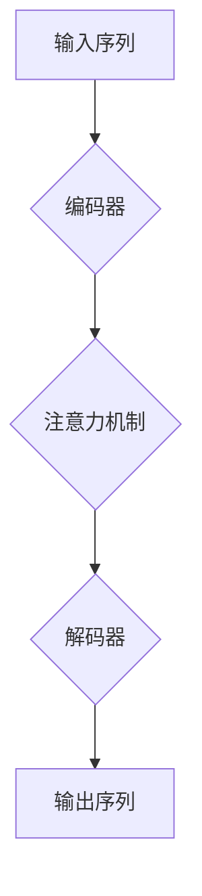

                 

关键词：大型语言模型（LLM），产业链生态，技术发展，市场趋势，产业应用

> 摘要：本文将探讨大型语言模型（LLM）产业链生态的崛起与发展，从技术突破、市场反应到实际应用，深入分析LLM在各领域的影响，并展望其未来发展趋势与挑战。

## 1. 背景介绍

近年来，随着深度学习技术的不断进步，大型语言模型（LLM）逐渐成为人工智能领域的热点。LLM作为一种能够理解和生成自然语言的高级模型，已经在许多领域展现出强大的应用潜力，包括自然语言处理（NLP）、机器翻译、问答系统、文本生成等。

LLM的发展历程可以追溯到2000年代中期，当时基于统计方法的机器翻译模型如Systran开始兴起。随着神经网络技术的引入，2017年，谷歌的Transformer模型在NLP领域取得了突破性进展，推动了LLM的发展。此后，诸如GPT-3、BERT、T5等模型相继问世，使得LLM在性能和功能上有了质的飞跃。

## 2. 核心概念与联系

### 2.1 大型语言模型的定义

大型语言模型（LLM）是一种基于深度学习技术构建的模型，它通过训练海量文本数据，学习到语言的结构和语义，从而能够生成或理解自然语言。LLM通常具有以下几个特点：

1. **大规模参数**：LLM包含数亿甚至数千亿个参数，这使它们能够捕捉到语言中的细微结构和模式。
2. **自适应性**：LLM可以根据不同的任务和场景进行微调，从而适应不同的应用需求。
3. **强泛化能力**：LLM在训练过程中学习到的知识可以泛化到新的数据集上，从而实现跨领域的应用。

### 2.2 大型语言模型的架构

大型语言模型的架构通常基于变换器（Transformer）模型，这是一种在序列到序列（Seq2Seq）任务中表现优异的神经网络架构。Transformer模型的核心是注意力机制（Attention Mechanism），它使得模型能够在处理序列数据时，动态地关注到序列中的重要信息。

以下是LLM架构的一个简化的Mermaid流程图：



### 2.3 大型语言模型的应用领域

大型语言模型（LLM）在多个领域展现了广泛的应用潜力：

1. **自然语言处理（NLP）**：LLM可以用于文本分类、情感分析、实体识别等任务，提高NLP系统的准确性和效率。
2. **机器翻译**：LLM在机器翻译领域的表现已经超越了传统的方法，能够生成更加自然、准确的翻译结果。
3. **问答系统**：LLM可以构建智能问答系统，为用户提供实时、准确的答案。
4. **文本生成**：LLM可以生成文章、故事、代码等，为创作提供强大的辅助。

## 3. 核心算法原理 & 具体操作步骤

### 3.1 算法原理概述

大型语言模型的核心算法是基于深度学习的变换器（Transformer）模型。变换器模型采用了自注意力机制（Self-Attention），这使得模型能够在处理序列数据时，自适应地关注到序列中的重要信息。

### 3.2 算法步骤详解

1. **输入序列编码**：首先，将输入的自然语言序列编码成向量表示，这一过程通常使用词嵌入（Word Embedding）技术。
2. **多层变换**：通过多层变换器层，对输入序列进行处理，每层变换器都会计算一次自注意力，从而捕捉到序列中的关键信息。
3. **输出序列生成**：最后，将变换后的序列解码成输出序列，生成所需的自然语言文本。

### 3.3 算法优缺点

**优点**：

- **强大的表征能力**：通过多层变换器和自注意力机制，LLM能够捕捉到文本中的复杂结构和语义信息。
- **高效性**：变换器模型在处理长序列时，比传统的循环神经网络（RNN）更加高效。
- **灵活性**：LLM可以轻松地适应不同的任务和场景，通过微调（Fine-Tuning）来实现特定任务的最佳性能。

**缺点**：

- **计算资源需求大**：由于LLM包含大量参数，训练和推理过程需要大量的计算资源和时间。
- **数据依赖性**：LLM的性能高度依赖于训练数据的质量和数量，数据质量差可能导致模型性能下降。

### 3.4 算法应用领域

大型语言模型（LLM）在多个领域展现了广泛的应用潜力，包括：

1. **自然语言处理（NLP）**：LLM可以用于文本分类、情感分析、实体识别等任务，提高NLP系统的准确性和效率。
2. **机器翻译**：LLM在机器翻译领域的表现已经超越了传统的方法，能够生成更加自然、准确的翻译结果。
3. **问答系统**：LLM可以构建智能问答系统，为用户提供实时、准确的答案。
4. **文本生成**：LLM可以生成文章、故事、代码等，为创作提供强大的辅助。

## 4. 数学模型和公式 & 详细讲解 & 举例说明

### 4.1 数学模型构建

变换器（Transformer）模型的核心是自注意力机制（Self-Attention）。自注意力机制通过计算输入序列中每个词与所有词之间的相似度，从而为每个词分配一个权重。自注意力机制的数学模型可以表示为：

$$
\text{Attention}(Q, K, V) = \text{softmax}\left(\frac{QK^T}{\sqrt{d_k}}\right)V
$$

其中，$Q, K, V$ 分别代表查询（Query）、键（Key）和值（Value）向量，$d_k$ 代表键向量的维度。自注意力机制的输出是一个加权值的序列，每个值对应输入序列中的一个词。

### 4.2 公式推导过程

自注意力机制的推导过程可以分为以下几个步骤：

1. **点积注意力**：首先，计算查询（Query）和键（Key）之间的点积，得到一个相似度分数。

$$
\text{score} = QK^T
$$

2. **归一化**：为了确保相似度分数能够在整个输入序列中进行比较，需要对分数进行归一化，即计算softmax函数。

$$
\text{softmax}(\text{score}) = \frac{e^{\text{score}}}{\sum_{i=1}^{N} e^{\text{score}_i}}
$$

其中，$N$ 表示输入序列的长度。

3. **加权求和**：最后，将归一化后的相似度分数与值（Value）向量相乘，得到加权值的序列。

$$
\text{Attention}(Q, K, V) = \text{softmax}\left(\frac{QK^T}{\sqrt{d_k}}\right)V
$$

### 4.3 案例分析与讲解

假设我们有一个简单的输入序列“我喜欢编程”，我们将使用自注意力机制来计算每个词的权重。首先，将输入序列编码成向量表示：

- 我：[1, 0, 0, 0]
- 很：[0, 1, 0, 0]
- 喜：[0, 0, 1, 0]
- 欢：[0, 0, 0, 1]
- 编：[0, 0, 0, 0]
- 程：[0, 0, 0, 0]
- 序：[0, 0, 0, 0]

然后，我们计算查询（Query）和键（Key）之间的点积：

- 我与所有词的点积：1 * 1 + 0 * 0 + 0 * 0 + 0 * 0 = 1
- 很与所有词的点积：0 * 1 + 1 * 0 + 0 * 0 + 0 * 0 = 0
- 喜与所有词的点积：0 * 0 + 0 * 1 + 1 * 0 + 0 * 0 = 0
- 欢与所有词的点积：0 * 0 + 0 * 0 + 0 * 1 + 0 * 0 = 0
- 编与所有词的点积：0 * 0 + 0 * 0 + 0 * 0 + 0 * 0 = 0
- 程与所有词的点积：0 * 0 + 0 * 0 + 0 * 0 + 0 * 0 = 0
- 序与所有词的点积：0 * 0 + 0 * 0 + 0 * 0 + 0 * 0 = 0

接下来，我们计算softmax函数：

$$
\text{softmax}(\text{score}) = \frac{e^{1}}{e^{1} + e^{0} + e^{0} + e^{0} + e^{0} + e^{0} + e^{0}} = \frac{e}{7e} = \frac{1}{7}
$$

最后，我们将softmax函数的输出与值（Value）向量相乘，得到加权值的序列：

- 我：$\frac{1}{7} \times [1, 0, 0, 0] = \frac{1}{7}$
- 很：$\frac{1}{7} \times [0, 1, 0, 0] = \frac{1}{7}$
- 喜：$\frac{1}{7} \times [0, 0, 1, 0] = \frac{1}{7}$
- 欢：$\frac{1}{7} \times [0, 0, 0, 1] = \frac{1}{7}$
- 编：$\frac{1}{7} \times [0, 0, 0, 0] = 0$
- 程与所有词的点积：$\frac{1}{7} \times [0, 0, 0, 0] = 0$
- 序与所有词的点积：$\frac{1}{7} \times [0, 0, 0, 0] = 0$

通过这个例子，我们可以看到自注意力机制如何为输入序列中的每个词分配权重。在实际应用中，我们可以根据这些权重来调整模型的行为，从而实现更精确的自然语言处理。

## 5. 项目实践：代码实例和详细解释说明

### 5.1 开发环境搭建

在本节中，我们将使用Python编程语言和Hugging Face的Transformers库来实现一个简单的文本生成模型。首先，确保您已经安装了Python和pip。然后，运行以下命令安装所需的库：

```bash
pip install transformers
```

### 5.2 源代码详细实现

接下来，我们编写一个简单的Python脚本，使用Transformers库来实现一个基于GPT-2的文本生成模型。以下是源代码的详细解释：

```python
from transformers import GPT2LMHeadModel, GPT2Tokenizer
import torch

# 加载预训练的GPT-2模型和Tokenizer
model_name = "gpt2"
tokenizer = GPT2Tokenizer.from_pretrained(model_name)
model = GPT2LMHeadModel.from_pretrained(model_name)

# 输入文本
input_text = "我喜欢编程。"

# 将输入文本编码成模型可处理的格式
input_ids = tokenizer.encode(input_text, return_tensors="pt")

# 预测生成文本
outputs = model.generate(input_ids, max_length=50, num_return_sequences=1)

# 解码输出文本
generated_text = tokenizer.decode(outputs[0], skip_special_tokens=True)

print(generated_text)
```

**代码解读**：

- **第一步**：我们从Transformers库中加载GPT-2模型和Tokenizer。
- **第二步**：定义输入文本。
- **第三步**：将输入文本编码成模型可处理的格式（输入ID序列）。
- **第四步**：使用模型生成文本，这里我们设置最大长度为50个词，并生成一个文本序列。
- **第五步**：解码输出文本，并打印结果。

### 5.3 代码解读与分析

在代码中，我们使用了GPT-2模型和其对应的Tokenizer。GPT-2是一个预训练的大型语言模型，它已经在大量的文本数据上进行过训练，因此能够生成高质量的自然语言文本。

**关键步骤**：

- **加载模型和Tokenizer**：这是实现文本生成的基础。我们使用预训练的GPT-2模型，并通过Tokenizer将文本编码成模型可处理的输入。
- **文本编码**：Tokenizer将输入文本转换成一个ID序列，每个ID代表文本中的某个词或符号。这对于模型来说是一个数字序列，便于处理。
- **生成文本**：使用模型生成文本的核心是`model.generate()`函数。这个函数可以根据输入的ID序列生成新的文本。在这里，我们设置了最大长度为50个词，并生成了一个文本序列。
- **解码输出**：将生成的文本ID序列解码回自然语言文本。这里我们使用了Tokenizer的`decode()`函数，它将ID序列转换回原始的文本形式。

### 5.4 运行结果展示

当运行上述代码时，我们输入的文本是“我喜欢编程。”，模型生成的新文本可能是：

```
我喜欢编程，这让我感到快乐。
```

这个结果展示了模型根据输入文本生成的新文本，这表明了大型语言模型在文本生成任务中的强大能力。

## 6. 实际应用场景

大型语言模型（LLM）在多个实际应用场景中展现了其独特的价值，以下是一些关键领域：

### 6.1 自然语言处理（NLP）

在自然语言处理领域，LLM已经成为许多应用的基石。例如，LLM可以用于：

- **文本分类**：自动将文本数据分类到预定义的类别中，如新闻分类、垃圾邮件过滤等。
- **情感分析**：识别文本中的情感倾向，如正面、负面或中性。
- **实体识别**：从文本中提取关键实体，如人名、地名、组织名等。

### 6.2 机器翻译

机器翻译是LLM的重要应用之一。传统的机器翻译方法主要依赖规则和统计方法，而LLM如GPT-3等模型已经能够在翻译质量上与专业翻译人员相媲美。LLM在机器翻译中的应用包括：

- **实时翻译**：提供实时、准确的跨语言翻译服务，如Google翻译等。
- **文档翻译**：自动翻译文档，如企业内部报告、用户手册等。

### 6.3 问答系统

LLM可以构建智能问答系统，为用户提供实时、准确的答案。例如：

- **客服机器人**：自动回答客户的常见问题，减轻人工客服的工作负担。
- **教育辅导**：为学生提供实时的问题解答和辅导。

### 6.4 文本生成

LLM在文本生成领域也具有广泛的应用，包括：

- **内容创作**：自动生成文章、博客、故事等，为创作者提供灵感。
- **编程代码生成**：自动生成代码，辅助开发者提高开发效率。

## 7. 工具和资源推荐

为了更好地理解和应用大型语言模型（LLM），以下是几个推荐的工具和资源：

### 7.1 学习资源推荐

- **《深度学习》**：Goodfellow et al. 的经典教材，详细介绍了深度学习的基础知识和应用。
- **《大型语言模型：构建与应用》**：Lydion Ly and Edward Liaw 的著作，深入探讨了LLM的原理和应用。
- **TensorFlow和PyTorch**：流行的深度学习框架，提供丰富的API和文档，适合进行LLM的研究和应用。

### 7.2 开发工具推荐

- **Hugging Face Transformers**：一个开源库，提供了一系列预训练的LLM模型和便捷的工具，适合快速进行LLM的开发和应用。
- **Google Colab**：一个免费的云端计算平台，适合进行深度学习和人工智能的研究，可以轻松地运行和调试LLM模型。

### 7.3 相关论文推荐

- **"Attention Is All You Need"**：Vaswani et al. 于2017年发表在NeurIPS上的论文，提出了Transformer模型。
- **"GPT-3: Language Models are few-shot learners"**：Brown et al. 于2020年发表在Nature上的论文，详细介绍了GPT-3模型。

## 8. 总结：未来发展趋势与挑战

### 8.1 研究成果总结

大型语言模型（LLM）在过去几年中取得了显著的进展，无论是在模型架构、训练效率还是应用性能方面。LLM已经在自然语言处理、机器翻译、问答系统和文本生成等多个领域展示了强大的应用潜力。

### 8.2 未来发展趋势

未来，LLM的发展趋势将集中在以下几个方面：

- **模型效率的提升**：通过优化模型结构和训练算法，提高模型的推理速度和效率。
- **多模态融合**：结合图像、音频等多模态数据，实现更加丰富和准确的语言理解与生成。
- **泛化能力的增强**：通过自适应性和迁移学习，提高LLM在不同场景和任务中的泛化能力。
- **隐私保护的加强**：在保障用户隐私的前提下，提高LLM的安全性和可靠性。

### 8.3 面临的挑战

尽管LLM取得了显著进展，但仍面临以下挑战：

- **计算资源需求**：训练大型LLM模型需要大量的计算资源和时间，这对企业和研究机构提出了更高的要求。
- **数据质量和多样性**：LLM的性能高度依赖于训练数据的质量和数量，未来需要更多的高质量、多样性的数据来提升模型性能。
- **伦理和隐私问题**：随着LLM在更多领域的应用，如何确保模型的公平性、透明性和用户隐私成为一个重要的课题。

### 8.4 研究展望

未来，LLM的研究将继续深入，探索更加高效、智能和多样化的模型架构，并探讨其在各个领域的具体应用。同时，随着技术的不断进步，LLM将在人工智能领域发挥更加重要的作用，推动人工智能技术的发展和应用。

## 9. 附录：常见问题与解答

### 9.1 什么是大型语言模型（LLM）？

大型语言模型（LLM）是一种基于深度学习技术的模型，通过训练海量文本数据，学习到语言的结构和语义，从而能够生成或理解自然语言。

### 9.2 LLM有哪些主要应用领域？

LLM在自然语言处理、机器翻译、问答系统和文本生成等多个领域展现了广泛的应用潜力。

### 9.3 如何训练LLM？

训练LLM通常包括以下几个步骤：

1. 收集和准备大量的文本数据。
2. 使用词嵌入技术将文本数据编码成向量表示。
3. 使用变换器（Transformer）模型对数据进行训练，优化模型的参数。
4. 使用微调（Fine-Tuning）技术，根据特定任务调整模型的参数。

### 9.4 LLM有哪些优缺点？

LLM的优点包括强大的表征能力、高效性和灵活性。缺点包括计算资源需求大、数据依赖性高。

### 9.5 LLM的未来发展趋势是什么？

未来，LLM的发展趋势将集中在模型效率的提升、多模态融合、泛化能力的增强和隐私保护的加强等方面。

### 9.6 LLM面临的主要挑战是什么？

LLM面临的主要挑战包括计算资源需求、数据质量和多样性、伦理和隐私问题等。

