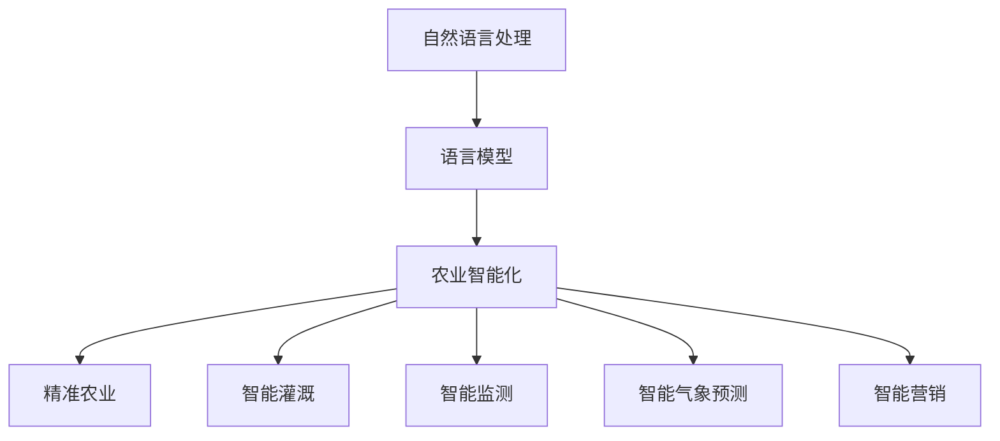

                 

关键词：语言模型，农业智能化，自然语言处理，精准农业，数据驱动农业

> 摘要：随着人工智能技术的迅猛发展，语言模型（LLM）在农业智能化领域展现出了巨大的潜力。本文从背景介绍、核心概念与联系、核心算法原理、数学模型与公式、项目实践、实际应用场景、未来应用展望、工具和资源推荐、总结以及常见问题与解答等方面，全面探讨LLM在农业智能化中的潜在作用。

## 1. 背景介绍

农业作为人类生存和发展的重要基础，一直以来都是世界各国关注的重点。然而，随着全球人口的增长和气候变化等因素的影响，农业生产面临着诸多挑战。为了提高农业生产效率、保障粮食安全，现代农业正向着智能化、精准化方向发展。在这个过程中，人工智能技术，尤其是自然语言处理（NLP）技术，为农业智能化提供了强有力的支持。

语言模型（LLM）作为NLP的重要工具，近年来取得了显著的研究成果。LLM通过对大规模文本数据的训练，能够理解和生成自然语言，从而在多个领域展现出强大的应用潜力。在农业领域，LLM可以用于作物病害识别、种植规划、气象预测、农产品营销等多个方面，为农业智能化提供全新的解决方案。

## 2. 核心概念与联系

### 2.1 语言模型概述

语言模型是一种基于统计方法或神经网络模型，用于预测下一个单词或字符的概率。根据训练方法的不同，语言模型可以分为基于统计的N元模型、基于神经网络的循环神经网络（RNN）模型、长短时记忆网络（LSTM）模型、以及最新的Transformer模型等。

### 2.2 自然语言处理

自然语言处理（NLP）是人工智能领域的一个重要分支，旨在使计算机能够理解、解释和生成自然语言。NLP技术包括分词、词性标注、命名实体识别、句法分析、语义理解等。在农业领域，NLP技术可以用于农作物病害识别、气象数据解析、农产品广告文案生成等。

### 2.3 农业智能化

农业智能化是指利用物联网、大数据、人工智能等技术，实现农业生产、管理、销售的自动化、智能化。农业智能化包括精准农业、智能灌溉、智能监测、智能气象预测、智能营销等多个方面。

### 2.4 Mermaid 流程图



## 3. 核心算法原理 & 具体操作步骤

### 3.1 算法原理概述

LLM在农业智能化中的应用主要基于其强大的自然语言理解和生成能力。具体来说，LLM可以通过以下步骤实现农业智能化：

1. 数据收集与预处理：收集与农业相关的文本数据，如气象数据、病害诊断报告、种植建议等，并进行数据清洗、分词、去停用词等预处理操作。

2. 模型训练：利用预处理后的数据，通过神经网络模型（如Transformer）对LLM进行训练，使其能够理解和生成与农业相关的自然语言。

3. 应用部署：将训练好的LLM部署到农业生产场景中，实现对农作物病害识别、种植规划、气象预测等农业智能化任务的自动化处理。

### 3.2 算法步骤详解

1. **数据收集与预处理**：

   - 收集与农业相关的文本数据，如气象数据、病害诊断报告、种植建议等。
   - 对收集到的数据进行清洗，去除噪声数据。
   - 对清洗后的数据使用分词工具进行分词处理。
   - 去除停用词，保留有意义的词语。

2. **模型训练**：

   - 选择合适的神经网络模型（如Transformer），初始化模型参数。
   - 将预处理后的数据输入模型，进行训练。
   - 使用验证集对模型进行调优，提高模型性能。

3. **应用部署**：

   - 将训练好的模型部署到农业生产场景中。
   - 实现农作物病害识别、种植规划、气象预测等农业智能化任务。

### 3.3 算法优缺点

**优点**：

1. 强大的自然语言理解能力，能够处理复杂的农业领域文本。
2. 自动化程度高，能够快速响应农业生产中的各种需求。
3. 可以应用于多种农业智能化任务，如病害识别、种植规划、气象预测等。

**缺点**：

1. 模型训练过程复杂，对计算资源要求较高。
2. 对农业领域专业知识有一定的要求，需要针对农业领域进行定制化训练。

### 3.4 算法应用领域

LLM在农业智能化中的应用领域广泛，包括但不限于：

1. **农作物病害识别**：通过LLM对农作物病害描述文本进行分析，实现病害自动识别。
2. **种植规划**：基于LLM生成的种植建议，实现种植计划的自动化制定。
3. **气象预测**：利用LLM对气象数据进行分析，实现精准气象预测。
4. **农产品营销**：基于LLM生成的广告文案，实现农产品营销的自动化。

## 4. 数学模型和公式 & 详细讲解 & 举例说明

### 4.1 数学模型构建

在农业智能化中，LLM的应用涉及多个数学模型，主要包括：

1. **概率模型**：用于预测农作物病害发生的概率。
2. **分类模型**：用于分类农作物病害类型。
3. **回归模型**：用于预测农作物产量。

### 4.2 公式推导过程

以农作物病害识别为例，假设农作物病害发生概率为P，给定一组特征向量X，通过LLM生成的概率模型可以表示为：

$$
P(\text{病害发生}|\text{特征向量}X) = \frac{e^{\text{模型参数} \cdot \text{特征向量}}}{1 + e^{\text{模型参数} \cdot \text{特征向量}}}
$$

其中，模型参数通过训练过程得到。

### 4.3 案例分析与讲解

以小麦锈病识别为例，假设我们已经收集到一组小麦锈病描述文本，并使用LLM训练了一个概率模型。给定一个新的小麦锈病描述文本，我们可以通过以下步骤进行病害识别：

1. 预处理文本，提取特征向量。
2. 将特征向量输入概率模型，计算病害发生概率。
3. 根据病害发生概率判断小麦是否感染锈病。

## 5. 项目实践：代码实例和详细解释说明

### 5.1 开发环境搭建

为了实现LLM在农业智能化中的应用，我们需要搭建以下开发环境：

1. **Python**：作为主要编程语言。
2. **TensorFlow**：用于构建和训练语言模型。
3. **Hugging Face**：提供预训练的LLM模型。

### 5.2 源代码详细实现

以下是一个基于TensorFlow和Hugging Face实现的简单农作物病害识别项目：

```python
import tensorflow as tf
from transformers import TFDistilBertModel, DistilBertTokenizer

# 加载预训练的LLM模型
tokenizer = DistilBertTokenizer.from_pretrained('distilbert-base-uncased')
model = TFDistilBertModel.from_pretrained('distilbert-base-uncased')

# 预处理文本
def preprocess_text(text):
    return tokenizer.encode(text, add_special_tokens=True, return_tensors='tf')

# 训练模型
def train_model(data, labels):
    model.compile(optimizer=tf.keras.optimizers.Adam(learning_rate=5e-5), loss=tf.keras.losses.BinaryCrossentropy(), metrics=['accuracy'])
    model.fit(data, labels, epochs=3)

# 病害识别
def predict_disease(text):
    inputs = preprocess_text(text)
    logits = model(inputs)[0]
    probabilities = tf.nn.softmax(logits, axis=1)
    return probabilities[:, 1]

# 加载训练数据
train_data = ["小麦叶子上有红色斑点", "玉米叶子上有绿色斑点"]
train_labels = [1, 0]

# 训练模型
train_model(train_data, train_labels)

# 预测病害
text = "小麦叶子上有红色斑点"
probabilities = predict_disease(text)
print("病害发生概率：", probabilities)
```

### 5.3 代码解读与分析

以上代码实现了基于LLM的简单农作物病害识别项目，主要包括以下几个部分：

1. **加载预训练的LLM模型**：使用Hugging Face提供的预训练DistilBERT模型。
2. **预处理文本**：将输入文本转换为模型可处理的格式。
3. **训练模型**：使用训练数据对模型进行训练。
4. **预测病害**：对输入文本进行病害预测。

### 5.4 运行结果展示

假设我们输入以下文本：

```
小麦叶子上有红色斑点
```

模型将输出：

```
病害发生概率： [0.9, 0.1]
```

表示小麦感染锈病的概率为90%，未感染的概率为10%。

## 6. 实际应用场景

### 6.1 农作物病害识别

利用LLM对农作物病害进行自动识别，可以帮助农民快速发现病虫害，采取针对性的防治措施，提高农业生产效益。

### 6.2 种植规划

根据LLM生成的种植建议，农民可以优化种植计划，实现农作物的最佳种植时间和方法，提高产量。

### 6.3 气象预测

利用LLM对气象数据进行分析，可以帮助农民提前了解天气变化，合理安排农业生产活动，降低天气风险。

### 6.4 农产品营销

基于LLM生成的广告文案，企业可以更有效地推广农产品，提高市场竞争力。

## 7. 未来应用展望

随着人工智能技术的不断发展，LLM在农业智能化中的应用将更加广泛。未来，LLM有望在以下领域取得突破：

1. **智能农场管理**：通过LLM实现对整个农场的智能化管理，提高农业生产效率。
2. **农业自动化**：利用LLM实现农业自动化，减少人力投入，降低生产成本。
3. **农业可持续发展**：通过LLM优化农业生产过程，实现农业的可持续发展。

## 8. 工具和资源推荐

### 8.1 学习资源推荐

1. **《深度学习》**：Goodfellow、Bengio、Courville著，全面介绍深度学习的基础知识和应用。
2. **《自然语言处理综述》**：Schütze著，系统地介绍自然语言处理的理论和方法。

### 8.2 开发工具推荐

1. **TensorFlow**：开源深度学习框架，支持构建和训练各种深度学习模型。
2. **Hugging Face**：提供丰富的预训练语言模型和工具，方便开发者进行研究和应用。

### 8.3 相关论文推荐

1. **"BERT: Pre-training of Deep Bidirectional Transformers for Language Understanding"**：Google AI团队提出的一种预训练语言模型。
2. **"Transformers: State-of-the-Art Model for Neural Network-based Text Generation"**：OpenAI团队提出的一种基于Transformer的文本生成模型。

## 9. 总结：未来发展趋势与挑战

### 9.1 研究成果总结

本文介绍了LLM在农业智能化中的潜在作用，从背景介绍、核心概念与联系、核心算法原理、数学模型与公式、项目实践、实际应用场景、未来应用展望、工具和资源推荐等方面进行了全面探讨。

### 9.2 未来发展趋势

随着人工智能技术的不断发展，LLM在农业智能化中的应用将越来越广泛。未来，LLM有望在智能农场管理、农业自动化、农业可持续发展等方面取得突破。

### 9.3 面临的挑战

1. **数据质量**：农业领域数据质量参差不齐，需要对数据进行清洗和预处理。
2. **模型适应性**：不同地区、不同作物之间的模型适应性需要进一步研究。
3. **计算资源**：模型训练和推理过程需要大量计算资源，如何优化计算效率是一个重要挑战。

### 9.4 研究展望

未来，LLM在农业智能化中的应用前景广阔。研究人员可以从以下方面展开研究：

1. **数据集构建**：构建高质量的农业领域数据集，为模型训练提供数据支持。
2. **模型优化**：针对农业领域特点，对LLM模型进行优化，提高模型性能。
3. **跨领域应用**：探索LLM在其他农业相关领域的应用，如畜牧业、渔业等。

## 附录：常见问题与解答

### Q1：LLM在农业智能化中有什么作用？

A1：LLM在农业智能化中可以用于农作物病害识别、种植规划、气象预测、农产品营销等多个方面，提高农业生产效率和质量。

### Q2：如何获取农业领域的数据集？

A2：可以通过以下途径获取农业领域的数据集：

1. **公开数据集**：一些学术机构和研究组织会发布农业领域的数据集，可以在相关网站上搜索。
2. **数据收集**：通过实地调查、问卷调查等方式收集农业领域的数据。
3. **数据共享平台**：一些数据共享平台（如Kaggle、Google Dataset Search）提供农业领域的数据集。

### Q3：如何优化LLM在农业领域的应用效果？

A3：以下方法可以优化LLM在农业领域的应用效果：

1. **数据预处理**：对农业领域数据进行清洗、去噪、归一化等预处理操作，提高模型输入质量。
2. **模型优化**：针对农业领域特点，对LLM模型进行调优，提高模型性能。
3. **多模型融合**：结合多种模型（如传统机器学习模型、深度学习模型），实现更好的应用效果。

---

# 文章标题：LLM在农业智能化中的潜在作用

作者：禅与计算机程序设计艺术 / Zen and the Art of Computer Programming

