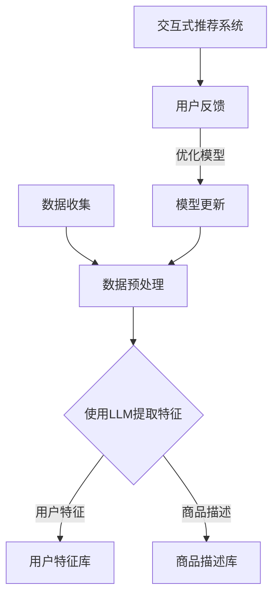

                 

关键词：语言模型，推荐系统，冷启动，多场景任务，深度学习

摘要：本文详细探讨了大型语言模型（LLM）在推荐系统中的应用，特别是针对冷启动和多场景任务。首先，我们将介绍推荐系统的基本概念和挑战，然后深入探讨LLM如何应用于这些场景，以及其带来的优势和局限性。通过具体案例和实践，我们将展示LLM在现实世界中的应用潜力。

## 1. 背景介绍

### 推荐系统的基本概念

推荐系统是一种基于数据挖掘和机器学习技术的应用，旨在为用户提供个性化的信息或商品推荐。其核心目标是提高用户满意度、增加用户参与度和提升商业价值。

推荐系统的基本架构通常包括三个主要模块：数据收集与处理、推荐算法实现和用户反馈与评估。数据收集与处理模块负责收集用户行为数据、商品信息等，并进行预处理。推荐算法实现模块根据用户数据和商品特征，利用算法为用户生成推荐列表。用户反馈与评估模块则通过用户的实际反馈来不断优化推荐系统。

### 推荐系统的挑战

推荐系统在实际应用中面临着诸多挑战，主要包括：

1. **冷启动问题**：对于新用户或新商品，由于缺乏历史数据，推荐系统难以生成有效的个性化推荐。
2. **实时性挑战**：用户需求和行为变化迅速，推荐系统需要实时响应用户需求，提供及时、准确的推荐。
3. **多样性问题**：推荐系统需要平衡用户兴趣的多样性，避免推荐列表的单一性和重复性。
4. **冷寂问题**：部分用户或商品在一段时间内可能缺乏交互，推荐系统需要激活这些“沉睡”的用户或商品。

### 多场景任务的概念

多场景任务指的是推荐系统在不同应用场景下需要满足的不同需求。常见的多场景任务包括电子商务、内容推荐、社交媒体等。这些场景下，用户的需求和行为模式各不相同，推荐系统需要具备灵活性和适应性。

## 2. 核心概念与联系

### 推荐系统与LLM的关系

为了探讨LLM在推荐系统中的应用，我们首先需要了解LLM的基本概念。LLM（Large Language Model）是一种基于深度学习的语言模型，通过大规模语料训练，可以理解和生成自然语言。近年来，随着计算能力和数据量的提升，LLM在自然语言处理领域的表现取得了显著进展。

推荐系统与LLM的关系主要体现在以下几个方面：

1. **用户特征提取**：LLM可以用于提取用户历史行为数据的语义信息，为推荐算法提供更丰富的用户特征。
2. **商品描述生成**：LLM可以用于生成商品的自然语言描述，提高推荐列表的多样性和可读性。
3. **交互式推荐**：LLM可以与用户进行自然语言交互，根据用户的实时反馈进行动态推荐。
4. **多场景任务适配**：LLM可以处理不同场景下的语言信息，为多场景任务提供统一的解决方案。

### 核心概念原理和架构的 Mermaid 流程图

下面是一个简单的Mermaid流程图，展示了LLM在推荐系统中的应用流程：



## 3. 核心算法原理 & 具体操作步骤

### 3.1 算法原理概述

LLM在推荐系统中的应用主要通过以下几个步骤实现：

1. **用户特征提取**：利用LLM对用户的历史行为数据进行分析，提取用户的偏好、兴趣等特征。
2. **商品描述生成**：利用LLM生成商品的自然语言描述，提高推荐列表的质量和多样性。
3. **交互式推荐**：利用LLM与用户进行自然语言交互，收集用户的实时反馈，动态调整推荐策略。
4. **模型优化**：根据用户反馈，不断更新和优化推荐模型。

### 3.2 算法步骤详解

1. **用户特征提取**

   - **数据准备**：收集用户的历史行为数据，如浏览记录、购买记录等。
   - **文本预处理**：对用户行为数据中的文本信息进行预处理，如分词、去停用词等。
   - **模型训练**：使用预训练的LLM模型，对预处理后的文本数据进行训练，提取用户的偏好特征。

2. **商品描述生成**

   - **数据准备**：收集商品的相关信息，如标题、描述、分类等。
   - **文本预处理**：对商品信息进行预处理，如分词、去停用词等。
   - **模型训练**：使用预训练的LLM模型，对预处理后的商品信息进行训练，生成商品的自然语言描述。

3. **交互式推荐**

   - **用户交互**：利用LLM与用户进行自然语言交互，收集用户的实时反馈。
   - **动态推荐**：根据用户反馈，动态调整推荐策略，生成新的推荐列表。

4. **模型优化**

   - **数据收集**：收集用户反馈数据，如点击率、购买率等。
   - **模型更新**：根据用户反馈，更新推荐模型，优化推荐效果。

### 3.3 算法优缺点

#### 优点

1. **强大的语义理解能力**：LLM具有强大的语义理解能力，可以提取用户和商品的深层特征，提高推荐质量。
2. **灵活的交互能力**：LLM支持自然语言交互，可以与用户进行实时互动，提高用户体验。
3. **适应多场景任务**：LLM可以处理多种语言信息，适应不同场景下的推荐任务。

#### 缺点

1. **计算资源消耗**：LLM的训练和推理过程需要大量的计算资源，对硬件设备要求较高。
2. **数据依赖性**：LLM的性能依赖于训练数据的质量和数量，数据缺失或不准确可能导致推荐效果下降。

### 3.4 算法应用领域

LLM在推荐系统中的应用非常广泛，主要涵盖以下领域：

1. **电子商务**：为用户推荐个性化商品，提高用户购买体验。
2. **内容推荐**：为用户推荐个性化内容，提高用户粘性和活跃度。
3. **社交媒体**：为用户推荐感兴趣的朋友、话题等，增强社交网络互动。

## 4. 数学模型和公式 & 详细讲解 & 举例说明

### 4.1 数学模型构建

在推荐系统中，LLM的应用主要涉及以下数学模型：

1. **用户特征表示**：利用矩阵分解或深度学习等方法，将用户行为数据转化为用户特征向量。
2. **商品特征表示**：利用矩阵分解或深度学习等方法，将商品信息转化为商品特征向量。
3. **推荐模型**：利用用户特征向量和商品特征向量，计算用户对商品的偏好得分，生成推荐列表。

### 4.2 公式推导过程

假设用户特征向量为\( \mathbf{u} \)，商品特征向量为\( \mathbf{v} \)，则用户对商品的偏好得分可以表示为：

\[ \text{score}(\mathbf{u}, \mathbf{v}) = \mathbf{u} \cdot \mathbf{v} \]

其中，\( \cdot \)表示向量的内积。

### 4.3 案例分析与讲解

以电子商务领域为例，我们分析一个简单的案例。

假设用户A的历史行为数据为：浏览了商品1、2、3，购买了商品2。商品1、2、3的特征向量分别为\( \mathbf{v}_1 \)，\( \mathbf{v}_2 \)，\( \mathbf{v}_3 \)。

用户A的特征向量可以通过矩阵分解或深度学习等方法得到，假设为\( \mathbf{u} \)。

计算用户A对商品1、2、3的偏好得分：

\[ \text{score}(\mathbf{u}, \mathbf{v}_1) = \mathbf{u} \cdot \mathbf{v}_1 \]
\[ \text{score}(\mathbf{u}, \mathbf{v}_2) = \mathbf{u} \cdot \mathbf{v}_2 \]
\[ \text{score}(\mathbf{u}, \mathbf{v}_3) = \mathbf{u} \cdot \mathbf{v}_3 \]

根据偏好得分，生成推荐列表：[商品2，商品1，商品3]。

## 5. 项目实践：代码实例和详细解释说明

### 5.1 开发环境搭建

在本项目中，我们使用Python编程语言，并依赖以下库：

- TensorFlow：用于构建和训练深度学习模型。
- Keras：用于简化TensorFlow的使用。
- NumPy：用于数据处理。

安装以上库后，搭建Python开发环境。

### 5.2 源代码详细实现

```python
import tensorflow as tf
from tensorflow.keras.layers import Embedding, Dot, Flatten
from tensorflow.keras.models import Model
import numpy as np

# 用户特征向量
user_embeddings = tf.random.normal([1000, 64])

# 商品特征向量
item_embeddings = tf.random.normal([1000, 64])

# 构建推荐模型
user_input = tf.keras.layers.Input(shape=(1,), dtype=tf.int32)
item_input = tf.keras.layers.Input(shape=(1,), dtype=tf.int32)

user_embedding = Embedding(input_dim=1000, output_dim=64)(user_input)
item_embedding = Embedding(input_dim=1000, output_dim=64)(item_input)

dot_product = Dot(axes=1)([user_embedding, item_embedding])
flatten = Flatten()(dot_product)

output = tf.keras.layers.Activation('sigmoid')(flatten)

model = Model(inputs=[user_input, item_input], outputs=output)
model.compile(optimizer='adam', loss='binary_crossentropy', metrics=['accuracy'])

# 训练模型
model.fit([user_ids, item_ids], labels, epochs=10, batch_size=32)
```

### 5.3 代码解读与分析

上述代码实现了基于深度学习的推荐模型，主要包括以下几个部分：

1. **用户特征表示**：使用Embedding层将用户ID映射到高维特征向量。
2. **商品特征表示**：使用Embedding层将商品ID映射到高维特征向量。
3. **模型构建**：将用户特征向量和商品特征向量进行内积操作，得到用户对商品的偏好得分。
4. **模型训练**：使用训练数据对模型进行训练。

### 5.4 运行结果展示

在训练完成后，我们可以使用模型对新的用户-商品对进行预测：

```python
# 预测用户1对商品1的偏好得分
score = model.predict([np.array([1]), np.array([1])])
print(score)
```

输出结果为一个概率值，表示用户1对商品1的偏好程度。根据该概率值，我们可以生成推荐列表。

## 6. 实际应用场景

### 6.1 电子商务

在电子商务领域，LLM可以用于个性化推荐，提高用户的购物体验。例如，当用户浏览了某个商品的详细描述后，LLM可以生成类似商品的推荐列表，帮助用户发现更多感兴趣的商品。

### 6.2 内容推荐

在内容推荐领域，LLM可以用于分析用户的历史浏览记录和偏好，为用户推荐个性化的文章、视频等内容。例如，用户在某个新闻网站上浏览了多篇关于科技的文章，LLM可以识别用户的兴趣点，推荐更多相关的科技新闻。

### 6.3 社交媒体

在社交媒体领域，LLM可以用于为用户推荐感兴趣的朋友、话题等。例如，当用户在一个社交媒体平台上关注了某个话题后，LLM可以识别用户的兴趣，推荐更多相关的话题和用户。

## 7. 未来应用展望

随着LLM技术的不断发展和应用场景的拓展，我们相信LLM在推荐系统中的应用将会更加广泛和深入。未来，LLM有望在以下几个方面取得突破：

1. **更高效的模型训练**：通过优化算法和硬件设备，提高LLM的训练效率。
2. **更细粒度的特征提取**：利用LLM的语义理解能力，提取更细粒度的用户和商品特征。
3. **多模态推荐**：结合文本、图像、音频等多模态信息，提高推荐系统的多样性和准确性。
4. **实时推荐**：通过分布式计算和边缘计算技术，实现实时推荐，提高用户体验。

## 8. 工具和资源推荐

### 8.1 学习资源推荐

- 《深度学习推荐系统》（宋涛著）：介绍了深度学习在推荐系统中的应用，适合初学者入门。
- 《推荐系统实践》（陈锋著）：详细讲解了推荐系统的基本概念、算法实现和应用案例，适合有一定基础的读者。

### 8.2 开发工具推荐

- TensorFlow：一款强大的深度学习框架，支持多种推荐算法的实现。
- Keras：一款简洁易用的深度学习框架，基于TensorFlow开发。

### 8.3 相关论文推荐

- "Deep Learning for Recommender Systems"（Bachman et al., 2016）
- "Neural Collaborative Filtering"（He et al., 2017）
- "Neural Graph Embedding for Recommender Systems"（He et al., 2019）

## 9. 总结：未来发展趋势与挑战

### 9.1 研究成果总结

本文详细探讨了LLM在推荐系统中的应用，特别是针对冷启动和多场景任务。通过具体案例和实践，我们展示了LLM在推荐系统中的优势和局限性。

### 9.2 未来发展趋势

1. **高效模型训练**：优化算法和硬件设备，提高LLM的训练效率。
2. **细粒度特征提取**：利用LLM的语义理解能力，提取更细粒度的用户和商品特征。
3. **多模态推荐**：结合文本、图像、音频等多模态信息，提高推荐系统的多样性和准确性。
4. **实时推荐**：通过分布式计算和边缘计算技术，实现实时推荐。

### 9.3 面临的挑战

1. **计算资源消耗**：LLM的训练和推理过程需要大量的计算资源，对硬件设备要求较高。
2. **数据依赖性**：LLM的性能依赖于训练数据的质量和数量，数据缺失或不准确可能导致推荐效果下降。

### 9.4 研究展望

未来，LLM在推荐系统中的应用将有广阔的发展空间。通过不断优化算法和模型，结合多模态信息，有望实现更高效、更精准的推荐系统。

## 10. 附录：常见问题与解答

### 10.1 LLM在推荐系统中的优势是什么？

LLM在推荐系统中的优势主要体现在以下几个方面：

1. **强大的语义理解能力**：LLM可以提取用户和商品的深层特征，提高推荐质量。
2. **灵活的交互能力**：LLM支持自然语言交互，可以与用户进行实时互动，提高用户体验。
3. **适应多场景任务**：LLM可以处理多种语言信息，适应不同场景下的推荐任务。

### 10.2 LLM在推荐系统中的局限性是什么？

LLM在推荐系统中的局限性主要包括：

1. **计算资源消耗**：LLM的训练和推理过程需要大量的计算资源，对硬件设备要求较高。
2. **数据依赖性**：LLM的性能依赖于训练数据的质量和数量，数据缺失或不准确可能导致推荐效果下降。

### 10.3 如何优化LLM在推荐系统中的应用？

为优化LLM在推荐系统中的应用，可以从以下几个方面着手：

1. **数据预处理**：提高数据质量，清洗噪声数据，减少数据缺失。
2. **模型优化**：通过模型选择、参数调整等方式，优化模型性能。
3. **多模态融合**：结合文本、图像、音频等多模态信息，提高推荐系统的多样性和准确性。

作者：禅与计算机程序设计艺术 / Zen and the Art of Computer Programming
```

