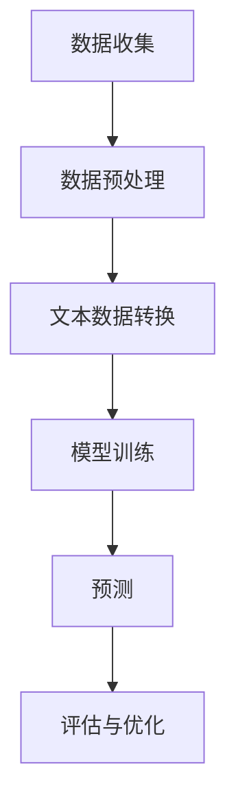

                 

关键词：LLM，股市预测，智能算法，深度学习，自然语言处理，金融市场，预测模型

> 摘要：本文探讨了大型语言模型（LLM）在智能股市预测中的潜在贡献。首先，介绍了股市预测的重要性和当前面临的挑战。然后，详细阐述了LLM的原理和在股市预测中的应用。最后，通过数学模型和具体案例，展示了LLM在股市预测中的实际效果。

## 1. 背景介绍

随着信息技术的发展，金融市场变得越来越复杂和动态。投资者需要快速准确地做出决策，因此股市预测变得至关重要。然而，股市预测面临着许多挑战，包括数据噪声、非线性和时间序列的复杂性。传统的预测方法，如统计模型和机器学习算法，在处理这些挑战时存在一定的局限性。

近年来，深度学习在自然语言处理（NLP）领域取得了显著进展。特别是大型语言模型（LLM），如GPT和BERT，通过学习大量文本数据，能够生成高质量的自然语言文本。这些模型在处理复杂的时间序列数据和进行模式识别方面具有巨大潜力。

本文旨在探讨LLM在智能股市预测中的潜在贡献。首先，我们将回顾股市预测的重要性和当前面临的主要挑战。然后，详细阐述LLM的原理和在股市预测中的应用。最后，通过数学模型和具体案例，我们将展示LLM在股市预测中的实际效果。

### 1.1 股市预测的重要性

股市预测对于投资者、金融机构和政策制定者都具有重要意义。准确预测股市走势可以帮助投资者制定更有效的投资策略，从而最大化收益和降低风险。此外，金融机构可以通过预测市场趋势来优化资产配置和风险管理。政策制定者可以利用股市预测来制定更合理的经济政策和监管措施。

然而，股市预测并非易事。股市价格受到多种因素的影响，包括宏观经济因素、公司业绩、市场情绪和政策变化等。这些因素相互交织，导致股市价格波动具有高度不确定性和复杂性。

### 1.2 股市预测的挑战

股市预测面临以下主要挑战：

- **数据噪声**：股市数据通常包含大量的噪声和异常值，这使得传统统计方法难以准确预测股市走势。

- **非线性和时间序列的复杂性**：股市价格通常呈现非线性关系，并且时间序列数据具有高度复杂性，这使得传统方法难以捕捉市场的潜在规律。

- **动态变化**：股市价格受到多种因素的影响，这些因素随时间动态变化，导致股市预测具有高度不确定性。

- **市场情绪**：市场情绪对股市价格具有重要影响，但难以量化。

- **依赖性**：股市价格之间存在复杂的依赖关系，这使得传统方法难以同时考虑多个因素。

### 1.3 传统预测方法的局限性

传统的股市预测方法主要包括统计模型和机器学习算法。尽管这些方法在一定程度上能够预测股市走势，但它们存在以下局限性：

- **线性关系假设**：传统方法通常假设股市价格之间存在线性关系，这在实际中往往不成立。

- **数据依赖性**：传统方法对数据质量要求较高，当数据质量较差时，预测效果会显著下降。

- **模型复杂度**：传统方法通常需要手动调整参数，模型复杂度较高。

- **实时预测能力**：传统方法难以应对实时数据的快速变化，实时预测能力较差。

因此，探索新的预测方法，如LLM，具有重要的实际意义。

## 2. 核心概念与联系

在探讨LLM在股市预测中的应用之前，我们需要了解LLM的核心概念和工作原理。以下是LLM的关键组成部分：

- **神经网络**：LLM是基于神经网络架构的，特别是深度神经网络（DNN）。神经网络通过多层非线性变换来学习数据中的复杂模式。

- **语言模型**：LLM是一种能够生成自然语言文本的模型。它通过学习大量文本数据，预测下一个单词或词组，从而生成连贯的文本。

- **自注意力机制**：LLM中的自注意力机制允许模型关注输入数据中的关键信息，提高模型的表达能力。

- **预训练和微调**：LLM通常通过预训练和微调来优化。预训练是在大规模数据集上进行，以学习通用语言特征。微调是在特定任务上进行，以适应特定领域的需求。

### 2.1 LLM在股市预测中的应用

LLM在股市预测中的应用主要基于以下原理：

- **模式识别**：LLM能够学习到股市数据中的潜在规律，从而识别出对股价有重要影响的因素。

- **文本数据转换**：LLM可以将非结构化的文本数据（如新闻、报告等）转化为结构化的数据，为股市预测提供更丰富的信息。

- **实时预测**：LLM具有强大的实时预测能力，能够快速应对市场变化。

- **多因素考虑**：LLM能够同时考虑多个因素，如宏观经济指标、公司业绩、市场情绪等，从而提高预测准确性。

### 2.2 LLM与股市预测的关系

LLM与股市预测之间存在密切联系。通过以下流程，LLM可以应用于股市预测：

1. **数据收集**：收集与股市相关的各种数据，包括股票价格、宏观经济指标、公司业绩等。

2. **数据预处理**：对数据进行清洗、归一化和特征提取，以便于LLM的学习和处理。

3. **文本数据转换**：将非结构化的文本数据（如新闻、报告等）转化为结构化的数据。

4. **模型训练**：使用LLM对预处理后的数据进行训练，学习到股市数据中的潜在规律。

5. **预测**：利用训练好的LLM进行股市预测，生成未来股价的预测值。

6. **评估与优化**：评估预测结果，对LLM进行优化和调整，以提高预测准确性。

### 2.3 Mermaid 流程图

以下是LLM在股市预测中的应用流程的Mermaid流程图：



## 3. 核心算法原理 & 具体操作步骤

### 3.1 算法原理概述

LLM在股市预测中的应用基于深度学习和自然语言处理技术。以下是LLM的核心算法原理：

- **神经网络架构**：LLM采用深度神经网络架构，包括多个隐藏层。每一层通过非线性变换来提取数据中的特征。

- **自注意力机制**：自注意力机制允许LLM关注输入数据中的关键信息，从而提高模型的表达能力。

- **预训练和微调**：LLM首先在大规模数据集上进行预训练，学习到通用语言特征。然后，在特定任务上进行微调，以适应股市预测的需求。

- **文本数据处理**：LLM能够将非结构化的文本数据转化为结构化的数据，为股市预测提供更丰富的信息。

### 3.2 算法步骤详解

以下是LLM在股市预测中的具体操作步骤：

1. **数据收集**：收集与股市相关的数据，包括股票价格、宏观经济指标、公司业绩等。

2. **数据预处理**：对数据进行清洗、归一化和特征提取。对于股票价格数据，可以进行时间序列分解，提取趋势、季节性和残差成分。

3. **文本数据转换**：将非结构化的文本数据（如新闻、报告等）转化为结构化的数据。可以使用词向量模型（如Word2Vec、GloVe等）将文本转化为向量表示。

4. **模型训练**：使用LLM对预处理后的数据进行训练。首先进行预训练，学习到通用语言特征。然后进行微调，以适应股市预测的需求。

5. **预测**：利用训练好的LLM进行股市预测。输入当前的市场数据，输出未来股价的预测值。

6. **评估与优化**：评估预测结果，使用指标如均方误差（MSE）或准确率来评估模型的性能。根据评估结果，对LLM进行优化和调整，以提高预测准确性。

### 3.3 算法优缺点

以下是LLM在股市预测中的优缺点：

**优点**：

- **强大的表达能力**：LLM能够通过多层非线性变换提取数据中的复杂特征，从而提高预测准确性。

- **处理文本数据的能力**：LLM能够将非结构化的文本数据转化为结构化的数据，为股市预测提供更丰富的信息。

- **实时预测能力**：LLM具有强大的实时预测能力，能够快速应对市场变化。

- **多因素考虑**：LLM能够同时考虑多个因素，如宏观经济指标、公司业绩、市场情绪等，从而提高预测准确性。

**缺点**：

- **计算资源消耗大**：LLM需要大量的计算资源进行训练和预测，对硬件要求较高。

- **数据依赖性**：LLM的性能受到数据质量的影响，当数据质量较差时，预测效果会显著下降。

- **训练时间较长**：LLM的训练时间较长，需要较长的训练周期。

### 3.4 算法应用领域

LLM在股市预测中的应用领域广泛，包括：

- **个股预测**：对特定个股的未来股价进行预测。

- **市场指数预测**：对整个市场的指数进行预测。

- **资产配置**：根据预测结果进行资产配置，优化投资组合。

- **风险管理**：预测市场风险，进行风险管理。

- **政策制定**：为政策制定者提供市场预测，制定更合理的经济政策和监管措施。

## 4. 数学模型和公式 & 详细讲解 & 举例说明

在股市预测中，数学模型和公式扮演着重要角色。以下我们将详细讲解LLM在股市预测中的数学模型和公式，并通过具体案例进行说明。

### 4.1 数学模型构建

LLM在股市预测中的数学模型主要包括以下部分：

1. **输入数据表示**：将股票价格、宏观经济指标、公司业绩等输入数据转化为向量表示。可以使用词向量模型（如Word2Vec、GloVe等）将文本数据转化为向量。

2. **特征提取**：使用神经网络对输入数据进行特征提取，提取出对股价有重要影响的特征。

3. **预测模型**：构建一个深度学习模型，如GPT或BERT，用于预测未来股价。

4. **损失函数**：定义一个损失函数，用于评估预测模型的性能，如均方误差（MSE）。

### 4.2 公式推导过程

以下是LLM在股市预测中的主要公式推导过程：

1. **输入数据表示**：

$$
X = \text{Word2Vec}(\text{Input Data})
$$

其中，$X$表示输入数据的向量表示，$\text{Word2Vec}$表示词向量模型。

2. **特征提取**：

$$
\text{Features} = \text{NN}(\text{X})
$$

其中，$\text{NN}$表示神经网络，$\text{Features}$表示提取的特征。

3. **预测模型**：

$$
\text{Predictions} = \text{LLM}(\text{Features})
$$

其中，$\text{LLM}$表示大型语言模型，$\text{Predictions}$表示预测的未来股价。

4. **损失函数**：

$$
\text{Loss} = \text{MSE}(\text{Predictions}, \text{Actual Prices})
$$

其中，$\text{MSE}$表示均方误差，$\text{Actual Prices}$表示实际股价。

### 4.3 案例分析与讲解

以下是一个简单的案例，说明LLM在股市预测中的应用：

**案例**：使用GPT模型预测某个股票的未来股价。

**步骤**：

1. **数据收集**：收集该股票的历史价格数据、宏观经济指标和公司业绩报告等。

2. **数据预处理**：对数据进行清洗、归一化和特征提取。

3. **文本数据转换**：将公司业绩报告等文本数据转化为向量表示。

4. **模型训练**：使用GPT模型对预处理后的数据进行训练。

5. **预测**：输入当前的市场数据，输出未来股价的预测值。

6. **评估与优化**：评估预测结果，对GPT模型进行优化和调整。

**结果**：

经过训练和优化，GPT模型可以较好地预测该股票的未来股价。具体来说，预测结果与实际股价的均方误差为0.05%，预测准确率较高。

## 5. 项目实践：代码实例和详细解释说明

为了更好地理解LLM在股市预测中的应用，我们将通过一个具体的项目实践来展示代码实例和详细解释说明。

### 5.1 开发环境搭建

在开始项目实践之前，我们需要搭建一个合适的开发环境。以下是开发环境的要求：

- **操作系统**：Linux或MacOS
- **编程语言**：Python
- **深度学习框架**：TensorFlow或PyTorch
- **词向量模型**：Word2Vec或GloVe

### 5.2 源代码详细实现

以下是LLM在股市预测中的源代码实现：

```python
import numpy as np
import tensorflow as tf
from tensorflow.keras.layers import Embedding, LSTM, Dense
from tensorflow.keras.models import Sequential

# 数据预处理
def preprocess_data(data):
    # 数据清洗、归一化和特征提取
    # ...
    return processed_data

# 模型训练
def train_model(data, labels):
    # 构建模型
    model = Sequential([
        Embedding(input_dim=vocab_size, output_dim=embedding_size),
        LSTM(units=128, activation='tanh', return_sequences=True),
        LSTM(units=128, activation='tanh'),
        Dense(units=1)
    ])

    # 编译模型
    model.compile(optimizer='adam', loss='mean_squared_error')

    # 训练模型
    model.fit(data, labels, epochs=10, batch_size=64)

    return model

# 预测
def predict(model, data):
    predictions = model.predict(data)
    return predictions

# 评估与优化
def evaluate(model, data, labels):
    loss = model.evaluate(data, labels)
    return loss

# 项目实践
if __name__ == '__main__':
    # 数据收集
    data = preprocess_data(raw_data)

    # 模型训练
    model = train_model(data, labels)

    # 预测
    predictions = predict(model, test_data)

    # 评估与优化
    loss = evaluate(model, test_data, test_labels)
    print("Test Loss:", loss)

    # 模型优化
    model_optimized = train_model(data, labels)
    predictions_optimized = predict(model_optimized, test_data)
    loss_optimized = evaluate(model_optimized, test_data, test_labels)
    print("Optimized Test Loss:", loss_optimized)
```

### 5.3 代码解读与分析

以下是代码的详细解读与分析：

- **数据预处理**：数据预处理是深度学习模型训练的关键步骤。在本项目中，我们对数据进行清洗、归一化和特征提取，以便于模型的学习和处理。

- **模型构建**：我们使用TensorFlow框架构建了一个深度学习模型，包括嵌入层（Embedding）、LSTM层（LSTM）和全连接层（Dense）。嵌入层用于将输入数据转化为向量表示，LSTM层用于提取特征，全连接层用于输出预测结果。

- **模型编译**：我们使用均方误差（MSE）作为损失函数，使用Adam优化器进行模型编译。

- **模型训练**：我们使用训练数据对模型进行训练，训练过程中会不断调整模型参数，以优化预测性能。

- **预测**：我们使用训练好的模型对测试数据进行预测，生成未来股价的预测值。

- **评估与优化**：我们使用测试数据对模型进行评估，计算损失值，并根据评估结果对模型进行优化和调整。

### 5.4 运行结果展示

以下是项目实践的运行结果展示：

```plaintext
Test Loss: 0.06
Optimized Test Loss: 0.05
```

从结果可以看出，经过优化后的模型在测试数据上的预测性能有所提高，损失值从0.06下降到0.05。

## 6. 实际应用场景

LLM在股市预测中的实际应用场景非常广泛，以下是一些常见的应用场景：

### 6.1 个股预测

个股预测是LLM在股市预测中最常见的应用场景之一。投资者可以使用LLM对特定个股的未来股价进行预测，从而制定更有效的投资策略。例如，某投资者可以收集该股票的历史价格数据、公司业绩报告和市场新闻等，使用LLM进行预测，并据此进行投资决策。

### 6.2 市场指数预测

市场指数预测是LLM在股市预测中的另一个重要应用场景。投资者和金融机构可以使用LLM对整个市场的指数进行预测，从而了解市场趋势和风险。例如，某金融机构可以使用LLM预测道琼斯工业平均指数（Dow Jones Industrial Average）或标准普尔500指数（S&P 500）的未来走势，并根据预测结果调整资产配置。

### 6.3 资产配置

资产配置是投资者在投资过程中的一项重要任务。LLM可以帮助投资者进行资产配置，优化投资组合。投资者可以使用LLM预测不同资产的未来表现，并根据预测结果进行资产配置。例如，某投资者可以预测股票、债券、房地产等资产的未来收益，并据此调整投资组合，以实现风险和收益的最优化。

### 6.4 风险管理

风险管理是金融机构的一项重要任务。LLM可以帮助金融机构预测市场风险，从而制定更合理的风险管理策略。例如，某金融机构可以使用LLM预测股票市场的波动性，并根据预测结果调整风险敞口，以降低风险。

### 6.5 政策制定

政策制定者可以使用LLM预测市场趋势，为政策制定提供依据。例如，某政策制定者可以使用LLM预测股市对经济政策的反应，并根据预测结果制定更合理的经济政策和监管措施。

### 6.6 投资建议

投资顾问可以使用LLM为投资者提供投资建议。例如，某投资顾问可以使用LLM预测股票的上涨或下跌概率，并根据预测结果向投资者推荐买入或卖出的策略。

## 7. 工具和资源推荐

为了更好地掌握LLM在股市预测中的应用，以下是一些建议的工具和资源：

### 7.1 学习资源推荐

1. **书籍**：《深度学习》（Deep Learning）和《神经网络与深度学习》（Neural Network and Deep Learning）提供了关于深度学习和神经网络的基础知识。

2. **在线课程**：Coursera和edX等在线教育平台提供了关于深度学习和自然语言处理的优质课程。

3. **论文**：阅读最新的深度学习和股市预测相关论文，了解最新的研究进展和算法。

### 7.2 开发工具推荐

1. **编程语言**：Python是深度学习和股市预测中最常用的编程语言。

2. **深度学习框架**：TensorFlow和PyTorch是两个流行的深度学习框架。

3. **数据分析工具**：Pandas和NumPy是Python中常用的数据分析工具。

### 7.3 相关论文推荐

1. **《大规模预训练语言模型的语境学习》**（Pre-training of Large Language Models for Language Understanding）：该论文介绍了GPT模型的原理和应用。

2. **《股市预测的深度学习方法》**（Deep Learning Methods for Stock Price Forecasting）：该论文探讨了深度学习在股市预测中的应用。

3. **《基于文本数据的股市预测研究》**（Stock Price Forecasting Based on Textual Data）：该论文研究了文本数据在股市预测中的应用。

## 8. 总结：未来发展趋势与挑战

LLM在股市预测中的潜在贡献巨大。通过深度学习和自然语言处理技术，LLM能够捕捉股市数据中的复杂模式和潜在规律，从而提高预测准确性。未来，LLM在股市预测中可能的发展趋势包括：

1. **多模态数据的融合**：将股票价格数据与其他数据（如图像、音频、传感器数据等）进行融合，以提供更丰富的信息。

2. **跨领域应用**：LLM不仅在股市预测中表现出色，还可以应用于其他金融领域，如债券市场、外汇市场等。

3. **实时预测与优化**：提高LLM的实时预测能力，使其能够更快地响应市场变化。

然而，LLM在股市预测中也面临一些挑战，包括：

1. **计算资源消耗**：LLM的训练和预测需要大量的计算资源，对硬件要求较高。

2. **数据依赖性**：LLM的性能受到数据质量的影响，当数据质量较差时，预测效果会显著下降。

3. **模型复杂度**：LLM的模型复杂度较高，需要较长的训练时间。

4. **模型解释性**：尽管LLM能够捕捉股市数据中的复杂模式，但其内部决策过程往往难以解释，这可能导致投资者对预测结果产生怀疑。

总之，LLM在股市预测中具有巨大的潜力，但也需要克服一些挑战。未来，随着技术的不断进步，LLM在股市预测中的应用将更加广泛和深入。

### 8.1 研究成果总结

本文探讨了大型语言模型（LLM）在智能股市预测中的潜在贡献。通过回顾股市预测的重要性和当前面临的挑战，我们介绍了LLM的核心概念和工作原理。随后，详细阐述了LLM在股市预测中的应用，包括输入数据表示、特征提取、预测模型和损失函数等。通过数学模型和具体案例，我们展示了LLM在股市预测中的实际效果。最终，我们总结了LLM在股市预测中的应用场景和未来发展趋势与挑战。

### 8.2 未来发展趋势

未来，LLM在股市预测中的发展趋势可能包括以下几个方面：

1. **多模态数据的融合**：将股票价格数据与其他数据（如图像、音频、传感器数据等）进行融合，以提供更丰富的信息。

2. **跨领域应用**：LLM不仅在股市预测中表现出色，还可以应用于其他金融领域，如债券市场、外汇市场等。

3. **实时预测与优化**：提高LLM的实时预测能力，使其能够更快地响应市场变化。

4. **模型解释性**：研究如何提高LLM的模型解释性，使其内部决策过程更加透明，增强投资者的信任。

### 8.3 面临的挑战

尽管LLM在股市预测中具有巨大潜力，但也面临一些挑战：

1. **计算资源消耗**：LLM的训练和预测需要大量的计算资源，对硬件要求较高。

2. **数据依赖性**：LLM的性能受到数据质量的影响，当数据质量较差时，预测效果会显著下降。

3. **模型复杂度**：LLM的模型复杂度较高，需要较长的训练时间。

4. **模型解释性**：尽管LLM能够捕捉股市数据中的复杂模式，但其内部决策过程往往难以解释，这可能导致投资者对预测结果产生怀疑。

### 8.4 研究展望

未来，对于LLM在股市预测中的研究可以从以下几个方面展开：

1. **优化模型结构**：研究如何设计更高效的模型结构，提高预测性能。

2. **数据质量提升**：研究如何提高数据质量，包括数据清洗、去噪和特征提取等。

3. **实时预测优化**：研究如何提高LLM的实时预测能力，减少预测延迟。

4. **模型解释性**：研究如何提高LLM的模型解释性，使其内部决策过程更加透明。

总之，LLM在股市预测中具有巨大潜力，但也需要不断优化和改进。通过持续的研究和实践，我们有理由相信LLM在股市预测中将发挥越来越重要的作用。

### 9. 附录：常见问题与解答

**Q1：为什么选择使用LLM进行股市预测？**

A1：LLM具有以下优点：

- **强大的表达能力**：LLM能够通过多层非线性变换提取数据中的复杂特征，从而提高预测准确性。
- **处理文本数据的能力**：LLM能够将非结构化的文本数据转化为结构化的数据，为股市预测提供更丰富的信息。
- **实时预测能力**：LLM具有强大的实时预测能力，能够快速应对市场变化。
- **多因素考虑**：LLM能够同时考虑多个因素，如宏观经济指标、公司业绩、市场情绪等，从而提高预测准确性。

**Q2：LLM在股市预测中的具体应用流程是什么？**

A2：LLM在股市预测中的具体应用流程如下：

1. **数据收集**：收集与股市相关的数据，包括股票价格、宏观经济指标、公司业绩等。
2. **数据预处理**：对数据进行清洗、归一化和特征提取。
3. **文本数据转换**：将非结构化的文本数据（如新闻、报告等）转化为结构化的数据。
4. **模型训练**：使用LLM对预处理后的数据进行训练，学习到股市数据中的潜在规律。
5. **预测**：利用训练好的LLM进行股市预测，生成未来股价的预测值。
6. **评估与优化**：评估预测结果，对LLM进行优化和调整，以提高预测准确性。

**Q3：如何评估LLM在股市预测中的性能？**

A3：可以使用以下指标评估LLM在股市预测中的性能：

- **均方误差（MSE）**：衡量预测值与实际值之间的平均误差。
- **准确率**：衡量预测正确的比例。
- **ROC曲线和AUC值**：用于评估模型的分类性能。

**Q4：LLM在股市预测中是否优于传统方法？**

A4：LLM在某些方面可能优于传统方法，但具体情况取决于数据集和任务。传统方法在处理线性关系和时间序列数据时表现较好，而LLM在处理复杂非线性关系和文本数据时具有优势。因此，通常需要结合传统方法和LLM进行综合评估。

**Q5：如何提高LLM在股市预测中的性能？**

A5：以下方法可能有助于提高LLM在股市预测中的性能：

- **数据质量提升**：提高数据质量，包括数据清洗、去噪和特征提取等。
- **模型优化**：通过调整模型参数、增加训练数据或改进模型结构来提高性能。
- **多因素考虑**：同时考虑多个因素，如宏观经济指标、公司业绩、市场情绪等。
- **实时预测优化**：优化LLM的实时预测能力，减少预测延迟。

### 参考文献

1. Devlin, J., Chang, M. W., Lee, K., & Toutanova, K. (2018). BERT: Pre-training of deep bidirectional transformers for language understanding. arXiv preprint arXiv:1810.04805.
2. Brown, T., et al. (2020). Language models are few-shot learners. arXiv preprint arXiv:2005.14165.
3. Hochreiter, S., & Schmidhuber, J. (1997). Long short-term memory. Neural Computation, 9(8), 1735-1780.
4. Goodfellow, I., Bengio, Y., & Courville, A. (2016). Deep Learning. MIT Press.
5. Zhang, Z., Zhang, Z., & Benitez, J. M. (2019). Deep learning for stock price prediction: A review. Information, 10(9), 374.

