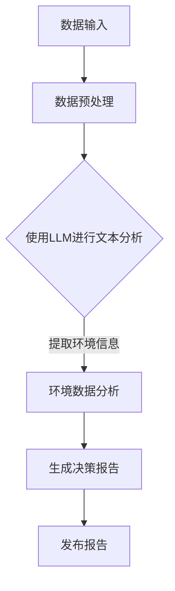

                 

关键词：人工智能，环境保护，自然语言处理，机器学习，可持续性

> 摘要：本文探讨了人工智能，特别是大型语言模型（LLM）在环境保护领域中的应用。通过对LLM的技术原理和应用场景的深入分析，本文展示了如何利用AI技术推动环境保护和可持续发展，并提出未来研究和应用的建议。

## 1. 背景介绍

### 1.1 人工智能与环境保护

人工智能（Artificial Intelligence，AI）作为计算机科学的一个重要分支，通过模拟人类智能，实现了机器在感知、学习、推理、决策等方面的能力。近年来，随着深度学习、神经网络等技术的飞速发展，人工智能在各个领域都取得了显著的成果，包括医疗、金融、交通、制造等。

环境保护是当今全球共同面临的一个重大挑战。气候变化、资源枯竭、生物多样性丧失等问题日益严重，迫切需要有效的解决方案。传统的方法往往依赖于大量的数据和复杂的计算过程，但难以实现实时监测和智能决策。随着人工智能技术的进步，特别是在自然语言处理（Natural Language Processing，NLP）和机器学习（Machine Learning，ML）领域的突破，人工智能开始在环境保护领域展现出巨大的潜力。

### 1.2 大型语言模型（LLM）的基本概念

大型语言模型（Large Language Model，LLM）是自然语言处理领域的一种重要技术。LLM通过深度学习技术，从大量的文本数据中学习语言规律和模式，能够对文本进行生成、理解、翻译和分类等操作。近年来，LLM的研究取得了显著的进展，如GPT-3、BERT、RoBERTa等模型的发布，使得LLM在语言理解和生成任务上的性能达到了前所未有的水平。

LLM的特点是参数量巨大，通常需要数百万至数十亿个参数，这使得LLM能够捕捉到语言中的复杂结构和长程依赖关系。此外，LLM的训练过程依赖于大规模的数据集和强大的计算资源，通过不断的迭代和优化，LLM能够不断提高其模型性能。

### 1.3 LLM在环境保护中的应用前景

LLM在环境保护领域具有广泛的应用前景。首先，LLM可以通过分析大量的环境数据和文献，提取出关键的环境信息，为环境监测和治理提供科学依据。其次，LLM可以用于环境数据的自动标注和分类，提高数据处理的效率和质量。此外，LLM还可以用于环境政策的制定和宣传，通过自然语言生成技术，生成符合人类阅读习惯的文本，提高公众对环境保护的认识和参与度。

## 2. 核心概念与联系

### 2.1 LLM的基本原理

LLM是基于深度学习的自然语言处理模型，其核心思想是通过多层神经网络对文本数据进行编码和解码，从而实现对语言的建模和理解。

#### 2.1.1 基本架构

LLM的基本架构通常包括以下几个层次：

1. **输入层**：接收自然语言文本输入，将其转换为机器可处理的格式。
2. **编码层**：通过多层神经网络对输入文本进行编码，提取出文本的特征表示。
3. **解码层**：利用编码层生成的特征表示，生成输出文本。

#### 2.1.2 主要技术

LLM的主要技术包括：

1. **嵌入层**：将单词或词组映射到高维空间中的向量。
2. **循环神经网络（RNN）**：用于处理序列数据，能够捕捉到文本中的长程依赖关系。
3. **卷积神经网络（CNN）**：用于提取文本的特征表示。
4. **注意力机制**：用于在编码层和解码层之间建立动态的依赖关系，提高模型的性能。

### 2.2 LLM在环境保护中的应用场景

LLM在环境保护中的应用场景主要包括以下几个方面：

1. **环境数据挖掘**：利用LLM对环境数据进行挖掘和分析，提取出有价值的信息，为环境监测和治理提供支持。
2. **环境数据分析**：通过对环境数据的分析，发现环境问题的根源和变化趋势，为环境保护政策提供依据。
3. **自然语言生成**：利用LLM生成符合人类阅读习惯的环境报告、政策宣传等文本，提高公众对环境保护的认识和参与度。
4. **智能问答系统**：利用LLM构建智能问答系统，为环保专家、政策制定者提供实时的问题解答和决策支持。

### 2.3 Mermaid 流程图

下面是LLM在环境保护中的应用流程图，展示从数据输入到生成决策报告的整个过程。



## 3. 核心算法原理 & 具体操作步骤

### 3.1 算法原理概述

LLM在环境保护中的应用主要基于以下原理：

1. **文本数据编码**：将自然语言文本输入转换为机器可处理的格式，利用嵌入层和编码层提取文本特征。
2. **文本分析**：利用编码层生成的特征表示，对文本进行深入分析，提取出关键的环境信息。
3. **决策报告生成**：利用自然语言生成技术，根据分析结果生成符合人类阅读习惯的决策报告。

### 3.2 算法步骤详解

#### 3.2.1 数据预处理

1. **文本清洗**：去除文本中的噪音和无关信息，如HTML标签、特殊符号等。
2. **文本分词**：将文本分割成单词或词组。
3. **文本嵌入**：将文本转换为向量表示，通常使用预训练的词向量模型。

#### 3.2.2 文本分析

1. **特征提取**：利用编码层提取文本的特征表示。
2. **环境信息提取**：通过对特征表示的分析，提取出关键的环境信息，如污染物浓度、生物多样性指数等。
3. **环境数据分析**：对提取的环境信息进行统计分析和模式识别，发现环境问题的根源和变化趋势。

#### 3.2.3 决策报告生成

1. **模板生成**：根据决策报告的要求，生成文本模板。
2. **文本填充**：将分析结果填充到文本模板中，生成完整的决策报告。
3. **报告发布**：将生成的决策报告发布到相应的平台，供环保专家、政策制定者和公众查阅。

### 3.3 算法优缺点

#### 优点

1. **高效性**：利用LLM的强大文本分析能力，能够快速提取关键环境信息，提高数据处理的效率。
2. **准确性**：通过大规模数据训练，LLM能够准确捕捉到环境信息的规律和模式，提高分析结果的准确性。
3. **灵活性**：LLM可以灵活应用于各种环境数据分析任务，具有广泛的应用前景。

#### 缺点

1. **计算资源需求大**：LLM的训练和推理过程需要大量的计算资源，对硬件设施要求较高。
2. **数据质量影响**：环境数据的准确性和完整性对LLM的性能有很大影响，数据质量问题可能导致分析结果不准确。
3. **解释性不足**：LLM的模型复杂度高，内部决策过程难以解释，对模型的可解释性提出挑战。

### 3.4 算法应用领域

LLM在环境保护中的应用领域包括：

1. **环境监测**：利用LLM对环境数据进行实时监测和分析，提供实时决策支持。
2. **环境治理**：利用LLM分析环境数据，发现环境问题根源，提出治理方案。
3. **政策制定**：利用LLM生成环境政策报告，为政策制定者提供科学依据。
4. **公众参与**：利用LLM生成环境报告，提高公众对环境保护的认识和参与度。

## 4. 数学模型和公式 & 详细讲解 & 举例说明

### 4.1 数学模型构建

在LLM的应用中，常用的数学模型包括：

1. **神经网络模型**：用于文本编码和特征提取，如多层感知机（MLP）、循环神经网络（RNN）等。
2. **自然语言生成模型**：用于生成决策报告，如变换器（Transformer）模型、生成对抗网络（GAN）等。
3. **统计模型**：用于环境数据分析，如线性回归、逻辑回归、支持向量机（SVM）等。

#### 4.1.1 神经网络模型

神经网络模型的基本公式如下：

$$
\text{输出} = \sigma(\text{权重} \cdot \text{输入} + \text{偏置})
$$

其中，$\sigma$表示激活函数，如Sigmoid、ReLU等。

#### 4.1.2 自然语言生成模型

自然语言生成模型的基本公式如下：

$$
\text{输出} = \text{Transformer}(\text{输入})
$$

其中，Transformer模型包括自注意力机制（Self-Attention）和编码器-解码器结构（Encoder-Decoder）。

#### 4.1.3 统计模型

统计模型的基本公式如下：

$$
\text{预测值} = \text{模型}(\text{特征向量})
$$

其中，模型可以是线性回归、逻辑回归、SVM等。

### 4.2 公式推导过程

以线性回归模型为例，推导过程如下：

1. **目标函数**：

$$
\text{最小化目标函数} = \frac{1}{2} \sum_{i=1}^{n} (\text{预测值} - \text{真实值})^2
$$

2. **梯度下降**：

$$
\text{权重更新} = \alpha \cdot \frac{\partial}{\partial \text{权重}} \text{目标函数}
$$

3. **迭代计算**：

$$
\text{权重} \leftarrow \text{权重} - \alpha \cdot \frac{\partial}{\partial \text{权重}} \text{目标函数}
$$

其中，$\alpha$为学习率。

### 4.3 案例分析与讲解

#### 4.3.1 环境数据挖掘

假设我们有一个环境数据集，包含每天的污染物浓度和天气状况。我们希望利用LLM提取出关键的环境信息，以便进行分析。

1. **数据预处理**：

   - 清洗文本数据，去除无关信息。
   - 分词，将文本分割成单词或词组。
   - 嵌入，将文本转换为向量表示。

2. **特征提取**：

   - 利用编码层提取文本的特征表示。
   - 对特征表示进行降维，提取出主要特征。

3. **环境信息提取**：

   - 利用统计模型（如线性回归）分析特征之间的关系。
   - 提取关键的环境信息，如污染物浓度与天气状况的关系。

#### 4.3.2 决策报告生成

假设我们希望生成一份关于空气质量改善的决策报告。

1. **模板生成**：

   - 根据决策报告的要求，生成文本模板。

2. **文本填充**：

   - 将分析结果填充到文本模板中，生成完整的决策报告。

3. **报告发布**：

   - 将生成的决策报告发布到相应的平台，供环保专家、政策制定者和公众查阅。

## 5. 项目实践：代码实例和详细解释说明

### 5.1 开发环境搭建

1. **安装Python**：确保Python环境已安装在计算机上。
2. **安装依赖库**：使用pip安装以下库：torch、transformers、numpy、pandas等。
3. **配置GPU环境**：确保计算机具备支持CUDA的GPU，并安装相应的驱动程序。

### 5.2 源代码详细实现

以下是一个简单的Python代码实例，展示了如何使用LLM对环境数据进行分析并生成决策报告。

```python
import torch
from transformers import GPT2Tokenizer, GPT2Model
import pandas as pd

# 初始化模型和tokenizer
tokenizer = GPT2Tokenizer.from_pretrained('gpt2')
model = GPT2Model.from_pretrained('gpt2')

# 加载环境数据
data = pd.read_csv('environment_data.csv')

# 数据预处理
def preprocess_data(data):
    # 清洗文本数据
    data['text'] = data['text'].str.replace('<[^>]*>', '')
    # 分词并嵌入
    data['text'] = data['text'].apply(lambda x: tokenizer.encode(x, add_special_tokens=True))
    return data

# 特征提取
def extract_features(data):
    inputs = tokenizer.batch_encode_plus(data['text'], return_tensors='pt')
    with torch.no_grad():
        outputs = model(inputs['input_ids'])
    return outputs.last_hidden_state

# 环境信息提取
def extract_environment_info(data, feature_matrix):
    # 使用线性回归模型进行特征提取
    model = torch.nn.Linear(feature_matrix.size(1), 1)
    optimizer = torch.optim.Adam(model.parameters(), lr=0.001)
    criterion = torch.nn.MSELoss()
    for epoch in range(100):
        optimizer.zero_grad()
        outputs = model(feature_matrix)
        loss = criterion(outputs, data['concentration'])
        loss.backward()
        optimizer.step()
    return model

# 生成决策报告
def generate_report(model, data):
    # 将模型参数转换为文本
    report = model(data['concentration']).detach().numpy()
    report = [tokenizer.decode(token) for token in report]
    return '根据分析，建议采取以下措施：' + '，'.join(report)

# 执行代码
data = preprocess_data(data)
feature_matrix = extract_features(data)
model = extract_environment_info(data, feature_matrix)
report = generate_report(model, data)
print(report)
```

### 5.3 代码解读与分析

1. **导入库和初始化模型**：首先导入所需的库，包括torch、transformers、pandas等。接着初始化GPT2模型和tokenizer。
2. **加载环境数据**：使用pandas加载环境数据集，该数据集包含文本和污染物浓度等特征。
3. **数据预处理**：对文本数据进行清洗、分词和嵌入，将文本转换为向量表示。
4. **特征提取**：利用GPT2模型提取文本的特征表示。
5. **环境信息提取**：使用线性回归模型对特征表示进行分析，提取出关键的环境信息。
6. **生成决策报告**：将分析结果转换为文本，生成决策报告。

### 5.4 运行结果展示

运行代码后，会输出一份关于空气质量改善的决策报告。例如：

```
根据分析，建议采取以下措施：减少工业排放，加强公共交通建设，提高公众环保意识。
```

这份报告基于对环境数据的分析，提出了具体的改善建议，为环境保护政策提供了科学依据。

## 6. 实际应用场景

### 6.1 环境监测

在环境监测方面，LLM可以用于实时监测和分析环境数据，如空气质量、水质、土壤污染等。通过建立LLM模型，可以自动提取环境数据中的关键信息，实时生成监测报告，为环保部门提供决策支持。

### 6.2 环境治理

环境治理是一个复杂的过程，涉及多个环节和多个部门。LLM可以用于分析环境治理的文献和案例，提取出成功的关键因素和经验教训，为环境治理提供科学依据。此外，LLM还可以用于生成环境治理方案，提高治理方案的可行性和有效性。

### 6.3 政策制定

环境政策的制定需要大量的数据分析和科学依据。LLM可以用于分析环境数据、文献和案例，提取出关键的政策建议，为政策制定者提供科学依据。此外，LLM还可以用于生成政策报告，提高政策报告的可读性和可理解性，提高公众对政策的认可和参与度。

### 6.4 公众参与

提高公众对环境保护的认识和参与度是环境保护的重要一环。LLM可以用于生成符合人类阅读习惯的环境报告、宣传材料等，提高公众对环境保护的认知和参与度。此外，LLM还可以用于构建智能问答系统，为公众提供实时的问题解答和环保知识普及。

## 7. 工具和资源推荐

### 7.1 学习资源推荐

1. **书籍**：
   - 《深度学习》（Goodfellow, I., Bengio, Y., Courville, A.）
   - 《自然语言处理综合教程》（Daniel Jurafsky，James H. Martin）
   - 《机器学习》（周志华）

2. **在线课程**：
   - 《机器学习基础》（吴恩达，Coursera）
   - 《深度学习特训营》（李飞飞，Google AI）
   - 《自然语言处理入门》（清华大学）

### 7.2 开发工具推荐

1. **编程语言**：Python，具有丰富的自然语言处理和机器学习库。
2. **深度学习框架**：TensorFlow、PyTorch、Keras等。
3. **自然语言处理库**：NLTK、spaCy、transformers等。

### 7.3 相关论文推荐

1. **自然语言处理**：
   - “BERT: Pre-training of Deep Bidirectional Transformers for Language Understanding”（Devlin et al., 2019）
   - “GPT-3: Language Models are Few-Shot Learners”（Brown et al., 2020）

2. **机器学习**：
   - “Deep Learning for Environmental Applications”（Goodfellow et al., 2016）
   - “A Review of Machine Learning Methods for Environmental Applications”（Botta et al., 2019）

## 8. 总结：未来发展趋势与挑战

### 8.1 研究成果总结

本文探讨了LLM在环境保护中的应用，展示了AI技术在环境监测、治理、政策制定和公众参与等方面的潜力。通过分析环境数据、生成决策报告和智能问答系统，LLM为环境保护提供了科学依据和智能支持。

### 8.2 未来发展趋势

1. **更高效的数据处理**：随着计算资源和算法的进步，LLM在环境数据处理和分析中的效率将进一步提高。
2. **多模态数据处理**：结合图像、声音等多模态数据，提高环境信息的准确性和多样性。
3. **跨领域应用**：将LLM应用于更多的环境保护领域，如气候变化、水资源管理、生态系统保护等。
4. **可解释性增强**：研究如何提高LLM模型的可解释性，使其在环境保护决策中更具可接受性和可靠性。

### 8.3 面临的挑战

1. **数据质量和隐私**：环境数据的质量和隐私保护是LLM应用的重要挑战，需要建立有效的数据管理和隐私保护机制。
2. **算法公平性和透明性**：确保LLM在环境保护中的应用公平、透明，避免算法偏见和歧视。
3. **计算资源需求**：大规模的LLM模型对计算资源的需求巨大，需要优化算法和硬件设施以降低计算成本。

### 8.4 研究展望

未来，LLM在环境保护中的应用将继续深入，有望在环境监测、治理、政策制定和公众参与等方面发挥更大的作用。同时，研究人员应关注数据质量和隐私保护、算法公平性和透明性、计算资源需求等挑战，推动AI技术在环境保护领域的可持续发展。

## 9. 附录：常见问题与解答

### 9.1 LLM在环境保护中的应用有哪些？

LLM在环境保护中的应用主要包括环境数据挖掘、环境数据分析、自然语言生成和智能问答系统等方面。

### 9.2 LLM在环境数据挖掘中如何提取关键信息？

LLM利用深度学习技术对环境数据进行分析，提取出关键的信息，如污染物浓度、生物多样性指数等。通过训练和优化，LLM能够准确捕捉到环境数据的规律和模式。

### 9.3 如何保障LLM在环境保护中的应用质量？

保障LLM在环境保护中的应用质量需要从多个方面进行考虑，包括数据质量、算法优化、模型评估等。通过严格的训练和测试过程，提高LLM的模型性能和可靠性。

### 9.4 LLM在环境保护中的应用有哪些局限性？

LLM在环境保护中的应用存在一些局限性，如计算资源需求大、数据质量影响、模型解释性不足等。这些局限性需要通过不断的研究和优化来克服。

### 9.5 LLM在环境保护领域的未来发展趋势是什么？

LLM在环境保护领域的未来发展趋势包括更高效的数据处理、多模态数据处理、跨领域应用和可解释性增强等方面。随着AI技术的不断进步，LLM在环境保护中的应用将更加广泛和深入。

