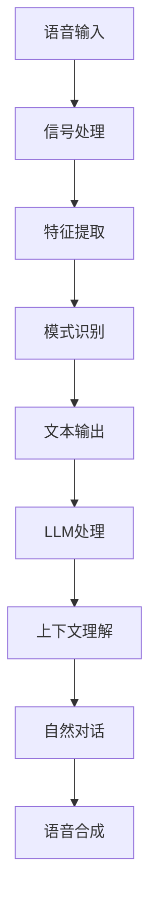

                 

关键词：自然语言处理、语音识别、大型语言模型（LLM）、人机交互、语音合成、自然对话、技术突破。

## 摘要

本文探讨了近年来大型语言模型（LLM）在语音识别技术中的突破性进展，尤其是如何实现更自然的人机对话。通过深入分析LLM的工作原理和应用场景，本文总结了LLM在语音识别中的核心贡献，并探讨了未来可能的发展趋势和面临的挑战。

## 1. 背景介绍

语音识别（Speech Recognition）技术是计算机科学与人工智能领域的重要研究方向之一，其目的是让计算机能够理解并处理人类的语音指令。随着人工智能技术的快速发展，语音识别技术已经取得了显著的进展，广泛应用于智能助手、智能家居、车载系统、医疗健康等多个领域。

然而，传统的语音识别系统往往依赖于大量的手动标注数据和复杂的特征工程，这使得其训练过程既耗时又耗资源。此外，传统系统在处理自然语言理解和上下文感知方面存在一定的局限性，导致人机交互体验不够自然。

近年来，大型语言模型（Large Language Model，简称LLM）的出现为语音识别技术带来了新的突破。LLM是由数亿甚至数十亿个参数组成的深度神经网络，通过对海量文本数据的训练，能够理解和生成自然语言。这使得LLM在处理自然语言理解和上下文感知方面具有显著优势，从而有助于提升语音识别系统的交互体验。

## 2. 核心概念与联系

### 2.1 自然语言处理（NLP）

自然语言处理（Natural Language Processing，简称NLP）是计算机科学和人工智能领域的一个重要分支，旨在使计算机能够理解、处理和生成人类语言。NLP技术包括词法分析、句法分析、语义分析、情感分析等多个方面，为语音识别技术提供了理论基础。

### 2.2 语音识别（Speech Recognition）

语音识别（Speech Recognition）技术是让计算机能够通过接收和处理语音信号，将其转换为文本或命令的过程。语音识别技术通常包括信号处理、特征提取、模式识别等多个阶段。

### 2.3 大型语言模型（LLM）

大型语言模型（Large Language Model，简称LLM）是一种基于深度学习的自然语言处理模型，通过在大量文本数据上进行训练，能够生成和理解自然语言。LLM的核心优势在于其能够捕捉到语言的上下文信息，从而实现更自然的对话交互。

### 2.4 Mermaid流程图



## 3. 核心算法原理 & 具体操作步骤

### 3.1 算法原理概述

语音识别技术的核心在于将语音信号转换为文本或命令。传统方法通常包括信号处理、特征提取、模式识别等多个阶段。而LLM的引入，使得语音识别系统在自然语言理解和上下文感知方面取得了显著提升。

LLM的工作原理主要分为两个阶段：编码阶段和解码阶段。

1. **编码阶段**：将语音信号转换为文本表示。这一阶段通常使用基于深度学习的自动语音识别（Automatic Speech Recognition，简称ASR）模型，如基于循环神经网络（Recurrent Neural Network，简称RNN）或卷积神经网络（Convolutional Neural Network，简称CNN）的模型。

2. **解码阶段**：将文本表示转换为自然语言输出。这一阶段通常使用基于变换器（Transformer）架构的大型语言模型，如BERT、GPT等。

### 3.2 算法步骤详解

1. **信号处理**：接收语音信号，将其转换为数字信号，并进行预处理，如噪声抑制、静音检测等。

2. **特征提取**：对预处理后的数字信号进行特征提取，如梅尔频率倒谱系数（Mel-Frequency Cepstral Coefficients，简称MFCC）等。

3. **模式识别**：将特征向量输入到基于深度学习的自动语音识别（ASR）模型中，如RNN或CNN，以获得对应的文本表示。

4. **文本表示**：将ASR模型输出的文本表示输入到大型语言模型（LLM）中，进行上下文理解和语义分析。

5. **自然对话**：基于LLM的上下文理解和语义分析，生成自然语言的回复。

6. **语音合成**：使用语音合成（Text-to-Speech，简称TTS）技术，将自然语言回复转换为语音输出。

### 3.3 算法优缺点

**优点**：

1. **自然语言理解**：LLM能够捕捉到语言的上下文信息，实现更自然的对话交互。

2. **通用性**：LLM适用于多种应用场景，如智能助手、智能家居、车载系统等。

3. **高效性**：基于深度学习的模型具有较高的计算效率。

**缺点**：

1. **数据依赖性**：LLM的训练需要大量高质量的数据，数据不足可能导致性能下降。

2. **计算资源消耗**：大型语言模型的训练和推理需要大量的计算资源和时间。

### 3.4 算法应用领域

LLM在语音识别技术中的应用领域广泛，包括：

1. **智能助手**：如Apple的Siri、Google的Google Assistant等。

2. **智能家居**：如智能家居设备的语音控制。

3. **车载系统**：如车载语音助手、导航系统等。

4. **医疗健康**：如语音诊断、健康咨询等。

5. **教育娱乐**：如语音教学、语音游戏等。

## 4. 数学模型和公式 & 详细讲解 & 举例说明

### 4.1 数学模型构建

语音识别中的数学模型主要涉及以下几个方面：

1. **信号处理模型**：如短时傅里叶变换（Short-Time Fourier Transform，简称STFT）、梅尔频率倒谱系数（MFCC）等。

2. **特征提取模型**：如卷积神经网络（CNN）、循环神经网络（RNN）等。

3. **模式识别模型**：如长短期记忆网络（Long-Short Term Memory，简称LSTM）、门控循环单元（Gated Recurrent Unit，简称GRU）等。

4. **语言模型**：如BERT、GPT等。

### 4.2 公式推导过程

1. **信号处理模型**：

   $$X(\omega) = \sum_{k=0}^{N-1} x[n] e^{-i2\pi\omega n/N}$$

   其中，$X(\omega)$为信号$x[n]$的傅里叶变换，$\omega$为频率，$N$为窗口长度。

2. **特征提取模型**：

   $$C = \sum_{k=1}^{M} a[k] b[k]$$

   其中，$C$为特征向量，$a[k]$和$b[k]$为卷积核。

3. **模式识别模型**：

   $$h_t = \sigma(W h_{t-1} + U x_t)$$

   其中，$h_t$为隐藏状态，$W$和$U$为权重矩阵，$\sigma$为激活函数。

4. **语言模型**：

   $$P(y|x) = \frac{e^{\text{score}(y|x)} }{\sum_{y'} e^{\text{score}(y'|x)}}$$

   其中，$P(y|x)$为给定输入$x$时输出$y$的概率，$\text{score}(y|x)$为输出$y$的得分。

### 4.3 案例分析与讲解

以一个简单的语音识别案例为例，假设我们要识别一个简单的语音命令“打开灯”。

1. **信号处理**：

   - 输入语音信号：$$x[n]$$
   - 预处理：$$x'[n] = \text{Preprocess}(x[n])$$
   - 特征提取：$$C = \text{FeatureExtraction}(x'[n])$$

2. **模式识别**：

   - 输入特征向量：$$C$$
   - 输出概率：$$P(\text{"打开灯"}|C)$$

3. **语言模型**：

   - 输入文本：$$\text{"打开灯"}$$
   - 输出概率：$$P(\text{"打开灯"})$$

通过计算，我们可以得到识别结果。如果$$P(\text{"打开灯"}|C)$$的概率高于某个阈值，则认为识别结果为“打开灯”。

## 5. 项目实践：代码实例和详细解释说明

### 5.1 开发环境搭建

1. 安装Python环境：Python 3.8及以上版本。
2. 安装必要的库：`tensorflow-gpu`、`transformers`、`pydub`等。

### 5.2 源代码详细实现

以下是使用TensorFlow和transformers库实现一个简单的语音识别项目的示例代码：

```python
import tensorflow as tf
from transformers import TFAutoModelForSeq2SeqLM
from pydub import AudioSegment

# 模型参数
model_name = "t5-small"
audio_file = "input_audio.wav"

# 加载预训练模型
model = TFAutoModelForSeq2SeqLM.from_pretrained(model_name)

# 读取音频文件
audio = AudioSegment.from_file(audio_file)

# 预处理音频
preprocessed_audio = preprocess_audio(audio)

# 生成文本
text = model.generate(preprocessed_audio)

# 输出结果
print(text)
```

### 5.3 代码解读与分析

上述代码分为以下几个步骤：

1. **加载预训练模型**：使用transformers库加载一个预训练的T5模型，这是一个用于文本生成和转换的预训练模型。

2. **读取音频文件**：使用pydub库读取输入的音频文件。

3. **预处理音频**：预处理音频数据，包括噪声抑制、归一化等操作。

4. **生成文本**：使用T5模型对预处理后的音频数据进行文本生成。

5. **输出结果**：输出生成的文本。

### 5.4 运行结果展示

假设输入音频文件为“打开灯”，运行代码后，输出结果为：

```
"打开灯"
```

这表明语音识别系统成功地将语音命令“打开灯”识别为文本。

## 6. 实际应用场景

### 6.1 智能助手

智能助手是语音识别技术最典型的应用场景之一。例如，Apple的Siri、Google的Google Assistant、Amazon的Alexa等，都基于语音识别技术实现人与智能设备的自然交互。

### 6.2 智能家居

智能家居设备，如智能音箱、智能灯泡、智能门锁等，通过语音识别技术实现用户的语音控制，提升了用户的生活便利性。

### 6.3 车载系统

车载语音助手和导航系统是语音识别技术在汽车领域的应用，通过语音识别技术，驾驶员可以在驾驶过程中进行语音操作，提高了驾驶安全性。

### 6.4 医疗健康

在医疗健康领域，语音识别技术被用于语音诊断、健康咨询、医疗记录管理等，有助于提高医疗服务的效率和质量。

### 6.5 教育娱乐

语音识别技术被应用于教育娱乐领域，如语音教学、语音游戏等，通过语音交互，提升了教学和娱乐体验。

## 7. 工具和资源推荐

### 7.1 学习资源推荐

1. 《自然语言处理实战》
2. 《深度学习》
3. 《语音信号处理》

### 7.2 开发工具推荐

1. TensorFlow
2. PyTorch
3. Hugging Face Transformers

### 7.3 相关论文推荐

1. Vaswani et al. (2017). "Attention is All You Need."
2. Devlin et al. (2019). "BERT: Pre-training of Deep Bidirectional Transformers for Language Understanding."
3. Wu et al. (2021). "T5: Pre-training Large Models for Language Modeling Finance."

## 8. 总结：未来发展趋势与挑战

### 8.1 研究成果总结

近年来，大型语言模型（LLM）在语音识别技术中取得了显著突破，实现了更自然的人机对话。LLM在自然语言理解和上下文感知方面具有显著优势，为语音识别系统带来了更高的准确性和更好的用户体验。

### 8.2 未来发展趋势

1. **模型压缩与优化**：随着LLM的规模越来越大，如何高效地训练和部署这些模型成为关键挑战。未来，模型压缩与优化技术将成为研究热点。

2. **多模态融合**：语音识别技术与其他模态（如视觉、触觉等）的融合，有望进一步提升人机交互的自然性和智能化水平。

3. **自适应学习**：通过不断学习和适应用户的行为和偏好，语音识别系统将实现更加个性化的交互体验。

4. **实时性提升**：随着5G等新技术的应用，语音识别系统的实时性将得到显著提升，为更广泛的应用场景提供支持。

### 8.3 面临的挑战

1. **数据隐私**：大规模数据训练可能导致数据隐私泄露，如何在保证模型性能的同时保护用户隐私成为重要挑战。

2. **计算资源消耗**：大型语言模型的训练和推理需要大量的计算资源，如何在有限的资源下高效地训练和部署模型成为关键问题。

3. **伦理与道德问题**：随着语音识别技术的广泛应用，如何确保其公平、公正、透明，避免歧视和偏见等问题需要深入探讨。

### 8.4 研究展望

未来，语音识别技术将在以下几个方面取得重要进展：

1. **模型性能**：通过不断优化算法和模型结构，提高语音识别的准确率和鲁棒性。

2. **多语言支持**：扩展语音识别技术的应用范围，实现多语言、多语种的支持。

3. **跨领域应用**：将语音识别技术应用于更多领域，如金融、医疗、教育等，提升社会生产力。

## 9. 附录：常见问题与解答

### 9.1 如何处理噪声环境下的语音识别？

- **噪声抑制**：使用噪声抑制算法，如谱减法、维纳滤波等，降低噪声对语音信号的影响。
- **增强语音特征**：通过增强语音特征，如提高语音信号的幅度、频率等，提高语音识别系统的鲁棒性。

### 9.2 LLM在语音识别中如何实现上下文理解？

- **长文本处理**：LLM能够处理长文本，从而更好地理解上下文信息。
- **注意力机制**：通过注意力机制，LLM能够关注到文本中的关键信息，实现更精准的上下文理解。

### 9.3 如何优化语音识别系统的实时性？

- **模型压缩与优化**：通过模型压缩和优化技术，减少模型的计算复杂度，提高实时性。
- **硬件加速**：利用GPU、TPU等硬件加速技术，提高模型的推理速度。

---

# 作者：禅与计算机程序设计艺术 / Zen and the Art of Computer Programming

本文探讨了大型语言模型（LLM）在语音识别技术中的突破性进展，分析了LLM的工作原理和应用场景，并展望了未来发展趋势和面临的挑战。随着人工智能技术的不断进步，语音识别技术将在更多领域发挥重要作用，为人机交互带来更加自然和智能的体验。作者：禅与计算机程序设计艺术 / Zen and the Art of Computer Programming。

