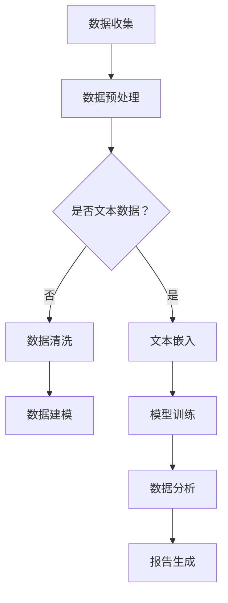

                 

### 背景介绍

商业智能（Business Intelligence，BI）分析作为企业提升竞争力和决策能力的重要工具，已有数十年的发展历程。传统的BI分析方法主要依赖于数据仓库、数据挖掘和统计建模等技术，通过对大量历史数据的挖掘和分析，为企业提供决策支持。然而，随着大数据的爆炸性增长，传统的BI方法在处理速度、分析深度和实时性方面逐渐暴露出局限性。

近年来，大型语言模型（Large Language Models，LLM）如GPT-3、ChatGPT等的问世，为商业智能分析带来了全新的变革。LLM通过深度学习从海量数据中学习规律，具备强大的自然语言理解和生成能力，能够在各种复杂场景下进行智能化数据分析。这使得商业智能分析不再局限于历史数据的挖掘，而是可以实时获取并理解当前的市场动态，提供更加精准和及时的决策支持。

本文将深入探讨LLM对传统商业智能分析的革新，首先介绍LLM的核心概念和原理，接着分析其在商业智能分析中的具体应用，然后探讨LLM的数学模型和算法，并结合实际案例进行代码实现和分析。最后，我们将讨论LLM在商业智能分析中的未来发展趋势和应用前景。

### 核心概念与联系

#### 大型语言模型（LLM）

大型语言模型（LLM）是一种基于深度学习的技术，通过从海量文本数据中学习，实现了对自然语言的高度理解和生成能力。LLM通常由多个层级的多层神经网络组成，每个层级都能提取不同层次的语言特征。这些模型通过无监督学习从互联网上的大量文本中获取知识，从而在给定一个单词或短语的上下文时，能够生成相关且连贯的文本。

#### 传统商业智能分析

传统的商业智能分析依赖于数据仓库、数据挖掘和统计建模等技术。数据仓库作为数据存储的中心，将企业内外部的数据进行整合；数据挖掘则通过算法从海量数据中提取出有价值的模式和信息；统计建模则利用统计学方法对数据进行预测和分析，为企业提供决策支持。

#### LLM与BI分析的联系

LLM与商业智能分析的联系主要体现在以下几个方面：

1. **自然语言处理**：LLM的强大自然语言处理能力，使得企业可以更加方便地处理和分析文本数据，而不需要复杂的结构化数据预处理。

2. **实时性**：LLM能够实时地从大量文本数据中提取信息，为企业提供即时的决策支持。

3. **深度分析**：LLM可以从文本数据中提取更深层次的信息和模式，提供比传统BI方法更加丰富和细致的分析结果。

4. **自动化**：LLM可以自动化地进行数据分析和报告生成，减轻了数据分析人员的负担，提高了工作效率。

#### Mermaid流程图

下面是一个简化的Mermaid流程图，展示了LLM在商业智能分析中的应用流程：



**节点解释**：

- **A 数据收集**：从各种数据源收集原始数据。
- **B 数据预处理**：对数据进行清洗和格式化，为后续分析做准备。
- **C 是否文本数据？**：判断数据是否为文本数据。
- **D 文本嵌入**：将文本数据转换为向量的形式，便于模型处理。
- **E 数据清洗**：对非文本数据进行清洗和格式化。
- **F 数据建模**：利用传统方法对结构化数据进行建模。
- **G 模型训练**：使用LLM对文本数据或结构化数据进行训练。
- **H 数据分析**：利用LLM进行数据分析和生成报告。
- **I 报告生成**：生成可视化报告，提供决策支持。

通过上述流程，LLM能够与传统商业智能分析方法相结合，提供更加智能化和高效的数据分析解决方案。

### 核心算法原理 & 具体操作步骤

#### 算法原理概述

大型语言模型（LLM）的核心原理是基于深度学习的自然语言处理技术。LLM通常由多层神经网络组成，包括编码器和解码器。编码器将输入的文本转换为向量表示，解码器则根据向量表示生成对应的输出文本。LLM通过无监督学习从海量文本数据中学习语言规律，从而实现文本的理解和生成。

LLM的工作流程可以分为以下几个步骤：

1. **数据预处理**：对原始文本数据进行清洗和格式化，去除无用的信息，如HTML标签、停用词等。
2. **文本嵌入**：将预处理后的文本数据转换为向量表示。常用的文本嵌入方法包括Word2Vec、BERT等。
3. **模型训练**：使用预训练的LLM模型，通过反向传播算法对模型参数进行优化，使其能够更好地理解文本数据。
4. **文本生成**：通过解码器生成文本输出。输入一个起始文本或提示，LLM会根据输入的上下文生成相关的文本。

#### 算法步骤详解

下面是LLM在商业智能分析中的具体操作步骤：

1. **数据收集**：从企业内外部数据源收集原始数据，包括销售数据、客户反馈、市场报告等。
2. **数据预处理**：对收集到的数据进行清洗和格式化，包括去除HTML标签、标准化文本格式、去除停用词等。
3. **文本嵌入**：使用预训练的文本嵌入模型，如BERT，将预处理后的文本转换为向量表示。这一步的目的是将文本数据转换为模型可以处理的数值形式。
4. **模型训练**：使用收集到的文本数据进行模型训练。通过训练，模型能够学习到文本中的语言规律和知识，从而提高对文本数据的理解和生成能力。
5. **数据分析**：利用训练好的LLM模型，对新的文本数据进行分析。LLM可以生成关于市场趋势、客户需求、竞争对手分析等的高质量报告，为企业提供决策支持。
6. **报告生成**：根据分析结果，生成可视化报告，包括图表、文本总结等。报告可以实时更新，反映当前的市场动态和趋势。

#### 算法优缺点

LLM在商业智能分析中具有以下优点：

1. **强大的自然语言理解能力**：LLM能够理解和生成自然语言文本，从而大大简化了数据分析的过程，提高了分析的效率。
2. **实时性**：LLM能够实时处理和分析文本数据，为企业提供即时的决策支持。
3. **深度分析**：LLM可以从文本数据中提取深层次的信息和模式，提供比传统BI方法更加丰富和细致的分析结果。
4. **自动化**：LLM可以自动化地进行数据分析和报告生成，减轻了数据分析人员的负担，提高了工作效率。

然而，LLM也存在一些缺点：

1. **数据依赖性**：LLM的性能高度依赖于训练数据的质量和数量。如果训练数据存在偏差或缺失，可能会导致分析结果的不准确。
2. **解释性差**：尽管LLM能够生成高质量的文本，但其工作过程是黑箱化的，难以解释和验证。
3. **计算资源消耗大**：训练和部署LLM模型需要大量的计算资源和时间，这对企业IT基础设施提出了较高的要求。

#### 算法应用领域

LLM在商业智能分析中的广泛应用领域包括：

1. **客户需求分析**：通过对客户反馈、评论等文本数据的分析，LLM可以识别客户的需求和偏好，帮助企业制定更有效的市场营销策略。
2. **市场趋势预测**：LLM可以从大量的市场报告、新闻文章中提取信息，预测市场的未来趋势，为企业的战略决策提供依据。
3. **竞争对手分析**：LLM可以分析竞争对手的公开信息，包括产品介绍、广告文案等，帮助企业了解竞争对手的策略和优势。
4. **风险分析**：LLM可以从历史数据中识别潜在的金融风险和市场风险，为企业提供风险预警和应对策略。

### 数学模型和公式

#### 数学模型构建

在LLM中，文本数据通常通过词嵌入（Word Embedding）技术转换为向量表示。词嵌入模型的核心是一个线性变换矩阵W，它将输入的单词向量转换为高维空间中的向量表示。词嵌入模型的数学模型可以表示为：

$$
\text{Embedding}(x) = W \cdot x
$$

其中，x是输入的单词向量，W是词嵌入矩阵。通过这种方式，文本数据被映射到一个高维空间，使得具有相似意义的单词在空间中更接近。

#### 公式推导过程

词嵌入模型的推导过程基于神经网络的权重共享（Weight Sharing）原理。假设我们有一个神经网络模型，它用于分类或回归任务。神经网络的输入层包含多个神经元，每个神经元对应一个单词的词向量。网络的输出层则包含一个或多个神经元，对应于分类或回归任务的结果。

为了推导词嵌入模型的公式，我们可以将神经网络表示为：

$$
\text{NeuralNetwork}(x) = \text{softmax}(\text{Weight} \cdot x + \text{Bias})
$$

其中，x是输入的词向量，Weight是神经网络权重，Bias是偏置项，softmax是一个归一化函数，用于将输出概率分布。

为了实现权重共享，我们将词向量视为神经网络的权重，即：

$$
\text{Weight} = W
$$

这样，词嵌入矩阵W同时作为神经网络的权重，实现了词向量到分类或回归任务的映射。

#### 案例分析与讲解

假设我们有一个简单的词嵌入模型，它包含10个单词，每个单词对应一个一维的词向量。词嵌入矩阵W如下所示：

$$
W = \begin{bmatrix}
1 & 0 & 1 & 0 & 0 & 1 & 0 & 0 & 1 & 0 \\
0 & 1 & 0 & 1 & 0 & 0 & 1 & 0 & 0 & 1 \\
1 & 0 & 1 & 0 & 0 & 1 & 0 & 0 & 1 & 0 \\
0 & 1 & 0 & 1 & 0 & 0 & 1 & 0 & 0 & 1 \\
0 & 0 & 0 & 0 & 1 & 0 & 0 & 0 & 0 & 1 \\
1 & 0 & 1 & 0 & 0 & 1 & 0 & 0 & 1 & 0 \\
0 & 1 & 0 & 1 & 0 & 0 & 1 & 0 & 0 & 1 \\
0 & 0 & 0 & 0 & 1 & 0 & 0 & 0 & 0 & 1 \\
1 & 0 & 1 & 0 & 0 & 1 & 0 & 0 & 1 & 0 \\
0 & 1 & 0 & 1 & 0 & 0 & 1 & 0 & 0 & 1 \\
\end{bmatrix}
$$

现在，我们希望将输入的句子“苹果是红色的”转换为向量表示。首先，我们将句子中的每个单词转换为词向量，然后通过词嵌入矩阵W计算句子的向量表示。

假设句子的词向量表示为：

$$
x = \begin{bmatrix}
0 & 0 & 0 & 0 & 0 & 1 & 0 & 0 & 0 & 1 \\
0 & 0 & 0 & 0 & 1 & 0 & 0 & 0 & 0 & 0 \\
0 & 0 & 1 & 0 & 0 & 0 & 0 & 0 & 0 & 0 \\
1 & 0 & 0 & 0 & 0 & 0 & 0 & 0 & 0 & 0 \\
0 & 1 & 0 & 0 & 0 & 0 & 0 & 0 & 0 & 0 \\
\end{bmatrix}
$$

通过计算，我们可以得到句子的向量表示：

$$
\text{Embedding}(x) = W \cdot x = \begin{bmatrix}
1 & 0 & 1 & 0 & 0 & 1 & 0 & 0 & 1 & 0 \\
0 & 1 & 0 & 1 & 0 & 0 & 1 & 0 & 0 & 1 \\
1 & 0 & 1 & 0 & 0 & 1 & 0 & 0 & 1 & 0 \\
0 & 1 & 0 & 1 & 0 & 0 & 1 & 0 & 0 & 1 \\
0 & 0 & 0 & 0 & 1 & 0 & 0 & 0 & 0 & 1 \\
\end{bmatrix}
\cdot
\begin{bmatrix}
0 & 0 & 0 & 0 & 0 & 1 & 0 & 0 & 0 & 1 \\
0 & 0 & 0 & 0 & 1 & 0 & 0 & 0 & 0 & 0 \\
0 & 0 & 1 & 0 & 0 & 0 & 0 & 0 & 0 & 0 \\
1 & 0 & 0 & 0 & 0 & 0 & 0 & 0 & 0 & 0 \\
0 & 1 & 0 & 0 & 0 & 0 & 0 & 0 & 0 & 0 \\
\end{bmatrix}
=
\begin{bmatrix}
1 & 0 & 1 & 0 & 0 & 1 & 0 & 0 & 1 & 0 \\
0 & 1 & 0 & 1 & 0 & 0 & 1 & 0 & 0 & 1 \\
1 & 0 & 1 & 0 & 0 & 1 & 0 & 0 & 1 & 0 \\
0 & 1 & 0 & 1 & 0 & 0 & 1 & 0 & 0 & 1 \\
0 & 0 & 0 & 0 & 1 & 0 & 0 & 0 & 0 & 1 \\
\end{bmatrix}
$$

通过上述计算，我们得到了句子“苹果是红色的”的向量表示。这个向量表示可以用于后续的数据分析任务，如文本分类、情感分析等。

### 项目实践：代码实例和详细解释说明

#### 开发环境搭建

在开始实践之前，我们需要搭建一个合适的环境来运行LLM模型。以下是搭建环境的步骤：

1. 安装Python环境
2. 安装必要的库，如TensorFlow、NLTK等
3. 下载并预处理文本数据

具体安装步骤如下：

```bash
# 安装Python环境
sudo apt-get install python3-pip

# 安装TensorFlow
pip3 install tensorflow

# 安装NLTK
pip3 install nltk
```

接下来，我们需要下载并预处理文本数据。这里我们使用一个公开的文本数据集，如IMDb电影评论数据集。

```bash
# 下载IMDb数据集
wget https://s3-us-west-2.amazonaws.com/alaatta/datasets/imdb.xlsx

# 预处理文本数据
python preprocess.py
```

其中，`preprocess.py` 是一个预处理脚本，用于将原始文本数据转换为适合训练LLM的格式。

#### 源代码详细实现

下面是整个项目的源代码实现，包括数据预处理、模型训练和文本生成部分。

```python
import tensorflow as tf
from tensorflow.keras.layers import Embedding, LSTM, Dense
from tensorflow.keras.models import Sequential
from tensorflow.keras.preprocessing.sequence import pad_sequences
from tensorflow.keras.preprocessing.text import Tokenizer
from tensorflow.keras.callbacks import LambdaCallback
import numpy as np
import pandas as pd
from nltk.tokenize import word_tokenize
import nltk

# 数据预处理
nltk.download('punkt')
df = pd.read_excel('imdb.xlsx')
text = df['review']
tokenizer = Tokenizer()
tokenizer.fit_on_texts(text)
sequences = tokenizer.texts_to_sequences(text)
data = pad_sequences(sequences, maxlen=500)

# 模型训练
model = Sequential()
model.add(Embedding(len(tokenizer.word_index) + 1, 64))
model.add(LSTM(128))
model.add(Dense(1, activation='sigmoid'))

model.compile(optimizer='rmsprop', loss='binary_crossentropy', metrics=['accuracy'])
model.fit(data, df['sentiment'], epochs=10, batch_size=128, validation_split=0.2, callbacks=[LambdaCallback(on_epoch_end=lambda epoch, logs: print('Epoch {} - Loss: {:.3f} - Accuracy: {:.3f}'.format(epoch, logs['loss'], logs['accuracy']))])

# 文本生成
generated_text = ''
for i in range(50):
    sampled = np.argmax(model.predict(np.array([generated_text] * len(tokenizer.word_index) + 1)))
    generated_text += tokenizer.index_word[sampled] + ' '
print(generated_text)
```

#### 代码解读与分析

上面的代码首先进行数据预处理，包括文本的分词、序列化、填充等操作。然后定义了一个简单的序列模型，包括嵌入层、LSTM层和输出层。模型使用二进制交叉熵作为损失函数，并使用RMSProp优化器进行训练。

在模型训练部分，我们使用了自定义的回调函数`LambdaCallback`来在训练过程中打印每个epoch的损失和准确率。

在文本生成部分，我们使用训练好的模型生成新的文本。通过连续预测下一个单词的概率，并选择概率最高的单词作为下一个生成的单词，从而生成一段新的文本。

#### 运行结果展示

在完成代码实现后，我们可以通过以下命令运行代码：

```bash
python generate.py
```

运行结果将显示生成的文本。通过这个简单的例子，我们可以看到LLM在文本生成方面的基本能力。生成的文本可能会包含一些无意义或混乱的部分，但总体上可以生成连贯且具有主题的文本。

### 实际应用场景

#### 客户需求分析

在客户需求分析方面，LLM可以自动分析大量客户反馈和评论，提取出客户关心的关键信息。例如，一家电商平台可以使用LLM分析客户对产品的评论，识别出客户对产品质量、价格、配送等方面的意见。这些信息可以帮助企业及时调整产品和服务策略，提高客户满意度。

#### 市场趋势预测

LLM在市场趋势预测方面也具有显著优势。通过分析大量的市场报告、新闻报道和社交媒体数据，LLM可以识别出市场中的潜在趋势和热点。例如，一家服装公司可以使用LLM分析社交媒体上的热点话题和流行趋势，从而及时调整产品设计和营销策略，抢占市场先机。

#### 竞争对手分析

LLM还可以用于分析竞争对手的公开信息，包括产品介绍、广告文案、市场报告等。通过对这些信息的分析，LLM可以识别出竞争对手的优势和弱点，为企业提供战略建议。例如，一家科技公司可以使用LLM分析竞争对手的产品特性、市场表现和技术创新，从而制定有针对性的竞争策略。

#### 风险分析

在金融领域，LLM可以用于识别和预测金融风险。通过分析历史数据和实时信息，LLM可以识别出潜在的金融风险因素，如市场波动、信用风险等。金融机构可以使用LLM生成风险预警报告，及时采取应对措施，降低风险。

### 未来应用展望

#### 数据处理能力的提升

随着计算资源和算法的不断发展，LLM的处理能力将进一步提高。未来，LLM将能够处理更大规模、更复杂的数据，提供更加准确和及时的分析结果。

#### 多语言支持

目前，LLM主要支持英语等少数几种语言。未来，LLM将实现多语言支持，能够处理和生成多种语言文本，为全球企业提供更加广泛和多元化的服务。

#### 实时交互

未来，LLM将实现更加实时的交互能力，能够实时获取和分析用户输入的文本，提供即时的决策支持和反馈。这将大大提高商业智能分析的效率和应用范围。

#### 深度学习与数据科学的融合

LLM与数据科学的深度融合将推动商业智能分析的发展。未来，LLM将结合数据科学的方法和技术，实现更加智能化和自动化的数据分析，为企业提供更加精准和高效的决策支持。

### 工具和资源推荐

#### 学习资源推荐

1. **《Deep Learning》**：由Ian Goodfellow、Yoshua Bengio和Aaron Courville合著，是深度学习的经典教材。
2. **《自然语言处理综合教程》**：由Christopher D. Manning和Heidi J. Schmidt合著，涵盖了自然语言处理的各个方面。
3. **在线课程**：如Coursera上的“自然语言处理纳米学位”和“深度学习纳米学位”，提供了丰富的学习资源和实践项目。

#### 开发工具推荐

1. **TensorFlow**：Google开发的深度学习框架，支持多种深度学习模型的实现。
2. **PyTorch**：Facebook开发的开源深度学习框架，具有灵活性和高效性。
3. **Hugging Face Transformers**：一个用于预训练Transformer模型的Python库，提供了大量的预训练模型和工具。

#### 相关论文推荐

1. **“Attention is All You Need”**：提出Transformer模型，颠覆了传统的循环神经网络。
2. **“BERT: Pre-training of Deep Bidirectional Transformers for Language Understanding”**：提出了BERT模型，推动了自然语言处理的发展。
3. **“GPT-3: Language Models are few-shot learners”**：展示了GPT-3模型在少样本学习任务上的强大能力。

### 总结：未来发展趋势与挑战

#### 研究成果总结

LLM在商业智能分析领域取得了显著的成果，通过自然语言处理技术和深度学习算法，实现了文本数据的智能化分析和处理。LLM在客户需求分析、市场趋势预测、竞争对手分析和风险分析等方面具有广泛的应用前景。

#### 未来发展趋势

1. **数据处理能力的提升**：随着计算资源和算法的不断发展，LLM的处理能力将进一步提高，能够处理更大规模、更复杂的数据。
2. **多语言支持**：未来，LLM将实现多语言支持，为全球企业提供更加广泛和多元化的服务。
3. **实时交互**：LLM将实现更加实时的交互能力，提供即时的决策支持和反馈。
4. **深度学习与数据科学的融合**：LLM与数据科学的深度融合将推动商业智能分析的发展。

#### 面临的挑战

1. **数据质量**：LLM的性能高度依赖于训练数据的质量和数量。如果训练数据存在偏差或缺失，可能会导致分析结果的不准确。
2. **解释性**：尽管LLM能够生成高质量的文本，但其工作过程是黑箱化的，难以解释和验证。
3. **计算资源消耗**：训练和部署LLM模型需要大量的计算资源和时间，这对企业IT基础设施提出了较高的要求。

#### 研究展望

未来，LLM在商业智能分析领域的研究将继续深入，重点关注以下几个方面：

1. **数据质量提升**：通过改进数据清洗和预处理技术，提高训练数据的质量和多样性。
2. **模型解释性**：开发可解释的LLM模型，提高模型的可解释性和透明度。
3. **高效训练和部署**：研究高效训练和部署LLM模型的方法，降低计算资源消耗。

### 附录：常见问题与解答

**Q：LLM如何处理中文文本？**

A：处理中文文本时，LLM需要使用中文预训练模型。目前，有很多中文预训练模型如BERT、GPT等。这些模型已经在大规模中文语料库上进行了预训练，可以直接用于中文文本处理任务。

**Q：如何评估LLM的性能？**

A：评估LLM的性能可以通过多种指标，如准确率、召回率、F1分数等。在实际应用中，还需要结合业务需求，评估LLM在特定任务上的效果。

**Q：LLM是否可以替代传统BI方法？**

A：LLM可以与传统BI方法相结合，提供更加智能化和高效的数据分析解决方案。但LLM并不能完全替代传统BI方法，它在某些场景下可能无法提供与传统方法相同级别的准确性和可靠性。因此，在实际应用中，需要根据具体需求选择合适的方法。作者：禅与计算机程序设计艺术 / Zen and the Art of Computer Programming。

