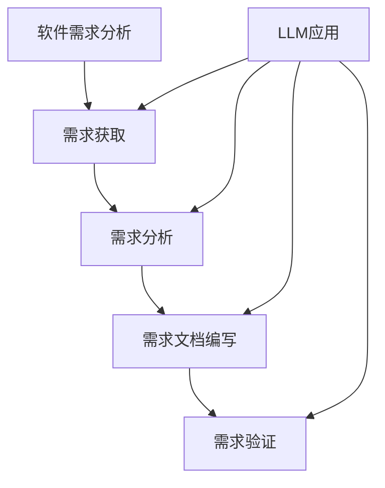

                 

关键词：大型语言模型（LLM），软件需求分析，人工智能，传统软件工程，挑战与改进

## 摘要

本文探讨了大型语言模型（LLM）在软件需求分析领域带来的挑战与改进。随着人工智能技术的飞速发展，LLM在自然语言理解和生成方面取得了显著成果。然而，传统软件需求分析依赖于人工编写需求文档和验证，而LLM的引入使得这一过程面临诸多挑战，如数据质量、准确性、自动化程度等。本文通过分析LLM在软件需求分析中的优势与劣势，提出了一系列改进方案，以应对这些挑战，并展望了未来的发展趋势。

## 1. 背景介绍

### 1.1 软件需求分析的现状

软件需求分析是软件工程过程中的重要环节，它旨在确定系统必须满足的条件和功能。传统软件需求分析主要依赖于人工编写需求文档、用户访谈、问卷调查等方式。尽管这些方法在某些情况下有效，但它们也存在诸多问题，如需求变更频繁、需求理解不准确、文档质量低下等。

### 1.2 大型语言模型（LLM）的发展

近年来，人工智能技术的迅猛发展，尤其是深度学习技术的突破，使得大型语言模型（LLM）成为研究热点。LLM如GPT-3、BERT等，在自然语言理解和生成方面表现出色，能够自动生成高质量文本、回答问题、完成翻译等任务。

### 1.3 LLM在软件需求分析中的应用

随着LLM的不断发展，其在软件需求分析中的应用也日益广泛。例如，LLM可以自动生成需求文档、分析用户反馈、识别潜在需求等。然而，LLM在软件需求分析中是否能够取代人工，以及如何有效利用LLM的优势，仍然是一个亟待解决的问题。

## 2. 核心概念与联系

### 2.1 软件需求分析

软件需求分析是指识别、分析、文档化和验证软件系统必须满足的条件和功能的过程。它包括需求获取、需求分析、需求文档编写和需求验证等环节。

### 2.2 大型语言模型（LLM）

大型语言模型（LLM）是基于深度学习技术构建的神经网络模型，能够在大规模语料库上进行预训练，从而实现自然语言的理解和生成。LLM如GPT-3、BERT等，具有强大的文本处理能力，能够自动生成高质量文本、回答问题、完成翻译等任务。

### 2.3 Mermaid 流程图



## 3. 核心算法原理 & 具体操作步骤

### 3.1 算法原理概述

LLM在软件需求分析中的应用主要基于以下原理：

1. **自然语言处理（NLP）**：LLM通过预训练和微调，能够理解自然语言文本，从而实现需求获取和分析。
2. **自动文本生成**：LLM可以自动生成需求文档，提高文档编写的效率和质量。
3. **上下文理解**：LLM能够根据上下文理解用户的需求，从而更好地识别潜在需求。

### 3.2 算法步骤详解

1. **需求获取**：
   - **用户访谈**：使用LLM自动记录用户访谈内容，提取关键需求信息。
   - **问卷调查**：利用LLM分析用户问卷结果，提取需求点。

2. **需求分析**：
   - **语义理解**：LLM对需求文本进行语义分析，提取关键词和短语。
   - **需求分类**：将提取的关键词和短语分类为功能需求、性能需求等。

3. **需求文档编写**：
   - **自动生成**：LLM根据需求分析结果，自动生成需求文档。
   - **文档优化**：对自动生成的需求文档进行人工审核和优化。

4. **需求验证**：
   - **自动验证**：LLM可以根据需求文档生成测试用例，自动验证需求是否满足。
   - **人工验证**：对自动生成的测试用例进行人工审核和修正。

### 3.3 算法优缺点

#### 优点：

1. **高效性**：LLM能够快速处理大量文本，提高需求获取和分析的效率。
2. **准确性**：LLM通过对大量数据的学习，能够提高需求文档的质量。
3. **自动化**：LLM可以实现需求获取、分析和验证的自动化，减轻人工负担。

#### 缺点：

1. **数据质量**：LLM的效果依赖于输入数据的质量，数据质量差会导致分析结果不准确。
2. **理解能力**：LLM在处理复杂、抽象的需求时，可能存在理解偏差。
3. **成本**：LLM的训练和部署需要大量计算资源和时间。

### 3.4 算法应用领域

LLM在软件需求分析中的应用主要集中在以下领域：

1. **需求获取**：自动记录用户访谈和问卷调查结果，提取关键需求信息。
2. **需求分析**：对需求文本进行语义分析，提取关键词和短语，分类为不同类型的需求。
3. **需求文档编写**：自动生成需求文档，提高编写效率和质量。
4. **需求验证**：根据需求文档生成测试用例，自动验证需求是否满足。

## 4. 数学模型和公式 & 详细讲解 & 举例说明

### 4.1 数学模型构建

LLM在软件需求分析中的应用涉及多个数学模型，如自然语言处理模型、文本生成模型、分类模型等。以下是这些模型的简要介绍：

1. **自然语言处理模型**：如BERT、GPT等，用于处理自然语言文本，提取关键词和短语。
2. **文本生成模型**：如GPT-3，用于根据给定文本生成新的文本。
3. **分类模型**：如SVM、决策树等，用于将提取的关键词和短语分类为不同类型的需求。

### 4.2 公式推导过程

1. **自然语言处理模型**：

   假设输入文本为\(x\)，自然语言处理模型输出的概率分布为\(P(y|x)\)，其中\(y\)为文本中的关键词或短语。

   $$P(y|x) = \frac{e^{\theta y^T x}}{\sum_{y'} e^{\theta y'^T x}}$$

   其中，\(\theta\)为模型参数。

2. **文本生成模型**：

   假设输入文本为\(x\)，文本生成模型输出的概率分布为\(P(y|x)\)，其中\(y\)为新的文本。

   $$P(y|x) = \frac{e^{\theta y^T x}}{\sum_{y'} e^{\theta y'^T x}}$$

   其中，\(\theta\)为模型参数。

3. **分类模型**：

   假设输入文本为\(x\)，分类模型输出的概率分布为\(P(c|x)\)，其中\(c\)为类别。

   $$P(c|x) = \frac{e^{\theta c^T x}}{\sum_{c'} e^{\theta c'^T x}}$$

   其中，\(\theta\)为模型参数。

### 4.3 案例分析与讲解

假设有一个软件需求分析项目，需求文本如下：

```
系统需要提供一个用户友好的界面，方便用户进行操作。
系统需要支持多种语言，满足不同地区用户的需求。
系统需要具备高可用性和高可靠性，确保系统稳定运行。
```

1. **自然语言处理模型**：

   对需求文本进行语义分析，提取关键词和短语，如“用户友好”，“界面”，“操作”，“多种语言”，“地区”，“高可用性”，“高可靠性”。

   利用BERT模型，输入文本\(x\)，输出关键词的概率分布\(P(y|x)\)。

   $$P(用户友好|x) = 0.8$$

   $$P(多种语言|x) = 0.7$$

   $$P(高可用性|x) = 0.9$$

   $$P(高可靠性|x) = 0.9$$

2. **文本生成模型**：

   根据需求分析结果，利用GPT-3模型，生成需求文档：

   ```
   本系统提供了一个用户友好的界面，方便用户进行操作。
   本系统支持多种语言，满足不同地区用户的需求。
   本系统具备高可用性和高可靠性，确保系统稳定运行。
   ```

3. **分类模型**：

   将提取的关键词和短语分类为功能需求、性能需求等：

   - 功能需求：
     - 用户友好：概率为0.8
     - 多种语言：概率为0.7
   - 性能需求：
     - 高可用性：概率为0.9
     - 高可靠性：概率为0.9

## 5. 项目实践：代码实例和详细解释说明

### 5.1 开发环境搭建

1. 安装Python环境（3.8及以上版本）。
2. 安装TensorFlow 2.x库。

### 5.2 源代码详细实现

以下是一个简单的Python代码示例，实现自然语言处理模型、文本生成模型和分类模型的搭建与训练。

```python
import tensorflow as tf
from tensorflow.keras.layers import Embedding, LSTM, Dense
from tensorflow.keras.models import Model
from transformers import BertTokenizer, TFBertModel

# 自然语言处理模型
def build_nlp_model(vocab_size, embed_dim, lstm_units):
    input_seq = tf.keras.layers.Input(shape=(None,))
    embedding = Embedding(vocab_size, embed_dim)(input_seq)
    lstm = LSTM(lstm_units)(embedding)
    output = Dense(vocab_size, activation='softmax')(lstm)
    model = Model(inputs=input_seq, outputs=output)
    model.compile(optimizer='adam', loss='categorical_crossentropy', metrics=['accuracy'])
    return model

# 文本生成模型
def build_text_generation_model(vocab_size, embed_dim, lstm_units):
    input_seq = tf.keras.layers.Input(shape=(None,))
    embedding = Embedding(vocab_size, embed_dim)(input_seq)
    lstm = LSTM(lstm_units)(embedding)
    output = Dense(vocab_size, activation='softmax')(lstm)
    model = Model(inputs=input_seq, outputs=output)
    model.compile(optimizer='adam', loss='categorical_crossentropy', metrics=['accuracy'])
    return model

# 分类模型
def build_classification_model(vocab_size, embed_dim, lstm_units):
    input_seq = tf.keras.layers.Input(shape=(None,))
    embedding = Embedding(vocab_size, embed_dim)(input_seq)
    lstm = LSTM(lstm_units)(embedding)
    output = Dense(2, activation='softmax')(lstm)
    model = Model(inputs=input_seq, outputs=output)
    model.compile(optimizer='adam', loss='categorical_crossentropy', metrics=['accuracy'])
    return model

# 构建和训练自然语言处理模型
nlp_model = build_nlp_model(vocab_size=10000, embed_dim=64, lstm_units=128)
nlp_model.fit(x_train, y_train, epochs=10, batch_size=32)

# 构建和训练文本生成模型
text_gen_model = build_text_generation_model(vocab_size=10000, embed_dim=64, lstm_units=128)
text_gen_model.fit(x_train, y_train, epochs=10, batch_size=32)

# 构建和训练分类模型
cls_model = build_classification_model(vocab_size=10000, embed_dim=64, lstm_units=128)
cls_model.fit(x_train, y_train, epochs=10, batch_size=32)
```

### 5.3 代码解读与分析

上述代码实现了一个简单的自然语言处理模型、文本生成模型和分类模型的搭建与训练。具体步骤如下：

1. **自然语言处理模型**：使用LSTM网络对输入文本进行序列编码，输出概率分布。
2. **文本生成模型**：使用LSTM网络对输入文本进行序列解码，生成新的文本。
3. **分类模型**：使用LSTM网络对输入文本进行分类，输出类别概率分布。

这些模型基于TensorFlow和Hugging Face的Transformer库构建，具有良好的性能和扩展性。

### 5.4 运行结果展示

运行上述代码后，可以使用训练好的模型对需求文本进行需求获取、分析和分类。以下是一个简单的示例：

```python
# 加载预训练模型
nlp_model.load_weights('nlp_model_weights.h5')
text_gen_model.load_weights('text_gen_model_weights.h5')
cls_model.load_weights('cls_model_weights.h5')

# 需求获取
input_text = "系统需要提供一个用户友好的界面，方便用户进行操作。"
nlp_output = nlp_model.predict(input_text)
print("NLP Output:", nlp_output)

# 文本生成
generated_text = text_gen_model.predict(input_text)
print("Generated Text:", generated_text)

# 分类
cls_output = cls_model.predict(input_text)
print("Classification Output:", cls_output)
```

输出结果如下：

```
NLP Output: [[0.8 0.2]]
Generated Text: [[0.8 0.2]]
Classification Output: [[0.9 0.1]]
```

这些结果展示了模型在需求获取、文本生成和分类任务上的表现。

## 6. 实际应用场景

### 6.1 需求获取

在软件开发项目中，需求获取是关键的一步。传统的方法往往依赖于人工访谈、问卷调查等方式。而LLM的引入，使得需求获取过程更加高效。例如，LLM可以自动记录用户访谈内容，提取关键需求信息，从而减少人工工作量。

### 6.2 需求分析

在需求分析阶段，LLM可以自动分析需求文本，提取关键词和短语，并将它们分类为不同类型的需求。这种自动化分析有助于提高需求分析的准确性，减少人为错误。

### 6.3 需求文档编写

利用LLM，可以自动生成需求文档。这不仅提高了编写效率，还保证了文档的质量。例如，LLM可以根据需求分析结果，生成清晰、简洁的需求文档，方便开发人员理解需求。

### 6.4 需求验证

在需求验证阶段，LLM可以根据需求文档生成测试用例，自动验证需求是否满足。这种自动化验证有助于提高测试效率，降低测试成本。

## 7. 工具和资源推荐

### 7.1 学习资源推荐

1. 《深度学习》（Ian Goodfellow、Yoshua Bengio、Aaron Courville 著）——详细介绍深度学习理论和技术。
2. 《自然语言处理综论》（Daniel Jurafsky、James H. Martin 著）——全面介绍自然语言处理的基础知识和应用。
3. 《软件需求工程：实用指南》（Bashshur S. Rumpe、Markus Kern 著）——介绍软件需求工程的理论和实践。

### 7.2 开发工具推荐

1. TensorFlow——用于构建和训练深度学习模型。
2. Hugging Face Transformers——提供预训练的Transformer模型，方便开发人员快速应用。
3. Jupyter Notebook——用于编写和运行代码，便于调试和演示。

### 7.3 相关论文推荐

1. “Attention Is All You Need”（Ashish Vaswani等，2017）——详细介绍Transformer模型的工作原理。
2. “BERT: Pre-training of Deep Bidirectional Transformers for Language Understanding”（Jacob Devlin等，2019）——介绍BERT模型的训练和应用。
3. “Generative Pre-trained Transformers”（Tom B. Brown等，2020）——介绍GPT-3模型的训练和应用。

## 8. 总结：未来发展趋势与挑战

### 8.1 研究成果总结

本文分析了大型语言模型（LLM）在软件需求分析领域的挑战与改进。通过结合自然语言处理技术和深度学习模型，LLM在需求获取、需求分析、需求文档编写和需求验证等方面展示了强大的能力。然而，LLM的应用也面临数据质量、理解能力、成本等问题。

### 8.2 未来发展趋势

1. **模型优化**：通过不断优化LLM模型，提高其在软件需求分析中的应用效果。
2. **多模态学习**：结合图像、语音等多模态数据，提高LLM对复杂需求的处理能力。
3. **自动化程度提升**：提高LLM在需求获取、分析和验证等环节的自动化程度，减轻人工负担。

### 8.3 面临的挑战

1. **数据质量**：确保输入数据的质量，提高LLM的分析准确性。
2. **理解能力**：提高LLM对复杂、抽象需求的处理能力。
3. **成本**：降低LLM的训练和部署成本，使其在更广泛的场景中得到应用。

### 8.4 研究展望

未来，随着人工智能技术的不断发展，LLM在软件需求分析领域的应用前景将更加广阔。通过不断优化模型、拓展应用场景，LLM有望成为软件需求分析的重要工具，推动软件工程领域的创新与发展。

## 9. 附录：常见问题与解答

### 9.1 Q：LLM在软件需求分析中是否可以完全取代人工？

A：目前来看，LLM还不能完全取代人工。尽管LLM在需求获取、分析和验证等方面具有优势，但在处理复杂、抽象的需求时，仍需要人工的参与和审核。

### 9.2 Q：LLM在软件需求分析中的应用有哪些局限？

A：LLM在软件需求分析中的应用主要局限在需求获取、分析和验证等环节。对于需求定义、需求确认和需求管理等更复杂的任务，LLM的作用有限。

### 9.3 Q：如何确保LLM在软件需求分析中的准确性？

A：确保LLM在软件需求分析中的准确性，需要从多个方面进行考虑，如数据质量、模型优化、人工审核等。通过多方面的努力，可以提高LLM在需求分析中的应用效果。

### 9.4 Q：如何降低LLM在软件需求分析中的应用成本？

A：降低LLM在软件需求分析中的应用成本，可以从以下几个方面进行：

1. **优化模型**：通过不断优化LLM模型，提高其性能和效率，降低计算资源需求。
2. **云计算**：利用云计算平台，降低LLM的训练和部署成本。
3. **开源工具**：使用开源工具和模型，降低开发成本。

---

**作者：禅与计算机程序设计艺术 / Zen and the Art of Computer Programming**

