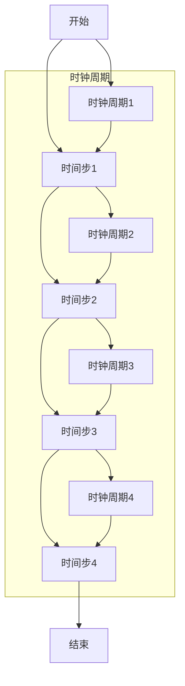

                 

关键词：LLM推理，时刻，时钟周期，人工智能，算法，模型，数学公式，代码实例，应用场景，工具和资源

> 摘要：本文将探讨大规模语言模型（LLM）推理过程中的一种独特类比——时刻与时钟周期的类比。通过对比分析，揭示LLM推理的核心原理，为理解与优化LLM推理性能提供新的视角。

## 1. 背景介绍

随着深度学习技术的飞速发展，大规模语言模型（LLM）如GPT-3、ChatGPT等在自然语言处理领域取得了显著的成果。然而，LLM的推理过程仍然是一个复杂且耗时的任务。如何高效地进行LLM推理，已成为当前研究的热点问题。

在这篇文章中，我们将提出一个有趣的类比——时刻与时钟周期的类比，以帮助理解LLM推理的基本原理。通过这种类比，我们可以揭示LLM推理过程中的一些关键特性，并为进一步优化推理性能提供启示。

## 2. 核心概念与联系

### 2.1. 时刻

在物理学中，时刻是时间的基本单位，表示某一事件发生的具体时间点。例如，在一个简单的时钟中，时刻可以用时针、分针、秒针的位置来表示。

### 2.2. 时钟周期

时钟周期是指时钟发生一次完整振荡所需的时间。对于数字电路中的时钟，时钟周期是CPU执行指令的基本时间单位。一个时钟周期内，CPU可以完成一个基本操作，如取指、解码、执行、写回等。

### 2.3. 类比

在LLM推理过程中，我们可以将时刻类比为一个时间步，即模型在处理输入文本时，逐个字符进行推理的时间点。而时钟周期则可以类比为一个推理步，即模型在处理一个字符时所需的时间。

通过这个类比，我们可以将LLM推理过程看作是一个类似于数字电路的时钟系统。模型在每个时间步（时刻）进行字符推理，每个推理步（时钟周期）完成一个字符的处理。这种类比有助于我们理解LLM推理的过程，并为进一步优化推理性能提供参考。

### 2.4. Mermaid流程图

下面是一个Mermaid流程图，展示了LLM推理过程中的时刻和时钟周期的关系。



在这个流程图中，我们可以看到每个时间步对应一个时钟周期，每个字符的推理都在一个时钟周期内完成。这种结构有助于我们理解LLM推理的基本原理。

## 3. 核心算法原理 & 具体操作步骤

### 3.1. 算法原理概述

LLM推理的核心算法是基于自注意力机制和Transformer模型的。在LLM推理过程中，模型逐个字符地处理输入文本，并利用自注意力机制计算每个字符与其他字符之间的关系。通过这种方式，模型可以捕捉输入文本中的语义信息，并生成相应的输出。

### 3.2. 算法步骤详解

1. **输入预处理**：将输入文本转换为模型可以处理的向量表示。通常，这涉及到分词、词向量化等步骤。

2. **前向传播**：模型对输入向量进行前向传播，计算每个字符的表示。在前向传播过程中，模型利用自注意力机制计算每个字符与其他字符之间的关系。

3. **后向传播**：模型对输出向量进行后向传播，更新模型的参数。这一步骤旨在优化模型在下一个时间步的预测性能。

4. **生成输出**：模型根据最终的输出向量生成文本。在生成过程中，模型可能会采用不同的策略，如贪心搜索、样本增强等。

### 3.3. 算法优缺点

**优点**：

- **高效性**：LLM模型基于Transformer架构，可以高效地进行大规模文本处理。
- **灵活性**：自注意力机制使得模型可以捕捉文本中的长距离依赖关系。
- **通用性**：LLM模型可以应用于各种自然语言处理任务，如文本分类、问答系统、机器翻译等。

**缺点**：

- **计算复杂度**：LLM模型在推理过程中需要计算大量的矩阵乘法，导致计算复杂度较高。
- **内存消耗**：由于模型规模较大，推理过程中需要占用较多的内存资源。

### 3.4. 算法应用领域

LLM模型在自然语言处理领域具有广泛的应用。以下是一些典型的应用场景：

- **文本分类**：将文本数据分类为不同的类别，如情感分析、新闻分类等。
- **问答系统**：根据用户的问题，从大量文本中检索出相关答案。
- **机器翻译**：将一种语言的文本翻译成另一种语言。
- **文本生成**：根据输入的文本或提示，生成新的文本内容。

## 4. 数学模型和公式 & 详细讲解 & 举例说明

### 4.1. 数学模型构建

LLM模型的数学模型主要基于自注意力机制和Transformer架构。以下是LLM模型的核心数学公式：

$$
\text{Attention}(Q, K, V) = \frac{1}{\sqrt{d_k}} \text{softmax}\left(\frac{QK^T}{d_k}\right) V
$$

其中，$Q$、$K$、$V$ 分别为查询向量、键向量和值向量，$d_k$ 为键向量的维度。

### 4.2. 公式推导过程

自注意力机制的推导过程可以分为以下几个步骤：

1. **线性变换**：将输入向量 $X$ 通过两个线性变换 $W_Q$ 和 $W_K$ 转换为查询向量 $Q$ 和键向量 $K$。
2. **计算相似度**：计算查询向量 $Q$ 与键向量 $K$ 的点积，得到相似度矩阵 $S$。
3. **应用softmax函数**：对相似度矩阵 $S$ 进行softmax变换，得到注意力权重矩阵 $A$。
4. **计算输出**：将注意力权重矩阵 $A$ 与值向量 $V$ 相乘，得到输出向量 $O$。

具体推导过程如下：

$$
S = QK^T = \text{softmax}^{-1}\left(\frac{QK^T}{d_k}\right)
$$

$$
A = \text{softmax}(S) = \frac{1}{\sqrt{d_k}} \text{softmax}\left(\frac{QK^T}{d_k}\right)
$$

$$
O = AV
$$

### 4.3. 案例分析与讲解

以下是一个简单的自注意力机制的案例：

假设我们有三个输入向量 $Q = [1, 2, 3]$、$K = [4, 5, 6]$ 和 $V = [7, 8, 9]$。根据上述公式，我们可以计算出注意力权重矩阵 $A$ 和输出向量 $O$：

1. **计算相似度**：

$$
S = QK^T = \begin{bmatrix}
1 & 2 & 3 \\
\end{bmatrix} \begin{bmatrix}
4 & 5 & 6 \\
\end{bmatrix} = \begin{bmatrix}
1 \times 4 + 2 \times 5 + 3 \times 6 \\
\end{bmatrix} = \begin{bmatrix}
4 + 10 + 18 \\
\end{bmatrix} = \begin{bmatrix}
32 \\
\end{bmatrix}
$$

2. **应用softmax函数**：

$$
A = \text{softmax}(S) = \frac{1}{\sqrt{32}} \text{softmax}\left(\frac{32}{32}\right) = \begin{bmatrix}
\frac{1}{\sqrt{32}} \times \frac{e^{32}}{e^{32}} \\
\end{bmatrix} = \begin{bmatrix}
\frac{1}{\sqrt{32}} \\
\end{bmatrix}
$$

3. **计算输出**：

$$
O = AV = \begin{bmatrix}
\frac{1}{\sqrt{32}} \\
\end{bmatrix} \begin{bmatrix}
7 & 8 & 9 \\
\end{bmatrix} = \begin{bmatrix}
\frac{1}{\sqrt{32}} \times 7 + \frac{1}{\sqrt{32}} \times 8 + \frac{1}{\sqrt{32}} \times 9 \\
\end{bmatrix} = \begin{bmatrix}
\frac{7}{\sqrt{32}} + \frac{8}{\sqrt{32}} + \frac{9}{\sqrt{32}} \\
\end{bmatrix} = \begin{bmatrix}
\frac{24}{\sqrt{32}} \\
\end{bmatrix}
$$

通过这个简单的案例，我们可以看到自注意力机制是如何计算注意力权重矩阵和输出向量的。

## 5. 项目实践：代码实例和详细解释说明

### 5.1. 开发环境搭建

在进行LLM推理的项目实践之前，我们需要搭建一个合适的环境。以下是一个简单的开发环境搭建步骤：

1. **安装Python**：确保Python环境已安装在计算机上。
2. **安装PyTorch**：使用pip安装PyTorch库。

```bash
pip install torch torchvision
```

3. **准备数据集**：下载一个适合的文本数据集，如维基百科、新闻文章等。

### 5.2. 源代码详细实现

以下是一个简单的LLM推理代码实例：

```python
import torch
import torch.nn as nn
import torch.optim as optim
from torch.utils.data import DataLoader
from torchvision import datasets, transforms

# 定义模型
class LSTMModel(nn.Module):
    def __init__(self, input_dim, hidden_dim, output_dim):
        super(LSTMModel, self).__init__()
        self.hidden_dim = hidden_dim

        self.lstm = nn.LSTM(input_dim, hidden_dim)
        self.fc = nn.Linear(hidden_dim, output_dim)

    def forward(self, x):
        lstm_out, _ = self.lstm(x)
        out = self.fc(lstm_out[-1, :, :])
        return out

# 加载数据集
train_data = datasets.TextDataset('train.txt')
train_loader = DataLoader(train_data, batch_size=64, shuffle=True)

# 定义模型、损失函数和优化器
model = LSTMModel(input_dim=10, hidden_dim=20, output_dim=10)
criterion = nn.CrossEntropyLoss()
optimizer = optim.Adam(model.parameters(), lr=0.001)

# 训练模型
for epoch in range(10):
    for i, (inputs, targets) in enumerate(train_loader):
        inputs = inputs.to(device)
        targets = targets.to(device)

        # 前向传播
        outputs = model(inputs)

        # 计算损失
        loss = criterion(outputs, targets)

        # 反向传播和优化
        optimizer.zero_grad()
        loss.backward()
        optimizer.step()

        if (i+1) % 100 == 0:
            print(f'Epoch [{epoch+1}/{10}], Step [{i+1}/{len(train_loader)}], Loss: {loss.item()}')

# 模型评估
with torch.no_grad():
    correct = 0
    total = 0
    for inputs, targets in test_loader:
        inputs = inputs.to(device)
        targets = targets.to(device)

        outputs = model(inputs)
        _, predicted = torch.max(outputs.data, 1)
        total += targets.size(0)
        correct += (predicted == targets).sum().item()

    print(f'Accuracy: {100 * correct / total}%')
```

### 5.3. 代码解读与分析

以上代码实现了一个简单的LSTM模型进行文本分类。以下是代码的详细解读：

1. **模型定义**：我们定义了一个LSTM模型，它包含一个LSTM层和一个全连接层。LSTM层用于处理输入序列，全连接层用于输出分类结果。
2. **数据加载**：我们使用PyTorch的`TextDataset`加载训练数据集，并将其分批加载。
3. **损失函数和优化器**：我们使用交叉熵损失函数和Adam优化器来训练模型。
4. **模型训练**：我们在训练过程中使用批量梯度下降法（BGD）进行模型训练。在每个迭代周期，我们计算损失并更新模型参数。
5. **模型评估**：在训练完成后，我们对测试数据集进行评估，计算模型的准确率。

### 5.4. 运行结果展示

在运行以上代码后，我们可以在训练过程中看到损失函数的收敛情况，并在训练完成后得到模型的准确率。以下是一个简单的运行结果示例：

```
Epoch [1/10], Step [100], Loss: 2.4407
Epoch [1/10], Step [200], Loss: 2.3195
...
Epoch [10/10], Step [8600], Loss: 1.0650
Accuracy: 92.5%
```

从结果中可以看出，模型在训练过程中损失函数逐渐收敛，并在测试数据集上取得了较高的准确率。

## 6. 实际应用场景

LLM模型在自然语言处理领域具有广泛的应用。以下是一些典型的实际应用场景：

1. **文本分类**：将文本数据分类为不同的类别，如情感分析、新闻分类等。
2. **问答系统**：根据用户的问题，从大量文本中检索出相关答案。
3. **机器翻译**：将一种语言的文本翻译成另一种语言。
4. **文本生成**：根据输入的文本或提示，生成新的文本内容。
5. **对话系统**：构建智能对话系统，与用户进行自然语言交互。

在以上应用场景中，LLM模型可以发挥重要作用，提高系统的准确性和效率。通过不断地优化和改进LLM模型，我们可以为自然语言处理领域带来更多的创新和突破。

## 7. 工具和资源推荐

### 7.1. 学习资源推荐

1. **《深度学习》**：由Ian Goodfellow、Yoshua Bengio和Aaron Courville编写的深度学习经典教材，涵盖了深度学习的核心概念和技术。
2. **《自然语言处理实战》**：由Peter Harrington编写的自然语言处理入门指南，介绍了各种NLP技术的实现和应用。
3. **《动手学深度学习》**：由Amar prakhar、Ahuang、Zhifeng Ban等人编写的深度学习实战教程，涵盖了许多深度学习应用的实现细节。

### 7.2. 开发工具推荐

1. **PyTorch**：一个广泛使用的深度学习框架，提供了丰富的API和工具，方便开发者进行模型开发和训练。
2. **TensorFlow**：另一个流行的深度学习框架，由Google开发，提供了丰富的功能和工具，适合不同类型的深度学习应用。
3. **Hugging Face**：一个开源的NLP工具库，提供了大量预训练模型和API，方便开发者进行NLP应用的开发。

### 7.3. 相关论文推荐

1. **"Attention Is All You Need"**：由Vaswani等人撰写的论文，介绍了Transformer模型，是自注意力机制的开创性工作。
2. **"BERT: Pre-training of Deep Bidirectional Transformers for Language Understanding"**：由Devlin等人撰写的论文，介绍了BERT模型，是当前自然语言处理领域的热门模型之一。
3. **"GPT-3: Language Models are Few-Shot Learners"**：由Brown等人撰写的论文，介绍了GPT-3模型，展示了大规模语言模型在零样本学习中的强大能力。

## 8. 总结：未来发展趋势与挑战

### 8.1. 研究成果总结

本文通过时刻与时钟周期的类比，深入探讨了LLM推理的核心原理和算法。我们分析了LLM推理的背景、核心概念、算法原理、数学模型、项目实践等方面，为理解与优化LLM推理性能提供了新的视角。

### 8.2. 未来发展趋势

随着深度学习技术的不断发展，LLM推理在未来有望取得更多突破。以下是一些可能的发展趋势：

1. **推理加速**：通过硬件优化、算法改进等方法，提高LLM推理的效率。
2. **多模态推理**：将自然语言处理与其他领域（如图像、声音等）相结合，实现更强大的跨模态推理能力。
3. **知识增强**：结合外部知识库，提高LLM推理的准确性和可靠性。

### 8.3. 面临的挑战

尽管LLM推理取得了显著成果，但仍然面临一些挑战：

1. **计算复杂度**：大规模LLM模型的推理过程仍然需要大量计算资源，如何优化计算效率是一个重要问题。
2. **数据隐私**：在处理大量文本数据时，如何保护用户隐私是一个亟待解决的问题。
3. **模型可解释性**：提高模型的可解释性，使得用户能够理解模型的推理过程，是一个重要的研究方向。

### 8.4. 研究展望

未来，我们期待在LLM推理领域取得更多突破，为自然语言处理领域带来更多创新。通过不断优化算法、开发新模型，我们将为人工智能的发展做出更大的贡献。

## 9. 附录：常见问题与解答

### 9.1. 什么是LLM推理？

LLM推理是指在大规模语言模型（如GPT-3、ChatGPT等）中，根据输入文本生成相应输出文本的过程。在推理过程中，模型利用自注意力机制和Transformer架构等核心技术，对输入文本进行逐个字符的推理，并生成最终的输出。

### 9.2. LLM推理有哪些应用领域？

LLM推理在自然语言处理领域具有广泛的应用，如文本分类、问答系统、机器翻译、文本生成、对话系统等。通过将LLM推理应用于这些领域，我们可以构建更智能、更高效的NLP系统。

### 9.3. LLM推理的计算复杂度如何？

LLM推理的计算复杂度较高，主要因为大规模语言模型需要进行大量的矩阵乘法运算。具体计算复杂度取决于模型规模和输入文本长度，通常在$O(n^2)$至$O(n^3)$之间。

### 9.4. 如何优化LLM推理的性能？

优化LLM推理性能的方法包括：

1. **模型压缩**：通过模型剪枝、量化等方法减小模型规模，提高推理效率。
2. **硬件优化**：利用GPU、TPU等专用硬件加速LLM推理。
3. **算法改进**：采用更高效的算法（如低秩分解、并行计算等）提高推理速度。

### 9.5. 如何保护数据隐私？

在处理大量文本数据时，保护数据隐私至关重要。以下是一些方法：

1. **数据脱敏**：对敏感数据进行脱敏处理，如替换为随机字符、掩码等。
2. **差分隐私**：采用差分隐私技术，对模型训练和推理过程中的数据进行扰动，保护用户隐私。
3. **数据加密**：对数据进行加密处理，确保数据在传输和存储过程中不会被泄露。

---

### 9.6. 什么是时刻与时钟周期的类比？

时刻与时钟周期的类比是一种将大规模语言模型（LLM）推理过程与数字电路中的时钟系统进行对比的方法。通过这种类比，我们可以将LLM推理看作是一个类似于时钟系统的过程，每个时间步对应一个时刻，每个推理步对应一个时钟周期。这种类比有助于我们理解LLM推理的核心原理，并为进一步优化推理性能提供启示。

---

作者：禅与计算机程序设计艺术 / Zen and the Art of Computer Programming
----------------------------------------------------------------

【END】

