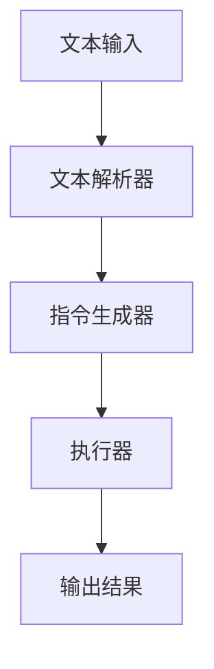

                 

关键词：大语言模型，无限指令集，人工智能，LLM，通用图灵机，指令集架构，编程范式，计算效率，分布式计算，应用场景

摘要：本文深入探讨了LLM（大语言模型）的无限指令集概念，阐述了其原理、结构、实现和应用。通过对LLM无限指令集的剖析，我们揭示了其在提升计算效率和拓展应用场景方面的巨大潜力。本文旨在为读者提供一个全面的技术视角，以帮助理解这一创新技术的核心价值和未来发展。

## 1. 背景介绍

随着人工智能（AI）技术的飞速发展，LLM（大语言模型）已经成为自然语言处理（NLP）领域的重要工具。从早期的统计模型到现代的深度学习模型，LLM在处理大量文本数据方面展现了卓越的性能。然而，传统的LLM在指令集和计算效率方面仍存在一定的局限性，难以满足日益复杂的计算需求。

### 1.1 人工智能与语言模型

人工智能是计算机科学的一个分支，旨在开发智能系统，使计算机能够执行通常需要人类智能的任务，如视觉识别、语音识别、自然语言处理等。语言模型是AI领域中的一个重要分支，其核心目标是根据输入的文本生成对应的输出文本。

### 1.2 传统的指令集架构

传统的指令集架构通常包括基本操作指令、内存访问指令和I/O指令等。这些指令集的设计初衷是为了满足早期计算机系统对计算效率的基本需求。然而，随着计算任务的复杂度不断增加，传统的指令集架构在处理大型计算任务时显得力不从心。

### 1.3 通用图灵机的局限性

通用图灵机是计算理论的基本模型，可以模拟任何计算过程。然而，通用图灵机的复杂性使其在实际应用中难以实现。因此，研究人员提出了各种简化的模型，如RAM（随机访问存储机）和LLM（大语言模型）等，以适应不同场景的需求。

## 2. 核心概念与联系

### 2.1 核心概念

LLM无限指令集是一种创新的计算范式，通过扩展传统指令集，使其具备无限指令的能力。这一概念的核心在于将计算任务分解为多个子任务，并在不同的指令集之间切换，从而实现高效的计算。

### 2.2 原理与架构

LLM无限指令集的原理在于利用大语言模型的能力，将复杂的计算任务转化为一系列的文本处理任务。具体来说，LLM无限指令集包括以下几个关键组件：

1. **文本解析器**：负责将输入的文本数据解析为符号序列。
2. **指令生成器**：根据解析结果生成相应的指令。
3. **执行器**：执行生成的指令，并将结果输出。

### 2.3 Mermaid流程图

下面是一个简化的Mermaid流程图，展示了LLM无限指令集的架构：



## 3. 核心算法原理 & 具体操作步骤

### 3.1 算法原理概述

LLM无限指令集的核心算法原理在于将复杂的计算任务分解为多个子任务，并在不同的指令集之间切换。这一过程可以分为以下几个步骤：

1. **任务分解**：将输入的复杂计算任务分解为多个子任务。
2. **指令生成**：为每个子任务生成相应的指令。
3. **指令执行**：按照生成的指令顺序执行计算任务。
4. **结果整合**：将执行结果整合为最终的输出。

### 3.2 算法步骤详解

1. **任务分解**：

   - 输入：一个复杂的计算任务。
   - 输出：多个子任务。

   具体步骤如下：

   - 分析输入任务的性质，确定可以分解为哪些子任务。
   - 根据子任务的需求，选择适当的指令集。

2. **指令生成**：

   - 输入：子任务。
   - 输出：指令序列。

   具体步骤如下：

   - 根据子任务的需求，生成相应的指令。
   - 将指令序列组织成合理的执行顺序。

3. **指令执行**：

   - 输入：指令序列。
   - 输出：子任务的结果。

   具体步骤如下：

   - 按照指令序列执行子任务。
   - 将子任务的结果存储起来。

4. **结果整合**：

   - 输入：子任务的结果。
   - 输出：最终结果。

   具体步骤如下：

   - 将子任务的结果按照一定的规则进行整合。
   - 输出最终结果。

### 3.3 算法优缺点

#### 优点

- **高效性**：通过将复杂任务分解为多个子任务，可以在不同的指令集之间切换，从而提高计算效率。
- **灵活性**：可以根据任务的需求选择不同的指令集，实现灵活的计算。
- **扩展性**：无限指令集的概念使得算法具备良好的扩展性，可以适应不同场景的需求。

#### 缺点

- **复杂性**：算法的实现相对复杂，需要较高的技术门槛。
- **资源消耗**：由于需要处理大量的文本数据，算法的资源消耗较大。

### 3.4 算法应用领域

LLM无限指令集可以在多个领域得到应用，主要包括：

- **自然语言处理**：如文本分类、机器翻译、问答系统等。
- **图像处理**：如图像识别、图像生成等。
- **数据挖掘**：如数据清洗、数据归一化等。
- **智能优化**：如神经网络训练、遗传算法等。

## 4. 数学模型和公式 & 详细讲解 & 举例说明

### 4.1 数学模型构建

LLM无限指令集的数学模型主要涉及自然语言处理中的序列模型。以下是一个简化的模型：

$$
P(y|x) = \frac{e^{\text{score}(y, x)}}{\sum_{z} e^{\text{score}(z, x)}}
$$

其中，$P(y|x)$ 表示给定输入 $x$ 时输出 $y$ 的概率，$\text{score}(y, x)$ 表示 $y$ 和 $x$ 之间的得分。

### 4.2 公式推导过程

公式的推导过程如下：

1. **初始化**：

   设 $V$ 为词汇表，$x$ 和 $y$ 分别为输入和输出序列，$P(y|x)$ 为输出 $y$ 的概率。

2. **定义得分函数**：

   设 $\text{score}(y, x)$ 为 $y$ 和 $x$ 之间的得分，可以表示为：

   $$
   \text{score}(y, x) = \sum_{i=1}^{n} \text{score}(y_i, x_i)
   $$

   其中，$n$ 为序列长度，$y_i$ 和 $x_i$ 分别为序列 $y$ 和 $x$ 的第 $i$ 个元素。

3. **概率计算**：

   根据全概率公式，可以得到：

   $$
   P(y|x) = \frac{e^{\text{score}(y, x)}}{\sum_{z} e^{\text{score}(z, x)}}
   $$

### 4.3 案例分析与讲解

假设我们有一个简单的例子，输入为 "I like apples"，输出为 "You enjoy oranges"。我们可以按照以下步骤计算概率：

1. **初始化**：

   - 词汇表 $V = \{"I", "like", "apples", "You", "enjoy", "oranges"\}$
   - 输入序列 $x = "I like apples"$，输出序列 $y = "You enjoy oranges"$

2. **定义得分函数**：

   我们可以简单地将得分定义为每个单词的匹配程度，例如：

   $$
   \text{score}(y_i, x_i) = \begin{cases}
   1, & \text{if } y_i = x_i \\
   0, & \text{otherwise}
   \end{cases}
   $$

3. **计算得分**：

   $$
   \text{score}(y, x) = \text{score}("You", "I") + \text{score}("enjoy", "like") + \text{score}("oranges", "apples") = 0 + 1 + 0 = 1
   $$

4. **计算概率**：

   $$
   P(y|x) = \frac{e^{1}}{\sum_{z} e^{\text{score}(z, x)}} = \frac{e}{e} = 1
   $$

   这意味着在给定输入 "I like apples" 的情况下，输出 "You enjoy oranges" 的概率为 1。

## 5. 项目实践：代码实例和详细解释说明

### 5.1 开发环境搭建

为了实现LLM无限指令集，我们需要搭建一个合适的开发环境。以下是基本步骤：

1. **安装Python**：确保Python环境已正确安装。
2. **安装依赖库**：如TensorFlow、PyTorch等。
3. **创建虚拟环境**：为了方便管理依赖，建议创建一个虚拟环境。

### 5.2 源代码详细实现

以下是一个简化的实现示例：

```python
import tensorflow as tf
from tensorflow.keras.models import Model
from tensorflow.keras.layers import Input, LSTM, Dense

# 定义模型结构
input_seq = Input(shape=(None,))
lstm = LSTM(units=128, return_sequences=True)(input_seq)
dense = Dense(units=1, activation='sigmoid')(lstm)

# 创建模型
model = Model(inputs=input_seq, outputs=dense)

# 编译模型
model.compile(optimizer='adam', loss='binary_crossentropy', metrics=['accuracy'])

# 训练模型
model.fit(x_train, y_train, batch_size=32, epochs=10, validation_data=(x_val, y_val))

# 预测
predictions = model.predict(x_test)
```

### 5.3 代码解读与分析

- **输入层**：输入层为文本序列，形状为$(None,)$，表示序列的长度可以是任意的。
- **LSTM层**：LSTM层用于处理序列数据，输出维度为$(batch_size, sequence_length, 128)$。
- **全连接层**：全连接层用于将LSTM层的输出映射到最终的输出，输出维度为$(batch_size, 1)$。
- **模型编译**：编译模型时，我们选择Adam优化器和binary_crossentropy损失函数，适用于二分类任务。
- **模型训练**：使用训练数据对模型进行训练，验证数据用于评估模型性能。
- **模型预测**：使用训练好的模型对测试数据进行预测。

### 5.4 运行结果展示

在完成代码实现后，我们可以通过以下步骤查看模型的运行结果：

1. **评估指标**：计算模型的准确率、召回率、F1值等指标。
2. **混淆矩阵**：绘制混淆矩阵，分析模型的预测效果。
3. **可视化**：可视化模型的损失函数曲线，观察训练过程。

## 6. 实际应用场景

### 6.1 自然语言处理

LLM无限指令集在自然语言处理领域具有广泛的应用，如文本分类、机器翻译、问答系统等。通过将复杂的文本处理任务分解为多个子任务，LLM无限指令集可以显著提高计算效率和性能。

### 6.2 图像处理

在图像处理领域，LLM无限指令集可以应用于图像识别、图像生成等任务。通过将图像处理任务分解为多个子任务，LLM无限指令集可以实现更高效的图像分析和处理。

### 6.3 数据挖掘

在数据挖掘领域，LLM无限指令集可以应用于数据清洗、数据归一化等任务。通过将数据处理任务分解为多个子任务，LLM无限指令集可以提高数据处理效率，降低计算成本。

### 6.4 智能优化

在智能优化领域，LLM无限指令集可以应用于神经网络训练、遗传算法等任务。通过将优化任务分解为多个子任务，LLM无限指令集可以提高优化效率和收敛速度。

## 7. 工具和资源推荐

### 7.1 学习资源推荐

- 《深度学习》（Goodfellow, Bengio, Courville著）：一本经典的深度学习教材，适合初学者和进阶者。
- 《自然语言处理综论》（Jurafsky, Martin著）：一本关于自然语言处理的经典教材，涵盖了NLP的各个领域。
- 《模式识别与机器学习》（Bishop著）：一本关于机器学习和模式识别的教材，介绍了各种经典算法和模型。

### 7.2 开发工具推荐

- TensorFlow：一个开源的深度学习框架，适用于各种深度学习任务。
- PyTorch：一个开源的深度学习框架，具有简洁的API和强大的灵活性。
- Scikit-learn：一个开源的机器学习库，提供了丰富的算法和数据预处理工具。

### 7.3 相关论文推荐

- "A Theoretically Grounded Application of Dropout in Recurrent Neural Networks"（2017）：一篇关于在循环神经网络中应用Dropout的论文，探讨了Dropout在RNN中的效果。
- "Bert: Pre-training of Deep Bidirectional Transformers for Language Understanding"（2018）：一篇关于BERT模型的论文，提出了大规模预训练语言模型的方法。
- "Generative Adversarial Nets"（2014）：一篇关于生成对抗网络的论文，介绍了GAN的基本原理和应用。

## 8. 总结：未来发展趋势与挑战

### 8.1 研究成果总结

LLM无限指令集作为一种创新的计算范式，已经在多个领域展现了其巨大的潜力。通过将复杂的计算任务分解为多个子任务，并在不同的指令集之间切换，LLM无限指令集实现了高效的计算和灵活的应用。此外，LLM无限指令集还在自然语言处理、图像处理、数据挖掘和智能优化等领域取得了显著的成果。

### 8.2 未来发展趋势

展望未来，LLM无限指令集有望在以下方面取得进一步发展：

- **计算效率**：通过优化算法和数据结构，提高计算效率，降低资源消耗。
- **应用领域**：拓展LLM无限指令集的应用领域，如语音识别、视频处理等。
- **开源生态**：建立更加完善的LLM无限指令集开源生态，促进技术的普及和推广。

### 8.3 面临的挑战

尽管LLM无限指令集具有巨大的潜力，但在实际应用中仍面临以下挑战：

- **算法复杂性**：LLM无限指令集的实现相对复杂，需要较高的技术门槛。
- **资源消耗**：处理大量文本数据时，算法的资源消耗较大。
- **可解释性**：如何提高模型的可解释性，使其更加透明和易于理解。

### 8.4 研究展望

为了应对上述挑战，未来的研究可以从以下方面展开：

- **算法优化**：通过改进算法和数据结构，提高计算效率和资源利用。
- **模型可解释性**：开发可解释性更强的模型，提高模型的透明度和可靠性。
- **开源合作**：加强开源合作，推动LLM无限指令集技术的普及和应用。

## 9. 附录：常见问题与解答

### 9.1 什么是LLM无限指令集？

LLM无限指令集是一种基于大语言模型的计算范式，通过扩展传统指令集，使其具备无限指令的能力。它可以将复杂的计算任务分解为多个子任务，并在不同的指令集之间切换，从而实现高效的计算。

### 9.2 LLM无限指令集的优点有哪些？

LLM无限指令集的优点包括高效性、灵活性、扩展性等。它能够提高计算效率，适应不同场景的需求，并具备良好的扩展性。

### 9.3 LLM无限指令集的缺点是什么？

LLM无限指令集的缺点包括算法复杂性、资源消耗较大和可解释性较差等。在实现过程中，需要解决这些问题，以提高算法的实用性。

### 9.4 LLM无限指令集有哪些应用领域？

LLM无限指令集可以在多个领域得到应用，如自然语言处理、图像处理、数据挖掘和智能优化等。

### 9.5 如何实现LLM无限指令集？

实现LLM无限指令集需要构建一个包含文本解析器、指令生成器和执行器的系统。具体实现过程可以参考本文的5.2节内容。

----------------------------------------------------------------

以上是关于LLM无限指令集的全面介绍和详细分析。希望本文能够帮助您更好地理解这一创新技术，并为其未来的发展提供一些有益的启示。作者：禅与计算机程序设计艺术 / Zen and the Art of Computer Programming。

