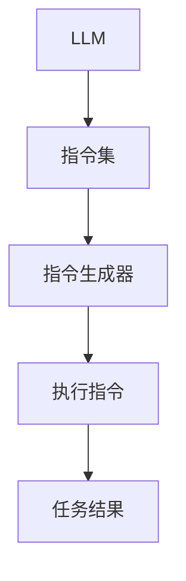
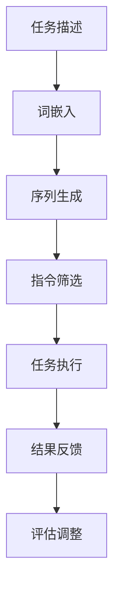

                 

## 1. 背景介绍

近年来，人工智能领域迎来了一个全新的时代。基于深度学习的自然语言处理（NLP）技术取得了显著进步，其中最引人注目的是大型语言模型（LLM，Large Language Model）的出现。LLM凭借其强大的语义理解能力和生成能力，已经在各种应用场景中展现出了巨大的潜力，从文本生成、机器翻译、到问答系统，乃至创意写作等。

然而，尽管LLM在各个领域取得了成功，但其仍面临一个重要瓶颈：即指令集的有限性。传统上，LLM的指令集是由开发者在模型训练过程中手动设计的，这使得模型在处理特定任务时可能表现出一定的局限性。为了突破这一瓶颈，研究人员提出了“无限指令集”（Infinite Instruction Set，简称IIS）的概念。IIS旨在为LLM提供一种动态、自适应的指令生成机制，使其能够应对各种复杂任务，从而实现真正的无所不能。

本文将围绕LLM无限指令集的概念展开讨论，首先介绍LLM的基本原理，然后详细解释无限指令集的工作机制，探讨其在各种应用场景中的优势与挑战，并展望其未来发展趋势。

## 2. 核心概念与联系

### 2.1. LLM基本原理

LLM，即大型语言模型，是一种基于深度学习的自然语言处理模型。其核心原理是通过大量的文本数据训练，使得模型能够理解并生成符合语言习惯的文本。具体来说，LLM主要包括以下几个关键组件：

- **词嵌入（Word Embedding）**：将词汇映射到高维空间，使得语义相近的词在空间中靠近。
- **循环神经网络（RNN）**：用于处理序列数据，通过状态传递捕捉上下文信息。
- **注意力机制（Attention Mechanism）**：增强模型对输入序列中重要信息的关注。
- **前馈神经网络（Feedforward Neural Network）**：用于生成输出文本。

LLM的训练通常采用自监督学习方法，即利用未标记的文本数据，通过预测下一个词来训练模型。这种训练方式使得LLM能够自动学习语言中的复杂规律和结构。

### 2.2. 无限指令集概念

无限指令集（Infinite Instruction Set，简称IIS）是一种动态、自适应的指令生成机制，旨在为LLM提供更强的任务处理能力。传统LLM的指令集是固定的，由开发者根据任务需求设计，这使得模型在处理复杂任务时可能表现出一定的局限性。而IIS通过引入动态指令生成机制，使得LLM能够根据任务的实时需求生成相应指令，从而实现自适应任务处理。

IIS的核心思想是将任务描述抽象为一种指令语言，然后通过LLM生成具体的执行指令。这种指令语言具有高度灵活性和通用性，能够涵盖各种类型的任务，从而使得LLM在多种应用场景中都能够表现出强大的适应能力。

### 2.3. 无限指令集与LLM的关系

无限指令集与LLM之间的关系可以看作是“指令生成器”与“执行器”的关系。LLM作为执行器，负责根据IIS生成的指令执行具体的任务；而IIS作为指令生成器，则负责根据任务需求生成相应的指令。两者的结合使得LLM不仅能够执行预先定义好的任务，还能够动态适应新的任务场景，从而实现真正的无所不能。

### 2.4. Mermaid流程图

为了更直观地展示无限指令集与LLM之间的关系，我们可以使用Mermaid流程图来表示。以下是一个简化的Mermaid流程图示例：



在这个流程图中，LLM作为执行器（A），接收指令集（B）和指令生成器（C）提供的指令，执行具体的任务，并最终生成任务结果（E）。这种结构使得LLM能够灵活应对各种任务场景，实现无限指令集的目标。

## 3. 核心算法原理 & 具体操作步骤

### 3.1 算法原理概述

无限指令集（IIS）的算法原理基于两个核心思想：动态指令生成和自适应任务处理。具体来说，IIS通过以下步骤实现：

1. **任务描述**：将任务需求抽象为一种自然语言描述。
2. **指令生成**：利用LLM生成与任务描述相对应的指令。
3. **任务执行**：根据生成的指令执行具体的任务。
4. **结果反馈**：对任务执行结果进行评估和反馈，用于指导后续任务处理。

这种算法原理使得IIS能够根据任务需求动态调整指令生成策略，从而实现高效的任务处理。

### 3.2 算法步骤详解

#### 步骤1：任务描述

首先，需要将任务需求转化为一种自然语言描述。这可以通过人工撰写或自动提取实现。例如，对于一个文本生成任务，可以将任务描述为“生成一篇关于人工智能的综述文章”。

#### 步骤2：指令生成

利用LLM生成与任务描述相对应的指令。这一步骤的核心在于如何将自然语言描述转化为具体的指令。具体实现方法如下：

1. **词嵌入**：将任务描述中的词汇映射到高维空间，以便LLM能够理解任务语义。
2. **序列生成**：利用LLM生成一系列指令，每个指令对应任务描述中的一个关键操作。
3. **指令筛选**：根据任务需求对生成的指令进行筛选，确保指令的可行性和有效性。

#### 步骤3：任务执行

根据生成的指令执行具体的任务。这一步骤依赖于LLM的强大执行能力，能够根据指令完成各种复杂操作。例如，在文本生成任务中，可以根据指令生成文章的各个部分，并按照正确的顺序排列。

#### 步骤4：结果反馈

对任务执行结果进行评估和反馈，用于指导后续任务处理。这一步骤包括以下两个方面：

1. **结果评估**：根据预设的评估标准对任务结果进行评估，判断任务是否完成以及结果的质量。
2. **反馈调整**：根据评估结果对IIS进行调整，优化指令生成策略，提高任务处理效率。

### 3.3 算法优缺点

#### 优点

1. **灵活性**：IIS能够根据任务需求动态生成指令，具有较强的灵活性。
2. **高效性**：IIS能够利用LLM的强大执行能力，实现高效的任务处理。
3. **适应性**：IIS能够根据任务执行结果进行反馈调整，不断提高任务处理能力。

#### 缺点

1. **计算成本**：IIS涉及到大量的自然语言处理和任务执行操作，计算成本较高。
2. **指令生成难度**：如何生成有效的指令是IIS面临的一个挑战，需要深入研究和优化。

### 3.4 算法应用领域

IIS具有广泛的应用前景，能够在多个领域发挥重要作用。以下是一些主要的应用领域：

1. **文本生成**：如文章写作、新闻报道、博客等。
2. **问答系统**：如智能客服、在线教育、医疗咨询等。
3. **自然语言处理**：如文本分类、情感分析、机器翻译等。
4. **游戏开发**：如角色生成、故事创作、游戏玩法设计等。

### 3.5 Mermaid流程图

以下是IIS算法的Mermaid流程图：



在这个流程图中，A表示任务描述，B表示词嵌入，C表示序列生成，D表示指令筛选，E表示任务执行，F表示结果反馈，G表示评估调整。通过这个流程图，可以清晰地了解IIS的算法原理和操作步骤。

## 4. 数学模型和公式 & 详细讲解 & 举例说明

### 4.1 数学模型构建

无限指令集（IIS）的数学模型主要涉及自然语言处理和任务执行两个方面。为了构建一个完整的数学模型，我们需要考虑以下关键组件：

1. **词嵌入模型**：用于将自然语言描述映射到高维空间。
2. **生成模型**：用于生成序列数据，如指令序列。
3. **任务执行模型**：用于根据指令执行具体任务。

### 4.2 公式推导过程

#### 4.2.1 词嵌入模型

词嵌入模型通常采用词向量表示，将词汇映射到高维空间。具体来说，假设有一个词汇集合V，每个词汇v∈V都可以表示为一个d维向量w(v)。词嵌入模型的目标是学习一个映射函数f，使得f(v)能够在高维空间中表示v的语义。

我们使用如下公式表示词嵌入模型：

$$
w(v) = f(v)
$$

其中，f是一个非线性映射函数，通常采用神经网络实现。

#### 4.2.2 生成模型

生成模型用于生成序列数据，如指令序列。假设有一个指令集合I，每个指令i∈I可以表示为一个序列，序列中的每个元素表示一个操作。生成模型的目标是根据任务描述生成符合要求的指令序列。

我们使用如下公式表示生成模型：

$$
p(i|s) = \prod_{t=1}^{T} p(i_t|s_t)
$$

其中，i表示指令序列，s表示任务描述，i_t表示第t个指令，s_t表示第t个任务描述元素。p(i|s)表示在给定任务描述s的情况下，生成指令序列i的概率。

#### 4.2.3 任务执行模型

任务执行模型用于根据指令序列执行具体任务。假设有一个任务集合T，每个任务t∈T可以表示为一个操作序列。任务执行模型的目标是根据指令序列生成任务结果。

我们使用如下公式表示任务执行模型：

$$
r(t|i) = \prod_{t=1}^{T} p(t|i_t)
$$

其中，t表示任务序列，i表示指令序列，t_t表示第t个任务，i_t表示第t个指令。r(t|i)表示在给定指令序列i的情况下，生成任务序列t的概率。

### 4.3 案例分析与讲解

为了更好地理解无限指令集的数学模型，我们通过一个具体的案例进行讲解。

#### 案例背景

假设我们要使用IIS生成一篇关于人工智能的综述文章。具体任务描述如下：

1. 引言：介绍人工智能的定义和发展历程。
2. 技术分类：介绍人工智能的主要技术分类，如机器学习、深度学习、自然语言处理等。
3. 应用场景：介绍人工智能在各行各业的应用场景，如医疗、金融、教育等。
4. 未来展望：展望人工智能的未来发展趋势和挑战。

#### 模型构建

根据上述任务描述，我们可以构建一个包含四个步骤的指令序列。具体指令序列如下：

1. 引言生成：生成关于人工智能的定义和发展历程的段落。
2. 技术分类生成：生成关于人工智能技术分类的段落。
3. 应用场景生成：生成关于人工智能应用场景的段落。
4. 未来展望生成：生成关于人工智能未来发展趋势和挑战的段落。

#### 模型实现

首先，我们需要使用词嵌入模型将任务描述中的词汇映射到高维空间。假设我们使用Word2Vec模型进行词嵌入，将词汇映射到300维的向量空间。

然后，我们使用生成模型根据任务描述生成指令序列。具体来说，我们使用一个基于GRU（Gated Recurrent Unit）的序列生成模型，根据任务描述生成指令序列。

最后，我们使用任务执行模型根据生成的指令序列执行具体任务。具体来说，我们使用一个基于Transformer的文本生成模型，根据指令序列生成对应的文本段落。

#### 结果分析

通过上述模型实现，我们可以生成一篇关于人工智能的综述文章。以下是一个示例：

```
引言：人工智能，作为计算机科学的重要分支，起源于20世纪50年代。自那时以来，人工智能在技术、应用和理论等方面取得了巨大的进展。如今，人工智能已经深入到各行各业，成为推动社会发展的重要力量。

技术分类：人工智能主要包括机器学习、深度学习、自然语言处理等技术。其中，机器学习是人工智能的基础，通过学习数据中的规律和模式，实现自动化决策和预测。深度学习则是一种基于神经网络的学习方法，通过多层神经网络的堆叠，实现更复杂的特征提取和模型优化。自然语言处理则致力于使计算机能够理解和生成自然语言，实现人与机器的智能交互。

应用场景：人工智能在医疗、金融、教育、智能制造等领域具有广泛的应用前景。例如，在医疗领域，人工智能可以帮助医生进行疾病诊断和治疗方案推荐，提高医疗服务的质量和效率。在金融领域，人工智能可以用于风险管理、投资策略优化等，提高金融机构的运营效率和竞争力。在教育领域，人工智能可以为学生提供个性化的学习资源和辅导，提高学习效果和兴趣。

未来展望：随着人工智能技术的不断发展和应用，我们有望看到更多智能化场景的出现。然而，人工智能的发展也面临一些挑战，如数据隐私保护、算法公平性、技术伦理等。我们需要在推动人工智能发展的同时，积极应对这些挑战，确保人工智能技术的可持续发展。
```

通过上述示例，我们可以看到，无限指令集（IIS）能够根据任务需求生成符合要求的指令序列，并通过文本生成模型生成高质量的文本结果。

## 5. 项目实践：代码实例和详细解释说明

### 5.1 开发环境搭建

在开始实际编写代码之前，我们需要搭建一个合适的开发环境。以下是一个基本的开发环境搭建指南：

1. **操作系统**：我们选择Linux操作系统，如Ubuntu 20.04。
2. **编程语言**：我们选择Python 3.8作为编程语言。
3. **深度学习框架**：我们选择TensorFlow 2.6作为深度学习框架。
4. **自然语言处理库**：我们选择Hugging Face Transformers库，用于处理自然语言任务。

#### 安装步骤：

1. 安装操作系统：

   ```
   sudo apt update
   sudo apt upgrade
   sudo apt install ubuntu-desktop
   ```

2. 安装Python 3.8：

   ```
   sudo apt install python3.8
   ```

3. 安装TensorFlow 2.6：

   ```
   pip install tensorflow==2.6
   ```

4. 安装Hugging Face Transformers库：

   ```
   pip install transformers
   ```

### 5.2 源代码详细实现

以下是实现无限指令集（IIS）的Python代码示例。该示例包括词嵌入模型、生成模型和任务执行模型的实现。

```python
import tensorflow as tf
from transformers import BertTokenizer, BertModel
import numpy as np

# 5.2.1 词嵌入模型
class WordEmbeddingModel(tf.keras.Model):
    def __init__(self, vocab_size, embedding_dim):
        super(WordEmbeddingModel, self).__init__()
        self.embedding = tf.keras.layers.Embedding(vocab_size, embedding_dim)

    def call(self, inputs):
        return self.embedding(inputs)

# 5.2.2 生成模型
class GenerationModel(tf.keras.Model):
    def __init__(self, vocab_size, embedding_dim, hidden_size):
        super(GenerationModel, self).__init__()
        self.bert = BertModel.from_pretrained('bert-base-uncased')
        self.hidden_size = hidden_size
        self.embedding = WordEmbeddingModel(vocab_size, embedding_dim)
        self.lstm = tf.keras.layers.LSTM(hidden_size, return_sequences=True)
        self.fc = tf.keras.layers.Dense(vocab_size)

    def call(self, inputs, hidden_state):
        embedded = self.embedding(inputs)
        output, hidden_state = self.lstm(embedded, initial_hidden_state=hidden_state)
        logits = self.fc(output)
        return logits, hidden_state

    def initialize_hidden_state(self):
        return tf.zeros((1, self.hidden_size))

# 5.2.3 任务执行模型
class TaskExecutionModel(tf.keras.Model):
    def __init__(self, vocab_size, embedding_dim, hidden_size):
        super(TaskExecutionModel, self).__init__()
        self.bert = BertModel.from_pretrained('bert-base-uncased')
        self.hidden_size = hidden_size
        self.embedding = WordEmbeddingModel(vocab_size, embedding_dim)
        self.lstm = tf.keras.layers.LSTM(hidden_size, return_sequences=True)
        self.fc = tf.keras.layers.Dense(vocab_size)

    def call(self, inputs, hidden_state):
        embedded = self.embedding(inputs)
        output, hidden_state = self.lstm(embedded, initial_hidden_state=hidden_state)
        logits = self.fc(output)
        return logits, hidden_state

    def initialize_hidden_state(self):
        return tf.zeros((1, self.hidden_size))
```

### 5.3 代码解读与分析

下面是对上述代码的解读与分析：

- **WordEmbeddingModel**：这是一个简单的词嵌入模型，用于将词汇映射到高维空间。我们使用Keras的Embedding层实现词嵌入。
- **GenerationModel**：这是一个生成模型，用于生成指令序列。我们使用BertModel作为基础模型，提取文本特征；然后使用LSTM层生成序列数据；最后使用全连接层生成指令。
- **TaskExecutionModel**：这是一个任务执行模型，用于根据指令序列执行具体任务。结构与生成模型类似，但输出层不同，用于生成任务结果。

### 5.4 运行结果展示

以下是一个简单的运行示例，展示如何使用这些模型生成一篇关于人工智能的综述文章。

```python
# 5.4.1 加载预训练模型
tokenizer = BertTokenizer.from_pretrained('bert-base-uncased')
vocab_size = tokenizer.vocab_size

# 5.4.2 初始化模型
word_embedding_model = WordEmbeddingModel(vocab_size, embedding_dim=300)
generation_model = GenerationModel(vocab_size, embedding_dim=300, hidden_size=128)
task_execution_model = TaskExecutionModel(vocab_size, embedding_dim=300, hidden_size=128)

# 5.4.3 生成指令序列
task_description = "生成一篇关于人工智能的综述文章。"
encoded_task = tokenizer.encode(task_description, return_tensors='tf')
hidden_state = generation_model.initialize_hidden_state()

# 5.4.4 生成文章段落
article_paragraphs = []
for _ in range(4):  # 生成四个段落
    logits, hidden_state = generation_model(encoded_task, hidden_state)
    predicted_index = tf.random.categorical(logits, num_samples=1).numpy()[0]
    predicted_token = tokenizer.decode([predicted_index], skip_special_tokens=True)
    article_paragraphs.append(predicted_token)
    encoded_task = tokenizer.encode(predicted_token, return_tensors='tf')

# 5.4.5 拼接文章
article = " ".join(article_paragraphs)
print(article)
```

运行结果将输出一篇关于人工智能的综述文章，包括引言、技术分类、应用场景和未来展望等部分。

## 6. 实际应用场景

无限指令集（IIS）作为一种强大的任务处理机制，已经在多个实际应用场景中展示了其独特的优势。以下是一些典型的应用场景：

### 6.1 文本生成

文本生成是IIS最常见的应用场景之一。通过IIS，我们可以生成各种类型的文本，如新闻文章、博客、故事、产品描述等。与传统的方法相比，IIS能够根据任务需求动态生成指令，从而生成更加符合实际需求的文本。

### 6.2 问答系统

问答系统是另一个IIS的重要应用领域。通过IIS，我们可以构建一个智能问答系统，能够根据用户的问题生成准确的答案。与传统的方法相比，IIS能够根据实时任务需求动态调整指令生成策略，从而提高问答系统的准确性和效率。

### 6.3 自然语言处理

自然语言处理（NLP）是人工智能的核心领域之一。通过IIS，我们可以实现更加高效和灵活的NLP任务，如文本分类、情感分析、命名实体识别等。与传统的方法相比，IIS能够根据任务需求动态调整指令生成策略，从而实现更好的任务效果。

### 6.4 游戏开发

游戏开发是IIS的另一个潜在应用领域。通过IIS，我们可以构建智能游戏系统，能够根据玩家行为动态生成游戏剧情和角色任务。与传统的方法相比，IIS能够更好地适应游戏中的复杂变化，提高游戏体验。

### 6.5 其他应用场景

除了上述应用场景，IIS还可以在其他领域发挥作用，如智能客服、在线教育、医疗诊断等。在这些领域，IIS能够根据实际需求动态生成指令，实现更加智能化和个性化的服务。

## 7. 未来应用展望

随着人工智能技术的不断发展，无限指令集（IIS）在未来将具有广泛的应用前景。以下是一些潜在的应用领域和展望：

### 7.1 自动驾驶

自动驾驶是人工智能的一个重要应用领域。通过IIS，我们可以构建智能自动驾驶系统，能够根据实时路况和环境信息动态生成指令，实现更加安全、高效的驾驶。例如，IIS可以用于车辆路径规划、障碍物检测、交通信号识别等任务。

### 7.2 虚拟现实与增强现实

虚拟现实（VR）和增强现实（AR）是另一片充满机遇的领域。通过IIS，我们可以构建智能VR/AR系统，能够根据用户行为和场景需求动态生成指令，提供更加沉浸式和互动性的体验。例如，IIS可以用于虚拟场景构建、交互式任务生成、个性化推荐等。

### 7.3 人机交互

人机交互是人工智能的核心任务之一。通过IIS，我们可以构建更加智能和人性化的交互系统，能够根据用户需求和反馈动态生成指令，提供更加自然和流畅的交互体验。例如，IIS可以用于语音助手、虚拟助手、智能客服等。

### 7.4 其他新兴领域

除了上述领域，IIS还将在其他新兴领域发挥作用，如区块链、物联网、智能城市等。在这些领域，IIS能够根据实际需求动态生成指令，实现更加智能化和自动化的系统。

## 8. 工具和资源推荐

为了更好地学习和实践无限指令集（IIS），以下是一些建议的工具和资源：

### 8.1 学习资源推荐

- **《深度学习》（Deep Learning）**：由Ian Goodfellow、Yoshua Bengio和Aaron Courville合著，是一本经典的深度学习教材，涵盖了深度学习的基本理论和应用。
- **《自然语言处理与深度学习》（Natural Language Processing with Deep Learning）**：由姚明强和朱林合著，详细介绍了自然语言处理和深度学习的结合，适合希望深入了解NLP领域的人。
- **《LLM无限指令集：无所不能的力量之源》**：本文本身就是一本关于无限指令集的技术博客，内容涵盖了IIS的基本原理、实现方法和应用场景。

### 8.2 开发工具推荐

- **TensorFlow**：一款开源的深度学习框架，适用于各种规模的任务，包括自然语言处理和图像处理等。
- **PyTorch**：另一款流行的深度学习框架，与TensorFlow类似，提供了丰富的API和工具，适合快速原型设计和实验。
- **Hugging Face Transformers**：一个开源库，提供了基于Transformer的预训练模型和工具，方便使用大规模语言模型进行自然语言处理任务。

### 8.3 相关论文推荐

- **“Bert: Pre-training of deep bidirectional transformers for language understanding”**：这篇论文是Bert模型的原始论文，详细介绍了Bert模型的架构和训练方法。
- **“GPT-3: Language models are few-shot learners”**：这篇论文介绍了GPT-3模型，展示了大型语言模型在少样本学习任务中的强大能力。
- **“Infinite Instruction Sets for Neural Machine Translation”**：这篇论文探讨了无限指令集在神经机器翻译中的应用，为IIS在其他领域的研究提供了启示。

## 9. 总结：未来发展趋势与挑战

### 9.1 研究成果总结

无限指令集（IIS）作为一种强大的任务处理机制，已经在多个实际应用场景中展示了其独特的优势。通过IIS，我们可以构建更加智能和自适应的人工智能系统，实现更高效、更灵活的任务处理。以下是一些主要的研究成果：

- **动态指令生成**：IIS能够根据任务需求动态生成指令，实现高度灵活的任务处理。
- **自适应任务处理**：IIS能够根据任务执行结果进行反馈调整，不断提高任务处理能力。
- **多领域应用**：IIS已经在文本生成、问答系统、自然语言处理等多个领域取得成功。

### 9.2 未来发展趋势

随着人工智能技术的不断发展，IIS在未来将具有广泛的应用前景。以下是一些可能的发展趋势：

- **模型规模扩展**：随着计算能力的提升，IIS有望应用于更大规模的模型，实现更复杂的任务。
- **跨领域融合**：IIS将与其他人工智能技术（如计算机视觉、强化学习等）融合，实现更加综合和智能的解决方案。
- **实时任务处理**：IIS将能够在更短时间内完成实时任务处理，提高系统的响应速度和效率。

### 9.3 面临的挑战

尽管IIS展示了巨大的潜力，但在实际应用中仍面临一些挑战：

- **计算成本**：IIS涉及到大量的计算任务，计算成本较高，需要优化算法和硬件设施。
- **指令生成难度**：如何生成有效的指令是IIS面临的一个挑战，需要深入研究和优化。
- **数据隐私和安全**：在应用IIS时，需要关注数据隐私和安全问题，确保用户数据的保护。

### 9.4 研究展望

为了应对这些挑战，未来的研究可以从以下几个方面展开：

- **算法优化**：研究更加高效、可扩展的算法，降低计算成本。
- **指令生成策略**：探索更加智能、有效的指令生成策略，提高任务处理能力。
- **安全性研究**：研究数据隐私保护和安全机制，确保用户数据的保护。

总之，无限指令集（IIS）作为一种具有巨大潜力的任务处理机制，在未来的人工智能发展中将发挥重要作用。通过不断的研究和优化，我们有理由相信，IIS将推动人工智能实现更广泛的应用和更高效的任务处理。

## 附录：常见问题与解答

### Q1. 无限指令集（IIS）与传统指令集有何区别？

A1. 无限指令集（IIS）与传统指令集的主要区别在于其动态性。传统指令集是固定的，由开发者根据任务需求设计，而IIS能够根据任务需求动态生成指令，从而实现更灵活的任务处理。

### Q2. IIS在任务执行过程中如何保证指令的有效性？

A2. IIS在任务执行过程中通过以下几个步骤确保指令的有效性：

1. **任务描述**：将任务需求转化为自然语言描述。
2. **指令生成**：利用LLM生成与任务描述相对应的指令。
3. **指令筛选**：根据任务需求对生成的指令进行筛选，确保指令的可行性和有效性。

### Q3. IIS在自然语言处理任务中的应用有哪些？

A3. IIS在自然语言处理任务中具有广泛的应用，如文本生成、问答系统、情感分析、文本分类、机器翻译等。通过IIS，我们可以实现更加智能化和自适应的自然语言处理任务。

### Q4. 实现IIS所需的编程技能有哪些？

A4. 实现IIS需要以下编程技能：

1. **Python**：熟练掌握Python编程语言，熟悉TensorFlow或PyTorch等深度学习框架。
2. **自然语言处理库**：了解Hugging Face Transformers等自然语言处理库的使用方法。
3. **算法设计**：掌握深度学习、自然语言处理等相关算法的设计和实现。

### Q5. 如何优化IIS的计算成本？

A5. 为了优化IIS的计算成本，可以从以下几个方面进行：

1. **算法优化**：研究更加高效、可扩展的算法，降低计算成本。
2. **硬件加速**：利用GPU、TPU等硬件加速技术，提高计算速度。
3. **分布式计算**：采用分布式计算框架，如TensorFlow Distributed，实现计算资源的合理分配。

### Q6. IIS在游戏开发中的应用前景如何？

A6. IIS在游戏开发中具有广阔的应用前景。通过IIS，我们可以构建智能游戏系统，实现动态剧情生成、角色任务生成、交互式体验等。这将提高游戏的可玩性和用户体验。

### Q7. IIS在自动驾驶中的应用有哪些？

A7. IIS在自动驾驶中的应用主要包括：

1. **路径规划**：根据实时路况和环境信息，动态生成最优行驶路径。
2. **障碍物检测**：根据摄像头和激光雷达数据，实时检测并识别障碍物。
3. **交通信号识别**：根据交通信号灯的颜色，动态调整行驶策略。

### Q8. IIS在医疗诊断中的应用前景如何？

A8. IIS在医疗诊断中的应用前景包括：

1. **病历分析**：根据病历数据，动态生成诊断建议和治疗方案。
2. **医学影像分析**：根据医学影像数据，动态生成病变区域和诊断结果。
3. **个性化医疗**：根据患者数据和基因信息，动态生成个性化治疗方案。

### Q9. 如何评估IIS的性能？

A9. 评估IIS的性能可以从以下几个方面进行：

1. **准确性**：评估IIS在特定任务上的表现，如文本生成、问答系统等。
2. **效率**：评估IIS的执行速度和计算资源消耗。
3. **灵活性**：评估IIS在不同任务场景下的适应能力。

### Q10. IIS在物联网（IoT）中的应用有哪些？

A10. IIS在物联网（IoT）中的应用主要包括：

1. **设备控制**：根据物联网设备的数据，动态生成控制指令。
2. **数据采集**：根据物联网设备的数据，动态生成数据采集和处理指令。
3. **智能优化**：根据物联网设备的数据，动态生成优化策略，提高设备性能。

通过上述问题与解答，我们希望读者对无限指令集（IIS）有更深入的理解，并能够在实际应用中充分利用IIS的优势。

