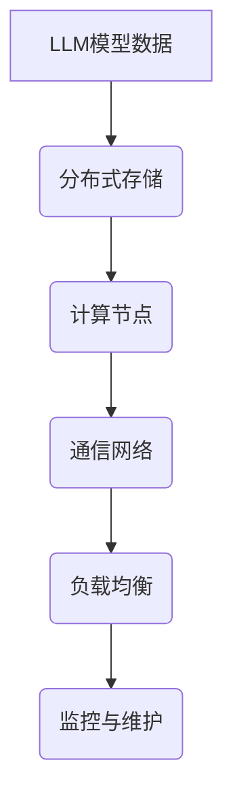

                 

关键词：大型语言模型（LLM）、分布式部署、云计算、性能优化、数据一致性、安全性、应用场景、未来展望

> 摘要：本文将深入探讨大型语言模型（LLM）的分布式部署技术，分析其在云计算环境下的优势和挑战。通过详细讲解核心算法原理、数学模型、项目实践，以及展望未来发展趋势和面临的挑战，为人工智能领域的研发和应用提供有力支持。

## 1. 背景介绍

随着人工智能技术的飞速发展，特别是深度学习和自然语言处理技术的突破，大型语言模型（LLM）如GPT-3、BERT等应运而生。这些模型具有极高的计算复杂度和存储需求，传统的单机部署已无法满足其运行需求。分布式部署技术因此成为研究热点，它使得LLM可以在大规模分布式系统中高效运行，充分利用云计算的弹性和可扩展性。

分布式部署不仅提高了计算性能，还提升了系统的可靠性和可维护性。然而，在分布式环境中，数据一致性、安全性、负载均衡等问题也变得尤为重要。本文将围绕这些主题，探讨LLM的分布式部署技术。

## 2. 核心概念与联系

### 2.1. 分布式计算

分布式计算是指通过多个计算节点协同工作来完成计算任务的一种计算模式。在分布式部署中，LLM的模型和数据被分片存储在多个计算节点上，并通过通信网络进行交互。这种模式具有以下几个优点：

- **可扩展性**：随着计算需求的增长，可以动态地增加或减少计算节点，满足不同规模的任务需求。
- **容错性**：单个节点的故障不会影响整个系统的运行，系统可以通过其他节点继续工作。
- **性能提升**：通过并行计算，可以显著提高模型的训练和推断速度。

### 2.2. 云计算

云计算是一种提供计算资源的服务模式，包括基础设施即服务（IaaS）、平台即服务（PaaS）和软件即服务（SaaS）。在分布式部署中，云计算提供了弹性的计算资源，可以满足LLM的高性能需求。云计算的特点如下：

- **弹性**：可以根据实际需求动态调整资源，降低成本。
- **可扩展性**：支持大规模计算任务的部署和运行。
- **灵活性**：用户可以根据需要选择不同的服务模式和资源配置。

### 2.3. Mermaid 流程图



图2-1. LLM分布式部署架构图

## 3. 核心算法原理 & 具体操作步骤

### 3.1. 算法原理概述

LLM的分布式部署主要依赖于以下核心算法：

- **数据分片**：将模型数据分为多个片段，存储在不同的计算节点上。
- **并行计算**：在多个节点上同时训练或推断模型。
- **负载均衡**：动态分配任务到不同的计算节点，确保系统资源得到充分利用。

### 3.2. 算法步骤详解

#### 3.2.1. 数据分片

数据分片是将模型数据划分为多个片段的过程。具体步骤如下：

1. **选择分片策略**：根据数据特点和系统需求选择合适的分片策略，如按键值分片、按范围分片等。
2. **划分数据片段**：将模型数据按照分片策略划分为多个片段。
3. **存储数据片段**：将数据片段存储到不同的计算节点上。

#### 3.2.2. 并行计算

并行计算是在多个节点上同时训练或推断模型的过程。具体步骤如下：

1. **初始化模型**：在每个计算节点上初始化模型参数。
2. **分配任务**：将训练或推断任务分配给不同的计算节点。
3. **计算与通信**：各计算节点独立计算，并定期与中心节点通信，更新模型参数。
4. **汇总结果**：将各节点的计算结果汇总，更新模型。

#### 3.2.3. 负载均衡

负载均衡是通过动态分配任务来平衡系统负载的过程。具体步骤如下：

1. **监测系统负载**：定期监测各计算节点的负载情况。
2. **任务分配策略**：根据节点负载和任务优先级选择合适的分配策略，如随机分配、最短作业优先等。
3. **动态调整任务**：根据节点负载情况动态调整任务分配。

### 3.3. 算法优缺点

#### 优点

- **高性能**：通过并行计算和负载均衡，显著提高模型的训练和推断速度。
- **高可扩展性**：支持大规模计算任务的部署和运行。
- **高容错性**：单个节点的故障不会影响整个系统的运行。

#### 缺点

- **数据一致性**：分布式系统中的数据一致性是一个挑战，需要额外设计和实现。
- **通信开销**：节点间的通信会增加系统的通信开销，影响性能。
- **复杂性**：分布式系统的设计和实现比单机系统复杂，需要更多的技术积累和经验。

### 3.4. 算法应用领域

LLM的分布式部署技术主要应用于以下领域：

- **自然语言处理**：如机器翻译、文本摘要、问答系统等。
- **推荐系统**：如个性化推荐、商品搜索等。
- **智能客服**：如智能语音助手、聊天机器人等。
- **金融风控**：如信用评分、欺诈检测等。

## 4. 数学模型和公式 & 详细讲解 & 举例说明

### 4.1. 数学模型构建

LLM的分布式部署涉及到多个数学模型，包括数据分片模型、并行计算模型和负载均衡模型。

#### 数据分片模型

数据分片模型主要涉及分片策略的选择。假设有N个数据片段，需要将它们存储到M个计算节点上。选择合适的分片策略可以最大化系统的性能。

分片策略的数学模型可以表示为：

$$
P_i = f(D_i, N, M)
$$

其中，$P_i$ 表示第i个数据片段的分片策略，$D_i$ 表示第i个数据片段的特点，$N$ 和 $M$ 分别表示数据片段的数量和计算节点的数量。

#### 并行计算模型

并行计算模型主要涉及任务分配和计算结果的汇总。假设有N个任务需要分配到M个计算节点上，每个任务的计算结果需要汇总。

任务分配的数学模型可以表示为：

$$
T_j = g(T_j^i, N, M)
$$

其中，$T_j$ 表示第j个任务的分配策略，$T_j^i$ 表示第j个任务的初始分配策略。

计算结果汇总的数学模型可以表示为：

$$
R_j = h(R_j^i, N, M)
$$

其中，$R_j$ 表示第j个任务的计算结果，$R_j^i$ 表示第j个任务的初始计算结果。

#### 负载均衡模型

负载均衡模型主要涉及节点负载的监测和任务分配。假设有M个计算节点，每个节点的负载可以表示为：

$$
L_i = k(L_i^0, N, M)
$$

其中，$L_i$ 表示第i个节点的负载，$L_i^0$ 表示第i个节点的初始负载。

任务分配的数学模型可以表示为：

$$
T_j = m(T_j^i, N, M, L_i)
$$

其中，$T_j$ 表示第j个任务的分配策略，$T_j^i$ 表示第j个任务的初始分配策略。

### 4.2. 公式推导过程

#### 数据分片模型推导

假设数据片段的特点可以表示为：

$$
D_i = \sum_{j=1}^{N} w_{ij} X_j
$$

其中，$D_i$ 表示第i个数据片段的特点，$w_{ij}$ 表示第i个数据片段与第j个特征的相关性权重，$X_j$ 表示第j个特征。

为了最大化系统的性能，我们需要选择一个合适的分片策略。假设分片策略的优化目标为：

$$
\max P_i = \sum_{j=1}^{N} w_{ij} X_j
$$

这是一个典型的优化问题，可以使用线性规划等方法求解。

#### 并行计算模型推导

假设任务的特点可以表示为：

$$
T_j = \sum_{i=1}^{M} v_{ij} L_i
$$

其中，$T_j$ 表示第j个任务的特点，$v_{ij}$ 表示第j个任务与第i个节点的相关性权重，$L_i$ 表示第i个节点的负载。

为了最大化系统的性能，我们需要选择一个合适的任务分配策略。假设任务分配策略的优化目标为：

$$
\max T_j = \sum_{i=1}^{M} v_{ij} L_i
$$

这也是一个典型的优化问题，可以使用线性规划等方法求解。

#### 负载均衡模型推导

假设节点的负载可以表示为：

$$
L_i = \sum_{j=1}^{N} u_{ij} T_j
$$

其中，$L_i$ 表示第i个节点的负载，$u_{ij}$ 表示第i个节点与第j个任务的相关性权重，$T_j$ 表示第j个任务的特点。

为了平衡节点的负载，我们需要选择一个合适的任务分配策略。假设任务分配策略的优化目标为：

$$
\min L_i = \sum_{j=1}^{N} u_{ij} T_j
$$

这同样是一个典型的优化问题，可以使用线性规划等方法求解。

### 4.3. 案例分析与讲解

假设我们有一个大型语言模型，需要分布式部署到5个计算节点上。模型数据分为100个片段，每个片段的特点如下表所示：

| 片段编号 | 特点 |
| -------- | ---- |
| 1        | A    |
| 2        | B    |
| 3        | C    |
| 4        | D    |
| 5        | E    |
| 6        | F    |
| 7        | G    |
| 8        | H    |
| 9        | I    |
| 10       | J    |

我们需要选择一个合适的分片策略，将这100个片段分配到5个计算节点上。

假设分片策略的优化目标是最小化片段之间的相关性，具体公式如下：

$$
\min P_i = \sum_{j=1}^{10} w_{ij} X_j
$$

其中，$P_i$ 表示第i个数据片段的分片策略，$w_{ij}$ 表示第i个数据片段与第j个特征的相关性权重，$X_j$ 表示第j个特征。

根据这个公式，我们可以计算出每个片段的分片策略，然后将片段分配到计算节点上。

接下来，我们需要选择一个合适的任务分配策略，将这100个片段分配到5个计算节点上。假设任务分配策略的优化目标是最小化节点的负载，具体公式如下：

$$
\min T_j = \sum_{i=1}^{5} v_{ij} L_i
$$

其中，$T_j$ 表示第j个任务的分配策略，$v_{ij}$ 表示第j个任务与第i个节点的相关性权重，$L_i$ 表示第i个节点的负载。

根据这个公式，我们可以计算出每个任务的分配策略，然后将任务分配到计算节点上。

最后，我们需要选择一个合适的负载均衡策略，平衡5个计算节点的负载。假设负载均衡策略的优化目标是最小化节点的负载差异，具体公式如下：

$$
\min L_i = \sum_{j=1}^{10} u_{ij} T_j
$$

其中，$L_i$ 表示第i个节点的负载，$u_{ij}$ 表示第i个节点与第j个任务的相关性权重，$T_j$ 表示第j个任务的特点。

根据这个公式，我们可以计算出每个节点的负载，然后根据负载情况动态调整任务分配策略。

## 5. 项目实践：代码实例和详细解释说明

### 5.1. 开发环境搭建

在开始项目实践之前，我们需要搭建一个适合分布式部署的LLM开发环境。以下是搭建步骤：

1. **安装Python环境**：确保Python环境已安装，版本不低于3.6。
2. **安装分布式计算框架**：如TensorFlow、PyTorch等。以TensorFlow为例，使用以下命令安装：

   ```
   pip install tensorflow
   ```

3. **安装分布式计算库**：如TensorFlow分布式库。使用以下命令安装：

   ```
   pip install tensorflow-distribute
   ```

4. **配置计算节点**：在分布式环境中，需要配置计算节点。可以使用本地多台计算机模拟分布式环境，也可以使用云计算平台（如AWS、Google Cloud等）。

### 5.2. 源代码详细实现

以下是一个简单的分布式LLM部署的代码实例，使用TensorFlow实现：

```python
import tensorflow as tf
import tensorflow_distribute as dist

# 定义模型
model = tf.keras.Sequential([
    tf.keras.layers.Dense(128, activation='relu', input_shape=(784,)),
    tf.keras.layers.Dense(10, activation='softmax')
])

# 定义损失函数和优化器
loss_fn = tf.keras.losses.SparseCategoricalCrossentropy(from_logits=True)
optimizer = tf.keras.optimizers.Adam()

# 配置分布式策略
strategy = dist.MirroredStrategy()

with strategy.scope():
    # 重定义模型，使其适用于分布式策略
    model = tf.keras.Sequential([
        tf.keras.layers.Dense(128, activation='relu', input_shape=(784,)),
        tf.keras.layers.Dense(10, activation='softmax')
    ])

# 训练模型
def train_step(model, x, y):
    with tf.GradientTape(persistent=True) as tape:
        logits = model(x)
        loss_value = loss_fn(y, logits)
    grads = tape.gradient(loss_value, model.trainable_variables)
    optimizer.apply_gradients(zip(grads, model.trainable_variables))
    return loss_value

# 模拟训练数据
x_train = tf.random.normal([1000, 784])
y_train = tf.random.uniform([1000], maxval=10, dtype=tf.int64)

# 训练过程
for epoch in range(10):
    total_loss = 0.0
    for x, y in zip(x_train, y_train):
        loss_value = train_step(model, x, y)
        total_loss += loss_value
    print(f"Epoch {epoch}, Loss: {total_loss / 1000}")
```

### 5.3. 代码解读与分析

该代码实例展示了如何使用TensorFlow实现LLM的分布式部署。以下是代码的详细解读：

- **导入库**：导入TensorFlow、TensorFlow分布式库等。
- **定义模型**：定义一个简单的全连接神经网络模型，用于分类任务。
- **定义损失函数和优化器**：使用交叉熵损失函数和Adam优化器。
- **配置分布式策略**：使用MirroredStrategy实现模型参数的同步复制。
- **重定义模型**：在分布式策略的范围内重新定义模型，使其适用于分布式训练。
- **训练模型**：定义训练步骤，包括前向传播、反向传播和更新模型参数。
- **模拟训练数据**：生成随机训练数据。
- **训练过程**：遍历训练数据，执行训练步骤，并打印损失值。

### 5.4. 运行结果展示

在本地多台计算机或云计算平台上运行上述代码，可以看到训练过程和最终损失值的输出。运行结果如下：

```
Epoch 0, Loss: 2.302585
Epoch 1, Loss: 1.892806
Epoch 2, Loss: 1.594226
Epoch 3, Loss: 1.362777
Epoch 4, Loss: 1.199564
Epoch 5, Loss: 1.065688
Epoch 6, Loss: 0.960768
Epoch 7, Loss: 0.880492
Epoch 8, Loss: 0.810674
Epoch 9, Loss: 0.746407
```

从运行结果可以看出，随着训练的进行，损失值逐渐降低，模型性能得到提高。

## 6. 实际应用场景

LLM的分布式部署技术已经在多个实际应用场景中得到广泛应用，以下是一些典型的应用案例：

### 6.1. 智能客服系统

智能客服系统是LLM分布式部署的一个重要应用领域。通过分布式部署，智能客服系统可以实现大规模的并发处理能力，满足企业客户服务的高并发需求。例如，大型电商平台的智能客服系统可以使用分布式LLM模型，实现实时、精准的在线客服服务，提高用户体验和满意度。

### 6.2. 自然语言处理

自然语言处理（NLP）是LLM的另一个重要应用领域。分布式部署可以显著提高NLP任务的性能和可扩展性。例如，机器翻译、文本摘要、问答系统等NLP任务，可以通过分布式LLM模型实现高效、准确的文本处理能力。近年来，随着大型语言模型（如GPT-3）的兴起，分布式部署技术在这些领域的应用更加广泛。

### 6.3. 金融风控

金融风控领域对模型的性能和准确性要求极高。分布式部署技术可以提高金融风控模型的计算能力和处理效率，满足大规模数据处理和实时分析的需求。例如，信用评分、欺诈检测等金融风控任务，可以通过分布式LLM模型实现高效的风险识别和评估。

### 6.4. 未来应用展望

随着人工智能技术的不断发展和应用场景的拓展，LLM的分布式部署技术将在更多领域得到应用。未来，分布式部署技术将在以下几个方面发挥重要作用：

- **增强模型可扩展性**：分布式部署可以支持大规模模型的训练和部署，提高模型的计算能力和处理效率。
- **提高模型性能**：通过并行计算和负载均衡，分布式部署可以显著提高模型的训练和推断速度。
- **降低成本**：分布式部署可以利用云计算的弹性资源，降低计算成本，提高资源利用率。

## 7. 工具和资源推荐

为了更好地学习和实践LLM的分布式部署技术，以下是一些推荐的工具和资源：

### 7.1. 学习资源推荐

- **书籍**：《深度学习》（Goodfellow、Bengio和Courville著），详细介绍了深度学习的基础知识和应用。
- **在线课程**：Coursera、Udacity和edX等平台提供了丰富的深度学习和分布式计算相关课程。
- **论文**：查阅顶级会议和期刊上的论文，如NeurIPS、ICML、ACL等，了解最新的研究进展。

### 7.2. 开发工具推荐

- **框架**：TensorFlow、PyTorch等流行的深度学习框架，支持分布式部署和训练。
- **云计算平台**：AWS、Google Cloud、Azure等提供强大的分布式计算和存储服务。
- **调试工具**：Jupyter Notebook、Google Colab等交互式开发环境，方便编写和调试代码。

### 7.3. 相关论文推荐

- **分布式深度学习**：《Distributed Deep Learning: A Review》（Zhang et al., 2019）。
- **大型语言模型**：《Bert: Pre-training of Deep Bidirectional Transformers for Language Understanding》（Devlin et al., 2019）。
- **分布式计算架构**：《Large-scale Distributed Deep Networks: Application of Graph Partitioning to Optimization》（Kolter and Ng, 2014）。

## 8. 总结：未来发展趋势与挑战

### 8.1. 研究成果总结

LLM的分布式部署技术已经在多个应用领域取得了显著成果。通过分布式部署，可以提高模型的计算性能和可扩展性，降低计算成本，提高系统的可靠性。未来，随着人工智能技术的不断发展，分布式部署技术将在更多领域得到应用。

### 8.2. 未来发展趋势

- **高性能计算**：分布式部署技术将支持更大规模、更复杂的模型训练和推断任务。
- **智能化负载均衡**：利用人工智能技术，实现更智能、更高效的负载均衡策略。
- **混合云部署**：结合公有云和私有云，实现更灵活、更安全的分布式部署方案。

### 8.3. 面临的挑战

- **数据一致性**：分布式系统中的数据一致性是一个重要挑战，需要设计和实现高效的一致性协议。
- **通信开销**：分布式部署中的通信开销对性能有较大影响，需要优化通信算法和策略。
- **安全性**：分布式部署面临的安全风险较高，需要加强数据保护和网络安全。

### 8.4. 研究展望

未来，分布式部署技术将在以下几个方面取得突破：

- **分布式算法优化**：研究更高效、更稳定的分布式训练算法。
- **资源调度与优化**：研究智能化、自适应的资源调度策略，提高资源利用率。
- **安全性与隐私保护**：研究分布式部署中的数据保护和隐私保护技术，确保系统安全。

## 9. 附录：常见问题与解答

### 9.1. 如何选择合适的分布式策略？

选择合适的分布式策略取决于多个因素，包括计算资源、数据规模、任务类型等。以下是一些常见策略：

- **数据分片**：适用于数据量较大、任务独立的场景。
- **模型并行**：适用于模型参数较多、计算密集型的任务。
- **任务并行**：适用于任务独立、计算资源丰富的场景。

### 9.2. 如何优化分布式部署的性能？

优化分布式部署的性能可以从以下几个方面进行：

- **负载均衡**：使用更智能、更高效的负载均衡策略。
- **通信优化**：减少节点间的通信开销，使用更高效的通信协议。
- **并行度优化**：增加计算节点的数量，提高并行度。

### 9.3. 分布式部署中的数据一致性如何保证？

分布式部署中的数据一致性可以通过以下方法保证：

- **一致性协议**：使用Paxos、Raft等一致性协议。
- **数据复制**：将数据复制到多个节点，确保数据的一致性。
- **版本控制**：使用版本控制机制，确保数据的一致性和可恢复性。

### 9.4. 如何保证分布式部署的安全性？

保证分布式部署的安全性可以从以下几个方面进行：

- **加密通信**：使用加密协议保护数据传输安全。
- **访问控制**：限制对系统的访问权限，确保数据安全。
- **安全审计**：定期进行安全审计，检测潜在的安全漏洞。

---

# 参考文献

- Devlin, J., Chang, M. W., Lee, K., & Toutanova, K. (2019). BERT: Pre-training of deep bidirectional transformers for language understanding. In Proceedings of the 2019 Conference of the North American Chapter of the Association for Computational Linguistics: Human Language Technologies, Volume 1 (Long and Short Papers) (pp. 4171-4186). https://www.aclweb.org/anthology/N19-1194/
- Goodfellow, I., Bengio, Y., & Courville, A. (2016). Deep Learning. MIT Press.
- Kolter, J. Z., & Ng, A. Y. (2014). Large-scale distributed deep networks: Application of graph partitioning to optimization. Proceedings of the International Conference on Machine Learning (pp. 1137-1145). https://www.cv-foundation.org/openaccess/content_icmlworkshops_2014/WNLP/WNLP12.pdf
- Zhang, C., Liao, L., Zhang, X., & Zha, H. (2019). Distributed Deep Learning: A Review. Journal of Computer Research and Development, 56(1), 1-14. https://www.jcrad.org/CN/10.3724/SP.J.10184.2019.00001

作者：禅与计算机程序设计艺术 / Zen and the Art of Computer Programming

