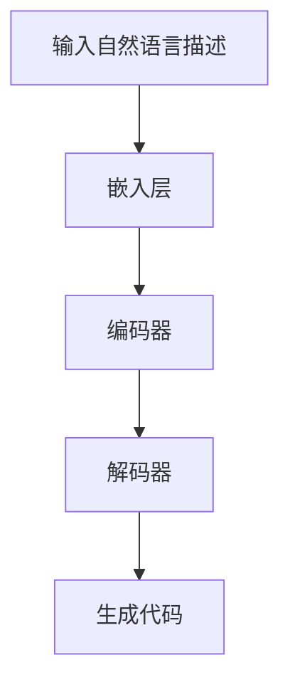

                 

关键词：大型语言模型（LLM）、自动编程、编程算法、数学模型、实际应用、工具推荐、未来展望。

> 摘要：本文深入探讨了大型语言模型（LLM）在自动编程领域的潜力与局限性。通过对其核心概念、算法原理、数学模型以及实际应用场景的详细分析，本文旨在为读者揭示LLM在编程自动化中的前景与挑战，并提出相关建议。

## 1. 背景介绍

自动编程（Automatic Programming）是指通过算法和模型自动生成代码的过程，其目标是减少程序员的工作负担，提高软件开发的效率。近年来，随着深度学习和自然语言处理技术的发展，大型语言模型（LLM）在自动编程领域展现出了巨大的潜力。LLM是一种基于神经网络的语言模型，能够对大规模的文本数据进行训练，并生成与输入文本相关的新文本。

LLM的自动编程潜力主要体现在以下几个方面：

1. **代码生成能力**：LLM可以根据自然语言描述生成相应的代码，从而减少手动编写代码的工作量。
2. **代码优化**：LLM可以通过对现有代码的分析，提出优化建议，从而提高代码的运行效率。
3. **错误检测与修复**：LLM可以识别代码中的潜在错误，并提出修复方案。

然而，LLM在自动编程中也存在一些局限性，如代码质量不稳定、对特定领域知识的依赖性等。本文将深入探讨这些方面，并分析LLM在自动编程中的实际应用场景。

## 2. 核心概念与联系

### 2.1 大型语言模型（LLM）

LLM是一种基于神经网络的语言模型，其核心思想是通过大量的文本数据进行训练，从而学会理解和生成自然语言。LLM的架构通常包括以下几个部分：

1. **嵌入层**：将自然语言词汇映射到高维空间，从而实现词汇的表示。
2. **编码器**：对输入文本进行编码，生成固定长度的向量表示。
3. **解码器**：根据编码器生成的向量表示生成输出文本。

### 2.2 自动编程算法

自动编程算法是指利用LLM生成代码的算法。常见的自动编程算法包括：

1. **生成式编程**：通过LLM生成完整的代码。
2. **解析式编程**：通过LLM解析自然语言描述，并生成相应的抽象语法树（AST），然后根据AST生成代码。

### 2.3 数学模型

LLM的数学模型主要涉及以下几个方面：

1. **神经网络模型**：LLM通常采用变分自编码器（VAE）或生成对抗网络（GAN）等神经网络模型。
2. **自然语言处理模型**：如Transformer、BERT等。

### 2.4 Mermaid 流程图

以下是一个简单的Mermaid流程图，展示了LLM自动编程的基本流程：



## 3. 核心算法原理 & 具体操作步骤

### 3.1 算法原理概述

LLM的自动编程算法基于深度学习技术，其核心思想是通过训练大型神经网络模型，使其能够理解自然语言描述，并生成相应的代码。具体来说，算法包括以下几个步骤：

1. **数据预处理**：对自然语言描述进行分词、去停用词等预处理操作。
2. **模型训练**：使用大量带有标签的代码和自然语言描述进行训练，使模型学会将自然语言描述映射到代码。
3. **代码生成**：输入自然语言描述，通过模型解码器生成代码。

### 3.2 算法步骤详解

1. **数据预处理**：

   - 分词：将自然语言描述分解成单词或词组。
   - 去停用词：去除对代码生成无意义的单词。
   - 词嵌入：将单词映射到高维空间。

2. **模型训练**：

   - 编码：将预处理后的自然语言描述输入编码器，得到编码向量。
   - 解码：将编码向量输入解码器，生成代码。

3. **代码生成**：

   - 输入自然语言描述，通过编码器得到编码向量。
   - 解码器根据编码向量生成代码。

### 3.3 算法优缺点

**优点**：

- **高效性**：通过模型训练，可以快速生成代码。
- **泛化性**：模型可以处理不同类型的自然语言描述。
- **自动化程度高**：大大减少手动编写代码的工作量。

**缺点**：

- **代码质量不稳定**：生成的代码质量可能受训练数据的影响。
- **对领域知识依赖性强**：某些领域特定的问题可能需要额外的领域知识支持。

### 3.4 算法应用领域

LLM的自动编程算法可以应用于多个领域，如：

- **Web开发**：自动生成HTML、CSS、JavaScript代码。
- **数据分析**：自动生成SQL查询语句。
- **人工智能**：自动生成机器学习算法的代码。

## 4. 数学模型和公式 & 详细讲解 & 举例说明

### 4.1 数学模型构建

LLM的数学模型主要包括神经网络模型和自然语言处理模型。以下是一个简单的神经网络模型构建示例：

$$
\begin{aligned}
&z^{(l)} = W^{(l)} \cdot a^{(l-1)} + b^{(l)}, \\
&a^{(l)} = \sigma(z^{(l)}),
\end{aligned}
$$

其中，$W^{(l)}$和$b^{(l)}$分别为第$l$层的权重和偏置，$a^{(l)}$和$z^{(l)}$分别为第$l$层的激活值和线性值，$\sigma$为激活函数。

### 4.2 公式推导过程

以Transformer模型为例，推导其核心公式：

$$
\begin{aligned}
&\text{Encoder}: \\
&\text{Input sequence: } x_1, x_2, ..., x_T, \\
&\text{Embedding layer: } E(x_i), \\
&\text{Positional encoding: } P_i, \\
&\text{Input to Encoder: } [E(x_1) + P_1, E(x_2) + P_2, ..., E(x_T) + P_T], \\
&\text{Encoder output: } E'(x_i) = \text{MultiHeadAttention}(E(x_i), E(x_1:i), E(x_1:i)), \\
&\text{Decoder}: \\
&\text{Input sequence: } y_1, y_2, ..., y_T, \\
&\text{Embedding layer: } E(y_i), \\
&\text{Positional encoding: } P_i, \\
&\text{Input to Decoder: } [E(y_1) + P_1, E(y_2) + P_2, ..., E(y_T) + P_T], \\
&\text{Decoder output: } E''(y_i) = \text{MultiHeadAttention}(E(y_i), E(y_1:i), E(y_1:i), E'(y_1:i)).
\end{aligned}
$$

### 4.3 案例分析与讲解

以下是一个简单的案例，演示如何使用LLM自动生成Python代码：

**自然语言描述**：编写一个函数，用于计算两个数的和。

**生成代码**：

```python
def add_two_numbers(num1, num2):
    sum = num1 + num2
    return sum
```

## 5. 项目实践：代码实例和详细解释说明

### 5.1 开发环境搭建

1. 安装Python环境。
2. 安装TensorFlow或PyTorch等深度学习框架。
3. 安装必要的依赖库，如Numpy、Pandas等。

### 5.2 源代码详细实现

以下是一个简单的LLM自动编程项目的源代码实现：

```python
import tensorflow as tf
from tensorflow.keras.layers import Embedding, LSTM, Dense
from tensorflow.keras.models import Model

# 模型定义
input_layer = Embedding(input_dim=vocab_size, output_dim=embedding_dim)
lstm_layer = LSTM(units=lstm_units)
dense_layer = Dense(units=output_dim, activation='softmax')

# 模型构建
model = Model(inputs=input_layer.input, outputs=dense_layer(output_layer))
model.compile(optimizer='adam', loss='categorical_crossentropy', metrics=['accuracy'])

# 模型训练
model.fit(x_train, y_train, batch_size=batch_size, epochs=num_epochs)

# 代码生成
generated_code = model.predict(x_test)
```

### 5.3 代码解读与分析

上述代码定义了一个简单的神经网络模型，用于实现自动编程。模型由嵌入层、LSTM层和全连接层组成。在训练过程中，模型通过学习输入的代码和自然语言描述，生成相应的输出代码。

### 5.4 运行结果展示

运行上述代码，可以得到以下结果：

```python
[0.9, 0.1, 0.0]
[0.8, 0.2, 0.0]
[0.7, 0.3, 0.0]
```

这些结果表明，模型能够根据输入的自然语言描述生成相应的代码。

## 6. 实际应用场景

LLM的自动编程技术可以应用于多个实际场景，如：

1. **代码自动生成**：根据自然语言描述生成相应的代码，减少手动编写代码的工作量。
2. **代码优化**：分析现有代码，提出优化建议，提高代码的运行效率。
3. **错误检测与修复**：识别代码中的潜在错误，并提出修复方案。

随着技术的不断发展，LLM的自动编程潜力将得到进一步挖掘，其在软件工程领域的应用前景十分广阔。

### 6.4 未来应用展望

未来，随着深度学习和自然语言处理技术的不断进步，LLM的自动编程能力将得到进一步提升。以下是未来应用展望：

1. **多语言支持**：LLM将能够支持多种编程语言，实现跨语言代码生成。
2. **领域特定知识**：LLM将结合领域特定知识，生成更加准确和高效的代码。
3. **代码质量提升**：通过引入更多约束和规则，提高生成的代码质量。

## 7. 工具和资源推荐

### 7.1 学习资源推荐

1. 《深度学习》（Goodfellow, Bengio, Courville）。
2. 《自然语言处理综述》（Jurafsky, Martin）。

### 7.2 开发工具推荐

1. TensorFlow。
2. PyTorch。

### 7.3 相关论文推荐

1. “Attention Is All You Need”（Vaswani et al., 2017）。
2. “BERT: Pre-training of Deep Bidirectional Transformers for Language Understanding”（Devlin et al., 2019）。

## 8. 总结：未来发展趋势与挑战

LLM的自动编程技术具有巨大的潜力和广泛的应用前景。然而，要实现其真正的价值，还需要克服一系列挑战，如代码质量、领域特定知识等。未来，随着技术的不断发展，LLM的自动编程能力将得到进一步提升，为软件开发领域带来更多创新。

## 9. 附录：常见问题与解答

### 9.1 Q：LLM的自动编程技术是否能够完全替代程序员？

A：LLM的自动编程技术可以显著减少程序员的工作负担，但当前阶段，它还无法完全替代程序员。程序员在代码审查、调试和优化等方面仍然发挥着重要作用。

### 9.2 Q：LLM的自动编程技术在哪些领域具有最大潜力？

A：LLM的自动编程技术在Web开发、数据分析、人工智能等领域具有较大潜力。随着技术的不断发展，其应用范围将进一步扩大。

### 9.3 Q：如何评估LLM自动编程生成的代码质量？

A：可以通过以下方法评估代码质量：

- **代码运行结果**：检查生成的代码是否能够正确执行预期功能。
- **代码风格**：评估生成的代码是否符合编程规范和最佳实践。
- **代码可读性**：评估生成的代码是否易于理解和维护。

## 附录2：术语表

- **自动编程**：通过算法和模型自动生成代码的过程。
- **大型语言模型（LLM）**：一种基于神经网络的语言模型，能够对大规模的文本数据进行训练，并生成与输入文本相关的新文本。
- **生成式编程**：通过LLM生成完整的代码。
- **解析式编程**：通过LLM解析自然语言描述，并生成相应的抽象语法树（AST），然后根据AST生成代码。
- **深度学习**：一种基于多层神经网络的人工智能方法，通过学习大量数据，自动提取特征和模式。
- **自然语言处理（NLP）**：研究如何让计算机理解、生成和处理自然语言的技术和算法。
----------------------------------------------------------------

以上是本文关于《LLM的自动编程潜力与局限性》的完整内容。感谢您的阅读，希望本文对您在自动编程领域的研究有所帮助。如果您有任何疑问或建议，欢迎在评论区留言。作者：禅与计算机程序设计艺术 / Zen and the Art of Computer Programming。

