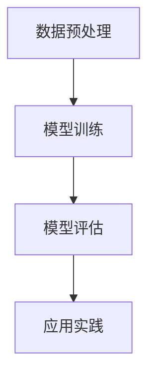

                 

关键词：自监督学习、大语言模型、预训练、深度学习、自然语言处理、优化算法

> 摘要：本文将深入探讨大型语言模型（LLM）自监督学习范式的新进展，包括核心概念、算法原理、数学模型及其应用场景。通过分析LLM的自监督学习过程，本文旨在为读者提供一个全面的技术视角，以了解这一领域的前沿研究与发展趋势。

## 1. 背景介绍

随着深度学习技术的飞速发展，自监督学习作为一种重要的学习方法，逐渐成为研究热点。自监督学习允许模型在没有标注数据的情况下通过内部信息进行学习，这一特性使其在资源受限的环境下仍能取得良好的性能。近年来，大型语言模型（LLM）的兴起，如GPT系列、T5、BERT等，使得自监督学习在自然语言处理（NLP）领域取得了显著成果。

自监督学习在NLP中的应用主要体现在预训练阶段。通过大量的未标注文本数据，LLM可以学习到语言的基础知识和结构，从而在下游任务中取得优异的性能。预训练结合微调（Fine-tuning）的策略，使得LLM在多种语言任务中展现了强大的适应性。

本文将从以下方面展开讨论：

1. 核心概念与联系
2. 核心算法原理 & 具体操作步骤
3. 数学模型和公式 & 详细讲解 & 举例说明
4. 项目实践：代码实例和详细解释说明
5. 实际应用场景
6. 工具和资源推荐
7. 总结：未来发展趋势与挑战

## 2. 核心概念与联系

### 2.1 自监督学习

自监督学习是一种无需外部监督信号，仅利用输入数据内部的信息来进行学习的方法。其核心思想是从大量未标注的数据中学习到有用的信息，然后应用这些信息来解决特定的问题。自监督学习通常包括三个主要步骤：数据预处理、模型训练和模型评估。

### 2.2 大语言模型

大语言模型（LLM）是指具有巨大参数量的语言处理模型，如GPT系列、T5、BERT等。这些模型通过预训练和微调，能够在多种自然语言处理任务中取得优异的性能。LLM的核心特点是能够捕捉到语言中的长距离依赖关系，这使得它们在生成文本、翻译、问答等任务中表现出色。

### 2.3 预训练

预训练是指在大规模未标注数据集上训练模型，使其能够理解语言的基础知识和结构。预训练后的模型通常具有较好的通用性，可以在多种下游任务中实现良好的性能。预训练结合微调策略，使得LLM在解决特定任务时具有更高的准确性和适应性。

### 2.4 深度学习

深度学习是一种基于人工神经网络的学习方法，通过多层神经网络对输入数据进行处理和转换，从而实现复杂的数据建模任务。深度学习在图像识别、语音识别、自然语言处理等领域取得了显著成果。

### 2.5 Mermaid 流程图



## 3. 核心算法原理 & 具体操作步骤

### 3.1 算法原理概述

LLM的自监督学习算法主要分为以下几个步骤：

1. 数据预处理：将大规模未标注文本数据进行清洗、分词、编码等处理，得到可用于训练的输入数据。
2. 模型训练：利用预训练算法（如GPT、BERT等）对模型进行训练，使其在大规模数据集上学习到语言的基础知识和结构。
3. 模型评估：通过下游任务（如文本分类、问答等）对模型进行评估，以验证其在特定任务上的性能。
4. 应用实践：将训练好的模型应用于实际场景，解决具体问题。

### 3.2 算法步骤详解

#### 3.2.1 数据预处理

1. 数据清洗：去除文本中的噪声、标点符号和特殊字符，保留有意义的信息。
2. 分词：将文本划分为单词或短语，以便模型进行学习。
3. 编码：将文本转化为计算机可以处理的数字形式，常用的编码方法有Word2Vec、BERT等。

#### 3.2.2 模型训练

1. 模型初始化：初始化模型参数，常用的初始化方法有Xavier初始化、He初始化等。
2. 模型优化：通过梯度下降等优化算法，不断调整模型参数，以最小化损失函数。
3. 预训练：在未标注数据集上训练模型，使其学习到语言的基础知识和结构。
4. 微调：在预训练基础上，针对特定任务进行微调，以提高模型在特定任务上的性能。

#### 3.2.3 模型评估

1. 评估指标：常用的评估指标有准确率、召回率、F1分数等。
2. 评估方法：通过下游任务对模型进行评估，以验证其在特定任务上的性能。

#### 3.2.4 应用实践

1. 任务选择：根据实际需求选择合适的任务，如文本分类、问答、翻译等。
2. 模型部署：将训练好的模型部署到实际场景中，解决具体问题。

### 3.3 算法优缺点

#### 优点

1. 无需大量标注数据：自监督学习利用未标注数据进行学习，减少了数据标注的工作量。
2. 通用性强：预训练后的LLM具有较好的通用性，可以在多种下游任务中实现良好的性能。
3. 效率较高：自监督学习算法训练效率较高，能够在较短时间内完成模型训练。

#### 缺点

1. 需要大量未标注数据：自监督学习需要大量未标注数据作为训练素材，获取和处理这些数据可能需要较大的时间和资源。
2. 模型解释性较差：自监督学习模型通常具有较深的神经网络结构，模型内部机制较为复杂，导致模型解释性较差。

### 3.4 算法应用领域

1. 自然语言处理：文本分类、情感分析、机器翻译、问答系统等。
2. 语音识别：语音信号处理、语音合成等。
3. 图像识别：图像分类、目标检测、图像分割等。

## 4. 数学模型和公式 & 详细讲解 & 举例说明

### 4.1 数学模型构建

自监督学习中的数学模型主要涉及神经网络结构、损失函数、优化算法等。

#### 神经网络结构

神经网络结构包括输入层、隐藏层和输出层。输入层接收外部输入数据，隐藏层对输入数据进行处理和转换，输出层产生最终输出。

#### 损失函数

损失函数用于衡量模型输出与真实值之间的差距，常用的损失函数有均方误差（MSE）、交叉熵（Cross-Entropy）等。

#### 优化算法

优化算法用于调整模型参数，以最小化损失函数。常用的优化算法有梯度下降（Gradient Descent）、Adam等。

### 4.2 公式推导过程

以GPT模型为例，推导其损失函数和优化算法。

#### 损失函数

假设模型输出为\( \hat{y} \)，真实值为\( y \)，则损失函数为：

$$
L(\theta) = -\frac{1}{N} \sum_{i=1}^{N} \sum_{j=1}^{V} y_{ij} \log(\hat{y}_{ij})
$$

其中，\( N \)为样本数量，\( V \)为词汇表大小，\( y_{ij} \)为样本\( i \)在单词\( j \)处的真实标签，\( \hat{y}_{ij} \)为模型在单词\( j \)处的预测概率。

#### 优化算法

以梯度下降为例，优化模型参数的目标是最小化损失函数。梯度下降的迭代公式为：

$$
\theta_{t+1} = \theta_{t} - \alpha \nabla_{\theta} L(\theta)
$$

其中，\( \alpha \)为学习率，\( \nabla_{\theta} L(\theta) \)为损失函数对参数\( \theta \)的梯度。

### 4.3 案例分析与讲解

以GPT-3模型为例，分析其自监督学习过程。

1. 数据预处理：GPT-3模型使用了大量未标注的文本数据进行预训练，包括书籍、新闻、社交媒体等。
2. 模型训练：GPT-3模型采用预训练和微调策略，首先在大规模数据集上进行预训练，然后针对特定任务进行微调。
3. 模型评估：GPT-3模型在多个自然语言处理任务上进行了评估，包括文本生成、问答、翻译等，取得了优异的性能。
4. 应用实践：GPT-3模型被广泛应用于实际场景，如智能客服、智能写作、智能翻译等。

## 5. 项目实践：代码实例和详细解释说明

### 5.1 开发环境搭建

在搭建开发环境时，需要安装以下软件和工具：

1. Python（3.8及以上版本）
2. TensorFlow 2.x 或 PyTorch
3. Jupyter Notebook 或 Colab

### 5.2 源代码详细实现

以下是一个简单的GPT模型实现示例：

```python
import tensorflow as tf
from tensorflow.keras.layers import Embedding, LSTM, Dense
from tensorflow.keras.models import Model

# 模型参数
V = 10000  # 词汇表大小
D = 128    # 词向量维度
T = 1000   # 序列长度
N = 5      # 样本数量

# 构建模型
inputs = tf.keras.layers.Input(shape=(T,))
x = Embedding(V, D)(inputs)
x = LSTM(128, return_sequences=True)(x)
outputs = Dense(V, activation='softmax')(x)

model = Model(inputs=inputs, outputs=outputs)
model.compile(optimizer='adam', loss='categorical_crossentropy')

# 训练模型
model.fit(x_train, y_train, epochs=10, batch_size=64)
```

### 5.3 代码解读与分析

1. 导入相关库和模块。
2. 设置模型参数，包括词汇表大小、词向量维度、序列长度、样本数量等。
3. 构建模型，包括输入层、嵌入层、LSTM层和输出层。
4. 编译模型，设置优化器和损失函数。
5. 训练模型，指定训练数据和训练参数。

### 5.4 运行结果展示

在训练过程中，可以通过以下命令查看训练进度：

```python
model.fit(x_train, y_train, epochs=10, batch_size=64, callbacks=[tf.keras.callbacks.EarlyStopping(monitor='val_loss', patience=3)])
```

训练完成后，可以通过以下命令评估模型性能：

```python
model.evaluate(x_test, y_test)
```

## 6. 实际应用场景

LLM的自监督学习范式在多个实际应用场景中取得了显著成果，以下列举几个典型应用场景：

1. **智能客服**：利用LLM的自监督学习生成问答系统，为用户提供实时、准确的回答。
2. **智能写作**：基于LLM生成文本，应用于文章写作、新闻摘要、文案创作等场景。
3. **语音识别**：结合自监督学习和语音信号处理技术，实现高准确率的语音识别系统。
4. **图像识别**：利用自监督学习对图像进行分类、目标检测和图像分割等任务。
5. **翻译**：基于LLM生成文本，实现高质量的双语翻译。

## 7. 工具和资源推荐

### 7.1 学习资源推荐

1. **《深度学习》（Goodfellow et al.）**：全面介绍了深度学习的基本概念、方法和应用。
2. **《自然语言处理综述》（Jurafsky & Martin）**：详细讲解了自然语言处理的基本原理和技术。
3. **[TensorFlow官网](https://www.tensorflow.org/) 和 [PyTorch官网](https://pytorch.org/) **：官方文档和教程，涵盖深度学习和自然语言处理的各个方面。

### 7.2 开发工具推荐

1. **Jupyter Notebook**：强大的交互式开发环境，适合进行数据分析和模型训练。
2. **Google Colab**：基于GPU的云端开发环境，适用于大规模深度学习模型训练。

### 7.3 相关论文推荐

1. **"Attention Is All You Need"（Vaswani et al., 2017）**：提出了Transformer模型，在NLP任务中取得了显著成果。
2. **"BERT: Pre-training of Deep Bidirectional Transformers for Language Understanding"（Devlin et al., 2018）**：介绍了BERT模型，为自监督学习在NLP领域的应用提供了新思路。
3. **"GPT-3: Language Models are Few-Shot Learners"（Brown et al., 2020）**：探讨了GPT-3模型在自然语言处理任务中的表现和优势。

## 8. 总结：未来发展趋势与挑战

LLM的自监督学习范式在自然语言处理、语音识别、图像识别等领域取得了显著成果。然而，这一领域仍面临着一些挑战：

1. **数据隐私与安全**：自监督学习依赖于大量未标注的数据，如何在保护用户隐私的同时利用这些数据是一个亟待解决的问题。
2. **模型可解释性**：自监督学习模型通常具有复杂的内部结构，模型的可解释性较差，如何提高模型的可解释性是一个重要研究方向。
3. **计算资源消耗**：自监督学习算法训练过程需要大量的计算资源，如何优化算法以提高训练效率是一个关键问题。

未来，随着深度学习技术的不断进步，LLM的自监督学习范式将在更多领域发挥重要作用。同时，如何应对上述挑战，推动这一领域的发展，仍需我们共同努力。

## 9. 附录：常见问题与解答

### 9.1 如何选择合适的预训练模型？

选择合适的预训练模型主要取决于实际应用场景和数据规模。对于文本生成、问答等任务，GPT系列模型表现出色；对于文本分类、情感分析等任务，BERT模型具有较好的性能。此外，数据规模也是一个重要考虑因素，较大的数据集通常需要更大的模型。

### 9.2 自监督学习是否适用于所有NLP任务？

自监督学习适用于许多NLP任务，如文本生成、问答、翻译等。然而，对于某些依赖具体领域知识的任务，如医学文本分析、法律文本分析等，自监督学习的效果可能较差。在这种情况下，需要结合监督学习和自监督学习的方法。

### 9.3 自监督学习模型是否可以替代监督学习模型？

自监督学习模型在某些场景下可以替代监督学习模型，例如在文本生成、问答等任务中。然而，对于一些需要精确标注数据的任务，如图像分类、语音识别等，监督学习模型仍然具有优势。

### 9.4 自监督学习模型如何处理长文本？

对于长文本，可以通过分段处理或滑动窗口的方式进行处理。分段处理是指将长文本划分为多个短文本段，分别进行训练和生成。滑动窗口是指在一个固定大小的窗口内，依次对窗口内的文本段进行训练和生成。

## 参考文献

- Goodfellow, I., Bengio, Y., & Courville, A. (2016). *Deep Learning*.
- Jurafsky, D., & Martin, J. H. (2008). *Speech and Language Processing*.
- Vaswani, A., Shazeer, N., Parmar, N., Uszkoreit, J., Jones, L., Gomez, A. N., ... & Polosukhin, I. (2017). *Attention is all you need*. Advances in Neural Information Processing Systems, 30, 5998-6008.
- Devlin, J., Chang, M. W., Lee, K., & Toutanova, K. (2018). *BERT: Pre-training of deep bidirectional transformers for language understanding*. arXiv preprint arXiv:1810.04805.
- Brown, T., et al. (2020). *GPT-3: Language models are few-shot learners*. arXiv preprint arXiv:2005.14165.

----------------------------------------------------------------

以上是关于《LLM的自监督学习范式新进展》的完整技术博客文章。希望对您有所帮助！作者：禅与计算机程序设计艺术 / Zen and the Art of Computer Programming。再次感谢您的阅读！祝您编程愉快！

