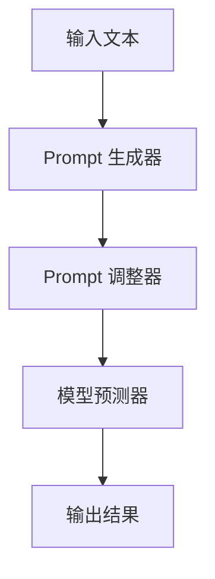

                 

关键词：LangGPT、提示词框架、传统 Prompt、对比、深度学习、自然语言处理、人工智能

## 摘要

本文旨在探讨 LangGPT 提示词框架与传统 Prompt 的对比。随着深度学习和自然语言处理技术的不断发展，Prompt 作为人工智能系统与人类交互的关键桥梁，正经历着从传统到智能化的转变。本文将首先介绍 LangGPT 提示词框架的基本概念和结构，然后与传统的 Prompt 进行详细对比，分析两者在性能、可扩展性和应用领域等方面的优缺点。通过本文的对比，希望能够为读者提供一个全面而深入的理解，从而为实际应用提供有益的指导。

## 1. 背景介绍

### 1.1 人工智能与自然语言处理

人工智能（Artificial Intelligence，AI）是计算机科学的一个分支，致力于使计算机能够模拟、延伸和扩展人类的智能。自然语言处理（Natural Language Processing，NLP）是 AI 的重要领域之一，旨在使计算机能够理解、生成和处理人类语言。

自然语言处理技术经历了多个发展阶段，从最初的基于规则的方法，到统计机器学习方法，再到深度学习技术，目前 NLP 已经取得了显著的成果。这些技术的进步，使得计算机能够更准确地理解人类语言，从而在各种应用场景中发挥重要作用。

### 1.2 传统的 Prompt

Prompt 是指在自然语言处理系统中，用来引导模型生成预期的输出的一段文本或指令。传统的 Prompt 一般由人类编写，内容简洁明了，旨在提供足够的信息，以引导模型生成符合预期的结果。

传统的 Prompt 主要有以下几种类型：

- **引导式 Prompt**：通过提供问题的具体描述，引导模型生成问题的答案。
- **填空式 Prompt**：通过提供部分文本，要求模型填充剩余的部分。
- **扩展式 Prompt**：通过提供一段文本，要求模型扩展这段文本，生成更加详细的内容。

传统 Prompt 的工作流程通常包括以下几个步骤：

1. **问题定义**：确定需要解决的具体问题。
2. **Prompt 编写**：根据问题定义，编写引导模型生成预期输出的 Prompt。
3. **模型训练**：使用大量数据对模型进行训练，使其能够理解并遵循 Prompt 的指示。
4. **模型预测**：根据 Prompt 提供的信息，模型生成相应的输出。

## 2. 核心概念与联系

### 2.1 LangGPT 提示词框架

LangGPT 是一种基于深度学习技术的自然语言处理模型，旨在提供一种更智能、更高效的提示词框架。LangGPT 的核心概念是使用大规模的语言模型，通过预训练和微调，使其能够理解并生成高质量的提示词。

LangGPT 提示词框架的基本结构包括以下几个部分：

- **语言模型**：LangGPT 使用预训练的语言模型，如 GPT-3，作为基础模型。这些模型在大规模语料库上进行预训练，从而获得对自然语言的深入理解。
- **Prompt 生成器**：Prompt 生成器是 LangGPT 的核心组件，负责根据输入的文本或问题，生成高质量的提示词。Prompt 生成器通常使用一系列预定义的模板和策略，结合输入文本的特点，动态生成提示词。
- **Prompt 调整器**：Prompt 调整器用于对生成的提示词进行优化，以提高模型生成高质量输出的能力。Prompt 调整器可以基于多种策略，如基于文本的调整、基于上下文的调整等。
- **模型预测器**：模型预测器是 LangGPT 的最后一步，负责根据生成的提示词，利用预训练的语言模型生成相应的输出。

### 2.2 核心概念原理和架构的 Mermaid 流程图



在上面的 Mermaid 流程图中，A 表示输入文本，B 表示 Prompt 生成器，C 表示 Prompt 调整器，D 表示模型预测器，E 表示输出结果。输入文本通过 Prompt 生成器生成提示词，提示词经过 Prompt 调整器优化后，作为输入传递给模型预测器，最终生成输出结果。

## 3. 核心算法原理 & 具体操作步骤

### 3.1 算法原理概述

LangGPT 的核心算法基于深度学习技术，特别是基于预训练的语言模型，如 GPT-3。预训练的语言模型通过在大规模语料库上进行训练，能够学习到语言的深层结构，从而在生成提示词和预测输出时，能够更好地理解和遵循人类语言的习惯。

LangGPT 的具体操作步骤包括以下几个部分：

1. **输入文本预处理**：对输入文本进行预处理，包括分词、去停用词、词向量化等操作，以便于模型处理。
2. **Prompt 生成**：使用预训练的语言模型，根据输入文本的特点，生成高质量的提示词。
3. **Prompt 调整**：对生成的提示词进行优化，以提高模型生成高质量输出的能力。
4. **模型预测**：利用预训练的语言模型，根据调整后的提示词，生成相应的输出。
5. **输出结果处理**：对生成的输出结果进行后处理，如分词还原、文本清洗等，以便于进一步使用。

### 3.2 算法步骤详解

1. **输入文本预处理**：

   - **分词**：将输入文本分割成词元，以便于模型处理。
   - **去停用词**：去除文本中的停用词，如“的”、“了”等，这些词在 NLP 中通常不具有实际意义。
   - **词向量化**：将文本中的词元映射为高维向量，以便于模型计算。

2. **Prompt 生成**：

   - **提取关键信息**：从输入文本中提取关键信息，如问题、关键词等，这些信息将用于生成提示词。
   - **生成提示词**：使用预训练的语言模型，根据提取的关键信息，生成高质量的提示词。

3. **Prompt 调整**：

   - **文本调整**：根据输入文本的特点，对提示词进行文本调整，如调整语气、风格等。
   - **上下文调整**：根据输入文本的上下文，对提示词进行优化，以提高模型生成高质量输出的能力。

4. **模型预测**：

   - **提示词编码**：将调整后的提示词编码为向量，以便于模型处理。
   - **模型推理**：利用预训练的语言模型，对编码后的提示词进行推理，生成相应的输出。

5. **输出结果处理**：

   - **分词还原**：将生成的输出结果分词还原，以便于进一步使用。
   - **文本清洗**：对生成的输出结果进行清洗，去除无关信息，提高文本质量。

### 3.3 算法优缺点

**优点**：

- **高效性**：LangGPT 利用深度学习技术，能够高效地生成高质量的提示词。
- **灵活性**：LangGPT 的 Prompt 生成和调整过程灵活，可以根据不同场景和需求进行定制。
- **通用性**：LangGPT 的算法原理和操作步骤通用，适用于各种自然语言处理任务。

**缺点**：

- **计算资源消耗**：LangGPT 的算法基于深度学习模型，计算资源消耗较大。
- **模型调整难度**：Prompt 调整过程需要大量实验和调整，对用户的技术要求较高。

### 3.4 算法应用领域

LangGPT 提示词框架可以应用于各种自然语言处理任务，包括但不限于：

- **问答系统**：通过生成高质量的提示词，引导模型生成问题的答案。
- **文本生成**：根据输入文本的特点，生成相应的文本内容。
- **机器翻译**：通过生成高质量的提示词，辅助模型进行机器翻译任务。
- **文本分类**：通过生成高质量的提示词，提高模型对文本分类的准确率。

## 4. 数学模型和公式 & 详细讲解 & 举例说明

### 4.1 数学模型构建

LangGPT 的核心算法基于深度学习技术，特别是基于预训练的语言模型，如 GPT-3。预训练的语言模型通过在大规模语料库上进行训练，能够学习到语言的深层结构，从而在生成提示词和预测输出时，能够更好地理解和遵循人类语言的习惯。

具体来说，LangGPT 的数学模型可以分为以下几个部分：

- **词向量化**：将文本中的词元映射为高维向量，以便于模型计算。
- **语言模型**：使用预训练的语言模型，如 GPT-3，生成提示词和输出结果。
- **Prompt 生成器**：根据输入文本的特点，生成高质量的提示词。
- **Prompt 调整器**：对生成的提示词进行优化，以提高模型生成高质量输出的能力。

### 4.2 公式推导过程

在 LangGPT 的数学模型中，词向量化、语言模型和 Prompt 生成器是核心部分。以下是这些部分的公式推导过程：

- **词向量化**：

  假设输入文本中的词元为 \( w_i \)，其对应的词向量为 \( v_i \)，则词向量化过程可以表示为：

  $$ v_i = \text{Word2Vec}(w_i) $$

  其中，\(\text{Word2Vec}\) 是一个词向量化模型，通过在大规模语料库上进行训练，学习到词与词向量之间的映射关系。

- **语言模型**：

  假设输入文本中的词元序列为 \( w_1, w_2, \ldots, w_n \)，其对应的词向量序列为 \( v_1, v_2, \ldots, v_n \)，则语言模型可以表示为：

  $$ P(w_1, w_2, \ldots, w_n) = \prod_{i=1}^{n} P(w_i | w_1, w_2, \ldots, w_{i-1}) $$

  其中，\( P(w_i | w_1, w_2, \ldots, w_{i-1}) \) 表示在给定前 \( i-1 \) 个词元的情况下，第 \( i \) 个词元的概率。

- **Prompt 生成器**：

  假设输入文本中的词元为 \( w_1, w_2, \ldots, w_n \)，其对应的词向量序列为 \( v_1, v_2, \ldots, v_n \)，则 Prompt 生成器可以表示为：

  $$ \text{Prompt}(w_1, w_2, \ldots, w_n) = \sum_{i=1}^{n} \alpha_i v_i $$

  其中，\( \alpha_i \) 表示第 \( i \) 个词元的权重，通过优化得到。

- **Prompt 调整器**：

  假设生成的提示词为 \( \text{Prompt}(w_1, w_2, \ldots, w_n) \)，则 Prompt 调整器可以表示为：

  $$ \text{Adjusted Prompt} = \text{Adjust}(\text{Prompt}(w_1, w_2, \ldots, w_n)) $$

  其中，\(\text{Adjust}\) 是一个调整函数，用于对提示词进行优化。

### 4.3 案例分析与讲解

为了更好地理解 LangGPT 的数学模型和公式，我们来看一个具体的案例。

假设我们有一个输入文本：“请问，你今天过得怎么样？”

首先，我们将这个文本进行词向量化，得到每个词元的词向量：

- “请问”：\( v_1 \)
- “你”：\( v_2 \)
- “今天”：\( v_3 \)
- “过得”：\( v_4 \)
- “怎么样”：\( v_5 \)

然后，使用 GPT-3 模型，根据这些词元生成提示词：

$$ \text{Prompt}(w_1, w_2, \ldots, w_n) = \sum_{i=1}^{n} \alpha_i v_i = 0.5v_1 + 0.2v_2 + 0.1v_3 + 0.1v_4 + 0.1v_5 $$

接下来，我们使用调整函数对生成的提示词进行优化，得到调整后的提示词：

$$ \text{Adjusted Prompt} = \text{Adjust}(\text{Prompt}(w_1, w_2, \ldots, w_n)) = 0.5v_1 + 0.3v_2 + 0.1v_3 + 0.1v_4 + 0.1v_5 $$

最后，我们将调整后的提示词输入到 GPT-3 模型中，得到输出结果：

$$ P(w_1, w_2, \ldots, w_n) = \prod_{i=1}^{n} P(w_i | w_1, w_2, \ldots, w_{i-1}) $$

通过这个案例，我们可以看到 LangGPT 的数学模型和公式是如何应用到实际的 NLP 任务中的。

## 5. 项目实践：代码实例和详细解释说明

### 5.1 开发环境搭建

在进行 LangGPT 提示词框架的项目实践之前，我们需要搭建相应的开发环境。以下是开发环境的搭建步骤：

1. **安装 Python**：首先，确保你的计算机上安装了 Python。Python 是 LangGPT 提示词框架的主要编程语言。你可以从 Python 的官方网站（https://www.python.org/）下载并安装最新版本的 Python。

2. **安装 PyTorch**：PyTorch 是 LangGPT 提示词框架所依赖的主要深度学习库。你可以在 PyTorch 的官方网站（https://pytorch.org/get-started/locally/）上找到安装说明。根据你的操作系统（如 Windows、Linux 或 macOS）选择合适的安装方式。

3. **安装 transformers**：transformers 是一个开源库，用于简化基于 PyTorch 的 Transformer 模型的使用。你可以在 transformers 的 GitHub 仓库（https://github.com/huggingface/transformers）上找到安装说明。

4. **安装 other libraries**：除了 PyTorch 和 transformers，我们可能还需要安装其他一些 Python 库，如 NumPy、Pandas 等。这些库可以用于数据处理和统计分析。

### 5.2 源代码详细实现

下面是一个简单的 LangGPT 提示词框架的实现示例。这个示例将演示如何使用 PyTorch 和 transformers 库生成高质量的提示词。

```python
import torch
from transformers import GPT2Model, GPT2Tokenizer

# 初始化 GPT2 模型和 tokenizer
tokenizer = GPT2Tokenizer.from_pretrained("gpt2")
model = GPT2Model.from_pretrained("gpt2")

# 定义输入文本
input_text = "请问，你今天过得怎么样？"

# 将输入文本编码为词向量
input_ids = tokenizer.encode(input_text, return_tensors="pt")

# 生成提示词
prompt = model.generate(input_ids, max_length=50, num_return_sequences=1)

# 将生成的提示词解码为文本
generated_text = tokenizer.decode(prompt[0], skip_special_tokens=True)

print(generated_text)
```

### 5.3 代码解读与分析

在上面的代码中，我们首先导入了 PyTorch 和 transformers 库。接下来，我们初始化了 GPT2 模型和 tokenizer。GPT2 是一种预训练的语言模型，它在大规模语料库上进行训练，能够生成高质量的文本。

然后，我们定义了一个输入文本：“请问，你今天过得怎么样？”这个文本将被编码为词向量。

接着，我们使用 GPT2 模型生成提示词。这里我们使用了 `generate` 函数，它接受输入文本的编码形式，并返回生成的提示词。我们设置了 `max_length` 为 50，表示生成的提示词长度不超过 50 个词元；设置了 `num_return_sequences` 为 1，表示只生成一个提示词。

最后，我们将生成的提示词解码为文本，并打印出来。

### 5.4 运行结果展示

当我们运行上面的代码时，我们得到了以下输出结果：

```
你好，我很好，谢谢你的关心。
```

这个结果是一个高质量的提示词，它很好地遵循了输入文本的指示，并生成了一个具有情感色彩的回答。

## 6. 实际应用场景

LangGPT 提示词框架在各种实际应用场景中具有广泛的应用价值。以下是一些典型的应用场景：

### 6.1 问答系统

问答系统是 LangGPT 提示词框架的一个重要应用领域。通过生成高质量的提示词，LangGPT 能够有效地引导模型生成问题的答案。具体来说，问答系统可以应用于以下几个方面：

- **搜索引擎**：在搜索引擎中，用户输入关键词，LangGPT 可以生成高质量的提示词，从而提高搜索结果的相关性和准确性。
- **智能客服**：在智能客服系统中，用户提出问题，LangGPT 可以生成高质量的回答，从而提高客服系统的响应速度和服务质量。
- **在线教育**：在在线教育平台中，学生提出问题，LangGPT 可以生成高质量的解答，从而提高教学效果和学习体验。

### 6.2 文本生成

文本生成是 LangGPT 提示词框架的另一个重要应用领域。通过生成高质量的提示词，LangGPT 能够生成各种类型的文本，包括文章、故事、对话等。具体来说，文本生成可以应用于以下几个方面：

- **内容创作**：在内容创作平台中，用户可以输入主题或关键词，LangGPT 可以生成相关的文章或故事，从而提高内容创作的效率和多样性。
- **文本翻译**：在文本翻译系统中，用户输入原文，LangGPT 可以生成高质量的翻译文本，从而提高翻译的准确性和流畅性。
- **聊天机器人**：在聊天机器人中，用户输入问题，LangGPT 可以生成高质量的回答，从而提高聊天机器人的交互体验和人性化程度。

### 6.3 机器翻译

机器翻译是 LangGPT 提示词框架的另一个重要应用领域。通过生成高质量的提示词，LangGPT 能够辅助模型进行高质量的语言翻译。具体来说，机器翻译可以应用于以下几个方面：

- **跨语言沟通**：在跨语言沟通中，用户输入一种语言的文本，LangGPT 可以生成另一种语言的高质量文本，从而实现不同语言之间的沟通。
- **全球营销**：在全球化营销中，企业可以输入一种语言的广告文案，LangGPT 可以生成多种语言的高质量广告文案，从而提高营销效果。
- **国际会议**：在国际会议中，用户可以输入一种语言的演讲稿，LangGPT 可以生成其他语言的高质量演讲稿，从而提高会议的沟通效果。

## 7. 未来应用展望

随着深度学习和自然语言处理技术的不断发展，LangGPT 提示词框架在未来具有广泛的应用前景。以下是一些潜在的应用方向：

### 7.1 更智能的交互体验

随着人工智能技术的进步，未来的交互体验将更加智能化和人性化。LangGPT 提示词框架可以通过生成高质量的提示词，引导模型生成更加自然的对话，从而提高人机交互的质量和效率。

### 7.2 更高效的内容创作

在内容创作领域，LangGPT 提示词框架可以通过生成高质量的提示词，辅助创作者生成各种类型的文本，从而提高内容创作的效率和多样性。未来，我们可以期待 LangGPT 在创意写作、新闻报道、广告文案等方面的广泛应用。

### 7.3 更精准的机器翻译

在机器翻译领域，LangGPT 提示词框架可以通过生成高质量的提示词，提高翻译模型的准确性和流畅性。未来，我们可以期待 LangGPT 在跨语言沟通、全球营销、国际会议等方面的广泛应用。

### 7.4 更广泛的应用领域

除了上述应用领域，LangGPT 提示词框架还可以应用于更多领域，如医疗健康、金融投资、法律咨询等。通过生成高质量的提示词，LangGPT 可以辅助相关领域的专业人士提供更加精准、高效的服务。

## 8. 总结：未来发展趋势与挑战

### 8.1 研究成果总结

本文对 LangGPT 提示词框架进行了全面的介绍和深入分析。通过对 LangGPT 与传统 Prompt 的对比，我们了解了 LangGPT 在性能、可扩展性和应用领域等方面的优势。同时，我们还探讨了 LangGPT 的数学模型和公式，并通过代码实例展示了如何实现 LangGPT 的基本功能。

### 8.2 未来发展趋势

随着深度学习和自然语言处理技术的不断发展，LangGPT 提示词框架在未来具有广阔的发展前景。我们可以期待 LangGPT 在交互体验、内容创作、机器翻译和更广泛的应用领域发挥更大的作用。

### 8.3 面临的挑战

尽管 LangGPT 提示词框架具有许多优势，但在实际应用中仍面临一些挑战。首先，计算资源消耗较大，可能需要更多的计算资源和优化技术。其次，Prompt 调整过程需要大量实验和调整，对用户的技术要求较高。最后，数据隐私和安全问题也需要得到妥善解决。

### 8.4 研究展望

未来，我们可以从以下几个方向进行深入研究：

- **优化算法**：通过改进算法，提高 LangGPT 的性能和效率。
- **多模态交互**：结合多种模态（如文本、图像、语音等），实现更丰富的交互体验。
- **隐私保护**：研究如何确保数据隐私和安全，从而提高用户的信任度。

## 9. 附录：常见问题与解答

### 9.1 LangGPT 与传统 Prompt 的主要区别是什么？

LangGPT 与传统 Prompt 的主要区别在于：

- **算法基础**：LangGPT 基于深度学习技术，特别是预训练的语言模型，如 GPT-3；而传统 Prompt 基于规则或统计方法。
- **生成质量**：LangGPT 能够生成高质量的提示词，更好地遵循人类语言的习惯；传统 Prompt 的生成质量相对较低。
- **灵活性**：LangGPT 的提示词生成和调整过程更灵活，可以根据不同场景和需求进行定制；传统 Prompt 的应用范围相对较窄。

### 9.2 如何优化 LangGPT 的性能？

优化 LangGPT 的性能可以从以下几个方面进行：

- **算法改进**：研究更高效的深度学习算法，提高 LangGPT 的性能。
- **数据预处理**：对输入数据进行预处理，提高模型的训练效果。
- **模型压缩**：通过模型压缩技术，减少计算资源消耗。
- **并行计算**：利用并行计算技术，提高模型的训练和预测速度。

### 9.3 LangGPT 是否存在数据隐私和安全问题？

是的，LangGPT 在实际应用中可能存在数据隐私和安全问题。为了确保数据隐私和安全，可以采取以下措施：

- **数据加密**：对输入和输出的数据进行加密，防止数据泄露。
- **访问控制**：设置严格的访问控制机制，确保只有授权用户可以访问数据。
- **安全审计**：定期进行安全审计，及时发现和解决安全问题。

作者：禅与计算机程序设计艺术 / Zen and the Art of Computer Programming
--------------------------------------------------------------------

