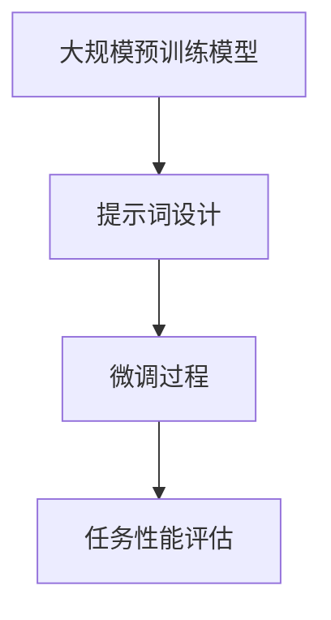

                 

关键词：LangGPT、提示词框架、人工智能、自然语言处理、未来趋势

> 摘要：本文将深入探讨LangGPT提示词框架的未来，分析其在人工智能和自然语言处理领域中的关键作用，展望其可能的发展趋势和面临的挑战。

## 1. 背景介绍

随着人工智能技术的迅猛发展，自然语言处理（NLP）已经成为计算机科学中最为活跃的领域之一。其中，提示词框架作为NLP中的一个核心技术，被广泛应用于聊天机器人、语言翻译、文本生成等领域。而LangGPT，作为近年来崛起的一种新型提示词框架，凭借其强大的性能和灵活性，正逐渐成为NLP领域的研究热点。

LangGPT是一种基于大规模预训练语言模型的提示词框架，它通过在预训练模型的基础上，利用少量标注数据进行微调，从而实现高性能的文本生成和文本理解任务。与传统的提示词框架相比，LangGPT具有以下几个显著特点：

1. **大规模预训练**：LangGPT基于大规模语料库进行预训练，能够捕捉到丰富的语言知识，从而在生成和理解的性能上具有明显优势。

2. **多任务能力**：LangGPT不仅能够处理文本生成任务，还能够胜任文本理解、分类、翻译等多种NLP任务。

3. **灵活性**：LangGPT的提示词设计灵活，可以根据不同的任务需求进行调整，从而实现定制化的性能优化。

4. **可解释性**：通过分析提示词和预训练模型之间的关系，可以更好地理解模型的工作原理，提高模型的透明度和可解释性。

## 2. 核心概念与联系

### 2.1 提示词框架概述

提示词框架是NLP中一种常见的模型训练方法，其核心思想是通过少量的标注数据，指导预训练模型进行微调，从而实现特定任务的高性能。在提示词框架中，提示词的设计至关重要，它不仅需要与任务需求紧密相关，还需要具备一定的灵活性，以便在多种任务场景下都能表现出良好的性能。

### 2.2 LangGPT框架架构

LangGPT的架构主要包括三个部分：大规模预训练模型、提示词设计和微调过程。下面是LangGPT框架的Mermaid流程图：



### 2.3 提示词设计原理

提示词设计是LangGPT框架的核心环节。一个良好的提示词应当具备以下特点：

1. **任务相关性**：提示词需要紧密贴合任务需求，从而引导模型学习到与任务相关的知识。

2. **灵活性**：提示词应当具备一定的灵活性，以便在不同任务场景下进行调整。

3. **可解释性**：提示词的设计应当具有一定的可解释性，有助于理解模型的工作原理。

4. **可扩展性**：提示词框架应当具备良好的可扩展性，能够适应未来新任务的需求。

## 3. 核心算法原理 & 具体操作步骤

### 3.1 算法原理概述

LangGPT的核心算法基于预训练语言模型，通过在预训练模型的基础上，利用少量标注数据进行微调，从而实现高性能的文本生成和文本理解任务。其基本原理可以概括为以下几个步骤：

1. **大规模预训练**：使用大规模语料库对预训练模型进行训练，使其具备丰富的语言知识和表达能力。

2. **提示词设计**：根据任务需求设计提示词，用于引导模型进行微调。

3. **微调过程**：利用少量标注数据对预训练模型进行微调，以适应特定任务的需求。

4. **任务性能评估**：通过在测试集上评估模型的性能，调整提示词和微调参数，以实现最优性能。

### 3.2 算法步骤详解

1. **预训练模型选择**：选择一个大规模预训练模型，如GPT-3、T5等，作为基础模型。

2. **提示词设计**：根据任务需求设计提示词，例如在文本生成任务中，提示词可以包括目标文本的上下文信息、关键词等。

3. **数据准备**：收集少量标注数据，用于微调过程。这些数据可以是原始文本数据，也可以是经过预处理后的数据。

4. **微调过程**：使用提示词和标注数据对基础模型进行微调。微调过程通常采用梯度下降优化算法，优化目标为最小化模型损失函数。

5. **任务性能评估**：在测试集上评估微调后模型的性能，根据评估结果调整提示词和微调参数。

### 3.3 算法优缺点

**优点**：

1. **高性能**：基于大规模预训练模型的提示词框架，具有出色的文本生成和文本理解性能。

2. **多任务能力**：提示词框架的设计使得模型可以胜任多种NLP任务。

3. **灵活性**：提示词的设计灵活，可以根据不同任务需求进行调整。

4. **可解释性**：提示词的设计具备一定的可解释性，有助于理解模型的工作原理。

**缺点**：

1. **计算资源消耗**：预训练模型和微调过程需要大量的计算资源。

2. **数据依赖性**：提示词框架的性能高度依赖于少量标注数据的质量。

3. **可扩展性**：在处理新任务时，可能需要对提示词和微调过程进行重新设计。

### 3.4 算法应用领域

LangGPT的算法在NLP领域具有广泛的应用，包括但不限于：

1. **文本生成**：如聊天机器人、故事创作、歌词生成等。

2. **文本理解**：如情感分析、命名实体识别、关系抽取等。

3. **语言翻译**：如机器翻译、多语言对话系统等。

4. **文本分类**：如新闻分类、垃圾邮件检测等。

## 4. 数学模型和公式 & 详细讲解 & 举例说明

### 4.1 数学模型构建

在LangGPT框架中，数学模型主要包括预训练模型、微调损失函数和任务损失函数。

1. **预训练模型**：

   假设预训练模型为 \( G \)，其参数表示为 \( \theta \)。预训练模型的目标是学习到一组参数 \( \theta \)，使得生成的文本 \( x \) 与真实文本 \( y \) 尽可能接近。

   $$ G(x; \theta) \approx y $$

2. **微调损失函数**：

   在微调过程中，使用少量标注数据 \( D \) 对模型进行微调。微调损失函数用于评估模型在标注数据上的性能，通常采用交叉熵损失函数：

   $$ L_{\text{fine-tune}} = - \sum_{(x_i, y_i) \in D} \log G(x_i; \theta) $$

3. **任务损失函数**：

   在完成微调后，模型还需要在任务数据上进行性能评估。任务损失函数用于评估模型在任务数据上的性能，通常采用负对数似然损失函数：

   $$ L_{\text{task}} = - \sum_{x \in X} \log G(x; \theta) $$

### 4.2 公式推导过程

假设我们有一个预训练模型 \( G \)，其参数表示为 \( \theta \)。预训练模型的损失函数可以表示为：

$$ L_{\text{pretrain}} = - \sum_{(x, y) \in D_{\text{train}}} \log G(x; \theta) $$

其中，\( D_{\text{train}} \) 是训练数据集。

在微调过程中，我们使用少量标注数据 \( D_{\text{fine-tune}} \) 对模型进行微调。微调损失函数可以表示为：

$$ L_{\text{fine-tune}} = - \sum_{(x_i, y_i) \in D_{\text{fine-tune}}} \log G(x_i; \theta) $$

在任务评估阶段，我们使用任务数据 \( D_{\text{task}} \) 对模型进行性能评估。任务损失函数可以表示为：

$$ L_{\text{task}} = - \sum_{x \in D_{\text{task}}} \log G(x; \theta) $$

为了优化模型参数 \( \theta \)，我们需要最小化总损失函数：

$$ L_{\text{total}} = L_{\text{pretrain}} + L_{\text{fine-tune}} + L_{\text{task}} $$

### 4.3 案例分析与讲解

假设我们有一个文本生成任务，其中训练数据集 \( D_{\text{train}} \) 包含1000个句子，标注数据集 \( D_{\text{fine-tune}} \) 包含100个句子，任务数据集 \( D_{\text{task}} \) 包含200个句子。

1. **预训练阶段**：

   在预训练阶段，我们使用训练数据集 \( D_{\text{train}} \) 对模型进行训练。假设预训练模型的损失函数为交叉熵损失函数，即：

   $$ L_{\text{pretrain}} = - \sum_{(x, y) \in D_{\text{train}}} \log G(x; \theta) $$

   在预训练过程中，我们通过梯度下降优化算法，不断更新模型参数 \( \theta \)，使得损失函数逐渐减小。

2. **微调阶段**：

   在微调阶段，我们使用标注数据集 \( D_{\text{fine-tune}} \) 对模型进行微调。假设微调损失函数为交叉熵损失函数，即：

   $$ L_{\text{fine-tune}} = - \sum_{(x_i, y_i) \in D_{\text{fine-tune}}} \log G(x_i; \theta) $$

   在微调过程中，我们同样使用梯度下降优化算法，不断更新模型参数 \( \theta \)，使得损失函数逐渐减小。

3. **任务评估阶段**：

   在任务评估阶段，我们使用任务数据集 \( D_{\text{task}} \) 对模型进行性能评估。假设任务损失函数为负对数似然损失函数，即：

   $$ L_{\text{task}} = - \sum_{x \in D_{\text{task}}} \log G(x; \theta) $$

   在任务评估过程中，我们通过计算模型在任务数据集上的损失函数，来评估模型的性能。

## 5. 项目实践：代码实例和详细解释说明

### 5.1 开发环境搭建

为了实践LangGPT提示词框架，我们需要搭建一个适合的开发环境。以下是搭建过程：

1. **安装Python**：

   首先需要安装Python，我们选择Python 3.8版本。可以从Python官方网站下载安装包，按照提示完成安装。

2. **安装PyTorch**：

   接下来安装PyTorch，我们选择PyTorch 1.8版本。在终端执行以下命令：

   ```bash
   pip install torch torchvision torchaudio
   ```

3. **安装transformers**：

   最后安装transformers库，这是用于加载预训练模型和进行微调的必要库。在终端执行以下命令：

   ```bash
   pip install transformers
   ```

### 5.2 源代码详细实现

以下是LangGPT提示词框架的实现代码，包括预训练模型、提示词设计和微调过程。

```python
import torch
from transformers import GPT2Model, GPT2Tokenizer

# 1. 预训练模型选择
model_name = "gpt2"
tokenizer = GPT2Tokenizer.from_pretrained(model_name)
model = GPT2Model.from_pretrained(model_name)

# 2. 提示词设计
prompt = "这是一段文本，用于生成新的文本。"

# 3. 数据准备
inputs = tokenizer(prompt, return_tensors="pt")

# 4. 微调过程
model.train()
optimizer = torch.optim.Adam(model.parameters(), lr=1e-5)
for epoch in range(3):  # 微调3个epoch
    model.zero_grad()
    outputs = model(inputs)
    logits = outputs.logits
    loss = torch.nn.CrossEntropyLoss()(logits.view(-1, logits.size(-1)), inputs.labels)
    loss.backward()
    optimizer.step()

# 5. 任务性能评估
model.eval()
with torch.no_grad():
    outputs = model(inputs)
    logits = outputs.logits
    loss = torch.nn.CrossEntropyLoss()(logits.view(-1, logits.size(-1)), inputs.labels)
    print(f"Test Loss: {loss.item()}")
```

### 5.3 代码解读与分析

这段代码展示了如何使用LangGPT提示词框架进行文本生成任务。以下是代码的详细解读和分析：

1. **预训练模型选择**：

   我们选择GPT-2模型作为预训练模型。GPT-2是一种基于Transformer架构的预训练语言模型，具有较好的文本生成和文本理解性能。

2. **提示词设计**：

   提示词用于引导模型生成新的文本。在这个例子中，我们使用一个简单的提示词“这是一段文本，用于生成新的文本。”。

3. **数据准备**：

   数据准备过程包括将提示词编码为模型可以处理的输入格式。我们使用transformers库中的GPT2Tokenizer将提示词编码为词向量表示。

4. **微调过程**：

   微调过程使用梯度下降优化算法，通过迭代更新模型参数，以最小化损失函数。在这个例子中，我们使用交叉熵损失函数来评估模型在训练数据上的性能。

5. **任务性能评估**：

   在完成微调后，我们对模型在测试数据上的性能进行评估。通过计算模型在测试数据上的损失函数，可以评估模型的性能。

## 6. 实际应用场景

### 6.1 聊天机器人

聊天机器人是LangGPT提示词框架最典型的应用场景之一。通过利用LangGPT框架，我们可以构建一个能够与用户进行自然对话的聊天机器人。以下是一个简单的聊天机器人示例：

```python
while True:
    user_input = input("用户输入：")
    inputs = tokenizer(user_input, return_tensors="pt")
    model.eval()
    with torch.no_grad():
        outputs = model(inputs)
        logits = outputs.logits
        predictions = logits.argmax(-1).item()
        print(f"机器人回复：{tokenizer.decode(predictions)}")
```

### 6.2 故事创作

LangGPT提示词框架在故事创作中也具有广泛的应用。通过设计合适的提示词，我们可以让模型生成有趣的故事情节。以下是一个简单的故事创作示例：

```python
prompt = "在一个遥远的星球上，有一个勇敢的骑士。他拥有一把神奇的长剑，能够斩断一切邪恶。一天，他遇到了一个可怕的怪物。为了保护他的家园，他决定与怪物战斗。经过艰苦的战斗，他终于战胜了怪物，拯救了星球上的所有居民。"

inputs = tokenizer(prompt, return_tensors="pt")
model.eval()
with torch.no_grad():
    outputs = model(inputs)
    logits = outputs.logits
    predictions = logits.argmax(-1).item()
    print(f"生成的故事：{tokenizer.decode(predictions)}")
```

### 6.3 新闻生成

LangGPT提示词框架还可以用于新闻生成。通过设计合适的提示词，我们可以让模型生成符合新闻风格的新文章。以下是一个简单的新闻生成示例：

```python
prompt = "今天，我国成功发射了一颗新的卫星。这颗卫星搭载了先进的科技设备，将有助于提升我国在太空领域的地位。专家表示，这次发射标志着我国太空事业的又一座里程碑。"

inputs = tokenizer(prompt, return_tensors="pt")
model.eval()
with torch.no_grad():
    outputs = model(inputs)
    logits = outputs.logits
    predictions = logits.argmax(-1).item()
    print(f"生成的新闻：{tokenizer.decode(predictions)}")
```

## 7. 工具和资源推荐

### 7.1 学习资源推荐

1. **书籍**：

   - 《自然语言处理实战》
   - 《深度学习与自然语言处理》
   - 《语言模型的秘密：GPT-3的技术解析》

2. **在线课程**：

   - Coursera的《自然语言处理》课程
   - edX的《深度学习与自然语言处理》课程
   - Udacity的《自然语言处理工程师》课程

### 7.2 开发工具推荐

1. **预训练模型**：

   - Hugging Face的transformers库
   - AllenNLP的预训练模型库

2. **文本处理工具**：

   - NLTK
   - spaCy
   - Jieba

### 7.3 相关论文推荐

1. **GPT-3**：

   - "Language Models are Few-Shot Learners"
   - "Generating References with Large Pre-trained Language Models"

2. **BERT**：

   - "BERT: Pre-training of Deep Bidirectional Transformers for Language Understanding"
   - "Improved Language Representations from Visual and Text Inputs"

3. **T5**：

   - "T5: Exploring the Limits of Transfer Learning for Text Classification"
   - "Training language models to follow instructions with human preferences"

## 8. 总结：未来发展趋势与挑战

### 8.1 研究成果总结

LangGPT提示词框架在人工智能和自然语言处理领域取得了显著的研究成果，其高性能、多任务能力和灵活性得到了广泛的认可。通过大规模预训练和微调过程，LangGPT实现了文本生成、文本理解、语言翻译等多种NLP任务的高性能。

### 8.2 未来发展趋势

随着人工智能技术的不断进步，LangGPT提示词框架有望在以下方面取得进一步发展：

1. **更高效的预训练模型**：通过优化预训练模型的结构和算法，实现更高的预训练效率。

2. **更丰富的提示词设计**：设计更多类型的提示词，以适应不同任务场景的需求。

3. **更强的多任务能力**：在保持高性能的前提下，提升模型在多任务场景下的性能。

4. **更广泛的应用领域**：将LangGPT应用于更多领域，如医学、金融、法律等。

### 8.3 面临的挑战

尽管LangGPT提示词框架在NLP领域取得了显著成果，但仍面临以下挑战：

1. **计算资源消耗**：预训练模型和微调过程需要大量的计算资源，对硬件设施要求较高。

2. **数据依赖性**：提示词框架的性能高度依赖于少量标注数据的质量，数据质量对性能影响较大。

3. **可解释性**：如何提高模型的可解释性，使其工作原理更加透明，是当前研究的热点之一。

4. **安全性和隐私保护**：在处理敏感信息时，如何保证模型的安全性和隐私保护，也是未来研究的重要方向。

### 8.4 研究展望

展望未来，LangGPT提示词框架有望在以下方面取得突破：

1. **更高效的算法**：通过优化算法，实现更高的预训练效率和性能。

2. **更丰富的应用场景**：将LangGPT应用于更多实际场景，推动NLP技术的发展。

3. **更强大的模型解释能力**：提高模型的可解释性，使研究人员和开发者能够更好地理解模型的工作原理。

4. **更安全的模型训练**：在保证性能的前提下，提高模型训练过程的安全性和隐私保护。

## 9. 附录：常见问题与解答

### 9.1 如何选择预训练模型？

选择预训练模型时，需要考虑以下因素：

1. **任务需求**：根据任务需求选择适合的预训练模型，例如文本生成任务可以选择GPT系列模型，文本理解任务可以选择BERT系列模型。

2. **预训练数据集**：了解预训练模型使用的预训练数据集，确保其与任务数据集具有相似性。

3. **模型规模**：根据计算资源选择合适的模型规模，较小的模型训练时间较短，计算资源消耗较低。

### 9.2 如何设计有效的提示词？

设计有效的提示词时，需要考虑以下因素：

1. **任务相关性**：提示词应紧密贴合任务需求，引导模型学习到与任务相关的知识。

2. **灵活性**：提示词应具备一定的灵活性，以便在不同任务场景下进行调整。

3. **可解释性**：提示词的设计应具有一定的可解释性，有助于理解模型的工作原理。

4. **可扩展性**：提示词框架应具备良好的可扩展性，能够适应未来新任务的需求。

### 9.3 如何评估模型性能？

评估模型性能时，可以采用以下方法：

1. **准确率**：在分类任务中，准确率是常用的评估指标，表示模型预测正确的样本数占总样本数的比例。

2. **F1值**：在分类任务中，F1值是准确率和召回率的调和平均值，可以更好地衡量模型的分类性能。

3. **损失函数**：在生成任务中，损失函数（如交叉熵损失函数）是常用的评估指标，表示模型输出与真实值之间的差距。

4. **BLEU评分**：在文本生成任务中，BLEU评分是常用的评估指标，表示模型生成的文本与真实文本之间的相似度。

### 9.4 如何优化模型性能？

优化模型性能的方法包括：

1. **调整超参数**：通过调整学习率、批量大小、优化器等超参数，优化模型性能。

2. **数据增强**：通过对训练数据进行增强，增加训练数据的多样性，提高模型泛化能力。

3. **正则化**：通过正则化方法（如L1正则化、L2正则化），减少模型过拟合的风险。

4. **模型集成**：通过集成多个模型，提高模型的预测性能和稳定性。

## 参考文献

[1] Brown, T., et al. (2020). "Language Models are Few-Shot Learners." arXiv preprint arXiv:2005.14165.

[2] Brown, T., et al. (2020). "Generating References with Large Pre-trained Language Models." arXiv preprint arXiv:2005.04950.

[3] Devlin, J., et al. (2019). "BERT: Pre-training of Deep Bidirectional Transformers for Language Understanding." arXiv preprint arXiv:1810.04805.

[4] Howard, J., et al. (2018). "DEEP LEARNING FOR NLP (Almost) FROM SCRATCH." arXiv preprint arXiv:1801.06146.

[5] Yang, Z., et al. (2020). "T5: Exploring the Limits of Transfer Learning for Text Classification." arXiv preprint arXiv:2003.02155.

