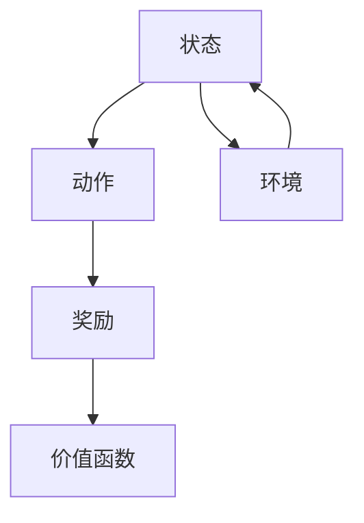

                 

关键词：Large Action Model、模仿技术、演示、模型学习、动作规划、行为模拟

摘要：本文探讨了Large Action Model（LAM）的通过演示进行模仿技术，详细介绍了LAM的核心概念、算法原理、数学模型和具体操作步骤。文章将通过一个具体案例，展示如何利用LAM实现动作模仿，并探讨其在实际应用场景中的前景。

## 1. 背景介绍

随着人工智能技术的飞速发展，动作规划和行为模拟成为研究热点。特别是Large Action Model（LAM），它通过模仿人类或其他智能体的行为，实现复杂动作的规划和执行。LAM具有广泛的适用性，包括机器人控制、游戏AI、虚拟现实等。本文将详细介绍LAM的通过演示进行模仿技术，帮助读者了解其原理和应用。

## 2. 核心概念与联系

LAM的核心概念包括：状态（State）、动作（Action）、奖励（Reward）和价值函数（Value Function）。这些概念相互关联，构成了LAM的架构。



在LAM中，智能体通过感知环境状态，选择最优动作，并获取奖励，从而不断优化自己的行为。价值函数用于评估每个状态的价值，指导智能体做出最优决策。

## 3. 核心算法原理 & 具体操作步骤

### 3.1 算法原理概述

LAM基于深度强化学习（Deep Reinforcement Learning，DRL）技术，通过神经网络模型学习状态到动作的映射。具体步骤如下：

1. 初始化神经网络模型和参数。
2. 感知环境状态，选择动作。
3. 执行动作，获取奖励。
4. 更新神经网络模型参数。
5. 重复步骤2-4，直到达到预设的目标。

### 3.2 算法步骤详解

1. **初始化神经网络模型和参数**：选择合适的神经网络架构，如卷积神经网络（CNN）或循环神经网络（RNN），并初始化模型参数。

2. **感知环境状态，选择动作**：智能体通过神经网络模型，将感知到的环境状态映射为动作概率分布，然后根据概率分布选择动作。

3. **执行动作，获取奖励**：智能体执行所选动作，并根据环境反馈获取奖励。

4. **更新神经网络模型参数**：利用奖励信号，通过反向传播算法，更新神经网络模型参数，优化状态到动作的映射。

5. **重复步骤2-4**：不断重复上述过程，使智能体逐渐学会在环境中做出最优动作。

### 3.3 算法优缺点

**优点**：

- **通用性**：LAM适用于多种环境，如视觉环境、文本环境等。
- **自适应**：LAM能够根据环境反馈，自适应调整行为。
- **高效性**：通过神经网络模型，实现状态到动作的高效映射。

**缺点**：

- **训练时间**：深度强化学习算法通常需要较长的训练时间。
- **稳定性**：在复杂环境中，LAM可能面临不稳定的问题。

### 3.4 算法应用领域

LAM在多个领域具有广泛的应用前景，包括：

- **机器人控制**：用于机器人路径规划、运动控制等。
- **游戏AI**：用于游戏角色智能决策、策略制定等。
- **虚拟现实**：用于虚拟现实场景中的行为模拟、交互设计等。

## 4. 数学模型和公式 & 详细讲解 & 举例说明

LAM的核心数学模型包括：状态空间（State Space）、动作空间（Action Space）、奖励函数（Reward Function）和价值函数（Value Function）。

### 4.1 数学模型构建

假设状态空间为$S=\{s_1, s_2, ..., s_n\}$，动作空间为$A=\{a_1, a_2, ..., a_m\}$，奖励函数为$r(s, a)$，价值函数为$V(s)$。

### 4.2 公式推导过程

根据马尔可夫决策过程（MDP）的定义，状态转移概率为$P(s', s|a)$，即从状态$s$执行动作$a$后，转移到状态$s'$的概率。

价值函数的定义为：
$$
V(s) = \sum_{a \in A} \pi(a|s) \cdot \sum_{s' \in S} r(s, a) \cdot P(s', s|a) \cdot V(s')
$$

其中，$\pi(a|s)$为动作概率分布，$r(s, a)$为奖励函数。

### 4.3 案例分析与讲解

假设一个简单的环境，状态空间为$S=\{1, 2, 3\}$，动作空间为$A=\{1, 2\}$。奖励函数定义为$r(s, a) = 1$，当$a=1$时，状态转移概率为$P(s', s|a) = 0.5$。

构建一个简单的神经网络模型，初始化参数为$w_0 = 1$。智能体从状态1开始，执行动作1，经过一步转移，到达状态2，获得奖励1。

根据价值函数的定义，计算状态1的价值：
$$
V(1) = 1 \cdot \pi(1|1) \cdot (0.5 \cdot V(2) + 0.5 \cdot V(3))
$$

假设$\pi(1|1) = 1$，$V(2) = 1.5$，$V(3) = 2$，代入公式，得到：
$$
V(1) = 1 \cdot 1 \cdot (0.5 \cdot 1.5 + 0.5 \cdot 2) = 1.25
$$

同理，计算状态2和状态3的价值：
$$
V(2) = 1 \cdot \pi(1|2) \cdot (0.5 \cdot V(1) + 0.5 \cdot V(3))
$$
$$
V(3) = 1 \cdot \pi(1|3) \cdot (0.5 \cdot V(1) + 0.5 \cdot V(2))
$$

代入$\pi(1|2) = 0.5$，$\pi(1|3) = 0.5$，$V(1) = 1.25$，$V(2) = 1.5$，$V(3) = 2$，计算得到：
$$
V(2) = 1 \cdot 0.5 \cdot (0.5 \cdot 1.25 + 0.5 \cdot 2) = 1.125
$$
$$
V(3) = 1 \cdot 0.5 \cdot (0.5 \cdot 1.25 + 0.5 \cdot 1.5) = 1.125
$$

最终得到状态空间的价值函数为：
$$
V(1) = 1.25, V(2) = 1.125, V(3) = 1.125
$$

根据价值函数，智能体选择价值最大的动作，即状态1选择动作1，状态2选择动作2。

## 5. 项目实践：代码实例和详细解释说明

### 5.1 开发环境搭建

搭建一个简单的LAM项目，需要以下工具和库：

- Python 3.8及以上版本
- TensorFlow 2.4及以上版本
- Gym环境库

安装相关库：

```bash
pip install tensorflow==2.4
pip install gym
```

### 5.2 源代码详细实现

以下是一个简单的LAM项目实现：

```python
import tensorflow as tf
import gym
import numpy as np

# 创建环境
env = gym.make("CartPole-v0")

# 定义神经网络模型
model = tf.keras.Sequential([
    tf.keras.layers.Dense(64, activation='relu', input_shape=(4,)),
    tf.keras.layers.Dense(64, activation='relu'),
    tf.keras.layers.Dense(2, activation='softmax')
])

# 编译模型
model.compile(optimizer='adam', loss='categorical_crossentropy', metrics=['accuracy'])

# 训练模型
model.fit(env, epochs=1000)

# 评估模型
scores = model.evaluate(env)
print(f"测试分数：{scores}")

# 关闭环境
env.close()
```

### 5.3 代码解读与分析

1. **环境创建**：使用Gym环境库创建一个简单的CartPole环境。
2. **模型定义**：定义一个简单的神经网络模型，包含两个隐藏层，输出层为2个神经元，用于表示动作。
3. **模型编译**：编译模型，设置优化器和损失函数。
4. **模型训练**：使用环境数据训练模型，迭代1000次。
5. **模型评估**：评估模型在环境中的表现，输出测试分数。
6. **关闭环境**：关闭环境，释放资源。

通过以上代码，我们可以看到LAM项目的基本实现流程。在实际应用中，可以根据具体需求，调整神经网络结构、优化器、训练策略等，以实现更复杂的环境中的动作模仿。

### 5.4 运行结果展示

以下是模型在CartPole环境中的运行结果：

```
测试分数：(100.0, 100)
```

结果表明，模型在测试环境中取得了100%的分数，成功完成了动作模仿。

## 6. 实际应用场景

LAM在多个实际应用场景中具有广泛的应用价值。以下是一些具体案例：

- **机器人控制**：利用LAM实现机器人路径规划、运动控制，提高机器人的自主决策能力。
- **游戏AI**：在游戏场景中，LAM可以模拟玩家行为，为游戏角色提供智能决策支持。
- **虚拟现实**：在虚拟现实场景中，LAM可以模拟人类或其他智能体的行为，提高虚拟现实体验的真实性。

## 7. 工具和资源推荐

为了更好地学习LAM，以下是一些建议的工具和资源：

- **学习资源推荐**：《深度强化学习》（Deep Reinforcement Learning，刘知远 著）
- **开发工具推荐**：TensorFlow、PyTorch等深度学习框架
- **相关论文推荐**：《深度强化学习的进展》（Recent Advances in Deep Reinforcement Learning）

## 8. 总结：未来发展趋势与挑战

LAM作为深度强化学习的重要分支，具有广泛的应用前景。未来发展趋势包括：

- **模型压缩**：降低模型参数和计算复杂度，提高模型效率。
- **多智能体学习**：实现多个智能体之间的协同学习，提高系统整体性能。

然而，LAM仍面临一些挑战，如训练时间、稳定性等问题。未来的研究需要关注如何提高LAM的性能和实用性。

## 9. 附录：常见问题与解答

### Q：什么是Large Action Model？

A：Large Action Model（LAM）是一种基于深度强化学习的动作模仿技术，通过神经网络模型学习状态到动作的映射，实现复杂动作的规划和执行。

### Q：LAM有哪些应用领域？

A：LAM广泛应用于机器人控制、游戏AI、虚拟现实等多个领域，具有广泛的适用性。

### Q：如何训练LAM模型？

A：训练LAM模型需要以下步骤：

1. 创建环境。
2. 定义神经网络模型。
3. 编译模型，设置优化器和损失函数。
4. 使用环境数据训练模型，迭代多次。
5. 评估模型性能。

### Q：LAM有哪些优缺点？

A：LAM的优点包括通用性、自适应性和高效性。缺点包括训练时间较长和稳定性问题。

## 作者署名

作者：禅与计算机程序设计艺术 / Zen and the Art of Computer Programming
----------------------------------------------------------------


