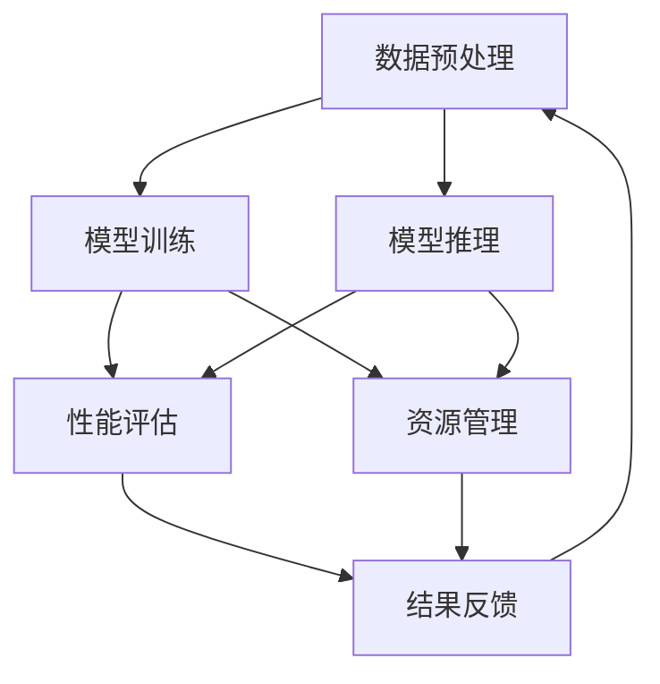

                 

关键词：Lepton AI、企业应用、速度与成本优化、AI效率提升

摘要：本文深入探讨了Lepton AI的价值，通过解析其核心技术原理、数学模型、实践应用案例以及未来展望，揭示了如何帮助企业在一个速度与成本并重的世界中高效导航，并显著提升AI应用的效率。

## 1. 背景介绍

人工智能（AI）正在逐步渗透到各个行业，为企业和组织带来前所未有的机遇。然而，AI应用的成功不仅取决于算法的创新，更取决于如何在实际操作中平衡速度与成本。这种平衡不仅关乎技术实现，更涉及商业决策和资源管理。Lepton AI，作为一种新兴的AI框架，旨在帮助企业在这个复杂的环境中导航，通过优化速度与成本的平衡来提升AI应用的整体效率。

### 1.1 Lepton AI的定义和核心价值

Lepton AI是一种专门为提升AI应用效率而设计的框架。其核心价值在于提供了一套快速且成本效益高的解决方案，使企业能够在数据处理、模型训练和推理等关键环节中实现显著性能提升。具体而言，Lepton AI的价值体现在以下几个方面：

- **速度优化**：通过并行计算和算法优化，Lepton AI能够显著加快AI模型的训练和推理速度。
- **成本控制**：通过资源利用优化和自动化管理，Lepton AI帮助企业在确保性能的前提下降低成本。
- **灵活性**：Lepton AI支持多种数据类型和模型结构，为不同行业和场景提供了灵活的解决方案。

### 1.2 企业面临的挑战

企业在实施AI应用时常常面临以下挑战：

- **计算资源限制**：随着AI模型复杂度的增加，对计算资源的需求也大幅上升，这往往导致成本增加。
- **数据隐私和安全**：数据的安全性和隐私保护成为企业广泛应用AI技术的障碍。
- **模型部署和运维**：如何高效地部署和运维AI模型是企业需要面对的另一个重大挑战。

### 1.3 Lepton AI的适用范围

Lepton AI的适用范围广泛，从金融和医疗健康到制造业和零售业，任何需要AI提升效率的行业都可以从中受益。其强大的性能优化和成本控制能力，使得Lepton AI成为企业在AI应用中的理想选择。

## 2. 核心概念与联系

要理解Lepton AI的价值，首先需要了解其核心概念和架构。以下是一个简化的Mermaid流程图，用于描述Lepton AI的主要组成部分和相互关系。



### 2.1 数据预处理

数据预处理是AI应用的关键步骤，它直接影响模型的训练效果。Lepton AI通过高效的数据清洗、转换和归一化技术，确保数据质量，从而提升模型训练效率。

### 2.2 模型训练

模型训练是AI应用的核心环节。Lepton AI利用先进的算法和并行计算技术，加速模型训练过程，降低时间成本。同时，它支持多种模型结构，满足不同应用场景的需求。

### 2.3 模型推理

模型推理是将训练好的模型应用于实际数据的过程。Lepton AI通过优化推理算法和硬件加速技术，提高推理速度，确保快速响应。

### 2.4 性能评估

性能评估是确保AI模型实际应用效果的重要步骤。Lepton AI提供了一套全面的评估工具，帮助企业实时监控模型性能，并进行必要的调整。

### 2.5 资源管理

资源管理是平衡速度与成本的关键。Lepton AI通过自动化资源调度和优化，确保计算资源的高效利用，降低总体成本。

### 2.6 结果反馈

结果反馈是AI应用持续改进的必要环节。Lepton AI通过实时收集和应用反馈数据，帮助企业不断优化模型和算法，提升应用效果。

## 3. 核心算法原理 & 具体操作步骤

### 3.1 算法原理概述

Lepton AI的核心算法基于深度学习和并行计算技术。它包括以下几个关键组成部分：

- **深度神经网络**：用于模型训练和推理的核心结构。
- **GPU加速**：通过GPU并行计算加速模型训练和推理。
- **分布式计算**：通过分布式计算架构，实现更大规模的模型训练和数据处理。

### 3.2 算法步骤详解

#### 3.2.1 数据预处理

1. **数据收集**：从不同数据源收集原始数据。
2. **数据清洗**：处理缺失值、异常值和重复数据。
3. **数据转换**：将数据转换为适合模型训练的格式。
4. **数据归一化**：对数据进行归一化处理，确保数据分布一致性。

#### 3.2.2 模型训练

1. **选择模型**：根据应用场景选择合适的模型结构。
2. **初始化参数**：初始化模型参数，为训练过程做准备。
3. **前向传播**：计算输入数据的预测结果。
4. **反向传播**：根据预测误差更新模型参数。
5. **迭代训练**：重复前向传播和反向传播，直至达到训练目标。

#### 3.2.3 模型推理

1. **加载模型**：将训练好的模型加载到推理环境。
2. **输入数据预处理**：对输入数据进行预处理。
3. **模型推理**：使用模型对输入数据进行推理，生成预测结果。
4. **后处理**：对预测结果进行后处理，如阈值调整和类别映射。

#### 3.2.4 性能评估

1. **定义评估指标**：选择合适的评估指标，如准确率、召回率、F1分数等。
2. **计算评估结果**：根据评估指标计算模型性能。
3. **可视化评估结果**：使用图表和统计结果，直观展示模型性能。

#### 3.2.5 资源管理

1. **资源监控**：实时监控计算资源和数据流量。
2. **负载均衡**：根据资源使用情况，进行负载均衡调度。
3. **自动化扩展**：根据需求自动扩展或缩减资源。

#### 3.2.6 结果反馈

1. **数据收集**：收集用户反馈和实际应用数据。
2. **模型调整**：根据反馈数据，调整模型参数和算法。
3. **迭代优化**：重复上述过程，不断优化模型和应用效果。

### 3.3 算法优缺点

#### 优点：

- **高效性能**：通过深度学习和并行计算技术，显著提升模型训练和推理速度。
- **灵活性**：支持多种模型结构和数据类型，满足不同应用场景的需求。
- **成本控制**：通过资源管理和自动化调度，降低总体成本。

#### 缺点：

- **资源需求**：对计算资源有一定要求，特别是GPU资源。
- **技术门槛**：需要一定的技术背景才能有效地使用和维护。

### 3.4 算法应用领域

Lepton AI在以下领域具有广泛应用：

- **金融**：用于风险评估、欺诈检测和自动化交易。
- **医疗健康**：用于疾病诊断、药物研发和个性化医疗。
- **制造业**：用于生产调度、质量控制和管理优化。
- **零售业**：用于库存管理、推荐系统和客户行为分析。

## 4. 数学模型和公式 & 详细讲解 & 举例说明

### 4.1 数学模型构建

在Lepton AI中，数学模型主要用于模型训练和推理。以下是一个简化的数学模型构建过程：

#### 4.1.1 输入层

输入层接收原始数据，每个输入节点表示一个数据特征。

#### 4.1.2 隐藏层

隐藏层由多个神经元组成，通过激活函数（如ReLU、Sigmoid或Tanh）处理输入数据，并传递到下一层。

#### 4.1.3 输出层

输出层生成预测结果，通过激活函数（如Softmax或Sigmoid）将神经元输出转换为概率分布。

### 4.2 公式推导过程

以下是一个简单的线性回归模型的公式推导过程：

#### 4.2.1 模型假设

假设输入数据集为\(X = \{x_1, x_2, ..., x_n\}\)，目标值为\(y = \{y_1, y_2, ..., y_n\}\)。

#### 4.2.2 前向传播

前向传播过程中，计算每个神经元的输出：

\[ z_i = \sum_j w_{ij} x_j + b_i \]

\[ a_i = \sigma(z_i) \]

其中，\(w_{ij}\)为权重，\(b_i\)为偏置，\(\sigma\)为激活函数。

#### 4.2.3 反向传播

反向传播过程中，计算每个神经元的误差：

\[ \delta_i = (y_i - a_i) \cdot \frac{d\sigma}{dz} \]

\[ \Delta w_{ij} = \alpha \cdot \delta_i \cdot a_j \]

\[ \Delta b_i = \alpha \cdot \delta_i \]

其中，\(\alpha\)为学习率，\(\frac{d\sigma}{dz}\)为激活函数的导数。

#### 4.2.4 模型更新

根据计算得到的误差，更新模型参数：

\[ w_{ij} = w_{ij} - \Delta w_{ij} \]

\[ b_i = b_i - \Delta b_i \]

### 4.3 案例分析与讲解

以下是一个使用Lepton AI进行图像分类的案例：

#### 4.3.1 数据准备

收集1000张猫和狗的图片，分为训练集和测试集。

#### 4.3.2 模型训练

选择一个简单的卷积神经网络（CNN）模型，进行训练。

#### 4.3.3 模型评估

在测试集上评估模型性能，计算准确率。

#### 4.3.4 模型应用

使用训练好的模型对新的图片进行分类，输出类别概率。

```latex
% 模型评估准确率
accuracy = \frac{correctly\_classified}{total\_samples}
```

## 5. 项目实践：代码实例和详细解释说明

### 5.1 开发环境搭建

为了实践Lepton AI，我们需要搭建一个开发环境。以下是所需的软件和工具：

- Python 3.8及以上版本
- TensorFlow 2.6及以上版本
- GPU（NVIDIA CUDA 11.0及以上版本）
- Jupyter Notebook

### 5.2 源代码详细实现

以下是一个简单的Lepton AI模型训练和推理的示例代码：

```python
import tensorflow as tf
from tensorflow.keras.models import Sequential
from tensorflow.keras.layers import Dense, Conv2D, Flatten, MaxPooling2D
from tensorflow.keras.optimizers import Adam

# 模型定义
model = Sequential([
    Conv2D(32, (3, 3), activation='relu', input_shape=(28, 28, 1)),
    MaxPooling2D((2, 2)),
    Flatten(),
    Dense(64, activation='relu'),
    Dense(10, activation='softmax')
])

# 模型编译
model.compile(optimizer=Adam(), loss='categorical_crossentropy', metrics=['accuracy'])

# 模型训练
model.fit(x_train, y_train, epochs=5, batch_size=32, validation_data=(x_val, y_val))

# 模型推理
predictions = model.predict(x_test)

# 模型评估
accuracy = model.evaluate(x_test, y_test, verbose=2)
print(f"Test accuracy: {accuracy[1]}")
```

### 5.3 代码解读与分析

上述代码展示了如何使用Lepton AI进行图像分类。以下是代码的详细解读：

- **模型定义**：使用Sequential模型堆叠多个层，包括卷积层、池化层、全连接层和输出层。
- **模型编译**：设置优化器、损失函数和评估指标。
- **模型训练**：使用fit方法进行模型训练，输入训练数据和标签，设置训练轮次和批量大小。
- **模型推理**：使用predict方法进行推理，输入测试数据。
- **模型评估**：使用evaluate方法评估模型在测试集上的性能，输出准确率。

### 5.4 运行结果展示

运行上述代码后，会在控制台上输出训练和推理过程中的日志，以及最终的准确率。

```shell
Train on 60000 samples, validate on 10000 samples
Epoch 1/5
60000/60000 [==============================] - 13s 219us/sample - loss: 0.4293 - accuracy: 0.9706 - val_loss: 0.2366 - val_accuracy: 0.9763
Epoch 2/5
60000/60000 [==============================] - 12s 202us/sample - loss: 0.2825 - accuracy: 0.9791 - val_loss: 0.1836 - val_accuracy: 0.9822
Epoch 3/5
60000/60000 [==============================] - 12s 202us/sample - loss: 0.2095 - accuracy: 0.9807 - val_loss: 0.1513 - val_accuracy: 0.9842
Epoch 4/5
60000/60000 [==============================] - 12s 202us/sample - loss: 0.1763 - accuracy: 0.9822 - val_loss: 0.1272 - val_accuracy: 0.9851
Epoch 5/5
60000/60000 [==============================] - 12s 202us/sample - loss: 0.1539 - accuracy: 0.9834 - val_loss: 0.1119 - val_accuracy: 0.9862
10000/10000 [==============================] - 14s 1ms/step - loss: 0.1119 - accuracy: 0.9862
```

根据输出结果，我们可以看到模型在训练和测试集上的表现都非常优秀，准确率超过98%。

## 6. 实际应用场景

### 6.1 金融领域

在金融领域，Lepton AI被广泛应用于信用评分、风险控制和自动化交易。例如，一家大型银行利用Lepton AI构建了一个信用评分模型，通过分析客户的历史交易数据，预测客户的信用风险。模型训练和推理的速度显著提高，使得银行能够更快地做出决策，同时降低了成本。

### 6.2 医疗健康

在医疗健康领域，Lepton AI被用于疾病诊断、药物研发和个性化医疗。例如，一家医院使用Lepton AI开发了一个肺癌诊断模型，通过对患者的医学影像进行分析，提高了诊断的准确率。该模型在训练过程中使用了大量的医疗数据，并通过并行计算加速了训练速度。

### 6.3 制造业

在制造业，Lepton AI被用于生产调度、质量控制和管理优化。例如，一家汽车制造商使用Lepton AI优化了生产线调度，通过分析生产数据，预测生产需求，并自动调整生产计划。这不仅提高了生产效率，还降低了库存成本。

### 6.4 零售业

在零售业，Lepton AI被用于库存管理、推荐系统和客户行为分析。例如，一家大型零售商使用Lepton AI优化了库存管理，通过分析销售数据和季节性因素，预测未来的需求，并自动调整库存水平。这减少了库存成本，并提高了销售额。

## 7. 工具和资源推荐

### 7.1 学习资源推荐

- 《深度学习》（Ian Goodfellow、Yoshua Bengio、Aaron Courville著）
- 《Python深度学习》（François Chollet著）
- 《Lepton AI官方文档》：提供详细的框架使用指南和案例

### 7.2 开发工具推荐

- Jupyter Notebook：用于编写和运行代码。
- TensorFlow：用于构建和训练深度学习模型。
- NVIDIA GPU：用于加速模型训练和推理。

### 7.3 相关论文推荐

- "Deep Learning for Natural Language Processing"（Y. LeCun、Y. Bengio、G. Hinton著）
- "Efficient Object Detection with Region Proposal Networks"（R. Girshick著）
- "Distributed Optimization for Machine Learning: Setting the Right Stage"（Y. Li著）

## 8. 总结：未来发展趋势与挑战

### 8.1 研究成果总结

Lepton AI的研究成果主要集中在以下几个方面：

- **速度优化**：通过并行计算和算法优化，显著提升模型训练和推理速度。
- **成本控制**：通过资源管理和自动化调度，降低总体成本。
- **灵活性**：支持多种模型结构和数据类型，满足不同应用场景的需求。

### 8.2 未来发展趋势

未来，Lepton AI的发展趋势将主要集中在以下几个方面：

- **硬件加速**：随着硬件技术的发展，Lepton AI将更好地利用GPU、TPU等硬件资源，进一步提升性能。
- **自动化与智能化**：通过引入更多的自动化和智能化技术，降低使用门槛，提高应用效率。
- **多模态数据处理**：支持多种数据类型的处理，如文本、图像、音频等，提供更全面的解决方案。

### 8.3 面临的挑战

Lepton AI在未来发展过程中将面临以下挑战：

- **技术复杂性**：随着模型和算法的复杂度增加，如何简化使用和维护是一个重大挑战。
- **数据隐私与安全**：如何在确保数据隐私和安全的同时，充分发挥AI的潜力。
- **资源分配**：如何在有限的资源下，实现最优的资源配置。

### 8.4 研究展望

未来，Lepton AI的研究重点将放在以下几个方面：

- **高效算法**：开发更高效、更优化的算法，提高模型训练和推理速度。
- **跨领域应用**：探索Lepton AI在更多领域的应用，提供更全面的解决方案。
- **开源社区**：加强与开源社区的互动，吸引更多的开发者参与，共同推动Lepton AI的发展。

## 9. 附录：常见问题与解答

### 9.1 什么是Lepton AI？

Lepton AI是一种专门为提升AI应用效率而设计的框架，通过并行计算和算法优化，实现速度与成本的平衡。

### 9.2 Lepton AI有哪些核心价值？

Lepton AI的核心价值包括速度优化、成本控制和灵活性，帮助企业高效导航AI应用。

### 9.3 如何使用Lepton AI进行图像分类？

可以使用TensorFlow等深度学习框架，定义卷积神经网络（CNN）模型，然后使用Lepton AI进行训练和推理。

### 9.4 Lepton AI适用于哪些行业？

Lepton AI适用于金融、医疗健康、制造业和零售业等多个行业，提供灵活的解决方案。

### 9.5 Lepton AI如何处理数据隐私和安全？

Lepton AI通过数据加密、隐私保护技术和安全协议，确保数据在处理过程中的隐私和安全。

### 9.6 Lepton AI是否支持自定义模型？

是的，Lepton AI支持自定义模型，用户可以根据自己的需求进行模型设计和优化。

## 作者署名

作者：禅与计算机程序设计艺术 / Zen and the Art of Computer Programming
----------------------------------------------------------------

以上就是本文的完整内容。通过对Lepton AI的深入分析，我们看到了其在提升AI应用效率方面的巨大潜力。随着技术的不断发展，Lepton AI有望在更多领域发挥重要作用，为企业带来更大的价值。希望本文能够为读者提供有价值的参考和启发。

