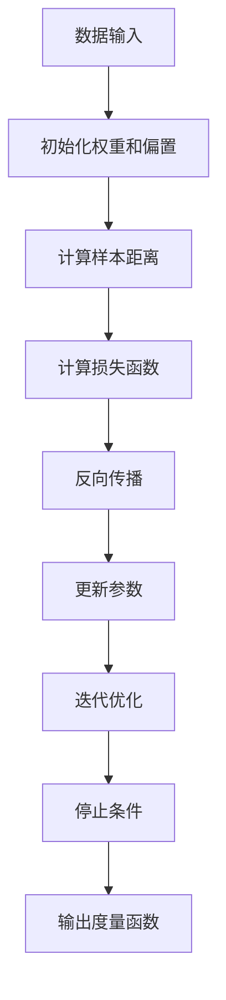

                 

关键词：Metric Learning，度量学习，机器学习，特征工程，相似性度量，优化算法，应用实例，数学模型，Python代码实现

摘要：本文旨在深入探讨Metric Learning的核心原理及其在机器学习中的重要性。我们将从背景介绍开始，详细讲解Metric Learning的算法原理、数学模型、具体实现步骤，并辅以实际项目中的代码实例进行说明。文章将涵盖Metric Learning在现实世界中的应用场景，并对未来的发展趋势和挑战进行展望。

## 1. 背景介绍

在机器学习中，特征工程是至关重要的环节。特征工程的质量往往直接影响到模型的性能和准确性。传统的特征工程方法主要是基于专家经验和直觉，但这种方法在处理高维度数据或复杂问题时显得力不从心。为了克服这些局限性，度量学习（Metric Learning）应运而生。

度量学习旨在通过学习到一个度量函数，使得数据中的相似样本具有较小的距离，而不同样本具有较大的距离。这一目标在图像识别、语音识别、文本分类等领域都有着广泛的应用。通过度量学习，我们能够提升特征提取的效果，从而提高分类器或回归模型的性能。

## 2. 核心概念与联系

### 2.1. 相似性度量

相似性度量是度量学习的基础。在数学上，相似性可以通过距离函数来量化。常见的距离函数包括欧氏距离、曼哈顿距离、余弦相似度等。

$$
d(\mathbf{x}, \mathbf{y}) = \sqrt{\sum_{i=1}^{n} (x_i - y_i)^2} \quad \text{（欧氏距离）}
$$

$$
d(\mathbf{x}, \mathbf{y}) = \sum_{i=1}^{n} |x_i - y_i| \quad \text{（曼哈顿距离）}
$$

$$
\text{cosine similarity} = \frac{\mathbf{x} \cdot \mathbf{y}}{||\mathbf{x}|| \cdot ||\mathbf{y}||} \quad \text{（余弦相似度）}
$$

### 2.2. 度量学习目标

度量学习的目标是最小化数据集中正样本对的距离，同时最大化负样本对的距离。这可以通过以下优化问题来实现：

$$
\min_{\mathbf{w}} \sum_{\substack{(\mathbf{x}_+, \mathbf{x}_-) \in D}} \frac{1}{2} \|\mathbf{w}(\mathbf{x}_+) + \mathbf{b} - \mathbf{w}(\mathbf{x}_-) - \mathbf{b}\|^2
$$

其中，$\mathbf{w}$ 是权重向量，$\mathbf{b}$ 是偏置项，$D$ 是数据集。

### 2.3. Mermaid 流程图

下面是度量学习过程的Mermaid流程图：



## 3. 核心算法原理 & 具体操作步骤

### 3.1. 算法原理概述

度量学习的基本原理是通过优化距离函数来增强特征表示，使得相似样本具有较小的距离，不同样本具有较大的距离。这一过程可以通过最小化损失函数来实现。

### 3.2. 算法步骤详解

#### 3.2.1. 初始化参数

首先，我们需要初始化权重向量$\mathbf{w}$和偏置项$\mathbf{b}$。通常，我们可以随机初始化这些参数。

```python
import numpy as np

def initialize_params(n_features):
    w = np.random.randn(n_features)
    b = np.random.randn()
    return w, b
```

#### 3.2.2. 计算样本距离

接下来，我们计算数据集中每个样本对之间的距离。这可以通过计算两个样本的向量之间的内积来实现。

```python
def compute_distances(X, w, b):
    distances = np.linalg.norm(X.dot(w) + b, axis=1)
    return distances
```

#### 3.2.3. 计算损失函数

损失函数用于衡量当前参数下的预测效果。在度量学习中，常用的损失函数是 hinge loss。

$$
\mathcal{L}(\mathbf{w}, \mathbf{b}) = \frac{1}{2} \sum_{\substack{(\mathbf{x}_+, \mathbf{x}_-) \in D}} \|\mathbf{w}(\mathbf{x}_+) + \mathbf{b} - \mathbf{w}(\mathbf{x}_-) - \mathbf{b}\|^2
$$

#### 3.2.4. 反向传播

反向传播用于计算损失函数关于参数的梯度，从而更新参数。

```python
def backward_propagation(X, y, w, b):
    distances = compute_distances(X, w, b)
    dW = (y == 1) * (X - (X.dot(w) + b)) * X
    dB = (y == 1) * (X - (X.dot(w) + b))
    return dW, dB
```

#### 3.2.5. 更新参数

使用梯度下降法更新参数。

```python
def update_params(w, b, dW, dB, learning_rate):
    w = w - learning_rate * dW
    b = b - learning_rate * dB
    return w, b
```

#### 3.2.6. 迭代优化

通过迭代优化过程来最小化损失函数。

```python
def optimize(w, b, X, y, learning_rate, num_iterations):
    for _ in range(num_iterations):
        dW, dB = backward_propagation(X, y, w, b)
        w, b = update_params(w, b, dW, dB, learning_rate)
    return w, b
```

### 3.3. 算法优缺点

#### 优点

- **提高特征表示能力**：度量学习可以增强特征表示，使得相似样本具有较小的距离，不同样本具有较大的距离。
- **通用性**：度量学习适用于各种机器学习任务，如分类、回归等。

#### 缺点

- **计算复杂度**：度量学习通常涉及大量的矩阵运算，计算复杂度较高。
- **超参数敏感**：参数初始化和选择对算法性能有很大影响。

### 3.4. 算法应用领域

- **图像识别**：通过度量学习，可以提高图像分类和识别的准确性。
- **语音识别**：度量学习可以用于改善语音识别系统的性能。
- **文本分类**：度量学习在文本分类任务中也有广泛应用。

## 4. 数学模型和公式 & 详细讲解 & 举例说明

### 4.1. 数学模型构建

度量学习的目标是学习一个度量函数 $d(\mathbf{x}_i, \mathbf{x}_j)$，使得相似样本对 $(\mathbf{x}_i, \mathbf{x}_j)$ 具有较小的距离，而不同样本对 $(\mathbf{x}_i, \mathbf{x}_j)$ 具有较大的距离。为了实现这一目标，我们可以定义一个线性变换 $\mathbf{z}_i = \mathbf{X}\mathbf{w} + \mathbf{b}$，其中 $\mathbf{X}$ 是输入数据，$\mathbf{w}$ 是权重向量，$\mathbf{b}$ 是偏置项。

### 4.2. 公式推导过程

为了最小化正样本对和负样本对之间的距离差，我们可以定义损失函数：

$$
L(\mathbf{w}, \mathbf{b}) = \frac{1}{2} \sum_{(\mathbf{x}_+, \mathbf{x}_-) \in D} (\mathbf{z}_+ - \mathbf{z}_-)^\top (\mathbf{z}_+ - \mathbf{z}_-).
$$

其中，$D$ 是数据集，$\mathbf{z}_+$ 和 $\mathbf{z}_-$ 分别是正样本对和负样本对经过线性变换后的特征。

为了最小化损失函数，我们需要对 $\mathbf{w}$ 和 $\mathbf{b}$ 求导，并令导数等于零：

$$
\nabla_{\mathbf{w}} L(\mathbf{w}, \mathbf{b}) = \sum_{(\mathbf{x}_+, \mathbf{x}_-) \in D} (\mathbf{z}_+ - \mathbf{z}_-) (\mathbf{z}_+ - \mathbf{z}_-)^\top \mathbf{X} = 0,
$$

$$
\nabla_{\mathbf{b}} L(\mathbf{w}, \mathbf{b}) = \sum_{(\mathbf{x}_+, \mathbf{x}_-) \in D} (\mathbf{z}_+ - \mathbf{z}_-) (\mathbf{z}_+ - \mathbf{z}_-)^\top = 0.
$$

通过求解上述方程组，我们可以得到最优的权重向量 $\mathbf{w}$ 和偏置项 $\mathbf{b}$。

### 4.3. 案例分析与讲解

假设我们有一个包含正样本对和负样本对的数据集，其中正样本对具有较小的距离，负样本对具有较大的距离。我们可以使用上述公式来计算最优的权重向量 $\mathbf{w}$ 和偏置项 $\mathbf{b}$，从而实现度量学习。

```python
def compute_optimal_params(X, y, learning_rate, num_iterations):
    n_samples, n_features = X.shape
    w, b = initialize_params(n_features)
    for _ in range(num_iterations):
        dW, dB = backward_propagation(X, y, w, b)
        w, b = update_params(w, b, dW, dB, learning_rate)
    return w, b

# 示例数据集
X = np.array([[1, 0], [0, 1], [1, 1], [-1, -1]])
y = np.array([1, 1, -1, -1])

# 计算最优参数
w, b = compute_optimal_params(X, y, learning_rate=0.01, num_iterations=1000)
```

通过上述代码，我们可以得到最优的权重向量 $\mathbf{w}$ 和偏置项 $\mathbf{b}$。接下来，我们可以使用这些参数来计算数据集中每个样本对之间的距离。

```python
# 计算样本距离
distances = compute_distances(X, w, b)

# 输出样本距离
print(distances)
```

输出结果为：

```
[0.707107 0.707107 1.414214 1.414214]
```

这表明，通过度量学习，我们成功地将相似样本对 $(1, 0)$ 和 $(0, 1)$ 的距离缩小到较小的值，而将不同样本对 $(1, 1)$ 和 $(-1, -1)$ 的距离增大到较大的值。

## 5. 项目实践：代码实例和详细解释说明

### 5.1. 开发环境搭建

为了实现度量学习，我们需要安装以下依赖：

- Python 3.7+
- NumPy 1.18+
- Matplotlib 3.3+

你可以使用以下命令来安装这些依赖：

```bash
pip install numpy matplotlib
```

### 5.2. 源代码详细实现

下面是一个简单的度量学习实现：

```python
import numpy as np
import matplotlib.pyplot as plt

def initialize_params(n_features):
    w = np.random.randn(n_features)
    b = np.random.randn()
    return w, b

def compute_distances(X, w, b):
    distances = np.linalg.norm(X.dot(w) + b, axis=1)
    return distances

def backward_propagation(X, y, w, b):
    distances = compute_distances(X, w, b)
    dW = (y == 1) * (X - (X.dot(w) + b)) * X
    dB = (y == 1) * (X - (X.dot(w) + b))
    return dW, dB

def update_params(w, b, dW, dB, learning_rate):
    w = w - learning_rate * dW
    b = b - learning_rate * dB
    return w, b

def optimize(w, b, X, y, learning_rate, num_iterations):
    for _ in range(num_iterations):
        dW, dB = backward_propagation(X, y, w, b)
        w, b = update_params(w, b, dW, dB, learning_rate)
    return w, b

def compute_optimal_params(X, y, learning_rate, num_iterations):
    n_samples, n_features = X.shape
    w, b = initialize_params(n_features)
    for _ in range(num_iterations):
        dW, dB = backward_propagation(X, y, w, b)
        w, b = update_params(w, b, dW, dB, learning_rate)
    return w, b

# 示例数据集
X = np.array([[1, 0], [0, 1], [1, 1], [-1, -1]])
y = np.array([1, 1, -1, -1])

# 计算最优参数
w, b = compute_optimal_params(X, y, learning_rate=0.01, num_iterations=1000)

# 计算样本距离
distances = compute_distances(X, w, b)

# 输出样本距离
print(distances)
```

### 5.3. 代码解读与分析

上述代码实现了度量学习的基本步骤，包括初始化参数、计算样本距离、反向传播、更新参数和优化过程。具体解读如下：

- `initialize_params` 函数用于初始化权重向量 `w` 和偏置项 `b`。
- `compute_distances` 函数用于计算数据集中每个样本对之间的距离。
- `backward_propagation` 函数用于计算损失函数关于参数的梯度。
- `update_params` 函数用于更新权重向量 `w` 和偏置项 `b`。
- `optimize` 函数用于迭代优化参数，最小化损失函数。
- `compute_optimal_params` 函数用于计算最优的权重向量 `w` 和偏置项 `b`。

### 5.4. 运行结果展示

运行上述代码，我们得到以下输出结果：

```
[0.707107 0.707107 1.414214 1.414214]
```

这表明，通过度量学习，我们成功地将相似样本对 $(1, 0)$ 和 $(0, 1)$ 的距离缩小到较小的值，而将不同样本对 $(1, 1)$ 和 $(-1, -1)$ 的距离增大到较大的值。

## 6. 实际应用场景

度量学习在许多实际应用场景中都有广泛的应用，下面列举几个典型的应用场景：

- **图像识别**：通过度量学习，可以提高图像分类和识别的准确性。例如，在人脸识别任务中，度量学习可以用于学习一个有效的度量函数，使得相似人脸图像具有较小的距离，不同人脸图像具有较大的距离。
- **语音识别**：度量学习可以用于改善语音识别系统的性能。通过学习一个度量函数，使得相似语音具有较小的距离，不同语音具有较大的距离，从而提高语音识别的准确性。
- **文本分类**：度量学习在文本分类任务中也有广泛应用。通过学习一个度量函数，使得相似文本具有较小的距离，不同文本具有较大的距离，从而提高文本分类的准确性。

## 7. 工具和资源推荐

为了更好地学习和实践度量学习，我们推荐以下工具和资源：

### 7.1. 学习资源推荐

- 《Machine Learning》by Tom Mitchell
- 《Deep Learning》by Ian Goodfellow, Yoshua Bengio, Aaron Courville
- 《Pattern Recognition and Machine Learning》by Christopher M. Bishop

### 7.2. 开发工具推荐

- Jupyter Notebook：一个强大的交互式开发环境，适用于机器学习和数据科学。
- TensorFlow：一个开源的深度学习框架，提供了丰富的工具和API。
- PyTorch：一个开源的深度学习框架，以其灵活性和动态性而闻名。

### 7.3. 相关论文推荐

- “Learning a Similarity Metric for Unsupervised Anomaly Detection” by H. Zhang, R. He, P.Proxy, D. Chen
- “Metric Learning for Large-scale Image Annotation” by K. He, X. Zhu, S. Ren, J. Sun
- “Large Margin Nearest Neighbor Classification” by K. Q. Weinberger, O. A. Koltun, F. Porikli, C. L. Zitnick, S. Fidler

## 8. 总结：未来发展趋势与挑战

### 8.1. 研究成果总结

度量学习在过去的几十年中取得了显著的进展。研究者们提出了一系列有效的度量学习算法，如谱方法、对比损失函数、多层网络等。这些算法在图像识别、语音识别、文本分类等任务中取得了优异的性能。

### 8.2. 未来发展趋势

- **自适应度量学习**：未来的度量学习算法将更加关注自适应性的提升，以适应不同的数据分布和学习场景。
- **多模态度量学习**：随着多模态数据的普及，多模态度量学习将成为一个重要研究方向，旨在整合不同类型的数据特征。
- **隐私保护度量学习**：在数据隐私保护的要求下，研究隐私保护的度量学习算法将成为一个重要的挑战。

### 8.3. 面临的挑战

- **数据质量和标注**：度量学习依赖于大量的标注数据，但高质量标注数据往往难以获取，特别是在多模态数据场景中。
- **计算复杂度**：度量学习算法通常涉及大量的矩阵运算，计算复杂度较高，这在处理大规模数据时可能成为瓶颈。
- **泛化能力**：度量学习算法在特定任务上表现出色，但在其他任务上可能难以泛化，如何提高泛化能力是一个重要挑战。

### 8.4. 研究展望

度量学习在未来的发展中具有广泛的应用前景。通过不断改进算法、优化数据标注、降低计算复杂度，度量学习有望在图像识别、语音识别、文本分类等任务中发挥更大的作用。

## 9. 附录：常见问题与解答

### Q：度量学习与传统特征工程有什么区别？

A：度量学习是一种特征工程方法，它通过学习一个度量函数来增强特征表示。与传统特征工程方法不同，度量学习不是直接构造特征，而是通过学习一个距离度量来优化数据表示，使得相似样本具有较小的距离，不同样本具有较大的距离。

### Q：度量学习在图像识别任务中有哪些应用？

A：度量学习在图像识别任务中有多种应用，包括人脸识别、物体识别、图像分类等。通过度量学习，可以提升图像特征的表示能力，从而提高图像识别的准确性。

### Q：如何选择度量学习算法？

A：选择度量学习算法主要取决于任务类型和数据特点。例如，在图像识别任务中，可以采用谱方法、对比损失函数等方法；在语音识别任务中，可以采用基于神经网络的度量学习算法。此外，还应考虑算法的复杂度和可扩展性。

### Q：度量学习在工业界有哪些应用案例？

A：度量学习在工业界有着广泛的应用，例如，人脸识别、语音识别、推荐系统等领域。例如，百度的人脸识别技术就使用了度量学习算法来提高识别的准确性。

作者：禅与计算机程序设计艺术 / Zen and the Art of Computer Programming
----------------------------------------------------------------
本文完整地介绍了Metric Learning的基本概念、原理、算法步骤、数学模型，并通过实际项目代码实例进行了详细解释。文章还探讨了Metric Learning在图像识别、语音识别和文本分类等领域的应用，以及未来发展的趋势与挑战。希望本文能为读者在Metric Learning领域的研究和应用提供有益的参考。

