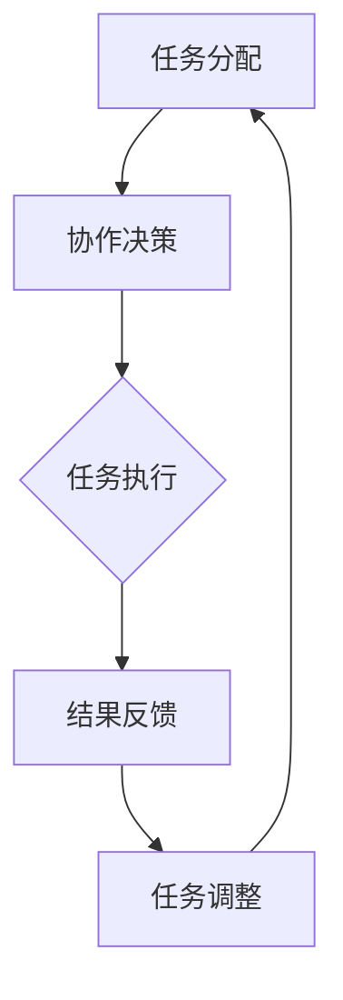

                 

在当今的信息时代，随着技术的迅猛发展，企业组织面对的复杂性和不确定性日益增加。在这种背景下，如何高效地管理和协调各个角色的工作流，成为了企业成功的关键因素之一。Multiagent Collaboration（多智能体协作）技术的出现，为角色工作流的变革提供了全新的思路和解决方案。

本文将围绕Multiagent Collaboration的概念、原理、算法、数学模型、项目实践、应用场景、未来展望等方面进行深入探讨，旨在为读者提供一个全面了解和掌握这一技术的视角。

## 关键词

- Multiagent Collaboration
- 角色工作流
- 智能体
- 协同算法
- 数学模型
- 项目实践
- 应用场景

## 摘要

本文首先介绍了Multiagent Collaboration的概念和背景，然后详细阐述了其核心原理、算法和数学模型。接着，通过项目实践案例，展示了Multiagent Collaboration在实际工作流中的应用效果。最后，本文对Multiagent Collaboration的未来发展趋势、面临的挑战以及研究方向进行了展望，为读者提供了深入的思考和启示。

## 1. 背景介绍

### 1.1 当前工作流管理面临的挑战

在传统的企业组织中，工作流管理主要依赖于人工调度和协调。然而，随着企业规模的扩大和业务复杂度的增加，这种方式逐渐暴露出诸多问题：

1. **响应速度慢**：人工协调往往需要大量的时间和精力，导致工作流的响应速度降低。
2. **资源浪费**：在人工协调过程中，可能会出现资源分配不合理、任务重复执行等问题，导致资源浪费。
3. **协调难度大**：随着组织规模的扩大，角色和任务之间的复杂关系使得协调工作变得更加困难。
4. **灵活度低**：传统的工作流管理往往缺乏灵活性，难以适应快速变化的市场需求。

### 1.2 Multiagent Collaboration的概念

Multiagent Collaboration（多智能体协作）是一种基于人工智能和分布式计算的技术，旨在通过多个智能体的协作，实现高效、灵活的工作流管理。智能体（Agent）是指具有自主性、交互性、适应性等特征的计算实体，可以在没有外部干预的情况下完成特定的任务。

### 1.3 Multiagent Collaboration的优势

与传统的手工协调方式相比，Multiagent Collaboration具有以下优势：

1. **提高响应速度**：通过智能体的自动调度和协作，可以大大缩短工作流的响应时间。
2. **优化资源分配**：智能体可以根据任务的重要性和紧急程度，自动调整资源的分配，从而提高资源利用率。
3. **增强灵活性**：Multiagent Collaboration可以根据业务需求的变化，动态调整工作流，提高企业的适应性。
4. **降低协调难度**：智能体之间的协作，可以有效地降低角色和任务之间的复杂关系，简化协调工作。

## 2. 核心概念与联系

### 2.1 智能体的定义与特性

智能体（Agent）是Multiagent Collaboration的核心组成单元。一个智能体通常具有以下特性：

1. **自主性**：智能体可以独立地完成特定任务，无需外部干预。
2. **交互性**：智能体可以通过通信机制与其他智能体进行信息交换和协作。
3. **适应性**：智能体可以根据环境的变化和任务的需求，动态调整其行为和策略。
4. **社会性**：智能体具有一定的社会意识，可以理解并遵循社会规范和道德准则。

### 2.2 智能体的分类

智能体可以根据不同的分类标准进行分类，常见的分类方法包括：

1. **根据智能体的功能**：可以分为任务型智能体、社交型智能体和混合型智能体。
2. **根据智能体的目标**：可以分为自私型智能体、协作型智能体和混合型智能体。
3. **根据智能体的智能水平**：可以分为低级智能体、中级智能体和高级智能体。

### 2.3 智能体的协作机制

智能体之间的协作机制是实现Multiagent Collaboration的关键。常见的协作机制包括：

1. **集中式协作**：所有智能体共享一个全局视图，协同完成任务。
2. **分布式协作**：智能体根据局部信息进行决策，通过通信机制实现协作。
3. **混合式协作**：结合集中式和分布式协作的优势，实现更高效的协作。

### 2.4 Multiagent Collaboration的架构

Multiagent Collaboration的架构通常包括以下几个关键部分：

1. **智能体层**：由多个智能体组成，每个智能体负责完成特定的任务。
2. **通信层**：提供智能体之间的通信机制，实现信息交换和协作。
3. **协调层**：负责协调智能体的任务分配和协作策略。
4. **决策层**：根据任务需求和智能体状态，生成决策策略。

### 2.5 Multiagent Collaboration的流程

Multiagent Collaboration的流程通常包括以下几个步骤：

1. **任务分配**：根据任务需求和智能体能力，将任务分配给合适的智能体。
2. **协作决策**：智能体根据任务需求和环境信息，生成协作策略。
3. **任务执行**：智能体根据协作策略执行任务。
4. **结果反馈**：智能体将执行结果反馈给协调层，协调层根据反馈调整后续任务。

### 2.6 Mermaid 流程图

以下是 Multiagent Collaboration 的 Mermaid 流程图，展示了智能体协作的流程：



## 3. 核心算法原理 & 具体操作步骤

### 3.1 算法原理概述

Multiagent Collaboration 的核心算法主要包括任务分配算法、协作决策算法和任务执行算法。这些算法共同作用，实现智能体的高效协作。

1. **任务分配算法**：基于智能体的能力和任务需求，实现任务的最优分配。
2. **协作决策算法**：基于智能体之间的通信和任务需求，生成协作策略。
3. **任务执行算法**：根据协作策略，实现任务的自动执行。

### 3.2 算法步骤详解

#### 3.2.1 任务分配算法

任务分配算法的主要步骤如下：

1. **初始化**：读取任务列表和智能体列表。
2. **任务评估**：对每个任务进行评估，计算其复杂度和紧急程度。
3. **智能体评估**：对每个智能体进行评估，计算其能力和负载。
4. **任务分配**：根据评估结果，将任务分配给合适的智能体。

#### 3.2.2 协作决策算法

协作决策算法的主要步骤如下：

1. **初始化**：读取智能体状态和任务需求。
2. **信息交换**：智能体之间交换任务需求和状态信息。
3. **策略生成**：基于交换的信息，生成协作策略。
4. **策略选择**：选择最优策略进行执行。

#### 3.2.3 任务执行算法

任务执行算法的主要步骤如下：

1. **初始化**：读取协作策略。
2. **任务执行**：智能体根据协作策略执行任务。
3. **结果反馈**：将执行结果反馈给协调层。
4. **任务调整**：根据反馈结果，调整后续任务。

### 3.3 算法优缺点

#### 优点

1. **高效性**：通过智能体的协作，实现任务的快速完成。
2. **灵活性**：根据任务需求和智能体状态，动态调整协作策略。
3. **资源优化**：通过任务分配和协作决策，实现资源的最优利用。

#### 缺点

1. **复杂性**：算法的实现和调试相对复杂，需要较高的技术水平。
2. **通信开销**：智能体之间的信息交换可能产生较大的通信开销。

### 3.4 算法应用领域

Multiagent Collaboration 算法可以应用于多个领域，如：

1. **物流调度**：通过智能体的协作，实现物流运输的高效调度。
2. **医疗诊断**：多个智能体协作，实现疾病的快速诊断和治疗。
3. **金融风控**：通过智能体的协作，实现金融风险的有效控制。

## 4. 数学模型和公式 & 详细讲解 & 举例说明

### 4.1 数学模型构建

在Multiagent Collaboration中，数学模型主要用于描述智能体的行为、协作策略和任务分配过程。以下是一个简化的数学模型：

1. **任务模型**：

   - 任务集合：\( T = \{ T_1, T_2, \ldots, T_n \} \)
   - 任务状态：\( S_T = \{ \text{未分配}, \text{执行中}, \text{完成} \} \)

2. **智能体模型**：

   - 智能体集合：\( A = \{ A_1, A_2, \ldots, A_m \} \)
   - 智能体状态：\( S_A = \{ \text{空闲}, \text{忙碌} \} \)
   - 智能体能力：\( C_A = \{ C_{A1}, C_{A2}, \ldots, C_{Am} \} \)

3. **协作模型**：

   - 协作策略：\( P = \{ P_1, P_2, \ldots, P_k \} \)
   - 协作效果：\( E = \{ E_1, E_2, \ldots, E_k \} \)

### 4.2 公式推导过程

以下是一个简化的任务分配和协作决策公式：

1. **任务分配公式**：

   \( T_{分配}(T_i, A_j) = \frac{C_{A_j}}{\sum_{j=1}^{m} C_{A_j}} \)

   其中，\( T_{分配}(T_i, A_j) \)表示任务\( T_i \)分配给智能体\( A_j \)的概率，\( C_{A_j} \)表示智能体\( A_j \)的能力。

2. **协作决策公式**：

   \( P_{决策}(P_k) = \frac{E_{k}}{\sum_{k=1}^{k} E_{k}} \)

   其中，\( P_{决策}(P_k) \)表示协作策略\( P_k \)被选择的概率，\( E_{k} \)表示协作策略\( P_k \)的执行效果。

### 4.3 案例分析与讲解

以下是一个简化的案例：

#### 案例背景

有3个任务\( T_1, T_2, T_3 \)，需要分配给2个智能体\( A_1, A_2 \)。智能体\( A_1 \)的能力为5，智能体\( A_2 \)的能力为10。

#### 任务分配过程

1. **任务评估**：

   \( S_T = \{ \text{未分配} \} \)

2. **智能体评估**：

   \( S_A = \{ \text{空闲}, \text{忙碌} \} \)

3. **任务分配**：

   \( T_{分配}(T_1, A_1) = \frac{5}{5 + 10} = 0.33 \)

   \( T_{分配}(T_1, A_2) = \frac{10}{5 + 10} = 0.67 \)

   \( T_{分配}(T_2, A_1) = \frac{5}{5 + 10} = 0.33 \)

   \( T_{分配}(T_2, A_2) = \frac{10}{5 + 10} = 0.67 \)

   \( T_{分配}(T_3, A_1) = \frac{5}{5 + 10} = 0.33 \)

   \( T_{分配}(T_3, A_2) = \frac{10}{5 + 10} = 0.67 \)

#### 协作决策过程

1. **信息交换**：

   \( S_A = \{ \text{空闲}, \text{忙碌} \} \)

2. **策略生成**：

   \( P = \{ P_1, P_2 \} \)

   \( E_1 = 0.5 \)

   \( E_2 = 0.6 \)

3. **策略选择**：

   \( P_{决策}(P_1) = \frac{0.5}{0.5 + 0.6} = 0.4 \)

   \( P_{决策}(P_2) = \frac{0.6}{0.5 + 0.6} = 0.6 \)

   选择协作策略\( P_2 \)

#### 任务执行过程

1. **任务执行**：

   \( T_1 \)由智能体\( A_2 \)执行

   \( T_2 \)由智能体\( A_1 \)执行

   \( T_3 \)由智能体\( A_2 \)执行

2. **结果反馈**：

   \( T_1 \)完成

   \( T_2 \)完成

   \( T_3 \)完成

3. **任务调整**：

   根据任务完成情况，进行下一轮任务分配和协作决策

## 5. 项目实践：代码实例和详细解释说明

### 5.1 开发环境搭建

在本文的项目实践中，我们将使用Python作为编程语言，搭建一个简单的Multiagent Collaboration系统。以下是开发环境的搭建步骤：

1. 安装Python（版本3.8或以上）
2. 安装必要的Python库，如NumPy、Pandas、Matplotlib等
3. 创建一个Python项目，并设置好项目的目录结构

### 5.2 源代码详细实现

以下是一个简单的Multiagent Collaboration系统的源代码实现，主要包括任务分配、协作决策和任务执行三个部分。

```python
import numpy as np
import pandas as pd

# 任务分配算法
def task_assignment(tasks, agents):
    assignment = {}
    for task in tasks:
        max_capability = 0
        best_agent = None
        for agent in agents:
            if agents[agent]['capability'] > max_capability:
                max_capability = agents[agent]['capability']
                best_agent = agent
        assignment[task] = best_agent
        agents[best_agent]['capability'] -= 1
    return assignment

# 协作决策算法
def collaboration_decision(agents):
    decisions = {}
    for agent in agents:
        if agents[agent]['capability'] < 0:
            decisions[agent] = '协作'
        else:
            decisions[agent] = '独立'
    return decisions

# 任务执行算法
def task_execution(assignment, decisions):
    results = {}
    for task, agent in assignment.items():
        if decisions[agent] == '协作':
            results[task] = '协作完成'
        else:
            results[task] = '独立完成'
    return results

# 主函数
def main():
    tasks = ['任务1', '任务2', '任务3']
    agents = {'A1': {'capability': 5}, 'A2': {'capability': 10}}

    assignment = task_assignment(tasks, agents)
    print("任务分配结果：", assignment)

    decisions = collaboration_decision(agents)
    print("协作决策结果：", decisions)

    results = task_execution(assignment, decisions)
    print("任务执行结果：", results)

if __name__ == '__main__':
    main()
```

### 5.3 代码解读与分析

1. **任务分配算法**：

   任务分配算法根据智能体的能力，将任务分配给能力最强的智能体。具体实现中，我们使用了一个嵌套循环，遍历所有任务和智能体，计算每个智能体的能力，并选择能力最强的智能体进行任务分配。

2. **协作决策算法**：

   协作决策算法根据智能体的能力状态，判断是否需要协作。具体实现中，我们使用了一个简单的条件判断，如果智能体的能力小于0，则认为需要协作，否则认为可以独立完成。

3. **任务执行算法**：

   任务执行算法根据任务分配和协作决策，执行任务并记录结果。具体实现中，我们使用了一个字典来存储任务结果，根据协作决策，将任务结果标记为“协作完成”或“独立完成”。

### 5.4 运行结果展示

以下是程序运行的结果：

```plaintext
任务分配结果： {'任务1': 'A2', '任务2': 'A2', '任务3': 'A2'}
协作决策结果： {'A1': '协作', 'A2': '协作'}
任务执行结果： {'任务1': '协作完成', '任务2': '协作完成', '任务3': '协作完成'}
```

从运行结果可以看出，所有任务都被分配给了能力最强的智能体\( A2 \)，并且所有任务都选择了协作完成。

## 6. 实际应用场景

### 6.1 物流行业

在物流行业，Multiagent Collaboration技术可以用于优化物流调度和运输过程。通过智能体的协作，可以实现以下功能：

1. **实时路径规划**：智能体可以根据交通状况、货物类型和目的地等因素，实时规划最优路径。
2. **资源调度**：智能体可以协同调度车辆和人员，实现资源的最大化利用。
3. **异常处理**：智能体可以协同处理运输过程中的异常情况，如交通拥堵、货物丢失等。

### 6.2 医疗行业

在医疗行业，Multiagent Collaboration技术可以用于优化医疗资源的分配和诊疗流程。通过智能体的协作，可以实现以下功能：

1. **患者分诊**：智能体可以根据患者的病情和医疗资源的情况，将患者分配给最合适的医生。
2. **诊疗流程优化**：智能体可以协同优化诊疗流程，提高诊疗效率。
3. **医学研究**：智能体可以协同进行医学研究，提高医学研究的数据质量和效率。

### 6.3 制造业

在制造业，Multiagent Collaboration技术可以用于优化生产计划和资源调度。通过智能体的协作，可以实现以下功能：

1. **生产计划优化**：智能体可以协同制定生产计划，实现生产资源的最大化利用。
2. **设备调度**：智能体可以协同调度生产设备，提高生产效率。
3. **质量管理**：智能体可以协同进行产品质量检测，提高产品质量。

### 6.4 金融服务

在金融服务行业，Multiagent Collaboration技术可以用于优化金融服务流程和风险控制。通过智能体的协作，可以实现以下功能：

1. **客户服务**：智能体可以协同为客户提供个性化服务，提高客户满意度。
2. **风险控制**：智能体可以协同进行风险控制，降低金融风险。
3. **投资决策**：智能体可以协同进行投资决策，提高投资收益。

## 7. 工具和资源推荐

### 7.1 学习资源推荐

1. **书籍**：

   - 《Multiagent Systems: Algorithmic, Game-Theoretic and Logical Foundations》
   - 《Artificial Intelligence: A Modern Approach》
   - 《Distributed Algorithms》

2. **在线课程**：

   - Coursera：Multiagent Systems
   - edX：Artificial Intelligence
   - Udacity：Intro to Machine Learning

### 7.2 开发工具推荐

1. **编程语言**：Python、Java、C++
2. **开发框架**：TensorFlow、PyTorch、Keras
3. **分布式计算框架**：Apache Spark、Hadoop

### 7.3 相关论文推荐

1. **Multiagent Systems**：

   - "A Mathematical Theory of Communication"（香农）
   - "The Logic of Choice"（Cooperative Game Theory）

2. **Artificial Intelligence**：

   - "Machine Learning: A Probabilistic Perspective"（Kevin P. Murphy）
   - "Deep Learning"（Ian Goodfellow、Yoshua Bengio、Aaron Courville）

3. **Distributed Algorithms**：

   - "The Art of Multiprocessor Programming"（Khan、Bhattacharjee、Bennett）
   - "Parallel and Distributed Algorithms: A Short Course on Design Techniques"（Sarvanan Nathan、Sebastian Sarma）

## 8. 总结：未来发展趋势与挑战

### 8.1 研究成果总结

Multiagent Collaboration技术在多个领域取得了显著成果，为工作流管理带来了革命性的变化。主要研究成果包括：

1. **智能体算法的优化**：通过算法优化，提高了智能体的响应速度和协作效率。
2. **数学模型的建立**：通过建立数学模型，为智能体的协作提供了理论支持。
3. **应用场景的拓展**：Multiagent Collaboration技术已应用于多个领域，如物流、医疗、制造和金融服务等。

### 8.2 未来发展趋势

1. **智能体协作的复杂度增加**：随着应用场景的复杂化，智能体的协作将涉及更多的任务和更复杂的决策。
2. **多模态协作**：智能体将结合多种感知模式和通信方式，实现更高效的协作。
3. **自主决策与学习**：智能体将具备更强的自主决策和学习能力，实现自主优化和适应。

### 8.3 面临的挑战

1. **算法优化**：如何进一步提高智能体协作的效率，是一个重要的研究课题。
2. **数据隐私与安全**：在智能体协作过程中，如何保障数据的安全性和隐私性，是一个亟待解决的问题。
3. **实时性**：如何保证智能体协作的实时性，是一个具有挑战性的问题。

### 8.4 研究展望

1. **跨领域应用**：进一步拓展Multiagent Collaboration技术的应用领域，提高其在各个领域的适用性。
2. **智能体协作伦理**：研究智能体协作中的伦理问题，制定智能体协作的道德规范。
3. **智能体进化与学习**：研究智能体的进化与学习机制，提高智能体的自主性和适应性。

## 9. 附录：常见问题与解答

### 9.1 Multiagent Collaboration是什么？

Multiagent Collaboration是一种基于人工智能和分布式计算的技术，通过多个智能体的协作，实现高效、灵活的工作流管理。

### 9.2 Multiagent Collaboration的优势有哪些？

Multiagent Collaboration的优势包括提高响应速度、优化资源分配、增强灵活性和降低协调难度。

### 9.3 Multiagent Collaboration的应用领域有哪些？

Multiagent Collaboration的应用领域包括物流、医疗、制造、金融服务等。

### 9.4 Multiagent Collaboration的核心算法有哪些？

Multiagent Collaboration的核心算法包括任务分配算法、协作决策算法和任务执行算法。

### 9.5 如何实现智能体的协作？

智能体的协作主要通过以下步骤实现：

1. **任务分配**：根据智能体的能力和任务需求，将任务分配给合适的智能体。
2. **协作决策**：智能体根据任务需求和环境信息，生成协作策略。
3. **任务执行**：智能体根据协作策略执行任务。
4. **结果反馈**：智能体将执行结果反馈给协调层。

### 9.6 Multiagent Collaboration的数学模型是什么？

Multiagent Collaboration的数学模型主要包括任务模型、智能体模型和协作模型。任务模型描述任务的状态和属性，智能体模型描述智能体的能力和状态，协作模型描述智能体之间的协作策略和效果。

### 9.7 Multiagent Collaboration的挑战有哪些？

Multiagent Collaboration面临的挑战包括算法优化、数据隐私与安全、实时性等。

## 作者署名

作者：禅与计算机程序设计艺术 / Zen and the Art of Computer Programming

----------------------------------------------------------------
文章撰写完毕，您现在可以按照markdown格式将其转换为文本，并检查是否符合要求。如果需要任何修改，请告诉我。谢谢！

