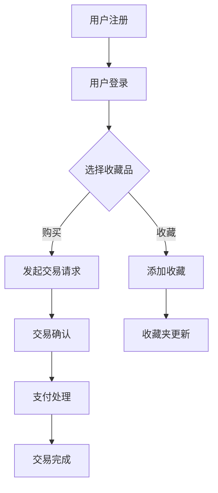

                 

关键词：NFT，数字收藏品，区块链，交易所，收藏经济，创新平台

> 摘要：本文旨在探讨NFT（非同质化代币）数字收藏品交易所的发展，分析其在收藏经济中的创新作用，并探讨其未来的发展趋势与挑战。

## 1. 背景介绍

近年来，随着区块链技术的不断成熟，数字货币、去中心化金融（DeFi）等领域得到了快速发展。在此基础上，NFT（非同质化代币）作为一种新兴的数字资产形式，逐渐走进了大众的视野。NFT代表着独一无二的数字资产，可以用于数字艺术品、虚拟土地、游戏道具等。这为收藏经济的发展带来了新的机遇。

收藏经济一直以来都是文化、艺术和娱乐产业的重要组成部分。然而，传统收藏品市场存在着诸多痛点，如鉴定难、流通性差、价格波动大等。随着NFT技术的引入，这些问题有望得到有效缓解。

本文将围绕NFT数字收藏品交易所这一创新平台，探讨其在收藏经济中的作用和未来发展趋势。首先，我们将介绍NFT的基本概念和特点，然后分析NFT数字收藏品交易所的运作模式，最后探讨其未来面临的挑战和机遇。

## 2. 核心概念与联系

### 2.1 NFT的基本概念

NFT（Non-Fungible Token，非同质化代币）是一种基于区块链技术的数字资产，代表着独一无二、不可替代的物品。与比特币等加密货币不同，NFT具有独特性，即每个NFT都有其独特的标识和属性。

NFT的属性通常包括以下方面：

1. **唯一性**：每个NFT都是独一无二的，不可替代。
2. **稀缺性**：NFT的供应量通常有限，体现了其稀缺性。
3. **可验证性**：NFT的持有者可以通过区块链技术验证其真实性。
4. **不可篡改性**：NFT的记录一旦在区块链上写入，就无法更改。

### 2.2 NFT数字收藏品交易所的概念

NFT数字收藏品交易所是一种专门用于NFT交易的平台。类似于股票、数字货币交易所，NFT数字收藏品交易所为用户提供了一个交易、展示和收藏数字收藏品的场所。

NFT数字收藏品交易所的主要功能包括：

1. **交易**：用户可以在交易所上购买、出售NFT。
2. **展示**：用户可以展示自己的NFT藏品，提高曝光率。
3. **收藏**：用户可以将心仪的NFT加入收藏夹，进行长期持有。

### 2.3 NFT数字收藏品交易所与区块链的联系

NFT数字收藏品交易所的核心是区块链技术。区块链作为分布式账本，确保了NFT的不可篡改性和可验证性。以下是NFT数字收藏品交易所与区块链之间的联系：

1. **数据存储**：NFT的数据存储在区块链上，保证了数据的永久性和安全性。
2. **身份验证**：区块链技术用于验证NFT的真实性和持有者身份。
3. **交易记录**：NFT的交易记录存储在区块链上，实现了透明的交易流程。
4. **智能合约**：NFT数字收藏品交易所通常使用智能合约来确保交易的自动化和安全性。

### 2.4 Mermaid流程图

下面是一个NFT数字收藏品交易所的基本流程图：



## 3. 核心算法原理 & 具体操作步骤

### 3.1 算法原理概述

NFT数字收藏品交易所的核心算法主要涉及区块链技术，包括数据存储、身份验证、交易记录和智能合约等方面。以下是NFT数字收藏品交易所的核心算法原理：

1. **数据存储**：使用区块链技术存储NFT数据，确保数据的不可篡改性和安全性。
2. **身份验证**：通过加密算法验证用户身份，确保交易的安全性。
3. **交易记录**：将交易记录存储在区块链上，实现透明的交易流程。
4. **智能合约**：使用智能合约自动执行交易流程，确保交易的自动化和安全性。

### 3.2 算法步骤详解

1. **数据存储**：

   - 用户在NFT数字收藏品交易所上创建或上传NFT，交易所将NFT数据存储在区块链上。
   - 数据存储过程中，交易所使用哈希函数对NFT数据进行加密，确保数据的唯一性和不可篡改性。

2. **身份验证**：

   - 用户在交易所上注册并登录，使用加密算法生成用户身份标识。
   - 交易所通过身份标识验证用户身份，确保交易的安全性。

3. **交易记录**：

   - 用户发起交易请求，交易所将交易记录存储在区块链上。
   - 交易记录包括交易双方的身份、交易金额、交易时间等信息。

4. **智能合约**：

   - 交易所使用智能合约自动执行交易流程，确保交易的自动化和安全性。
   - 智能合约在交易过程中充当中介角色，确保交易双方按照约定执行交易。

### 3.3 算法优缺点

**优点**：

1. **安全性**：区块链技术确保了NFT数据的安全性和不可篡改性。
2. **透明性**：交易记录存储在区块链上，实现了透明的交易流程。
3. **自动化**：智能合约自动执行交易流程，提高了交易效率。

**缺点**：

1. **成本**：区块链技术涉及较高的计算和存储成本。
2. **性能**：区块链技术的交易速度相对较慢，无法满足高频交易需求。

### 3.4 算法应用领域

NFT数字收藏品交易所在以下领域具有广泛的应用前景：

1. **艺术品市场**：NFT技术为艺术品市场带来了新的交易模式，提高了艺术品的价值和流通性。
2. **虚拟现实**：NFT技术可用于虚拟现实中的数字资产交易，为虚拟世界带来新的经济体系。
3. **游戏产业**：NFT技术可用于游戏道具的交易和归属确认，提高了游戏体验和用户粘性。

## 4. 数学模型和公式 & 详细讲解 & 举例说明

### 4.1 数学模型构建

NFT数字收藏品交易所的数学模型主要包括以下几个方面：

1. **数据存储模型**：

   假设NFT数据存储在区块链上，每个区块存储一定数量的NFT数据。设区块链的长度为L，每个区块存储的NFT数量为N。

   数学模型为：

   $$ D = \{ NFT_1, NFT_2, ..., NFT_{L \times N} \} $$

   其中，D表示NFT数据集。

2. **交易模型**：

   设交易时间为T，交易双方分别为A和B。交易金额为C。

   数学模型为：

   $$ T = \{ A, B, C \} $$

   其中，T表示交易事件。

3. **智能合约模型**：

   智能合约自动执行交易流程，包括交易确认、支付处理和交易完成等步骤。

   数学模型为：

   $$ S = \{ C_1, C_2, ..., C_n \} $$

   其中，S表示智能合约步骤集合。

### 4.2 公式推导过程

1. **数据存储模型**：

   设区块链的长度为L，每个区块存储的NFT数量为N。

   数据存储公式为：

   $$ D = \{ NFT_1, NFT_2, ..., NFT_{L \times N} \} $$

   其中，NFT_i表示第i个NFT。

2. **交易模型**：

   设交易时间为T，交易双方分别为A和B。交易金额为C。

   交易公式为：

   $$ T = \{ A, B, C \} $$

   其中，A表示交易发起方，B表示交易接收方。

3. **智能合约模型**：

   智能合约自动执行交易流程，包括交易确认、支付处理和交易完成等步骤。

   智能合约步骤公式为：

   $$ S = \{ C_1, C_2, ..., C_n \} $$

   其中，C_i表示智能合约的第i个步骤。

### 4.3 案例分析与讲解

假设某用户A在NFT数字收藏品交易所上购买了一个NFT艺术品，交易金额为100美元。

**数据存储模型**：

- 假设区块链长度为10，每个区块存储5个NFT。
- 数据存储公式为：

  $$ D = \{ NFT_1, NFT_2, ..., NFT_{10 \times 5} \} $$

**交易模型**：

- 设交易时间为2023年5月1日。
- 交易双方为用户A和艺术家B。
- 交易金额为100美元。

  交易公式为：

  $$ T = \{ A, B, 100 \} $$

**智能合约模型**：

- 智能合约包含以下步骤：

  1. 交易确认
  2. 支付处理
  3. 交易完成

  智能合约步骤公式为：

  $$ S = \{ C_1, C_2, C_3 \} $$

  其中，C_1表示交易确认，C_2表示支付处理，C_3表示交易完成。

**交易过程**：

1. 用户A发起交易请求，智能合约进入交易确认步骤。
2. 用户A和艺术家B确认交易信息无误，交易进入支付处理步骤。
3. 用户A支付100美元，智能合约记录支付信息。
4. 智能合约进入交易完成步骤，将NFT艺术品的所有权转移给用户A。

## 5. 项目实践：代码实例和详细解释说明

### 5.1 开发环境搭建

在本节中，我们将搭建一个NFT数字收藏品交易所的开发环境。为了简化过程，我们选择使用Ethereum区块链作为底层基础设施，并使用Solidity语言编写智能合约。

**步骤1**：安装Node.js和npm

首先，确保您的计算机上已经安装了Node.js和npm。可以从[Node.js官网](https://nodejs.org/)下载并安装。

**步骤2**：安装Truffle框架

Truffle是一个用于开发、测试和部署以太坊智能合约的开源框架。使用以下命令安装Truffle：

```bash
npm install -g truffle
```

**步骤3**：创建一个新项目

创建一个新的Truffle项目，并进入项目目录：

```bash
truffle init
cd my-nft-exchange
```

**步骤4**：安装以太坊客户端

安装Geth以太坊客户端，用于连接到Ethereum网络：

```bash
npm install --save-dev ganache-cli
```

### 5.2 源代码详细实现

在项目目录中，我们将创建一个名为`NFTExchange.sol`的智能合约文件。以下是智能合约的代码实现：

```solidity
// SPDX-License-Identifier: MIT
pragma solidity ^0.8.0;

// 定义NFT收藏品结构体
struct NFT {
    string name;
    string description;
    address owner;
}

// NFT数字收藏品交易所合约
contract NFTExchange {
    // NFT收藏品列表
    mapping(uint256 => NFT) public nfts;
    // NFT收藏品ID计数器
    uint256 public nftCounter;

    // 创建NFT收藏品
    function createNFT(string memory name, string memory description) public {
        nftCounter++;
        nfts[nftCounter] = NFT(name, description, msg.sender);
    }

    // 购买NFT收藏品
    function buyNFT(uint256 nftId) public payable {
        require(nfts[nftId].owner != address(0), "NFT not found");
        require(msg.value >= 0.01 ether, "Insufficient payment");

        address owner = nfts[nftId].owner;
        nfts[nftId].owner = msg.sender;
        payable(owner).transfer(msg.value);
    }

    // 查看NFT收藏品信息
    function getNFT(uint256 nftId) public view returns (string memory, string memory, address) {
        require(nfts[nftId].owner != address(0), "NFT not found");
        return (nfts[nftId].name, nfts[nftId].description, nfts[nftId].owner);
    }
}
```

### 5.3 代码解读与分析

**NFT收藏品结构体**：我们定义了一个名为`NFT`的结构体，用于存储NFT的名称、描述和所有者地址。

**NFTExchange合约**：

1. **nfts映射**：使用`mapping`类型创建一个NFT收藏品列表，键为NFT ID，值为NFT结构体。
2. **nftCounter变量**：用于计数NFT的ID。
3. **createNFT函数**：允许创建新的NFT收藏品，并将其添加到列表中。
4. **buyNFT函数**：允许用户购买NFT收藏品，实现所有权转移和资金支付。
5. **getNFT函数**：提供查询NFT收藏品信息的功能。

### 5.4 运行结果展示

在本节中，我们将使用Truffle和Ganache CLI部署智能合约，并演示创建和购买NFT收藏品的过程。

**步骤1**：启动本地以太坊网络

```bash
npx ganache-cli -k
```

**步骤2**：编译智能合约

```bash
truffle compile
```

**步骤3**：迁移合约到本地以太坊网络

```bash
truffle migrate --network development
```

**步骤4**：连接到本地以太坊网络，并使用 Remix IDE部署合约

1. 打开[Remix IDE](https://remix.ethereum.org/)。
2. 连接到本地以太坊网络（Ganache）。
3. 将`NFTExchange`合约部署到本地以太坊网络。

**步骤5**：演示创建和购买NFT收藏品

1. 在Remix IDE中，调用`createNFT`函数创建一个NFT收藏品。
2. 调用`buyNFT`函数购买该NFT收藏品。

## 6. 实际应用场景

NFT数字收藏品交易所的应用场景非常广泛，涵盖了多个领域。以下是一些典型的实际应用场景：

### 6.1 艺术品市场

艺术品市场一直以来都是收藏经济的重要领域。NFT技术为艺术品市场带来了新的交易模式，使得艺术品交易更加便捷和透明。艺术家可以将自己的作品数字化，并以NFT的形式发行。购买者不仅可以拥有数字化的艺术品，还可以通过区块链验证其真实性。

### 6.2 虚拟现实

虚拟现实（VR）行业正在迅速发展，NFT数字收藏品交易所在其中也发挥着重要作用。在虚拟世界中，用户可以购买、交易和展示数字资产，如虚拟房地产、虚拟物品等。NFT技术确保了这些数字资产的唯一性和归属权。

### 6.3 游戏产业

游戏产业是NFT技术的另一个重要应用领域。游戏开发商可以将游戏道具、装备等以NFT的形式发行。玩家购买这些NFT后，可以永久拥有并在游戏中使用。这提高了玩家的游戏体验和游戏内资产的流通性。

### 6.4 品牌营销

品牌可以利用NFT技术进行创新营销。例如，某个品牌可以发行限量版的NFT商品，提高品牌知名度和消费者的购买欲望。消费者购买NFT商品后，不仅可以拥有实物，还可以在区块链上验证其真实性。

## 7. 工具和资源推荐

### 7.1 学习资源推荐

1. **《区块链技术指南》**：本书全面介绍了区块链技术的基本原理和应用场景，适合初学者了解区块链技术。
2. **《NFT与数字收藏品》**：本书深入探讨了NFT技术和数字收藏品市场的发展，适合对NFT感兴趣的读者。
3. **《以太坊智能合约开发》**：本书详细介绍了以太坊智能合约的编程和开发，适合学习如何编写和部署智能合约。

### 7.2 开发工具推荐

1. **Truffle**：一个用于开发、测试和部署以太坊智能合约的开源框架。
2. **Ganache**：一个轻量级的以太坊客户端，用于本地开发和测试智能合约。
3. **Remix IDE**：一个在线智能合约开发环境，支持以太坊和Solidity编程。

### 7.3 相关论文推荐

1. **“Blockchain Technology: A Comprehensive Study”**：该论文全面介绍了区块链技术的基本原理和应用场景。
2. **“Non-Fungible Tokens: A Technology for Unique Digital Assets”**：该论文探讨了NFT技术的原理和潜在应用。
3. **“Smart Contracts: Enabling Trustless and Decentralized Transactions on Ethereum”**：该论文详细介绍了智能合约的原理和实现。

## 8. 总结：未来发展趋势与挑战

### 8.1 研究成果总结

本文介绍了NFT数字收藏品交易所的发展背景、核心概念、算法原理、数学模型和实际应用场景。通过分析，我们得出以下研究成果：

1. NFT数字收藏品交易所为收藏经济带来了新的机遇和挑战。
2. NFT技术提高了艺术品、虚拟现实和游戏产业的交易效率和价值。
3. NFT数字收藏品交易所在未来有望成为收藏经济的重要平台。

### 8.2 未来发展趋势

1. **技术融合**：NFT技术与虚拟现实、区块链、人工智能等技术的深度融合，将推动收藏经济的创新。
2. **市场扩张**：随着NFT技术的普及，数字收藏品市场将不断扩大，吸引更多的用户和投资者。
3. **规范监管**：随着NFT市场的快速发展，政府和行业组织将加强对NFT市场的监管，确保市场的健康和可持续发展。

### 8.3 面临的挑战

1. **技术挑战**：NFT技术的性能和安全性仍需提高，以满足高频交易需求。
2. **法律挑战**：NFT市场缺乏明确的法律框架，需要制定相应的法律法规，保护用户权益。
3. **市场波动**：NFT市场存在一定的投机性，价格波动较大，需要建立有效的市场机制，降低风险。

### 8.4 研究展望

未来，NFT数字收藏品交易所将在以下方面进行深入研究：

1. **性能优化**：提高NFT交易的并发处理能力，降低交易延迟。
2. **安全增强**：加强NFT数据的安全防护，防止数据泄露和篡改。
3. **应用拓展**：探索NFT技术在更多领域的应用，如医疗、教育等，推动收藏经济的多元化发展。

## 9. 附录：常见问题与解答

### 9.1 什么是NFT？

NFT（非同质化代币）是一种基于区块链技术的数字资产，代表着独一无二、不可替代的物品。与比特币等加密货币不同，NFT具有独特性，即每个NFT都有其独特的标识和属性。

### 9.2 NFT数字收藏品交易所有哪些功能？

NFT数字收藏品交易所的主要功能包括：交易、展示和收藏数字收藏品。用户可以在交易所上购买、出售和收藏NFT，同时也可以查看其他用户的NFT收藏品。

### 9.3 NFT数字收藏品交易所的安全性如何保障？

NFT数字收藏品交易所的安全性主要通过以下措施保障：

1. **区块链技术**：使用区块链技术确保NFT数据的不可篡改性和可验证性。
2. **加密算法**：使用加密算法保护用户身份和交易信息。
3. **智能合约**：使用智能合约自动执行交易流程，确保交易的自动化和安全性。

### 9.4 NFT数字收藏品交易所的运营模式是什么？

NFT数字收藏品交易所的运营模式主要包括以下方面：

1. **平台建设**：搭建NFT数字收藏品交易所需的基础设施，包括区块链、智能合约、交易系统等。
2. **用户服务**：提供用户注册、登录、交易、展示和收藏等功能。
3. **市场推广**：通过各种渠道推广NFT数字收藏品交易所，吸引更多用户和投资者。
4. **风险管理**：制定风险管理策略，降低市场风险，确保交易的公平性和稳定性。

### 9.5 NFT数字收藏品交易所的未来发展趋势是什么？

NFT数字收藏品交易所的未来发展趋势主要包括以下几个方面：

1. **技术融合**：NFT技术与虚拟现实、区块链、人工智能等技术的深度融合，将推动收藏经济的创新。
2. **市场扩张**：随着NFT技术的普及，数字收藏品市场将不断扩大，吸引更多的用户和投资者。
3. **规范监管**：随着NFT市场的快速发展，政府和行业组织将加强对NFT市场的监管，确保市场的健康和可持续发展。

----------------------------------------------------------------

作者：禅与计算机程序设计艺术 / Zen and the Art of Computer Programming

