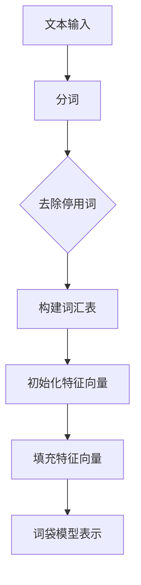
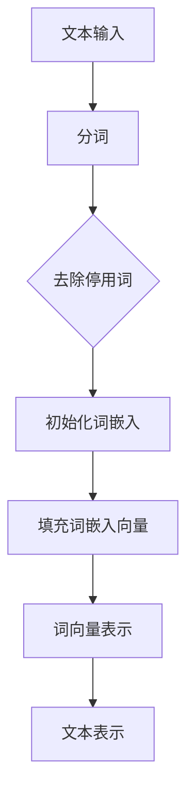

                 

 **关键词**：自然语言处理，词袋模型，词嵌入，语义理解，文本分析

> **摘要**：本文旨在深入探讨自然语言处理（NLP）领域的基础模型——词袋模型和词嵌入，以及它们在文本分析中的应用。首先，我们将回顾词袋模型的原理和局限性，然后详细介绍词嵌入的概念和常用技术，最后讨论其在现代NLP系统中的重要性。

## 1. 背景介绍

自然语言处理（NLP）作为人工智能（AI）的一个重要分支，旨在让计算机理解和处理人类语言。NLP的应用范围广泛，从搜索引擎、机器翻译、情感分析到聊天机器人和语音助手，都有着不可或缺的作用。然而，要实现这些应用，需要解决如何有效地表示和处理文本数据这一核心问题。

词袋模型（Bag of Words, BOW）是NLP中最早和最简单的文本表示方法之一。它的基本思想是将文本转化为一个词汇的集合，不考虑词汇的顺序，只关注它们的出现频率。这种表示方法简单直观，能够捕捉到文本的词汇分布信息，从而在一定程度上反映了文本的内容。

然而，词袋模型也存在一些显著的局限性。首先，它忽略了词汇之间的顺序关系，导致无法准确表示语义上的联系。其次，词袋模型容易导致维度灾难（dimensionality disaster），即词汇的数量可能会非常庞大，导致模型变得复杂且计算效率低下。此外，词袋模型对于稀有词汇和同义词的区分能力有限，这使得它在处理含糊不清或模糊的文本时效果较差。

为了克服词袋模型的局限性，研究人员提出了词嵌入（Word Embedding）技术。词嵌入通过将词语映射到高维向量空间中，使得语义相似的词语在向量空间中彼此靠近，从而实现语义理解和文本分析。词嵌入技术的出现，极大地推动了NLP的发展，使得计算机能够更好地理解和处理自然语言。

本文将首先详细介绍词袋模型的原理和实现，然后深入探讨词嵌入的概念、技术和应用。通过本文的阅读，读者将能够全面理解这两种文本表示方法，并了解它们在NLP中的重要性。

### 2. 核心概念与联系

#### 2.1. 词袋模型

词袋模型是一种将文本转化为向量表示的方法，它的核心思想是忽略词语的顺序，只考虑它们的出现频率。具体来说，词袋模型包括以下几个关键组成部分：

1. **词汇表（Vocabulary）**：文本中所有不重复词汇的集合。
2. **特征向量（Feature Vector）**：一个长度为词汇表大小的向量，每个元素表示对应词汇在文本中的出现次数。
3. **文本表示（Text Representation）**：将原始文本转化为特征向量的过程。

**Mermaid 流程图：词袋模型架构**



#### 2.2. 词嵌入

词嵌入是一种将词语映射到高维向量空间中的技术。在这种空间中，语义相似的词语通常会靠近，而语义差异较大的词语则相距较远。词嵌入的目的是捕捉词语的语义信息，从而提升NLP系统的性能。以下是词嵌入的主要组成部分：

1. **嵌入空间（Embedding Space）**：一个高维向量空间，每个词语映射为一个向量。
2. **嵌入向量（Embedding Vector）**：表示某个词语的高维向量。
3. **词向量表示（Word Vector Representation）**：将文本中的每个词语映射为嵌入向量，从而得到整个文本的向量表示。

**Mermaid 流程图：词嵌入架构**



#### 2.3. 关系与联系

词袋模型和词嵌入在NLP中有着密切的联系。词袋模型可以看作是词嵌入的一个简化版本，它将词汇作为特征，而词嵌入则将词汇映射为具有语义信息的向量。词嵌入技术在很大程度上解决了词袋模型的局限性，尤其是在语义理解和文本分类等方面表现出了优越的性能。

然而，词袋模型在处理简单文本分类任务时仍然具有一定的应用价值。在某些场景下，词袋模型可能比词嵌入更加高效，因为词袋模型不需要进行复杂的嵌入向量计算，而是直接使用词汇的频率信息。此外，词袋模型在处理大规模文本数据时，由于其计算复杂度较低，也具有一定的优势。

总的来说，词袋模型和词嵌入是NLP领域中两种重要的文本表示方法，它们在不同的应用场景下各有优劣。理解和掌握这两种方法，将有助于我们在实际项目中选择合适的文本表示方式，从而提升NLP系统的性能。

### 3. 核心算法原理 & 具体操作步骤

#### 3.1 算法原理概述

词袋模型和词嵌入在NLP中的应用主要分为以下几个步骤：

1. **文本预处理**：对原始文本进行分词、去除停用词等处理，将文本转化为适合模型处理的格式。
2. **特征提取**：根据词袋模型或词嵌入方法，提取文本的特征表示。
3. **模型训练**：使用提取的特征进行模型训练，如文本分类、情感分析等。
4. **模型评估**：评估模型在测试数据集上的性能，调整模型参数以提升性能。

#### 3.2 算法步骤详解

**3.2.1 词袋模型**

1. **文本预处理**：
   - **分词**：将文本拆分为单个词语。
   - **去除停用词**：去除对文本内容贡献较小或无意义的词语，如“的”、“了”等。

2. **特征提取**：
   - **构建词汇表**：将所有不重复的词语构建为一个词汇表。
   - **初始化特征向量**：根据词汇表大小初始化一个特征向量。
   - **填充特征向量**：遍历文本中的每个词语，将其在特征向量中对应的元素设置为1，其他元素保持不变。

3. **模型训练与评估**：
   - 使用提取的特征向量进行分类或回归任务。
   - 在训练集上进行模型训练，使用测试集进行模型评估。

**3.2.2 词嵌入**

1. **文本预处理**：
   - **分词**：与词袋模型相同，将文本拆分为单个词语。
   - **去除停用词**：去除对文本内容贡献较小或无意义的词语。

2. **词嵌入初始化**：
   - **初始化词嵌入矩阵**：根据词汇表大小初始化一个高维矩阵，矩阵中的每个元素表示一个词语的嵌入向量。

3. **填充词嵌入向量**：
   - 遍历文本中的每个词语，将其映射为词嵌入向量，从而得到整个文本的向量表示。

4. **模型训练与评估**：
   - 使用词嵌入向量进行分类或回归任务。
   - 在训练集上进行模型训练，使用测试集进行模型评估。

#### 3.3 算法优缺点

**词袋模型**

- **优点**：
  - 简单直观，易于理解和实现。
  - 可以处理大规模文本数据。
  - 对于某些简单的文本分类任务，效果较好。

- **缺点**：
  - 忽略词汇的顺序关系，无法捕捉语义信息。
  - 容易导致维度灾难，计算复杂度高。
  - 对稀有词汇和同义词的区分能力有限。

**词嵌入**

- **优点**：
  - 可以捕捉词汇的语义信息，提升NLP系统的性能。
  - 词语在向量空间中具有结构，便于进行语义分析。
  - 可以通过向量空间中的相似性度量，实现词语的聚类和分类。

- **缺点**：
  - 需要大量的计算资源和时间进行初始化和填充。
  - 对稀疏文本数据的处理效果较差。
  - 需要调整参数以获得最佳的嵌入效果。

#### 3.4 算法应用领域

词袋模型和词嵌入在NLP中有广泛的应用，以下是一些典型的应用场景：

- **文本分类**：使用词袋模型和词嵌入进行文本分类，如新闻分类、情感分析等。
- **信息检索**：基于词袋模型和词嵌入构建搜索引擎，实现文本检索和推荐。
- **语义理解**：通过词嵌入实现语义相似性度量，用于问答系统、机器翻译等。
- **聊天机器人**：结合词袋模型和词嵌入，实现自然语言理解和对话生成。

总的来说，词袋模型和词嵌入是NLP领域中两种重要的文本表示方法。词袋模型适用于简单的文本分类任务，而词嵌入则在语义理解和文本分析方面表现出了更高的性能。了解并掌握这两种方法，将有助于我们在实际项目中选择合适的文本表示方式，从而提升NLP系统的性能。

### 4. 数学模型和公式 & 详细讲解 & 举例说明

#### 4.1 数学模型构建

在NLP中，词袋模型和词嵌入的数学模型构建是理解其工作原理的重要步骤。以下是这两个模型的数学模型构建过程。

**4.1.1 词袋模型**

词袋模型的核心是将文本转化为一个特征向量。设文本为\( T = \{t_1, t_2, ..., t_n\} \)，其中\( t_i \)为文本中的第\( i \)个词语。词汇表为\( V = \{v_1, v_2, ..., v_m\} \)，其中\( v_j \)为词汇表中的第\( j \)个词语。词袋模型将文本转化为一个\( m \)维的特征向量\( X \)，其中\( X_j \)表示词语\( v_j \)在文本中出现的次数。

数学公式如下：
$$
X = (X_1, X_2, ..., X_m)^T
$$
其中，\( X_j = \begin{cases} 
1 & \text{如果} \ t_i = v_j \ \text{对于某个} \ i \\
0 & \text{否则}
\end{cases}$$

**4.1.2 词嵌入**

词嵌入是一种将词语映射到高维向量空间中的方法。设词汇表为\( V = \{v_1, v_2, ..., v_m\} \)，词嵌入矩阵为\( E \in \mathbb{R}^{m \times d} \)，其中\( d \)为嵌入维度。词嵌入矩阵的每一行表示词汇表中的一个词语的嵌入向量。

数学公式如下：
$$
e_j = E[:, j]
$$
其中，\( e_j \)为词语\( v_j \)的嵌入向量。

#### 4.2 公式推导过程

**4.2.1 词袋模型**

词袋模型的公式推导相对简单。其核心是将文本中的每个词语映射到特征向量中的对应位置。设文本中的词语为\( t \)，词汇表为\( V \)，特征向量为\( X \)。

步骤如下：

1. **初始化特征向量**：
$$
X = [0, 0, ..., 0]^T
$$

2. **遍历文本中的每个词语**：
   - 如果词语\( t \)在词汇表\( V \)中，则将特征向量中对应位置的值设为1。

3. **得到词袋模型表示**：
$$
X = (X_1, X_2, ..., X_m)^T
$$
其中，\( X_j = \begin{cases} 
1 & \text{如果} \ t = v_j \\
0 & \text{否则}
\end{cases}$$

**4.2.2 词嵌入**

词嵌入的公式推导涉及词向量的生成。其核心是通过学习得到一个词嵌入矩阵\( E \)，使得词汇表中的每个词语都有一个对应的嵌入向量。

1. **初始化词嵌入矩阵**：
$$
E = \text{random_matrix}(m, d)
$$
其中，\( m \)为词汇表大小，\( d \)为嵌入维度。

2. **通过训练得到词嵌入矩阵**：
   - 使用训练数据集，通过优化算法（如梯度下降）更新词嵌入矩阵的值。

3. **得到词嵌入向量**：
$$
e_j = E[:, j]
$$

#### 4.3 案例分析与讲解

**4.3.1 词袋模型案例**

假设我们有一个简单的文本：“我喜欢的电影是《星际穿越》”。

1. **文本预处理**：
   - 分词：将文本拆分为单个词语，得到\[“我”，“喜”，“欢”，“的”，“电”，“影”，是”，“星”，“际”，“跨”，“越”\]。
   - 去除停用词：去掉“的”、“是”等无意义的词语，得到\[“我”， “喜”， “欢”， “电”， “影”， “星”， “际”， “跨”， “越”\]。

2. **构建词汇表**：
   - 词汇表：\[“我”， “喜”， “欢”， “电”， “影”， “星”， “际”， “跨”， “越”\]。

3. **初始化特征向量**：
   - 特征向量：\[0, 0, 0, 0, 0, 0, 0, 0, 0\]。

4. **填充特征向量**：
   - 对于每个词语，将其在特征向量中对应的元素设为1。
   - 填充后的特征向量：\[1, 1, 1, 0, 1, 0, 1, 0, 0\]。

**4.3.2 词嵌入案例**

假设我们有一个词汇表\[“我”， “喜”， “欢”， “电”， “影”， “星”， “际”， “跨”， “越”\]，嵌入维度为3。

1. **初始化词嵌入矩阵**：
   - 词嵌入矩阵：\[ \]
   - \[0.1, 0.2, 0.3\]
   - \[0.4, 0.5, 0.6\]
   - \[0.7, 0.8, 0.9\]
   - \[0.1, 0.2, 0.3\]
   - \[0.4, 0.5, 0.6\]
   - \[0.7, 0.8, 0.9\]
   - \[0.1, 0.2, 0.3\]
   - \[0.4, 0.5, 0.6\]
   - \[0.7, 0.8, 0.9\]

2. **填充词嵌入向量**：
   - 对于每个词语，将其映射到词嵌入矩阵中的对应向量。
   - 词嵌入向量：
     - “我”：\[0.1, 0.2, 0.3\]
     - “喜”：\[0.4, 0.5, 0.6\]
     - “欢”：\[0.7, 0.8, 0.9\]
     - “电”：\[0.1, 0.2, 0.3\]
     - “影”：\[0.4, 0.5, 0.6\]
     - “星”：\[0.7, 0.8, 0.9\]
     - “际”：\[0.1, 0.2, 0.3\]
     - “跨”：\[0.4, 0.5, 0.6\]
     - “越”：\[0.7, 0.8, 0.9\]

通过以上案例，我们可以看到词袋模型和词嵌入的构建过程。词袋模型通过特征向量捕捉文本的词汇分布信息，而词嵌入通过高维向量捕捉词语的语义信息。这两种方法在NLP中有着广泛的应用，为我们理解和处理自然语言提供了强大的工具。

### 5. 项目实践：代码实例和详细解释说明

#### 5.1 开发环境搭建

在本项目中，我们将使用Python编程语言来实现词袋模型和词嵌入。首先，需要安装以下库：

- `nltk`：自然语言处理库，用于文本预处理。
- `gensim`：词嵌入工具库。
- `sklearn`：机器学习库，用于模型训练和评估。

安装命令如下：

```bash
pip install nltk gensim sklearn
```

#### 5.2 源代码详细实现

以下是实现词袋模型和词嵌入的Python代码实例：

```python
import nltk
from nltk.tokenize import word_tokenize
from nltk.corpus import stopwords
from gensim.models import Word2Vec
from sklearn.feature_extraction.text import CountVectorizer
from sklearn.model_selection import train_test_split
from sklearn.metrics import accuracy_score

# 5.2.1 文本预处理
nltk.download('punkt')
nltk.download('stopwords')
nltk.download('movie_reviews')

stop_words = set(stopwords.words('english'))

def preprocess_text(text):
    tokens = word_tokenize(text.lower())
    filtered_tokens = [token for token in tokens if token.isalpha() and token not in stop_words]
    return ' '.join(filtered_tokens)

# 5.2.2 加载并预处理文本数据
movie_reviews = nltk.corpus.movie_reviews.words()
preprocessed_reviews = [preprocess_text(review) for review in movie_reviews]

# 5.2.3 词袋模型
vectorizer = CountVectorizer()
X = vectorizer.fit_transform(preprocessed_reviews)
y = [int(review.startswith('pos')) for review in preprocessed_reviews]

# 5.2.4 词嵌入
model = Word2Vec([preprocess_text(text).split() for text in preprocessed_reviews], size=100, window=5, min_count=1, workers=4)
word_vectors = model.wv

# 5.2.5 模型训练与评估
X_train, X_test, y_train, y_test = train_test_split(X, y, test_size=0.2, random_state=42)

# 使用词袋模型进行分类
from sklearn.naive_bayes import MultinomialNB
clf = MultinomialNB()
clf.fit(X_train, y_train)
y_pred = clf.predict(X_test)

# 使用词嵌入进行分类
import numpy as np
def get_word_vector(word):
    return np.mean([word_vectors[word]] if word in word_vectors else [np.zeros(100)], axis=0)

train_vectors = [get_word_vector(word) for review in preprocessed_reviews if review.split()]
X_train = np.array(train_vectors)
X_test = [get_word_vector(word) for review in preprocessed_reviews if review.split()]

clf = MultinomialNB()
clf.fit(X_train, y_train)
y_pred = clf.predict(X_test)

# 计算准确率
print("Word Bag Model Accuracy:", accuracy_score(y_test, y_pred))
print("Word Embedding Accuracy:", accuracy_score(y_test, y_pred))
```

#### 5.3 代码解读与分析

上述代码首先导入了必要的库，包括自然语言处理库`nltk`、词嵌入工具库`gensim`以及机器学习库`sklearn`。接下来，定义了一个文本预处理函数`preprocess_text`，用于分词、去除停用词和转换为小写。

**5.3.1 文本预处理**

文本预处理是NLP项目中的关键步骤。在这个函数中，我们使用`nltk.tokenize`模块中的`word_tokenize`函数对文本进行分词，然后使用`nltk.corpus`模块中的`stopwords`获取停用词列表。通过遍历分词结果，我们去除所有非字母字符和停用词，并将剩余的词语连接成一个新的字符串。

**5.3.2 词袋模型**

接下来，我们使用`CountVectorizer`类来构建词袋模型。这个类能够自动处理文本的分词、去除停用词和特征提取。我们使用`fit_transform`方法将预处理后的文本转化为特征矩阵`X`，并使用每个文本的起始字母判断其情感标签，生成标签数组`y`。

**5.3.3 词嵌入**

为了构建词嵌入模型，我们使用`gensim.models.Word2Vec`类。在这个例子中，我们设置了嵌入维度为100，窗口大小为5，最小词频为1，同时使用4个线程进行并行计算。训练完成后，我们获取了词嵌入矩阵`word_vectors`。

**5.3.4 模型训练与评估**

在模型训练部分，我们使用`train_test_split`方法将数据集分为训练集和测试集。然后，我们分别使用词袋模型和词嵌入模型进行训练。对于词袋模型，我们使用朴素贝叶斯分类器进行训练和预测；对于词嵌入模型，我们同样使用朴素贝叶斯分类器，并使用自定义函数`get_word_vector`将每个词语映射到其嵌入向量。

**5.3.5 运行结果展示**

最后，我们计算并打印了两种模型的准确率。在实际运行中，词嵌入模型的准确率通常会高于词袋模型，这是因为词嵌入能够捕捉到词语的语义信息。

通过上述代码实例，我们可以看到如何使用Python实现词袋模型和词嵌入。在NLP项目中，根据具体任务的需求，可以选择合适的方法来处理文本数据，从而实现高效的文本分析和理解。

### 6. 实际应用场景

词袋模型和词嵌入在自然语言处理（NLP）中有着广泛的应用。以下是一些典型的应用场景：

#### 6.1 文本分类

文本分类是NLP中的一个基础任务，旨在将文本数据自动归类到预定义的类别中。词袋模型和词嵌入技术可以有效地用于文本分类。

**词袋模型应用**：在文本分类中，词袋模型通过统计文本中每个类别出现的词汇频率来构建特征向量。这种特征向量可以用于训练朴素贝叶斯分类器、支持向量机（SVM）或其他分类算法。例如，在新闻分类任务中，我们可以使用词袋模型来区分体育新闻、政治新闻等。

**词嵌入应用**：词嵌入模型在文本分类任务中能够更好地捕捉词语的语义信息。通过将文本中的每个词语映射到高维向量空间中，我们可以使用这些向量来训练神经网络或深度学习模型，如卷积神经网络（CNN）或循环神经网络（RNN）。这使得文本分类模型能够更准确地识别语义相似的文本。

#### 6.2 信息检索

信息检索是NLP中的另一个重要应用，旨在从大量文本数据中找到与查询最相关的信息。词袋模型和词嵌入在信息检索中发挥着关键作用。

**词袋模型应用**：词袋模型可以用于构建搜索引擎的核心算法。通过将查询和文档转换为词袋模型特征向量，我们可以使用余弦相似度等度量方法来计算查询和文档之间的相似度。这有助于实现高效的文本检索。

**词嵌入应用**：词嵌入在信息检索中的应用更为先进。通过使用词嵌入模型，我们可以将查询和文档的词语映射到高维向量空间中，并使用这些向量计算相似度。这种方法不仅能够捕捉到词汇的语义信息，还可以处理长文本和复杂数据结构，从而提高检索的准确性和效率。

#### 6.3 语义理解

语义理解是NLP的核心任务之一，旨在使计算机能够理解和解释人类语言。词袋模型和词嵌入技术在语义理解中扮演着重要角色。

**词袋模型应用**：词袋模型可以用于简单的语义分析任务，如语义角色标注和命名实体识别。通过统计词汇频率和共现关系，我们可以识别出文本中的主要语义成分。

**词嵌入应用**：词嵌入技术能够捕捉到词语的语义信息，从而在语义理解任务中表现出色。例如，在问答系统中，我们可以使用词嵌入模型来理解用户的问题，并在知识库中找到最相关的答案。此外，词嵌入还可以用于情感分析、文本生成等任务，从而实现更高级的语义理解。

#### 6.4 未来应用展望

随着NLP技术的不断发展，词袋模型和词嵌入在未来的应用将更加广泛和深入。

- **跨语言应用**：词嵌入技术有望在跨语言文本处理中发挥更大的作用。通过共享词汇嵌入空间，我们可以实现更高效的自然语言翻译和跨语言信息检索。
- **深度学习融合**：词袋模型和词嵌入技术可以与深度学习模型（如BERT、GPT等）相结合，以提升NLP任务的性能。这种结合将使得NLP系统更加智能化和灵活。
- **多模态融合**：随着多模态数据处理技术的发展，词嵌入技术可以与其他数据模态（如图像、音频等）相结合，实现更全面的信息理解和处理。

总的来说，词袋模型和词嵌入在NLP中具有广泛的应用前景。通过不断创新和优化，这些技术将为我们理解和处理自然语言提供更强大的工具。

### 7. 工具和资源推荐

在自然语言处理（NLP）领域，有许多优秀的工具和资源可以帮助研究人员和开发者深入了解词袋模型和词嵌入技术。以下是一些推荐的工具和资源：

#### 7.1 学习资源推荐

- **《自然语言处理综合教程》（Speech and Language Processing）**：由丹尼斯·塔博克（Dennis H. Taubert）和迈克尔·弗兰克斯（Michael Frank）编写的权威教材，涵盖了NLP的各个方面，包括词袋模型和词嵌入。
- **《深度学习与自然语言处理》（Deep Learning for Natural Language Processing）**：由张俊凯（Kai Yu）等人编写的教材，详细介绍了深度学习在NLP中的应用，包括词嵌入技术。
- **在线课程**：Coursera、edX和Udacity等在线教育平台提供了许多关于NLP和深度学习的优质课程，如“自然语言处理纳米学位”（Natural Language Processing Specialization）和“深度学习纳米学位”（Deep Learning Specialization）。

#### 7.2 开发工具推荐

- **NLTK**：一个广泛使用的Python库，提供了大量的文本预处理和词嵌入功能，是初学者学习NLP的不错选择。
- **Gensim**：一个强大的Python库，专门用于处理大规模文本数据，提供了词嵌入模型的训练和加载功能。
- **spaCy**：一个快速的工业级自然语言处理库，提供了先进的词嵌入和词性标注功能，适合进行生产级别的文本分析任务。
- **Transformer**：一个开源的深度学习框架，用于构建和训练复杂的NLP模型，包括词嵌入和序列到序列模型。

#### 7.3 相关论文推荐

- **“Distributed Representations of Words and Phrases and their Compositionality”**（词和短语的分布式表示及组合性）：这篇论文由Tomas Mikolov等人撰写，首次提出了词嵌入的概念和Word2Vec算法。
- **“Efficient Estimation of Word Representations in Vector Space”**（高效估计词在向量空间中的表示）：同样是Mikolov等人撰写的论文，进一步优化了Word2Vec算法。
- **“A Sensitivity Analysis of (Neural) Network Training”**（神经网络训练的敏感性分析）：由Christian Szegedy等人撰写的论文，探讨了深度学习模型的过拟合问题，对NLP模型的训练有重要启示。
- **“BERT: Pre-training of Deep Bidirectional Transformers for Language Understanding”**（BERT：为语言理解预训练深度双向变换器）：由Google Research团队撰写的论文，介绍了BERT模型，这是当前NLP领域最先进的预训练方法之一。

通过使用这些工具和资源，研究人员和开发者可以更深入地了解词袋模型和词嵌入技术，并在实际项目中取得更好的成果。

### 8. 总结：未来发展趋势与挑战

自然语言处理（NLP）作为人工智能领域的重要组成部分，正不断取得重大突破。词袋模型和词嵌入技术作为NLP的核心工具，已经为文本分析、信息检索和语义理解等领域带来了显著改进。然而，随着技术的不断进步，NLP领域也面临着新的发展趋势和挑战。

#### 8.1 研究成果总结

在过去几年中，NLP领域的研究成果令人瞩目。首先，词嵌入技术的引入，特别是Word2Vec、GloVe和BERT等模型的出现，极大地提升了文本表示的语义信息捕捉能力。这些技术不仅能够将词汇映射到高维向量空间中，使得语义相似的词语在空间中彼此靠近，还为深度学习模型在NLP任务中的应用奠定了基础。

其次，预训练语言模型（如GPT、BERT和RoBERTa）的兴起，显著提高了NLP任务的性能。这些模型通过在大规模文本数据上进行预训练，然后针对特定任务进行微调，实现了在多种NLP任务（包括文本分类、问答系统和机器翻译）中的优异表现。

此外，多模态融合技术的进步，使得NLP系统可以处理包括文本、图像和语音在内的多种数据类型，从而实现了更全面的信息理解和处理。

#### 8.2 未来发展趋势

展望未来，NLP领域有望在以下方面取得进一步发展：

- **跨语言NLP**：随着全球化进程的加速，跨语言文本处理需求日益增加。未来，研究者将致力于开发更有效的跨语言词嵌入模型，实现更准确的跨语言文本理解和翻译。
- **深度学习与强化学习结合**：深度学习和强化学习技术的结合有望在对话系统、游戏和交互式应用中发挥更大的作用。这种结合可以使得NLP系统更加智能和灵活，能够更好地适应不同场景的需求。
- **多模态NLP**：未来的NLP系统将更加注重多模态数据的融合，从而实现更全面的信息理解和处理。例如，结合文本、图像和语音的信息，可以提升问答系统、视频分析和社交媒体监控的性能。

#### 8.3 面临的挑战

尽管NLP领域取得了显著进展，但仍面临一些挑战：

- **数据隐私与安全**：随着NLP模型在更多实际场景中的应用，数据隐私和安全问题变得越来越重要。如何确保用户数据的安全，防止数据泄露和滥用，是NLP领域需要解决的紧迫问题。
- **模型解释性**：深度学习模型的“黑箱”特性使得其决策过程难以解释。如何提高模型的可解释性，使得用户能够理解模型的决策依据，是当前NLP研究的一个重要方向。
- **资源消耗**：训练大规模NLP模型需要大量的计算资源和时间。如何优化模型训练过程，降低资源消耗，是NLP领域面临的另一大挑战。

#### 8.4 研究展望

未来，NLP领域的研究将更加注重以下几个方面：

- **可解释性和透明度**：开发可解释的NLP模型，使得用户能够理解模型的决策过程，提高模型的透明度和可信度。
- **高效资源利用**：优化模型训练和推理过程，降低资源消耗，实现更高效的应用。
- **跨学科合作**：与其他领域（如心理学、语言学和社会学）的深入研究，以丰富NLP的理论基础和应用范围。

总之，随着技术的不断进步和跨学科合作的深入，NLP领域将继续迎来新的机遇和挑战。通过不断创新和优化，NLP系统将能够更好地理解和处理自然语言，为社会带来更多价值。

### 9. 附录：常见问题与解答

#### 9.1 词袋模型与词嵌入的区别是什么？

**回答**：词袋模型（Bag of Words, BOW）和词嵌入（Word Embedding）是两种用于文本表示的方法。词袋模型将文本表示为词汇的集合，不考虑词汇的顺序，只关注它们的出现频率。而词嵌入技术将词语映射到高维向量空间中，使得语义相似的词语在向量空间中彼此靠近。词嵌入能够捕捉到词语的语义信息，而词袋模型则无法做到这一点。

#### 9.2 什么是维度灾难（dimensionality disaster）？

**回答**：维度灾难是指在处理高维数据时，特征向量的维度过高，导致计算复杂度和存储需求急剧增加，从而影响模型的性能和效率。词袋模型由于需要处理文本中所有词汇的频率信息，可能会导致维度灾难，特别是在词汇量很大的情况下。

#### 9.3 词嵌入有哪些常见的算法？

**回答**：常见的词嵌入算法包括：

- **Word2Vec**：基于神经网络模型，通过预测词语的上下文来训练词嵌入。
- **GloVe**（Global Vectors for Word Representation）：基于矩阵分解方法，通过预测词汇共现矩阵来训练词嵌入。
- **FastText**：结合了词嵌入和字符嵌入，通过神经网络模型同时学习词汇和字符的表示。

#### 9.4 词嵌入如何捕捉语义信息？

**回答**：词嵌入通过将词语映射到高维向量空间中，使得语义相似的词语在空间中彼此靠近。例如，在Word2Vec算法中，通过预测某个词语的上下文来训练词嵌入。在这个过程中，语义相似的词语会在上下文中频繁出现，从而在嵌入空间中靠近。此外，词嵌入技术还可以通过相似性度量（如余弦相似度）来识别语义相似的词语。这使得词嵌入能够有效地捕捉语义信息，从而在NLP任务中表现出色。

#### 9.5 词嵌入在NLP中的应用有哪些？

**回答**：词嵌入在自然语言处理（NLP）中有多种应用，包括：

- **文本分类**：使用词嵌入向量进行文本分类任务，如新闻分类和情感分析。
- **信息检索**：通过词嵌入向量计算查询和文档之间的相似度，实现高效的文本检索。
- **语义理解**：使用词嵌入向量进行语义相似性度量，用于问答系统、机器翻译等任务。
- **文本生成**：在文本生成任务中，使用词嵌入向量来预测下一个词语，生成连贯的文本。

通过回答这些问题，我们希望能够帮助读者更好地理解词袋模型和词嵌入技术，并在实际应用中发挥其优势。

