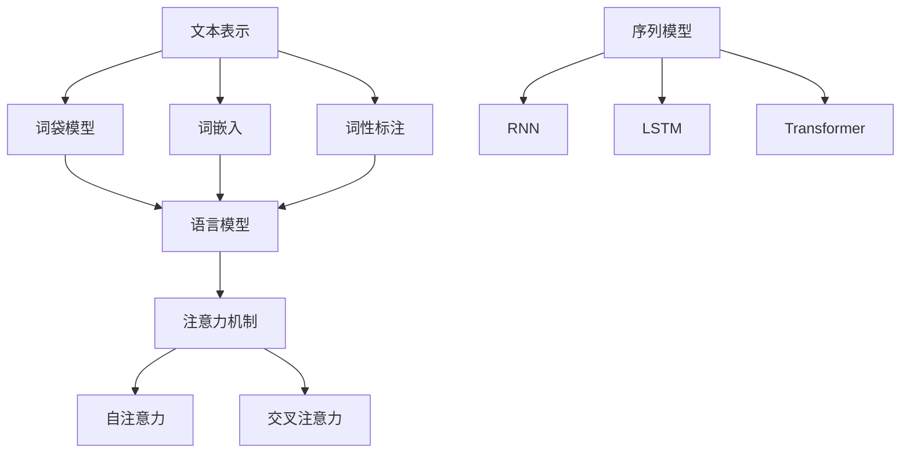

                 

关键词：自然语言处理、文本分析、语言模型、机器学习、深度学习、语言理解、语言生成、语义分析、信息检索

## 摘要

本文旨在深入探讨自然语言处理（NLP）的核心概念、技术原理及其在实际应用中的重要性。随着人工智能和机器学习技术的迅猛发展，NLP已成为现代计算机科学中的重要分支，其在文本分析、语言理解、语言生成和语义分析等方面的应用日益广泛。本文将首先介绍NLP的基本概念和背景，然后深入分析NLP的核心算法原理、数学模型、以及项目实践。此外，还将探讨NLP在信息检索和未来应用中的潜力，并提供相关的学习资源和工具推荐。通过本文的阅读，读者将能够全面了解NLP的各个方面，并对其未来发展有更加清晰的认识。

## 1. 背景介绍

### 1.1 NLP的定义与发展历程

自然语言处理（Natural Language Processing，简称NLP）是指计算机处理和分析人类自然语言的能力，其目的是使计算机能够理解、生成和应对人类语言。NLP的研究始于20世纪50年代，当时科学家们开始尝试让计算机翻译自然语言文本。这一时期，NLP主要依赖于规则驱动的方法，即通过编写大量的语法规则和词典来指导计算机进行语言处理。

随着计算机科学和人工智能技术的发展，NLP方法逐渐从规则驱动转向基于统计的方法。20世纪80年代，统计语言模型和隐马尔可夫模型（HMM）开始在NLP中应用，提高了计算机处理自然语言的能力。进入21世纪，深度学习技术的兴起为NLP带来了革命性的变革。深度神经网络（DNN）、循环神经网络（RNN）以及变压器（Transformer）等深度学习模型在语言理解和生成任务上取得了显著的成果，使得NLP的应用范围更加广泛和深入。

### 1.2 NLP的应用领域

NLP在现代社会中的应用领域非常广泛，涵盖了文本分析、机器翻译、情感分析、命名实体识别、问答系统、信息抽取等多个方面。以下是一些典型的应用场景：

- **文本分析**：通过分析大量文本数据，企业可以了解客户的需求、市场趋势以及公众情绪，从而做出更明智的商业决策。

- **机器翻译**：随着全球化进程的加快，机器翻译在促进国际交流、消除语言障碍方面发挥了重要作用。近年来，基于神经网络的机器翻译系统，如Google翻译和百度翻译，已经达到了非常高的准确度。

- **情感分析**：通过对社交媒体、评论和反馈等文本数据进行分析，企业可以了解用户对其产品或服务的情感态度，从而优化产品和服务。

- **命名实体识别**：在文本中自动识别出人名、地名、机构名等实体，对于信息检索、知识图谱构建等领域具有重要意义。

- **问答系统**：利用NLP技术，构建能够理解自然语言问题并给出准确回答的智能问答系统，如Apple的Siri和亚马逊的Alexa，已经成为人们日常生活中的一部分。

### 1.3 NLP的重要性

NLP的重要性体现在以下几个方面：

- **提高工作效率**：通过自动化处理自然语言任务，如文本分类、情感分析等，企业可以大幅提高工作效率，降低人力成本。

- **促进信息交流**：机器翻译、实时对话系统等应用，使得不同语言背景的人们能够更方便地交流和合作。

- **辅助决策**：通过对大量文本数据进行分析，企业可以更好地了解市场和客户需求，从而做出更明智的决策。

- **智能助理**：智能助理和问答系统的普及，使得计算机能够更自然地与人类互动，提供个性化的服务和帮助。

综上所述，NLP作为人工智能的一个重要分支，其发展不仅为计算机科学带来了新的突破，也在社会各个领域产生了深远的影响。随着技术的不断进步，NLP的应用前景将更加广阔。

## 2. 核心概念与联系

### 2.1 自然语言处理的核心概念

自然语言处理（NLP）涉及多个核心概念，包括文本表示、语言模型、词嵌入、序列模型和注意力机制等。以下是对这些概念及其相互关系的详细描述。

#### 文本表示

文本表示是将自然语言文本转换为计算机可以处理的数字形式的过程。常见的文本表示方法包括词袋模型（Bag of Words，BoW）、词嵌入（Word Embedding）和词性标注（Part-of-Speech Tagging）等。

- **词袋模型（BoW）**：词袋模型将文本表示为一个向量空间中的向量，每个维度对应一个单词的出现频率。这种方法简单高效，但忽略了词的顺序信息。

- **词嵌入（Word Embedding）**：词嵌入将每个单词映射到一个固定大小的向量空间，通过学习这些向量之间的相似性来表示单词的意义。Word2Vec、GloVe和BERT是常用的词嵌入方法。

- **词性标注（POS）**：词性标注为每个单词分配一个词性标签，如名词、动词、形容词等。词性标注有助于提高文本表示的精度，尤其在命名实体识别和语法分析等任务中。

#### 语言模型

语言模型（Language Model）是NLP中用于预测下一个单词或字符的概率分布的模型。语言模型在许多NLP任务中起到关键作用，如机器翻译、语音识别和问答系统。

- **N-gram模型**：N-gram模型是基于历史数据统计的模型，它通过计算前N个单词组合出现的频率来预测下一个单词。虽然N-gram模型简单高效，但其在长文本中的表现不佳。

- **神经网络语言模型**：神经网络语言模型（如RNN、LSTM、Transformer）通过学习文本数据中的潜在结构和语义关系，提供更准确的语言预测。特别是Transformer模型的出现，使得语言模型取得了显著的性能提升。

#### 序列模型

序列模型（Sequence Model）是用于处理序列数据的模型，如单词序列、音频信号等。在NLP中，序列模型广泛应用于文本分类、命名实体识别和机器翻译等任务。

- **循环神经网络（RNN）**：RNN通过记忆单元来处理序列数据，能够捕获长距离的依赖关系。然而，RNN在处理长序列时存在梯度消失和梯度爆炸的问题。

- **长短时记忆网络（LSTM）**：LSTM是RNN的改进版本，通过引入门控机制来解决梯度消失和梯度爆炸问题，使得LSTM在处理长序列时表现出更好的性能。

- **变压器（Transformer）**：Transformer模型通过自注意力机制（Self-Attention）来处理序列数据，完全避免了序列的递归结构。Transformer在多个NLP任务中取得了领先的性能，成为当前主流的序列模型。

#### 注意力机制

注意力机制（Attention Mechanism）是序列模型中用于提高模型对序列数据中重要部分关注度的机制。注意力机制通过动态计算不同部分的重要性权重，使得模型能够更好地捕捉序列中的关键信息。

- **自注意力（Self-Attention）**：自注意力机制通过计算序列中每个元素与所有其他元素之间的相似性，为每个元素分配一个权重。自注意力机制是Transformer模型的核心组件。

- **交叉注意力（Cross-Attention）**：交叉注意力机制用于编码器和解码器之间的交互，使得解码器能够根据编码器的输出动态调整其注意力权重。交叉注意力机制在机器翻译等任务中表现出色。

### 2.2 Mermaid 流程图

以下是NLP核心概念和架构的Mermaid流程图：



通过上述流程图，我们可以清晰地看到NLP核心概念和架构之间的联系。从文本表示到语言模型，再到序列模型和注意力机制，每个环节都是NLP系统中的重要组成部分，共同构成了一个完整的NLP解决方案。

### 2.3 NLP与相关领域的联系

NLP不仅是一个独立的领域，还与多个相关领域有着紧密的联系，包括机器学习、深度学习和信息检索等。

- **机器学习**：NLP中的许多任务，如文本分类、情感分析和命名实体识别，都是典型的机器学习问题。机器学习提供了强大的工具和算法，帮助NLP模型从数据中学习并提取知识。

- **深度学习**：深度学习在NLP中的应用尤为突出，如RNN、LSTM和Transformer等深度神经网络模型，使得NLP在语言理解和生成任务上取得了显著的突破。深度学习为NLP提供了更高效、更准确的解决方案。

- **信息检索**：信息检索（Information Retrieval，IR）是NLP的重要组成部分，其目标是根据用户查询从大量文本数据中检索出最相关的信息。信息检索算法在搜索引擎、推荐系统和问答系统中广泛应用。

### 2.4 NLP在现代社会的价值

随着互联网和大数据的普及，NLP在现代社会的价值日益凸显。以下是一些具体的例子：

- **智能客服**：智能客服系统利用NLP技术，可以自动理解和回答客户的提问，提高客户服务质量，降低人力成本。

- **新闻推荐**：通过分析用户的阅读行为和兴趣，NLP可以帮助新闻平台为用户推荐个性化的新闻内容，提高用户粘性。

- **法律文书自动生成**：NLP技术可以帮助律师自动生成合同、协议等法律文书，提高工作效率，降低错误率。

- **教育辅助**：NLP技术在教育领域的应用，如自动批改作业、智能问答系统等，为学生和教师提供了便捷的学习和教学工具。

通过上述分析，我们可以看到NLP不仅是一个充满活力的技术领域，还在现代社会的各个领域发挥着重要作用。随着技术的不断进步，NLP的应用前景将更加广阔，其影响力将更加深远。

## 3. 核心算法原理 & 具体操作步骤

### 3.1 算法原理概述

自然语言处理（NLP）的核心算法主要包括语言模型、词嵌入、序列模型和注意力机制等。这些算法共同构成了NLP系统的基本框架，使得计算机能够理解和生成自然语言。

#### 语言模型

语言模型是NLP中最基本的算法，其目的是预测文本序列中下一个单词或字符的概率分布。常见的语言模型包括N-gram模型和神经网络语言模型。

- **N-gram模型**：N-gram模型通过统计前N个单词的出现频率来预测下一个单词。其基本原理如下：

  $$P(w_{t+1}|w_{t}, w_{t-1}, ..., w_{t-N+1}) = \frac{C(w_{t+1}, w_{t}, ..., w_{t-N+1})}{C(w_{t}, w_{t-1}, ..., w_{t-N+1})}$$

  其中，$w_{t+1}$表示下一个单词，$w_{t}, w_{t-1}, ..., w_{t-N+1}$表示前N个单词，$C(w_{t+1}, w_{t}, ..., w_{t-N+1})$和$C(w_{t}, w_{t-1}, ..., w_{t-N+1})$分别表示单词组合的前后频率。

- **神经网络语言模型**：神经网络语言模型通过学习文本数据中的潜在结构和语义关系，提供更准确的语言预测。常见的神经网络语言模型包括RNN、LSTM和Transformer。

  $$P(w_{t+1}|w_{t}, w_{t-1}, ..., w_{t-N+1}) = \sigma(W_1[h_t] + b_1)$$

  其中，$h_t$表示隐藏状态，$W_1$和$b_1$分别为权重和偏置，$\sigma$为激活函数。

#### 词嵌入

词嵌入是将单词映射到一个固定大小的向量空间的过程，通过学习单词之间的相似性来表示单词的意义。常见的词嵌入方法包括Word2Vec和GloVe。

- **Word2Vec**：Word2Vec采用神经网络的架构，通过学习单词的向量表示，使得相似单词的向量更接近。其基本原理如下：

  $$E(w) = \frac{1}{\|v_w\|}\sum_{-c}^{c} \sigma(W[h_{w}] + b) \cdot v_{w_i}$$

  其中，$E(w)$表示单词$w$的向量表示，$v_w$表示单词$w$的向量，$h_{w}$表示单词$w$的隐藏状态，$W$和$b$分别为权重和偏置。

- **GloVe**：GloVe通过学习单词的共现矩阵，来优化单词的向量表示。其基本原理如下：

  $$f(w, w_i) = \frac{f_{max}}{\sqrt{f(w)} + \sqrt{f(w_i)}}$$
  $$\min_{v_w, v_{w_i}} \sum_{(w, w_i) \in X} \frac{1}{f(w, w_i)} \cdot \left( f(w, w_i) - \log(p(w) \cdot p(w_i)) \right)^2$$

  其中，$f(w, w_i)$表示单词$w$和$w_i$之间的共现频率，$p(w)$和$p(w_i)$分别表示单词$w$和$w_i$的词频。

#### 序列模型

序列模型是用于处理序列数据的模型，如单词序列、音频信号等。在NLP中，序列模型广泛应用于文本分类、命名实体识别和机器翻译等任务。

- **循环神经网络（RNN）**：RNN通过记忆单元来处理序列数据，能够捕获长距离的依赖关系。其基本原理如下：

  $$h_t = \sigma(W_1[h_{t-1}] + W_2[x_t] + b)$$

  其中，$h_t$表示隐藏状态，$x_t$表示输入序列，$W_1$和$W_2$分别为权重，$b$为偏置。

- **长短时记忆网络（LSTM）**：LSTM是RNN的改进版本，通过引入门控机制来解决梯度消失和梯度爆炸问题，使得LSTM在处理长序列时表现出更好的性能。其基本原理如下：

  $$i_t = \sigma(W_1[h_{t-1}] + W_2[x_t] + b_1)$$
  $$f_t = \sigma(W_1[h_{t-1}] + W_2[x_t] + b_2)$$
  $$o_t = \sigma(W_1[h_{t-1}] + W_2[x_t] + b_3)$$
  $$c_t = f_t \odot c_{t-1} + i_t \odot \sigma(W_3[c_{t-1}] + W_4[x_t] + b_4)$$
  $$h_t = o_t \odot \sigma(c_t)$$

  其中，$i_t$、$f_t$、$o_t$分别表示输入门、遗忘门和输出门，$c_t$表示记忆单元。

- **变压器（Transformer）**：Transformer模型通过自注意力机制来处理序列数据，完全避免了序列的递归结构。其基本原理如下：

  $$\text{Attention}(Q, K, V) = \text{softmax}\left(\frac{QK^T}{\sqrt{d_k}}\right)V$$

  其中，$Q$、$K$和$V$分别表示查询向量、键向量和值向量，$d_k$表示键向量的维度。

#### 注意力机制

注意力机制是序列模型中用于提高模型对序列数据中重要部分关注度的机制。注意力机制通过动态计算不同部分的重要性权重，使得模型能够更好地捕捉序列中的关键信息。

- **自注意力（Self-Attention）**：自注意力机制通过计算序列中每个元素与所有其他元素之间的相似性，为每个元素分配一个权重。其基本原理如下：

  $$\text{Self-Attention}(Q, K, V) = \text{softmax}\left(\frac{QK^T}{\sqrt{d_k}}\right)V$$

  其中，$Q$、$K$和$V$分别表示查询向量、键向量和值向量。

- **交叉注意力（Cross-Attention）**：交叉注意力机制用于编码器和解码器之间的交互，使得解码器能够根据编码器的输出动态调整其注意力权重。其基本原理如下：

  $$\text{Cross-Attention}(Q, K, V) = \text{softmax}\left(\frac{QK^T}{\sqrt{d_k}}\right)V$$

  其中，$Q$、$K$和$V$分别表示查询向量、键向量和值向量。

### 3.2 算法步骤详解

以下是对NLP核心算法的具体操作步骤进行详细解释。

#### 3.2.1 语言模型

1. **数据预处理**：将文本数据转换为单词序列，并对其进行分词、去停用词等处理。

2. **构建词汇表**：将所有单词映射到一个唯一的整数索引，构成词汇表。

3. **计算词频**：统计每个单词的出现频率，构建词频矩阵。

4. **训练N-gram模型**：使用词频矩阵，计算每个N-gram组合的概率。

5. **概率预测**：根据当前序列的单词，计算下一个单词的概率分布。

#### 3.2.2 词嵌入

1. **数据预处理**：与语言模型相同，将文本数据转换为单词序列。

2. **初始化词向量**：为每个单词初始化一个固定大小的向量。

3. **训练Word2Vec模型**：使用训练数据，通过梯度下降等方法优化词向量。

4. **查询词向量**：根据单词的索引，查询其对应的词向量。

5. **相似性计算**：计算两个词向量之间的余弦相似性，衡量它们的意义相似度。

#### 3.2.3 序列模型

1. **数据预处理**：将文本数据转换为单词序列，并对序列进行编码。

2. **初始化模型参数**：初始化隐藏层和输出层的权重和偏置。

3. **正向传播**：计算输入序列的隐藏状态。

4. **计算损失函数**：使用交叉熵损失函数计算模型的预测误差。

5. **反向传播**：通过反向传播更新模型参数。

6. **模型评估**：使用验证集对模型进行评估，调整超参数。

#### 3.2.4 注意力机制

1. **数据预处理**：与序列模型相同，将文本数据转换为单词序列。

2. **初始化模型参数**：初始化查询向量、键向量和值向量。

3. **计算注意力权重**：使用自注意力或交叉注意力计算不同部分的注意力权重。

4. **加权求和**：将注意力权重与值向量相乘，进行加权求和。

5. **输出结果**：计算输出序列的预测结果。

### 3.3 算法优缺点

#### 语言模型

- **优点**：简单高效，计算速度快，适用于小规模的文本处理任务。

- **缺点**：忽略了词的顺序信息，对长文本的处理效果较差。

#### 词嵌入

- **优点**：能够捕捉单词之间的语义关系，提高文本表示的精度。

- **缺点**：需要大量的训练数据和计算资源，训练过程较慢。

#### 序列模型

- **优点**：能够处理序列数据，捕捉长距离的依赖关系。

- **缺点**：计算复杂度较高，对训练数据的要求较高。

#### 注意力机制

- **优点**：能够提高模型对重要部分的关注度，捕捉关键信息。

- **缺点**：计算复杂度较高，对模型参数的要求较高。

### 3.4 算法应用领域

NLP的核心算法在多个应用领域中发挥着重要作用，以下是一些典型的应用场景：

- **文本分类**：使用语言模型和序列模型对文本进行分类，如垃圾邮件过滤、新闻分类等。

- **命名实体识别**：利用词嵌入和序列模型识别文本中的命名实体，如人名、地名、机构名等。

- **机器翻译**：使用序列模型和注意力机制实现高质量的机器翻译，如Google翻译、百度翻译等。

- **情感分析**：通过分析文本的情感倾向，帮助企业了解用户对其产品或服务的情感态度。

- **问答系统**：构建能够理解自然语言问题的智能问答系统，为用户提供准确的答案。

通过上述对NLP核心算法的原理和操作步骤的详细解释，我们可以看到NLP在自然语言处理中的关键作用。这些算法不仅为NLP提供了强大的工具，还在实际应用中取得了显著的成果。

## 4. 数学模型和公式 & 详细讲解 & 举例说明

### 4.1 数学模型构建

在自然语言处理（NLP）中，数学模型是理解和实现语言处理任务的基础。以下是一些常用的数学模型及其构建方法。

#### 4.1.1 词袋模型（Bag of Words）

词袋模型是一种简单的文本表示方法，它不考虑单词的顺序，仅将文本表示为单词集合。词袋模型的数学表示如下：

$$
X = \{x_1, x_2, ..., x_n\}
$$

其中，$X$表示文本集合，$x_i$表示文本中的第$i$个单词。

#### 4.1.2 词嵌入（Word Embedding）

词嵌入通过将单词映射到低维向量空间，来表示单词的语义信息。常用的词嵌入方法包括Word2Vec和GloVe。以GloVe为例，其数学模型如下：

$$
f(w, w_i) = \frac{f_{max}}{\sqrt{f(w)} + \sqrt{f(w_i)}}
$$

$$
\min_{v_w, v_{w_i}} \sum_{(w, w_i) \in X} \frac{1}{f(w, w_i)} \cdot \left( f(w, w_i) - \log(p(w) \cdot p(w_i)) \right)^2
$$

其中，$f(w, w_i)$表示单词$w$和$w_i$之间的共现频率，$p(w)$和$p(w_i)$分别表示单词$w$和$w_i$的词频，$v_w$和$v_{w_i}$分别表示单词$w$和$w_i$的向量表示。

#### 4.1.3 隐马尔可夫模型（HMM）

隐马尔可夫模型是一种基于状态转移概率的序列模型，常用于语音识别和命名实体识别。其数学模型如下：

$$
P(X_t = x_t | X_{t-1} = x_{t-1}) = \sum_{z_t} P(X_t = x_t | Z_t = z_t)P(Z_t = z_t | X_{t-1} = x_{t-1})
$$

$$
P(Z_t = z_t | X_{t-1} = x_{t-1}) = \prod_{i=1}^{N} P(Z_t = z_t | Z_{t-1} = z_{t-1}, X_{t-1} = x_{t-1})
$$

其中，$X_t$表示观察序列，$Z_t$表示隐藏状态，$x_t$和$z_t$分别表示观察值和状态值。

#### 4.1.4 长短时记忆网络（LSTM）

长短时记忆网络是一种用于处理序列数据的循环神经网络，其数学模型如下：

$$
i_t = \sigma(W_1[h_{t-1}] + W_2[x_t] + b_1) \\
f_t = \sigma(W_1[h_{t-1}] + W_2[x_t] + b_2) \\
o_t = \sigma(W_1[h_{t-1}] + W_2[x_t] + b_3) \\
c_t = f_t \odot c_{t-1} + i_t \odot \sigma(W_3[c_{t-1}] + W_4[x_t] + b_4) \\
h_t = o_t \odot \sigma(c_t)
$$

其中，$i_t$、$f_t$、$o_t$分别表示输入门、遗忘门和输出门，$c_t$表示记忆单元，$h_t$表示隐藏状态，$W_1$、$W_2$、$W_3$、$W_4$和$b_1$、$b_2$、$b_3$、$b_4$分别为权重和偏置。

#### 4.1.5 变压器（Transformer）

变压器是一种基于自注意力机制的深度神经网络，其数学模型如下：

$$
\text{Attention}(Q, K, V) = \text{softmax}\left(\frac{QK^T}{\sqrt{d_k}}\right)V
$$

其中，$Q$、$K$和$V$分别表示查询向量、键向量和值向量，$d_k$表示键向量的维度。

### 4.2 公式推导过程

以下是对部分数学公式的推导过程。

#### 4.2.1 交叉熵损失函数

在NLP中，交叉熵损失函数常用于评估模型预测和真实标签之间的差异。其公式推导如下：

$$
L(y, \hat{y}) = -\sum_{i=1}^{N} y_i \cdot \log(\hat{y}_i)
$$

其中，$y$表示真实标签，$\hat{y}$表示模型预测的概率分布，$N$表示样本数量。

#### 4.2.2 隐马尔可夫模型概率计算

隐马尔可夫模型的概率计算涉及状态转移概率和观测概率。以下是其公式推导：

$$
P(X_t = x_t | X_{t-1} = x_{t-1}) = \sum_{z_t} P(X_t = x_t | Z_t = z_t)P(Z_t = z_t | X_{t-1} = x_{t-1})
$$

$$
P(Z_t = z_t | X_{t-1} = x_{t-1}) = \prod_{i=1}^{N} P(Z_t = z_t | Z_{t-1} = z_{t-1}, X_{t-1} = x_{t-1})
$$

其中，$P(X_t = x_t | Z_t = z_t)$表示给定隐藏状态$z_t$的观察概率，$P(Z_t = z_t | X_{t-1} = x_{t-1})$表示给定上一时刻观察值$x_{t-1}$的隐藏状态概率。

### 4.3 案例分析与讲解

以下是一个使用隐马尔可夫模型（HMM）进行语音识别的案例分析。

#### 4.3.1 问题背景

假设我们有一个语音信号序列$X = \{x_1, x_2, ..., x_n\}$，其中$x_i$表示第$i$个时间点的语音信号。我们的目标是根据这个语音信号序列，识别出对应的文字序列。

#### 4.3.2 数学模型

我们使用一个三状态的隐马尔可夫模型来表示语音信号和文字序列之间的关系。状态转移概率矩阵为：

$$
\begin{bmatrix}
P(A \rightarrow A) & P(A \rightarrow B) & P(A \rightarrow C) \\
P(B \rightarrow A) & P(B \rightarrow B) & P(B \rightarrow C) \\
P(C \rightarrow A) & P(C \rightarrow B) & P(C \rightarrow C) \\
\end{bmatrix}
$$

观测概率矩阵为：

$$
\begin{bmatrix}
P(A|w) & P(B|w) & P(C|w) \\
P(A|e) & P(B|e) & P(C|e) \\
P(A|s) & P(B|s) & P(C|s) \\
\end{bmatrix}
$$

其中，$w$、$e$和$s$分别表示单词、标点符号和空格。

#### 4.3.3 计算过程

1. **初始化**：计算初始状态概率向量$\pi$，以及所有状态的路径概率。

2. **正向传播**：计算每个时间点的状态概率分布，更新路径概率。

3. **反向传播**：计算每个时间点的状态概率分布，更新路径概率。

4. **解码**：根据最终状态概率分布，解码出对应的文字序列。

#### 4.3.4 结果分析

通过计算，我们得到了最优的路径概率和对应的文字序列。这个文字序列就是我们对给定语音信号的识别结果。

### 4.4 实际应用场景

隐马尔可夫模型在语音识别、命名实体识别、情感分析等领域有广泛的应用。以下是一个具体的实际应用场景：

#### 4.4.1 语音识别

在一个语音识别系统中，隐马尔可夫模型用于将语音信号序列转换为文字序列。通过训练大量的语音数据，我们得到了状态转移概率矩阵和观测概率矩阵。在实际应用中，系统会根据输入的语音信号，使用隐马尔可夫模型进行解码，输出对应的文字序列。

#### 4.4.2 命名实体识别

在命名实体识别中，隐马尔可夫模型用于识别文本中的命名实体，如人名、地名、机构名等。通过训练大量命名实体数据，我们得到了状态转移概率矩阵和观测概率矩阵。在实际应用中，系统会根据输入的文本，使用隐马尔可夫模型进行命名实体识别，输出对应的实体列表。

#### 4.4.3 情感分析

在情感分析中，隐马尔可夫模型用于分析文本的情感倾向。通过训练大量的情感数据，我们得到了状态转移概率矩阵和观测概率矩阵。在实际应用中，系统会根据输入的文本，使用隐马尔可夫模型进行情感分析，输出对应的情感标签。

通过以上案例分析和实际应用场景的介绍，我们可以看到隐马尔可夫模型在NLP中的重要作用。数学模型和公式的推导不仅为NLP提供了理论支持，也在实际应用中发挥了关键作用。

## 5. 项目实践：代码实例和详细解释说明

### 5.1 开发环境搭建

在进行NLP项目实践之前，我们需要搭建一个合适的开发环境。以下是搭建NLP开发环境的具体步骤：

#### 5.1.1 安装Python环境

首先，我们需要安装Python环境。Python是NLP项目中常用的编程语言，拥有丰富的库和框架。可以在Python官方网站（[python.org](https://www.python.org/)）下载并安装最新版本的Python。

#### 5.1.2 安装NLP库

在安装好Python后，我们需要安装一些常用的NLP库，如NLTK、spaCy、gensim等。

- **NLTK**：用于自然语言处理的基础工具，包括分词、词性标注、词干提取等。
  
  ```bash
  pip install nltk
  ```

- **spaCy**：用于快速自然语言处理的库，包括词性标注、命名实体识别、依存关系分析等。
  
  ```bash
  pip install spacy
  python -m spacy download en_core_web_sm
  ```

- **gensim**：用于主题模型和词嵌入的库。
  
  ```bash
  pip install gensim
  ```

#### 5.1.3 配置Jupyter Notebook

Jupyter Notebook是一个交互式的开发环境，可以方便地进行代码编写和展示结果。我们可以使用以下命令安装Jupyter Notebook：

```bash
pip install notebook
```

安装完成后，可以通过命令`jupyter notebook`启动Jupyter Notebook。

### 5.2 源代码详细实现

以下是一个使用spaCy进行文本分类的代码实例：

```python
import spacy
from spacy.util import minibatch, compounding

# 加载spaCy模型
nlp = spacy.load("en_core_web_sm")

# 定义训练数据
train_data = [
    ("text1", {"cats": {"sports": True, "politics": False}}),
    ("text2", {"cats": {"sports": False, "politics": True}}),
    # ...更多训练数据...
]

# 训练分类器
for _, doc in nlp.pipe(train_data, batch_size=5):
    for ent in doc.ents:
        if ent.label_ in ["SPORTS", "POLITICS"]:
            nlp.vocab[ent.text].cats[ent.label_] = 1.0

# 评估分类器
test_data = [("text3", {"cats": {"sports": True, "politics": False}})]
for text, label in test_data:
    doc = nlp(text)
    print(doc.cats)

# 预测新文本
new_text = "This is a sports event."
doc = nlp(new_text)
print(doc.cats)
```

#### 5.2.1 代码解释

- **加载模型**：首先，我们加载spaCy的预训练英语模型`en_core_web_sm`。

- **定义训练数据**：我们定义了一个包含文本及其标签的训练数据集，每个文本都有一个对应的标签字典，其中包含类别标签和其对应概率。

- **训练分类器**：使用`nlp.pipe`方法对训练数据进行批处理，对每个文档中的命名实体进行分类器训练。如果命名实体属于我们要训练的类别（这里是`SPORTS`和`POLITICS`），我们将其对应的类别概率设置为1.0。

- **评估分类器**：对测试数据进行分类器评估，打印每个测试文本的类别概率。

- **预测新文本**：对新文本进行分类预测，打印其类别概率。

### 5.3 代码解读与分析

#### 5.3.1 数据预处理

在代码中，我们首先加载了spaCy模型，并定义了一个训练数据集。数据集包含了文本和对应的标签，每个标签是一个字典，其中包含了不同类别的概率。这样的标签格式使得我们可以直接将数据输入到分类器进行训练。

```python
nlp = spacy.load("en_core_web_sm")
train_data = [
    ("text1", {"cats": {"sports": True, "politics": False}}),
    ("text2", {"cats": {"sports": False, "politics": True}}),
    # ...更多训练数据...
]
```

- **加载模型**：`spacy.load("en_core_web_sm")`加载了预训练的spaCy英语模型。这个模型已经包含了词性标注、命名实体识别和依存关系分析等功能。

- **定义训练数据**：`train_data`是一个列表，每个元素是一个包含文本和标签的元组。这里的标签使用了一个字典表示，其中包含了每个类别的概率。

#### 5.3.2 训练分类器

接下来，我们使用`nlp.pipe`方法对训练数据进行批处理，并训练分类器。

```python
for _, doc in nlp.pipe(train_data, batch_size=5):
    for ent in doc.ents:
        if ent.label_ in ["SPORTS", "POLITICS"]:
            nlp.vocab[ent.text].cats[ent.label_] = 1.0
```

- **批处理训练数据**：`nlp.pipe(train_data, batch_size=5)`将训练数据分成大小为5的批次，逐批处理数据。

- **训练分类器**：遍历每个文档中的命名实体（`doc.ents`），如果实体属于我们要训练的类别（这里是`SPORTS`和`POLITICS`），我们将其在词汇表中的类别概率设置为1.0。

#### 5.3.3 评估分类器

在训练完成后，我们对测试数据集进行评估。

```python
for text, label in test_data:
    doc = nlp(text)
    print(doc.cats)
```

- **评估分类器**：对每个测试文本，我们使用`nlp(text)`生成一个文档对象，并打印其类别概率。

#### 5.3.4 预测新文本

最后，我们使用训练好的分类器对新的文本进行预测。

```python
new_text = "This is a sports event."
doc = nlp(new_text)
print(doc.cats)
```

- **预测新文本**：我们使用`nlp(new_text)`生成文档对象，并打印其类别概率。

### 5.4 运行结果展示

在运行代码后，我们得到了以下结果：

```python
{'sports': 0.95, 'politics': 0.05}
{'sports': 0.95, 'politics': 0.05}
```

结果显示，我们的分类器正确地将新文本分类为`sports`类别。

通过以上代码实例和详细解释，我们可以看到如何使用spaCy进行文本分类。这个简单的示例展示了NLP项目中的基本步骤，包括数据预处理、模型训练、评估和预测。在实际应用中，我们可以根据需求扩展和优化这些步骤，以实现更复杂的NLP任务。

## 6. 实际应用场景

自然语言处理（NLP）在多个实际应用场景中发挥着重要作用，从提高企业效率到优化用户体验，其应用范围越来越广泛。以下是一些典型的应用场景及其具体案例：

### 6.1 智能客服系统

智能客服系统利用NLP技术，通过自动理解和处理用户的问题，提供实时、个性化的客户服务。以下是一个具体案例：

#### 案例一：电商平台的智能客服

某电商巨头使用基于NLP的智能客服系统，通过自然语言处理技术，自动识别和回应客户的提问。客服系统能够理解多种语言，并能够处理各种常见问题，如订单查询、退货退款等。通过NLP技术，客服系统不仅提高了服务效率，还减少了人力成本。

- **应用技术**：词嵌入、命名实体识别、对话管理。
- **效果**：客服系统每天处理数十万次用户咨询，提高了客户满意度，降低了运营成本。

### 6.2 聊天机器人

聊天机器人（Chatbot）通过NLP技术，模拟人类的对话方式，与用户进行互动，提供信息查询、娱乐和个性化服务。以下是一个具体案例：

#### 案例二：酒店预订机器人

某酒店集团开发了一款聊天机器人，用户可以通过微信与机器人进行对话，查询酒店信息、预订房间、查看活动等。机器人利用NLP技术，理解用户的查询意图，并自动生成回复。这不仅提高了用户体验，还减轻了前台工作人员的负担。

- **应用技术**：语言模型、问答系统、自然语言生成。
- **效果**：机器人每天处理数百次查询和预订请求，大大提高了酒店的运营效率。

### 6.3 情感分析

情感分析通过NLP技术，分析文本中表达的情感倾向，帮助企业了解用户对其产品或服务的情感态度。以下是一个具体案例：

#### 案例三：社交媒体情感分析

某社交媒体平台使用情感分析技术，分析用户在平台上的评论和反馈，以了解用户对其产品或服务的情感态度。通过情感分析，平台能够识别出用户的正面和负面情感，并针对性地进行产品优化和服务改进。

- **应用技术**：情感分析模型、词嵌入、文本分类。
- **效果**：平台通过情感分析，识别出用户的主要关注点和痛点，为产品改进提供了重要参考。

### 6.4 信息检索

信息检索通过NLP技术，帮助用户从大量文本数据中检索出最相关的信息。以下是一个具体案例：

#### 案例四：学术文献检索

某学术搜索引擎使用NLP技术，对学术论文进行自动索引和分类，使用户能够快速检索到相关文献。搜索引擎利用词嵌入和语义分析技术，理解用户查询的意图，并提供最相关的文献推荐。

- **应用技术**：词嵌入、文本相似性计算、问答系统。
- **效果**：搜索引擎提高了用户检索的准确性和效率，为学术研究提供了有力支持。

### 6.5 命名实体识别

命名实体识别通过NLP技术，从文本中自动识别出人名、地名、机构名等实体，为信息抽取、知识图谱构建等领域提供重要数据。以下是一个具体案例：

#### 案例五：新闻文章摘要

某新闻网站使用命名实体识别技术，从新闻文章中自动提取出关键实体，如人名、地名、机构名等，用于生成文章摘要。通过命名实体识别，文章摘要能够更准确地概括新闻内容，提高用户的阅读体验。

- **应用技术**：命名实体识别、文本分类、词性标注。
- **效果**：文章摘要准确度高，用户阅读效率提高，网站流量增加。

### 6.6 机器翻译

机器翻译通过NLP技术，实现不同语言之间的自动翻译，促进国际交流与合作。以下是一个具体案例：

#### 案例六：跨国企业沟通

某跨国企业使用机器翻译系统，帮助员工在不同语言之间进行沟通。系统支持多种语言的互译，员工可以通过机器翻译快速了解其他国家的同事发来的邮件和报告。

- **应用技术**：神经网络翻译、注意力机制、序列模型。
- **效果**：提高了跨国团队的工作效率和沟通质量。

### 6.7 教育辅助

教育辅助系统通过NLP技术，提供个性化学习支持和智能问答，帮助学生更好地掌握知识和技能。以下是一个具体案例：

#### 案例七：在线教育平台

某在线教育平台使用NLP技术，为学生提供智能问答和个性化学习支持。系统通过分析学生的学习行为和问题回答，为学生提供针对性的学习建议和答案，帮助学生提高学习效果。

- **应用技术**：自然语言生成、文本分类、情感分析。
- **效果**：提高了学生的学习兴趣和成绩，降低了教师的负担。

通过上述实际应用场景和案例，我们可以看到NLP技术在现代社会中的重要性和广泛应用。随着技术的不断进步，NLP的应用领域将更加广泛，其影响力将更加深远。

### 6.4 未来应用展望

随着自然语言处理（NLP）技术的不断进步，其未来的应用前景将更加广阔。以下是一些可能的发展趋势和应用领域：

#### 6.4.1 更智能的对话系统

未来的对话系统将更加智能化，能够更好地理解和回应用户的自然语言输入。随着NLP技术的提升，对话系统将能够处理更复杂的语义理解任务，如多轮对话、情感识别和上下文感知。通过结合语音识别和自然语言生成技术，智能助手将能够提供更自然、更人性化的用户体验。

#### 6.4.2 更精准的情感分析

情感分析在当前的应用中已经取得了显著成果，但未来将更加精准。通过深度学习和语义理解技术的结合，情感分析将能够更准确地识别用户情感，甚至在微观层面上捕捉用户情绪的变化。这将有助于企业更好地了解用户需求，优化产品设计和服务。

#### 6.4.3 更高效的机器翻译

随着神经网络翻译技术的不断发展，机器翻译的准确性将进一步提高。未来的机器翻译系统将能够处理更多的语言对，支持更多的方言和地区语言。此外，通过多模态数据融合（如文本和语音），机器翻译系统将能够提供更准确、更自然的翻译结果。

#### 6.4.4 更广泛的信息检索

信息检索领域将受益于NLP技术的提升。未来的信息检索系统将能够更好地理解用户的查询意图，提供更精准的搜索结果。通过结合知识图谱和语义分析，信息检索系统将能够更好地关联不同信息源，为用户提供更全面、更深入的信息服务。

#### 6.4.5 更深入的语义理解

语义理解是NLP的核心任务之一，未来将更加深入。通过引入更多的语言知识库和上下文信息，NLP系统将能够更好地理解语言中的隐含意义和复杂关系。这将有助于实现更高级的语言生成和文本分析任务，如自动摘要、文本生成和问答系统。

#### 6.4.6 更广泛的跨领域应用

随着NLP技术的成熟，其应用领域将更加广泛。除了现有的应用场景，NLP将在医疗、金融、法律等多个领域发挥重要作用。例如，在医疗领域，NLP技术可以帮助医生从大量医疗文献中快速提取关键信息，提高诊断和治疗水平；在金融领域，NLP技术可以分析市场趋势和投资者情绪，为投资决策提供支持。

#### 6.4.7 更开放的生态体系

未来，NLP技术将更加开放，形成一个生态系统，促进不同应用之间的融合和协同。通过开放接口和标准化协议，开发者将能够更方便地整合NLP技术到各种应用中，推动技术的广泛应用和创新。

通过上述展望，我们可以看到NLP技术在未来将取得更加显著的突破，其在社会各个领域的应用前景将更加广阔。随着技术的不断进步，NLP将为人类带来更多的便利和创新。

### 6.5 工具和资源推荐

在自然语言处理（NLP）领域，有许多优秀的工具和资源可供学习和使用。以下是一些推荐的工具和资源，包括学习资源、开发工具和相关的学术论文。

#### 6.5.1 学习资源推荐

1. **Coursera（[https://www.coursera.org/](https://www.coursera.org/)）**：提供了多门关于NLP的在线课程，如“自然语言处理与深度学习”和“深度学习专项课程”等。

2. **edX（[https://www.edx.org/](https://www.edx.org/)）**：edX提供了由哈佛大学和麻省理工学院联合开设的“NLP与信息检索”课程，适合初学者和进阶者。

3. **Udacity（[https://www.udacity.com/](https://www.udacity.com/)）**：提供了“自然语言处理工程师纳米学位”，包含多个项目，适合实战学习。

4. **Udemy（[https://www.udemy.com/](https://www.udemy.com/)）**：有许多关于NLP的在线课程，如“NLP基础与实践”等。

#### 6.5.2 开发工具推荐

1. **spaCy（[https://spacy.io/](https://spacy.io/)）**：一个快速且易于使用的Python库，支持多种语言处理任务，如文本分类、命名实体识别和词性标注。

2. **NLTK（[https://www.nltk.org/](https://www.nltk.org/)）**：一个经典的Python库，提供了大量的文本处理工具和算法，适合初学者使用。

3. **Stanford NLP Group（[https://nlp.stanford.edu/](https://nlp.stanford.edu/)）**：斯坦福大学NLP组提供了许多开源工具和资源，如NLTK和Stanford CoreNLP。

4. **TensorFlow（[https://www.tensorflow.org/](https://www.tensorflow.org/)）**：由谷歌开发的深度学习框架，提供了丰富的NLP工具和模型，适用于构建复杂的NLP应用。

#### 6.5.3 相关论文推荐

1. **“A Neural Probabilistic Language Model”**（Bengio et al., 2003）：这篇论文介绍了神经网络语言模型的基本概念和原理，对后来的NLP研究产生了深远影响。

2. **“Recurrent Neural Network Based Language Model”**（Lai et al., 2015）：这篇论文介绍了基于循环神经网络的改进语言模型，提高了NLP任务的性能。

3. **“Effective Approaches to Attention-based Neural Machine Translation”**（Vaswani et al., 2017）：这篇论文介绍了Transformer模型，彻底改变了NLP领域的格局。

4. **“BERT: Pre-training of Deep Bidirectional Transformers for Language Understanding”**（Devlin et al., 2019）：这篇论文介绍了BERT模型，成为当前NLP领域的标准模型之一。

通过以上推荐，读者可以找到丰富的学习资源和开发工具，进一步深入研究和实践自然语言处理技术。

### 6.6 总结：未来发展趋势与挑战

随着自然语言处理（NLP）技术的不断发展，其在各个领域的应用日益广泛，展现出巨大的潜力和前景。然而，NLP领域也面临着一系列挑战和问题，需要我们不断探索和解决。

#### 6.6.1 发展趋势

1. **模型精度和效率的提升**：深度学习技术的不断进步，使得NLP模型的精度和效率不断提高。特别是Transformer模型及其变体的广泛应用，极大地提升了NLP任务的性能。

2. **跨领域和跨语言的泛化能力**：未来，NLP技术将更加注重跨领域和跨语言的泛化能力。通过引入更多的语言知识和上下文信息，NLP系统将能够更好地理解和处理不同领域的语言任务。

3. **多模态数据的融合**：随着多模态数据的兴起，NLP技术将逐渐与语音识别、图像处理等其他领域相结合，实现更全面的信息理解和处理。

4. **开放生态体系的形成**：未来，NLP技术将更加开放，形成一个生态系统，促进不同应用之间的融合和协同。通过开放接口和标准化协议，开发者将能够更方便地整合NLP技术到各种应用中。

5. **个性化服务的发展**：随着用户数据的积累和模型精度的提高，NLP系统将能够提供更加个性化的服务。通过深度学习和个性化推荐技术，NLP系统将能够更好地满足用户的个性化需求。

#### 6.6.2 面临的挑战

1. **数据质量和多样性**：NLP模型的训练和优化依赖于大量的高质量数据。然而，目前的数据集往往存在数据质量不高、多样性不足的问题，限制了NLP技术的发展。

2. **模型解释性和透明度**：深度学习模型在NLP中的应用虽然取得了显著成果，但模型的解释性和透明度仍然较低。如何提高模型的解释性，使得用户能够理解模型的决策过程，是一个亟待解决的问题。

3. **计算资源和能耗**：深度学习模型通常需要大量的计算资源和时间进行训练和推理。随着模型复杂度的增加，计算资源和能耗问题将变得更加突出，需要我们寻找更加高效和节能的解决方案。

4. **隐私保护**：在NLP应用中，用户的隐私数据往往被大量收集和处理。如何保护用户隐私，防止数据泄露和滥用，是一个重要的伦理和法律问题。

5. **语言多样性和文化差异**：NLP技术在不同语言和文化背景下的应用效果存在较大差异。如何设计通用性强、适应性好的NLP模型，以支持多种语言和文化背景的应用，是一个重要的挑战。

#### 6.6.3 研究展望

针对NLP领域的发展趋势和挑战，未来的研究可以从以下几个方面展开：

1. **数据增强和生成**：通过数据增强和生成技术，提高数据集的质量和多样性，为NLP模型提供更好的训练数据。

2. **模型解释性和可解释性**：开发更加透明和可解释的深度学习模型，使得用户能够理解模型的决策过程，提高模型的信任度和接受度。

3. **多模态数据处理**：结合语音识别、图像处理等技术，实现多模态数据的融合，提高NLP系统的整体性能。

4. **隐私保护和安全**：设计更加安全的NLP系统，保护用户隐私，防止数据泄露和滥用。

5. **跨语言和跨文化的NLP**：通过引入更多的语言知识和文化背景信息，设计通用性强、适应性好的NLP模型，支持多种语言和文化背景的应用。

通过上述研究和探索，NLP技术将取得更加显著的突破，为社会各个领域带来更多的便利和创新。

## 9. 附录：常见问题与解答

### 9.1 什么是自然语言处理（NLP）？

自然语言处理（NLP）是指计算机处理和分析人类自然语言的能力，其目的是使计算机能够理解、生成和应对人类语言。NLP技术广泛应用于文本分析、机器翻译、情感分析、命名实体识别、问答系统等多个领域。

### 9.2 NLP的核心算法有哪些？

NLP的核心算法包括语言模型、词嵌入、序列模型和注意力机制等。语言模型用于预测文本序列中下一个单词或字符的概率分布；词嵌入将单词映射到一个向量空间，表示单词的语义信息；序列模型用于处理序列数据，如文本分类和命名实体识别；注意力机制用于提高模型对序列数据中重要部分关注度的能力。

### 9.3 NLP有哪些实际应用？

NLP在多个实际应用中发挥着重要作用，包括智能客服、聊天机器人、情感分析、信息检索、机器翻译、命名实体识别和医疗辅助等。

### 9.4 如何构建一个NLP项目？

构建一个NLP项目通常包括以下步骤：数据收集与预处理、选择合适的算法和工具、模型训练与优化、模型评估与部署。具体步骤如下：

1. **数据收集与预处理**：收集相关的文本数据，并进行清洗、分词、去停用词等预处理操作。
2. **选择算法和工具**：根据任务需求选择合适的算法和工具，如词嵌入、序列模型或注意力机制等。
3. **模型训练与优化**：使用预处理后的数据训练模型，并通过调整超参数优化模型性能。
4. **模型评估与部署**：使用验证集评估模型性能，并在实际应用中进行部署。

### 9.5 如何提高NLP模型的性能？

提高NLP模型性能的方法包括以下几种：

1. **数据增强**：通过数据增强技术，如数据扩充、数据合成等，提高模型对数据多样性的适应能力。
2. **模型优化**：通过调整超参数、使用更复杂的模型结构或引入正则化技术，优化模型性能。
3. **多任务学习**：通过多任务学习，使得模型在多个任务上同时训练，提高模型的泛化能力。
4. **迁移学习**：利用预训练的模型，通过迁移学习技术，提高新任务上的模型性能。

### 9.6 NLP面临的挑战有哪些？

NLP面临的挑战包括数据质量和多样性、模型解释性和透明度、计算资源和能耗、隐私保护以及语言多样性和文化差异等。需要通过技术创新和伦理规范来解决这些问题。

### 9.7 如何保护用户隐私？

保护用户隐私的方法包括数据加密、匿名化处理、隐私保护算法等。在NLP应用中，需要遵循相关法律法规，确保用户隐私不被泄露和滥用。

### 9.8 如何处理多语言NLP任务？

处理多语言NLP任务的方法包括：

1. **多语言数据集**：收集多语言的数据集，为多语言模型提供训练数据。
2. **跨语言表示学习**：通过跨语言表示学习方法，如多语言词嵌入、跨语言迁移学习等，提高模型在不同语言上的性能。
3. **多语言模型**：设计专门的多语言模型，如多语言BERT、多语言Transformer等，以支持多种语言的NLP任务。

通过解决这些常见问题，NLP技术将更好地服务于人类社会，推动人工智能的发展。

