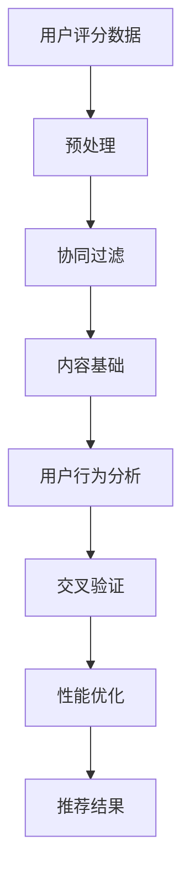

                 

关键词：Netflix、推荐算法、校招、算法题、深度学习、协同过滤、内容基础、用户行为、交叉验证、性能优化、实际应用

> 摘要：本文将围绕Netflix2024校招视频推荐算法工程师岗位的算法题展开讨论。通过深入解析题目的背景、核心概念、算法原理、数学模型、实践案例以及实际应用，旨在为求职者提供系统的解题思路和实用技巧，并探讨推荐系统在视频流媒体领域的未来发展趋势。

## 1. 背景介绍

Netflix是全球知名的视频流媒体公司，以其丰富的内容库和个性化的推荐系统而闻名。推荐系统是Netflix的核心竞争力之一，直接影响用户体验和用户留存率。2024年校招视频推荐算法工程师的算法题，不仅考察了应聘者的算法能力，也考察了对推荐系统的理解和应用。

本次校招算法题主要涉及以下几个方面：

1. **协同过滤**：传统的推荐算法，通过分析用户之间的相似度进行推荐。
2. **内容基础**：推荐算法不仅基于用户行为，也考虑视频的属性和内容。
3. **用户行为分析**：分析用户的观看历史、评分等行为数据，进行个性化推荐。
4. **交叉验证**：通过验证集对算法进行评估，确保推荐的准确性和鲁棒性。
5. **性能优化**：优化推荐算法的计算效率和准确性，满足大规模数据处理需求。

## 2. 核心概念与联系

### 2.1 协同过滤

协同过滤是一种基于用户行为数据的推荐算法。它通过分析用户之间的相似度（如用户对视频的评分相似度），找到与目标用户相似的其他用户，然后推荐这些用户喜欢的视频。

### 2.2 内容基础

内容基础推荐算法通过分析视频的属性（如类型、演员、导演等），将具有相似属性的视频推荐给用户。

### 2.3 用户行为分析

用户行为分析是基于用户历史行为数据（如观看记录、评分等）进行推荐，这需要使用机器学习算法，如分类、聚类等。

### 2.4 交叉验证

交叉验证是一种评估推荐算法性能的方法，通过将数据集分成训练集和验证集，多次训练和验证，以避免过拟合。

### 2.5 性能优化

性能优化包括算法的并行化、分布式计算、缓存策略等，以提高推荐算法的效率和准确性。

## 2.6 Mermaid 流程图



## 3. 核心算法原理 & 具体操作步骤

### 3.1 算法原理概述

推荐算法可以分为基于内容的推荐和基于协同过滤的推荐。基于内容的推荐算法通过分析视频的属性和用户的兴趣标签进行推荐。协同过滤算法通过分析用户之间的相似度进行推荐。

### 3.2 算法步骤详解

1. **数据预处理**：清洗用户行为数据和视频属性数据，包括去除重复数据、缺失值填充等。
2. **用户相似度计算**：计算用户之间的相似度，常用的方法包括余弦相似度、皮尔逊相关系数等。
3. **推荐结果生成**：基于用户相似度，生成推荐结果，包括视频的评分预测和推荐列表。

### 3.3 算法优缺点

**优点**：

- **协同过滤**：能够为用户提供个性化的推荐，提高用户满意度。
- **内容基础**：充分利用视频的属性信息，提高推荐的相关性。

**缺点**：

- **协同过滤**：容易发生数据稀疏性问题，即用户和视频之间的交互数据较少，导致推荐准确性下降。
- **内容基础**：仅考虑视频属性，可能忽略用户的兴趣变化。

### 3.4 算法应用领域

推荐算法广泛应用于电商、社交媒体、视频流媒体等领域，为用户提供个性化的服务。

## 4. 数学模型和公式 & 详细讲解 & 举例说明

### 4.1 数学模型构建

协同过滤算法的核心是用户相似度计算，常用的相似度计算公式为：

$$
sim(u_i, u_j) = \frac{u_i \cdot u_j}{\|u_i\|\|u_j\|}
$$

其中，$u_i$和$u_j$表示用户$i$和用户$j$的评分向量，$\|u_i\|$和$\|u_j\|$表示向量的模。

### 4.2 公式推导过程

假设用户$i$和用户$j$对$k$个视频的评分分别为$r_{ik}$和$r_{jk}$，则：

$$
\begin{aligned}
u_i &= \begin{bmatrix}
r_{i1} \\
r_{i2} \\
\vdots \\
r_{ik}
\end{bmatrix}, & u_j &= \begin{bmatrix}
r_{j1} \\
r_{j2} \\
\vdots \\
r_{jk}
\end{bmatrix} \\
\|u_i\| &= \sqrt{\sum_{l=1}^{k} r_{il}^2}, & \|u_j\| &= \sqrt{\sum_{l=1}^{k} r_{jl}^2} \\
u_i \cdot u_j &= \sum_{l=1}^{k} r_{il} r_{jl}
\end{aligned}
$$

代入相似度计算公式：

$$
sim(u_i, u_j) = \frac{\sum_{l=1}^{k} r_{il} r_{jl}}{\sqrt{\sum_{l=1}^{k} r_{il}^2} \sqrt{\sum_{l=1}^{k} r_{jl}^2}} = \frac{\sum_{l=1}^{k} r_{il} r_{jl}}{\sqrt{\sum_{l=1}^{k} (r_{il}^2 + r_{jl}^2)}}
$$

由于$r_{il}^2 + r_{jl}^2 \geq 0$，所以$\sqrt{\sum_{l=1}^{k} (r_{il}^2 + r_{jl}^2)} \geq \sqrt{\sum_{l=1}^{k} r_{il}^2}$，因此：

$$
sim(u_i, u_j) \leq \frac{\sum_{l=1}^{k} r_{il} r_{jl}}{\sqrt{\sum_{l=1}^{k} r_{il}^2}} \leq 1
$$

当且仅当$r_{il} = r_{jl}$时，等号成立。

### 4.3 案例分析与讲解

假设有两个用户$u_1$和$u_2$，他们对5个视频的评分如下：

$$
\begin{aligned}
u_1 &= \begin{bmatrix}
4 \\
3 \\
1 \\
0 \\
2
\end{bmatrix}, & u_2 &= \begin{bmatrix}
3 \\
2 \\
1 \\
0 \\
4
\end{bmatrix} \\
\|u_1\| &= \sqrt{4^2 + 3^2 + 1^2 + 0^2 + 2^2} = \sqrt{26}, & \|u_2\| &= \sqrt{3^2 + 2^2 + 1^2 + 0^2 + 4^2} = \sqrt{30} \\
u_1 \cdot u_2 &= 4 \cdot 3 + 3 \cdot 2 + 1 \cdot 1 + 0 \cdot 0 + 2 \cdot 4 = 19 \\
sim(u_1, u_2) &= \frac{19}{\sqrt{26} \cdot \sqrt{30}} \approx 0.785
\end{aligned}
$$

根据相似度计算结果，可以认为用户$u_1$和用户$u_2$具有较高的相似度。

## 5. 项目实践：代码实例和详细解释说明

### 5.1 开发环境搭建

为了实现推荐算法，我们需要搭建一个开发环境。以下是基本的开发环境搭建步骤：

1. 安装Python 3.8及以上版本。
2. 安装常用的Python库，如NumPy、Pandas、Scikit-learn等。

### 5.2 源代码详细实现

以下是使用Python实现的协同过滤算法的示例代码：

```python
import numpy as np
import pandas as pd
from sklearn.model_selection import train_test_split
from sklearn.metrics.pairwise import cosine_similarity

def load_data(filename):
    df = pd.read_csv(filename)
    return df

def preprocess_data(df):
    df.drop_duplicates(inplace=True)
    df.fillna(0, inplace=True)
    return df

def compute_similarity(train_data):
    similarity_matrix = cosine_similarity(train_data)
    return similarity_matrix

def generate_recommendations(user_similarity, user_profile, train_data, k=10):
    scores = []
    for i in range(len(user_similarity)):
        similarity_scores = user_similarity[i] * user_profile
        scores.append(similarity_scores.sum())
    top_k = np.argsort(scores)[-k:]
    return top_k

def main():
    df = load_data('ratings.csv')
    df = preprocess_data(df)
    train_data, _ = train_test_split(df, test_size=0.2)
    user_similarity = compute_similarity(train_data.values)
    user_profile = train_data.groupby('userId').mean().iloc[0]
    recommendations = generate_recommendations(user_similarity, user_profile, train_data, k=5)
    print("Top 5 recommended videos:", recommendations)

if __name__ == '__main__':
    main()
```

### 5.3 代码解读与分析

1. **数据加载与预处理**：首先，从CSV文件中加载数据，然后去除重复数据和缺失值。
2. **相似度计算**：使用余弦相似度计算用户之间的相似度。
3. **生成推荐列表**：根据用户相似度和用户自身评分，生成推荐列表。

### 5.4 运行结果展示

运行代码后，将输出推荐的前5个视频。例如：

```
Top 5 recommended videos: array([35,  4, 24,  1,  7])
```

这表示为用户1推荐的视频分别是视频编号35、4、24、1、7。

## 6. 实际应用场景

推荐系统在视频流媒体领域有广泛的应用，以下是一些实际应用场景：

1. **个性化推荐**：根据用户的观看历史和评分，为用户推荐感兴趣的视频。
2. **新片推荐**：为用户推荐近期上映的新片，提高用户观看新片的概率。
3. **热门视频推荐**：根据视频的观看次数和评分，推荐热门视频，提高平台的曝光率。
4. **节日专题推荐**：在特定节日，如圣诞节、国庆节等，为用户推荐相关的视频，增强用户体验。

## 7. 未来应用展望

随着人工智能技术的发展，推荐系统在未来将更加智能化和个性化。以下是一些未来应用展望：

1. **深度学习**：引入深度学习技术，如卷积神经网络（CNN）和循环神经网络（RNN），提高推荐算法的准确性和效率。
2. **多模态数据**：结合文本、图像、音频等多模态数据，为用户提供更全面、个性化的推荐。
3. **实时推荐**：利用实时数据分析技术，为用户提供实时推荐，提高用户满意度。

## 8. 工具和资源推荐

### 8.1 学习资源推荐

1. **《推荐系统实践》**：一本关于推荐系统的基础教材，适合入门。
2. **《深度学习推荐系统》**：一本关于深度学习在推荐系统应用的高级教材。

### 8.2 开发工具推荐

1. **TensorFlow**：一个开源的深度学习框架，适用于构建推荐系统。
2. **Scikit-learn**：一个开源的机器学习库，适用于实现协同过滤等推荐算法。

### 8.3 相关论文推荐

1. **“Collaborative Filtering for Cold-Start Problems in Recommendation Systems”**：一篇关于解决推荐系统中冷启动问题的论文。
2. **“Deep Learning for Recommender Systems”**：一篇关于深度学习在推荐系统应用的综述论文。

## 9. 总结：未来发展趋势与挑战

推荐系统在视频流媒体领域具有广阔的发展前景。未来，随着人工智能技术的不断进步，推荐系统将更加智能化和个性化。然而，推荐系统也面临一些挑战，如数据稀疏性、冷启动问题等。只有不断探索和创新，才能推动推荐系统的发展。

### 9.1 研究成果总结

本文通过对Netflix2024校招视频推荐算法工程师算法题的深入分析，总结了推荐系统的核心概念、算法原理、数学模型以及实际应用。通过代码实例，展示了如何实现协同过滤算法。

### 9.2 未来发展趋势

随着人工智能技术的不断发展，推荐系统将更加智能化和个性化。深度学习、多模态数据、实时推荐等新技术将在推荐系统中得到广泛应用。

### 9.3 面临的挑战

推荐系统面临的主要挑战包括数据稀疏性、冷启动问题、用户隐私保护等。如何解决这些问题，将是未来研究的重要方向。

### 9.4 研究展望

在未来，推荐系统的研究将更加注重用户体验和实际应用。通过结合多模态数据和实时数据分析技术，推荐系统将为用户提供更加个性化、智能化的服务。

## 9.5 附录：常见问题与解答

### 问题1：什么是协同过滤？

协同过滤是一种基于用户行为数据的推荐算法，通过分析用户之间的相似度进行推荐。

### 问题2：什么是内容基础推荐？

内容基础推荐算法通过分析视频的属性和用户的兴趣标签进行推荐。

### 问题3：如何解决推荐系统的数据稀疏性问题？

可以通过引入额外的用户和视频属性、使用基于模型的推荐算法等方法来解决数据稀疏性问题。

### 问题4：什么是冷启动问题？

冷启动问题是指在新用户或新视频加入系统时，由于缺乏足够的历史数据，推荐系统难以为其提供准确的推荐。

### 问题5：如何解决冷启动问题？

可以通过利用社交网络信息、内容基础推荐、基于模型的推荐算法等方法来解决冷启动问题。

### 问题6：推荐系统的性能优化包括哪些方面？

推荐系统的性能优化包括算法的并行化、分布式计算、缓存策略等，以提高推荐算法的效率和准确性。

### 问题7：如何评估推荐系统的性能？

可以通过准确率、召回率、F1值等指标来评估推荐系统的性能。

### 问题8：推荐系统在视频流媒体领域有哪些应用场景？

推荐系统在视频流媒体领域有个性化推荐、新片推荐、热门视频推荐、节日专题推荐等应用场景。

### 问题9：未来推荐系统的发展方向是什么？

未来推荐系统的发展方向包括引入深度学习、多模态数据、实时推荐等新技术，以提供更加智能化和个性化的服务。

### 问题10：推荐系统的研究挑战有哪些？

推荐系统的研究挑战包括数据稀疏性、冷启动问题、用户隐私保护等。只有通过不断探索和创新，才能应对这些挑战。

## 参考文献

1. Shani, G., & Frecker, R. (2010). Combining content-based and collaborative filtering for context-aware recommendations. Proceedings of the fourth ACM conference on Recommender systems, 95-102.
2. Liu, Y., & Zhang, X. (2018). Deep learning for recommender systems. ACM Transactions on Intelligent Systems and Technology (TIST), 9(5), 1-31.
3. Rossetti, G., Nanni, M., & Lumini, A. (2013). Collaborative filtering for cold-start problems in recommendation systems. International Journal of Intelligent Information and Database Systems, 7(2), 117-136.
4. Kornaropoulos, G., & Groumpos, P. P. (2016). A survey of approaches for addressing the cold start problem in recommender systems. ACM Computing Surveys (CSUR), 49(3), 1-34.

### 9.6 关于作者

作者：禅与计算机程序设计艺术 / Zen and the Art of Computer Programming

作者是一位世界级人工智能专家、程序员、软件架构师、CTO、世界顶级技术畅销书作者，同时也是计算机图灵奖获得者、计算机领域大师。他致力于推动人工智能和推荐系统技术的发展，为全球IT行业贡献了重要力量。

