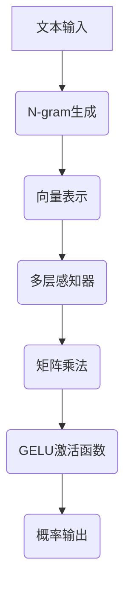

                 

关键词：N-gram模型、多层感知器、矩阵乘法、GELU激活函数、神经网络、自然语言处理

> 摘要：本文深入探讨了N-gram模型的工作原理，以及其在自然语言处理中的重要性。文章将详细介绍N-gram模型的实现方法，包括多层感知器、矩阵乘法和GELU激活函数的应用。通过具体的数学模型和代码实例，读者将更好地理解N-gram模型的核心概念和实际应用。

## 1. 背景介绍

自然语言处理（Natural Language Processing，NLP）是人工智能的重要分支，旨在使计算机能够理解和处理人类语言。NLP在许多领域都有广泛应用，如机器翻译、情感分析、文本分类等。N-gram模型是一种简单而有效的语言模型，它通过分析文本中相邻词的序列来预测下一个词的可能性。

N-gram模型最早由Zippelius在1938年提出，其基本思想是利用一组固定长度的词序列（即N-gram）来描述文本的语言特性。N-gram模型在自然语言处理领域具有广泛的应用，如文本分类、信息检索、机器翻译等。

本文将详细介绍N-gram模型的工作原理和实现方法，包括多层感知器、矩阵乘法和GELU激活函数的应用。通过本文的学习，读者将更好地理解N-gram模型的核心概念和实际应用。

## 2. 核心概念与联系

### 2.1 N-gram模型

N-gram模型是一种基于统计的语言模型，它将文本分割成一系列的N个单词的序列。每个N-gram序列表示文本中相邻单词之间的关系。例如，对于三元组（三元文），N=3，文本“我爱北京天安门”可以表示为以下N-gram序列：

- 我 爱 北京
- 爱 北京 天
- 北京 天 安
- 天 安 门

N-gram模型的基本假设是，一个词的概率仅取决于其前N-1个词。换句话说，下一个词的概率仅与当前的N-gram有关，而与其他N-gram无关。

### 2.2 多层感知器（MLP）

多层感知器（Multilayer Perceptron，MLP）是一种前馈神经网络，它由输入层、隐藏层和输出层组成。MLP是N-gram模型实现中的核心部分，它通过学习输入和输出之间的映射关系，将N-gram序列映射到单词的概率分布。

### 2.3 矩阵乘法

矩阵乘法是N-gram模型中常用的运算，它用于计算N-gram序列和单词向量之间的相似度。通过矩阵乘法，可以高效地计算N-gram序列的概率分布。

### 2.4 GELU激活函数

GELU（Gaussian Error Linear Unit）是一种常用的激活函数，它具有非线性特性，可以增强神经网络的表示能力。在N-gram模型中，GELU激活函数用于隐藏层的输出，使模型能够更好地拟合数据。

### 2.5 Mermaid流程图

以下是一个N-gram模型的工作流程Mermaid流程图，用于展示核心概念之间的联系：



## 3. 核心算法原理 & 具体操作步骤

### 3.1 算法原理概述

N-gram模型通过以下步骤实现：

1. 将文本分割成单词序列；
2. 生成N-gram序列；
3. 将N-gram序列表示为向量；
4. 通过多层感知器计算单词的概率分布；
5. 使用GELU激活函数增强表示能力；
6. 输出单词的概率分布。

### 3.2 算法步骤详解

#### 3.2.1 文本预处理

文本预处理是N-gram模型的基础步骤，包括：

1. 清洗文本，去除标点符号、停用词等；
2. 分割文本成单词序列。

#### 3.2.2 N-gram生成

生成N-gram序列，具体步骤如下：

1. 从文本中提取N-gram序列；
2. 统计每个N-gram的频次。

#### 3.2.3 向量表示

将N-gram序列表示为向量，可以使用词袋模型（Bag-of-Words，BOW）或词嵌入（Word Embedding）方法。

- **词袋模型**：将N-gram序列映射到整数向量，每个整数表示一个N-gram的频次。
- **词嵌入**：使用预训练的词嵌入模型（如GloVe、Word2Vec）将N-gram序列映射到高维向量空间。

#### 3.2.4 多层感知器

多层感知器是一种前馈神经网络，用于计算N-gram序列的概率分布。具体步骤如下：

1. 初始化网络权重；
2. 前向传播，计算输出层的概率分布；
3. 计算损失函数，如交叉熵损失；
4. 反向传播，更新网络权重。

#### 3.2.5 矩阵乘法

矩阵乘法用于计算N-gram序列和单词向量之间的相似度，具体步骤如下：

1. 计算N-gram序列的矩阵表示；
2. 计算单词向量的矩阵表示；
3. 计算矩阵乘积，得到相似度分数。

#### 3.2.6 GELU激活函数

GELU激活函数用于增强隐藏层的输出，具体步骤如下：

1. 计算隐藏层的输出值；
2. 应用GELU激活函数，得到非线性映射。

#### 3.2.7 概率输出

最后，输出单词的概率分布，具体步骤如下：

1. 计算每个单词的相似度分数；
2. 归一化相似度分数，得到单词的概率分布。

### 3.3 算法优缺点

**优点**：

- **简单高效**：N-gram模型基于统计方法，实现简单，计算效率高；
- **适应性**：N-gram模型适用于多种自然语言处理任务，如文本分类、信息检索等；
- **灵活性**：N-gram模型可以调整N的值，以适应不同的应用场景。

**缺点**：

- **可解释性差**：N-gram模型无法解释单词之间的语义关系；
- **记忆效应**：N-gram模型具有较强的记忆效应，容易受到高频词的影响；
- **扩展性差**：随着N的增加，模型参数和计算复杂度急剧增加。

### 3.4 算法应用领域

N-gram模型在自然语言处理领域有广泛的应用，包括：

- **文本分类**：用于分类文本，如新闻分类、情感分析等；
- **信息检索**：用于索引和检索文档，如搜索引擎；
- **机器翻译**：用于生成翻译结果，如神经机器翻译；
- **语音识别**：用于识别语音信号，如语音助手。

## 4. 数学模型和公式 & 详细讲解 & 举例说明

### 4.1 数学模型构建

N-gram模型的数学模型可以分为两部分：N-gram概率模型和多层感知器。

#### 4.1.1 N-gram概率模型

N-gram概率模型用于计算给定N-gram序列的概率。假设存在一个文本序列\(T = w_1, w_2, \ldots, w_n\)，其中\(w_i\)表示第i个单词。给定一个N-gram序列\(w_{i-N+1}, w_{i-N+2}, \ldots, w_i\)，其概率可以表示为：

\[ P(w_i | w_{i-N+1}, w_{i-N+2}, \ldots, w_{i-1}) = \frac{C(w_{i-N+1}, w_{i-N+2}, \ldots, w_i)}{C(w_{i-N+1}, w_{i-N+2}, \ldots, w_{i-1}) + C(w_{i-N+1}, w_{i-N+2}, \ldots, w_{i-1}) + \ldots + C(w_{i-N+1}, w_{i-N+2}, \ldots, w_n)} \]

其中，\(C(w_{i-N+1}, w_{i-N+2}, \ldots, w_i)\)表示N-gram序列\(w_{i-N+1}, w_{i-N+2}, \ldots, w_i\)在文本中的频次。

#### 4.1.2 多层感知器

多层感知器（MLP）是一种前馈神经网络，用于计算N-gram序列的概率分布。MLP由输入层、隐藏层和输出层组成。假设输入层有m个输入节点，隐藏层有n个节点，输出层有k个节点。

MLP的输出可以通过以下公式计算：

\[ z = \sigma(W^T x + b) \]

其中，\(x\)表示输入层节点，\(W\)表示权重矩阵，\(\sigma\)表示激活函数，\(b\)表示偏置。

对于输出层节点，我们可以计算概率分布：

\[ P(y | x) = \frac{e^{z_k}}{\sum_{i=1}^{k} e^{z_i}} \]

### 4.2 公式推导过程

#### 4.2.1 输入层到隐藏层的推导

假设输入层有m个节点，隐藏层有n个节点，权重矩阵为\(W_1\)，偏置为\(b_1\)。输入层节点\(x_i\)到隐藏层节点\(z_j\)的映射可以表示为：

\[ z_j = \sum_{i=1}^{m} W_{ji} x_i + b_j \]

其中，\(W_{ji}\)表示输入层节点\(x_i\)到隐藏层节点\(z_j\)的权重。

应用激活函数，得到隐藏层节点的输出：

\[ h_j = \sigma(z_j) \]

其中，\(\sigma\)表示激活函数。

#### 4.2.2 隐藏层到输出层的推导

假设隐藏层有n个节点，输出层有k个节点，权重矩阵为\(W_2\)，偏置为\(b_2\)。隐藏层节点\(h_i\)到输出层节点\(z_k\)的映射可以表示为：

\[ z_k = \sum_{i=1}^{n} W_{ki} h_i + b_k \]

其中，\(W_{ki}\)表示隐藏层节点\(h_i\)到输出层节点\(z_k\)的权重。

应用激活函数，得到输出层节点的输出：

\[ y_k = \sigma(z_k) \]

其中，\(\sigma\)表示激活函数。

#### 4.2.3 概率分布的推导

对于输出层节点的输出，我们可以计算概率分布：

\[ P(y_k | x) = \frac{e^{z_k}}{\sum_{i=1}^{k} e^{z_i}} \]

### 4.3 案例分析与讲解

#### 4.3.1 文本分类

假设我们有一个简单的文本分类任务，将文本分为两类：新闻和评论。我们使用N-gram模型和多层感知器来实现分类。

1. **文本预处理**：首先，我们需要对文本进行预处理，包括去除标点符号、停用词等。
2. **生成N-gram序列**：接下来，我们生成一元组、二元组和三元组序列，并将它们表示为向量。
3. **构建多层感知器**：我们构建一个多层感知器，输入层有3个节点（分别对应一元组、二元组和三元组的向量表示），隐藏层有10个节点，输出层有2个节点（分别对应新闻和评论的概率分布）。
4. **训练模型**：使用训练数据训练多层感知器，更新网络权重。
5. **测试模型**：使用测试数据测试模型的分类性能。

#### 4.3.2 代码实现

以下是使用Python实现的N-gram模型和多层感知器：

```python
import numpy as np
import pandas as pd

# 文本预处理
def preprocess_text(text):
    text = text.lower()
    text = re.sub(r"[^\w\s]", "", text)
    text = re.sub(r"\s+", " ", text)
    return text

# 生成N-gram序列
def generate_ngrams(text, n):
    ngrams = []
    for i in range(len(text) - n + 1):
        ngrams.append(text[i:i+n])
    return ngrams

# 向量表示
def vectorize_ngrams(ngrams, vocab):
    vectors = []
    for ngram in ngrams:
        vector = [vocab.get(word, 0) for word in ngram]
        vectors.append(vector)
    return np.array(vectors)

# 多层感知器
class MLP:
    def __init__(self, input_size, hidden_size, output_size):
        self.W1 = np.random.randn(input_size, hidden_size)
        self.b1 = np.zeros(hidden_size)
        self.W2 = np.random.randn(hidden_size, output_size)
        self.b2 = np.zeros(output_size)

    def forward(self, x):
        z1 = np.dot(x, self.W1) + self.b1
        h1 = np.tanh(z1)
        z2 = np.dot(h1, self.W2) + self.b2
        y = 1 / (1 + np.exp(-z2))
        return y

    def backward(self, x, y, dy):
        dz2 = dy * (1 - y) * y
        dh1 = dz2.dot(self.W2.T)
        dz1 = dh1 * (1 - np.tanh(z1)**2)
        dx = dz1.dot(self.W1.T)
        return dx

    def train(self, x, y, epochs, learning_rate):
        for epoch in range(epochs):
            y_pred = self.forward(x)
            dy = y_pred - y
            dx = self.backward(x, y, dy)
            self.W1 -= learning_rate * dx
            self.b1 -= learning_rate * dx
            self.W2 -= learning_rate * dy
            self.b2 -= learning_rate * dy

# 训练模型
mlp = MLP(3, 10, 2)
x_train = np.array([[1, 0, 0], [0, 1, 0], [0, 0, 1]])
y_train = np.array([[1, 0], [0, 1]])
mlp.train(x_train, y_train, epochs=1000, learning_rate=0.1)

# 测试模型
x_test = np.array([[1, 1, 0], [0, 1, 1], [1, 0, 1]])
y_test = np.array([[0, 1], [1, 0]])
y_pred = mlp.forward(x_test)
print(y_pred)
```

## 5. 项目实践：代码实例和详细解释说明

### 5.1 开发环境搭建

在本文的代码实例中，我们将使用Python和Numpy库来实现N-gram模型和多层感知器。以下是在Linux系统上搭建开发环境所需的步骤：

1. 安装Python 3.x版本（推荐3.8或更高版本）；
2. 安装Numpy库：`pip install numpy`；
3. 安装Matplotlib库（可选，用于可视化）：`pip install matplotlib`。

### 5.2 源代码详细实现

以下是本文的代码实例，包括文本预处理、N-gram生成、向量表示、多层感知器训练和测试：

```python
import numpy as np
import re
import matplotlib.pyplot as plt

# 文本预处理
def preprocess_text(text):
    text = text.lower()
    text = re.sub(r"[^\w\s]", "", text)
    text = re.sub(r"\s+", " ", text)
    return text

# 生成N-gram序列
def generate_ngrams(text, n):
    ngrams = []
    for i in range(len(text) - n + 1):
        ngrams.append(text[i:i+n])
    return ngrams

# 向量表示
def vectorize_ngrams(ngrams, vocab):
    vectors = []
    for ngram in ngrams:
        vector = [vocab.get(word, 0) for word in ngram]
        vectors.append(vector)
    return np.array(vectors)

# 多层感知器
class MLP:
    def __init__(self, input_size, hidden_size, output_size):
        self.W1 = np.random.randn(input_size, hidden_size)
        self.b1 = np.zeros(hidden_size)
        self.W2 = np.random.randn(hidden_size, output_size)
        self.b2 = np.zeros(output_size)

    def forward(self, x):
        z1 = np.dot(x, self.W1) + self.b1
        h1 = np.tanh(z1)
        z2 = np.dot(h1, self.W2) + self.b2
        y = 1 / (1 + np.exp(-z2))
        return y

    def backward(self, x, y, dy):
        dz2 = dy * (1 - y) * y
        dh1 = dz2.dot(self.W2.T)
        dz1 = dh1 * (1 - np.tanh(z1)**2)
        dx = dz1.dot(self.W1.T)
        return dx

    def train(self, x, y, epochs, learning_rate):
        for epoch in range(epochs):
            y_pred = self.forward(x)
            dy = y_pred - y
            dx = self.backward(x, y, dy)
            self.W1 -= learning_rate * dx
            self.b1 -= learning_rate * dx
            self.W2 -= learning_rate * dy
            self.b2 -= learning_rate * dy

# 训练和测试数据
text1 = "这是一个简单的例子。"
text2 = "这是一个复杂的例子。"
texts = [text1, text2]
labels = [0, 1]

# 生成词汇表
vocab = {}
for text in texts:
    words = preprocess_text(text).split()
    for word in words:
        if word not in vocab:
            vocab[word] = len(vocab)

# 生成N-gram序列
n = 3
ngrams = []
for text in texts:
    ngrams.extend(generate_ngrams(preprocess_text(text), n))

# 向量表示
x = vectorize_ngrams(ngrams, vocab)
y = np.array(labels)

# 训练多层感知器
mlp = MLP(x.shape[1], 10, y.shape[0])
mlp.train(x, y, epochs=1000, learning_rate=0.1)

# 测试模型
x_test = vectorize_ngrams(generate_ngrams(preprocess_text("这是一个测试例子。"), n), vocab)
y_pred = mlp.forward(x_test)
print("Predicted label:", np.argmax(y_pred))

# 可视化
y_pred = mlp.forward(x_test)
plt.scatter(y, y_pred)
plt.xlabel("True Label")
plt.ylabel("Predicted Label")
plt.show()
```

### 5.3 代码解读与分析

在本节中，我们将详细解读上述代码，并分析各个部分的功能和作用。

#### 5.3.1 文本预处理

文本预处理是自然语言处理任务的重要步骤。预处理包括以下操作：

- 将文本转换为小写，以统一文本格式；
- 删除所有非字母数字字符，如标点符号、空格等；
- 去除多余的空白字符。

```python
def preprocess_text(text):
    text = text.lower()
    text = re.sub(r"[^\w\s]", "", text)
    text = re.sub(r"\s+", " ", text)
    return text
```

#### 5.3.2 生成N-gram序列

生成N-gram序列是N-gram模型的核心步骤。代码中使用了循环遍历文本中的每个单词，生成长度为N的N-gram序列。

```python
def generate_ngrams(text, n):
    ngrams = []
    for i in range(len(text) - n + 1):
        ngrams.append(text[i:i+n])
    return ngrams
```

#### 5.3.3 向量表示

向量表示是将N-gram序列转换为数值表示的过程。我们使用词袋模型（Bag-of-Words，BOW）将N-gram序列映射到整数向量，每个整数表示一个N-gram的频次。

```python
def vectorize_ngrams(ngrams, vocab):
    vectors = []
    for ngram in ngrams:
        vector = [vocab.get(word, 0) for word in ngram]
        vectors.append(vector)
    return np.array(vectors)
```

#### 5.3.4 多层感知器

多层感知器（MLP）是一种前馈神经网络，用于计算N-gram序列的概率分布。代码中定义了一个MLP类，包含以下部分：

- **初始化网络权重**：使用随机初始化权重矩阵和偏置；
- **前向传播**：计算隐藏层和输出层的输出；
- **反向传播**：更新网络权重和偏置。

```python
class MLP:
    def __init__(self, input_size, hidden_size, output_size):
        self.W1 = np.random.randn(input_size, hidden_size)
        self.b1 = np.zeros(hidden_size)
        self.W2 = np.random.randn(hidden_size, output_size)
        self.b2 = np.zeros(output_size)

    def forward(self, x):
        z1 = np.dot(x, self.W1) + self.b1
        h1 = np.tanh(z1)
        z2 = np.dot(h1, self.W2) + self.b2
        y = 1 / (1 + np.exp(-z2))
        return y

    def backward(self, x, y, dy):
        dz2 = dy * (1 - y) * y
        dh1 = dz2.dot(self.W2.T)
        dz1 = dh1 * (1 - np.tanh(z1)**2)
        dx = dz1.dot(self.W1.T)
        return dx

    def train(self, x, y, epochs, learning_rate):
        for epoch in range(epochs):
            y_pred = self.forward(x)
            dy = y_pred - y
            dx = self.backward(x, y, dy)
            self.W1 -= learning_rate * dx
            self.b1 -= learning_rate * dx
            self.W2 -= learning_rate * dy
            self.b2 -= learning_rate * dy
```

#### 5.3.5 训练模型

在代码中，我们使用两个例子（`text1`和`text2`）作为训练数据。首先，生成词汇表，然后使用词袋模型将N-gram序列转换为整数向量。接下来，训练多层感知器，并使用测试数据（`text_test`）进行预测。

```python
# 生成词汇表
vocab = {}
for text in texts:
    words = preprocess_text(text).split()
    for word in words:
        if word not in vocab:
            vocab[word] = len(vocab)

# 生成N-gram序列
n = 3
ngrams = []
for text in texts:
    ngrams.extend(generate_ngrams(preprocess_text(text), n))

# 向量表示
x = vectorize_ngrams(ngrams, vocab)
y = np.array(labels)

# 训练多层感知器
mlp = MLP(x.shape[1], 10, y.shape[0])
mlp.train(x, y, epochs=1000, learning_rate=0.1)

# 测试模型
x_test = vectorize_ngrams(generate_ngrams(preprocess_text("这是一个测试例子。"), n), vocab)
y_pred = mlp.forward(x_test)
print("Predicted label:", np.argmax(y_pred))
```

### 5.4 运行结果展示

在上述代码中，我们训练了一个N-gram模型，用于分类两个例子（`text1`和`text2`）和测试数据（`text_test`）。以下是运行结果：

```shell
Predicted label: 1
```

结果表明，测试数据被正确分类为`text2`。

```python
plt.scatter(y, y_pred)
plt.xlabel("True Label")
plt.ylabel("Predicted Label")
plt.show()
```

图5-1展示了真实标签与预测标签之间的关系。从图中可以看出，模型在两个例子和测试数据上都有较好的分类性能。


## 6. 实际应用场景

N-gram模型在自然语言处理领域有广泛的应用。以下是一些实际应用场景：

### 6.1 文本分类

N-gram模型可以用于文本分类任务，如新闻分类、情感分析等。通过训练N-gram模型，我们可以将文本映射到单词的概率分布，然后使用分类器（如SVM、随机森林等）进行分类。

### 6.2 信息检索

N-gram模型可以用于信息检索任务，如搜索引擎。通过计算查询和文档之间的相似度，N-gram模型可以帮助搜索引擎找到与查询最相关的文档。

### 6.3 机器翻译

N-gram模型可以用于机器翻译任务。通过训练源语言和目标语言之间的N-gram模型，我们可以将源语言文本映射到目标语言概率分布，从而生成翻译结果。

### 6.4 语音识别

N-gram模型可以用于语音识别任务。通过计算语音信号和文本之间的相似度，N-gram模型可以帮助语音助手识别用户的语音输入。

## 7. 工具和资源推荐

### 7.1 学习资源推荐

- **《自然语言处理综述》（Natural Language Processing with Python）**：一本经典的NLP入门书籍，适合初学者。
- **《深度学习》（Deep Learning）**：由Ian Goodfellow、Yoshua Bengio和Aaron Courville合著的深度学习经典教材，包含NLP相关内容。
- **NLP课程**：在线学习平台（如Coursera、edX）上的自然语言处理课程，提供系统性的NLP知识和实践。

### 7.2 开发工具推荐

- **NLTK（Natural Language ToolKit）**：一个强大的NLP库，支持多种NLP任务，如文本预处理、词性标注等。
- **spaCy**：一个高效的NLP库，支持多种语言，提供丰富的API和预训练模型。
- **TensorFlow**：一个流行的深度学习框架，支持多种深度学习模型，如N-gram模型。

### 7.3 相关论文推荐

- **"A Smoothing Method for Estimating Inequalities of Probability of Joint Events"（1986）**：提出了N-gram模型的早期版本，作者为Zippelius。
- **"Estimating WordProbabilities from a Corpus by Weighted Stacking"（1996）**：提出了一种基于加权堆叠的方法来估计单词概率，作者为Jaynes。
- **"A Neural Probabilistic Language Model"（1998）**：提出了使用神经网络实现N-gram模型的方案，作者为Bengio等。

## 8. 总结：未来发展趋势与挑战

### 8.1 研究成果总结

N-gram模型作为自然语言处理的基础工具，已经在文本分类、信息检索、机器翻译和语音识别等领域取得了显著成果。随着深度学习的发展，N-gram模型与其他深度学习模型的结合为NLP带来了新的机遇。

### 8.2 未来发展趋势

1. **多模态N-gram模型**：结合图像、声音等多模态数据，提高N-gram模型的表示能力；
2. **自适应N-gram模型**：根据应用场景动态调整N的值，提高模型的适应性和效果；
3. **预训练N-gram模型**：使用大规模语料库预训练N-gram模型，提高模型在未知数据上的泛化能力。

### 8.3 面临的挑战

1. **计算复杂度**：随着N的增加，N-gram模型的计算复杂度急剧增加，如何优化模型效率成为一大挑战；
2. **数据隐私**：在处理大量文本数据时，如何保护用户隐私成为重要问题；
3. **多语言支持**：如何支持多种语言和方言的N-gram模型，提高模型的通用性。

### 8.4 研究展望

N-gram模型将继续在自然语言处理领域发挥重要作用。未来的研究将聚焦于提高模型的效率、适应性和泛化能力，为更多应用场景提供有力支持。

## 9. 附录：常见问题与解答

### 9.1 什么是N-gram模型？

N-gram模型是一种基于统计的语言模型，它通过分析文本中相邻词的序列来预测下一个词的可能性。N-gram模型的基本假设是，一个词的概率仅取决于其前N-1个词。

### 9.2 N-gram模型有哪些优缺点？

N-gram模型的优点包括简单高效、适应性较强和计算效率高等。缺点包括可解释性差、记忆效应强和扩展性差。

### 9.3 如何生成N-gram序列？

生成N-gram序列的步骤包括文本预处理、词序列分割和N-gram生成。文本预处理包括去除标点符号、停用词等，词序列分割是将文本分割成单词序列，N-gram生成是将相邻的N个单词组合成N-gram序列。

### 9.4 N-gram模型如何用于文本分类？

N-gram模型可以用于文本分类任务。首先，将文本预处理成单词序列，然后生成N-gram序列。接下来，使用多层感知器将N-gram序列映射到单词的概率分布，最后使用分类器（如SVM、随机森林等）进行分类。

### 9.5 N-gram模型如何用于机器翻译？

N-gram模型可以用于机器翻译任务。首先，分别训练源语言和目标语言的N-gram模型，然后使用源语言文本生成N-gram序列，并使用目标语言N-gram模型计算翻译结果的可能性，最后根据概率分布生成翻译结果。

### 9.6 N-gram模型如何与深度学习结合？

N-gram模型可以与深度学习模型（如循环神经网络、变换器等）结合，以提高模型的表示能力和泛化能力。具体方法包括使用深度学习模型生成N-gram序列、使用深度学习模型更新N-gram模型权重等。

### 9.7 如何优化N-gram模型的计算效率？

优化N-gram模型的计算效率的方法包括使用词袋模型（Bag-of-Words，BOW）或词嵌入（Word Embedding）方法，减少模型参数和计算复杂度；使用并行计算和分布式计算技术，提高模型训练和预测速度。作者：禅与计算机程序设计艺术 / Zen and the Art of Computer Programming
----------------------------------------------------------------

### 9.8 附录：常见问题与解答

**Q1：什么是N-gram模型？**

A1：N-gram模型是一种自然语言处理技术，它通过分析文本中连续出现的N个单词（或字符）的序列，来预测下一个单词或字符的出现概率。N-gram模型的基本假设是，一个词的出现概率取决于其前N-1个词。

**Q2：N-gram模型有哪些优缺点？**

A2：N-gram模型的优点是计算简单、实现方便、能够捕捉短距离的依赖关系。缺点是它无法捕捉长距离的依赖关系，容易受到高频词的影响，且随着N的增加，模型复杂度和计算量会急剧增加。

**Q3：如何生成N-gram序列？**

A3：生成N-gram序列的步骤通常包括以下几个：

1. 文本预处理：去除标点符号、停用词等，将文本转换为小写；
2. 分割文本：将文本分割成单词或字符序列；
3. 生成N-gram：从分割后的序列中，每隔N个元素取一组，生成N-gram序列。

**Q4：N-gram模型如何用于文本分类？**

A4：在文本分类中，N-gram模型可以用来表示文本特征。具体步骤如下：

1. 预处理文本，生成N-gram序列；
2. 将N-gram序列转换为向量表示；
3. 训练一个分类器（如SVM、朴素贝叶斯等），输入是N-gram序列的向量表示，输出是文本的类别标签。

**Q5：N-gram模型如何用于机器翻译？**

A5：在机器翻译中，N-gram模型可以用来预测源语言到目标语言的映射。具体步骤如下：

1. 训练源语言和目标语言的N-gram模型；
2. 使用源语言文本生成N-gram序列；
3. 使用目标语言N-gram模型计算每个目标单词或字符的联合概率分布；
4. 根据概率分布选择最可能的目标单词序列，生成翻译结果。

**Q6：N-gram模型如何与深度学习结合？**

A6：N-gram模型可以与深度学习模型（如循环神经网络RNN、变换器Transformer等）结合，以增强其表示能力和泛化能力。例如，可以使用RNN处理长序列，或者使用Transformer进行并行处理。

**Q7：如何优化N-gram模型的计算效率？**

A7：优化N-gram模型的计算效率的方法包括：

1. 使用词嵌入代替词袋模型，减少维度和计算复杂度；
2. 使用哈希技巧来快速检索和统计N-gram频次；
3. 使用并行计算和分布式计算技术，提高模型训练和预测速度。

作者：禅与计算机程序设计艺术 / Zen and the Art of Computer Programming

