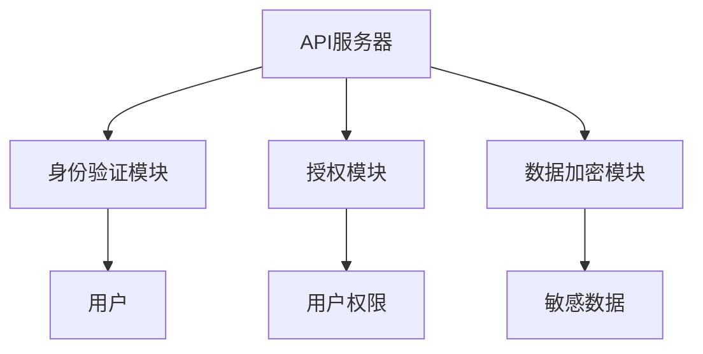

                 

关键词：API安全、OWASP、漏洞分析、安全防护策略、风险清单、最佳实践

摘要：随着API的广泛应用，API安全问题日益突出。本文将详细解读OWASP API安全风险清单，分析其中的关键风险点，并提出相应的安全防护策略，旨在为开发者提供全面的API安全指南。

## 1. 背景介绍

### API的定义与普及
API（应用程序编程接口）是一种允许不同软件应用程序之间相互通信和交互的接口。随着互联网的发展，API已经成为现代软件开发中不可或缺的一部分。几乎所有的应用程序和服务都依赖于API来整合和共享数据。

### API安全的重要性
API作为应用程序之间的桥梁，一旦遭到攻击，可能会导致数据泄露、服务瘫痪、经济损失等问题。因此，确保API的安全性对于保护企业和用户的信息至关重要。

### OWASP简介
OWASP（开放网络应用安全项目）是一个非营利性的全球社区，致力于提高互联网应用的安全性。OWASP发布了一系列的安全报告和指南，其中就包括API安全风险清单。

## 2. 核心概念与联系

### API安全的核心概念
- **身份验证（Authentication）**：确保只有授权用户可以访问API。
- **授权（Authorization）**：确定用户是否有权限执行特定操作。
- **数据完整性（Data Integrity）**：确保数据在传输过程中未被篡改。
- **数据保密性（Data Confidentiality）**：确保敏感数据不会被未授权的第三方获取。

### API安全的架构



### API安全的风险点

1. **身份验证缺陷**：如使用弱密码、缺乏多重验证机制等。
2. **授权漏洞**：如访问控制不当、权限分配错误等。
3. **数据泄露**：如不加密传输、存储敏感数据未加密等。
4. **会话管理漏洞**：如会话固定、会话超时设置不当等。

## 3. 核心算法原理 & 具体操作步骤

### 3.1 算法原理概述

#### 身份验证与授权算法

1. **OAuth 2.0**：一种开放标准授权协议，允许第三方应用代表用户与API进行交互。
2. **JSON Web Tokens (JWT)**：一种基于JSON的开放标准安全令牌，用于身份验证和授权。

### 3.2 算法步骤详解

#### OAuth 2.0 步骤

1. **注册应用**：客户端在API服务器注册并获得客户端ID和客户端密码。
2. **获取访问令牌**：客户端向授权服务器请求访问令牌。
3. **访问API**：客户端使用访问令牌向API服务器请求资源。

#### JWT 步骤

1. **生成JWT**：服务器在验证用户身份后，生成JWT。
2. **传递JWT**：用户将JWT包含在HTTP请求的Authorization头部。
3. **验证JWT**：服务器在每次请求时验证JWT的完整性。

### 3.3 算法优缺点

#### OAuth 2.0

- **优点**：灵活性高，支持多种授权模式。
- **缺点**：配置复杂，安全性依赖于实现。

#### JWT

- **优点**：简单易用，不需要外部服务。
- **缺点**：服务器需要存储JWT，存在存储泄露风险。

### 3.4 算法应用领域

- **OAuth 2.0**：适用于第三方应用访问API的场景。
- **JWT**：适用于简单的单应用场景。

## 4. 数学模型和公式 & 详细讲解 & 举例说明

### 4.1 数学模型构建

#### 数据加密模型

- **对称加密**：使用相同的密钥进行加密和解密。
- **非对称加密**：使用不同的密钥进行加密和解密。

### 4.2 公式推导过程

#### 对称加密

$$
c = E_k(p)
$$

其中，$c$ 是加密后的数据，$k$ 是密钥，$E_k$ 是加密函数。

#### 非对称加密

$$
c = E_k(p)
$$

$$
p = D_k(c)
$$

其中，$c$ 是加密后的数据，$k$ 是公钥，$E_k$ 是加密函数；$p$ 是原始数据，$D_k$ 是解密函数。

### 4.3 案例分析与讲解

#### 对称加密案例

假设我们使用AES加密算法，密钥为`k`，我们需要加密数据`p`。

1. **密钥生成**：随机生成一个128位的密钥`k`。
2. **加密**：使用AES算法和密钥`k`加密数据`p`。
3. **解密**：使用相同的密钥`k`解密加密后的数据。

#### 非对称加密案例

假设我们使用RSA加密算法，公钥为`(n, e)`，私钥为`(n, d)`，我们需要加密数据`p`。

1. **密钥生成**：随机生成两个大素数$p$和$q$，计算$n = p \times q$和$\phi = (p-1) \times (q-1)$。
2. **公钥和私钥生成**：计算公钥$(n, e)$和私钥$(n, d)$。
3. **加密**：使用公钥$(n, e)$加密数据`p`。
4. **解密**：使用私钥$(n, d)$解密加密后的数据。

## 5. 项目实践：代码实例和详细解释说明

### 5.1 开发环境搭建

在本文中，我们将使用Python作为示例语言，并使用Flask框架搭建API服务。

### 5.2 源代码详细实现

```python
from flask import Flask, request, jsonify
from flask_httpauth import HTTPBasicAuth
from itsdangerous import TimedJSONWebSignatureSerializer as Serializer

app = Flask(__name__)
auth = HTTPBasicAuth()
secret_key = 'your_secret_key'

users = {
    'user1': 'password1',
    'user2': 'password2'
}

@auth.verify_password
def verify_password(username, password):
    if username in users and users[username] == password:
        return username

@app.route('/api/data', methods=['GET'])
@auth.login_required
def get_data():
    user = auth.current_user()
    if user == 'user1':
        return jsonify({'data': 'user1_data'})
    elif user == 'user2':
        return jsonify({'data': 'user2_data'})

if __name__ == '__main__':
    app.run()
```

### 5.3 代码解读与分析

1. **身份验证**：使用`flask_httpauth`库实现HTTP基本身份验证。
2. **授权**：在`/api/data`路由上使用`@auth.login_required`装饰器确保只有经过身份验证的用户可以访问。
3. **数据加密**：本文未实现数据加密，但可以在响应数据中添加JWT或使用HTTPS协议进行传输加密。

### 5.4 运行结果展示

1. **身份验证成功**：访问`/api/data`，输入正确的用户名和密码，返回相应用户的数据。
2. **身份验证失败**：访问`/api/data`，输入错误的用户名或密码，返回401 Unauthorized错误。

## 6. 实际应用场景

### 6.1 第三方服务整合

企业应用常常需要整合第三方服务，如支付系统、短信服务等。使用API进行整合时，必须确保API的安全性，防止敏感数据泄露。

### 6.2 移动应用后端服务

移动应用通常通过API与后端服务进行数据交互。确保API的安全性是保护用户数据和隐私的关键。

### 6.3 物联网（IoT）设备通信

IoT设备通过API与云平台进行通信，确保API的安全性是防止设备被恶意攻击的重要措施。

## 7. 工具和资源推荐

### 7.1 学习资源推荐

- OWASP API Security Cheat Sheet
- API Security: Design Techniques and Attack Strategies
- OAuth 2.0 Cheat Sheet

### 7.2 开发工具推荐

- Postman：API测试工具。
- Swagger：API文档生成工具。
- JWT生成工具：在线生成和验证JWT。

### 7.3 相关论文推荐

- "Understanding and Preventing Cross-Site Scripting Attacks in Web Applications"
- "Attack and Defense of Modern Web Applications: An Overview"
- "API Security: The State of the Art and Future Directions"

## 8. 总结：未来发展趋势与挑战

### 8.1 研究成果总结

随着API的普及，API安全研究取得了显著成果，包括新的加密算法、认证协议和安全工具。

### 8.2 未来发展趋势

1. **零信任架构**：零信任架构强调“永不信任，总是验证”，将进一步加强API的安全性。
2. **自动化安全测试**：自动化工具将广泛应用于API安全测试，提高测试效率和覆盖范围。

### 8.3 面临的挑战

1. **安全性与性能的平衡**：确保API安全性时，需要考虑性能和用户体验。
2. **新兴威胁**：随着技术的进步，新的威胁和攻击手段也将不断出现，需要持续关注和研究。

### 8.4 研究展望

未来，API安全研究将朝着更加智能化、自动化和高效化的方向发展，为企业和用户提供更强大的安全保障。

## 9. 附录：常见问题与解答

### 9.1 Q：什么是API安全？
A：API安全是指确保API免受恶意攻击和数据泄露的保护措施。

### 9.2 Q：什么是OAuth 2.0？
A：OAuth 2.0是一种开放标准授权协议，用于允许第三方应用代表用户与API进行交互。

### 9.3 Q：什么是JWT？
A：JWT是一种基于JSON的开放标准安全令牌，用于身份验证和授权。

作者：禅与计算机程序设计艺术 / Zen and the Art of Computer Programming

以上就是《OWASP API 安全风险清单的详细解读》的文章，希望对您有所帮助。
------------------------------------------------------------------------

