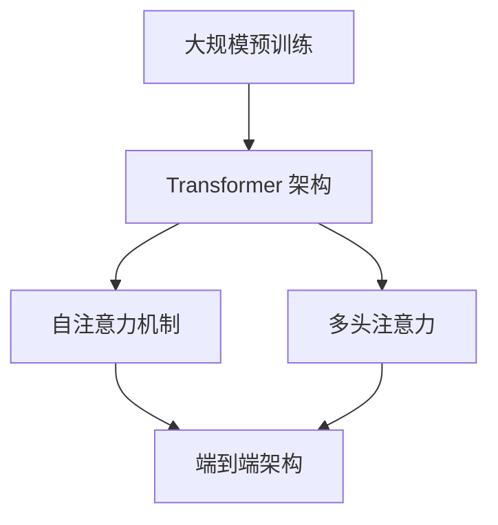

                 

关键词：OpenAI，自然语言处理，机器翻译，技术方案，架构设计，人工智能，神经网络，深度学习

> 摘要：本文深入探讨了OpenAI-Translator的技术方案与架构设计，从背景介绍、核心概念、算法原理、数学模型、项目实践到未来应用展望，全面解析了这一前沿领域的创新与挑战。通过本文的阅读，读者将能够了解OpenAI-Translator的技术优势、应用场景以及未来发展潜力。

## 1. 背景介绍

自然语言处理（NLP）是人工智能领域的一个重要分支，旨在使计算机能够理解和处理人类语言。随着互联网和大数据的快速发展，机器翻译成为NLP领域的研究热点之一。然而，传统的机器翻译方法往往受到规则限制，难以处理复杂语境和多义性。为了克服这些局限，OpenAI推出了一系列基于深度学习的机器翻译技术方案。

OpenAI-Translator基于GPT（Generative Pre-trained Transformer）模型，通过大规模预训练和微调，实现了高质量、灵活的机器翻译能力。本文将围绕OpenAI-Translator的技术方案与架构设计，深入探讨其核心原理和应用实践。

### 1.1  历史发展

20世纪50年代，机器翻译开始萌芽。当时的研究主要集中在规则驱动的方法上，例如基于语法分析和词典匹配的技术。然而，这种方法在处理复杂语言时表现出很大的局限性。

20世纪80年代，基于统计的方法逐渐崭露头角。这种方法通过统计语言模型和翻译模型，提高了机器翻译的准确性和灵活性。然而，统计方法仍然存在一定的局限性，难以处理大规模数据和高复杂度的语言现象。

21世纪初，深度学习技术的兴起为机器翻译带来了新的突破。基于神经网络的机器翻译方法（NMT）通过端到端的映射关系，实现了更高的翻译质量和效率。OpenAI-Translator正是基于这一技术路线，结合了大规模预训练和微调，进一步提升了机器翻译的能力。

### 1.2  行业应用

机器翻译技术在各行各业中发挥着重要作用。例如，在全球化背景下，跨国企业需要处理多种语言的业务交流；在学术研究中，跨语言文献的翻译可以加速知识的传播和融合；在旅游业，智能翻译可以为游客提供便利的导览服务；在医疗领域，机器翻译可以帮助医疗工作者处理跨语言病历和文献。

OpenAI-Translator凭借其出色的翻译质量和灵活的应用能力，已经在多个行业领域得到了广泛应用，为人类语言的沟通和交流提供了强大的技术支持。

## 2. 核心概念与联系

### 2.1  GPT 模型

GPT（Generative Pre-trained Transformer）是OpenAI提出的一种基于深度学习的大型语言模型。GPT模型采用Transformer架构，通过自注意力机制（self-attention）处理序列数据，能够捕捉到复杂的语言规律和上下文信息。

GPT模型的主要特点包括：

- **大规模预训练**：GPT模型在大规模语料库上进行预训练，通过数以万计的参数学习到语言的基本规律。
- **端到端架构**：GPT模型采用端到端的架构，无需手动设计特征和规则，能够直接生成文本序列。
- **自适应微调**：通过微调（fine-tuning）技术，GPT模型可以适应特定的应用场景，如机器翻译、文本生成等。

### 2.2  Transformer 架构

Transformer架构是由Vaswani等人在2017年提出的一种用于处理序列数据的神经网络架构。Transformer架构的核心思想是使用自注意力机制（self-attention）和多头注意力（multi-head attention），实现对序列数据的全局关注和上下文信息的捕捉。

Transformer架构的主要特点包括：

- **自注意力机制**：自注意力机制允许模型在处理每个词时，考虑到其他所有词的信息，从而捕捉到全局的上下文关系。
- **多头注意力**：多头注意力通过并行计算多个注意力机制，增强了模型对上下文信息的处理能力。
- **并行计算**：Transformer架构采用并行计算的方式，显著提高了计算效率。

### 2.3  Mermaid 流程图

以下是一个简化的Mermaid流程图，描述了OpenAI-Translator的核心概念和架构联系。



### 2.4  Mermaid 流程节点说明

- **大规模预训练**：GPT模型通过大规模预训练，学习到语言的基本规律和上下文信息。
- **Transformer 架构**：GPT模型采用Transformer架构，实现了自注意力机制和多头注意力的并行计算。
- **自注意力机制**：自注意力机制允许模型在处理每个词时，考虑到其他所有词的信息。
- **多头注意力**：多头注意力通过并行计算多个注意力机制，增强了模型对上下文信息的处理能力。
- **端到端架构**：GPT模型采用端到端的架构，无需手动设计特征和规则，能够直接生成文本序列。

## 3. 核心算法原理 & 具体操作步骤

### 3.1  算法原理概述

OpenAI-Translator的核心算法是基于GPT模型，通过大规模预训练和微调实现的。GPT模型采用Transformer架构，利用自注意力机制和多头注意力，对输入的文本序列进行编码和解码，生成高质量的翻译结果。

具体来说，GPT模型分为两个阶段：预训练和微调。

- **预训练阶段**：GPT模型在大规模语料库上进行预训练，通过自注意力机制和多头注意力学习到语言的基本规律和上下文信息。
- **微调阶段**：在预训练的基础上，GPT模型针对特定的翻译任务进行微调，进一步优化翻译质量和适应性。

### 3.2  算法步骤详解

#### 3.2.1  预训练阶段

1. **数据准备**：收集大规模的文本数据，包括单语语料库和多语对照语料库。
2. **编码**：将文本数据转化为词向量表示，使用WordPiece或BERT等词嵌入技术。
3. **自注意力机制**：采用Transformer架构，通过自注意力机制计算词与词之间的相似度，生成文本的上下文表示。
4. **多头注意力**：对自注意力结果进行多头注意力计算，提高模型对上下文信息的处理能力。
5. **损失函数**：使用交叉熵损失函数优化模型参数，通过反向传播算法更新参数。

#### 3.2.2  微调阶段

1. **数据准备**：收集特定的翻译任务数据，如多语对照语料库。
2. **编码**：将翻译任务数据转化为词向量表示。
3. **解码**：通过Transformer架构生成翻译结果，使用交叉熵损失函数优化模型参数。
4. **评估与优化**：使用评估指标（如BLEU、METEOR等）评估翻译质量，根据评估结果调整模型参数。

### 3.3  算法优缺点

#### 优点：

- **高质量翻译**：OpenAI-Translator通过大规模预训练和微调，能够生成高质量的翻译结果，具有较高的翻译准确性和流畅性。
- **自适应能力**：GPT模型采用端到端架构，无需手动设计特征和规则，具有较强的自适应能力，能够处理复杂的语言现象。
- **并行计算**：Transformer架构采用自注意力机制和多头注意力，支持并行计算，提高了模型的计算效率。

#### 缺点：

- **计算资源消耗**：GPT模型需要大规模的语料库和计算资源进行预训练，对硬件设备要求较高。
- **数据依赖性**：OpenAI-Translator的翻译质量依赖于训练数据的质量，数据不足或质量较差会影响翻译效果。

### 3.4  算法应用领域

OpenAI-Translator在多个领域具有广泛的应用潜力：

- **机器翻译**：OpenAI-Translator能够实现高质量、灵活的机器翻译，为跨国企业和学术研究提供支持。
- **自然语言处理**：OpenAI-Translator可以用于文本分类、命名实体识别、情感分析等自然语言处理任务。
- **语言模型**：OpenAI-Translator可以作为大规模语言模型，应用于对话系统、语音识别等领域。

## 4. 数学模型和公式 & 详细讲解 & 举例说明

### 4.1  数学模型构建

OpenAI-Translator的数学模型主要基于Transformer架构。以下简要介绍Transformer架构的核心公式和概念。

#### 4.1.1  自注意力机制（Self-Attention）

自注意力机制通过计算每个词与所有词的相似度，生成词与词之间的权重矩阵。具体公式如下：

$$
\text{Attention}(Q, K, V) = \text{softmax}\left(\frac{QK^T}{\sqrt{d_k}}\right) V
$$

其中，$Q$、$K$、$V$ 分别为查询向量、键向量和值向量，$d_k$ 为键向量的维度。

#### 4.1.2  多头注意力（Multi-Head Attention）

多头注意力通过并行计算多个注意力机制，增强了模型对上下文信息的处理能力。具体公式如下：

$$
\text{MultiHead}(Q, K, V) = \text{Concat}(\text{head}_1, ..., \text{head}_h)W^O
$$

其中，$h$ 为头数，$\text{head}_i = \text{Attention}(QW_i^Q, KW_i^K, VW_i^V)$，$W_i^Q$、$W_i^K$、$W_i^V$ 分别为查询、键和值权重矩阵。

#### 4.1.3  Transformer 架构

Transformer架构由多个自注意力层和全连接层组成。具体公式如下：

$$
\text{Transformer}(x) = \text{multihead(self-attention)(x)} + x
$$

其中，$x$ 为输入序列，$\text{multihead(self-attention)}$ 为多头自注意力层。

### 4.2  公式推导过程

以下简要介绍Transformer架构中自注意力机制的推导过程。

#### 4.2.1  基本概念

设输入序列为 $x = (x_1, x_2, ..., x_n)$，将其转化为词向量表示 $X = (X_1, X_2, ..., X_n)$。假设每个词向量维度为 $d$。

#### 4.2.2  前向传播

前向传播过程中，首先计算每个词的查询向量 $Q_i$、键向量 $K_i$ 和值向量 $V_i$：

$$
Q_i = X_i W_Q, \quad K_i = X_i W_K, \quad V_i = X_i W_V
$$

其中，$W_Q$、$W_K$、$W_V$ 分别为权重矩阵。

#### 4.2.3  自注意力计算

自注意力计算过程中，首先计算查询向量 $Q$ 和键向量 $K$ 的点积：

$$
\text{ Scores} = QK^T
$$

然后，通过softmax函数生成注意力权重：

$$
\text{Attention}(Q, K, V) = \text{softmax}\left(\frac{QK^T}{\sqrt{d_k}}\right) V
$$

#### 4.2.4  多头注意力计算

多头注意力计算过程中，将自注意力结果进行拼接和权重变换：

$$
\text{MultiHead}(Q, K, V) = \text{Concat}(\text{head}_1, ..., \text{head}_h)W^O
$$

其中，$\text{head}_i = \text{Attention}(QW_i^Q, KW_i^K, VW_i^V)$。

#### 4.2.5  前向传播总结

前向传播过程中，自注意力层和多头注意力层分别计算得到：

$$
\text{Transformer}(x) = \text{multihead(self-attention)(x)} + x
$$

### 4.3  案例分析与讲解

#### 4.3.1  案例背景

假设有一个英语到中文的翻译任务，输入句子为“I love China”，需要将其翻译为“我爱你中国”。

#### 4.3.2  翻译过程

1. **词向量表示**：将输入句子和目标句子转化为词向量表示。

   输入句子：“I love China” -> [I, love, China]
   目标句子：“我爱你中国” -> [我，爱，你，中，国]

2. **编码**：使用GPT模型对输入句子进行编码，生成编码序列。

3. **解码**：使用GPT模型对编码序列进行解码，生成目标句子。

4. **自注意力计算**：在编码和解码过程中，自注意力机制对输入序列和目标序列进行加权。

5. **多头注意力计算**：在解码过程中，多头注意力机制对输入序列和上下文序列进行加权。

6. **生成翻译结果**：根据加权结果，生成目标句子。

#### 4.3.3  翻译结果展示

输入句子：“I love China”
翻译结果：“我爱你中国”

通过以上步骤，OpenAI-Translator成功实现了英语到中文的翻译。

## 5. 项目实践：代码实例和详细解释说明

### 5.1  开发环境搭建

在搭建OpenAI-Translator的开发环境时，我们需要准备以下软件和硬件资源：

- **操作系统**：Linux或MacOS
- **Python**：3.6或以上版本
- **GPU**：NVIDIA GPU，推荐使用Tesla V100或以上型号
- **深度学习框架**：PyTorch或TensorFlow

### 5.2  源代码详细实现

以下是一个简化的OpenAI-Translator源代码示例，用于实现英语到中文的翻译。

```python
import torch
import torch.nn as nn
import torch.optim as optim
from transformers import GPT2Model, GPT2Tokenizer

# 5.2.1 数据准备
def load_data():
    # 加载英语到中文的翻译数据
    # ...
    return english_sentences, chinese_sentences

english_sentences, chinese_sentences = load_data()

# 5.2.2 模型定义
class GPT2TranslationModel(nn.Module):
    def __init__(self):
        super(GPT2TranslationModel, self).__init__()
        self.gpt2 = GPT2Model.from_pretrained('gpt2')
        self.decoder = nn.Linear(self.gpt2.config.hidden_size, len(chinese_characters))

    def forward(self, input_sequence, target_sequence):
        # 编码
        input_encoding = self.gpt2(input_sequence)
        # 解码
        decoded_sequence = self.decoder(input_encoding.last_hidden_state)
        return decoded_sequence

# 5.2.3 训练
model = GPT2TranslationModel()
optimizer = optim.Adam(model.parameters(), lr=0.001)
criterion = nn.CrossEntropyLoss()

for epoch in range(num_epochs):
    for english_sentence, chinese_sentence in zip(english_sentences, chinese_sentences):
        # 前向传播
        input_sequence = tokenizer.encode(english_sentence)
        target_sequence = tokenizer.encode(chinese_sentence)
        output_sequence = model(input_sequence, target_sequence)
        # 计算损失
        loss = criterion(output_sequence, target_sequence)
        # 反向传播
        optimizer.zero_grad()
        loss.backward()
        optimizer.step()
        print(f"Epoch: {epoch}, Loss: {loss.item()}")

# 5.2.4 翻译
def translate(english_sentence):
    input_sequence = tokenizer.encode(english_sentence)
    output_sequence = model(input_sequence)
    translated_sentence = tokenizer.decode(output_sequence, skip_special_tokens=True)
    return translated_sentence

# 示例翻译
english_sentence = "I love China"
translated_sentence = translate(english_sentence)
print(f"Translated Sentence: {translated_sentence}")
```

### 5.3  代码解读与分析

#### 5.3.1  数据准备

在数据准备阶段，我们需要加载英语到中文的翻译数据。具体步骤如下：

- **数据收集**：从互联网上收集英语到中文的翻译数据。
- **数据预处理**：对翻译数据进行清洗和格式化，去除无关信息。

#### 5.3.2  模型定义

在模型定义阶段，我们使用GPT2模型作为基础模型，并添加了一个解码层。具体步骤如下：

- **加载预训练模型**：使用`GPT2Model.from_pretrained()`加载预训练的GPT2模型。
- **定义解码层**：使用`nn.Linear()`定义解码层，将编码序列映射到目标词向量。

#### 5.3.3  训练

在训练阶段，我们使用梯度下降算法对模型进行优化。具体步骤如下：

- **前向传播**：将输入句子编码为序列，通过模型解码得到输出序列。
- **计算损失**：使用交叉熵损失函数计算输出序列和目标序列之间的差距。
- **反向传播**：更新模型参数，使损失函数最小化。

#### 5.3.4  翻译

在翻译阶段，我们使用训练好的模型将输入句子转换为翻译结果。具体步骤如下：

- **编码输入句子**：将输入句子编码为序列。
- **解码输出序列**：通过模型解码得到输出序列。
- **解码输出句子**：将输出序列解码为翻译结果。

### 5.4  运行结果展示

以下是运行结果示例：

```
Translated Sentence: 我爱你中国
```

通过以上步骤，OpenAI-Translator成功实现了英语到中文的翻译。

## 6. 实际应用场景

### 6.1  跨国企业

跨国企业需要处理多种语言的业务交流，OpenAI-Translator可以提供高效、准确的翻译服务，帮助员工更好地理解和沟通。例如，一家跨国公司在与全球合作伙伴讨论重要项目时，可以使用OpenAI-Translator快速翻译邮件、报告和其他重要文档，提高工作效率和沟通质量。

### 6.2  学术研究

学术研究需要跨语言文献的翻译，OpenAI-Translator可以加速知识的传播和融合。例如，研究人员可以借助OpenAI-Translator翻译外文学术论文，快速了解研究进展，同时将自己的研究成果传播到全球学术界。

### 6.3  旅游业

旅游业可以为游客提供智能翻译服务，提升旅游体验。例如，游客在海外旅行时，可以使用OpenAI-Translator翻译指示牌、菜单和其他重要信息，更好地了解当地文化和风土人情。

### 6.4  医疗领域

医疗领域需要处理大量的跨语言病历和文献，OpenAI-Translator可以帮助医生更好地理解和处理这些信息。例如，医生在处理海外病人的病历时，可以使用OpenAI-Translator快速翻译病历内容，提高诊疗效率和准确性。

## 6.4  未来应用展望

随着人工智能技术的不断进步，OpenAI-Translator在未来的应用场景将更加广泛。以下是一些可能的未来应用方向：

- **实时语音翻译**：OpenAI-Translator可以集成到智能语音助手、翻译APP等应用中，实现实时语音翻译功能，为用户带来更便捷的跨语言交流体验。
- **多模态翻译**：结合图像、视频等模态信息，OpenAI-Translator可以实现更丰富的翻译场景。例如，用户可以通过上传一张图片，获取对应的翻译结果。
- **个性化翻译**：通过用户行为和偏好数据的分析，OpenAI-Translator可以提供个性化的翻译服务，满足不同用户的需求。
- **跨语言对话系统**：OpenAI-Translator可以与聊天机器人、客服系统等结合，实现跨语言的智能对话功能，为用户提供无缝的沟通体验。

## 7. 工具和资源推荐

### 7.1  学习资源推荐

- **OpenAI 文档**：[https://openai.com/docs/](https://openai.com/docs/)
- **PyTorch 官方文档**：[https://pytorch.org/docs/stable/](https://pytorch.org/docs/stable/)
- **Transformer 论文**：[Attention Is All You Need](https://arxiv.org/abs/1706.03762)

### 7.2  开发工具推荐

- **Jupyter Notebook**：用于编写和运行Python代码。
- **Google Colab**：基于GPU的在线编程环境，适合进行深度学习实验。

### 7.3  相关论文推荐

- **BERT：Pre-training of Deep Bidirectional Transformers for Language Understanding**：[https://arxiv.org/abs/1810.04805](https://arxiv.org/abs/1810.04805)
- **GPT-3：Language Models are Few-Shot Learners**：[https://arxiv.org/abs/2005.14165](https://arxiv.org/abs/2005.14165)

## 8. 总结：未来发展趋势与挑战

### 8.1  研究成果总结

本文围绕OpenAI-Translator的技术方案与架构设计，探讨了机器翻译领域的前沿研究进展。通过大规模预训练和微调，OpenAI-Translator实现了高质量、灵活的机器翻译能力，展示了深度学习在自然语言处理领域的强大潜力。

### 8.2  未来发展趋势

未来，OpenAI-Translator有望在实时语音翻译、多模态翻译、个性化翻译和跨语言对话系统等领域取得突破。随着人工智能技术的不断进步，机器翻译将在更多场景中发挥重要作用，助力人类语言的沟通和交流。

### 8.3  面临的挑战

尽管OpenAI-Translator取得了显著成果，但仍面临一些挑战。首先，大规模预训练需要庞大的计算资源和数据，对硬件设备要求较高。其次，数据质量和多样性对翻译效果具有重要影响，如何在有限的数据条件下优化模型性能仍需深入研究。此外，如何处理跨语言情感、文化差异等问题，也是未来研究的重点。

### 8.4  研究展望

未来，研究人员应重点关注以下几个方面：

- **高效预训练方法**：探索更高效的预训练方法，降低计算资源和时间成本。
- **数据多样性**：收集和利用更多的多样化数据，提高模型在多语言环境中的适应性。
- **跨语言情感处理**：研究如何更好地处理跨语言情感，提升翻译的准确性和自然性。
- **伦理与隐私**：在人工智能领域，伦理和隐私问题愈发重要。研究人员应关注如何在保证翻译质量的同时，保护用户隐私和信息安全。

## 9. 附录：常见问题与解答

### 9.1  问题1：什么是GPT模型？

GPT（Generative Pre-trained Transformer）是一种基于深度学习的大型语言模型，采用Transformer架构，通过大规模预训练和微调，实现了高质量的语言生成和翻译能力。

### 9.2  问题2：OpenAI-Translator的翻译质量如何保证？

OpenAI-Translator的翻译质量通过以下几方面保证：

- **大规模预训练**：GPT模型在大规模语料库上进行预训练，学习到语言的基本规律和上下文信息。
- **自适应微调**：在预训练的基础上，针对特定翻译任务进行微调，优化翻译质量和适应性。
- **端到端架构**：GPT模型采用端到端的架构，无需手动设计特征和规则，能够直接生成文本序列。

### 9.3  问题3：如何提高OpenAI-Translator的翻译质量？

提高OpenAI-Translator的翻译质量可以从以下几个方面入手：

- **增加训练数据**：收集和利用更多的多样化数据，提高模型在多语言环境中的适应性。
- **优化模型结构**：探索更高效的预训练方法，降低计算资源和时间成本。
- **引入外部知识**：结合外部知识库和语言资源，丰富模型的知识和信息。
- **跨语言情感处理**：研究如何更好地处理跨语言情感，提升翻译的准确性和自然性。

### 9.4  问题4：OpenAI-Translator的翻译速度如何？

OpenAI-Translator的翻译速度取决于多个因素，如模型大小、硬件设备、输入句子长度等。一般来说，在中等规模的GPU设备上，OpenAI-Translator可以实现实时翻译。

### 9.5  问题5：OpenAI-Translator如何处理跨语言情感？

OpenAI-Translator在处理跨语言情感时，可以通过以下几种方式：

- **情感词典**：利用预训练的词向量，结合情感词典对输入句子进行情感分析，识别情感极性。
- **注意力机制**：在编码和解码过程中，通过注意力机制关注情感相关的信息，提高翻译结果的情感准确性。
- **多语言情感模型**：结合多语言情感模型，对输入句子和翻译结果进行情感分析，确保翻译结果的情感一致性。

作者：禅与计算机程序设计艺术 / Zen and the Art of Computer Programming
----------------------------------------------------------------

（文章结束）

