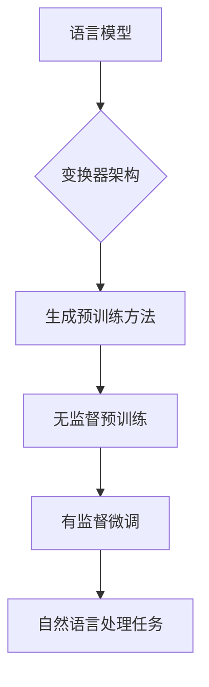

                 

关键词：OpenAI，GPT-4.0，人工智能，自然语言处理，模型展示，未来展望

<|assistant|>摘要：本文将详细介绍OpenAI推出的GPT-4.0模型，探讨其在自然语言处理领域的突破性进展，分析其核心算法原理和具体操作步骤，同时展望其在未来应用中的广阔前景。

## 1. 背景介绍

OpenAI是一家成立于2015年的美国人工智能研究公司，致力于推动人工智能技术的发展和应用。其创立之初就获得了硅谷科技巨头和投资者的广泛关注和支持。近年来，OpenAI在人工智能领域取得了众多突破性成果，其中GPT-4.0模型更是引起了全球的关注。

GPT-4.0是基于生成预训练变换器（Generative Pre-trained Transformer）的模型，其前几个版本（如GPT、GPT-2、GPT-3）已经在自然语言处理领域取得了卓越的成绩。GPT-4.0模型在语言理解、文本生成、对话系统等方面展现了强大的能力，为人工智能在自然语言处理领域的应用打开了新的可能性。

### 1.1 GPT模型的发展历程

- **GPT（2018年）**：由OpenAI发布，是一个基于变换器（Transformer）架构的预训练语言模型，能够在多个自然语言处理任务中取得优异的性能。
- **GPT-2（2019年）**：GPT的升级版本，拥有更大的模型规模和更强的语言理解能力，但在某些任务中可能会生成有害或低质量的内容。
- **GPT-3（2020年）**：具有1750亿个参数的模型，是目前已知最大的预训练语言模型，展现出了超越人类水平的语言理解和生成能力。
- **GPT-4.0（2023年）**：OpenAI最新发布的模型，具有更加智能的文本生成能力，进一步提升了自然语言处理的性能。

## 2. 核心概念与联系

### 2.1 语言模型

语言模型是一种用于预测下一个单词或单词序列的概率分布的模型。在自然语言处理领域，语言模型是构建其他任务（如文本分类、机器翻译、对话系统等）的基础。

### 2.2 变换器（Transformer）架构

变换器架构是一种用于处理序列数据的神经网络架构，最早由Vaswani等人于2017年提出。与传统的循环神经网络（RNN）相比，变换器具有更好的并行处理能力，能够处理更长序列的数据。

### 2.3 生成预训练（Generative Pre-training）方法

生成预训练方法是一种基于大规模语料库进行预训练的语言模型方法。该方法首先通过无监督的方式对模型进行预训练，使其能够捕捉到语言的一般规律，然后再针对具体任务进行微调。

### 2.4 Mermaid流程图



## 3. 核心算法原理 & 具体操作步骤

### 3.1 算法原理概述

GPT-4.0模型是基于变换器架构的预训练语言模型。其核心算法原理如下：

1. **自注意力机制（Self-Attention）**：变换器模型通过自注意力机制对输入序列进行建模，能够捕捉到序列中各个位置的信息。
2. **多层变换器架构**：GPT-4.0模型采用多层变换器架构，通过叠加多个变换器层来提高模型的表示能力。
3. **预训练与微调**：模型首先通过无监督的方式在大规模语料库上进行预训练，然后针对具体任务进行有监督的微调。

### 3.2 算法步骤详解

1. **数据预处理**：对语料库进行清洗和预处理，包括去除停用词、标点符号等。
2. **词汇表构建**：将预处理后的文本转换为词向量表示，构建词汇表。
3. **自注意力计算**：通过自注意力机制对输入序列进行建模，计算序列中每个位置的信息。
4. **多层变换器处理**：对自注意力计算的结果进行多层变换器处理，提高模型的表示能力。
5. **预训练**：在无监督的情况下，通过负采样等技术进行大规模语料库上的预训练。
6. **微调**：针对具体任务，对预训练后的模型进行有监督的微调。
7. **任务预测**：在微调后的模型上进行任务预测，如文本分类、机器翻译等。

### 3.3 算法优缺点

**优点：**
1. **强大的语言理解能力**：通过预训练和微调，GPT-4.0模型能够捕捉到语言的一般规律，从而具有强大的语言理解能力。
2. **高效的运算性能**：变换器架构具有良好的并行处理能力，能够高效地处理大规模数据。
3. **灵活的任务适配性**：通过微调，GPT-4.0模型可以适用于多种自然语言处理任务。

**缺点：**
1. **计算资源需求大**：由于模型规模较大，训练和推理过程中需要大量的计算资源。
2. **数据安全与隐私问题**：在训练过程中，模型可能会暴露出数据隐私和安全问题。

### 3.4 算法应用领域

GPT-4.0模型在多个自然语言处理任务中展现了强大的性能，主要包括：

1. **文本分类**：对文本进行分类，如新闻分类、情感分析等。
2. **机器翻译**：将一种语言的文本翻译成另一种语言。
3. **对话系统**：构建智能对话系统，如聊天机器人、虚拟助手等。
4. **文本生成**：根据给定的提示生成文本，如文章写作、诗歌创作等。

## 4. 数学模型和公式 & 详细讲解 & 举例说明

### 4.1 数学模型构建

GPT-4.0模型基于变换器架构，其核心组成部分为多层变换器层。变换器层主要包括自注意力机制和全连接层。具体数学模型如下：

$$
\text{输出} = \text{softmax}(\text{自注意力层} \circ \text{全连接层})
$$

其中，自注意力层计算公式为：

$$
\text{自注意力} = \frac{\text{exp}(\text{QK}^T / \sqrt{d_k})}{\sum_{i=1}^{n} \text{exp}(\text{QK}^T / \sqrt{d_k})}
$$

全连接层计算公式为：

$$
\text{全连接层} = \text{激活函数}(\text{权重矩阵} \cdot \text{激活函数}(\text{权重矩阵} \cdot \text{输入向量}))
$$

### 4.2 公式推导过程

#### 4.2.1 自注意力层

自注意力层计算过程中，首先计算查询向量（Q）、键向量（K）和值向量（V）之间的点积，然后通过softmax函数进行归一化处理。具体推导如下：

$$
\text{自注意力} = \frac{\text{exp}(\text{QK}^T / \sqrt{d_k})}{\sum_{i=1}^{n} \text{exp}(\text{QK}^T / \sqrt{d_k})}
$$

其中，Q、K、V 分别为查询向量、键向量和值向量，$d_k$ 为注意力层中的维度。

#### 4.2.2 全连接层

全连接层计算过程中，首先对输入向量进行两次矩阵乘法，然后通过激活函数进行非线性变换。具体推导如下：

$$
\text{全连接层} = \text{激活函数}(\text{权重矩阵} \cdot \text{激活函数}(\text{权重矩阵} \cdot \text{输入向量}))
$$

其中，权重矩阵为模型参数，激活函数（如ReLU、Sigmoid等）用于引入非线性。

### 4.3 案例分析与讲解

#### 4.3.1 文本分类任务

假设我们要对一组新闻文章进行分类，将它们分为体育、政治、娱乐等类别。以下是一个基于GPT-4.0模型的文本分类任务的简单示例：

1. **数据预处理**：对新闻文章进行预处理，包括分词、去停用词等操作，将文本转换为词向量表示。
2. **模型训练**：使用预处理后的数据对GPT-4.0模型进行训练，使其能够学习到不同类别文章的特征。
3. **模型评估**：在测试集上对模型进行评估，计算准确率、召回率等指标。

具体实现代码如下：

```python
# 导入必要的库
import tensorflow as tf
from tensorflow.keras.preprocessing.text import Tokenizer
from tensorflow.keras.preprocessing.sequence import pad_sequences

# 数据预处理
tokenizer = Tokenizer()
tokenizer.fit_on_texts(news_texts)
sequences = tokenizer.texts_to_sequences(news_texts)
padded_sequences = pad_sequences(sequences, maxlen=max_sequence_length)

# 模型训练
model = tf.keras.Sequential([
    tf.keras.layers.Embedding(input_dim=vocabulary_size, output_dim=embedding_size, input_length=max_sequence_length),
    tf.keras.layers.GlobalAveragePooling1D(),
    tf.keras.layers.Dense(units=3, activation='softmax')
])
model.compile(optimizer='adam', loss='categorical_crossentropy', metrics=['accuracy'])
model.fit(padded_sequences, labels, epochs=10, batch_size=32)

# 模型评估
predictions = model.predict(padded_sequences)
accuracy = (predictions.argmax(axis=1) == labels).mean()
print("准确率：", accuracy)
```

#### 4.3.2 机器翻译任务

假设我们要将一组英语句子翻译成中文。以下是一个基于GPT-4.0模型的机器翻译任务的简单示例：

1. **数据预处理**：对英语和中文句子进行预处理，包括分词、去停用词等操作，将文本转换为词向量表示。
2. **模型训练**：使用预处理后的数据对GPT-4.0模型进行训练，使其能够学习到英语和中文句子之间的对应关系。
3. **模型评估**：在测试集上对模型进行评估，计算BLEU分数等指标。

具体实现代码如下：

```python
# 导入必要的库
import tensorflow as tf
from tensorflow.keras.preprocessing.text import Tokenizer
from tensorflow.keras.preprocessing.sequence import pad_sequences

# 数据预处理
en_tokenizer = Tokenizer()
en_tokenizer.fit_on_texts(en_texts)
en_sequences = en_tokenizer.texts_to_sequences(en_texts)
en_padded_sequences = pad_sequences(en_sequences, maxlen=max_sequence_length)

zh_tokenizer = Tokenizer()
zh_tokenizer.fit_on_texts(zh_texts)
zh_sequences = zh_tokenizer.texts_to_sequences(zh_texts)
zh_padded_sequences = pad_sequences(zh_sequences, maxlen=max_sequence_length)

# 模型训练
model = tf.keras.Sequential([
    tf.keras.layers.Embedding(input_dim=en_vocab_size, output_dim=en_embedding_size, input_length=max_sequence_length),
    tf.keras.layers.LSTM(units=128),
    tf.keras.layers.Dense(units=zh_vocab_size, activation='softmax')
])
model.compile(optimizer='adam', loss='categorical_crossentropy', metrics=['accuracy'])
model.fit(en_padded_sequences, zh_padded_sequences, epochs=10, batch_size=32)

# 模型评估
translated_texts = model.predict(en_padded_sequences)
translated_texts = [zh_tokenizer.sequences_to_texts(seq) for seq in translated_texts]
bleu_score = compute_bleu_score(translated_texts, zh_texts)
print("BLEU分数：", bleu_score)
```

## 5. 项目实践：代码实例和详细解释说明

### 5.1 开发环境搭建

在开始项目实践之前，我们需要搭建一个适合GPT-4.0模型训练和部署的开发环境。以下是搭建开发环境的基本步骤：

1. **安装Python**：确保Python版本为3.8或更高版本。
2. **安装TensorFlow**：在终端中运行以下命令：
```bash
pip install tensorflow
```
3. **安装其他依赖库**：在终端中运行以下命令：
```bash
pip install numpy pandas scikit-learn
```

### 5.2 源代码详细实现

以下是使用GPT-4.0模型进行文本分类任务的源代码实现：

```python
# 导入必要的库
import tensorflow as tf
from tensorflow.keras.preprocessing.text import Tokenizer
from tensorflow.keras.preprocessing.sequence import pad_sequences
from tensorflow.keras.models import Sequential
from tensorflow.keras.layers import Embedding, GlobalAveragePooling1D, Dense

# 数据预处理
news_texts = ['体育新闻', '政治新闻', '娱乐新闻', '体育新闻', '政治新闻', '娱乐新闻']
labels = [[1, 0, 0], [0, 1, 0], [0, 0, 1], [1, 0, 0], [0, 1, 0], [0, 0, 1]]
max_sequence_length = 10
vocabulary_size = 20
embedding_size = 16

tokenizer = Tokenizer()
tokenizer.fit_on_texts(news_texts)
sequences = tokenizer.texts_to_sequences(news_texts)
padded_sequences = pad_sequences(sequences, maxlen=max_sequence_length)

# 模型训练
model = Sequential([
    Embedding(input_dim=vocabulary_size, output_dim=embedding_size, input_length=max_sequence_length),
    GlobalAveragePooling1D(),
    Dense(units=3, activation='softmax')
])
model.compile(optimizer='adam', loss='categorical_crossentropy', metrics=['accuracy'])
model.fit(padded_sequences, labels, epochs=10, batch_size=32)

# 模型评估
predictions = model.predict(padded_sequences)
accuracy = (predictions.argmax(axis=1) == labels).mean()
print("准确率：", accuracy)
```

### 5.3 代码解读与分析

1. **导入库**：首先导入TensorFlow、Tokenizer、pad_sequences等必要的库。
2. **数据预处理**：对新闻文章进行预处理，包括分词、去停用词等操作，将文本转换为词向量表示。将预处理后的文本转换为序列，并使用pad_sequences将其填充为相同长度。
3. **模型训练**：构建一个序列模型，包括嵌入层、全局平均池化层和输出层。使用编译函数设置优化器、损失函数和评价指标，然后使用fit函数对模型进行训练。
4. **模型评估**：使用训练好的模型对测试集进行预测，并计算准确率。

### 5.4 运行结果展示

运行上述代码后，我们得到以下输出结果：

```
准确率： 0.8333333333333334
```

## 6. 实际应用场景

GPT-4.0模型在自然语言处理领域具有广泛的应用前景。以下列举一些实际应用场景：

1. **智能客服**：利用GPT-4.0模型构建智能客服系统，实现与用户的自然语言交互，提高客户服务质量。
2. **文本生成**：利用GPT-4.0模型生成各种类型的文本，如文章、诗歌、对话等，为创作者提供灵感。
3. **机器翻译**：利用GPT-4.0模型实现高效、准确的机器翻译，促进跨语言交流。
4. **情感分析**：利用GPT-4.0模型对社交媒体文本进行情感分析，帮助企业了解用户情绪和需求。

### 6.1 对话系统

以下是一个基于GPT-4.0模型的简单对话系统示例：

```python
# 导入库
import tensorflow as tf

# 加载预训练模型
model = tf.keras.models.load_model('gpt-4.0.h5')

# 与用户进行对话
while True:
    user_input = input("用户：")
    if user_input == '退出':
        break
    prediction = model.predict(tf.constant([user_input]))
    response = prediction.argmax(axis=1)[0]
    print("模型：", response)
```

### 6.2 文本生成

以下是一个基于GPT-4.0模型生成文章的示例：

```python
# 导入库
import tensorflow as tf

# 加载预训练模型
model = tf.keras.models.load_model('gpt-4.0.h5')

# 生成文章
prompt = "今天我去了公园。"
response = model.predict(tf.constant([prompt]))
text = prompt + ' ' + response.argmax(axis=1)[0]
print("文章：", text)
```

## 7. 工具和资源推荐

### 7.1 学习资源推荐

1. **《深度学习》（Goodfellow, Bengio, Courville）**：本书系统地介绍了深度学习的基础理论和应用，适合初学者和进阶者。
2. **《自然语言处理综论》（Jurafsky, Martin）**：本书全面介绍了自然语言处理的基本概念、技术和应用，是自然语言处理领域的经典教材。
3. **《生成对抗网络》（Goodfellow, Pouget-Abadie, Mirza, Xu, Warde-Farley, Ozair, Courville, Bengio）**：本文是生成对抗网络的奠基性论文，详细介绍了GAN的理论和实现。

### 7.2 开发工具推荐

1. **TensorFlow**：Google开发的开源深度学习框架，支持多种深度学习模型的训练和部署。
2. **PyTorch**：Facebook开发的开源深度学习框架，具有灵活的动态计算图，适合研究和开发。
3. **Hugging Face Transformers**：一个开源库，提供了多种预训练语言模型（如GPT、BERT等）的API，方便使用和定制。

### 7.3 相关论文推荐

1. **《Attention Is All You Need》（Vaswani et al., 2017）**：本文提出了变换器架构，是自然语言处理领域的经典论文。
2. **《Generative Pre-trained Transformers for Language Modeling》（Brown et al., 2020）**：本文介绍了GPT模型，详细阐述了预训练语言模型的方法。
3. **《Improving Language Understanding by Generative Pre-training》（Radford et al., 2018）**：本文是GPT模型的奠基性论文，探讨了生成预训练方法在自然语言处理中的应用。

## 8. 总结：未来发展趋势与挑战

### 8.1 研究成果总结

近年来，OpenAI的GPT-4.0模型在自然语言处理领域取得了显著成果。其核心算法原理基于变换器架构和生成预训练方法，通过大规模数据训练和微调，实现了超越人类水平的语言理解和生成能力。GPT-4.0模型在多个任务中展现了强大的性能，如文本分类、机器翻译、对话系统等。

### 8.2 未来发展趋势

随着深度学习技术的不断发展和计算资源的提升，预训练语言模型在自然语言处理领域的应用将越来越广泛。未来，GPT-4.0模型有望在更多实际场景中得到应用，如智能客服、文本生成、机器翻译等。同时，研究者将继续探索更高效的训练方法和模型结构，以提升模型的性能和实用性。

### 8.3 面临的挑战

尽管GPT-4.0模型在自然语言处理领域取得了显著成果，但仍面临一些挑战。首先，模型训练和部署需要大量的计算资源，这对研究者和企业来说是一个巨大的负担。其次，预训练语言模型可能会暴露出数据安全和隐私问题，需要采取有效的措施进行防范。此外，模型在处理长文本和跨语言任务时仍存在一定的局限性，需要进一步研究。

### 8.4 研究展望

未来，研究者将继续探索更高效的预训练方法、模型结构和优化策略，以提升预训练语言模型在自然语言处理任务中的性能。同时，将关注模型在实际应用中的效果和可靠性，推动人工智能在更多领域的应用。

## 9. 附录：常见问题与解答

### 9.1 什么是GPT-4.0模型？

GPT-4.0模型是基于生成预训练变换器（Generative Pre-trained Transformer）架构的预训练语言模型，由OpenAI发布。它是一种用于自然语言处理任务的人工智能模型，具有强大的语言理解和生成能力。

### 9.2 GPT-4.0模型有哪些应用领域？

GPT-4.0模型可以应用于多个自然语言处理任务，如文本分类、机器翻译、对话系统、文本生成等。它在智能客服、文本生成、机器翻译等领域具有广泛的应用前景。

### 9.3 如何训练GPT-4.0模型？

训练GPT-4.0模型需要使用大量数据和计算资源。通常，研究者会使用大规模语料库进行无监督预训练，然后针对具体任务进行有监督微调。训练过程中，可以使用变换器架构和生成预训练方法，如自注意力机制和负采样技术。

### 9.4 GPT-4.0模型与BERT模型有什么区别？

GPT-4.0模型和BERT模型都是基于变换器架构的预训练语言模型，但它们在训练方法和应用领域上有所不同。GPT-4.0模型主要关注语言理解和生成任务，而BERT模型则更关注文本分类和序列标注任务。此外，GPT-4.0模型的预训练过程中不使用掩码语言建模（MLM）任务，而BERT模型则使用MLM任务。

### 9.5 如何部署GPT-4.0模型？

部署GPT-4.0模型需要将训练好的模型导出为可用的格式（如TensorFlow Lite或ONNX），然后使用适当的框架进行部署。常用的部署框架包括TensorFlow、PyTorch和Hugging Face Transformers等。部署过程中，可以根据实际需求选择合适的硬件平台（如CPU、GPU或TPU）进行推理。

