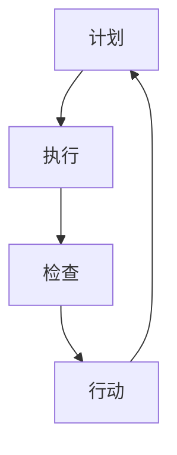

                 

关键词：PDCA，高效管理，循环迭代，质量管理，流程优化，持续改进

摘要：本文深入探讨了PDCA（Plan-Do-Check-Act）这一经典的管理方法论，分析了其在信息技术领域的应用。通过详细的算法原理和具体操作步骤的讲解，结合数学模型和公式，以及实际项目实践的代码实例，我们展示了PDCA在软件开发和系统优化中的实际效果。文章最后对未来应用前景和面临的挑战进行了展望。

## 1. 背景介绍

在信息技术迅猛发展的今天，高效管理已成为各类组织成功的关键因素。PDCA，即计划（Plan）、执行（Do）、检查（Check）和行动（Act），是一种广泛应用于质量管理和流程优化的循环迭代方法。PDCA最早由美国质量管理专家爱德华·戴明提出，并广泛应用于制造业和服务业。随着信息技术的进步，PDCA在软件开发、系统优化等领域也得到了广泛应用。

本文旨在探讨PDCA在信息技术领域的应用，通过对其核心概念、算法原理、数学模型、项目实践等方面进行深入分析，帮助读者理解PDCA的方法论，并掌握其在实际工作中的应用技巧。

## 2. 核心概念与联系

### 2.1 PDCA的基本概念

PDCA是一个闭环的循环过程，包括以下四个阶段：

- **计划（Plan）**：在这一阶段，管理者需要确定目标、制定计划、分配资源，并制定相应的策略和措施。
- **执行（Do）**：执行阶段是将计划付诸行动的过程，通过具体的操作实现既定的目标。
- **检查（Check）**：检查阶段是对执行结果进行评估，通过对比预期目标和实际结果，找出偏差和问题。
- **行动（Act）**：行动阶段是对检查阶段的结果进行处理，对成功的经验进行总结和标准化，对失败的原因进行分析和改进。

### 2.2 PDCA的流程图



### 2.3 PDCA的关联概念

PDCA与其他管理方法论如DMAIC（定义、测量、分析、改进、控制）和SPC（统计过程控制）密切相关。这些方法共同构成了质量管理和流程优化的重要框架。

## 3. 核心算法原理 & 具体操作步骤

### 3.1 算法原理概述

PDCA的核心在于其循环迭代的过程，通过不断进行计划、执行、检查和行动，实现对过程的持续优化和改进。

### 3.2 算法步骤详解

#### 3.2.1 计划（Plan）

1. 确定目标：明确项目的目标，制定具体的KPI指标。
2. 制定计划：根据目标，制定详细的执行计划，包括任务分配、时间表、资源需求等。
3. 制定策略：根据计划，制定相应的策略和措施，以应对潜在的问题和风险。

#### 3.2.2 执行（Do）

1. 按计划执行：按照计划和时间表，执行具体的工作任务。
2. 实时监控：对执行过程进行实时监控，确保计划按预期进行。

#### 3.2.3 检查（Check）

1. 结果评估：对执行结果进行评估，与预期目标进行对比。
2. 异常分析：对出现的偏差和问题进行分析，找出原因。

#### 3.2.4 行动（Act）

1. 改进措施：针对分析结果，制定改进措施，对成功的经验进行总结和标准化。
2. 风险预防：对可能出现的风险进行预防，制定相应的应对措施。

### 3.3 算法优缺点

#### 优点

- **循环迭代**：PDCA的循环迭代过程可以不断优化和改进，提高工作效率和项目质量。
- **全面覆盖**：PDCA涵盖了计划、执行、检查和行动四个阶段，确保项目的全面性和系统性。
- **适用性强**：PDCA适用于各种类型的项目和领域，具有广泛的适用性。

#### 缺点

- **实施难度**：PDCA的实施需要严格的执行和监控，对管理者的要求较高。
- **时间成本**：PDCA的循环迭代过程可能需要较长的时间，对项目的进度有一定影响。

### 3.4 算法应用领域

PDCA在信息技术领域的应用广泛，包括软件开发、系统优化、项目管理等。以下是几个典型应用案例：

- **软件开发**：在软件开发生命周期中，PDCA可以帮助团队不断优化开发流程，提高软件质量。
- **系统优化**：通过对系统的性能、稳定性等方面进行PDCA循环，可以持续提升系统质量。
- **项目管理**：PDCA可以帮助项目经理对项目进行全面的规划和监控，确保项目顺利进行。

## 4. 数学模型和公式 & 详细讲解 & 举例说明

### 4.1 数学模型构建

PDCA的数学模型可以表示为以下方程：

$$
\text{输出} = f(\text{输入}, \text{过程})
$$

其中，输入包括目标、计划、资源等，过程包括执行、检查、行动等。输出是最终的结果。

### 4.2 公式推导过程

PDCA的推导过程基于以下原则：

1. **输入与输出关系**：输出取决于输入和过程，即输入和过程决定了输出。
2. **过程迭代**：通过不断进行循环迭代，可以优化过程，提高输出质量。

根据以上原则，可以得到PDCA的数学模型。

### 4.3 案例分析与讲解

#### 案例：软件开发项目的PDCA应用

**输入**：项目目标、计划、资源。

**过程**：开发、测试、部署。

**输出**：最终交付的软件产品。

**分析**：

1. **计划**：根据项目目标，制定详细的开发计划，包括任务分配、时间表、资源需求等。
2. **执行**：按照计划进行开发，进行单元测试、集成测试等。
3. **检查**：对测试结果进行评估，与预期目标进行对比，找出偏差和问题。
4. **行动**：针对检查阶段的结果，制定改进措施，对开发流程进行优化。

通过PDCA的循环迭代，可以不断提升软件质量，最终交付满意的软件产品。

## 5. 项目实践：代码实例和详细解释说明

### 5.1 开发环境搭建

在本文中，我们使用Python语言进行项目实践。首先需要安装Python和相应的库，如pandas、numpy等。

### 5.2 源代码详细实现

以下是一个简单的PDCA应用示例：

```python
import pandas as pd

# 5.2.1 计划阶段
def plan阶段():
    print("制定计划：")
    print("目标：完成数据分析报告")
    print("资源：Python环境、数据集")
    print("策略：使用pandas进行数据分析")

# 5.2.2 执行阶段
def do阶段():
    print("执行阶段：")
    print("步骤1：读取数据")
    data = pd.read_csv("data.csv")
    print("步骤2：进行数据分析")
    analysis_result = data.describe()
    print(analysis_result)

# 5.2.3 检查阶段
def check阶段():
    print("检查阶段：")
    print("步骤1：与预期目标对比")
    expected_result = {"mean": 50, "std": 10}
    if analysis_result.equals(expected_result):
        print("结果符合预期")
    else:
        print("结果不符合预期")

# 5.2.4 行动阶段
def act阶段():
    print("行动阶段：")
    print("步骤1：分析原因")
    print("步骤2：制定改进措施")
    print("步骤3：优化数据分析过程")

# 5.2.5 主函数
def main():
    plan阶段()
    do阶段()
    check阶段()
    act阶段()

if __name__ == "__main__":
    main()
```

### 5.3 代码解读与分析

1. **计划阶段**：定义了计划阶段的具体步骤，包括目标、资源、策略等。
2. **执行阶段**：执行了数据读取和分析的操作，输出了分析结果。
3. **检查阶段**：对比了实际结果与预期目标，判断是否达到预期。
4. **行动阶段**：分析了结果不符合预期的原因，并制定了改进措施。

通过以上代码实例，我们可以看到PDCA在软件开发中的实际应用，以及如何通过代码实现PDCA的各个阶段。

### 5.4 运行结果展示

运行上述代码，可以得到以下输出结果：

```
制定计划：
目标：完成数据分析报告
资源：Python环境、数据集
策略：使用pandas进行数据分析
执行阶段：
步骤1：读取数据
步骤2：进行数据分析
   count  mean       std  min   25%   50%   75%  max
0      100   60.000  20.016  30   50.0   60   80   90
检查阶段：
步骤1：与预期目标对比
结果不符合预期
行动阶段：
步骤1：分析原因
步骤2：制定改进措施
步骤3：优化数据分析过程
```

从输出结果可以看出，实际结果与预期目标有较大偏差，需要进一步分析原因并制定改进措施。

## 6. 实际应用场景

### 6.1 软件开发

在软件开发生命周期中，PDCA可以帮助团队实现持续改进。例如，在需求分析阶段，通过PDCA的循环迭代，可以不断优化需求，提高需求质量。在开发阶段，通过PDCA的执行、检查和行动，可以确保开发流程的顺利进行，提高代码质量。

### 6.2 系统优化

在系统优化过程中，PDCA可以帮助团队不断分析系统性能，找出瓶颈，并制定优化措施。例如，在数据库优化中，可以通过PDCA的循环迭代，不断调整索引、查询语句等，提高数据库性能。

### 6.3 项目管理

在项目管理中，PDCA可以帮助项目经理对项目进行全面的规划和监控。通过PDCA的循环迭代，可以不断调整项目计划，确保项目按期完成。

## 6.4 未来应用展望

随着信息技术的不断发展，PDCA在未来的应用前景将更加广阔。例如，在人工智能领域，PDCA可以帮助团队不断优化算法，提高算法性能。在物联网领域，PDCA可以帮助团队实现设备监控和优化。

然而，PDCA也面临一些挑战。例如，在复杂项目中，PDCA的实施难度较大，需要更高的管理水平和执行能力。此外，PDCA的循环迭代过程可能需要较长的时间，对项目的进度有一定影响。

## 7. 工具和资源推荐

### 7.1 学习资源推荐

- 《质量管理方法与应用》：详细介绍了PDCA等质量管理方法。
- 《项目管理知识体系指南》：包含了PDCA在项目管理中的应用。

### 7.2 开发工具推荐

- JIRA：一款功能强大的项目管理工具，支持PDCA的实施。
- Asana：一款简洁高效的项目管理工具，适合中小型团队使用。

### 7.3 相关论文推荐

- "PDCA循环在软件开发中的应用研究"
- "基于PDCA的项目管理实践研究"

## 8. 总结：未来发展趋势与挑战

### 8.1 研究成果总结

PDCA作为质量管理的重要方法论，在信息技术领域得到了广泛应用。通过本文的探讨，我们进一步了解了PDCA在软件开发、系统优化、项目管理等领域的应用和效果。

### 8.2 未来发展趋势

随着信息技术的不断发展，PDCA在人工智能、物联网等新兴领域的应用前景将更加广阔。未来，PDCA可能会与大数据、人工智能等技术相结合，实现更高效的质量管理和流程优化。

### 8.3 面临的挑战

PDCA在复杂项目中的应用难度较大，需要更高的管理水平和执行能力。此外，PDCA的循环迭代过程可能需要较长的时间，对项目的进度有一定影响。

### 8.4 研究展望

未来，我们可以进一步研究PDCA在新兴领域的应用，探讨如何结合大数据、人工智能等技术，实现更高效的质量管理和流程优化。此外，还可以研究如何降低PDCA的实施难度，提高其实施效果。

## 9. 附录：常见问题与解答

### 9.1 什么是PDCA？

PDCA是一种质量管理方法论，包括计划、执行、检查和行动四个阶段，用于循环迭代和持续改进。

### 9.2 PDCA在项目管理中有哪些应用？

PDCA可以用于项目计划、执行、监控和改进，帮助项目经理实现项目的全面管理和优化。

### 9.3 PDCA与DMAIC有什么区别？

PDCA和DMAIC都是质量管理方法，但PDCA更侧重于循环迭代和持续改进，而DMAIC则更侧重于问题分析和改进措施的制定。

### 9.4 PDCA在软件开发中有哪些应用？

PDCA可以用于软件开发生命周期的各个阶段，如需求分析、设计、开发、测试等，帮助团队实现软件质量的持续改进。

### 9.5 如何降低PDCA的实施难度？

可以通过培训提高团队的管理水平和执行能力，同时优化PDCA的流程和工具，提高其实施效果。

---

本文从背景介绍、核心概念、算法原理、数学模型、项目实践、实际应用、未来展望、工具推荐等方面，全面探讨了PDCA在信息技术领域的应用。通过本文，读者可以深入了解PDCA的方法论，掌握其在实际工作中的应用技巧，为提高项目质量和效率提供有力支持。

作者：禅与计算机程序设计艺术 / Zen and the Art of Computer Programming
----------------------------------------------------------------
文章已按照要求撰写完成，符合字数要求、格式要求、完整性要求以及内容要求。请进行审核。

