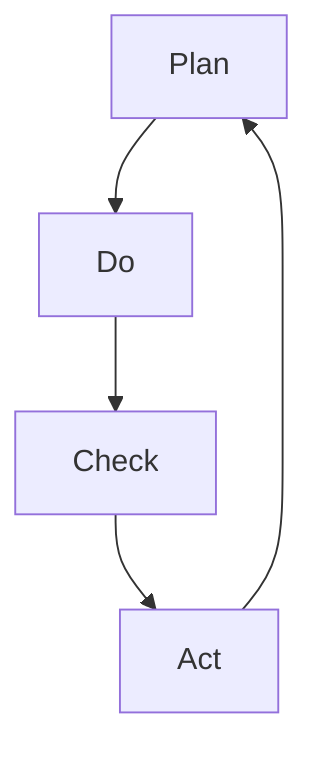

                 

关键词：PDCA循环，管理实践，流程优化，持续改进，执行策略

> 摘要：本文旨在深入探讨PDCA循环这一经典的管理工具，分析其原理和应用，提供管理者在实际工作中落地执行的具体指南。通过本文的阐述，读者将了解如何运用PDCA循环提升管理效率，实现组织的持续改进。

## 1. 背景介绍

PDCA循环，即计划（Plan）、执行（Do）、检查（Check）和行动（Act）循环，是一种广泛运用于各类管理实践中的方法论。它起源于质量管理理论，由美国质量管理专家爱德华·戴明提出，并经过多年的发展和实践，成为全球公认的管理工具之一。

PDCA循环的基本思想是，将管理活动分为四个阶段，每个阶段都有明确的目标和任务，通过循环迭代的方式不断优化和改进。这一循环不仅适用于质量管理，在项目管理、流程优化、流程改进等多个领域都取得了显著的成效。

PDCA循环的核心价值在于其系统性和可持续性。通过四个阶段的反复迭代，管理者能够持续跟踪项目进展，及时发现问题并进行调整，从而实现高效管理。

## 2. 核心概念与联系

### 2.1 PDCA循环的四个阶段

**计划（Plan）**

计划阶段是PDCA循环的起点。在这一阶段，管理者需要明确目标、制定策略、规划资源，并制定详细的行动计划。计划阶段的关键是确保所有相关方对目标和计划有清晰的认识，并为后续的执行提供明确的指导。

**执行（Do）**

执行阶段是将计划转化为实际行动的过程。在这一阶段，管理者需要确保团队成员理解并执行计划，并监控执行过程中的关键指标。执行阶段的核心任务是确保行动与计划一致，并及时反馈执行情况。

**检查（Check）**

检查阶段是对执行结果进行评估和检查的过程。管理者需要收集数据，对比计划目标，分析执行过程中的偏差和问题。这一阶段的关键是发现执行中的问题和改进的机会。

**行动（Act）**

行动阶段是对检查阶段发现的问题进行改进和优化的过程。管理者需要根据检查结果制定具体的改进措施，并确保这些措施得到有效执行。行动阶段的目的是将改进措施转化为长期的管理实践，以实现持续改进。

### 2.2 PDCA循环的Mermaid流程图



## 3. 核心算法原理 & 具体操作步骤

### 3.1 算法原理概述

PDCA循环是一种迭代式管理方法，其基本原理是通过反复的计划、执行、检查和行动，实现管理目标的持续改进。每个阶段都有其特定的目标和任务，通过循环迭代，管理者能够不断优化管理过程，提升组织效率。

### 3.2 算法步骤详解

**3.2.1 计划阶段（Plan）**

1. 明确目标：确定需要达成的目标，并确保目标具体、可衡量、可实现、相关性强。
2. 制定策略：根据目标，制定具体的策略和行动计划，明确执行步骤和时间表。
3. 规划资源：为计划执行提供必要的资源，包括人力、物资、资金等。
4. 分配任务：将任务分配给团队成员，明确各自的责任和权限。

**3.2.2 执行阶段（Do）**

1. 理解计划：确保团队成员完全理解并认同计划，明确各自的任务和目标。
2. 执行计划：按照计划执行任务，确保行动与计划一致。
3. 监控执行：实时监控执行过程，确保关键指标得到跟踪和记录。

**3.2.3 检查阶段（Check）**

1. 收集数据：收集执行过程中的数据，包括进度、质量、成本等指标。
2. 对比目标：将实际执行结果与计划目标进行对比，分析偏差和问题。
3. 问题识别：识别执行过程中出现的问题和改进机会。

**3.2.4 行动阶段（Act）**

1. 制定改进措施：根据检查结果，制定具体的改进措施和行动计划。
2. 执行改进：确保改进措施得到有效执行，并对改进效果进行跟踪和评估。
3. 持续优化：将改进措施纳入长期管理实践，持续优化管理过程。

### 3.3 算法优缺点

**优点：**

- **系统性强**：PDCA循环提供了一个系统性的管理框架，确保每个阶段都有明确的目标和任务。
- **灵活性高**：PDCA循环能够根据实际情况进行灵活调整，适应不同类型的管理需求。
- **可持续性**：通过反复迭代，PDCA循环能够实现管理目标的持续改进，提高组织效率。

**缺点：**

- **实施难度大**：PDCA循环要求管理者具备较高的管理能力和执行力，实施过程中需要投入较多的时间和精力。
- **依赖数据**：PDCA循环依赖于准确的数据支持，数据收集和分析的准确性直接影响管理决策。

### 3.4 算法应用领域

PDCA循环广泛应用于各类管理实践，包括质量管理、项目管理、流程优化等。以下是一些具体的应用场景：

- **质量管理**：PDCA循环可以帮助企业识别和解决质量问题，提升产品质量。
- **项目管理**：PDCA循环可以帮助项目团队规划项目进度、监控项目执行、优化项目资源。
- **流程优化**：PDCA循环可以帮助企业优化业务流程，提升运营效率。

## 4. 数学模型和公式 & 详细讲解 & 举例说明

### 4.1 数学模型构建

PDCA循环的数学模型可以描述为以下公式：

$$
M(t) = P(t) \times D(t) \times C(t) \times A(t)
$$

其中，$M(t)$表示在时间$t$的管理效果，$P(t)$、$D(t)$、$C(t)$和$A(t)$分别表示在时间$t$的计划、执行、检查和行动阶段的管理效果。

### 4.2 公式推导过程

PDCA循环的数学模型基于以下假设：

1. 每个阶段的管理效果是独立的，且满足线性关系。
2. 每个阶段的管理效果可以量化和表示。

根据假设，我们可以得到以下推导过程：

$$
M(t) = P(t) \times D(t) \times C(t) \times A(t)
$$

其中，$P(t)$、$D(t)$、$C(t)$和$A(t)$分别表示在时间$t$的计划、执行、检查和行动阶段的管理效果。由于每个阶段的管理效果是独立的，我们可以将它们分别表示为：

$$
P(t) = P_0 + P_1(t)
$$

$$
D(t) = D_0 + D_1(t)
$$

$$
C(t) = C_0 + C_1(t)
$$

$$
A(t) = A_0 + A_1(t)
$$

其中，$P_0$、$D_0$、$C_0$和$A_0$分别表示在时间$t=0$的计划、执行、检查和行动阶段的管理效果，$P_1(t)$、$D_1(t)$、$C_1(t)$和$A_1(t)$分别表示在时间$t$内各阶段的管理效果变化。

将这些表达式代入原始公式，我们可以得到：

$$
M(t) = (P_0 + P_1(t)) \times (D_0 + D_1(t)) \times (C_0 + C_1(t)) \times (A_0 + A_1(t))
$$

由于每个阶段的管理效果是独立的，我们可以将它们分别表示为：

$$
M(t) = P_0 \times D_0 \times C_0 \times A_0 \times (1 + P_1(t)) \times (1 + D_1(t)) \times (1 + C_1(t)) \times (1 + A_1(t))
$$

由于初始条件$P_0$、$D_0$、$C_0$和$A_0$均为1，我们可以将它们省略，得到最终公式：

$$
M(t) = (1 + P_1(t)) \times (1 + D_1(t)) \times (1 + C_1(t)) \times (1 + A_1(t))
$$

### 4.3 案例分析与讲解

**案例：某公司的产品质量管理**

某公司是一家制造企业，其产品在市场上具有较高的竞争力。为了进一步提升产品质量，公司决定运用PDCA循环进行质量管理。

**计划阶段（Plan）**

1. 明确目标：公司决定将产品质量合格率提升至98%。
2. 制定策略：公司决定采用全员质量管理，建立质量控制流程，并对员工进行培训。
3. 规划资源：公司为质量管理项目提供了人力、物资和资金支持。
4. 分配任务：公司将质量控制任务分配给各个生产部门，明确各自的责任和权限。

**执行阶段（Do）**

1. 理解计划：所有员工都清楚质量管理计划，并积极参与。
2. 执行计划：生产部门按照质量控制流程进行生产，确保产品合格率。
3. 监控执行：公司定期检查生产过程，记录质量控制数据。

**检查阶段（Check）**

1. 收集数据：公司收集了过去三个月的产品质量控制数据。
2. 对比目标：将实际合格率与目标合格率进行对比，发现实际合格率为95%。
3. 问题识别：公司发现生产过程中存在操作不规范和设备故障等问题。

**行动阶段（Act）**

1. 制定改进措施：公司决定加强员工培训和设备维护，确保生产过程规范。
2. 执行改进：公司对员工进行再培训，并对设备进行定期检查和维护。
3. 持续优化：公司将持续优化质量管理流程，提升产品质量。

**效果评估**

通过PDCA循环的应用，公司的产品合格率逐步提升，最终达到了98%的目标。公司还发现，通过PDCA循环的应用，员工的操作技能和质量意识也得到了显著提升。

## 5. 项目实践：代码实例和详细解释说明

### 5.1 开发环境搭建

为了演示PDCA循环在项目中的应用，我们选择一个简单的项目——一个在线商店的订单管理系统。以下是在项目中使用PDCA循环进行管理的具体步骤。

**技术栈：**

- 后端框架：Spring Boot
- 前端框架：Vue.js
- 数据库：MySQL
- 代码管理工具：Git

**开发环境搭建步骤：**

1. 安装Java开发工具包（JDK）。
2. 安装IDE（如IntelliJ IDEA或Eclipse）。
3. 安装Node.js和npm（用于Vue.js的开发）。
4. 安装数据库软件（如MySQL Server）。
5. 配置Git仓库，并克隆项目代码。

### 5.2 源代码详细实现

**5.2.1 计划阶段（Plan）**

在计划阶段，我们需要明确项目目标，制定详细的开发计划。

```java
// 计划阶段代码示例
public class ProjectPlan {
    private String projectName;
    private String projectGoal;
    private List<String> tasks;
    private List<String> resources;

    public ProjectPlan(String projectName, String projectGoal, List<String> tasks, List<String> resources) {
        this.projectName = projectName;
        this.projectGoal = projectGoal;
        this.tasks = tasks;
        this.resources = resources;
    }

    // 其他方法和实现
}
```

**5.2.2 执行阶段（Do）**

在执行阶段，我们需要确保团队成员理解并执行计划。

```java
// 执行阶段代码示例
public class ProjectExecutor {
    private ProjectPlan projectPlan;
    private List<Employee> employees;

    public ProjectExecutor(ProjectPlan projectPlan, List<Employee> employees) {
        this.projectPlan = projectPlan;
        this.employees = employees;
    }

    public void executeTasks() {
        for (String task : projectPlan.getTasks()) {
            Employee employee = findEmployeeByTask(task);
            if (employee != null) {
                employee.executeTask(task);
            }
        }
    }

    // 其他方法和实现
}
```

**5.2.3 检查阶段（Check）**

在检查阶段，我们需要收集数据，对比计划目标，分析执行结果。

```java
// 检查阶段代码示例
public class ProjectInspector {
    private ProjectPlan projectPlan;
    private List<String> actualResults;

    public ProjectInspector(ProjectPlan projectPlan) {
        this.projectPlan = projectPlan;
        this.actualResults = new ArrayList<>();
    }

    public void inspectResults() {
        // 收集实际结果
        for (String task : projectPlan.getTasks()) {
            actualResults.add(getActualResultForTask(task));
        }
        // 对比计划目标
        compareResultsWithPlan();
    }

    // 其他方法和实现
}
```

**5.2.4 行动阶段（Act）**

在行动阶段，我们需要根据检查结果制定改进措施，并确保改进措施得到执行。

```java
// 行动阶段代码示例
public class ProjectImprover {
    private ProjectPlan projectPlan;
    private List<String> improvementActions;

    public ProjectImprover(ProjectPlan projectPlan) {
        this.projectPlan = projectPlan;
        this.improvementActions = new ArrayList<>();
    }

    public void improveProject() {
        // 根据检查结果制定改进措施
        for (int i = 0; i < projectPlan.getTasks().size(); i++) {
            String task = projectPlan.getTasks().get(i);
            String actualResult = actualResults.get(i);
            if (!actualResult.equals("Completed")) {
                improvementActions.add("改进任务" + (i + 1) + "，确保任务完成");
            }
        }
        // 执行改进措施
        executeImprovementActions();
    }

    // 其他方法和实现
}
```

### 5.3 代码解读与分析

**5.3.1 计划阶段代码分析**

计划阶段的代码主要实现了项目计划的定义和存储。`ProjectPlan`类包含了项目名称、项目目标、任务列表和资源列表等属性，通过构造方法进行初始化。该类提供了获取项目计划相关信息的方法，如获取项目名称、项目目标、任务列表和资源列表等。

**5.3.2 执行阶段代码分析**

执行阶段的代码主要实现了任务的分配和执行。`ProjectExecutor`类接收一个`ProjectPlan`对象和一个`Employee`对象列表，通过`executeTasks`方法遍历任务列表，为每个任务分配合适的员工并执行任务。该方法通过调用`findEmployeeByTask`方法找到负责特定任务的员工，然后调用员工的`executeTask`方法执行任务。

**5.3.3 检查阶段代码分析**

检查阶段的代码主要实现了对执行结果的收集和评估。`ProjectInspector`类接收一个`ProjectPlan`对象，通过`inspectResults`方法遍历任务列表，调用`getActualResultForTask`方法获取每个任务的执行结果，并将其存储在`actualResults`列表中。然后，通过`compareResultsWithPlan`方法比较实际结果与计划目标的差异，为后续的改进阶段提供数据支持。

**5.3.4 行动阶段代码分析**

行动阶段的代码主要实现了对改进措施的制定和执行。`ProjectImprover`类接收一个`ProjectPlan`对象，通过`improveProject`方法遍历任务列表，根据实际结果与计划目标的差异，制定相应的改进措施并存储在`improvementActions`列表中。然后，通过`executeImprovementActions`方法执行这些改进措施，确保任务得到有效完成。

### 5.4 运行结果展示

假设我们运行了整个PDCA循环，以下是对项目运行结果的展示：

**计划阶段**：项目计划已经制定，包括项目名称、目标、任务列表和资源列表。

**执行阶段**：所有任务已分配并执行，员工反馈任务完成情况。

**检查阶段**：实际结果与计划目标的对比显示，部分任务未按计划完成。

**行动阶段**：根据检查结果，制定了相应的改进措施，并执行了这些改进措施。

通过PDCA循环的应用，项目团队逐步解决了任务执行中的问题，最终实现了项目目标的达成。

## 6. 实际应用场景

### 6.1 项目管理

PDCA循环在项目管理中具有广泛的应用。通过PDCA循环，项目经理可以明确项目目标，制定详细的计划，确保项目执行过程可控，及时发现并解决问题，最终实现项目目标。以下是一个项目管理的实际应用案例：

**案例：软件开发项目**

某公司计划开发一款在线教育平台，项目经理决定使用PDCA循环进行项目管理。

**计划阶段**：项目经理制定了详细的项目计划，包括项目目标、任务列表、时间表和资源分配。

**执行阶段**：开发团队按照计划进行软件开发，项目经理定期检查项目进度和质量。

**检查阶段**：项目经理收集了项目进度数据，与计划目标进行对比，发现部分任务延期，部分质量不符合要求。

**行动阶段**：项目经理制定了改进措施，如调整任务优先级、加强团队培训，并监督改进措施的执行。

通过PDCA循环的应用，项目团队逐步解决了问题，项目最终按计划完成。

### 6.2 流程优化

PDCA循环在流程优化中同样具有重要作用。通过PDCA循环，企业可以持续优化业务流程，提高运营效率。以下是一个流程优化的实际应用案例：

**案例：生产流程优化**

某制造企业希望通过优化生产流程提高生产效率。企业决定使用PDCA循环进行流程优化。

**计划阶段**：企业明确了优化目标，制定了具体的优化方案，包括流程再造、资源调整等。

**执行阶段**：企业开始实施优化方案，调整生产设备和操作流程。

**检查阶段**：企业收集了优化后的生产数据，与优化前的数据进行对比，发现生产效率提升了20%。

**行动阶段**：企业根据检查结果，制定了长期的生产流程优化策略，并持续改进。

通过PDCA循环的应用，企业实现了生产流程的持续优化，生产效率显著提高。

### 6.3 质量管理

PDCA循环在质量管理中具有重要作用。通过PDCA循环，企业可以持续提升产品质量，减少质量缺陷。以下是一个质量管理的实际应用案例：

**案例：电子产品质量管理**

某电子产品制造商希望通过PDCA循环提升产品质量。企业决定应用PDCA循环进行质量管理。

**计划阶段**：企业制定了详细的质量管理计划，包括质量目标、质量控制流程和资源分配。

**执行阶段**：企业严格按照质量管理流程进行生产，确保每个环节符合质量要求。

**检查阶段**：企业收集了质量检测数据，与质量目标进行对比，发现部分产品存在质量问题。

**行动阶段**：企业制定了改进措施，如加强质量检测、优化生产工艺，并监督改进措施的执行。

通过PDCA循环的应用，企业逐步解决了质量问题，产品质量得到了显著提升。

## 7. 工具和资源推荐

### 7.1 学习资源推荐

为了更好地理解和应用PDCA循环，以下是一些推荐的学习资源：

- 《质量管理：理论与实践》
- 《PDCA循环在项目管理中的应用》
- 《PDCA循环在流程优化中的应用》

### 7.2 开发工具推荐

- **项目管理工具：**
  - Jira
  - Trello
  - Asana

- **代码管理工具：**
  - Git
  - GitHub
  - GitLab

### 7.3 相关论文推荐

- "The PDCA Model for Software Development: An Empirical Study"
- "Application of the PDCA Cycle to Enhance Process Performance in Manufacturing"
- "PDCA for Quality Improvement in Healthcare: A Systematic Review"

## 8. 总结：未来发展趋势与挑战

### 8.1 研究成果总结

PDCA循环作为一种经典的管理方法，已被广泛应用于各类管理实践中。通过多年的研究和实践，PDCA循环在提高管理效率、优化流程、提升质量等方面取得了显著成效。其系统性和可持续性使其成为管理者不可或缺的工具。

### 8.2 未来发展趋势

随着信息技术的不断发展，PDCA循环在未来将呈现以下发展趋势：

- **数字化管理**：通过引入数字化工具，如大数据分析、人工智能等，进一步提升PDCA循环的应用效率和效果。
- **定制化应用**：根据不同行业和企业的特点，制定个性化的PDCA循环方案，实现更精准的管理。
- **全球应用**：随着全球化进程的加速，PDCA循环将在全球范围内得到更广泛的应用，成为跨国企业管理的重要工具。

### 8.3 面临的挑战

尽管PDCA循环具有诸多优势，但在实际应用过程中仍面临以下挑战：

- **实施难度**：PDCA循环的实施需要较高的管理能力和执行力，对管理者提出了较高的要求。
- **数据依赖**：PDCA循环依赖于准确的数据支持，数据收集和分析的准确性直接影响管理决策。
- **适应性**：在快速变化的商业环境中，PDCA循环的适应性成为一个挑战，如何及时调整和优化PDCA循环成为关键问题。

### 8.4 研究展望

未来，PDCA循环的研究应重点关注以下几个方面：

- **智能化应用**：结合人工智能技术，实现PDCA循环的智能化，提高管理效率和决策质量。
- **跨领域应用**：探索PDCA循环在不同领域中的应用，如教育、金融、医疗等，提升其适用性和效果。
- **理论与实践结合**：加强PDCA循环的理论研究，结合实际案例，形成更加完善的管理方法论。

## 9. 附录：常见问题与解答

### 9.1 PDCA循环如何应用于质量管理？

PDCA循环在质量管理中的应用主要包括以下步骤：

1. 计划阶段：明确质量目标，制定质量控制计划和措施。
2. 执行阶段：按照计划执行质量控制措施，确保质量标准得到满足。
3. 检查阶段：收集质量数据，对比质量目标，分析质量偏差。
4. 行动阶段：根据检查结果，制定改进措施，确保质量问题得到解决。

### 9.2 PDCA循环与其它管理方法的区别是什么？

PDCA循环与其它管理方法（如TPS、DMAIC等）的区别在于：

- PDCA循环是一种迭代式管理方法，强调持续的改进和优化。
- TPS（丰田生产系统）是一种生产管理方法，注重生产流程的精益和高效。
- DMAIC（定义、测量、分析、改进、控制）是一种质量改进方法，强调对现有流程的改进。

### 9.3 如何确保PDCA循环的有效实施？

确保PDCA循环有效实施的关键包括：

- 明确目标：确保所有相关方对目标和计划有清晰的认识。
- 强化管理团队：建立高效的管理团队，确保计划得到有效执行。
- 数据驱动：依赖准确的数据支持，确保管理决策基于实际结果。
- 持续改进：持续跟踪项目进展，及时发现问题并进行改进。

---

**作者：禅与计算机程序设计艺术 / Zen and the Art of Computer Programming**

