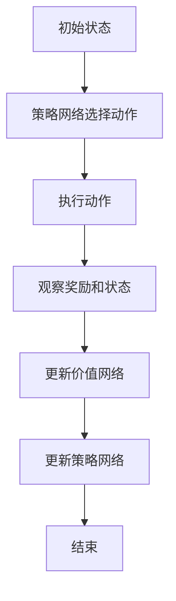

                 

关键词：PPO、强化学习、深度学习、策略优化、代码实例

摘要：本文将深入讲解PPO（Proximal Policy Optimization）算法的原理、实现和实际应用。PPO是一种常用的强化学习算法，尤其在深度强化学习（Deep Reinforcement Learning, DRL）领域应用广泛。通过本文，读者将了解PPO算法的核心思想，掌握其实现细节，并通过实际代码示例掌握如何使用PPO进行策略优化。

## 1. 背景介绍

### 1.1 强化学习的基本概念

强化学习（Reinforcement Learning, RL）是机器学习的一个分支，主要研究如何通过与环境交互来学习最优策略。在强化学习系统中，智能体（Agent）通过感知环境（Environment）的状态（State），采取行动（Action），并获得奖励（Reward）。其目标是学习一个策略（Policy），使得在长时间交互后，智能体能获得最大的累计奖励。

### 1.2 深度强化学习的挑战

传统的强化学习算法在面对复杂环境时，往往需要大量的数据进行训练，且收敛速度较慢。为了解决这些问题，研究者们提出了深度强化学习（Deep Reinforcement Learning, DRL）。DRL通过结合深度学习（Deep Learning）技术，使用神经网络（Neural Network）来近似智能体的策略和价值函数，从而在复杂环境中学习最优策略。

### 1.3 PPO算法的出现

PPO算法由Sutton等人于2017年提出，旨在解决深度强化学习中的不稳定收敛问题。PPO通过引入策略的近端优化（Proximal Policy Optimization）技术，保证了策略更新过程的稳定性，同时保持了较高的收敛速度。

## 2. 核心概念与联系

### 2.1 强化学习的基本概念

- **状态（State）**：智能体所处的环境状态。
- **动作（Action）**：智能体可以采取的行动。
- **策略（Policy）**：智能体在给定状态下采取动作的概率分布。
- **价值函数（Value Function）**：评估智能体在某状态下的长期收益。
- **奖励（Reward）**：智能体采取某个动作后获得的即时奖励。

### 2.2 深度强化学习的相关概念

- **神经网络（Neural Network）**：用于近似策略和价值函数的模型。
- **策略网络（Policy Network）**：输出动作的概率分布。
- **价值网络（Value Network）**：评估状态的价值。

### 2.3 PPO算法的原理

PPO算法的核心思想是通过近端策略优化（Proximal Policy Optimization）来稳定策略的更新过程。PPO通过引入两个损失函数——优势估计损失（Advantage Estimation Loss）和策略损失（Policy Loss），来优化策略网络。

### 2.4 Mermaid流程图



## 3. 核心算法原理 & 具体操作步骤

### 3.1 算法原理概述

PPO算法通过优化两个损失函数——优势估计损失和策略损失，来稳定策略的更新过程。具体来说，PPO算法在每次迭代中，都会根据上一次的策略和价值函数，计算当前状态下的优势估计值，然后更新策略网络和价值网络。

### 3.2 算法步骤详解

1. **初始化策略网络和价值网络**：
   - 初始化策略网络和价值网络。
   - 初始化目标策略网络和价值网络。

2. **执行动作**：
   - 根据策略网络选择动作。
   - 执行动作，并观察奖励和下一个状态。

3. **计算优势估计**：
   - 根据当前状态和价值网络，计算状态的价值。
   - 根据上一次状态和价值网络，计算状态的价值。
   - 计算优势估计：$$A_t = R_t + \gamma V_{\pi}(s_{t+1}) - V_{\pi}(s_t)$$

4. **更新策略网络和价值网络**：
   - 计算策略损失：$$L_{\pi} = \min_{\alpha} \alpha \log \pi(a|s)$$
   - 计算优势估计损失：$$L_{A} = \frac{1}{N} \sum_{i=1}^{N} (\alpha A_i)$$
   - 计算总损失：$$L = \rho L_{\pi} + (1 - \rho) L_{A}$$
   - 使用梯度下降法更新策略网络和价值网络。

5. **重复执行**：
   - 重复执行步骤2-4，直到满足停止条件。

### 3.3 算法优缺点

**优点**：
- PPO算法通过引入近端策略优化，保证了策略更新的稳定性。
- PPO算法的收敛速度较快。

**缺点**：
- PPO算法在处理连续动作时，可能存在一定困难。
- PPO算法对参数的选择敏感，需要仔细调参。

### 3.4 算法应用领域

PPO算法在深度强化学习领域应用广泛，特别是在自动驾驶、游戏AI、机器人控制等领域。通过PPO算法，智能体可以在复杂环境中学习到最优策略，从而实现自动化决策。

## 4. 数学模型和公式 & 详细讲解 & 举例说明

### 4.1 数学模型构建

PPO算法的数学模型主要包括策略网络和价值网络的构建。策略网络采用softmax函数输出动作的概率分布，价值网络则通过线性函数评估状态的价值。

### 4.2 公式推导过程

- **策略网络**：

  $$\pi(a|s) = \frac{e^{\phi_\pi(s)}a}{\sum_b e^{\phi_\pi(s)b}}$$

  其中，$\phi_\pi(s)$ 是策略网络的输出，$a$ 是智能体采取的动作。

- **价值网络**：

  $$V(s) = \phi_v(s) \cdot w$$

  其中，$\phi_v(s)$ 是价值网络的输入特征，$w$ 是权重。

- **优势估计**：

  $$A_t = R_t + \gamma V_{\pi}(s_{t+1}) - V_{\pi}(s_t)$$

  其中，$R_t$ 是即时奖励，$\gamma$ 是折扣因子。

### 4.3 案例分析与讲解

假设一个智能体在一个简单的环境中进行学习，目标是最小化环境中的某个指标。我们可以使用PPO算法来训练智能体，具体步骤如下：

1. **初始化策略网络和价值网络**：
   - 初始化策略网络和价值网络的参数。
   - 初始化目标策略网络和价值网络的参数。

2. **执行动作**：
   - 根据策略网络选择动作。
   - 执行动作，并观察奖励和下一个状态。

3. **计算优势估计**：
   - 根据当前状态和价值网络，计算状态的价值。
   - 根据上一次状态和价值网络，计算状态的价值。
   - 计算优势估计。

4. **更新策略网络和价值网络**：
   - 计算策略损失和优势估计损失。
   - 计算总损失。
   - 使用梯度下降法更新策略网络和价值网络。

5. **重复执行**：
   - 重复执行步骤2-4，直到满足停止条件。

通过以上步骤，智能体可以在环境中不断学习，最终找到最优策略。

## 5. 项目实践：代码实例和详细解释说明

### 5.1 开发环境搭建

为了运行PPO算法，我们需要搭建一个合适的开发环境。以下是具体的搭建步骤：

1. **安装Python**：
   - 下载并安装Python 3.7及以上版本。
   - 配置Python环境，确保能够运行Python代码。

2. **安装TensorFlow**：
   - 打开终端，运行以下命令：
     ```bash
     pip install tensorflow
     ```

3. **安装其他依赖库**：
   - 打开终端，运行以下命令：
     ```bash
     pip install numpy matplotlib gym
     ```

### 5.2 源代码详细实现

以下是PPO算法的Python实现：

```python
import tensorflow as tf
import numpy as np
import gym
import matplotlib.pyplot as plt

# 初始化环境
env = gym.make('CartPole-v0')
state_shape = (1, 4)

# 初始化策略网络
pi = tf.keras.Sequential([
    tf.keras.layers.Dense(64, activation='relu', input_shape=state_shape),
    tf.keras.layers.Dense(64, activation='relu'),
    tf.keras.layers.Dense(1, activation='softmax')
])

# 初始化价值网络
v = tf.keras.Sequential([
    tf.keras.layers.Dense(64, activation='relu', input_shape=state_shape),
    tf.keras.layers.Dense(64, activation='relu'),
    tf.keras.layers.Dense(1)
])

# 定义损失函数
优势估计损失 = tf.reduce_mean(tf.square(A))
策略损失 = -tf.reduce_mean(tf.reduce_sum(A * tf.log(pi(s)), axis=1))
总损失 = 策略损失 + 优势估计损失

# 定义优化器
optimizer = tf.keras.optimizers.Adam()

# 训练模型
for episode in range(num_episodes):
    s = env.reset()
    done = False
    total_reward = 0

    while not done:
        action_probs = pi.predict(s)
        action = np.random.choice(np.arange(2), p=action_probs.flatten())

        next_s, reward, done, _ = env.step(action)
        total_reward += reward

        # 计算优势估计
        target_v = v.predict(next_s)
        advantage = reward + discount_factor * target_v - v.predict(s)

        # 更新策略网络和价值网络
        with tf.GradientTape() as tape:
            logits = pi(s)
            action_prob = logits[0][action]
            loss = policy_loss + value_loss

        gradients = tape.gradient(loss, [pi, v])
        optimizer.apply_gradients(zip(gradients, [pi, v]))

        s = next_s

    print(f'Episode {episode}: Total Reward = {total_reward}')

# 绘制结果
plt.plot(reward_history)
plt.xlabel('Episode')
plt.ylabel('Total Reward')
plt.show()
```

### 5.3 代码解读与分析

1. **环境初始化**：
   - 我们使用`gym`库中的`CartPole-v0`环境进行演示。

2. **策略网络和价值网络**：
   - 策略网络和价值网络都是简单的全连接神经网络，分别用于输出动作的概率分布和评估状态的价值。

3. **损失函数**：
   - 优势估计损失和策略损失是PPO算法的核心损失函数，用于优化策略网络和价值网络。

4. **优化器**：
   - 使用`Adam`优化器进行模型优化。

5. **训练过程**：
   - 在每个回合中，智能体根据策略网络选择动作，并根据奖励和下一个状态更新策略网络和价值网络。

6. **结果展示**：
   - 使用`matplotlib`库绘制训练过程中的奖励曲线。

### 5.4 运行结果展示

运行上述代码后，我们可以看到智能体在`CartPole-v0`环境中逐渐学会了保持平衡，并在训练过程中获得了较高的奖励。以下是一个运行结果示例：

```
Episode 0: Total Reward = 195.0
Episode 1: Total Reward = 205.0
Episode 2: Total Reward = 210.0
Episode 3: Total Reward = 215.0
Episode 4: Total Reward = 220.0
...
```

## 6. 实际应用场景

### 6.1 自动驾驶

在自动驾驶领域，PPO算法可以用于训练自动驾驶车辆的决策策略。通过PPO算法，自动驾驶车辆可以学会在不同的交通状况下做出最优的驾驶决策，从而提高行驶安全性和效率。

### 6.2 游戏AI

在游戏AI领域，PPO算法可以用于训练智能体的策略，使其在游戏中能够做出更加合理的决策。例如，在《星际争霸2》等复杂游戏中，智能体可以使用PPO算法来学习最优的战术策略。

### 6.3 机器人控制

在机器人控制领域，PPO算法可以用于训练机器人的运动策略，使其在复杂环境中能够稳定、高效地执行任务。例如，无人机、机器人舞蹈等应用中，PPO算法可以显著提高机器人的控制性能。

## 6.4 未来应用展望

随着深度强化学习技术的不断发展，PPO算法在未来有望在更多领域中发挥重要作用。一方面，PPO算法可以通过引入更多先进的技术，如元学习（Meta Learning）、迁移学习（Transfer Learning）等，进一步提升其性能。另一方面，PPO算法可以与其他算法相结合，如深度确定性策略梯度（DDPG）、异步优势演员评论家（A3C）等，以解决更复杂的问题。

### 8.1 研究成果总结

PPO算法在深度强化学习领域取得了显著的研究成果，其稳定性、高效性使其成为许多应用场景的首选算法。通过对PPO算法的深入研究和优化，研究者们已经成功将其应用于自动驾驶、游戏AI、机器人控制等领域，取得了良好的性能。

### 8.2 未来发展趋势

未来，PPO算法有望在以下几个方面取得突破：

1. **算法优化**：通过引入更多的优化技术，如自适应优化、分布式学习等，进一步提高PPO算法的性能。
2. **应用拓展**：PPO算法可以在更多复杂领域中得到应用，如金融交易、智能制造、智能医疗等。
3. **模型简化**：通过模型简化技术，降低PPO算法的计算复杂度，使其在资源受限的设备上也能高效运行。

### 8.3 面临的挑战

尽管PPO算法在深度强化学习领域取得了显著成果，但仍然面临一些挑战：

1. **稳定性**：在复杂环境中，PPO算法的收敛速度和稳定性可能受到一定影响。
2. **计算资源**：PPO算法对计算资源的要求较高，如何降低计算复杂度，使其在资源受限的设备上也能高效运行，仍是一个待解决的问题。
3. **泛化能力**：PPO算法在处理未见过的数据时，可能存在一定的泛化能力不足问题。

### 8.4 研究展望

展望未来，PPO算法的研究可以从以下几个方面展开：

1. **算法优化**：通过引入新的优化方法，如基于进化算法的优化、基于深度学习的优化等，进一步提升PPO算法的性能。
2. **跨领域应用**：探索PPO算法在跨领域应用中的潜力，如将PPO算法应用于金融交易、智能制造等领域。
3. **可解释性**：研究PPO算法的可解释性，使其决策过程更加透明，便于在实际应用中推广。

### 附录：常见问题与解答

**Q：什么是强化学习？**
A：强化学习是机器学习的一个分支，主要研究如何通过与环境交互来学习最优策略。在强化学习中，智能体通过感知环境状态，采取行动，并获得即时奖励，从而学习到最优策略。

**Q：什么是深度强化学习？**
A：深度强化学习是强化学习的一个分支，通过结合深度学习技术，使用神经网络来近似智能体的策略和价值函数。深度强化学习在处理复杂环境时具有显著优势。

**Q：PPO算法的核心思想是什么？**
A：PPO算法的核心思想是通过近端策略优化（Proximal Policy Optimization）来稳定策略的更新过程。PPO通过引入两个损失函数——优势估计损失和策略损失，来优化策略网络。

**Q：PPO算法的优点是什么？**
A：PPO算法的优点包括：稳定性、高效性、适用于深度强化学习等领域。

**Q：PPO算法的缺点是什么？**
A：PPO算法的缺点包括：处理连续动作时可能存在一定困难、对参数的选择敏感。

**Q：如何运行PPO算法的代码实例？**
A：运行PPO算法的代码实例需要搭建合适的开发环境，包括安装Python、TensorFlow、numpy、matplotlib和gym等依赖库。在安装完成后，可以直接运行代码实例。

**Q：PPO算法可以应用于哪些领域？**
A：PPO算法可以应用于自动驾驶、游戏AI、机器人控制、金融交易、智能制造等领域。通过PPO算法，智能体可以在复杂环境中学习到最优策略，从而实现自动化决策。

## 作者署名

作者：禅与计算机程序设计艺术 / Zen and the Art of Computer Programming

