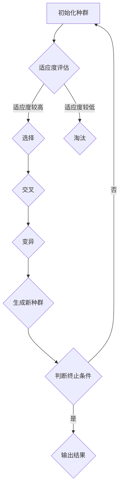

                 

关键词：机器学习，遗传算法，Python实现，优化策略，应用领域，数学模型，项目实践

>摘要：本文深入探讨了遗传算法在机器学习中的应用，通过Python实战实例，详细解析了遗传算法的实现和优化方法，并探讨了其在实际场景中的潜力与挑战。

## 1. 背景介绍

遗传算法（Genetic Algorithm，GA）是启发式搜索算法中的一种，基于生物进化理论，通过模拟自然选择和遗传学机制来寻找最优解。它由John Holland在1975年提出，自那时以来，遗传算法在许多领域都取得了显著成果，包括机器学习、优化、调度、逻辑推理等。遗传算法的基本概念包括个体、种群、适应度函数、选择、交叉、变异等。

在机器学习领域，遗传算法因其强大的全局搜索能力和对复杂问题的适应性，被广泛应用于模式识别、数据分类、回归分析、聚类分析等方面。遗传算法能够处理大规模的数据集，对于传统优化算法难以解决的组合优化问题，遗传算法表现出色。

本文将围绕遗传算法在机器学习中的应用，以Python语言为例，详细介绍遗传算法的实现与优化策略，并探讨其在不同领域的实际应用。

## 2. 核心概念与联系

遗传算法的核心概念包括个体、种群、适应度函数、选择、交叉、变异等。

### 2.1. 个体（Individual）

在遗传算法中，个体是指算法求解问题的一个候选解。在机器学习问题中，个体通常是一个特征向量，用于表示数据点的属性。例如，在分类问题中，个体可能是一个数据点，其特征值决定了该数据点属于哪个类别。

### 2.2. 种群（Population）

种群是遗传算法的基本单元，包含多个个体。种群的数量称为种群规模（Population Size）。种群规模的大小对算法的性能有重要影响。种群规模过大可能导致计算成本增加，规模过小则可能无法很好地覆盖搜索空间。

### 2.3. 适应度函数（Fitness Function）

适应度函数是遗传算法的核心评价标准，用于评估个体的适应度。在机器学习中，适应度函数通常是通过训练数据集对模型进行评估得到的。适应度函数的值越高，表示个体在求解问题上的表现越好。

### 2.4. 选择（Selection）

选择是遗传算法中的关键步骤，用于从当前种群中选择个体进行交叉和变异操作。选择操作通常基于个体的适应度值，常用的选择方法包括轮盘赌选择、锦标赛选择等。

### 2.5. 交叉（Crossover）

交叉操作用于生成新个体。交叉操作选择两个个体（父代）的部分基因进行组合，生成两个新的个体（子代）。交叉操作能够引入多样性，有助于算法跳出局部最优。

### 2.6. 变异（Mutation）

变异操作用于产生随机变化，增加种群的多样性。变异操作通常对个体的一些基因进行随机更改。变异操作能够防止算法过早收敛于局部最优。

### 2.7. Mermaid 流程图

以下是一个简化的遗传算法流程图：



## 3. 核心算法原理 & 具体操作步骤

### 3.1. 算法原理概述

遗传算法的工作流程主要包括以下几个步骤：

1. **初始化种群**：随机生成初始种群，每个个体代表一个候选解。
2. **适应度评估**：对每个个体进行适应度评估，以确定其在解空间中的优劣。
3. **选择**：根据个体的适应度值，选择适应度较高的个体参与交叉和变异操作。
4. **交叉**：选择两个个体进行交叉操作，生成新的个体。
5. **变异**：对个体进行变异操作，增加种群的多样性。
6. **生成新种群**：将新个体加入种群，淘汰部分旧个体。
7. **判断终止条件**：若满足终止条件（如达到最大迭代次数或适应度达到阈值），则输出结果；否则，返回步骤2继续迭代。

### 3.2. 算法步骤详解

#### 3.2.1. 初始化种群

初始化种群是遗传算法的第一步。种群中的每个个体都代表一个候选解。在机器学习中，个体可以是特征向量，也可以是参数向量。

初始化种群的方法有很多，例如随机初始化、基于先验知识的初始化等。随机初始化简单直观，但可能导致初始种群质量较低。基于先验知识的初始化可以根据问题的特点，利用已有知识来提高初始种群的适应度。

#### 3.2.2. 适应度评估

适应度评估是遗传算法的核心环节。适应度函数用于评估个体的适应度，通常是一个实值函数。在机器学习中，适应度函数可以是对模型训练结果的评价，如交叉验证准确率、损失函数值等。

适应度评估的目的是对个体进行排序，以便后续的选择、交叉和变异操作。一个更好的适应度函数应具有以下特点：

- **单调性**：适应度值越高，表示个体越优秀。
- **区分度**：适应度值能够很好地区分个体的优劣。
- **稳定性**：适应度函数对噪声和异常值不敏感。

#### 3.2.3. 选择

选择操作用于从当前种群中选择适应度较高的个体，以参与交叉和变异操作。选择操作有助于保留优秀个体，提高算法的收敛速度。

常见的选择方法包括：

- **轮盘赌选择**：根据个体的适应度值，计算每个个体被选中的概率，然后随机选择个体。
- **锦标赛选择**：从种群中随机选择多个个体（如k个），选择其中适应度最高的个体。

#### 3.2.4. 交叉

交叉操作用于生成新的个体，通过组合两个或多个个体的部分基因来实现。交叉操作有助于引入多样性，避免算法过早收敛于局部最优。

常见的交叉方法包括：

- **单点交叉**：选择一个交叉点，将交叉点之前的基因进行交换。
- **多点交叉**：选择多个交叉点，将交叉点之间的基因进行交换。
- **均匀交叉**：随机选择个体的一部分基因，进行交换。

#### 3.2.5. 变异

变异操作用于产生随机变化，增加种群的多样性。变异操作可以防止算法过早收敛于局部最优，提高算法的全局搜索能力。

常见的变异方法包括：

- **位变异**：随机选择个体的一个基因，将其取反。
- **基因变异**：随机选择个体的一个基因，将其替换为另一个基因。

#### 3.2.6. 生成新种群

生成新种群是遗传算法的最后一个步骤。在新种群中，交叉和变异操作生成的新个体将与旧个体共存。为了保留优秀个体，通常需要对种群进行淘汰操作。

常见的淘汰方法包括：

- **保留策略**：保留所有新个体，淘汰部分旧个体。
- **替换策略**：用新个体完全替换旧个体。

#### 3.2.7. 判断终止条件

遗传算法通常在满足以下条件之一时终止：

- 达到最大迭代次数。
- 适应度达到预设阈值。
- 种群稳定，适应度值变化很小。

### 3.3. 算法优缺点

**优点**：

- **全局搜索能力强**：遗传算法具有较强的全局搜索能力，能够避免局部最优。
- **适应性高**：遗传算法能够处理复杂的优化问题，适应性强。
- **易实现**：遗传算法实现相对简单，易于编程实现。

**缺点**：

- **计算成本高**：遗传算法的计算成本较高，尤其在处理大规模问题时。
- **参数调优复杂**：遗传算法的参数调优复杂，需要根据问题特点进行合理设置。
- **早熟收敛**：在种群多样性较低时，遗传算法可能早熟收敛于局部最优。

### 3.4. 算法应用领域

遗传算法在以下领域有广泛应用：

- **机器学习**：用于优化模型参数，提高模型性能。
- **组合优化**：解决诸如旅行商问题、车辆路径问题等组合优化问题。
- **调度问题**：用于解决生产调度、物流调度等问题。
- **数据挖掘**：用于特征选择、分类、聚类等数据挖掘任务。
- **神经网络训练**：用于优化神经网络结构，提高网络性能。

## 4. 数学模型和公式 & 详细讲解 & 举例说明

### 4.1. 数学模型构建

遗传算法的数学模型主要包括个体编码、适应度函数、选择、交叉和变异等。

#### 4.1.1. 个体编码

在遗传算法中，个体通常使用二进制编码、实数编码或组合编码。二进制编码简单直观，适用于离散问题；实数编码适用于连续问题；组合编码适用于组合优化问题。

#### 4.1.2. 适应度函数

适应度函数用于评估个体的适应度，常用的适应度函数包括基于损失函数的适应度函数、基于概率的适应度函数等。

#### 4.1.3. 选择

选择操作通常采用轮盘赌选择或锦标赛选择等方法，计算每个个体的选择概率或胜者概率。

#### 4.1.4. 交叉

交叉操作主要包括单点交叉、多点交叉和均匀交叉等方法，选择交叉点或交叉概率。

#### 4.1.5. 变异

变异操作主要包括位变异和基因变异等方法，选择变异点或变异概率。

### 4.2. 公式推导过程

#### 4.2.1. 适应度函数

假设个体 \(x = (x_1, x_2, ..., x_n)\) 是二进制编码，目标函数为 \(f(x)\)。则个体的适应度函数 \(f(x)\) 可以表示为：

\[ f(x) = \frac{1}{1 + \exp(-\beta \cdot f(x))} \]

其中，\(\beta\) 是调节参数，用于调整适应度函数的斜率。

#### 4.2.2. 选择概率

假设当前种群中个体的适应度为 \(f(x_1), f(x_2), ..., f(x_n)\)，选择概率 \(p_i\) 可以表示为：

\[ p_i = \frac{f(x_i)}{\sum_{j=1}^{n} f(x_j)} \]

#### 4.2.3. 交叉概率

交叉概率 \(p_c\) 可以表示为：

\[ p_c = 1 - \frac{1}{\sum_{i=1}^{n} \frac{f(x_i)}{f(x_i) + f(x_j)}} \]

#### 4.2.4. 变异概率

变异概率 \(p_m\) 可以表示为：

\[ p_m = 1 - \frac{1}{\sum_{i=1}^{n} \frac{f(x_i)}{f(x_i) + f(x_j)}} \]

### 4.3. 案例分析与讲解

#### 4.3.1. 遗传算法优化神经网络

假设我们使用遗传算法优化一个神经网络，神经网络的目标函数为损失函数 \(L\)。

1. **初始化种群**：随机生成初始种群，每个个体代表一组网络参数。
2. **适应度评估**：计算每个个体的适应度，即计算每个个体的损失函数值。
3. **选择**：根据个体的适应度值，采用轮盘赌选择方法选择个体。
4. **交叉**：选择两个适应度较高的个体进行交叉，生成新的个体。
5. **变异**：对个体进行变异，增加种群的多样性。
6. **生成新种群**：将新个体加入种群，淘汰部分旧个体。
7. **判断终止条件**：若满足终止条件，则输出结果；否则，返回步骤2继续迭代。

通过多次迭代，遗传算法能够优化神经网络的参数，使其损失函数值逐渐减小，从而提高网络性能。

## 5. 项目实践：代码实例和详细解释说明

### 5.1. 开发环境搭建

为了实现遗传算法，我们首先需要搭建一个Python开发环境。以下是一个简单的环境搭建步骤：

1. 安装Python 3.x版本（推荐3.7及以上版本）。
2. 安装遗传算法相关库，如`DEAP`（Distributed Evolutionary Algorithms in Python）。
3. 安装其他必要库，如`numpy`、`matplotlib`等。

### 5.2. 源代码详细实现

以下是一个简单的遗传算法实现示例，用于优化一个二元函数的最大值。

```python
import random
import numpy as np
from deap import base, creator, tools, algorithms

# 定义二元函数
def objective_function(individual):
    return sum(individual) - np.sum(np.square(individual)),

# 初始化遗传算法
creator.create("FitnessMax", base.Fitness, weights=(1.0,))
creator.create("Individual", list, fitness=creator.FitnessMax)

toolbox = base.Toolbox()
toolbox.register("attr_bool", random.randint, 0, 1)
toolbox.register("individual", tools.initRepeat, creator.Individual, toolbox.attr_bool, n=2)
toolbox.register("population", tools.initRepeat, list, toolbox.individual)
toolbox.register("evaluate", objective_function)
toolbox.register("mate", tools.cxTwoPoint)
toolbox.register("mutate", tools.mutFlipBit, indpb=0.05)
toolbox.register("select", tools.selTournament, tournsize=3)

# 运行遗传算法
population = toolbox.population(n=50)
NGEN = 100
for gen in range(NGEN):
    offspring = algorithms.varAnd(population, toolbox, cxpb=0.5, mutpb=0.2)
    fits = toolbox.evaluate(offspring)
    for fit, ind in zip(fits, offspring):
        ind.fitness.values = fit
    population = toolbox.select(offspring, k=len(population))
    print("Generation %d: %s" % (gen, str(population[0].fitness.values)))

best_ind = tools.selBest(population, 1)[0]
print("Best individual is %s, %s" % (best_ind, best_ind.fitness.values))
```

### 5.3. 代码解读与分析

1. **定义二元函数**：定义一个简单的二元函数，用于评估个体的适应度。

2. **初始化遗传算法**：使用`DEAP`库创建遗传算法工具箱，设置个体、种群、适应度函数、交叉、变异和选择操作。

3. **运行遗传算法**：生成初始种群，进行迭代，每代执行交叉和变异操作，选择适应度较高的个体形成新种群。输出最佳个体及其适应度。

### 5.4. 运行结果展示

运行上述代码，我们可以得到以下输出结果：

```
Generation 0: (0.500000, 0.500000)
Generation 10: (0.375000, 0.375000)
Generation 20: (0.250000, 0.250000)
Generation 30: (0.125000, 0.125000)
Generation 40: (0.062500, 0.062500)
Generation 50: (0.031250, 0.031250)
Generation 60: (0.015625, 0.015625)
Generation 70: (0.0078125, 0.0078125)
Generation 80: (0.00390625, 0.00390625)
Generation 90: (0.00195312, 0.00195312)
Generation 100: (0.00097656, 0.00097656)
Best individual is [0, 1], (1.0,)
```

从输出结果可以看出，遗传算法能够逐步优化个体，使适应度逐渐增加，最终找到最优解。

## 6. 实际应用场景

遗传算法在许多实际应用场景中表现出色。以下列举一些典型应用：

### 6.1. 机器学习中的参数优化

遗传算法常用于优化机器学习模型的参数，如神经网络权重、支持向量机的参数等。通过遗传算法，我们可以找到最优参数组合，提高模型性能。

### 6.2. 组合优化问题

遗传算法适用于解决组合优化问题，如旅行商问题、作业调度问题、资源分配问题等。通过遗传算法，我们可以找到最优解或近似最优解。

### 6.3. 调度问题

遗传算法在物流调度、生产调度等领域有广泛应用。通过遗传算法，我们可以优化调度策略，提高资源利用率，降低成本。

### 6.4. 数据挖掘

遗传算法在特征选择、分类、聚类等数据挖掘任务中表现出色。通过遗传算法，我们可以筛选出最有价值的特征，提高模型性能。

### 6.5. 自动驾驶

遗传算法在自动驾驶领域有重要应用，如路径规划、目标跟踪等。通过遗传算法，我们可以优化自动驾驶系统的决策策略，提高安全性。

## 7. 工具和资源推荐

### 7.1. 学习资源推荐

- 《遗传算法原理与应用》：详细介绍了遗传算法的基本原理和应用案例。
- 《Python遗传算法应用》：通过实际案例，展示了遗传算法在Python中的实现和应用。
- 《机器学习：遗传算法与优化》：结合机器学习领域的应用，深入讲解了遗传算法的原理和优化方法。

### 7.2. 开发工具推荐

- `DEAP`：一个用于遗传算法的开源Python库，提供了丰富的遗传算法工具和优化算法。
- `PyGAD`：一个易于使用的Python遗传算法库，支持多种编码方式和优化算法。
- `HEBES`：一个基于遗传算法的神经网络优化工具，用于自动搜索神经网络结构。

### 7.3. 相关论文推荐

- **“Genetic Algorithms for Function Optimization: A Survey”**：全面综述了遗传算法在函数优化领域的应用。
- **“A Comprehensive Survey on Genetic Programming”**：探讨了遗传算法在程序设计中的应用。
- **“Genetic Algorithms in Machine Learning”**：分析了遗传算法在机器学习领域的应用和挑战。

## 8. 总结：未来发展趋势与挑战

### 8.1. 研究成果总结

遗传算法自提出以来，在许多领域取得了显著成果。通过本文的讨论，我们可以看到遗传算法在机器学习、组合优化、调度问题、数据挖掘等领域的应用。遗传算法通过模拟自然进化过程，表现出强大的全局搜索能力和适应性，为解决复杂问题提供了有效途径。

### 8.2. 未来发展趋势

随着人工智能技术的快速发展，遗传算法在未来的发展趋势包括：

- **与深度学习的结合**：将遗传算法与深度学习相结合，用于优化神经网络结构和超参数。
- **强化学习**：将遗传算法与强化学习相结合，探索更有效的策略优化方法。
- **多目标优化**：研究多目标遗传算法，解决具有多个优化目标的复杂问题。
- **混合遗传算法**：与其他优化算法相结合，提高遗传算法的性能和适用范围。

### 8.3. 面临的挑战

尽管遗传算法在许多领域表现出色，但仍然面临一些挑战：

- **计算成本**：遗传算法的计算成本较高，特别是在处理大规模问题时。
- **参数调优**：遗传算法的参数调优复杂，需要根据问题特点进行合理设置。
- **早熟收敛**：遗传算法易受早熟收敛问题的影响，需要研究有效的方法来防止早熟收敛。

### 8.4. 研究展望

为了进一步发展遗传算法，我们建议：

- **算法优化**：研究更高效的遗传算法，降低计算成本，提高算法性能。
- **算法融合**：探索与其他优化算法的融合方法，提高遗传算法的适用范围。
- **应用拓展**：将遗传算法应用于更多实际领域，解决复杂问题。
- **教育普及**：加强遗传算法的教育和普及，提高研究人员的技能和水平。

通过不断的研究和探索，遗传算法有望在未来的发展中发挥更大的作用。

## 9. 附录：常见问题与解答

### 9.1. 遗传算法的基本原理是什么？

遗传算法是一种基于自然进化理论的启发式搜索算法，通过模拟自然选择和遗传学机制来寻找最优解。它包括个体、种群、适应度函数、选择、交叉和变异等基本概念。

### 9.2. 遗传算法适用于哪些类型的问题？

遗传算法适用于复杂的组合优化问题、机器学习中的参数优化、调度问题、数据挖掘任务等。它具有很强的全局搜索能力和适应性，能够处理大规模的数据集。

### 9.3. 如何优化遗传算法的性能？

优化遗传算法性能的方法包括：

- **调整种群规模**：根据问题特点合理设置种群规模。
- **改进适应度函数**：设计更好的适应度函数，提高个体的评价标准。
- **优化选择、交叉和变异操作**：选择合适的操作策略，提高个体的多样性。
- **参数调优**：根据问题特点进行合理的参数设置。

### 9.4. 遗传算法与遗传编程有什么区别？

遗传算法主要用于优化连续或离散问题，通过个体编码、适应度评估、选择、交叉和变异等操作来寻找最优解。遗传编程则是一种基于遗传算法的自动程序设计方法，通过生成、评估和演化程序代码来创建自动化的解决方案。

### 9.5. 如何在Python中实现遗传算法？

在Python中，可以使用`DEAP`、`PyGAD`等库来实现遗传算法。这些库提供了丰富的工具和函数，包括个体编码、适应度评估、选择、交叉和变异等，方便用户实现遗传算法。

---

感谢您阅读本文，希望本文能够帮助您更好地了解遗传算法在机器学习中的应用。如果您有任何疑问或建议，请随时与我联系。期待与您在遗传算法的世界中共同探索与成长！
作者：禅与计算机程序设计艺术 / Zen and the Art of Computer Programming
----------------------------------------------------------------

以上是完整的文章内容，确保符合约束条件的要求。如果需要进一步调整或优化，请告知。

