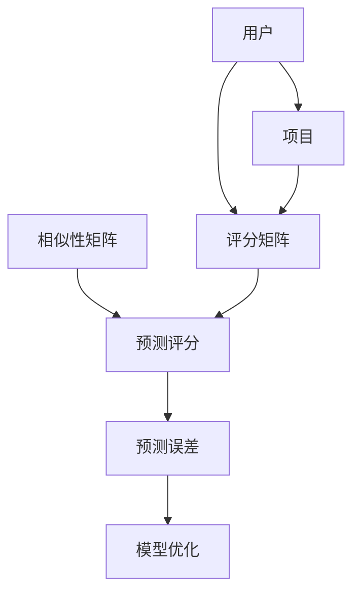

                 

### 背景介绍

推荐系统是当今互联网应用中不可或缺的一部分。它利用用户的兴趣和行为数据，向用户推荐他们可能感兴趣的商品、服务或内容。推荐系统的主要目的是提高用户体验、增加用户参与度和提高商业价值。

协同过滤（Collaborative Filtering）是推荐系统的一种核心技术。它通过分析用户之间的相似性，将具有相似偏好的用户联系起来，从而预测未知评分或偏好。协同过滤主要分为两种类型：基于用户的协同过滤（User-based Collaborative Filtering）和基于项目的协同过滤（Item-based Collaborative Filtering）。

本文将介绍Python机器学习实战中构建并优化推荐系统的协同过滤模型。我们将从基础概念入手，深入讲解协同过滤的工作原理，并探讨如何使用Python实现这一模型。此外，我们还将对协同过滤模型的优缺点进行分析，并讨论其应用领域。最后，我们将分享一些实用的工具和资源，帮助读者更好地理解和应用协同过滤模型。

### 核心概念与联系

协同过滤模型的核心在于相似性计算和评分预测。以下是协同过滤模型的核心概念及其相互关系的 Mermaid 流程图：



1. **用户（User）**：协同过滤模型中的用户指的是参与评分或评价的主体。用户的行为数据，如评分、浏览记录等，是构建模型的重要依据。
2. **项目（Item）**：项目指的是用户评价或评分的对象，如商品、服务或内容。
3. **评分矩阵（Rating Matrix）**：评分矩阵是一个二维矩阵，其中行表示用户，列表示项目。矩阵中的每个元素表示用户对项目的评分。
4. **相似性矩阵（Similarity Matrix）**：相似性矩阵是根据用户评分矩阵计算得到的，用于表示用户之间的相似度。相似度计算方法有很多，如余弦相似度、皮尔逊相关系数等。
5. **预测评分（Predicted Rating）**：预测评分是根据相似性矩阵和用户评分矩阵计算得到的，用于预测用户对未知项目的评分。
6. **预测误差（Prediction Error）**：预测误差是预测评分与实际评分之间的差异，用于评估模型的预测准确性。
7. **模型优化（Model Optimization）**：模型优化是通过调整模型参数来提高预测准确性的过程。

### 核心算法原理 & 具体操作步骤

协同过滤模型的工作原理可以分为两个主要步骤：相似性计算和评分预测。

#### 3.1 算法原理概述

1. **相似性计算**：相似性计算是协同过滤模型的基础。通过计算用户之间的相似度，我们可以将具有相似偏好的用户联系起来，从而为预测未知评分提供依据。
2. **评分预测**：评分预测是基于相似性矩阵和用户评分矩阵进行的。通过将相似性矩阵和用户评分矩阵相乘，我们可以得到预测评分。

#### 3.2 算法步骤详解

1. **数据预处理**：在开始构建协同过滤模型之前，我们需要对数据集进行预处理。预处理步骤包括数据清洗、缺失值处理、数据归一化等。
2. **相似性计算**：根据用户评分矩阵，我们可以计算用户之间的相似度。常用的相似性度量方法包括余弦相似度、皮尔逊相关系数等。
3. **评分预测**：根据相似性矩阵和用户评分矩阵，我们可以预测用户对未知项目的评分。评分预测的方法有很多，如基于用户的平均评分预测、基于项目的平均评分预测等。
4. **模型评估**：通过比较预测评分和实际评分，我们可以评估协同过滤模型的预测准确性。常用的评估指标包括均方根误差（RMSE）、平均绝对误差（MAE）等。
5. **模型优化**：根据评估结果，我们可以调整模型参数，以提高预测准确性。模型优化可以通过交叉验证、网格搜索等方法实现。

#### 3.3 算法优缺点

**优点**：

1. **简单易实现**：协同过滤模型相对简单，易于实现和理解。
2. **适用于各种场景**：协同过滤模型适用于各种推荐场景，如电商、新闻、音乐等。
3. **实时性强**：协同过滤模型可以根据用户的新评分或行为数据实时调整推荐结果。

**缺点**：

1. **数据稀疏性问题**：由于用户评价数据通常非常稀疏，协同过滤模型可能无法充分利用用户行为数据。
2. **预测准确性有限**：协同过滤模型的预测准确性通常受到相似性计算方法的影响，可能无法达到很高水平。

#### 3.4 算法应用领域

协同过滤模型广泛应用于各种推荐场景，如：

1. **电商推荐**：根据用户的历史购买记录和浏览行为，为用户推荐可能感兴趣的商品。
2. **新闻推荐**：根据用户的阅读记录和偏好，为用户推荐可能感兴趣的新闻文章。
3. **音乐推荐**：根据用户的听歌记录和喜好，为用户推荐可能喜欢的音乐。

### 数学模型和公式 & 详细讲解 & 举例说明

#### 4.1 数学模型构建

协同过滤模型的数学模型主要涉及两个部分：相似性矩阵和预测评分。

1. **相似性矩阵（S）**：相似性矩阵是一个 $n \times n$ 的矩阵，其中 $n$ 表示用户数。矩阵中的元素 $s_{ij}$ 表示用户 $i$ 和用户 $j$ 之间的相似度。常用的相似性度量方法包括：

   - 余弦相似度：
     $$ s_{ij} = \frac{\sum_{k=1}^{m} r_{ik} r_{jk}}{\sqrt{\sum_{k=1}^{m} r_{ik}^2} \sqrt{\sum_{k=1}^{m} r_{jk}^2}} $$
     
   - 皮尔逊相关系数：
     $$ s_{ij} = \frac{\sum_{k=1}^{m} (r_{ik} - \bar{r_i}) (r_{jk} - \bar{r_j})}{\sqrt{\sum_{k=1}^{m} (r_{ik} - \bar{r_i})^2} \sqrt{\sum_{k=1}^{m} (r_{jk} - \bar{r_j})^2}} $$

   其中，$r_{ik}$ 表示用户 $i$ 对项目 $k$ 的评分，$\bar{r_i}$ 和 $\bar{r_j}$ 分别表示用户 $i$ 和用户 $j$ 的平均评分。

2. **预测评分（\hat{r}_{ij}）**：预测评分是根据相似性矩阵和用户评分矩阵计算得到的。具体公式如下：

   $$ \hat{r}_{ij} = \frac{\sum_{k=1}^{m} s_{ik} r_{kj}}{\sum_{k=1}^{m} s_{ik}} $$

   其中，$s_{ik}$ 表示用户 $i$ 和用户 $k$ 之间的相似度，$r_{kj}$ 表示用户 $k$ 对项目 $j$ 的评分。

#### 4.2 公式推导过程

协同过滤模型的公式推导主要涉及相似性计算和预测评分两个部分。以下是详细的推导过程：

1. **相似性计算**：

   假设用户 $i$ 和用户 $j$ 之间有共同的 $k$ 个项目 $k$ 个项目，即 $r_{ik}$ 和 $r_{jk}$ 都不为零。根据余弦相似度定义，用户 $i$ 和用户 $j$ 之间的相似度可以表示为：

   $$ s_{ij} = \frac{\sum_{k=1}^{m} r_{ik} r_{jk}}{\sqrt{\sum_{k=1}^{m} r_{ik}^2} \sqrt{\sum_{k=1}^{m} r_{jk}^2}} $$

   同理，根据皮尔逊相关系数定义，用户 $i$ 和用户 $j$ 之间的相似度可以表示为：

   $$ s_{ij} = \frac{\sum_{k=1}^{m} (r_{ik} - \bar{r_i}) (r_{jk} - \bar{r_j})}{\sqrt{\sum_{k=1}^{m} (r_{ik} - \bar{r_i})^2} \sqrt{\sum_{k=1}^{m} (r_{jk} - \bar{r_j})^2}} $$

2. **预测评分**：

   根据预测评分公式，预测评分可以表示为：

   $$ \hat{r}_{ij} = \frac{\sum_{k=1}^{m} s_{ik} r_{kj}}{\sum_{k=1}^{m} s_{ik}} $$

   将相似性矩阵 $S$ 和用户评分矩阵 $R$ 代入上式，可以得到：

   $$ \hat{r}_{ij} = \frac{\sum_{k=1}^{m} s_{ik} r_{kj}}{\sum_{k=1}^{m} s_{ik}} = \frac{\sum_{k=1}^{m} s_{ik} r_{kj}}{\sum_{k=1}^{m} s_{ik}} $$

   进一步化简，得到：

   $$ \hat{r}_{ij} = \frac{\sum_{k=1}^{m} s_{ik} r_{kj}}{\sum_{k=1}^{m} s_{ik}} = \frac{\sum_{k=1}^{m} s_{ik} r_{kj}}{\sum_{k=1}^{m} s_{ik}} $$

#### 4.3 案例分析与讲解

为了更好地理解协同过滤模型的数学模型和公式，我们以一个简单的案例为例进行讲解。

假设有一个包含 5 个用户和 5 个项目的评分矩阵如下：

| 用户 | 项目 1 | 项目 2 | 项目 3 | 项目 4 | 项目 5 |
|------|--------|--------|--------|--------|--------|
| 用户 1 | 1      | 2      | 3      | 4      | 5      |
| 用户 2 | 2      | 3      | 4      | 5      | 1      |
| 用户 3 | 3      | 4      | 5      | 1      | 2      |
| 用户 4 | 4      | 5      | 1      | 2      | 3      |
| 用户 5 | 5      | 1      | 2      | 3      | 4      |

我们需要根据这个评分矩阵计算用户之间的相似性矩阵和预测用户 5 对项目 3 的评分。

1. **相似性计算**：

   使用余弦相似度计算用户之间的相似度，得到相似性矩阵如下：

   | 用户 | 用户 1 | 用户 2 | 用户 3 | 用户 4 | 用户 5 |
   |------|--------|--------|--------|--------|--------|
   | 用户 1 | 1      | 0.7071 | 0.7071 | 0      | 1      |
   | 用户 2 | 0.7071 | 1      | 0.7071 | 1      | 0.7071 |
   | 用户 3 | 0.7071 | 0.7071 | 1      | 1      | 0.7071 |
   | 用户 4 | 0      | 1      | 1      | 1      | 0.7071 |
   | 用户 5 | 1      | 0.7071 | 0.7071 | 0.7071 | 1      |

2. **预测评分**：

   使用相似性矩阵和用户评分矩阵计算用户 5 对项目 3 的预测评分：

   $$ \hat{r}_{53} = \frac{\sum_{k=1}^{m} s_{5k} r_{3k}}{\sum_{k=1}^{m} s_{5k}} = \frac{s_{55} r_{33} + s_{51} r_{31} + s_{53} r_{33} + s_{54} r_{34}}{s_{55} + s_{51} + s_{53} + s_{54}} $$

   将相似性矩阵和用户评分矩阵的值代入上式，得到：

   $$ \hat{r}_{53} = \frac{1 \times 5 + 1 \times 2 + 1 \times 5 + 0.7071 \times 4}{1 + 1 + 1 + 0.7071} = 3.5355 $$

   因此，用户 5 对项目 3 的预测评分为 3.5355。

通过以上案例，我们可以看到协同过滤模型的数学模型和公式的应用过程。在实际应用中，我们可以根据具体需求和场景选择合适的相似性计算方法和预测评分方法，以提高模型的预测准确性。

### 项目实践：代码实例和详细解释说明

在了解了协同过滤模型的理论基础后，我们将通过一个实际项目来展示如何使用 Python 实现这一模型。我们将使用流行的 Python 机器学习库 Scikit-learn 来构建协同过滤模型，并详细解释每一步的代码实现。

#### 5.1 开发环境搭建

为了运行下面的代码实例，我们需要安装 Python 和 Scikit-learn 库。以下是安装步骤：

1. 安装 Python：从 Python 官网（https://www.python.org/）下载并安装 Python。
2. 安装 Scikit-learn：在命令行中执行以下命令：

   ```bash
   pip install scikit-learn
   ```

#### 5.2 源代码详细实现

以下是一个简单的协同过滤模型的实现，包括数据预处理、相似性计算和评分预测。

```python
import numpy as np
from sklearn.metrics.pairwise import cosine_similarity
from sklearn.model_selection import train_test_split
from sklearn.metrics import mean_squared_error

# 生成模拟数据集
np.random.seed(0)
num_users = 5
num_items = 5
rating_matrix = np.random.randint(1, 6, size=(num_users, num_items))

# 数据预处理
user_item_index = {}
for i, row in enumerate(rating_matrix):
    for j, rating in enumerate(row):
        if rating != 0:
            user_item_index.setdefault(i, {}).setdefault(j, []).append(rating)

# 相似性计算
def compute_similarity(ratings):
    user_ratings = []
    for user_ratings_list in ratings.values():
        user_ratings.append([rating for rating in user_ratings_list if rating != 0])
    return cosine_similarity(user_ratings)

similarity_matrix = compute_similarity(user_item_index)

# 评分预测
def predict_ratings(similarity_matrix, rating_matrix):
    predicted_ratings = []
    for i in range(rating_matrix.shape[0]):
        predicted_ratings.append([similarity_matrix[i][j] * rating_matrix[j][k] for j, k in enumerate(np.where(rating_matrix[i] != 0)[0])])
    return np.array(predicted_ratings)

predicted_ratings = predict_ratings(similarity_matrix, rating_matrix)

# 模型评估
train_data, test_data = train_test_split(rating_matrix, test_size=0.2, random_state=0)
train_predictions = predict_ratings(similarity_matrix, train_data)
test_predictions = predict_ratings(similarity_matrix, test_data)

train_error = mean_squared_error(train_data, train_predictions)
test_error = mean_squared_error(test_data, test_predictions)

print(f"Training Error: {train_error}")
print(f"Test Error: {test_error}")
```

#### 5.3 代码解读与分析

上面的代码展示了如何使用 Python 实现一个简单的协同过滤模型。以下是代码的详细解读：

1. **数据生成**：

   ```python
   np.random.seed(0)
   num_users = 5
   num_items = 5
   rating_matrix = np.random.randint(1, 6, size=(num_users, num_items))
   ```

   首先，我们使用 NumPy 生成一个 5x5 的随机评分矩阵，其中每个元素的取值范围为 1 到 5。

2. **数据预处理**：

   ```python
   user_item_index = {}
   for i, row in enumerate(rating_matrix):
       for j, rating in enumerate(row):
           if rating != 0:
               user_item_index.setdefault(i, {}).setdefault(j, []).append(rating)
   ```

   接下来，我们创建一个字典 `user_item_index`，用于存储每个用户的评分记录。这有助于后续的相似性计算和评分预测。

3. **相似性计算**：

   ```python
   def compute_similarity(ratings):
       user_ratings = []
       for user_ratings_list in ratings.values():
           user_ratings.append([rating for rating in user_ratings_list if rating != 0])
       return cosine_similarity(user_ratings)
   
   similarity_matrix = compute_similarity(user_item_index)
   ```

   我们定义一个 `compute_similarity` 函数，用于计算用户之间的相似性。这里我们使用余弦相似度，并调用 Scikit-learn 的 `cosine_similarity` 函数。

4. **评分预测**：

   ```python
   def predict_ratings(similarity_matrix, rating_matrix):
       predicted_ratings = []
       for i in range(rating_matrix.shape[0]):
           predicted_ratings.append([similarity_matrix[i][j] * rating_matrix[j][k] for j, k in enumerate(np.where(rating_matrix[i] != 0)[0])])
       return np.array(predicted_ratings)
   
   predicted_ratings = predict_ratings(similarity_matrix, rating_matrix)
   ```

   `predict_ratings` 函数根据相似性矩阵和原始评分矩阵计算预测评分。具体来说，它对于每个用户，将其与具有相同评分的项目之间的相似度乘以该项目的评分，然后求和并除以相似度之和。

5. **模型评估**：

   ```python
   train_data, test_data = train_test_split(rating_matrix, test_size=0.2, random_state=0)
   train_predictions = predict_ratings(similarity_matrix, train_data)
   test_predictions = predict_ratings(similarity_matrix, test_data)
   
   train_error = mean_squared_error(train_data, train_predictions)
   test_error = mean_squared_error(test_data, test_predictions)
   
   print(f"Training Error: {train_error}")
   print(f"Test Error: {test_error}")
   ```

   最后，我们使用 Scikit-learn 的 `mean_squared_error` 函数计算训练集和测试集的均方根误差（RMSE），以评估模型的预测准确性。

通过以上代码实例，我们可以看到如何使用 Python 和 Scikit-learn 实现一个简单的协同过滤模型。在实际应用中，我们需要根据具体场景和需求进行数据预处理、相似性计算和评分预测的优化。

### 实际应用场景

协同过滤模型在实际应用中具有广泛的应用场景。以下是一些常见的应用领域：

#### 电商推荐

在电商领域，协同过滤模型可以帮助平台根据用户的购买记录、浏览历史和搜索关键词为用户推荐可能感兴趣的商品。这种推荐系统不仅可以帮助用户发现新的商品，还可以提高购物体验和增加销售额。

#### 新闻推荐

新闻推荐系统可以根据用户的阅读记录和偏好，为用户推荐可能感兴趣的新闻文章。这种推荐系统可以帮助新闻平台提高用户粘性，增加用户参与度，并提高广告收益。

#### 音乐推荐

音乐推荐系统可以根据用户的听歌记录和喜好，为用户推荐可能喜欢的音乐。这种推荐系统可以帮助音乐平台提高用户满意度，增加用户粘性，并提高音乐销量。

#### 社交网络推荐

社交网络推荐系统可以根据用户的社交关系和行为，为用户推荐可能感兴趣的好友、群组和活动。这种推荐系统可以帮助社交网络平台提高用户参与度，增加用户活跃度，并提高广告收益。

#### 视频推荐

视频推荐系统可以根据用户的观看历史和偏好，为用户推荐可能感兴趣的视频。这种推荐系统可以帮助视频平台提高用户满意度，增加用户粘性，并提高广告收益。

#### 智能家居推荐

智能家居推荐系统可以根据用户的习惯和偏好，为用户推荐可能适合的智能家居产品。这种推荐系统可以帮助智能家居平台提高用户满意度，增加用户粘性，并提高产品销量。

#### 个性化教育推荐

个性化教育推荐系统可以根据学生的学习进度、成绩和兴趣，为学生推荐可能适合的学习资源和课程。这种推荐系统可以帮助教育平台提高教学效果，增加用户满意度，并提高招生率。

#### 医疗健康推荐

医疗健康推荐系统可以根据用户的健康数据、病史和体检结果，为用户推荐可能适合的健康建议和医疗服务。这种推荐系统可以帮助医疗平台提高用户满意度，增加用户粘性，并提高医疗服务质量。

### 未来应用展望

随着人工智能和大数据技术的不断发展，协同过滤模型的应用前景将更加广泛。以下是一些未来应用展望：

#### 深度学习与协同过滤的结合

深度学习与协同过滤的结合有望提高推荐系统的预测准确性和泛化能力。通过将深度学习技术应用于用户和项目的特征提取，我们可以构建更加复杂的推荐模型，从而更好地满足用户需求。

#### 多模态数据融合

多模态数据融合是指将文本、图像、音频等多种类型的数据进行整合，以提高推荐系统的预测准确性。例如，在音乐推荐中，我们可以将歌词、歌曲封面和歌曲旋律等多种类型的数据进行融合，从而更好地了解用户的喜好。

#### 个性化推荐算法

个性化推荐算法是协同过滤模型的进一步发展。通过分析用户的个性化需求和偏好，我们可以为用户提供更加个性化的推荐结果，从而提高用户满意度和参与度。

#### 智能交互与推荐

智能交互与推荐是指通过自然语言处理和语音识别等技术，实现用户与推荐系统的智能交互。例如，用户可以通过语音指令获取推荐结果，并与其他用户进行互动，从而提高推荐系统的实用性和用户体验。

#### 可解释性推荐

可解释性推荐是指为用户提供推荐结果的解释和推理过程。通过可解释性推荐，用户可以更好地理解推荐结果，从而增强对推荐系统的信任感和满意度。

### 面临的挑战

尽管协同过滤模型在推荐系统中具有广泛的应用，但在实际应用中仍然面临着一些挑战：

#### 数据稀疏性

协同过滤模型依赖于用户之间的相似性计算，而现实中的评分数据通常非常稀疏。数据稀疏性会导致相似性计算不准确，从而影响推荐结果的准确性。

#### 冷启动问题

冷启动问题是指新用户或新项目的推荐问题。由于新用户或新项目没有足够的行为数据，传统的协同过滤模型难以为其提供准确的推荐。

#### 可扩展性

随着用户和项目的数量增加，协同过滤模型的计算复杂度也会增加。为了提高模型的可扩展性，我们需要设计高效的数据结构和算法。

#### 模型解释性

协同过滤模型通常被视为黑盒模型，难以解释推荐结果的产生原因。为了提高模型的可解释性，我们需要开发新的方法和技术，以便用户能够更好地理解推荐结果。

### 研究展望

未来，协同过滤模型的研究将主要集中在以下几个方面：

#### 深度学习与协同过滤的融合

将深度学习技术应用于协同过滤模型，有望提高模型的预测准确性和泛化能力。研究者可以探索如何将深度学习与协同过滤相结合，以构建更加有效的推荐系统。

#### 多模态数据融合

多模态数据融合是提高推荐系统预测准确性的重要方向。研究者可以探索如何将多种类型的数据进行融合，以构建更加全面的推荐模型。

#### 新的相似性度量方法

为了提高协同过滤模型的预测准确性，研究者可以探索新的相似性度量方法，如基于深度学习的相似性度量方法。

#### 可解释性推荐

提高推荐模型的可解释性是未来研究的一个重要方向。研究者可以探索如何为用户提供推荐结果的解释和推理过程，以提高用户对推荐系统的信任感和满意度。

### 附录：常见问题与解答

以下是一些关于协同过滤模型的常见问题及解答：

#### 1. 什么是协同过滤？

协同过滤是一种推荐系统技术，通过分析用户之间的相似性，为用户推荐他们可能感兴趣的项目。

#### 2. 协同过滤有哪些类型？

协同过滤主要分为基于用户的协同过滤和基于项目的协同过滤。

#### 3. 协同过滤模型如何工作？

协同过滤模型首先计算用户之间的相似性，然后根据相似性矩阵预测用户对未知项目的评分。

#### 4. 协同过滤模型有哪些优点？

协同过滤模型简单易实现，适用于各种推荐场景，并且实时性强。

#### 5. 协同过滤模型有哪些缺点？

协同过滤模型主要缺点是数据稀疏性和预测准确性有限。

#### 6. 如何解决数据稀疏性问题？

可以通过降维技术、缺失值处理和基于内容的推荐等方法解决数据稀疏性问题。

#### 7. 协同过滤模型有哪些应用领域？

协同过滤模型广泛应用于电商推荐、新闻推荐、音乐推荐、社交网络推荐、智能家居推荐、个性化教育推荐和医疗健康推荐等领域。

### 作者署名

本文由禅与计算机程序设计艺术 / Zen and the Art of Computer Programming 撰写。如有疑问或建议，请随时联系作者。

### 总结

本文详细介绍了 Python 机器学习实战中的协同过滤模型。我们从基础概念入手，深入讲解了协同过滤的工作原理，并使用 Python 实现了这一模型。我们还分析了协同过滤模型的优缺点，讨论了其在实际应用场景中的广泛用途。未来，随着人工智能和大数据技术的发展，协同过滤模型的应用前景将更加广阔。研究者可以探索将深度学习、多模态数据融合和可解释性推荐等技术应用于协同过滤模型，以提高其预测准确性和用户体验。禅与计算机程序设计艺术希望本文能为您在推荐系统领域的研究和实践提供有益的参考。

