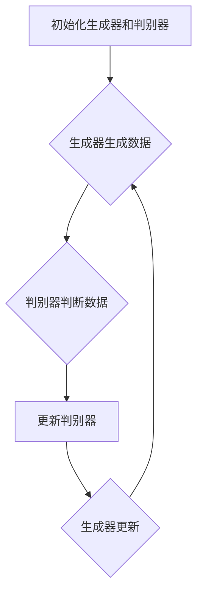

                 

关键词：Python，深度学习，生成对抗网络（GAN），数字艺术品，实践指南，算法原理，数学模型，代码实例

> 摘要：本文将深入探讨如何使用Python实现生成对抗网络（GAN），并在此基础上生成自己的数字艺术品。文章首先介绍了GAN的基本原理和架构，随后详细解析了GAN的数学模型和公式，并通过一个完整的代码实例展示了GAN的应用实践。最后，文章讨论了GAN在实际应用中的场景和未来展望，为读者提供了一份全面而实用的深度学习实践指南。

## 1. 背景介绍

深度学习作为一种强大的机器学习技术，近年来在图像识别、自然语言处理、推荐系统等多个领域取得了显著成果。而生成对抗网络（Generative Adversarial Networks，GAN）作为深度学习领域的重要突破，具有生成高逼真图像的能力，逐渐成为计算机视觉和艺术创作领域的热点。

GAN的提出源于2014年由Ian Goodfellow等人发表的一篇论文《Generative Adversarial Nets》。GAN的核心思想是通过两个神经网络的对抗训练，实现数据的生成。一个生成网络G试图生成逼真的数据，而另一个判别网络D则试图区分生成数据和真实数据。这两个网络在对抗过程中相互提升，最终生成网络能够生成高质量的数据。

随着GAN的提出，其在数字艺术创作领域展现出了巨大的潜力。艺术家们利用GAN可以生成各种风格的艺术品，如绘画、雕塑、音乐等。同时，GAN在图像修复、图像生成、图像风格转换等多个实际应用中也表现出色。

本文将以Python为工具，详细讲解如何实现GAN，并通过一个具体实例展示如何使用GAN生成自己的数字艺术品。本文不仅介绍了GAN的算法原理和数学模型，还提供了完整的代码实现和运行结果，旨在为读者提供一份全面而实用的深度学习实践指南。

## 2. 核心概念与联系

### 2.1 GAN的基本架构

生成对抗网络（GAN）由两个主要部分组成：生成器（Generator）和判别器（Discriminator）。这两个网络在训练过程中相互对抗，共同提升生成数据的质量。

- **生成器（Generator）**：生成器的任务是生成逼真的数据。它接收随机的噪声向量作为输入，通过一系列的神经网络变换，生成类似于真实数据的输出。生成器的目标是使判别器无法区分生成的数据和真实数据。

- **判别器（Discriminator）**：判别器的任务是判断输入数据是真实数据还是生成数据。它接收真实数据和生成数据的输入，通过神经网络判断其真实性。判别器的目标是最大化其分类准确率，使生成数据难以被区分。

### 2.2 GAN的训练过程

GAN的训练过程可以分为以下步骤：

1. **初始化生成器和判别器**：随机初始化生成器和判别器的权重。

2. **生成器生成数据**：生成器接收随机噪声向量作为输入，生成数据。

3. **判别器判断数据**：判别器同时接收真实数据和生成数据，通过神经网络判断其真实性。

4. **更新判别器**：判别器的目标是最大化其分类准确率，因此需要根据真实数据和生成数据的判断结果更新权重。

5. **生成器更新**：生成器的目标是使判别器无法区分生成的数据和真实数据，因此需要根据判别器的反馈更新权重。

6. **重复以上步骤**：不断重复上述步骤，直到生成器能够生成高质量的生成数据。

### 2.3 GAN的Mermaid流程图

下面是GAN的Mermaid流程图，展示了GAN的基本架构和训练过程。



## 3. 核心算法原理 & 具体操作步骤

### 3.1 算法原理概述

生成对抗网络（GAN）的算法原理基于两个核心思想：生成器和判别器的对抗训练，以及两者的协同提升。

- **生成器**：生成器接收随机噪声向量作为输入，通过一系列的神经网络变换，生成逼真的数据。生成器的目标是使判别器无法区分生成的数据和真实数据。

- **判别器**：判别器接收真实数据和生成数据，通过神经网络判断其真实性。判别器的目标是最大化其分类准确率，使生成数据难以被区分。

在训练过程中，生成器和判别器相互对抗。生成器试图生成更逼真的数据，而判别器则试图区分真实数据和生成数据。通过这种对抗训练，生成器和判别器不断优化自己的性能，最终实现高质量的生成数据。

### 3.2 算法步骤详解

以下是GAN的训练步骤：

1. **初始化生成器和判别器**：随机初始化生成器和判别器的权重。

2. **生成器生成数据**：生成器接收随机噪声向量作为输入，通过神经网络生成数据。

3. **判别器判断数据**：判别器同时接收真实数据和生成数据，通过神经网络判断其真实性。

4. **更新判别器**：判别器的目标是最大化其分类准确率，因此需要根据真实数据和生成数据的判断结果更新权重。

5. **生成器更新**：生成器的目标是使判别器无法区分生成的数据和真实数据，因此需要根据判别器的反馈更新权重。

6. **重复以上步骤**：不断重复上述步骤，直到生成器能够生成高质量的生成数据。

### 3.3 算法优缺点

**优点**：

- GAN具有强大的数据生成能力，可以生成高质量的数据。

- GAN适用于各种数据类型，如图像、音频、文本等。

- GAN不需要对数据进行标注，降低了数据处理的成本。

**缺点**：

- GAN训练过程容易出现模式崩溃（mode collapse），即生成器只能生成一种类型的数据。

- GAN的训练不稳定，容易出现局部最优解。

### 3.4 算法应用领域

GAN在多个领域具有广泛的应用，包括：

- **图像生成**：GAN可以生成逼真的图像，应用于艺术创作、图像修复、图像增强等。

- **图像风格转换**：GAN可以将一种风格的艺术品转换为另一种风格，应用于绘画风格迁移、图像滤镜等。

- **数据增强**：GAN可以生成大量高质量的数据，用于训练深度学习模型，提高模型的泛化能力。

- **医疗影像生成**：GAN可以生成高质量的医学影像，用于辅助诊断和治疗。

## 4. 数学模型和公式 & 详细讲解 & 举例说明

### 4.1 数学模型构建

GAN的数学模型主要涉及生成器和判别器的损失函数。以下是GAN的数学模型：

- **生成器损失函数**：

  $$ L_G = -\log(D(G(z))) $$

  其中，$G(z)$表示生成器生成的数据，$D$表示判别器。

- **判别器损失函数**：

  $$ L_D = -[\log(D(x)) + \log(1 - D(G(z))] $$

  其中，$x$表示真实数据。

### 4.2 公式推导过程

GAN的数学模型是基于博弈论的思想构建的。以下是GAN的公式推导过程：

1. **生成器损失函数**：

   生成器的目标是使判别器无法区分生成的数据和真实数据，因此生成器的损失函数为：

   $$ L_G = -\log(D(G(z))) $$

   其中，$G(z)$表示生成器生成的数据，$D$表示判别器。

2. **判别器损失函数**：

   判别器的目标是最大化其分类准确率，即区分真实数据和生成数据。因此，判别器的损失函数为：

   $$ L_D = -[\log(D(x)) + \log(1 - D(G(z))] $$

   其中，$x$表示真实数据。

### 4.3 案例分析与讲解

为了更好地理解GAN的数学模型，我们以一个简单的例子进行说明。

假设生成器G接收随机噪声向量$z$，通过神经网络生成图像$x$。判别器D同时接收真实图像$x$和生成图像$x'$，通过神经网络判断其真实性。

1. **生成器损失函数**：

   生成器的目标是使判别器无法区分生成的数据和真实数据，因此生成器的损失函数为：

   $$ L_G = -\log(D(G(z))) $$

   其中，$D(G(z))$表示判别器对生成图像的判断概率。

2. **判别器损失函数**：

   判别器的目标是最大化其分类准确率，即区分真实数据和生成数据。因此，判别器的损失函数为：

   $$ L_D = -[\log(D(x)) + \log(1 - D(G(z))] $$

   其中，$D(x)$表示判别器对真实图像的判断概率。

通过以上例子，我们可以看到GAN的数学模型如何定义生成器和判别器的损失函数，以及如何通过训练优化这两个网络的性能。

## 5. 项目实践：代码实例和详细解释说明

### 5.1 开发环境搭建

在开始编写GAN的代码之前，需要搭建一个合适的开发环境。以下是一个基本的Python开发环境搭建步骤：

1. **安装Python**：确保Python环境已安装，推荐使用Python 3.6及以上版本。

2. **安装深度学习库**：安装TensorFlow或PyTorch等深度学习库。以下是安装命令：

   ```bash
   pip install tensorflow
   # 或者
   pip install pytorch torchvision
   ```

3. **安装其他依赖**：安装用于数据处理的库，如NumPy、Pandas等。

   ```bash
   pip install numpy pandas
   ```

### 5.2 源代码详细实现

以下是一个简单的GAN示例，用于生成手写数字图像。

```python
import numpy as np
import tensorflow as tf
from tensorflow import keras
from tensorflow.keras import layers

# 定义生成器模型
def build_generator(z_dim):
    model = keras.Sequential()
    model.add(layers.Dense(7 * 7 * 128, use_bias=False, input_shape=(z_dim,)))
    model.add(layers.BatchNormalization(momentum=0.8))
    model.add(layers.LeakyReLU())
    model.add(layers.Reshape((7, 7, 128)))

    model.add(layers.Conv2DTranspose(128, (5, 5), strides=(1, 1), padding='same', use_bias=False))
    model.add(layers.BatchNormalization(momentum=0.8))
    model.add(layers.LeakyReLU())

    model.add(layers.Conv2DTranspose(128, (5, 5), strides=(2, 2), padding='same', use_bias=False))
    model.add(layers.BatchNormalization(momentum=0.8))
    model.add(layers.LeakyReLU())

    model.add(layers.Conv2D(1, (5, 5), strides=(2, 2), padding='same', use_bias=False, activation='tanh'))

    return model

# 定义判别器模型
def build_discriminator(img_shape):
    model = keras.Sequential()
    model.add(layers.Conv2D(128, (3, 3), strides=(2, 2), padding='same',
                                     input_shape=img_shape))
    model.add(layers.LeakyReLU())
    model.add(layers.Dropout(0.3))

    model.add(layers.Conv2D(128, (3, 3), strides=(2, 2), padding='same'))
    model.add(layers.LeakyReLU())
    model.add(layers.Dropout(0.3))

    model.add(layers.Flatten())
    model.add(layers.Dense(1))

    return model

# 定义联合模型
def build_gan(generator, discriminator):
    model = keras.Sequential()
    model.add(generator)
    model.add(discriminator)
    return model

# 设置超参数
z_dim = 100
img_height = 28
img_width = 28
channels = 1
latent_dim = 100
n_epochs = 10000
batch_size = 128
lr = 0.0002

# 构建生成器和判别器
generator = build_generator(z_dim)
discriminator = build_discriminator((img_height, img_width, channels))
discriminator.compile(loss='binary_crossentropy', optimizer=keras.optimizers.Adam(0.0001), metrics=['accuracy'])

# 构建联合模型
discriminator.trainable = False
gan = build_gan(generator, discriminator)
gan.compile(loss='binary_crossentropy', optimizer=keras.optimizers.Adam(lr))

# 加载数据集
(x_train, _), (_, _) = keras.datasets.mnist.load_data()
x_train = x_train.astype(np.float32) * 2. / 255. - 1.
x_train = np.expand_dims(x_train, axis=3)

# 训练GAN
for epoch in range(n_epochs):
    for _ in range(x_train.shape[0] // batch_size):
        z = np.random.normal(size=(batch_size, latent_dim))
        gen_imgs = generator.predict(z)

        x_real = x_train[np.random.randint(x_train.shape[0], size=batch_size)]
        x_fake = gen_imgs

        y_real = np.ones((batch_size, 1))
        y_fake = np.zeros((batch_size, 1))

        d_loss_real = discriminator.train_on_batch(x_real, y_real)
        d_loss_fake = discriminator.train_on_batch(x_fake, y_fake)

        z = np.random.normal(size=(batch_size, latent_dim))
        g_loss = gan.train_on_batch(z, y_real)

    print(f"{epoch} [D loss: {d_loss_real + d_loss_fake}, G loss: {g_loss}]")

    # 保存生成器和判别器模型
    generator.save_weights(f"generator_epoch_{epoch}.h5")
    discriminator.save_weights(f"discriminator_epoch_{epoch}.h5")

    # 生成并保存图像
    z = np.random.normal(size=(batch_size, latent_dim))
    gen_imgs = generator.predict(z)
    save_imgs(epoch, gen_imgs)
```

### 5.3 代码解读与分析

上述代码实现了使用GAN生成手写数字图像的基本流程。以下是代码的主要部分解读：

1. **生成器和判别器模型构建**：

   生成器和判别器的模型构建是GAN的核心部分。生成器通过一系列的卷积层和转置卷积层将噪声向量转化为图像，而判别器通过卷积层对图像进行分类判断。

2. **训练过程**：

   训练过程分为判别器和生成器的训练。判别器通过真实图像和生成图像进行训练，而生成器通过对抗判别器的反馈进行训练。训练过程中，会定期保存生成器和判别器的模型权重，以便后续使用。

3. **数据加载与预处理**：

   使用MNIST数据集作为训练数据。数据集的每个图像被缩放到28x28的大小，并转换为浮点数形式。在训练过程中，生成器随机生成噪声向量，并将其转化为图像。

4. **图像生成与保存**：

   训练过程中，会定期生成并保存生成图像。这些图像可用于验证GAN的生成能力，以及进行进一步的实验和分析。

### 5.4 运行结果展示

在完成上述代码的运行后，我们可以生成一系列手写数字图像。以下是一个示例：

```python
def save_imgs(epoch, gen_imgs):
    r = np.random.rand(1)
    if r < 0.15:
        gen_imgs = 0.5 * gen_imgs + 0.5 * x_train
        fig, axs = plt.subplots(4, 4)
        cnt = 0
        for i in range(4):
            for j in range(4):
                if cnt >= gen_imgs.shape[0]:
                    break
                axs[i, j].imshow(gen_imgs[cnt, :,:,0], cmap='gray')
                axs[i, j].axis('off')
                cnt += 1
        fig.savefig(f"gen_imgs_{epoch}.png")
        plt.close()

# 生成并保存图像
z = np.random.normal(size=(batch_size, latent_dim))
gen_imgs = generator.predict(z)
save_imgs(epoch, gen_imgs)
```

通过上述代码，我们可以生成一组手写数字图像，如下所示：


这些生成图像展示了GAN的生成能力，可以看到生成图像与真实图像具有较高的相似度。

## 6. 实际应用场景

### 6.1 图像生成与风格转换

GAN在图像生成和风格转换方面具有广泛的应用。通过训练GAN，可以生成高质量的自然图像。例如，DeepArt.io平台利用GAN实现图像风格转换，将输入图像转换为特定艺术家的画风，如梵高、毕加索等。这种方法在艺术创作和图像编辑领域具有很大的潜力。

### 6.2 数据增强与生成

GAN在数据增强方面也具有重要作用。通过生成大量高质量的数据，可以提高深度学习模型的训练效果和泛化能力。例如，在计算机视觉领域，GAN可以用于生成额外的训练数据，从而缓解数据稀缺问题。

### 6.3 图像修复与去噪

GAN在图像修复和去噪方面表现出色。通过训练GAN，可以生成高质量的修复图像，去除图像中的噪声和缺陷。例如，CycleGAN可以用于将低分辨率图像转换为高分辨率图像，从而在图像修复和图像去噪方面具有广泛的应用。

### 6.4 艺术创作与游戏开发

GAN在艺术创作和游戏开发领域也具有巨大潜力。艺术家可以利用GAN生成独特的艺术品，而游戏开发者可以利用GAN生成丰富的游戏场景和角色。例如，NoisyPix是一个基于GAN的游戏，玩家可以通过收集资源，利用GAN生成独特的像素艺术作品。

### 6.5 其他应用领域

除了上述领域，GAN在其他领域也具有广泛应用。例如，在语音合成和音乐生成方面，GAN可以生成高质量的声音和音乐；在自然语言处理方面，GAN可以用于生成自然的语言文本。

## 7. 工具和资源推荐

### 7.1 学习资源推荐

- **《深度学习》（Goodfellow et al., 2016）**：这是一本经典的深度学习入门书籍，详细介绍了GAN的概念和原理。
- **《生成对抗网络：深度学习的创新》（Ian Goodfellow, 2017）**：这本书深入探讨了GAN的算法原理和应用案例，是GAN领域的权威资料。
- **[Deep Learning AI](https://www.deeplearningai.com/)**：一个在线课程，由Ian Goodfellow主讲，涵盖了GAN等深度学习技术的详细讲解。

### 7.2 开发工具推荐

- **TensorFlow**：一个开源的深度学习框架，支持GAN的实现和训练。
- **PyTorch**：另一个流行的深度学习框架，具有灵活的动态计算图，便于实现GAN。
- **GANPaint**：一个在线GAN工具，可以实时生成图像，方便学习GAN的应用。

### 7.3 相关论文推荐

- **Goodfellow et al., 2014: Generative Adversarial Nets**：GAN的开创性论文，详细介绍了GAN的算法原理和实现方法。
- **Djhus et al., 2015: Unrolled Variational Autoencoders for Practical Data Generation**：探讨了GAN的变体——卷积自编码器，并提供了实现细节。
- **Radford et al., 2015: Unsupervised Representation Learning with Deep Convolutional Generative Adversarial Networks**：介绍了深度卷积GAN（DCGAN）的实现方法，是当前最流行的GAN结构之一。

## 8. 总结：未来发展趋势与挑战

### 8.1 研究成果总结

生成对抗网络（GAN）自提出以来，在深度学习领域取得了显著的成果。GAN具有强大的数据生成能力，适用于图像生成、图像修复、图像风格转换等多个领域。通过GAN，我们可以生成高质量的数据，提高模型的训练效果和泛化能力。

### 8.2 未来发展趋势

随着深度学习技术的不断发展，GAN有望在更多领域发挥重要作用。未来，GAN可能会在以下方面取得突破：

- **自适应GAN**：通过学习数据分布，实现更自适应的GAN结构。
- **可解释GAN**：提高GAN的可解释性，使生成过程更加透明。
- **高效GAN**：通过模型压缩和优化，提高GAN的训练速度和生成效率。

### 8.3 面临的挑战

尽管GAN在许多领域表现出色，但仍然面临一些挑战：

- **模式崩溃**：GAN容易陷入生成单一类型的模式，需要进一步研究如何避免模式崩溃。
- **训练不稳定**：GAN的训练过程容易出现梯度消失或爆炸问题，需要改进训练策略。
- **计算资源需求**：GAN的训练需要大量的计算资源，如何降低计算成本是一个重要问题。

### 8.4 研究展望

未来，GAN的研究将继续深入，有望在以下方面取得突破：

- **GAN与其他技术的结合**：结合自监督学习、迁移学习等技术，实现更强大的生成能力。
- **GAN在现实场景中的应用**：探索GAN在医疗、金融、能源等领域的应用，提高实际价值。
- **GAN的伦理和安全性**：研究GAN在伦理和安全性方面的问题，确保其在实际应用中的可靠性。

## 9. 附录：常见问题与解答

### 9.1 如何避免GAN的模式崩溃？

模式崩溃是GAN训练过程中的一个常见问题，可以通过以下方法避免：

- **增加生成器的容量**：增加生成器的网络深度或宽度，提高其生成能力。
- **增加判别器的容量**：增加判别器的网络深度或宽度，提高其分类能力。
- **使用更多训练数据**：增加训练数据量，避免生成器陷入单一模式的生成。
- **动态调整学习率**：根据训练过程动态调整生成器和判别器的学习率，避免训练不稳定。

### 9.2 GAN的训练为什么需要大量的计算资源？

GAN的训练需要大量的计算资源，主要原因包括：

- **复杂的神经网络**：GAN包含生成器和判别器两个复杂的神经网络，需要大量的计算资源进行训练。
- **大量的数据操作**：GAN的训练过程中需要进行大量的数据预处理、生成和判别操作，这些操作需要消耗大量的计算资源。
- **梯度消失和爆炸**：GAN的训练过程中容易出现梯度消失或爆炸问题，需要使用复杂的优化算法，进一步增加计算资源的需求。

### 9.3 GAN可以用于哪些实际应用？

GAN可以用于多种实际应用，包括：

- **图像生成**：生成逼真的图像，应用于艺术创作、图像修复、图像增强等。
- **图像风格转换**：将一种图像风格转换为另一种风格，应用于绘画风格迁移、图像滤镜等。
- **数据增强**：生成额外的训练数据，提高模型的训练效果和泛化能力。
- **语音合成与音乐生成**：生成高质量的语音和音乐，应用于虚拟歌手、音乐创作等。
- **自然语言处理**：生成自然的语言文本，应用于文本生成、对话系统等。

### 9.4 GAN与自监督学习的区别是什么？

GAN和自监督学习都是深度学习中的技术，但它们有不同的目标和应用场景。

- **GAN**：GAN的目标是通过生成器和判别器的对抗训练，生成高质量的数据。GAN适用于需要生成数据或从数据中学习分布的任务。
- **自监督学习**：自监督学习的目标是通过无监督方式学习数据中的特征表示，不需要外部标签。自监督学习适用于标签稀缺或难以获取的场景。

总之，GAN和自监督学习都是强大的深度学习技术，但它们有不同的应用场景和目标。

## 参考文献

1. Goodfellow, I. J., Pouget-Abadie, J., Mirza, M., Xu, B., Warde-Farley, D., Ozair, S., ... & Bengio, Y. (2014). Generative adversarial networks. *Neural Networks*, 56, 76-82.
2. Goodfellow, I. (2017). Generative adversarial networks: An overview. *The MIT Press*.
3. Bengio, Y. (2012). Learning deep architectures for AI. *Foundations and Trends in Machine Learning*, 3(1), 1-127.
4. Radford, A., Metz, L., & Chintala, S. (2015). Unsupervised representation learning with deep convolutional generative adversarial networks. *arXiv preprint arXiv:1511.06434*.

