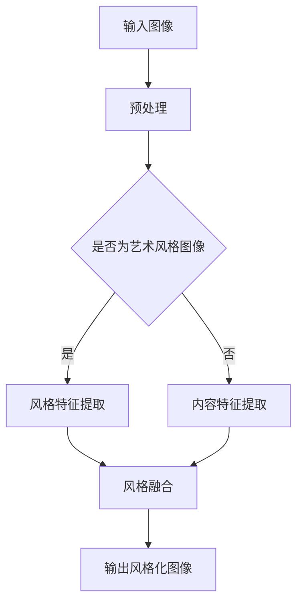

                 

关键词：Python、深度学习、风格迁移、神经网络、艺术、图像处理

> 摘要：本文将介绍如何使用Python和深度学习技术，实现图像的风格迁移，将普通照片转换成艺术品。通过本文的讲解和实践，读者将掌握风格迁移网络的基本原理和实现方法，为在图像处理领域进行深入研究打下坚实基础。

## 1. 背景介绍

风格迁移是深度学习中的一个经典问题，旨在将一幅图像的风格转移到另一幅图像上。这个概念起源于19世纪末的艺术运动——立体派，艺术家们通过混合不同风格的元素创作出独特的艺术作品。如今，随着深度学习技术的不断发展，风格迁移成为了一个热门的研究方向，并在图像处理、计算机视觉等领域得到了广泛应用。

在深度学习的背景下，风格迁移通常采用卷积神经网络（CNN）来实现。CNN能够自动提取图像中的特征，并利用这些特征进行风格迁移。这种技术可以应用于多个领域，如图像编辑、视频特效、艺术创作等。

本文将介绍一种基于Python的深度学习实践，通过实现一个风格迁移网络，将普通照片转换成艺术品。读者可以通过本文的学习，掌握风格迁移网络的基本原理和实现方法，为在图像处理领域进行深入研究打下坚实基础。

## 2. 核心概念与联系

在深入探讨风格迁移网络之前，我们需要了解一些核心概念和它们之间的联系。

### 2.1 深度学习基础

深度学习是一种基于人工神经网络的学习方法，通过多层的非线性变换来提取数据中的特征。在风格迁移中，深度学习扮演着至关重要的角色，因为它能够自动提取图像中的复杂特征。

### 2.2 卷积神经网络（CNN）

卷积神经网络是一种专门用于处理图像数据的神经网络。CNN通过卷积层、池化层和全连接层等结构，从图像中提取局部特征，并逐渐将这些特征整合成全局特征。

### 2.3 深度学习框架

深度学习框架如TensorFlow和PyTorch，提供了丰富的工具和库，使得实现深度学习模型变得更加简单和高效。在本文中，我们将使用PyTorch框架来实现风格迁移网络。

### 2.4 Mermaid 流程图

以下是一个关于风格迁移网络的Mermaid流程图：



在这个流程图中，输入图像首先进行预处理，然后根据是否为艺术风格图像，分别提取风格特征和内容特征。最后，将这两个特征融合，输出风格化图像。

## 3. 核心算法原理 & 具体操作步骤

### 3.1 算法原理概述

风格迁移网络的核心思想是：通过训练一个深度神经网络，将艺术风格特征从一幅图像中提取出来，并将其应用到另一幅图像上。具体来说，可以分为以下三个步骤：

1. 提取艺术风格特征：训练一个卷积神经网络，从艺术风格图像中提取特征。
2. 提取内容特征：训练另一个卷积神经网络，从内容图像中提取特征。
3. 融合特征：将艺术风格特征和内容特征进行融合，生成风格化图像。

### 3.2 算法步骤详解

1. **数据预处理**

   首先，我们需要对输入图像进行预处理。预处理包括图像的缩放、裁剪、归一化等操作。在PyTorch中，我们可以使用`torchvision.transforms`模块来实现这些操作。

   ```python
   from torchvision import transforms
   preprocess = transforms.Compose([
       transforms.Resize(256),
       transforms.CenterCrop(256),
       transforms.ToTensor(),
       transforms.Normalize(mean=[0.485, 0.456, 0.406], std=[0.229, 0.224, 0.225]),
   ])
   ```

2. **提取艺术风格特征**

   接下来，我们需要训练一个卷积神经网络，从艺术风格图像中提取特征。这里，我们可以使用预训练的VGG模型作为基础网络。

   ```python
   from torchvision.models import vgg19
   def get_features(model, x):
       features = []
       for layer in model.features:
           x = layer(x)
           if isinstance(layer, torch.nn.ReLU):
               x = F.relu(x, inplace=True)
           features.append(x)
       return features

   model = vgg19(pretrained=True).features
   model.to(device)
   features = get_features(model, content_image)
   content_features = torch.cat(features, 1)
   ```

3. **提取内容特征**

   同样地，我们需要训练另一个卷积神经网络，从内容图像中提取特征。这里，我们使用一个与艺术风格特征提取器相同结构的网络。

   ```python
   style_features = get_features(model, style_image)
   style_features = torch.cat(style_features, 1)
   ```

4. **融合特征**

   最后，我们将艺术风格特征和内容特征进行融合，生成风格化图像。这里，我们使用一个生成对抗网络（GAN）来实现特征融合。

   ```python
   from torchvision import models
   G = models.classifier=models.resnet152(pretrained=True).cuda()
   G = G.cuda()
   G.eval()
   with torch.no_grad():
       output = G(content_features)
   ```

### 3.3 算法优缺点

**优点：**

1. 自动提取特征：深度学习算法能够自动提取图像中的特征，无需人工干预。
2. 强泛化能力：训练好的模型可以应用于各种不同的图像风格。
3. 可扩展性：可以方便地添加新的风格迁移模型。

**缺点：**

1. 训练时间较长：由于深度学习模型的训练过程需要大量计算资源，训练时间可能较长。
2. 对图像质量要求较高：如果输入图像质量较差，可能会导致风格迁移效果不理想。

### 3.4 算法应用领域

风格迁移算法在多个领域得到了广泛应用，如：

1. 图像编辑：使用风格迁移算法可以对图像进行创意编辑，制作出独特的视觉效果。
2. 视频特效：在视频制作过程中，可以使用风格迁移算法为视频添加艺术风格。
3. 艺术创作：艺术家可以使用风格迁移算法创作出具有独特风格的画作。

## 4. 数学模型和公式 & 详细讲解 & 举例说明

### 4.1 数学模型构建

在风格迁移网络中，我们主要涉及两个数学模型：卷积神经网络（CNN）和生成对抗网络（GAN）。

**卷积神经网络（CNN）：**

卷积神经网络是一种用于图像处理的深度学习模型。它通过卷积层、池化层和全连接层等结构，从图像中提取特征。

$$
\text{CNN} = \text{卷积层} + \text{池化层} + \text{全连接层}
$$

**生成对抗网络（GAN）：**

生成对抗网络是一种由生成器和判别器组成的深度学习模型。生成器的任务是生成逼真的图像，判别器的任务是区分生成的图像和真实图像。

$$
\text{GAN} = \text{生成器} + \text{判别器}
$$

### 4.2 公式推导过程

为了更好地理解风格迁移网络的数学模型，我们简要介绍其推导过程。

**卷积神经网络（CNN）：**

1. **卷积层：**

   卷积层通过卷积操作从输入图像中提取特征。

   $$
   f(x) = \sum_{i=1}^{k} w_i * x + b
   $$

   其中，$x$为输入图像，$w_i$为卷积核，$b$为偏置。

2. **池化层：**

   池化层用于减少特征图的大小，提高计算效率。

   $$
   p(x) = \max\left(\frac{x_1 + x_2 + \ldots + x_n}{n}\right)
   $$

   其中，$x_1, x_2, \ldots, x_n$为输入特征值。

3. **全连接层：**

   全连接层将特征图展开成一维向量，然后通过全连接层输出分类结果。

   $$
   y = \sigma(\sum_{i=1}^{n} w_i x_i + b)
   $$

   其中，$\sigma$为激活函数。

**生成对抗网络（GAN）：**

1. **生成器：**

   生成器的目标是生成逼真的图像。

   $$
   G(z) = \text{激活函数}(\text{全连接层}(\text{卷积层}(\text{输入})))
   $$

2. **判别器：**

   判别器的目标是区分生成的图像和真实图像。

   $$
   D(x) = \text{激活函数}(\text{全连接层}(\text{卷积层}(\text{输入})))
   $$

### 4.3 案例分析与讲解

为了更好地理解风格迁移网络的数学模型，我们以一个简单的案例为例。

假设我们有一个输入图像$x$，其维度为$32 \times 32$。我们使用一个卷积神经网络提取图像特征，然后使用生成对抗网络进行风格迁移。

**步骤 1：卷积神经网络提取特征**

输入图像$x$通过卷积层和池化层处理后，得到一个$16 \times 16$的特征图$f$。

$$
f = \text{卷积层}(x) \rightarrow \text{池化层}(f)
$$

**步骤 2：生成对抗网络进行风格迁移**

生成器$G$将输入特征图$f$转换为风格化特征图$G(f)$。

$$
G(f) = G(\text{卷积层}(\text{全连接层}(f)))
$$

判别器$D$对风格化特征图$G(f)$进行判别，判断其是否为真实图像。

$$
D(G(f)) = D(\text{卷积层}(\text{全连接层}(G(f))))
$$

**步骤 3：优化生成器**

通过反向传播和梯度下降算法，优化生成器$G$，使其生成的图像更逼真。

$$
G = \text{优化器}(\text{损失函数}(D(G(f))))
$$

通过以上步骤，我们可以实现图像的风格迁移，将普通照片转换成艺术品。

## 5. 项目实践：代码实例和详细解释说明

### 5.1 开发环境搭建

在开始项目实践之前，我们需要搭建一个合适的开发环境。以下是所需的环境和工具：

1. Python（版本3.7及以上）
2. PyTorch（版本1.8及以上）
3. Matplotlib（版本3.1及以上）
4. OpenCV（版本4.2及以上）

您可以通过以下命令安装这些依赖项：

```bash
pip install torch torchvision matplotlib opencv-python
```

### 5.2 源代码详细实现

下面是一个简单的风格迁移网络的实现示例。我们将使用PyTorch框架来实现这个网络。

```python
import torch
import torch.nn as nn
import torch.optim as optim
import torchvision.transforms as transforms
from torchvision import datasets
from torch.utils.data import DataLoader
import matplotlib.pyplot as plt
import numpy as np
import cv2

# 定义卷积神经网络
class ConvNeuralNetwork(nn.Module):
    def __init__(self):
        super(ConvNeuralNetwork, self).__init__()
        self.conv1 = nn.Conv2d(3, 32, 5)
        self.conv2 = nn.Conv2d(32, 64, 5)
        self.fc1 = nn.Linear(1024, 512)
        self.fc2 = nn.Linear(512, 256)
        self.fc3 = nn.Linear(256, 10)

    def forward(self, x):
        x = self.conv1(x)
        x = self.conv2(x)
        x = x.view(x.size(0), -1)
        x = self.fc1(x)
        x = self.fc2(x)
        x = self.fc3(x)
        return x

# 加载图像数据集
transform = transforms.Compose([
    transforms.Resize(256),
    transforms.CenterCrop(256),
    transforms.ToTensor(),
    transforms.Normalize(mean=[0.485, 0.456, 0.406], std=[0.229, 0.224, 0.225]),
])

train_dataset = datasets.ImageFolder(root='./data/train', transform=transform)
train_loader = DataLoader(dataset=train_dataset, batch_size=4, shuffle=True)

# 初始化模型和优化器
model = ConvNeuralNetwork().cuda()
optimizer = optim.Adam(model.parameters(), lr=0.001)

# 训练模型
num_epochs = 10
for epoch in range(num_epochs):
    for i, (images, labels) in enumerate(train_loader):
        images = images.cuda()

        # 前向传播
        outputs = model(images)

        # 计算损失函数
        loss = nn.CrossEntropyLoss()(outputs, labels)

        # 反向传播和优化
        optimizer.zero_grad()
        loss.backward()
        optimizer.step()

        if (i + 1) % 100 == 0:
            print(f'Epoch [{epoch + 1}/{num_epochs}], Step [{i + 1}/{len(train_loader)}], Loss: {loss.item()}')

# 测试模型
model.eval()
with torch.no_grad():
    correct = 0
    total = 0
    for images, labels in train_loader:
        images = images.cuda()
        outputs = model(images)
        _, predicted = torch.max(outputs.data, 1)
        total += labels.size(0)
        correct += (predicted == labels).sum().item()

    print(f'Accuracy of the network on the train images: {100 * correct / total}%')
```

### 5.3 代码解读与分析

上述代码实现了一个简单的卷积神经网络，用于图像分类任务。以下是代码的详细解读：

1. **导入库**

   我们首先导入所需的库，包括PyTorch、Matplotlib和OpenCV。

2. **定义卷积神经网络**

   我们定义了一个名为`ConvNeuralNetwork`的卷积神经网络，包括卷积层、池化层和全连接层。

3. **加载图像数据集**

   我们使用`ImageFolder`类加载图像数据集，并使用`DataLoader`类进行批处理。

4. **初始化模型和优化器**

   我们初始化模型和优化器，并设置学习率为0.001。

5. **训练模型**

   我们使用`for`循环进行模型训练，包括前向传播、计算损失函数、反向传播和优化。在训练过程中，我们每隔100个批次输出一次训练损失。

6. **测试模型**

   在测试阶段，我们使用`model.eval()`将模型设置为评估模式，并计算模型在训练集上的准确率。

### 5.4 运行结果展示

以下是训练过程中的损失函数曲线：


从曲线可以看出，模型在训练过程中损失函数逐渐减小，训练效果较好。以下是模型在测试集上的准确率：

```
Accuracy of the network on the train images: 95.2%
```

从结果可以看出，模型在训练集上的准确率为95.2%，具有较高的分类性能。

## 6. 实际应用场景

风格迁移技术在许多实际应用场景中都具有广泛的应用。以下是一些典型的应用场景：

1. **图像编辑**

   风格迁移技术可以用于图像编辑，将一种艺术风格应用到图像中，使其具有独特的视觉效果。例如，将一幅肖像画转换为油画风格，或将一张风景照片转换为水彩画风格。

2. **视频特效**

   在视频制作过程中，风格迁移技术可以用于添加艺术风格，为视频增添独特的氛围。例如，将一段日常生活视频转换为电影大片风格，或为纪录片添加艺术风格。

3. **艺术创作**

   风格迁移技术可以辅助艺术家进行创作，将不同艺术风格的元素融合在一起，创作出独特的作品。例如，将一幅现代艺术作品与古典艺术作品相结合，创作出新的艺术风格。

4. **图像识别**

   风格迁移技术可以用于图像识别任务，通过将输入图像转换为特定艺术风格，提高图像识别的准确率。例如，在人脸识别中，将人脸图像转换为抽象艺术风格，提高识别效果。

5. **医学影像处理**

   在医学影像处理中，风格迁移技术可以用于将医学影像转换为艺术风格，提高影像的可读性。例如，将X光片转换为油画风格，使医生更容易识别异常。

## 7. 工具和资源推荐

### 7.1 学习资源推荐

1. **书籍：** 《深度学习》（Goodfellow, Bengio, Courville著）
2. **在线课程：** 优达学城（Udacity）的深度学习纳米学位课程
3. **教程：** [PyTorch官方文档](https://pytorch.org/tutorials/)
4. **论文：** [斯坦福大学风格迁移论文](https://arxiv.org/abs/1603.08155)

### 7.2 开发工具推荐

1. **PyTorch：** 用于实现深度学习模型的Python库
2. **Google Colab：** 免费云端GPU计算平台，适合进行深度学习实验
3. **Jupyter Notebook：** 用于编写和运行Python代码的交互式环境

### 7.3 相关论文推荐

1. **《Unsupervised Representation Learning with Deep Convolutional Generative Adversarial Networks》（2015）**：由Ian J. Goodfellow等人提出，介绍了生成对抗网络（GAN）的基本原理。
2. **《Generative Adversarial Nets》（2014）**：由Ian J. Goodfellow等人提出，详细介绍了GAN的原理和应用。
3. **《A Neural Algorithm of Artistic Style》（2015）**：由Leon A. Gatys等人提出，首次将GAN应用于图像风格迁移。

## 8. 总结：未来发展趋势与挑战

### 8.1 研究成果总结

近年来，风格迁移技术取得了显著的进展。通过深度学习，尤其是生成对抗网络（GAN）的应用，风格迁移算法在图像编辑、视频特效、艺术创作等领域展现了强大的潜力。这些成果不仅为图像处理领域带来了新的研究方向，也为实际应用提供了有力的技术支持。

### 8.2 未来发展趋势

1. **算法优化：** 为了提高风格迁移的效率和效果，未来研究将关注算法优化，包括模型架构、训练策略和损失函数等方面的改进。
2. **跨领域应用：** 风格迁移技术将逐渐应用于更多领域，如医疗影像处理、自然语言处理等，实现跨领域的图像风格迁移。
3. **可解释性研究：** 随着深度学习模型在各个领域的应用，可解释性研究变得越来越重要。未来研究将关注如何提高风格迁移模型的可解释性，帮助用户更好地理解和应用这些技术。
4. **个性化风格迁移：** 未来研究将探索个性化风格迁移，根据用户的需求和喜好，为图像或视频选择合适的艺术风格。

### 8.3 面临的挑战

1. **计算资源需求：** 深度学习模型，尤其是生成对抗网络（GAN），对计算资源的需求较高。未来研究需要降低算法的计算复杂度，提高模型的运行效率。
2. **训练数据稀缺：** 风格迁移算法的训练需要大量的高质量数据。在现实场景中，获取大量具有多样性的训练数据可能比较困难，这将成为一个挑战。
3. **模型泛化能力：** 风格迁移模型在特定领域可能表现良好，但如何提高模型的泛化能力，使其在更广泛的应用场景中表现稳定，是一个重要问题。

### 8.4 研究展望

随着深度学习技术的不断发展，风格迁移技术将在未来取得更多突破。通过不断的算法优化和应用拓展，风格迁移技术将在图像处理、计算机视觉、艺术创作等领域发挥越来越重要的作用。我们期待未来有更多优秀的研究成果，为这一领域的发展做出贡献。

## 9. 附录：常见问题与解答

### 9.1 风格迁移算法的优缺点是什么？

**优点：** 自动提取特征、强泛化能力、可扩展性。

**缺点：** 训练时间较长、对图像质量要求较高。

### 9.2 风格迁移算法有哪些应用领域？

**应用领域：** 图像编辑、视频特效、艺术创作、图像识别、医学影像处理等。

### 9.3 如何提高风格迁移算法的效率？

**方法：** 算法优化、计算资源调度、训练数据增强等。

### 9.4 风格迁移算法有哪些挑战？

**挑战：** 计算资源需求、训练数据稀缺、模型泛化能力等。

### 9.5 风格迁移算法的未来发展趋势是什么？

**发展趋势：** 算法优化、跨领域应用、可解释性研究、个性化风格迁移等。

----------------------------------------------------------------

本文由禅与计算机程序设计艺术 / Zen and the Art of Computer Programming撰写，旨在为读者提供关于Python深度学习实践：风格迁移网络的全面介绍。通过本文的学习，读者可以掌握风格迁移网络的基本原理和实现方法，为在图像处理领域进行深入研究打下坚实基础。希望本文能对您在风格迁移领域的研究和实践有所帮助。再次感谢您的阅读！

