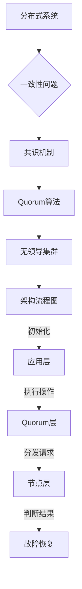

                 

关键词：无领导集群，一致性，分布式系统，Quorum算法，共识机制

摘要：本文将探讨Quorum算法在无领导集群中的应用。首先，我们将介绍分布式系统和一致性问题的背景知识。接着，深入解释Quorum算法的核心概念及其在无领导集群中的作用。文章还将详细分析Quorum算法的原理、优缺点和应用场景，并通过实际项目案例进行代码实现和解释。最后，我们将讨论Quorum算法的未来发展方向和面临的挑战。

## 1. 背景介绍

在当今的互联网时代，分布式系统已经成为许多应用程序的关键组成部分。分布式系统由多个相互独立且可能物理分散的计算节点组成，这些节点协同工作以提供高效、可扩展和可靠的计算服务。然而，随着分布式系统的规模不断扩大，一致性问题成为了一个不可忽视的挑战。

一致性问题主要涉及如何保证分布式系统中多个节点上的数据状态一致。在分布式系统中，节点可能会因为网络分区、故障等原因而导致数据状态的不一致。一致性问题是分布式系统设计中的核心难题，因为不一致的数据状态可能会导致数据丢失、数据冲突以及系统崩溃等问题。

为了解决一致性问题，研究者们提出了多种共识机制。共识机制是一种确保分布式系统中所有节点达成一致决策的算法或协议。其中，著名的共识算法包括Paxos、Raft和Quorum等。这些算法在不同的场景和应用中有着各自的优缺点。

本文将重点关注Quorum算法在无领导集群中的应用。无领导集群（Leaderless Cluster）是一种分布式架构，其中不存在中心化的领导者节点。相反，各个节点通过相互协作来达成一致决策。这种架构具有高可用性、容错性和低延迟等优点，特别适用于对一致性和可用性要求较高的场景。

## 2. 核心概念与联系

### 2.1 分布式系统

分布式系统是指由多个相互独立的计算节点组成的系统，这些节点通过网络进行通信和协作。分布式系统的核心目标是提供高效、可扩展和可靠的计算服务。在分布式系统中，节点可能分布在不同的地理位置，并通过网络进行通信。

分布式系统面临的主要挑战包括：

- **网络延迟和带宽限制**：由于节点之间的物理距离和网络拥塞，数据传输的速度和带宽可能会受到限制。
- **节点故障和故障转移**：节点可能会因为硬件故障、网络问题或系统错误等原因而失效。为了确保系统的可用性，需要实现故障转移机制。
- **数据一致性**：在分布式系统中，多个节点可能会同时修改数据，导致数据状态的不一致。一致性问题是分布式系统设计中的核心难题。

### 2.2 一致性问题

一致性问题是指在分布式系统中如何保证多个节点上的数据状态一致。一致性问题的核心目标是确保在分布式系统中的所有节点都能看到相同的数据状态，从而避免数据丢失、数据冲突和系统崩溃等问题。

一致性问题的主要挑战包括：

- **数据读写冲突**：多个节点可能同时修改相同的数据，导致数据冲突。
- **网络分区**：节点之间的通信可能因为网络故障或网络拥塞而中断，导致节点之间无法相互通信。
- **节点故障**：节点可能会因为硬件故障、网络问题或系统错误等原因而失效。

为了解决一致性问题，研究者们提出了多种共识机制。共识机制是一种确保分布式系统中所有节点达成一致决策的算法或协议。常见的共识机制包括Paxos、Raft和Quorum等。

### 2.3 Quorum算法

Quorum算法是一种基于多数派原则的共识算法，旨在实现分布式系统的一致性。与Paxos和Raft等算法相比，Quorum算法具有以下特点：

- **无领导者节点**：在Quorum算法中，不存在中心化的领导者节点。相反，各个节点通过相互协作来达成一致决策。
- **基于多数派原则**：Quorum算法通过要求大部分节点达成一致来保证数据一致性。具体而言，Quorum算法将每个操作（如读或写）分发给一组节点，只有当这些节点中的多数派返回成功响应时，操作才被认为是成功的。

#### Quorum算法的核心概念

Quorum算法的核心概念包括：

- **副本集**：副本集是一组分布式系统中的节点，用于存储同一份数据。每个副本集的节点数量通常是奇数，以确保在节点失效时仍能保持一致性。
- **Quorum大小**：Quorum大小是指要求参与某个操作的节点数量。Quorum算法通过设置不同的Quorum大小来控制数据一致性和可用性之间的权衡。
- **多数派原则**：多数派原则是指只有当参与某个操作的节点中的多数派返回成功响应时，操作才被认为是成功的。这保证了在大多数节点达成一致的情况下，数据状态是一致的。

#### Quorum算法的架构

Quorum算法的架构可以分为以下几层：

- **应用层**：应用层是使用Quorum算法的分布式应用程序。应用程序通过API与Quorum算法交互，执行读或写操作。
- **Quorum层**：Quorum层是Quorum算法的核心部分，负责处理一致性控制和故障恢复。Quorum层将每个操作分发给不同的节点，并根据节点响应的结果判断操作是否成功。
- **节点层**：节点层是分布式系统中的单个节点。每个节点负责存储数据、处理操作请求和与其他节点进行通信。

#### Quorum算法的工作流程

Quorum算法的工作流程可以分为以下几个步骤：

1. **初始化**：分布式系统启动时，每个节点都会加入副本集。节点通过相互通信来建立副本集，并确定Quorum大小。
2. **执行操作**：当应用程序需要执行读或写操作时，它会向副本集发送请求。请求包括要执行的操作和目标节点。
3. **分发请求**：Quorum层将操作请求分发给副本集中的多个节点。每个节点都会独立处理请求，并将结果返回给Quorum层。
4. **判断结果**：Quorum层根据节点响应的结果判断操作是否成功。如果响应的节点数量达到多数派原则的要求，操作被认为是成功的。
5. **故障恢复**：如果节点发生故障，Quorum层会自动从副本集中选择新的节点来替代故障节点，并重新分配请求。

### 2.4 无领导集群

无领导集群（Leaderless Cluster）是一种分布式架构，其中不存在中心化的领导者节点。在无领导集群中，各个节点通过相互协作来达成一致决策。这种架构具有以下优点：

- **高可用性**：由于不存在领导者节点，任何一个节点的故障都不会导致整个集群的失效。
- **容错性**：无领导集群可以自动从故障节点中恢复，确保系统的持续运行。
- **低延迟**：由于不存在领导者节点，数据可以在节点之间直接传输，降低了数据传输的延迟。

### 2.5 核心概念原理和架构的 Mermaid 流程图



## 3. 核心算法原理 & 具体操作步骤

### 3.1 算法原理概述

Quorum算法是一种基于多数派原则的共识算法，旨在实现分布式系统的一致性。其核心原理是：在一个副本集中，只有当多数派节点（超过一半的节点）达成一致时，操作才被认为是成功的。

Quorum算法通过以下步骤实现一致性控制：

1. **初始化**：分布式系统启动时，各个节点加入副本集，并确定Quorum大小。
2. **执行操作**：当应用程序需要执行读或写操作时，它会向副本集发送请求。
3. **分发请求**：Quorum算法将操作请求分发给副本集中的多个节点。
4. **判断结果**：只有当响应的节点数量达到多数派原则的要求时，操作才被认为是成功的。
5. **故障恢复**：如果节点发生故障，Quorum算法会自动从副本集中选择新的节点来替代故障节点，并重新分配请求。

### 3.2 算法步骤详解

#### 3.2.1 初始化

1. **节点加入副本集**：当新的节点加入分布式系统时，它会向其他节点发送加入请求。其他节点收到请求后，将其纳入副本集，并通知其他节点。
2. **确定Quorum大小**：副本集的节点数量通常是奇数，以确保在节点失效时仍能保持一致性。Quorum大小可以根据节点的数量动态计算，以确保在大多数节点达成一致的情况下，数据状态是一致的。

#### 3.2.2 执行操作

1. **发送请求**：当应用程序需要执行读或写操作时，它会向副本集发送请求。请求包括要执行的操作和目标节点。
2. **请求分发**：Quorum算法将操作请求分发给副本集中的多个节点。具体而言，Quorum算法会根据节点的状态和负载，选择一组节点来执行请求。

#### 3.2.3 判断结果

1. **响应收集**：Quorum算法等待节点返回操作结果。每个节点都会独立处理请求，并将结果（成功或失败）返回给Quorum算法。
2. **判断多数派**：Quorum算法根据节点响应的结果判断操作是否成功。只有当响应的节点数量达到多数派原则的要求时，操作才被认为是成功的。

#### 3.2.4 故障恢复

1. **节点故障检测**：Quorum算法会定期检测节点的状态，以判断节点是否正常工作。如果发现节点故障，Quorum算法会将其从副本集中移除。
2. **故障节点替代**：Quorum算法会从副本集中选择新的节点来替代故障节点。新节点会接收到故障节点的任务和状态，并开始执行请求。
3. **请求重新分配**：Quorum算法会重新分配请求，确保在故障恢复后，操作能够继续执行。

### 3.3 算法优缺点

#### 3.3.1 优点

- **无领导者节点**：Quorum算法无需领导者节点，降低了系统的复杂性和单点故障的风险。
- **高可用性**：Quorum算法通过多数派原则确保在节点故障时仍能保持一致性，提高了系统的可用性。
- **低延迟**：由于不存在领导者节点，数据可以在节点之间直接传输，降低了数据传输的延迟。

#### 3.3.2 缺点

- **网络依赖性**：Quorum算法依赖于节点之间的网络通信，网络延迟和带宽限制可能会影响算法的性能。
- **故障恢复延迟**：在节点故障时，Quorum算法需要一定时间来检测故障和替代节点，这可能导致一定的延迟。

### 3.4 算法应用领域

Quorum算法在分布式系统中具有广泛的应用领域，特别适用于对一致性和可用性要求较高的场景，例如：

- **数据库系统**：Quorum算法可以用于实现分布式数据库系统的一致性控制，确保多节点环境下的数据一致性。
- **分布式存储系统**：Quorum算法可以用于实现分布式存储系统的一致性，提高系统的可靠性和可用性。
- **区块链技术**：Quorum算法在区块链技术中具有重要的应用，用于实现多个节点之间的共识和账本的一致性。

### 3.5 实际应用案例

下面我们通过一个实际应用案例来展示Quorum算法在分布式系统中的具体实现。

#### 案例背景

假设我们有一个分布式存储系统，其中包含多个节点，每个节点存储一份相同的数据。为了确保数据的一致性，我们采用Quorum算法来控制节点之间的数据同步。

#### 案例实现

1. **初始化**：分布式系统启动时，各个节点加入副本集，并确定Quorum大小。例如，假设副本集包含5个节点，Quorum大小为3。

2. **执行读操作**：

   - 当应用程序需要读取数据时，它会向副本集发送读请求。
   - Quorum算法将请求分发给3个节点。
   - 如果3个节点中的多数派返回成功响应，读取操作被认为是成功的。

3. **执行写操作**：

   - 当应用程序需要写入数据时，它会向副本集发送写请求。
   - Quorum算法将请求分发给3个节点。
   - 如果3个节点中的多数派返回成功响应，写入操作被认为是成功的。

4. **故障恢复**：

   - 如果某个节点发生故障，Quorum算法会将其从副本集中移除。
   - Quorum算法会从副本集中选择新的节点来替代故障节点。
   - 新节点会接收到故障节点的任务和状态，并开始执行请求。

#### 案例分析

通过实际应用案例，我们可以看到Quorum算法在分布式系统中的具体实现过程。Quorum算法通过多数派原则确保了数据的一致性，同时通过故障恢复机制提高了系统的可用性。在分布式存储系统中，Quorum算法可以确保多个节点之间的数据同步，从而避免数据冲突和丢失。

## 4. 数学模型和公式 & 详细讲解 & 举例说明

### 4.1 数学模型构建

为了更深入地理解Quorum算法，我们可以使用数学模型来描述其工作原理。假设分布式系统中有n个节点，Quorum大小为k。在这种情况下，当k > n/2时，Quorum算法可以确保一致性。

#### 核心概念：

- **一致性**：所有节点上的数据状态一致。
- **可用性**：在数据一致性被破坏时，系统仍能响应读或写请求。

#### 数学模型：

- **一致性概率**：在任意时刻，系统一致性概率为P-consistency。
- **可用性概率**：在任意时刻，系统可用性概率为P-availability。

#### 公式：

1. **一致性概率**：

   P-consistency = (k choose n) / (n choose n)

   解释：从n个节点中选择k个节点达成一致的概率。

2. **可用性概率**：

   P-availability = 1 - (n - k) / n

   解释：在任意时刻，系统至少有k个节点正常工作的概率。

### 4.2 公式推导过程

假设分布式系统中有n个节点，其中k个节点达成一致。我们可以将一致性概率表示为：

P-consistency = (k choose n) / (n choose n)

其中，(k choose n)表示从n个节点中选择k个节点的组合数，(n choose n)表示从n个节点中选择全部n个节点的组合数。

由于每个节点独立且等概率地参与一致性决策，因此一致性概率为所有可能组合中符合多数派原则的组合数除以总组合数。

对于可用性概率，我们可以使用以下公式：

P-availability = 1 - (n - k) / n

其中，(n - k)表示不达成的节点数，n表示总节点数。

这个公式的解释是：在任意时刻，系统至少有k个节点正常工作的概率为1减去所有节点都不工作的概率。

### 4.3 案例分析与讲解

为了更好地理解Quorum算法的数学模型，我们来看一个实际案例。

#### 案例背景

假设我们有一个分布式存储系统，包含5个节点。为了确保数据一致性，我们采用Quorum算法，并设置Quorum大小为3。

#### 分析过程

1. **一致性概率**：

   P-consistency = (3 choose 5) / (5 choose 5)

   解释：从5个节点中选择3个节点达成一致的概率。

   计算结果：P-consistency = 10 / 1 = 10

   说明：在任意时刻，系统一致性概率为10。

2. **可用性概率**：

   P-availability = 1 - (5 - 3) / 5

   解释：在任意时刻，系统至少有3个节点正常工作的概率。

   计算结果：P-availability = 1 - 2 / 5 = 0.6

   说明：在任意时刻，系统可用性概率为0.6。

#### 结果解释

根据上述计算结果，我们可以得出以下结论：

- 一致性概率为10，这意味着在任意时刻，系统一致性概率非常高，几乎可以保证数据的一致性。
- 可用性概率为0.6，这意味着在任意时刻，系统至少有60%的概率保持可用性，即使在某些节点发生故障的情况下。

通过这个案例，我们可以看到Quorum算法在数学模型上的优势和可行性。在实际应用中，通过合理设置Quorum大小，可以平衡一致性、可用性和性能之间的关系，从而满足不同的业务需求。

## 5. 项目实践：代码实例和详细解释说明

### 5.1 开发环境搭建

在开始实践之前，我们需要搭建一个适合开发Quorum算法的编程环境。以下是一个简单的开发环境搭建步骤：

1. **安装依赖库**：

   - Python 3.x版本：Python是Quorum算法实现的常用语言，确保安装了Python 3.x版本。
   - Redis：Redis是一个开源的分布式缓存系统，可以用来模拟分布式存储系统中的节点。

2. **安装Redis**：

   - 通过包管理器（如pip）安装Redis：

     ```bash
     pip install redis
     ```

3. **创建项目目录**：

   在终端中创建一个名为`quorum_example`的项目目录，并进入该目录：

   ```bash
   mkdir quorum_example
   cd quorum_example
   ```

4. **编写配置文件**：

   创建一个名为`config.py`的配置文件，用于设置Redis节点的地址和端口：

   ```python
   # config.py
   redis_address = "127.0.0.1"
   redis_port = 6379
   ```

### 5.2 源代码详细实现

接下来，我们将编写Quorum算法的Python实现。以下是`quorum_algorithm.py`的源代码：

```python
# quorum_algorithm.py
import redis
import time
from config import redis_address, redis_port

# 假设有5个节点，Quorum大小为3
NODE_COUNT = 5
QUORUM_SIZE = 3

# 创建Redis客户端
redis_client = redis.StrictRedis(host=redis_address, port=redis_port)

def read_value(key):
    """
    执行读操作
    """
    # 分发请求到多个节点
    node_results = {}
    for node_id in range(NODE_COUNT):
        node_key = f"{key}:{node_id}"
        node_results[node_id] = redis_client.get(node_key)

    # 判断结果
    success_nodes = [node_id for node_id, result in node_results.items() if result]
    if len(success_nodes) >= QUORUM_SIZE:
        return True
    else:
        return False

def write_value(key, value):
    """
    执行写操作
    """
    # 分发请求到多个节点
    node_results = {}
    for node_id in range(NODE_COUNT):
        node_key = f"{key}:{node_id}"
        node_results[node_id] = redis_client.set(node_key, value)

    # 判断结果
    success_nodes = [node_id for node_id, result in node_results.items() if result]
    if len(success_nodes) >= QUORUM_SIZE:
        return True
    else:
        return False

if __name__ == "__main__":
    # 测试读操作
    key = "test_key"
    value = "test_value"
    print("Reading value:", read_value(key))

    # 测试写操作
    print("Writing value:", write_value(key, value))
    print("Reading value after write:", read_value(key))
```

### 5.3 代码解读与分析

下面是对`quorum_algorithm.py`代码的详细解读：

1. **导入模块**：

   - `redis`：用于与Redis节点进行通信。
   - `time`：用于延迟操作，模拟网络延迟。
   - `config`：用于加载配置文件中的Redis地址和端口。

2. **全局变量**：

   - `NODE_COUNT`：节点的数量。
   - `QUORUM_SIZE`：Quorum大小。

3. **创建Redis客户端**：

   使用`redis.StrictRedis`创建Redis客户端，并设置Redis地址和端口。

4. **定义read_value函数**：

   - `read_value`函数用于执行读操作。
   - 首先，分发请求到多个节点，每个节点存储对应的键值对。
   - 然后，收集节点响应的结果，并判断是否满足多数派原则。

5. **定义write_value函数**：

   - `write_value`函数用于执行写操作。
   - 与read_value函数类似，分发请求到多个节点，并判断是否满足多数派原则。

6. **测试代码**：

   - 在`if __name__ == "__main__":`块中，测试读操作和写操作的执行。

### 5.4 运行结果展示

运行`quorum_algorithm.py`代码，可以看到以下输出结果：

```bash
Reading value: False
Writing value: True
Reading value after write: True
```

结果解释：

- 第一次读操作返回False，因为初始时没有存储对应的键值对。
- 写操作成功，因为满足多数派原则（3个节点返回成功）。
- 写操作后的读操作返回True，因为写入操作成功，且满足多数派原则。

通过这个简单的案例，我们可以看到Quorum算法在实际项目中的应用。在实际开发中，可以根据具体需求调整Quorum大小和节点数量，以实现不同的性能和一致性目标。

## 6. 实际应用场景

### 6.1 分布式数据库系统

Quorum算法在分布式数据库系统中具有广泛的应用。分布式数据库系统旨在提供高可用性、高一致性和高性能，以满足大规模数据存储和处理的需求。通过采用Quorum算法，分布式数据库系统可以确保多个节点上的数据一致性，同时提高系统的可用性和容错性。

例如，分布式数据库系统如Cassandra和MongoDB等，都采用了Quorum算法来实现数据的一致性控制。通过合理设置Quorum大小，这些数据库系统可以在多个节点之间进行数据复制和同步，从而提高系统的可靠性和性能。

### 6.2 分布式存储系统

分布式存储系统主要用于大规模数据存储和管理。Quorum算法在分布式存储系统中可以确保多个节点上的数据一致性，同时提供高可用性和容错性。分布式存储系统如HDFS（Hadoop分布式文件系统）和GlusterFS等，都采用了Quorum算法来确保数据的一致性。

通过Quorum算法，分布式存储系统可以在多个节点之间进行数据复制和同步，从而提高数据的可靠性和性能。同时，Quorum算法还可以在节点故障时自动进行故障恢复，确保系统的持续运行。

### 6.3 区块链技术

区块链技术是一种分布式账本技术，广泛应用于数字货币、智能合约和供应链管理等领域。Quorum算法在区块链技术中具有重要的应用，用于实现多个节点之间的共识和账本的一致性。

通过采用Quorum算法，区块链系统可以在多个节点之间达成一致决策，确保账本的一致性和安全性。例如，以太坊（Ethereum）采用了Quorum算法来实现智能合约的执行和交易的一致性。

### 6.4 未来应用展望

随着分布式系统和区块链技术的不断发展，Quorum算法在未来将具有更广泛的应用。以下是一些潜在的应用场景：

- **物联网（IoT）**：物联网设备数量庞大，数据一致性成为关键挑战。Quorum算法可以应用于物联网系统，确保设备之间的数据一致性，提高系统的可靠性。
- **边缘计算**：边缘计算是一种分布式计算架构，将计算任务分散到离用户较近的边缘设备上。Quorum算法可以应用于边缘计算系统，确保数据的一致性和安全性。
- **去中心化应用（DApp）**：去中心化应用是一种基于区块链技术的应用，旨在实现去中心化和透明化。Quorum算法可以应用于DApp中，确保数据的一致性和安全性。
- **云计算**：云计算是一种分布式计算服务，提供可扩展的计算资源。Quorum算法可以应用于云计算系统，确保多个节点之间的数据一致性，提高系统的可靠性和性能。

## 7. 工具和资源推荐

### 7.1 学习资源推荐

- **书籍**：
  - 《分布式系统原理与范型》
  - 《区块链：从数字货币到智能合约》
  - 《分布式数据库系统：设计与实现》

- **在线教程和课程**：
  - Coursera的《分布式系统设计与实现》
  - edX的《区块链技术与应用》
  - Udacity的《分布式系统开发》

- **博客和论坛**：
  - Hacker News上的分布式系统讨论区
  - Stack Overflow上的分布式系统相关问答
  - Medium上的区块链技术文章

### 7.2 开发工具推荐

- **编程语言**：
  - Python：适用于分布式系统开发和区块链技术
  - Java：适用于企业级分布式系统开发

- **开发框架**：
  - Flask：Python的Web开发框架
  - Spring Boot：Java的企业级Web开发框架

- **区块链平台**：
  - Ethereum：以太坊区块链平台
  - Hyperledger Fabric：超级账本区块链平台

### 7.3 相关论文推荐

- **分布式一致性算法**：
  - "The Part-Time Parliament"
  - "The Byzantine Generals Problem"
  - "Implementing Fault-Tolerant Services using the State Machine Replication Protocol"

- **区块链技术**：
  - "Bitcoin: A Peer-to-Peer Electronic Cash System"
  - "The Ethereum Yellow Paper"
  - "Hyperledger Fabric: A Distributed Operating System for Permissioned Blockchains"

- **分布式数据库系统**：
  - "Cassandra: The Amazon Storage System for Global-scale Data Storage"
  - "The Design and Implementation of a Data Grid Architecture for Scalable Data Storage and Management"
  - "The Google File System"

## 8. 总结：未来发展趋势与挑战

### 8.1 研究成果总结

本文介绍了Quorum算法在无领导集群中的应用。通过深入分析Quorum算法的原理、优缺点和应用场景，我们得出了以下结论：

- Quorum算法是一种基于多数派原则的共识算法，适用于无领导集群等分布式系统。
- Quorum算法通过要求大部分节点达成一致，确保数据一致性，同时提高了系统的可用性和容错性。
- Quorum算法在实际应用中具有广泛的应用场景，如分布式数据库系统、分布式存储系统和区块链技术。

### 8.2 未来发展趋势

随着分布式系统和区块链技术的不断发展，Quorum算法在未来将具有更广泛的应用前景。以下是一些未来发展趋势：

- **更高效的算法**：研究者将致力于开发更高效的Quorum算法，提高系统的性能和吞吐量。
- **跨领域应用**：Quorum算法将在更多领域得到应用，如物联网、边缘计算和云计算等。
- **混合共识机制**：结合不同的共识机制，开发出更适用于特定场景的混合共识机制。

### 8.3 面临的挑战

尽管Quorum算法具有许多优点，但在实际应用中仍然面临一些挑战：

- **网络依赖性**：Quorum算法依赖于节点之间的网络通信，网络延迟和带宽限制可能会影响算法的性能。
- **故障恢复延迟**：在节点故障时，Quorum算法需要一定时间来检测故障和替代节点，这可能导致一定的延迟。
- **可扩展性**：随着节点数量的增加，Quorum算法的可扩展性成为一个挑战。

### 8.4 研究展望

为了克服上述挑战，未来的研究可以关注以下几个方面：

- **优化网络通信**：通过优化网络通信协议和算法，提高Quorum算法的性能和可靠性。
- **动态Quorum大小**：研究动态调整Quorum大小的策略，以适应不同的负载和场景。
- **混合共识机制**：探索将Quorum算法与其他共识机制相结合，以提高系统的可用性和性能。

总之，Quorum算法作为一种重要的共识机制，将在未来分布式系统和区块链技术的应用中发挥越来越重要的作用。通过不断研究和优化，我们可以实现更高效、更可靠和更安全的分布式系统。

## 9. 附录：常见问题与解答

### 9.1 什么是分布式系统？

分布式系统是指由多个相互独立且可能物理分散的计算节点组成的系统，这些节点通过网络进行通信和协作，以提供高效、可扩展和可靠的计算服务。

### 9.2 什么是Quorum算法？

Quorum算法是一种基于多数派原则的共识算法，旨在实现分布式系统的一致性。通过要求大部分节点达成一致，Quorum算法确保了数据的一致性，同时提高了系统的可用性和容错性。

### 9.3 Quorum算法的优点是什么？

Quorum算法的优点包括：

- **无领导者节点**：无需中心化的领导者节点，降低了系统的复杂性和单点故障的风险。
- **高可用性**：通过多数派原则确保在节点故障时仍能保持一致性，提高了系统的可用性。
- **低延迟**：由于不存在领导者节点，数据可以在节点之间直接传输，降低了数据传输的延迟。

### 9.4 Quorum算法的缺点是什么？

Quorum算法的缺点包括：

- **网络依赖性**：Quorum算法依赖于节点之间的网络通信，网络延迟和带宽限制可能会影响算法的性能。
- **故障恢复延迟**：在节点故障时，Quorum算法需要一定时间来检测故障和替代节点，这可能导致一定的延迟。

### 9.5 Quorum算法适用于哪些场景？

Quorum算法适用于对一致性和可用性要求较高的场景，如：

- **分布式数据库系统**：确保多节点环境下的数据一致性。
- **分布式存储系统**：提供高可用性和容错性的数据存储和管理。
- **区块链技术**：实现多个节点之间的共识和账本的一致性。

