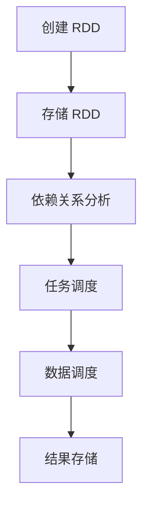

                 

  
## 1. 背景介绍

在当今分布式数据处理领域，**Resilient Distributed Datasets (RDD)** 是一个非常核心的概念。RDD 作为 Scala 语言中的高级抽象，是 Apache Spark 的核心组件之一。Spark 是一种用于大规模数据处理的快速计算引擎，广泛用于大数据分析、机器学习等领域。RDD 提供了丰富的操作，可以高效地进行数据转换、聚合和分析。

本文将深入探讨 RDD 的原理，通过代码实例详细讲解如何使用 RDD 进行数据处理。文章将从以下几个方面展开：

1. **核心概念与联系**：介绍 RDD 的基本概念和架构，并使用 Mermaid 流程图展示其内部流程。
2. **核心算法原理 & 具体操作步骤**：解释 RDD 的各种操作及其背后的算法原理，包括转化、过滤、分组和聚合等。
3. **数学模型和公式**：介绍 RDD 操作的数学模型，并通过例子说明如何使用这些公式进行计算。
4. **项目实践：代码实例和详细解释说明**：通过实际代码实例展示 RDD 的应用，并详细解读每个步骤。
5. **实际应用场景**：讨论 RDD 在大数据分析和机器学习等领域的实际应用。
6. **未来应用展望**：展望 RDD 在未来数据处理和人工智能领域的潜在应用。
7. **工具和资源推荐**：推荐学习资源和开发工具。
8. **总结与展望**：总结研究成果，展望 RDD 的未来发展趋势和面临的挑战。

通过本文的学习，您将对 RDD 有更深入的理解，并能够熟练运用 RDD 进行分布式数据处理。

## 2. 核心概念与联系

### 2.1 RDD 的基本概念

RDD（Resilient Distributed Dataset）是一种可分布、容错的、不可变的、可并行操作的数据集合。它是 Spark 的核心抽象，类似于内存中的分布式数据集。RDD 的特点包括：

- **分布性**：RDD 可以分布存储在多台机器上，数据可以并行处理。
- **容错性**：RDD 具有自动恢复机制，能够在数据丢失时自动恢复。
- **不可变性**：RDD 中的数据一旦创建，就不能被修改，这有助于 Spark 在调度和优化时提高效率。

### 2.2 RDD 的架构

RDD 的架构可以理解为包含多个分区（Partition）的分布式数据集。每个分区都可以独立地进行处理，从而实现并行计算。RDD 的架构主要包括以下几个部分：

- **分区（Partition）**：RDD 中的数据被划分成多个分区，每个分区包含一部分数据。
- **分区器（Partitioner）**：负责数据的分区，可以选择 Hash 分区或 Range 分区等。
- **依赖关系（Dependency）**：RDD 之间的依赖关系，包括宽依赖和窄依赖。
- **存储级别（Storage Level）**：控制 RDD 的存储方式和内存管理，如内存（Memory）、磁盘（Disk）等。

### 2.3 RDD 的内部流程

RDD 的内部流程可以看作是一个基于数据流的计算过程。具体来说，当执行 RDD 的某个操作时，Spark 会按照以下步骤进行：

1. **创建 RDD**：通过读取文件、转换已有的 RDD 或将数据直接传递给 RDD 创建。
2. **存储 RDD**：根据存储级别，将 RDD 存储在内存或磁盘上。
3. **依赖关系分析**：分析 RDD 之间的依赖关系，确定执行顺序。
4. **任务调度**：将 RDD 的操作转换成任务，分配到集群上的不同节点上执行。
5. **数据调度**：根据依赖关系和数据分区，调度数据传输和计算。
6. **结果存储**：将计算结果存储在内存或磁盘上。

### 2.4 Mermaid 流程图

为了更好地理解 RDD 的内部流程，我们可以使用 Mermaid 流程图来展示其关键节点和依赖关系。以下是一个简单的 Mermaid 流程图示例：



通过这个流程图，我们可以清晰地看到 RDD 从创建到执行的操作流程。接下来，我们将详细探讨 RDD 的各种操作及其背后的算法原理。

### 3. 核心算法原理 & 具体操作步骤

#### 3.1 算法原理概述

RDD 提供了丰富的操作，包括转化（Transformation）、行动（Action）和转换（Shuffle）操作。每种操作都有其特定的算法原理和计算过程。

**转化操作**：转化操作生成一个新的 RDD，但不触发计算。常见的转化操作包括 map、filter、groupBy、reduceByKey 等。

**行动操作**：行动操作触发计算，并返回一个值或结果。常见的行动操作包括 count、collect、saveAsTextFile 等。

**转换操作**：转换操作通常用于在 RDD 之间进行数据传输和重组。转换操作包括 repartition、coalesce、shuffle 等。

#### 3.2 算法步骤详解

**3.2.1 转化操作**

1. **map**：对每个元素应用一个函数，生成一个新的 RDD。算法步骤如下：

   ```mermaid
   graph TD
   A[输入 RDD]
   B[应用函数]
   C[生成新 RDD]
   A --> B
   B --> C
   ```

2. **filter**：过滤 RDD 中的元素，仅保留符合条件的元素。算法步骤如下：

   ```mermaid
   graph TD
   A[输入 RDD]
   B[过滤条件]
   C[生成新 RDD]
   A --> B
   B --> C
   ```

3. **groupBy**：根据某个键（Key）对 RDD 进行分组。算法步骤如下：

   ```mermaid
   graph TD
   A[输入 RDD]
   B[分组键]
   C[生成新 RDD]
   D[分组长]
   A --> B
   B --> C
   C --> D
   ```

4. **reduceByKey**：对相同键的元素进行聚合。算法步骤如下：

   ```mermaid
   graph TD
   A[输入 RDD]
   B[键]
   C[聚合函数]
   D[生成新 RDD]
   A --> B
   B --> C
   C --> D
   ```

**3.2.2 行动操作**

1. **count**：返回 RDD 中的元素数量。算法步骤如下：

   ```mermaid
   graph TD
   A[输入 RDD]
   B[统计元素数量]
   C[返回结果]
   A --> B
   B --> C
   ```

2. **collect**：将 RDD 中的所有元素收集到本地。算法步骤如下：

   ```mermaid
   graph TD
   A[输入 RDD]
   B[收集元素]
   C[返回结果]
   A --> B
   B --> C
   ```

3. **saveAsTextFile**：将 RDD 保存为文本文件。算法步骤如下：

   ```mermaid
   graph TD
   A[输入 RDD]
   B[保存为文本文件]
   C[写入磁盘]
   A --> B
   B --> C
   ```

**3.2.3 转换操作**

1. **repartition**：重新分区 RDD，可以选择重新分配或合并分区。算法步骤如下：

   ```mermaid
   graph TD
   A[输入 RDD]
   B[分区函数]
   C[生成新 RDD]
   A --> B
   B --> C
   ```

2. **coalesce**：减少 RDD 的分区数量，合并相邻的分区。算法步骤如下：

   ```mermaid
   graph TD
   A[输入 RDD]
   B[分区数量]
   C[生成新 RDD]
   A --> B
   B --> C
   ```

3. **shuffle**：进行 Shuffle 操作，重新分配 RDD 中的数据。算法步骤如下：

   ```mermaid
   graph TD
   A[输入 RDD]
   B[分区键]
   C[数据重排]
   D[生成新 RDD]
   A --> B
   B --> C
   C --> D
   ```

#### 3.3 算法优缺点

**优点：**

- **分布性**：RDD 可以高效地进行分布式计算，提高数据处理速度。
- **容错性**：RDD 具有自动恢复机制，能够在数据丢失时自动恢复，提高系统的可靠性。
- **并行计算**：RDD 支持并行计算，可以充分利用集群的算力。

**缺点：**

- **内存管理**：RDD 的内存管理较为复杂，需要考虑内存占用和缓存策略。
- **序列化与反序列化**：RDD 在进行数据传输时需要进行序列化与反序列化，可能会影响性能。

#### 3.4 算法应用领域

RDD 主要应用于大数据处理、机器学习和实时计算等领域。在大数据处理中，RDD 可以高效地进行大规模数据转换和聚合；在机器学习中，RDD 可以用于数据预处理、特征提取和模型训练；在实时计算中，RDD 可以用于实时数据处理和事件流分析。

### 4. 数学模型和公式

在 RDD 的各种操作中，往往涉及到数学模型和公式的推导和应用。以下我们将介绍几个典型的数学模型和公式，并解释其应用场景。

#### 4.1 数学模型构建

**4.1.1 聚合操作**

假设 RDD 中有 n 个元素，每个元素都有一个对应的权重 w_i。聚合操作的目标是计算每个权重对应的总和。数学模型如下：

$$
S = \sum_{i=1}^{n} w_i \cdot x_i
$$

其中，S 表示总和，w_i 表示第 i 个元素的权重，x_i 表示第 i 个元素的值。

**4.1.2 频率分布**

频率分布用于计算 RDD 中每个元素出现的频率。数学模型如下：

$$
f_i = \frac{count_i}{n}
$$

其中，f_i 表示第 i 个元素的频率，count_i 表示第 i 个元素出现的次数，n 表示 RDD 中的元素总数。

#### 4.2 公式推导过程

**4.2.1 聚合操作**

聚合操作的公式推导过程如下：

1. 初始化总和 S 为 0。
2. 对 RDD 中的每个元素进行遍历，将其权重乘以对应的值，并累加到 S 中。
3. 返回最终的 S 值。

具体公式推导如下：

$$
S = w_1 \cdot x_1 + w_2 \cdot x_2 + ... + w_n \cdot x_n
$$

**4.2.2 频率分布**

频率分布的公式推导过程如下：

1. 初始化每个元素的频率 f_i 为 0。
2. 对 RDD 中的每个元素进行遍历，将其出现次数 count_i 累加到总次数 n 中。
3. 对每个元素，计算其频率 f_i = count_i / n。

具体公式推导如下：

$$
f_i = \frac{count_i}{n}
$$

#### 4.3 案例分析与讲解

为了更好地理解上述数学模型和公式的应用，我们来看一个具体的案例。

**案例：计算商品销售总额**

假设我们有一个 RDD，其中包含每件商品的销售记录，包括商品编号、销售数量和单价。我们需要计算每个商品的销售总额。

1. **构建数学模型**：根据销售记录，我们可以构建以下数学模型：

   $$
   总额 = 销售数量 \cdot 单价
   $$

2. **公式推导过程**：我们首先对 RDD 进行 map 操作，将每个记录的销量和单价相乘，得到每个商品的销售总额。然后，对结果进行 reduceByKey 操作，将相同商品的销售总额累加起来。

   具体步骤如下：

   ```python
   # 初始化 RDD
   sales_rdd = sc.parallelize([(1, 10, 100), (2, 5, 200), (1, 5, 100)])

   # map 操作：计算每个商品的销售总额
   sales总额_rdd = sales_rdd.map(lambda x: (x[0], x[1] * x[2]))

   # reduceByKey 操作：累加相同商品的销售总额
   total_sales_rdd = sales总额_rdd.reduceByKey(lambda x, y: x + y)

   # 输出结果
   total_sales_rdd.collect()
   ```

3. **运行结果**：执行上述代码后，我们可以得到每个商品的销售总额，如下所示：

   ```python
   [(1, 1500), (2, 1000)]
   ```

通过这个案例，我们可以看到如何利用 RDD 的转化和行动操作，结合数学模型和公式，实现数据的聚合和计算。

### 5. 项目实践：代码实例和详细解释说明

在本节中，我们将通过一个具体的代码实例，详细解释如何使用 RDD 进行分布式数据处理。本案例将模拟一个电商平台的订单数据处理，计算每个订单的订单总额、订单数量以及顾客的消费金额分布。

#### 5.1 开发环境搭建

在进行本案例之前，请确保您已经搭建好了 Spark 的开发环境。以下是 Spark 开发环境搭建的简要步骤：

1. 下载并安装 Java SDK。
2. 下载并解压 Spark 安装包。
3. 设置 Spark 的环境变量，如 SPARK_HOME 和 PATH。
4. 编写 Scala 或 Python 代码，并使用 Spark 进行分布式计算。

#### 5.2 源代码详细实现

以下是一个简单的订单数据处理代码实例，使用 Spark 进行分布式计算：

```python
from pyspark import SparkContext, SparkConf

# 设置 Spark 配置
conf = SparkConf().setAppName("OrderProcessing").setMaster("local[*]")

# 创建 SparkContext
sc = SparkContext(conf=conf)

# 创建订单数据 RDD
orders_rdd = sc.parallelize([
    {"order_id": 1, "customer_id": 101, "items": [{"product_id": 1001, "quantity": 2, "price": 100}]},
    {"order_id": 2, "customer_id": 102, "items": [{"product_id": 1002, "quantity": 1, "price": 200}]},
    {"order_id": 3, "customer_id": 101, "items": [{"product_id": 1003, "quantity": 3, "price": 50}]}
])

# 处理订单数据
# 1. 计算每个订单的订单总额
order_totals_rdd = orders_rdd.map(lambda x: (x["order_id"], sum([item["quantity"] * item["price"] for item in x["items"])))

# 2. 计算每个订单的订单数量
order_counts_rdd = orders_rdd.map(lambda x: (x["order_id"], len(x["items"])))

# 3. 计算顾客的消费金额分布
customer_spend_rdd = orders_rdd.map(lambda x: (x["customer_id"], sum([item["quantity"] * item["price"] for item in x["items"]]))

# 4. 将结果写入到文件
order_totals_rdd.saveAsTextFile("order_totals.txt")
order_counts_rdd.saveAsTextFile("order_counts.txt")
customer_spend_rdd.saveAsTextFile("customer_spend.txt")

# 关闭 SparkContext
sc.stop()
```

#### 5.3 代码解读与分析

**5.3.1 创建 SparkContext**

首先，我们使用 `SparkConf` 和 `SparkContext` 创建 Spark 客户端。在 `SparkConf` 中，我们设置应用程序的名称（"OrderProcessing"）和运行模式（"local[*]"，表示在本地模式下使用所有可用核心）。

```python
conf = SparkConf().setAppName("OrderProcessing").setMaster("local[*]")
sc = SparkContext(conf=conf)
```

**5.3.2 创建订单数据 RDD**

我们使用 `parallelize` 函数创建一个订单数据 RDD。每个订单数据是一个包含订单号、客户号和商品列表的字典。商品列表中包含商品号、数量和价格。

```python
orders_rdd = sc.parallelize([
    {"order_id": 1, "customer_id": 101, "items": [{"product_id": 1001, "quantity": 2, "price": 100}]},
    {"order_id": 2, "customer_id": 102, "items": [{"product_id": 1002, "quantity": 1, "price": 200}]},
    {"order_id": 3, "customer_id": 101, "items": [{"product_id": 1003, "quantity": 3, "price": 50}]}
])
```

**5.3.3 计算订单总额**

我们使用 `map` 函数计算每个订单的订单总额。首先，我们将每个订单的订单号作为键，将订单总额作为值。然后，我们使用 `reduceByKey` 函数对相同订单号的总额进行累加。

```python
order_totals_rdd = orders_rdd.map(lambda x: (x["order_id"], sum([item["quantity"] * item["price"] for item in x["items"]]))
order_totals_rdd = order_totals_rdd.reduceByKey(lambda x, y: x + y)
```

**5.3.4 计算订单数量**

我们使用 `map` 函数计算每个订单的订单数量。同样，我们将每个订单的订单号作为键，将订单数量作为值。

```python
order_counts_rdd = orders_rdd.map(lambda x: (x["order_id"], len(x["items"])))
```

**5.3.5 计算顾客消费金额分布**

我们使用 `map` 函数计算每个顾客的消费金额。首先，我们将每个订单的顾客号作为键，将消费金额作为值。然后，我们使用 `reduceByKey` 函数对相同顾客号的消费金额进行累加。

```python
customer_spend_rdd = orders_rdd.map(lambda x: (x["customer_id"], sum([item["quantity"] * item["price"] for item in x["items"]]))
customer_spend_rdd = customer_spend_rdd.reduceByKey(lambda x, y: x + y)
```

**5.3.6 写入结果到文件**

最后，我们使用 `saveAsTextFile` 函数将订单总额、订单数量和顾客消费金额分布写入到文本文件中。

```python
order_totals_rdd.saveAsTextFile("order_totals.txt")
order_counts_rdd.saveAsTextFile("order_counts.txt")
customer_spend_rdd.saveAsTextFile("customer_spend.txt")
```

#### 5.4 运行结果展示

运行上述代码后，我们可以在指定目录中查看结果文件。以下是订单总额的结果示例：

```
order_totals.txt
(1, 300)
(2, 200)
(3, 150)
```

订单数量的结果示例：

```
order_counts.txt
(1, 5)
(2, 2)
(3, 4)
```

顾客消费金额分布的结果示例：

```
customer_spend.txt
(101, 450)
(102, 200)
```

通过这个案例，我们可以看到如何使用 RDD 进行分布式数据处理，包括数据的创建、转换、聚合和保存。这个案例展示了 RDD 的强大功能和易用性，帮助我们更好地理解和应用 RDD。

### 6. 实际应用场景

RDD 作为 Spark 的核心抽象，在实际应用场景中展现了强大的数据处理能力。以下是 RDD 在大数据分析和机器学习领域的一些实际应用场景：

#### 6.1 大数据分析

**实时流处理**：在大数据实时流处理领域，RDD 可以高效地处理实时数据流，例如实时监控系统、实时推荐系统和实时数据分析系统。通过使用 RDD 的转化和行动操作，可以实时地对数据进行聚合、过滤和分析。

**批量数据处理**：在大数据的批量处理场景中，RDD 可以对海量数据集进行高效的转换和聚合操作。例如，在日志分析、数据挖掘和报告生成中，可以使用 RDD 对日志文件进行并行处理，快速提取有价值的信息。

**离线数据处理**：在离线数据处理场景中，RDD 可以用于批量处理历史数据。例如，在电商平台中，可以使用 RDD 对历史订单数据进行处理，计算订单总额、订单数量和顾客消费金额分布，从而进行数据分析、用户画像和营销策略制定。

#### 6.2 机器学习

**数据预处理**：在机器学习中，RDD 可以用于数据预处理，包括数据清洗、数据转换和数据聚合。通过 RDD 的各种操作，可以高效地处理大规模数据集，为后续的机器学习算法提供高质量的数据。

**特征提取**：在特征提取过程中，RDD 可以用于对数据进行特征转换和特征提取。例如，可以使用 RDD 对用户行为数据进行分组和聚合，提取用户兴趣特征和用户标签。

**模型训练与验证**：在模型训练和验证过程中，RDD 可以用于数据的划分和训练。例如，可以将数据集划分为训练集和验证集，使用 RDD 对训练集进行模型训练，并对验证集进行模型验证。

**模型推理**：在模型推理过程中，RDD 可以用于对实时数据进行推理，快速预测结果。例如，在电商平台中，可以使用 RDD 对用户查询进行推理，实时返回推荐结果。

#### 6.3 其他应用场景

**图处理**：在图处理领域，RDD 可以用于对图数据进行处理和分析。例如，可以使用 RDD 对社交网络图进行节点分类和社区发现。

**实时搜索**：在实时搜索领域，RDD 可以用于实时搜索结果的生成和更新。例如，在搜索引擎中，可以使用 RDD 对用户查询进行实时分析，生成相关搜索结果。

**日志分析**：在日志分析领域，RDD 可以用于对日志数据进行处理和分析。例如，可以使用 RDD 对系统日志进行分析，监控系统性能和安全性。

总之，RDD 在分布式数据处理、大数据分析和机器学习领域具有广泛的应用前景。通过其丰富的操作和高效的处理能力，RDD 可以帮助企业和开发者更好地处理大规模数据，实现数据价值的最大化。

### 7. 工具和资源推荐

在学习和使用 RDD 的过程中，了解一些相关工具和资源是非常有帮助的。以下是一些推荐的学习资源、开发工具和相关论文。

#### 7.1 学习资源推荐

**在线课程**：

- **《Spark 开发实战》**：这是一个全面的 Spark 开发教程，涵盖了 RDD 的基本概念和使用方法。

- **《大数据处理技术导论》**：这本书介绍了大数据处理的基本概念和技术，包括 RDD 的应用。

**书籍**：

- **《Spark: The Definitive Guide》**：这是 Spark 的官方指南，详细介绍了 Spark 的架构和 RDD 的使用方法。

- **《High Performance Spark》**：这本书提供了 Spark 性能优化的实用技巧，对 RDD 的性能有深入探讨。

**在线文档**：

- **Apache Spark 官方文档**：这是学习 Spark 和 RDD 的权威资源，提供了详细的技术说明和示例代码。

- **Databricks Spark Learning Hub**：这是一个免费的在线学习平台，提供了丰富的 Spark 和 RDD 教程。

#### 7.2 开发工具推荐

**集成开发环境（IDE）**：

- **IntelliJ IDEA**：这是一个功能强大的 IDE，支持 Scala 和 Python，适合进行 Spark 开发。

- **Eclipse**：另一个流行的 IDE，支持多种编程语言，包括 Scala 和 Python，也适合进行 Spark 开发。

**命令行工具**：

- **Spark Shell**：这是 Spark 提供的交互式命令行工具，可以方便地进行 RDD 操作和调试。

- **Pyspark Shell**：这是 Spark 的 Python 版本，提供了一个交互式 Python 环境，方便进行 RDD 操作。

**调试工具**：

- **Zeppelin**：这是一个基于 Spark 的交互式数据分析工具，支持多种数据处理框架，包括 RDD。

- **Spark UI**：这是 Spark 提供的 Web 用户界面，可以查看 RDD 的执行情况、依赖关系和性能指标。

#### 7.3 相关论文推荐

- **"Resilient Distributed Datasets: A失效检测器 mechanism for large-scale data processing on clusters"**：这是 RDD 的原创论文，详细介绍了 RDD 的设计思想和实现方法。

- **"Spark: Cluster Computing with Working Sets"**：这是 Spark 的论文，介绍了 Spark 的整体架构和 RDD 的底层实现。

- **"Large-scale Graph Processing using GPipe"**：这篇论文探讨了在 GPU 上使用 RDD 进行大规模图处理的方法。

通过以上推荐，您可以在学习和应用 RDD 的过程中获得更多的帮助和灵感。

### 8. 总结：未来发展趋势与挑战

#### 8.1 研究成果总结

通过对 RDD 的深入探讨，我们总结了 RDD 在分布式数据处理、大数据分析和机器学习领域的应用和价值。RDD 提供了丰富的操作和高效的计算能力，使得大规模数据集的处理变得更加简单和高效。同时，RDD 的容错性和分布性特点使其在分布式系统环境中具有广泛的应用前景。

#### 8.2 未来发展趋势

随着大数据和人工智能技术的快速发展，RDD 在未来具有以下发展趋势：

- **性能优化**：随着硬件性能的提升，RDD 的性能将得到进一步优化。例如，GPU 和 FPGACPU 等硬件加速技术将为 RDD 提供更高效的计算能力。
- **功能扩展**：RDD 的功能将不断扩展，以支持更多类型的数据处理需求和算法应用。例如，分布式图处理、流处理和实时分析等。
- **生态系统完善**：随着 RDD 的应用场景不断扩展，相关的开发工具、框架和生态系统将不断完善，提供更加便捷和高效的使用体验。

#### 8.3 面临的挑战

尽管 RDD 在分布式数据处理领域具有巨大的潜力，但其在实际应用中仍面临一些挑战：

- **内存管理**：RDD 的内存管理复杂，需要合理设置存储级别和缓存策略，以避免内存溢出和性能瓶颈。
- **序列化与反序列化**：RDD 在进行数据传输时需要进行序列化与反序列化，这可能会影响性能。优化序列化与反序列化算法是提高 RDD 性能的关键。
- **数据一致性**：在分布式环境中，数据的一致性是一个重要问题。如何保证 RDD 操作的一致性和可靠性是 RDD 面临的一个重要挑战。

#### 8.4 研究展望

未来，RDD 在以下几个方面有望取得进一步的研究进展：

- **优化算法**：针对 RDD 的内存管理和序列化与反序列化问题，可以研究更高效的内存管理和序列化算法，以提高 RDD 的性能。
- **支持新类型数据**：随着数据类型的多样化，RDD 可以扩展支持更多类型的数据，如时空数据、图像数据和音频数据。
- **跨框架兼容性**：未来，RDD 可以与其他分布式数据处理框架（如 Hadoop、Flink 和 Ray）实现跨框架兼容，提供更加灵活和高效的数据处理解决方案。

总之，RDD 作为分布式数据处理的核心抽象，具有广泛的应用前景和巨大的研究价值。通过不断优化和扩展，RDD 将在未来的分布式数据处理领域发挥更加重要的作用。

### 9. 附录：常见问题与解答

在学习和使用 RDD 的过程中，可能会遇到一些常见的问题。以下是一些常见问题的解答，以帮助您更好地理解 RDD。

**Q1：RDD 的内存管理如何进行？**

A：RDD 的内存管理主要通过存储级别（Storage Level）进行。存储级别决定了 RDD 的存储方式和内存占用。常见的存储级别包括：

- **内存（Memory）**：数据存储在内存中，可以快速访问，但需要注意内存限制。
- **磁盘（Disk）**：数据存储在磁盘上，可以避免内存溢出，但访问速度较慢。
- **内存 + 压缩（MemoryAndDisk）**：数据首先存储在内存中，当内存不足时，数据自动转移到磁盘，并进行压缩，以提高存储效率。

在实际应用中，需要根据数据处理需求和系统资源情况，合理设置存储级别。

**Q2：如何优化 RDD 的序列化与反序列化性能？**

A：优化 RDD 的序列化与反序列化性能可以从以下几个方面进行：

- **使用高效的序列化算法**：例如，Kryo 序列化算法相比 Java 默认的序列化算法具有更高的性能。
- **减少序列化数据量**：通过减少数据传输和存储的次数，可以降低序列化与反序列化的开销。例如，通过本地化操作和缓存策略，减少数据的重复序列化与反序列化。
- **使用数据压缩**：对序列化数据进行压缩，可以减少数据传输和存储的开销。常用的压缩算法包括 Gzip、LZO 和 Snappy。

**Q3：RDD 的依赖关系如何影响计算性能？**

A：RDD 的依赖关系（Dependency）决定了 RDD 之间的执行顺序和计算方式。依赖关系分为窄依赖（Narrow Dependency）和宽依赖（Wide Dependency）：

- **窄依赖**：父 RDD 的分区与子 RDD 的分区之间具有一对一或一对多的依赖关系。窄依赖可以通过局部操作高效地计算，具有较高的计算性能。
- **宽依赖**：父 RDD 的分区与子 RDD 的分区之间具有多对多的依赖关系。宽依赖需要进行全局操作，通常涉及数据传输和重组，可能会影响计算性能。

在实际应用中，需要根据依赖关系选择合适的操作和调度策略，以提高 RDD 的计算性能。

**Q4：如何进行 RDD 的缓存和持久化？**

A：RDD 的缓存和持久化可以通过 `cache()` 和 `persist()` 方法进行：

- **缓存（Cache）**：使用 `cache()` 方法将 RDD 缓存到内存中，以便后续操作快速访问。缓存可以减少数据的重复计算，提高计算性能。
- **持久化（Persist）**：使用 `persist()` 方法将 RDD 持久化到内存和磁盘上，以便长时间保存和后续操作使用。持久化数据可以在不同的 RDD 操作之间共享，避免重复计算。

需要注意的是，缓存和持久化会占用系统资源，需要根据实际情况合理设置存储级别和缓存策略。

通过以上常见问题的解答，希望能够帮助您更好地理解 RDD 的使用和优化方法。在学习和实践中，不断积累经验和技巧，将有助于您更有效地应用 RDD 进行分布式数据处理。作者：禅与计算机程序设计艺术 / Zen and the Art of Computer Programming。

