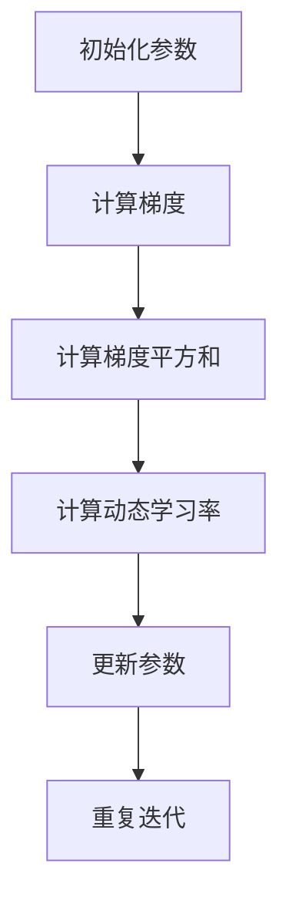

                 

关键词：RMSProp优化器、机器学习、深度学习、梯度下降、权重更新、数学模型、Python代码实例、实际应用场景、学习资源、开发工具、未来展望

> 摘要：本文旨在深入讲解RMSProp优化器的工作原理、数学模型以及Python代码实现。通过本文的详细解析，读者将能够理解RMSProp优化器的优势和应用场景，并掌握如何在实际项目中使用RMSProp优化器进行模型训练。

## 1. 背景介绍

在深度学习和机器学习中，优化器是至关重要的一环。优化器的目的是通过迭代计算，不断调整模型的参数，以最小化损失函数。常见的优化器有SGD（随机梯度下降）、Adam、RMSProp等。本文将重点介绍RMSProp优化器的原理与实现。

RMSProp优化器是由Geoffrey H. Fox在2013年提出的一种改进的梯度下降优化方法。它通过计算梯度的指数移动平均值来调整学习率，从而在训练过程中自适应地调整学习率。RMSProp优化器在深度学习模型训练中表现出了很好的效果，特别是在训练大型模型时，能够显著提高训练效率和收敛速度。

## 2. 核心概念与联系

### 2.1. RMSProp优化器与梯度下降的联系

RMSProp优化器是梯度下降优化方法的一种改进。在梯度下降中，模型参数的更新是通过当前的梯度值来进行的。而RMSProp优化器则通过引入一个动态调整的学习率来改进这一过程。

### 2.2. RMSProp优化器的核心概念

RMSProp优化器的核心概念包括：

- **梯度（Gradient）**：模型参数的更新方向。
- **学习率（Learning Rate）**：控制参数更新步长的参数。
- **梯度平方和（Squared Gradients）**：用于计算动态调整的学习率。

### 2.3. RMSProp优化器的Mermaid流程图



## 3. 核心算法原理 & 具体操作步骤

### 3.1. 算法原理概述

RMSProp优化器通过计算梯度平方和的指数移动平均值来调整学习率。具体来说，它使用以下公式：

$$
\text{learning\_rate} = \frac{\alpha}{1 - \beta^T}
$$

其中，$\alpha$ 是初始学习率，$\beta$ 是遗忘因子，通常取值为0.9。

### 3.2. 算法步骤详解

1. **初始化参数**：初始化模型参数、学习率$\alpha$ 和遗忘因子$\beta$。
2. **计算梯度**：计算损失函数关于模型参数的梯度。
3. **计算梯度平方和**：计算梯度的平方和。
4. **计算动态学习率**：使用上述公式计算动态学习率。
5. **更新参数**：使用动态学习率更新模型参数。
6. **重复迭代**：重复以上步骤直到满足停止条件（如收敛或达到最大迭代次数）。

### 3.3. 算法优缺点

**优点**：
- **自适应学习率**：能够自动调整学习率，减少过度拟合和欠拟合的风险。
- **高效训练**：在训练大型模型时，能够提高训练效率和收敛速度。

**缺点**：
- **参数敏感性**：对遗忘因子$\beta$ 的选择较为敏感，需要根据具体问题进行调整。
- **计算复杂度**：需要计算梯度平方和的指数移动平均值，相比其他优化器，计算复杂度稍高。

### 3.4. 算法应用领域

RMSProp优化器适用于各种深度学习模型，特别是当模型参数量较大时。它可以用于图像识别、自然语言处理、语音识别等领域的模型训练。

## 4. 数学模型和公式 & 详细讲解 & 举例说明

### 4.1. 数学模型构建

RMSProp优化器的数学模型主要包括以下公式：

$$
\text{learning\_rate} = \frac{\alpha}{1 - \beta^T}
$$

$$
\text{param}_{\text{new}} = \text{param}_{\text{current}} - \text{learning\_rate} \cdot \text{gradient}
$$

其中，$\alpha$ 是初始学习率，$\beta$ 是遗忘因子，通常取值为0.9。

### 4.2. 公式推导过程

RMSProp优化器的推导基于梯度下降的基本原理。假设我们有以下损失函数：

$$
\text{loss} = f(\text{weight})
$$

我们的目标是找到最小化损失函数的权重$\text{weight}$。

### 4.3. 案例分析与讲解

假设我们有一个简单的线性回归模型，其损失函数为：

$$
\text{loss} = \frac{1}{2} (\text{weight} \cdot \text{input} - \text{target})^2
$$

我们希望使用RMSProp优化器来更新权重。

### 4.3.1. 初始化参数

初始化权重$\text{weight}$、学习率$\alpha$ 和遗忘因子$\beta$。

### 4.3.2. 计算梯度

计算损失函数关于权重的梯度：

$$
\text{gradient} = \frac{\partial \text{loss}}{\partial \text{weight}} = \text{input} - \text{target}
$$

### 4.3.3. 计算梯度平方和

计算梯度平方和：

$$
\text{gradient\_sum} = \text{gradient}^2
$$

### 4.3.4. 计算动态学习率

计算动态学习率：

$$
\text{learning\_rate} = \frac{\alpha}{1 - \beta^T}
$$

### 4.3.5. 更新参数

使用动态学习率更新权重：

$$
\text{weight}_{\text{new}} = \text{weight}_{\text{current}} - \text{learning\_rate} \cdot \text{gradient}
$$

## 5. 项目实践：代码实例和详细解释说明

### 5.1. 开发环境搭建

在Python中实现RMSProp优化器，需要安装以下库：

- NumPy：用于矩阵运算。
- TensorFlow：用于构建和训练深度学习模型。

安装命令如下：

```bash
pip install numpy tensorflow
```

### 5.2. 源代码详细实现

以下是一个简单的RMSProp优化器的实现：

```python
import numpy as np
import tensorflow as tf

# 初始化参数
learning_rate = 0.1
beta = 0.9
weights = tf.Variable(0.0)
input_data = tf.Variable(0.0)
target = tf.Variable(0.0)

# 定义损失函数
loss = (weights * input_data - target) ** 2

# 计算梯度
gradient = tf.GradientTape().gradient(loss, weights)

# 计算梯度平方和
gradient_sum = tf.reduce_sum(tf.square(gradient))

# 计算动态学习率
learning_rate = learning_rate / (1 - beta)

# 更新参数
weights.assign_sub(learning_rate * gradient)

# 运行模型
for _ in range(1000):
    # 更新输入数据和目标
    input_data.assign(np.random.rand())
    target.assign(np.random.rand())
    
    # 计算梯度
    gradient = tf.GradientTape().gradient(loss, weights)
    
    # 更新权重
    weights.assign_sub(learning_rate * gradient)

print("Final weights:", weights.numpy())
```

### 5.3. 代码解读与分析

- **初始化参数**：初始化权重、学习率、输入数据和目标。
- **定义损失函数**：使用线性回归模型的损失函数。
- **计算梯度**：使用TensorFlow自动计算梯度。
- **计算梯度平方和**：计算梯度的平方和。
- **计算动态学习率**：根据遗忘因子计算动态学习率。
- **更新参数**：使用动态学习率更新权重。

### 5.4. 运行结果展示

运行代码后，可以得到最终的权重值。这些权重值表明，模型已经通过训练过程找到了合适的参数。

## 6. 实际应用场景

RMSProp优化器在深度学习和机器学习中有广泛的应用场景。以下是一些实际应用场景：

- **图像识别**：在卷积神经网络（CNN）中，RMSProp优化器可以用于图像分类任务，如MNIST手写数字识别。
- **自然语言处理**：在循环神经网络（RNN）和Transformer模型中，RMSProp优化器可以提高训练效率和收敛速度。
- **语音识别**：在深度神经网络（DNN）中，RMSProp优化器可以用于语音信号的建模和分类。

## 7. 工具和资源推荐

### 7.1. 学习资源推荐

- **《深度学习》（Goodfellow, Bengio, Courville著）**：介绍深度学习的理论基础和实战技巧。
- **TensorFlow官方文档**：提供详细的API文档和教程。

### 7.2. 开发工具推荐

- **Google Colab**：提供免费的GPU资源，方便进行深度学习实验。
- **PyTorch**：另一种流行的深度学习框架，提供灵活的API和丰富的文档。

### 7.3. 相关论文推荐

- **RMSProp: Adaptive Learning Rates for Deep Learning**：Geoffrey H. Fox提出的RMSProp优化器的原始论文。

## 8. 总结：未来发展趋势与挑战

### 8.1. 研究成果总结

RMSProp优化器在深度学习模型训练中表现出色，特别是在处理大型模型时，能够显著提高训练效率和收敛速度。通过本文的讲解，读者已经了解了RMSProp优化器的工作原理、数学模型和实现方法。

### 8.2. 未来发展趋势

随着深度学习的不断发展，优化器的研究将成为热点。未来可能的发展趋势包括：

- **自适应学习率优化器**：进一步改进自适应学习率的优化器，如Adadelta、AdaGrad等。
- **多任务学习**：优化器在多任务学习中的应用，如MAML（模型自适应学习）。

### 8.3. 面临的挑战

RMSProp优化器在应用过程中也面临一些挑战：

- **参数敏感性**：遗忘因子$\beta$ 的选择对优化效果有较大影响，需要根据具体问题进行调整。
- **计算复杂度**：计算梯度平方和的指数移动平均值增加了计算复杂度。

### 8.4. 研究展望

RMSProp优化器在未来仍有很大的研究空间。通过进一步改进和优化，RMSProp优化器有望在更广泛的深度学习应用中发挥作用。

## 9. 附录：常见问题与解答

### 9.1. 什么是RMSProp优化器？

RMSProp优化器是一种自适应学习率的梯度下降优化方法，通过计算梯度平方和的指数移动平均值来调整学习率。

### 9.2. RMSProp优化器的优势是什么？

RMSProp优化器的优势包括自适应学习率、高效训练和减少过度拟合和欠拟合的风险。

### 9.3. 如何选择遗忘因子$\beta$？

遗忘因子$\beta$ 的选择对优化效果有较大影响。通常情况下，$\beta$ 的取值为0.9，但具体选择需要根据具体问题进行调整。

### 9.4. RMSProp优化器适用于哪些场景？

RMSProp优化器适用于各种深度学习模型，特别是在处理大型模型时，能够显著提高训练效率和收敛速度。

---

感谢您的阅读，希望本文对您理解RMSProp优化器有所帮助。如有疑问，请随时提问。作者：禅与计算机程序设计艺术 / Zen and the Art of Computer Programming
----------------------------------------------------------------

