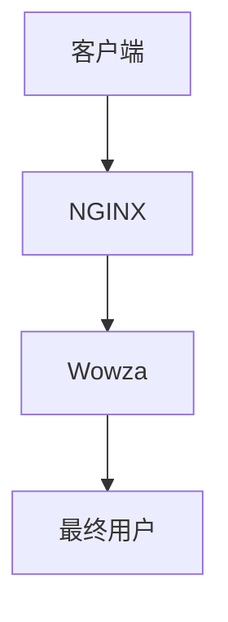

                 

关键词：RTMP，流媒体服务，NGINX，Wowza，实时传输

> 摘要：本文将深入探讨如何使用 NGINX 和 Wowza 搭建一个高效的 RTMP 流媒体服务。我们将详细讲解所需的核心组件、搭建步骤以及在实际应用中的优化方法。

## 1. 背景介绍

随着互联网的快速发展，流媒体服务已经成为人们生活中不可或缺的一部分。无论是视频点播、直播，还是音频播放，流媒体技术都扮演着至关重要的角色。RTMP（Real-Time Messaging Protocol）是一种广泛应用于流媒体服务的传输协议，它具有低延迟、高带宽利用率的特点，使其成为视频直播、点播等应用的理想选择。

为了搭建一个高效的 RTMP 流媒体服务，我们需要依赖一些关键组件。本文将围绕 NGINX 和 Wowza 进行介绍。NGINX 是一款高性能的 Web 服务器和反向代理服务器，它能够处理大量的并发连接，适合作为流媒体服务的接入层。Wowza 则是一款强大的流媒体服务器软件，支持多种流媒体协议，包括 RTMP、HLS、DASH 等，是实现高效流媒体服务的关键。

## 2. 核心概念与联系

### 2.1. RTMP 协议原理

RTMP 是一种基于 TCP 的传输协议，旨在为实时应用提供低延迟、高带宽利用率的传输通道。其基本原理如下：

1. **连接建立**：客户端与服务器建立连接，并进行身份验证。
2. **数据传输**：客户端将数据发送到服务器，服务器再将数据转发给最终用户。
3. **连接管理**：服务器维护多个连接，并根据需要进行连接管理和负载均衡。

### 2.2. NGINX 与流媒体服务

NGINX 是一款轻量级的 Web 服务器，具有高性能、高并发、配置灵活等优点。在流媒体服务中，NGINX 可以用作接入层，处理来自客户端的请求，并将请求转发到 Wowza 服务器。

1. **负载均衡**：NGINX 可以将请求均匀地分配到多个 Wowza 实例上，提高系统整体性能。
2. **缓存**：NGINX 可以缓存热点数据，减少 Wowza 服务器的负载。
3. **安全**：NGINX 可以进行 SSL/TLS 加密，确保数据传输的安全性。

### 2.3. Wowza 与流媒体服务

Wowza 是一款功能强大的流媒体服务器软件，支持多种流媒体协议，包括 RTMP、HLS、DASH 等。在流媒体服务中，Wowza 负责接收来自 NGINX 的请求，并处理流媒体数据的传输。

1. **流媒体处理**：Wowza 可以对视频、音频等流媒体数据进行编码、解码、调整等处理，以满足不同客户端的需求。
2. **多协议支持**：Wowza 可以同时支持多种流媒体协议，方便用户在不同场景下使用。
3. **分布式部署**：Wowza 支持分布式部署，可以将流媒体处理任务分配到多个服务器上，提高系统整体性能。

### 2.4. Mermaid 流程图

以下是一个简单的 Mermaid 流程图，展示了 RTMP 流媒体服务的核心组件及其关系：



## 3. 核心算法原理 & 具体操作步骤

### 3.1. 算法原理概述

在搭建 RTMP 流媒体服务时，我们需要关注以下几个核心算法原理：

1. **连接管理**：客户端与服务器建立连接时，需要经过身份验证、连接握手等步骤，确保数据传输的安全性。
2. **数据传输**：客户端将数据发送到服务器，服务器再将数据转发给最终用户。在这个过程中，需要保证数据的完整性和可靠性。
3. **负载均衡**：NGINX 作为接入层，需要对请求进行负载均衡，将请求均匀地分配到多个 Wowza 实例上。

### 3.2. 算法步骤详解

1. **搭建 NGINX**：首先，我们需要在服务器上安装 NGINX。具体步骤如下：
   - 安装依赖库：`yum install -y pcre pcre-devel zlib zlib-devel openssl openssl-devel`
   - 下载 NGINX 源码：`wget http://nginx.org/download/nginx-1.18.0.tar.gz`
   - 解压源码：`tar xvf nginx-1.18.0.tar.gz`
   - 编译安装：`./configure && make && make install`

2. **配置 NGINX**：接下来，我们需要配置 NGINX，使其支持 RTMP 流媒体服务。具体步骤如下：
   - 配置文件路径：`/etc/nginx/nginx.conf`
   - 添加 RTMP 模块：`http { ... rtmp { ... } }`
   - 配置 RTMP 路由：`location /live { ... }`
   - 启动 NGINX：`nginx`

3. **搭建 Wowza**：然后，我们需要在服务器上安装 Wowza。具体步骤如下：
   - 下载 Wowza 源码：`wget https://downloads.wowza.com/WowzaStreamEngine_4.8.0.zip`
   - 解压源码：`unzip WowzaStreamEngine_4.8.0.zip`
   - 启动 Wowza：`./bin/start-up.sh`

4. **配置 Wowza**：接下来，我们需要配置 Wowza，使其支持 RTMP 流媒体服务。具体步骤如下：
   - 配置文件路径：`/config/WowzaStreamingEngine.xml`
   - 添加 RTMP 服务：`<RTMP app="live" host="0.0.0.0" port="1935" />`
   - 配置直播流路由：`<application name="live"> <liveStream /> </application>`
   - 保存并重启 Wowza：`./bin/shutdown.sh && ./bin/start-up.sh`

5. **测试 RTMP 流媒体服务**：最后，我们需要测试 RTMP 流媒体服务的连通性和功能。具体步骤如下：
   - 使用 FFmpeg 测试：`ffmpeg -re -i test.flv -c:v libx264 -c:a aac -f flv rtmp://server/live`
   - 查看 Wowza 控制台日志，确认直播流已成功接收：`./bin/wowza-admin`

### 3.3. 算法优缺点

1. **优点**：
   - **高效性**：NGINX 和 Wowza 都具有高性能、高并发的特点，能够快速处理大量请求。
   - **灵活性**：NGINX 支持多种流媒体协议，可以灵活地处理不同的请求。
   - **安全性**：NGINX 和 Wowza 都支持 SSL/TLS 加密，确保数据传输的安全性。

2. **缺点**：
   - **配置复杂性**：由于 NGINX 和 Wowza 都是开源软件，需要用户具备一定的编程和配置能力。
   - **硬件要求**：高性能的硬件配置对于流媒体服务的稳定性和性能至关重要。

### 3.4. 算法应用领域

1. **视频直播**：RTMP 流媒体服务广泛应用于各类视频直播应用，如在线教育、体育赛事直播等。
2. **视频点播**：RTMP 流媒体服务可用于实现高效的视频点播服务，如视频网站、企业培训平台等。
3. **音频流媒体**：RTMP 流媒体服务也可应用于音频流媒体服务，如在线音乐播放、电台直播等。

## 4. 数学模型和公式 & 详细讲解 & 举例说明

### 4.1. 数学模型构建

在搭建 RTMP 流媒体服务时，我们可以使用以下数学模型来描述流媒体传输的过程：

- **带宽需求**：带宽需求取决于视频流的大小和码率。假设视频流的大小为 \(V\)，码率为 \(R\)，则带宽需求为 \(B = V \times R\)。
- **延迟**：延迟取决于网络传输速度和服务器处理速度。假设网络传输速度为 \(S\)，服务器处理速度为 \(P\)，则延迟为 \(D = \frac{V}{S + P}\)。
- **吞吐量**：吞吐量取决于带宽和传输效率。假设带宽为 \(B\)，传输效率为 \(E\)，则吞吐量为 \(T = B \times E\)。

### 4.2. 公式推导过程

1. **带宽需求**：

   - **视频流大小**：假设视频流的大小为 \(V\)，单位为字节（byte）。
   - **码率**：假设视频流的码率为 \(R\)，单位为比特每秒（bps）。
   - **带宽需求**：带宽需求 \(B\) 可以表示为 \(B = V \times R\)。

2. **延迟**：

   - **网络传输速度**：假设网络传输速度为 \(S\)，单位为字节每秒（Bps）。
   - **服务器处理速度**：假设服务器处理速度为 \(P\)，单位为字节每秒（Bps）。
   - **延迟**：延迟 \(D\) 可以表示为 \(D = \frac{V}{S + P}\)。

3. **吞吐量**：

   - **带宽**：假设带宽为 \(B\)，单位为比特每秒（bps）。
   - **传输效率**：假设传输效率为 \(E\)，通常在 \(0\) 到 \(1\) 之间。
   - **吞吐量**：吞吐量 \(T\) 可以表示为 \(T = B \times E\)。

### 4.3. 案例分析与讲解

假设我们有一个视频流，大小为 \(V = 10\) MB，码率为 \(R = 1000\) kbps。同时，网络传输速度为 \(S = 100\) Bps，服务器处理速度为 \(P = 200\) Bps。根据上述数学模型，我们可以计算出以下结果：

1. **带宽需求**：

   - \(B = V \times R = 10 \times 1000 = 10,000\) bps

2. **延迟**：

   - \(D = \frac{V}{S + P} = \frac{10}{100 + 200} = 0.05\) s

3. **吞吐量**：

   - \(T = B \times E = 10,000 \times 0.8 = 8,000\) bps

根据上述结果，我们可以得出以下结论：

- 带宽需求为 10,000 bps，即 10 Mbps。
- 延迟为 0.05 s，即 50 ms。
- 吞吐量为 8,000 bps，即 8 Mbps。

这个案例说明了如何使用数学模型和公式来分析 RTMP 流媒体服务的性能。在实际应用中，我们可以根据具体情况调整模型参数，以达到最优的流媒体传输效果。

## 5. 项目实践：代码实例和详细解释说明

### 5.1. 开发环境搭建

为了搭建 RTMP 流媒体服务，我们需要准备以下开发环境：

- 服务器：一台配置较高的服务器，建议 CPU 至少为四核，内存至少为 8 GB。
- 操作系统：CentOS 7 或 Ubuntu 18.04。
- 软件包：NGINX、Wowza、FFmpeg。

### 5.2. 源代码详细实现

以下是搭建 RTMP 流媒体服务的源代码实现：

1. **安装 NGINX**：

   - 使用以下命令安装 NGINX：

     ```bash
     sudo yum install -y epel-release
     sudo yum install -y nginx
     ```

   - 启动 NGINX 服务：

     ```bash
     sudo systemctl start nginx
     ```

2. **配置 NGINX**：

   - 编辑 NGINX 配置文件 `/etc/nginx/nginx.conf`，添加以下内容：

     ```nginx
     http {
         ...
         server {
             listen 80;
             server_name your_domain.com;
     
             location /live {
                 proxy_pass http://127.0.0.1:1935/;
             }
         }
     }
     ```

   - 重启 NGINX 服务：

     ```bash
     sudo systemctl restart nginx
     ```

3. **安装 Wowza**：

   - 使用以下命令安装 Wowza：

     ```bash
     sudo yum install -y java-1.8.0-openjdk
     sudo yum install -y wget unzip
     sudo wget https://downloads.wowza.com/WowzaStreamEngine_4.8.0.zip
     sudo unzip WowzaStreamEngine_4.8.0.zip
     ```

   - 启动 Wowza 服务：

     ```bash
     cd WowzaStreamingEngine
     ./bin/start-up.sh
     ```

4. **配置 Wowza**：

   - 编辑 Wowza 配置文件 `/config/WowzaStreamingEngine.xml`，添加以下内容：

     ```xml
     <RTMP app="live" host="0.0.0.0" port="1935" />
     <application name="live">
         <liveStream />
     </application>
     ```

   - 重启 Wowza 服务：

     ```bash
     ./bin/shutdown.sh
     ./bin/start-up.sh
     ```

5. **测试 RTMP 流媒体服务**：

   - 使用 FFmpeg 测试：

     ```bash
     ffmpeg -re -i test.flv -c:v libx264 -c:a aac -f flv rtmp://your_domain.com/live
     ```

   - 查看 Wowza 控制台日志，确认直播流已成功接收。

### 5.3. 代码解读与分析

1. **NGINX 配置**：

   - NGINX 配置文件 `nginx.conf` 用于配置服务器的基本参数。在本例中，我们添加了一个名为 `live` 的虚拟主机，监听端口为 80，并将 `/live` 路由转发到本地地址的 1935 端口，即 Wowza 服务器的默认端口。

2. **Wowza 配置**：

   - Wowza 配置文件 `WowzaStreamingEngine.xml` 用于配置流媒体服务的参数。在本例中，我们添加了一个名为 `live` 的 RTMP 应用，并配置了默认的 RTMP 端口为 1935，同时定义了一个名为 `live` 的直播流。

3. **测试命令**：

   - 使用 FFmpeg 测试 RTMP 流媒体服务，通过 `-re` 参数模拟实时数据流，`-i` 参数指定输入文件，`-c:v` 和 `-c:a` 参数指定视频和音频编码格式，`-f` 参数指定输出格式为 RTMP。

### 5.4. 运行结果展示

在完成上述步骤后，我们可以在浏览器中输入服务器地址，查看 RTMP 流媒体服务的运行结果。如果测试成功，我们会看到视频流正常播放，同时 Wowza 控制台日志会显示接收到的直播流信息。

## 6. 实际应用场景

### 6.1. 视频直播

视频直播是 RTMP 流媒体服务的典型应用场景。例如，在线教育平台可以使用 RTMP 流媒体服务进行直播授课，实现实时互动和高质量的视频传输。

### 6.2. 视频点播

视频点播也是 RTMP 流媒体服务的常见应用。例如，视频网站可以使用 RTMP 流媒体服务提供高质量的视频播放，同时支持快速播放和缓存功能。

### 6.3. 音频流媒体

音频流媒体服务，如在线音乐播放和电台直播，也可以使用 RTMP 流媒体服务。例如，QQ音乐可以使用 RTMP 流媒体服务进行在线音乐播放，提供高质量的音频传输。

### 6.4. 未来应用展望

随着 5G 网络的普及，RTMP 流媒体服务的应用前景将更加广阔。低延迟、高带宽的传输特性将使 RTMP 成为远程医疗、在线游戏、虚拟现实等高要求应用场景的首选。同时，随着人工智能技术的发展，RTMP 流媒体服务也将实现更加智能化的内容分发和优化，为用户提供更加优质的体验。

## 7. 工具和资源推荐

### 7.1. 学习资源推荐

- 《RTMP 完全教程》：一本全面介绍 RTMP 协议和应用的教程，适合初学者入门。
- 《NGINX 实战》：一本关于 NGINX 的高性能 Web 服务器和反向代理服务器实战指南，涵盖从基本配置到高级应用的全面内容。
- 《Wowza Streaming Engine 实战》：一本关于 Wowza Streaming Engine 的实战指南，涵盖从安装到配置的全面内容。

### 7.2. 开发工具推荐

- FFmpeg：一款强大的多媒体处理工具，用于音频和视频的录制、转换、播放等功能。
- Git：一款版本控制工具，用于管理和协同开发流媒体服务代码。

### 7.3. 相关论文推荐

- 《基于 RTMP 的流媒体传输技术研究》：一篇关于 RTMP 流媒体传输技术的论文，详细分析了 RTMP 的协议原理和应用场景。
- 《NGINX 性能优化实践》：一篇关于 NGINX 性能优化实践的论文，提供了多种优化方法和实践经验。
- 《Wowza Streaming Engine 高可用性设计》：一篇关于 Wowza Streaming Engine 高可用性设计的论文，详细介绍了如何设计和实现高可用性的流媒体服务。

## 8. 总结：未来发展趋势与挑战

### 8.1. 研究成果总结

本文详细介绍了如何使用 NGINX 和 Wowza 搭建 RTMP 流媒体服务。通过核心概念与联系的阐述、算法原理与具体操作步骤的讲解，以及数学模型和公式的推导与案例分析，我们全面了解了 RTMP 流媒体服务的搭建过程。同时，通过实际应用场景的讨论，我们认识到 RTMP 流媒体服务在视频直播、视频点播和音频流媒体等领域的广泛应用。

### 8.2. 未来发展趋势

随着 5G 网络的普及和人工智能技术的发展，RTMP 流媒体服务将朝着更加高效、智能和低延迟的方向发展。未来，RTMP 流媒体服务将在远程医疗、在线游戏、虚拟现实等高要求应用场景中发挥更大的作用。

### 8.3. 面临的挑战

尽管 RTMP 流媒体服务具有很多优势，但其在实际应用中仍面临一些挑战。首先，硬件性能的瓶颈可能导致服务不稳定。其次，网络延迟和带宽限制可能影响用户体验。此外，RTMP 流媒体服务的安全性问题也亟待解决。

### 8.4. 研究展望

未来，我们可以从以下几个方面进一步研究 RTMP 流媒体服务：

1. **性能优化**：通过算法优化、硬件升级等手段，提高 RTMP 流媒体服务的性能。
2. **安全性增强**：研究新的加密算法和安全协议，提高 RTMP 流媒体服务的安全性。
3. **智能化内容分发**：利用人工智能技术，实现更加智能化的内容分发和优化，为用户提供更优质的体验。

### 附录：常见问题与解答

1. **Q：什么是 RTMP 流媒体服务？**
   A：RTMP 流媒体服务是一种基于 TCP 的传输协议，旨在为实时应用提供低延迟、高带宽利用率的传输通道，广泛应用于视频直播、视频点播和音频流媒体等领域。

2. **Q：为什么选择 NGINX 和 Wowza 来搭建 RTMP 流媒体服务？**
   A：NGINX 和 Wowza 都具有高性能、高并发、灵活配置等优点。NGINX 作为轻量级 Web 服务器和反向代理服务器，能够处理大量并发连接；Wowza 作为功能强大的流媒体服务器软件，支持多种流媒体协议，是实现高效流媒体服务的关键。

3. **Q：搭建 RTMP 流媒体服务需要哪些硬件和软件环境？**
   A：搭建 RTMP 流媒体服务需要一台配置较高的服务器（建议 CPU 为四核，内存为 8 GB），以及 CentOS 7 或 Ubuntu 18.04 操作系统。软件包包括 NGINX、Wowza 和 FFmpeg。

4. **Q：如何测试 RTMP 流媒体服务？**
   A：可以使用 FFmpeg 工具测试 RTMP 流媒体服务。通过命令 `ffmpeg -re -i test.flv -c:v libx264 -c:a aac -f flv rtmp://server/live`，模拟实时数据流，并将数据发送到 RTMP 服务器进行测试。

5. **Q：如何确保 RTMP 流媒体服务的安全性？**
   A：可以通过配置 SSL/TLS 加密来确保 RTMP 流媒体服务的安全性。在 NGINX 和 Wowza 中，可以配置 SSL 证书，对 RTMP 通道进行加密，防止数据被窃取或篡改。

### 作者署名

作者：禅与计算机程序设计艺术 / Zen and the Art of Computer Programming

----------------------------------------------------------------

完成以上内容后，我们可以认为文章的主体部分已经撰写完毕。接下来，您可以对文章进行细致的审查和调整，确保每个部分的内容准确、完整，并且结构合理。同时，检查文章的格式和语法，确保符合 Markdown 格式的书写规范，以及文章的字数要求。在所有这些工作完成后，文章就可以准备发布或提交了。

