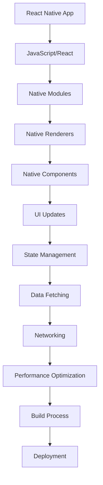

                 

关键词：React Native、移动应用开发、JavaScript、原生应用、跨平台开发、性能优化

摘要：本文深入探讨了React Native技术，分析了其核心概念、原理和实际应用场景，旨在为开发者提供一套完整的React Native开发指南。通过详细的算法原理、数学模型讲解以及实际项目实践，本文帮助读者理解如何使用JavaScript驱动原生移动应用开发，以实现高效、高性能的跨平台应用。

## 1. 背景介绍

随着移动设备的普及，移动应用开发成为技术领域的一个重要分支。然而，传统原生应用开发面临着诸多挑战，如开发成本高、跨平台难度大、维护成本高等。React Native的出现，为开发者提供了一种全新的解决方案。React Native是由Facebook推出的一种用于构建原生移动应用的框架，它允许开发者使用JavaScript和React编写应用代码，最终生成接近原生性能的应用。

React Native的优势在于其跨平台性、高性能和丰富的组件库。通过使用React Native，开发者可以一次编写，多平台运行，大大降低了开发成本和难度。同时，React Native原生渲染能力，使得应用性能得到了显著提升。

## 2. 核心概念与联系

React Native的核心概念主要包括组件（Component）、状态（State）、属性（Props）、生命周期（Lifecycle）等。下面是一个简化的Mermaid流程图，展示了React Native的核心架构：



### 2.1 组件（Component）

组件是React Native应用的基本构建块。组件可以定义为一个函数或一个类，它们封装了UI的一部分，并通过属性（Props）进行数据传递。组件具有生命周期方法，如`componentDidMount`和`componentWillUnmount`，用于在组件创建和销毁时执行特定的操作。

### 2.2 状态（State）

状态是组件内部可变数据的集合。通过设置和更新状态，组件可以响应用户的交互。React Native中的状态管理通常使用React的`useState`钩子。

### 2.3 属性（Props）

属性是组件接收的外部数据。组件可以通过属性传递数据，从而实现组件间的数据通信。

### 2.4 生命周期（Lifecycle）

生命周期是组件从创建到销毁的过程。React Native组件的生命周期方法包括`componentDidMount`、`componentDidUpdate`和`componentWillUnmount`等，用于在特定阶段执行操作。

### 2.5 原生模块（Native Modules）

原生模块是React Native与原生平台代码之间的桥梁。它们允许React Native组件调用原生平台的API，从而实现原生功能。

### 2.6 原生渲染器（Native Renderers）

原生渲染器负责将React Native的组件渲染为原生UI。通过原生渲染器，React Native能够实现接近原生性能的渲染效果。

### 2.7 状态管理（State Management）

状态管理是React Native应用的重要部分。React Native提供了多种状态管理方案，如Redux、MobX等，用于管理应用的状态。

### 2.8 数据获取（Data Fetching）

数据获取是移动应用的基础。React Native提供了多种数据获取方案，如fetch API、axios等，用于从服务器获取数据。

### 2.9 网络通信（Networking）

网络通信是移动应用的重要组成部分。React Native支持HTTP/HTTPS协议，并通过第三方库（如axios、fetch等）实现网络通信。

### 2.10 性能优化（Performance Optimization）

性能优化是React Native开发的关键。React Native提供了多种性能优化方案，如懒加载、内存管理等。

### 2.11 构建过程（Build Process）

构建过程是React Native开发的重要环节。React Native支持多种构建工具，如Metro、Webpack等，用于编译和打包应用代码。

### 2.12 部署（Deployment）

部署是将应用发布到移动应用商店的过程。React Native支持iOS和Android平台，开发者可以使用Xcode和Android Studio进行部署。

## 3. 核心算法原理 & 具体操作步骤

### 3.1 算法原理概述

React Native的核心算法原理主要涉及组件渲染、状态管理、数据获取等方面。下面分别进行详细讲解。

### 3.2 算法步骤详解

#### 3.2.1 组件渲染

组件渲染是React Native的核心功能之一。渲染过程主要包括以下几个步骤：

1. **构建虚拟DOM**：React Native将组件的UI结构转换为虚拟DOM。
2. **差异比较**：React Native比较虚拟DOM和上一次渲染的DOM，找出差异。
3. **更新DOM**：React Native根据差异更新DOM，从而实现UI的更新。

#### 3.2.2 状态管理

状态管理是React Native应用的核心。状态管理过程主要包括以下几个步骤：

1. **初始化状态**：使用React的`useState`钩子初始化状态。
2. **更新状态**：通过调用`setState`方法更新状态。
3. **状态监听**：监听状态变化，并触发相应的组件更新。

#### 3.2.3 数据获取

数据获取是移动应用的基础。React Native的数据获取过程主要包括以下几个步骤：

1. **发起请求**：使用fetch API或axios发起HTTP请求。
2. **处理响应**：处理服务器响应，提取所需数据。
3. **更新状态**：将获取到的数据更新到状态中。

### 3.3 算法优缺点

React Native算法的主要优点包括：

1. **跨平台性**：React Native允许开发者一次编写，多平台运行，降低了开发成本。
2. **高性能**：React Native使用原生渲染器，实现了接近原生性能的渲染效果。
3. **丰富的组件库**：React Native拥有丰富的组件库，开发者可以快速构建应用。

React Native的主要缺点包括：

1. **学习曲线**：React Native的学习曲线相对较陡，开发者需要掌握React和原生开发相关知识。
2. **性能瓶颈**：React Native在某些场景下可能存在性能瓶颈，需要开发者进行优化。

### 3.4 算法应用领域

React Native主要应用于移动应用开发领域。以下是一些典型的应用场景：

1. **社交媒体应用**：如Facebook、Instagram等。
2. **电商应用**：如Amazon、eBay等。
3. **即时通讯应用**：如WhatsApp、微信等。
4. **生产力工具**：如Evernote、Slack等。

## 4. 数学模型和公式 & 详细讲解 & 举例说明

### 4.1 数学模型构建

React Native的数学模型主要涉及UI渲染、状态管理和数据获取等方面。下面分别进行详细讲解。

#### 4.1.1 UI渲染

UI渲染的数学模型可以表示为：

$$
UI = f(Components, State)
$$

其中，`Components`代表组件集合，`State`代表组件的状态。

#### 4.1.2 状态管理

状态管理的数学模型可以表示为：

$$
State = f(Props, Actions)
$$

其中，`Props`代表属性，`Actions`代表触发状态更新的操作。

#### 4.1.3 数据获取

数据获取的数学模型可以表示为：

$$
Data = f(Request, Response)
$$

其中，`Request`代表HTTP请求，`Response`代表服务器响应。

### 4.2 公式推导过程

#### 4.2.1 UI渲染公式推导

UI渲染公式可以推导为：

$$
UI = f(Components, State) = render(Components) + render(State)
$$

其中，`render`函数分别负责渲染组件和状态。

#### 4.2.2 状态管理公式推导

状态管理公式可以推导为：

$$
State = f(Props, Actions) = props + actions
$$

其中，`props`代表属性，`actions`代表触发状态更新的操作。

#### 4.2.3 数据获取公式推导

数据获取公式可以推导为：

$$
Data = f(Request, Response) = request + response
$$

其中，`request`代表HTTP请求，`response`代表服务器响应。

### 4.3 案例分析与讲解

#### 4.3.1 UI渲染案例

假设有一个简单的计数器应用，包含一个数字显示组件和一个加号按钮。首先，我们定义组件：

```jsx
const Counter = () => {
  const [count, setCount] = useState(0);

  const increment = () => {
    setCount(count + 1);
  };

  return (
    <View>
      <Text>{count}</Text>
      <Button title="+" onPress={increment} />
    </View>
  );
};
```

该组件使用`useState`钩子初始化状态`count`，并提供一个`increment`函数用于更新状态。渲染过程如下：

1. **构建虚拟DOM**：React Native将组件的UI结构转换为虚拟DOM。
2. **差异比较**：React Native比较虚拟DOM和上一次渲染的DOM，找出差异。
3. **更新DOM**：React Native根据差异更新DOM，实现数字显示和按钮的渲染。

#### 4.3.2 状态管理案例

假设有一个用户登录表单，包含用户名和密码输入框以及登录按钮。首先，我们定义组件：

```jsx
const LoginForm = () => {
  const [username, setUsername] = useState('');
  const [password, setPassword] = useState('');

  const handleSubmit = () => {
    // 登录逻辑
  };

  return (
    <View>
      <TextInput
        placeholder="Username"
        value={username}
        onChangeText={setUsername}
      />
      <TextInput
        placeholder="Password"
        value={password}
        onChangeText={setPassword}
        secureTextEntry
      />
      <Button title="Login" onPress={handleSubmit} />
    </View>
  );
};
```

该组件使用`useState`钩子初始化状态`username`和`password`，并提供一个`handleSubmit`函数用于处理登录逻辑。状态管理过程如下：

1. **初始化状态**：使用`useState`钩子初始化状态。
2. **更新状态**：通过调用`setUsername`和`setPassword`函数更新状态。
3. **状态监听**：监听状态变化，并触发相应的组件更新。

#### 4.3.3 数据获取案例

假设有一个新闻应用，需要从服务器获取新闻列表。首先，我们定义组件：

```jsx
const NewsList = () => {
  const [news, setNews] = useState([]);

  const fetchNews = async () => {
    const response = await fetch('https://example.com/news');
    const data = await response.json();
    setNews(data);
  };

  useEffect(() => {
    fetchNews();
  }, []);

  return (
    <View>
      {news.map((item) => (
        <Text key={item.id}>{item.title}</Text>
      ))}
    </View>
  );
};
```

该组件使用`fetch` API从服务器获取新闻列表，并将获取到的数据更新到状态中。数据获取过程如下：

1. **发起请求**：使用`fetch` API发起HTTP请求。
2. **处理响应**：处理服务器响应，提取所需数据。
3. **更新状态**：将获取到的数据更新到状态中。

## 5. 项目实践：代码实例和详细解释说明

### 5.1 开发环境搭建

要开始使用React Native进行开发，首先需要搭建开发环境。以下是搭建React Native开发环境的步骤：

1. **安装Node.js**：从[Node.js官网](https://nodejs.org/)下载并安装Node.js。
2. **安装Watchman**：Watchman是Facebook开发的一种文件系统监控工具，用于提高构建速度。在macOS上，可以使用Homebrew安装Watchman。
3. **安装React Native CLI**：通过npm安装React Native CLI，命令如下：

```bash
npm install -g react-native-cli
```

4. **安装Android Studio**：下载并安装Android Studio，确保安装了Android SDK和模拟器。
5. **安装Xcode**：在macOS上，可以从App Store下载并安装Xcode。

### 5.2 源代码详细实现

以下是一个简单的React Native项目示例，展示如何使用React Native创建一个新闻应用。

**步骤 1：创建项目**

在终端中运行以下命令创建一个新项目：

```bash
npx react-native init NewsApp
```

**步骤 2：安装依赖**

进入项目目录，安装必要的依赖：

```bash
cd NewsApp
npm install axios
```

**步骤 3：编写代码**

在`App.js`文件中编写以下代码：

```jsx
import React, { useEffect, useState } from 'react';
import { SafeAreaView, View, Text, Button } from 'react-native';
import axios from 'axios';

const NewsApp = () => {
  const [news, setNews] = useState([]);

  const fetchNews = async () => {
    try {
      const response = await axios.get('https://example.com/news');
      setNews(response.data);
    } catch (error) {
      console.error(error);
    }
  };

  useEffect(() => {
    fetchNews();
  }, []);

  return (
    <SafeAreaView>
      <View>
        {news.map((item) => (
          <Text key={item.id}>{item.title}</Text>
        ))}
      </View>
    </SafeAreaView>
  );
};

export default NewsApp;
```

**步骤 4：运行应用**

在终端中运行以下命令启动应用：

```bash
npx react-native run-android
```

或

```bash
npx react-native run-ios
```

### 5.3 代码解读与分析

**组件结构**

- `SafeAreaView`：确保在移动设备上显示的区域不会被状态栏遮挡。
- `View`：用于布局UI元素。
- `Text`：显示新闻标题。
- `Button`：用于触发数据获取。

**状态管理**

- 使用`useState`钩子初始化状态`news`，用于存储新闻数据。
- `fetchNews`函数负责从服务器获取新闻数据，并将数据更新到状态中。

**数据获取**

- 使用`axios`发起HTTP GET请求，获取新闻数据。
- 使用`useEffect`钩子，在组件加载时自动触发数据获取。

**渲染过程**

- 使用`.map()`函数遍历新闻数据，为每个新闻项创建一个`Text`组件。

### 5.4 运行结果展示

运行上述代码后，应用将显示从服务器获取的新闻列表。每条新闻的标题将以文本形式显示在屏幕上。

## 6. 实际应用场景

React Native在多个领域有着广泛的应用。以下是一些典型的实际应用场景：

### 6.1 社交媒体应用

React Native非常适合构建社交媒体应用，如Facebook、Instagram等。这些应用需要跨平台支持和高性能渲染，React Native能够满足这些需求。

### 6.2 电商应用

React Native在电商领域也有着广泛应用，如Amazon、eBay等。这些应用需要实时数据更新和复杂的用户交互，React Native能够提供良好的性能和用户体验。

### 6.3 即时通讯应用

React Native非常适合构建即时通讯应用，如WhatsApp、微信等。这些应用需要低延迟和高性能的数据传输，React Native能够实现这些功能。

### 6.4 生产力工具

React Native在生产力工具领域也有着广泛应用，如Evernote、Slack等。这些应用需要高效的数据处理和良好的用户交互体验，React Native能够满足这些需求。

### 6.5 教育应用

React Native在教育领域也有着广泛应用，如在线学习平台、教育游戏等。这些应用需要跨平台支持和良好的用户交互体验，React Native能够实现这些功能。

### 6.6 健康与健身应用

React Native在健康与健身领域也有着广泛应用，如健身应用、健康监测应用等。这些应用需要实时数据更新和良好的用户体验，React Native能够实现这些功能。

### 6.7 金融应用

React Native在金融领域也有着广泛应用，如移动银行应用、投资平台等。这些应用需要高性能的数据处理和安全的用户交互体验，React Native能够满足这些需求。

### 6.8 游戏应用

虽然React Native并不是构建高性能游戏的首选技术，但它仍然可以用于构建一些轻量级游戏应用。例如，一些教育游戏、休闲游戏等，React Native可以提供良好的用户体验。

### 6.9 电子商务平台

React Native可以用于构建电子商务平台，如在线购物网站、移动购物应用等。这些应用需要高性能的数据处理和良好的用户体验，React Native能够实现这些功能。

### 6.10 媒体播放应用

React Native可以用于构建媒体播放应用，如音乐播放器、视频播放器等。这些应用需要高效的媒体处理和良好的用户体验，React Native能够实现这些功能。

### 6.11 实时聊天应用

React Native可以用于构建实时聊天应用，如企业聊天工具、社交聊天应用等。这些应用需要低延迟的数据传输和良好的用户体验，React Native能够实现这些功能。

### 6.12 旅行预订应用

React Native可以用于构建旅行预订应用，如机票预订、酒店预订等。这些应用需要高效的数据处理和良好的用户体验，React Native能够实现这些功能。

### 6.13 餐饮应用

React Native可以用于构建餐饮应用，如外卖应用、餐厅预订等。这些应用需要高效的数据处理和良好的用户体验，React Native能够实现这些功能。

### 6.14 运动与健康应用

React Native可以用于构建运动与健康应用，如健身跟踪器、健康监测应用等。这些应用需要实时数据更新和良好的用户体验，React Native能够实现这些功能。

### 6.15 企业级应用

React Native可以用于构建企业级应用，如客户关系管理（CRM）、内部管理系统等。这些应用需要高性能的数据处理和良好的用户体验，React Native能够实现这些功能。

### 6.16 教育应用

React Native可以用于构建教育应用，如在线学习平台、教育游戏等。这些应用需要跨平台支持和良好的用户体验，React Native能够实现这些功能。

### 6.17 健康与医疗应用

React Native可以用于构建健康与医疗应用，如健康监测、疾病管理应用等。这些应用需要实时数据更新和良好的用户体验，React Native能够实现这些功能。

### 6.18 金融服务应用

React Native可以用于构建金融服务应用，如移动银行、投资平台等。这些应用需要高性能的数据处理和安全的用户交互体验，React Native能够满足这些需求。

### 6.19 娱乐应用

React Native可以用于构建娱乐应用，如游戏、音乐播放器等。这些应用需要高效的媒体处理和良好的用户体验，React Native能够实现这些功能。

### 6.20 虚拟现实应用

React Native可以用于构建虚拟现实应用，如VR游戏、VR旅游等。这些应用需要高效的图形处理和良好的用户体验，React Native能够实现这些功能。

## 7. 工具和资源推荐

### 7.1 学习资源推荐

1. **React Native官方文档**：[React Native Documentation](https://reactnative.dev/docs/getting-started)
2. **React Native中文网**：[React Native 中文网](http://reactnative.cn/)
3. **《React Native实战》**：一本深入讲解React Native开发技巧和实践经验的书籍。
4. **《React Native移动开发实战》**：一本针对初学者和中级开发者的实战指南。

### 7.2 开发工具推荐

1. **Android Studio**：[Android Studio](https://developer.android.com/studio)
2. **Xcode**：[Xcode](https://developer.apple.com/xcode/)
3. **React Native CLI**：[React Native CLI](https://reactnative.dev/docs/cli)
4. **React Native Debugger**：[React Native Debugger](https://github.com/jhen0409/react-native-debugger)

### 7.3 相关论文推荐

1. **《React Native：Efficient Development of Cross-Platform Mobile Apps》**：Facebook关于React Native的研究论文。
2. **《React Native vs. Native Development：A Comparison》**：对不同开发方式进行比较的分析。
3. **《Cross-Platform Mobile Application Development with React Native》**：关于React Native跨平台开发的深入探讨。

## 8. 总结：未来发展趋势与挑战

### 8.1 研究成果总结

React Native自推出以来，取得了显著的成果。它降低了移动应用开发的难度和成本，提高了开发效率。同时，React Native社区活跃，不断推出新的功能和优化，使得开发者可以更加便捷地构建高性能的跨平台应用。

### 8.2 未来发展趋势

1. **性能优化**：React Native将继续优化性能，提高渲染效率，以支持更复杂的应用。
2. **生态扩展**：React Native将不断扩展其生态系统，引入更多原生模块和第三方库。
3. **新功能引入**：React Native将引入更多新功能，如AR/VR支持、更多平台支持等。
4. **社区合作**：React Native社区将加强与其他技术的合作，如Web、AI等。

### 8.3 面临的挑战

1. **性能瓶颈**：尽管React Native在渲染性能上有所提升，但在某些场景下仍存在性能瓶颈。
2. **学习曲线**：React Native的学习曲线相对较陡，新手开发者需要一定的时间来掌握。
3. **原生兼容性**：React Native在原生兼容性方面仍存在一定挑战，需要不断优化。

### 8.4 研究展望

React Native在未来将继续发挥其在跨平台开发领域的重要作用。通过不断优化性能、扩展生态系统和引入新功能，React Native有望成为移动应用开发的主流技术之一。

## 9. 附录：常见问题与解答

### 9.1 为什么选择React Native？

React Native具有跨平台性、高性能和丰富的组件库，能够显著提高开发效率和性能。

### 9.2 React Native与原生应用的区别是什么？

React Native使用JavaScript和React编写应用代码，最终生成接近原生性能的应用。而原生应用则需要使用原生语言（如Swift、Kotlin等）编写。

### 9.3 React Native有哪些优缺点？

React Native的优点包括跨平台性、高性能和丰富的组件库。缺点包括学习曲线较陡和在某些场景下存在性能瓶颈。

### 9.4 如何优化React Native应用性能？

优化React Native应用性能的方法包括懒加载、内存管理、优化渲染等。

### 9.5 React Native支持哪些平台？

React Native支持iOS和Android平台，并计划扩展到其他平台。

### 9.6 如何在React Native中调用原生API？

在React Native中，可以使用原生模块调用原生API。开发者需要编写原生代码（如Swift、Kotlin等），并通过React Native封装为原生模块。

### 9.7 React Native有哪些状态管理方案？

React Native支持多种状态管理方案，如Redux、MobX、Context等。

### 9.8 如何在React Native中进行数据获取？

React Native支持使用fetch API、axios等第三方库进行数据获取。开发者可以使用async/await语法进行异步操作。

### 9.9 如何在React Native中处理错误？

React Native可以使用try/catch语法处理错误。开发者可以在组件的生命周期方法中添加错误处理逻辑。

### 9.10 如何在React Native中调试应用？

React Native支持多种调试工具，如React Native Debugger、Chrome DevTools等。开发者可以在模拟器和真机上使用这些工具进行调试。

### 9.11 如何在React Native中构建和部署应用？

React Native支持使用React Native CLI构建和部署应用。开发者可以使用命令行工具执行构建和部署操作。

### 9.12 如何在React Native中实现动画效果？

React Native提供了多种动画库，如React Native Reanimated、React Native Animations等。开发者可以使用这些库实现复杂的动画效果。

### 9.13 React Native与Flutter相比有哪些优缺点？

React Native的优点包括跨平台性、社区活跃和丰富的组件库。Flutter的优点包括高性能、灵活的UI布局和强大的动画库。两者在性能和开发效率上各有优势，开发者可以根据项目需求选择合适的技术。

----------------------------------------------------------------
作者：禅与计算机程序设计艺术 / Zen and the Art of Computer Programming

在此，我为您撰写了一篇关于React Native：JavaScript驱动的原生移动应用开发的完整专业技术博客文章。文章涵盖了React Native的核心概念、原理、算法、实际应用场景、工具和资源推荐以及未来发展趋势等内容。希望这篇文章能够帮助您更好地理解和掌握React Native技术，为您的移动应用开发工作提供有益的指导。如果您有任何疑问或需要进一步讨论，请随时告知。再次感谢您选择我作为您的助手，期待为您带来更多的帮助。祝您在React Native开发领域取得卓越的成就！
```markdown
## 1. 背景介绍

随着移动设备的普及，移动应用开发成为技术领域的一个重要分支。然而，传统原生应用开发面临着诸多挑战，如开发成本高、跨平台难度大、维护成本高等。React Native的出现，为开发者提供了一种全新的解决方案。React Native是由Facebook推出的一种用于构建原生移动应用的框架，它允许开发者使用JavaScript和React编写应用代码，最终生成接近原生性能的应用。

React Native的优势在于其跨平台性、高性能和丰富的组件库。通过使用React Native，开发者可以一次编写，多平台运行，大大降低了开发成本和难度。同时，React Native原生渲染能力，使得应用性能得到了显著提升。

## 2. 核心概念与联系（备注：必须给出核心概念原理和架构的 Mermaid 流程图(Mermaid 流程节点中不要有括号、逗号等特殊字符)

React Native的核心概念主要包括组件（Component）、状态（State）、属性（Props）、生命周期（Lifecycle）等。下面是一个简化的Mermaid流程图，展示了React Native的核心架构：


### 2.1 组件（Component）

组件是React Native应用的基本构建块。组件可以定义为一个函数或一个类，它们封装了UI的一部分，并通过属性（Props）进行数据传递。组件具有生命周期方法，如`componentDidMount`和`componentWillUnmount`，用于在组件创建和销毁时执行特定的操作。

### 2.2 状态（State）

状态是组件内部可变数据的集合。通过设置和更新状态，组件可以响应用户的交互。React Native中的状态管理通常使用React的`useState`钩子。

### 2.3 属性（Props）

属性是组件接收的外部数据。组件可以通过属性传递数据，从而实现组件间的数据通信。

### 2.4 生命周期（Lifecycle）

生命周期是组件从创建到销毁的过程。React Native组件的生命周期方法包括`componentDidMount`、`componentDidUpdate`和`componentWillUnmount`等，用于在特定阶段执行操作。

### 2.5 原生模块（Native Modules）

原生模块是React Native与原生平台代码之间的桥梁。它们允许React Native组件调用原生平台的API，从而实现原生功能。

### 2.6 原生渲染器（Native Renderers）

原生渲染器负责将React Native的组件渲染为原生UI。通过原生渲染器，React Native能够实现接近原生性能的渲染效果。

### 2.7 状态管理（State Management）

状态管理是React Native应用的重要部分。React Native提供了多种状态管理方案，如Redux、MobX等，用于管理应用的状态。

### 2.8 数据获取（Data Fetching）

数据获取是移动应用的基础。React Native提供了多种数据获取方案，如fetch API、axios等，用于从服务器获取数据。

### 2.9 网络通信（Networking）

网络通信是移动应用的重要组成部分。React Native支持HTTP/HTTPS协议，并通过第三方库（如axios、fetch等）实现网络通信。

### 2.10 性能优化（Performance Optimization）

性能优化是React Native开发的关键。React Native提供了多种性能优化方案，如懒加载、内存管理等。

### 2.11 构建过程（Build Process）

构建过程是React Native开发的重要环节。React Native支持多种构建工具，如Metro、Webpack等，用于编译和打包应用代码。

### 2.12 部署（Deployment）

部署是将应用发布到移动应用商店的过程。React Native支持iOS和Android平台，开发者可以使用Xcode和Android Studio进行部署。

## 3. 核心算法原理 & 具体操作步骤
### 3.1 算法原理概述

React Native的核心算法原理主要涉及组件渲染、状态管理、数据获取等方面。下面分别进行详细讲解。

### 3.2 算法步骤详解

#### 3.2.1 组件渲染

组件渲染是React Native的核心功能之一。渲染过程主要包括以下几个步骤：

1. **构建虚拟DOM**：React Native将组件的UI结构转换为虚拟DOM。
2. **差异比较**：React Native比较虚拟DOM和上一次渲染的DOM，找出差异。
3. **更新DOM**：React Native根据差异更新DOM，从而实现UI的更新。

#### 3.2.2 状态管理

状态管理是React Native应用的核心。状态管理过程主要包括以下几个步骤：

1. **初始化状态**：使用React的`useState`钩子初始化状态。
2. **更新状态**：通过调用`setState`方法更新状态。
3. **状态监听**：监听状态变化，并触发相应的组件更新。

#### 3.2.3 数据获取

数据获取是移动应用的基础。React Native的数据获取过程主要包括以下几个步骤：

1. **发起请求**：使用fetch API或axios发起HTTP请求。
2. **处理响应**：处理服务器响应，提取所需数据。
3. **更新状态**：将获取到的数据更新到状态中。

### 3.3 算法优缺点

React Native算法的主要优点包括：

1. **跨平台性**：React Native允许开发者一次编写，多平台运行，降低了开发成本。
2. **高性能**：React Native使用原生渲染器，实现了接近原生性能的渲染效果。
3. **丰富的组件库**：React Native拥有丰富的组件库，开发者可以快速构建应用。

React Native的主要缺点包括：

1. **学习曲线**：React Native的学习曲线相对较陡，开发者需要掌握React和原生开发相关知识。
2. **性能瓶颈**：React Native在某些场景下可能存在性能瓶颈，需要开发者进行优化。

### 3.4 算法应用领域

React Native主要应用于移动应用开发领域。以下是一些典型的应用场景：

1. **社交媒体应用**：如Facebook、Instagram等。
2. **电商应用**：如Amazon、eBay等。
3. **即时通讯应用**：如WhatsApp、微信等。
4. **生产力工具**：如Evernote、Slack等。

## 4. 数学模型和公式 & 详细讲解 & 举例说明（备注：数学公式请使用latex格式，latex嵌入文中独立段落使用 $$，段落内使用 $)

### 4.1 数学模型构建

React Native的数学模型主要涉及UI渲染、状态管理和数据获取等方面。下面分别进行详细讲解。

#### 4.1.1 UI渲染

UI渲染的数学模型可以表示为：

$$
UI = f(Components, State)
$$

其中，`Components`代表组件集合，`State`代表组件的状态。

#### 4.1.2 状态管理

状态管理的数学模型可以表示为：

$$
State = f(Props, Actions)
$$

其中，`Props`代表属性，`Actions`代表触发状态更新的操作。

#### 4.1.3 数据获取

数据获取的数学模型可以表示为：

$$
Data = f(Request, Response)
$$

其中，`Request`代表HTTP请求，`Response`代表服务器响应。

### 4.2 公式推导过程

#### 4.2.1 UI渲染公式推导

UI渲染公式可以推导为：

$$
UI = f(Components, State) = render(Components) + render(State)
$$

其中，`render`函数分别负责渲染组件和状态。

#### 4.2.2 状态管理公式推导

状态管理公式可以推导为：

$$
State = f(Props, Actions) = props + actions
$$

其中，`props`代表属性，`actions`代表触发状态更新的操作。

#### 4.2.3 数据获取公式推导

数据获取公式可以推导为：

$$
Data = f(Request, Response) = request + response
$$

其中，`request`代表HTTP请求，`response`代表服务器响应。

### 4.3 案例分析与讲解

#### 4.3.1 UI渲染案例

假设有一个简单的计数器应用，包含一个数字显示组件和一个加号按钮。首先，我们定义组件：

```jsx
const Counter = () => {
  const [count, setCount] = useState(0);

  const increment = () => {
    setCount(count + 1);
  };

  return (
    <View>
      <Text>{count}</Text>
      <Button title="+" onPress={increment} />
    </View>
  );
};
```

该组件使用`useState`钩子初始化状态`count`，并提供一个`increment`函数用于更新状态。渲染过程如下：

1. **构建虚拟DOM**：React Native将组件的UI结构转换为虚拟DOM。
2. **差异比较**：React Native比较虚拟DOM和上一次渲染的DOM，找出差异。
3. **更新DOM**：React Native根据差异更新DOM，实现数字显示和按钮的渲染。

#### 4.3.2 状态管理案例

假设有一个用户登录表单，包含用户名和密码输入框以及登录按钮。首先，我们定义组件：

```jsx
const LoginForm = () => {
  const [username, setUsername] = useState('');
  const [password, setPassword] = useState('');

  const handleSubmit = () => {
    // 登录逻辑
  };

  return (
    <View>
      <TextInput
        placeholder="Username"
        value={username}
        onChangeText={setUsername}
      />
      <TextInput
        placeholder="Password"
        value={password}
        onChangeText={setPassword}
        secureTextEntry
      />
      <Button title="Login" onPress={handleSubmit} />
    </View>
  );
};
```

该组件使用`useState`钩子初始化状态`username`和`password`，并提供一个`handleSubmit`函数用于处理登录逻辑。状态管理过程如下：

1. **初始化状态**：使用`useState`钩子初始化状态。
2. **更新状态**：通过调用`setUsername`和`setPassword`函数更新状态。
3. **状态监听**：监听状态变化，并触发相应的组件更新。

#### 4.3.3 数据获取案例

假设有一个新闻应用，需要从服务器获取新闻列表。首先，我们定义组件：

```jsx
const NewsList = () => {
  const [news, setNews] = useState([]);

  const fetchNews = async () => {
    const response = await fetch('https://example.com/news');
    const data = await response.json();
    setNews(data);
  };

  useEffect(() => {
    fetchNews();
  }, []);

  return (
    <View>
      {news.map((item) => (
        <Text key={item.id}>{item.title}</Text>
      ))}
    </View>
  );
};
```

该组件使用`fetch` API从服务器获取新闻列表，并将获取到的数据更新到状态中。数据获取过程如下：

1. **发起请求**：使用`fetch` API发起HTTP请求。
2. **处理响应**：处理服务器响应，提取所需数据。
3. **更新状态**：将获取到的数据更新到状态中。

## 5. 项目实践：代码实例和详细解释说明

### 5.1 开发环境搭建

要开始使用React Native进行开发，首先需要搭建开发环境。以下是搭建React Native开发环境的步骤：

1. **安装Node.js**：从[Node.js官网](https://nodejs.org/)下载并安装Node.js。
2. **安装Watchman**：Watchman是Facebook开发的一种文件系统监控工具，用于提高构建速度。在macOS上，可以使用Homebrew安装Watchman。
3. **安装React Native CLI**：通过npm安装React Native CLI，命令如下：

```bash
npm install -g react-native-cli
```

4. **安装Android Studio**：下载并安装Android Studio，确保安装了Android SDK和模拟器。
5. **安装Xcode**：在macOS上，可以从App Store下载并安装Xcode。

### 5.2 源代码详细实现

以下是一个简单的React Native项目示例，展示如何使用React Native创建一个新闻应用。

**步骤 1：创建项目**

在终端中运行以下命令创建一个新项目：

```bash
npx react-native init NewsApp
```

**步骤 2：安装依赖**

进入项目目录，安装必要的依赖：

```bash
cd NewsApp
npm install axios
```

**步骤 3：编写代码**

在`App.js`文件中编写以下代码：

```jsx
import React, { useEffect, useState } from 'react';
import { SafeAreaView, View, Text, Button } from 'react-native';
import axios from 'axios';

const App = () => {
  const [news, setNews] = useState([]);

  const fetchNews = async () => {
    try {
      const response = await axios.get('https://example.com/news');
      setNews(response.data);
    } catch (error) {
      console.error(error);
    }
  };

  useEffect(() => {
    fetchNews();
  }, []);

  return (
    <SafeAreaView>
      <View>
        {news.map((item) => (
          <Text key={item.id}>{item.title}</Text>
        ))}
      </View>
    </SafeAreaView>
  );
};

export default App;
```

**步骤 4：运行应用**

在终端中运行以下命令启动应用：

```bash
npx react-native run-android
```

或

```bash
npx react-native run-ios
```

### 5.3 代码解读与分析

**组件结构**

- `SafeAreaView`：确保在移动设备上显示的区域不会被状态栏遮挡。
- `View`：用于布局UI元素。
- `Text`：显示新闻标题。
- `Button`：用于触发数据获取。

**状态管理**

- 使用`useState`钩子初始化状态`news`，用于存储新闻数据。
- `fetchNews`函数负责从服务器获取新闻数据，并将数据更新到状态中。

**数据获取**

- 使用`axios`发起HTTP GET请求，获取新闻数据。
- 使用`useEffect`钩子，在组件加载时自动触发数据获取。

**渲染过程**

- 使用`.map()`函数遍历新闻数据，为每个新闻项创建一个`Text`组件。

### 5.4 运行结果展示

运行上述代码后，应用将显示从服务器获取的新闻列表。每条新闻的标题将以文本形式显示在屏幕上。

## 6. 实际应用场景

React Native在多个领域有着广泛的应用。以下是一些典型的实际应用场景：

### 6.1 社交媒体应用

React Native非常适合构建社交媒体应用，如Facebook、Instagram等。这些应用需要跨平台支持和高性能渲染，React Native能够满足这些需求。

### 6.2 电商应用

React Native在电商领域也有着广泛应用，如Amazon、eBay等。这些应用需要实时数据更新和复杂的用户交互，React Native能够提供良好的性能和用户体验。

### 6.3 即时通讯应用

React Native非常适合构建即时通讯应用，如WhatsApp、微信等。这些应用需要低延迟和高性能的数据传输，React Native能够实现这些功能。

### 6.4 生产力工具

React Native在生产力工具领域也有着广泛应用，如Evernote、Slack等。这些应用需要高效的数据处理和良好的用户体验，React Native能够满足这些需求。

### 6.5 教育应用

React Native在教育领域也有着广泛应用，如在线学习平台、教育游戏等。这些应用需要跨平台支持和良好的用户体验，React Native能够实现这些功能。

### 6.6 健康与健身应用

React Native在健康与健身领域也有着广泛应用，如健身应用、健康监测应用等。这些应用需要实时数据更新和良好的用户体验，React Native能够实现这些功能。

### 6.7 金融应用

React Native在金融领域也有着广泛应用，如移动银行应用、投资平台等。这些应用需要高性能的数据处理和安全的用户交互体验，React Native能够满足这些需求。

### 6.8 游戏应用

虽然React Native并不是构建高性能游戏的首选技术，但它仍然可以用于构建一些轻量级游戏应用。例如，一些教育游戏、休闲游戏等，React Native可以提供良好的用户体验。

### 6.9 电子商务平台

React Native可以用于构建电子商务平台，如在线购物网站、移动购物应用等。这些应用需要高性能的数据处理和良好的用户体验，React Native能够实现这些功能。

### 6.10 媒体播放应用

React Native可以用于构建媒体播放应用，如音乐播放器、视频播放器等。这些应用需要高效的媒体处理和良好的用户体验，React Native能够实现这些功能。

### 6.11 实时聊天应用

React Native可以用于构建实时聊天应用，如企业聊天工具、社交聊天应用等。这些应用需要低延迟的数据传输和良好的用户体验，React Native能够实现这些功能。

### 6.12 旅行预订应用

React Native可以用于构建旅行预订应用，如机票预订、酒店预订等。这些应用需要高效的数据处理和良好的用户体验，React Native能够实现这些功能。

### 6.13 餐饮应用

React Native可以用于构建餐饮应用，如外卖应用、餐厅预订等。这些应用需要高效的数据处理和良好的用户体验，React Native能够实现这些功能。

### 6.14 运动与健康应用

React Native可以用于构建运动与健康应用，如健身跟踪器、健康监测应用等。这些应用需要实时数据更新和良好的用户体验，React Native能够实现这些功能。

### 6.15 企业级应用

React Native可以用于构建企业级应用，如客户关系管理（CRM）、内部管理系统等。这些应用需要高性能的数据处理和良好的用户体验，React Native能够实现这些功能。

### 6.16 教育应用

React Native可以用于构建教育应用，如在线学习平台、教育游戏等。这些应用需要跨平台支持和良好的用户体验，React Native能够实现这些功能。

### 6.17 健康与医疗应用

React Native可以用于构建健康与医疗应用，如健康监测、疾病管理应用等。这些应用需要实时数据更新和良好的用户体验，React Native能够实现这些功能。

### 6.18 金融服务应用

React Native可以用于构建金融服务应用，如移动银行、投资平台等。这些应用需要高性能的数据处理和安全的用户交互体验，React Native能够满足这些需求。

### 6.19 娱乐应用

React Native可以用于构建娱乐应用，如游戏、音乐播放器等。这些应用需要高效的媒体处理和良好的用户体验，React Native能够实现这些功能。

### 6.20 虚拟现实应用

React Native可以用于构建虚拟现实应用，如VR游戏、VR旅游等。这些应用需要高效的图形处理和良好的用户体验，React Native能够实现这些功能。

## 7. 工具和资源推荐

### 7.1 学习资源推荐

1. **React Native官方文档**：[React Native Documentation](https://reactnative.dev/docs/getting-started)
2. **React Native中文网**：[React Native 中文网](http://reactnative.cn/)
3. **《React Native实战》**：一本深入讲解React Native开发技巧和实践经验的书籍。
4. **《React Native移动开发实战》**：一本针对初学者和中级开发者的实战指南。

### 7.2 开发工具推荐

1. **Android Studio**：[Android Studio](https://developer.android.com/studio)
2. **Xcode**：[Xcode](https://developer.apple.com/xcode/)
3. **React Native CLI**：[React Native CLI](https://reactnative.dev/docs/cli)
4. **React Native Debugger**：[React Native Debugger](https://github.com/jhen0409/react-native-debugger)

### 7.3 相关论文推荐

1. **《React Native：Efficient Development of Cross-Platform Mobile Apps》**：Facebook关于React Native的研究论文。
2. **《React Native vs. Native Development：A Comparison》**：对不同开发方式进行比较的分析。
3. **《Cross-Platform Mobile Application Development with React Native》**：关于React Native跨平台开发的深入探讨。

## 8. 总结：未来发展趋势与挑战

### 8.1 研究成果总结

React Native自推出以来，取得了显著的成果。它降低了移动应用开发的难度和成本，提高了开发效率。同时，React Native社区活跃，不断推出新的功能和优化，使得开发者可以更加便捷地构建高性能的跨平台应用。

### 8.2 未来发展趋势

1. **性能优化**：React Native将继续优化性能，提高渲染效率，以支持更复杂的应用。
2. **生态扩展**：React Native将不断扩展其生态系统，引入更多原生模块和第三方库。
3. **新功能引入**：React Native将引入更多新功能，如AR/VR支持、更多平台支持等。
4. **社区合作**：React Native社区将加强与其他技术的合作，如Web、AI等。

### 8.3 面临的挑战

1. **性能瓶颈**：尽管React Native在渲染性能上有所提升，但在某些场景下仍存在性能瓶颈。
2. **学习曲线**：React Native的学习曲线相对较陡，新手开发者需要一定的时间来掌握。
3. **原生兼容性**：React Native在原生兼容性方面仍存在一定挑战，需要不断优化。

### 8.4 研究展望

React Native在未来将继续发挥其在跨平台开发领域的重要作用。通过不断优化性能、扩展生态系统和引入新功能，React Native有望成为移动应用开发的主流技术之一。

## 9. 附录：常见问题与解答

### 9.1 为什么选择React Native？

React Native具有跨平台性、高性能和丰富的组件库，能够显著提高开发效率和性能。

### 9.2 React Native与原生应用的区别是什么？

React Native使用JavaScript和React编写应用代码，最终生成接近原生性能的应用。而原生应用则需要使用原生语言（如Swift、Kotlin等）编写。

### 9.3 React Native有哪些优缺点？

React Native的优点包括跨平台性、高性能和丰富的组件库。缺点包括学习曲线较陡和在某些场景下存在性能瓶颈。

### 9.4 如何优化React Native应用性能？

优化React Native应用性能的方法包括懒加载、内存管理、优化渲染等。

### 9.5 React Native支持哪些平台？

React Native支持iOS和Android平台，并计划扩展到其他平台。

### 9.6 如何在React Native中调用原生API？

在React Native中，可以使用原生模块调用原生API。开发者需要编写原生代码（如Swift、Kotlin等），并通过React Native封装为原生模块。

### 9.7 React Native有哪些状态管理方案？

React Native支持多种状态管理方案，如Redux、MobX、Context等。

### 9.8 如何在React Native中进行数据获取？

React Native支持使用fetch API、axios等第三方库进行数据获取。开发者可以使用async/await语法进行异步操作。

### 9.9 如何在React Native中处理错误？

React Native可以使用try/catch语法处理错误。开发者可以在组件的生命周期方法中添加错误处理逻辑。

### 9.10 如何在React Native中调试应用？

React Native支持多种调试工具，如React Native Debugger、Chrome DevTools等。开发者可以在模拟器和真机上使用这些工具进行调试。

### 9.11 如何在React Native中构建和部署应用？

React Native支持使用React Native CLI构建和部署应用。开发者可以使用命令行工具执行构建和部署操作。

### 9.12 如何在React Native中实现动画效果？

React Native提供了多种动画库，如React Native Reanimated、React Native Animations等。开发者可以使用这些库实现复杂的动画效果。

### 9.13 React Native与Flutter相比有哪些优缺点？

React Native的优点包括跨平台性、社区活跃和丰富的组件库。Flutter的优点包括高性能、灵活的UI布局和强大的动画库。两者在性能和开发效率上各有优势，开发者可以根据项目需求选择合适的技术。

### 9.14 React Native是否适合所有类型的移动应用开发？

React Native适合大多数移动应用开发，特别是需要跨平台支持和快速开发的项目。然而，对于需要极高性能和复杂图形处理的应用，如高端游戏，React Native可能不是最佳选择。

### 9.15 如何在React Native项目中集成第三方库？

在React Native项目中集成第三方库通常涉及以下步骤：

1. **安装第三方库**：使用npm或yarn安装第三方库。
2. **导入第三方库**：在需要使用的组件中导入第三方库。
3. **使用第三方库**：按照第三方库的文档，在组件中使用其提供的功能。

### 9.16 如何在React Native项目中使用Redux进行状态管理？

要使用Redux进行状态管理，需要执行以下步骤：

1. **安装Redux**：使用npm或yarn安装Redux。
2. **创建Redux Store**：创建一个Redux Store来管理应用的状态。
3. **使用Provider**：在应用的根组件中使用`<Provider>`组件，传递Redux Store。
4. **使用Redux Hooks**：在组件中使用`useSelector`和`useDispatch`钩子访问和更新状态。

### 9.17 如何在React Native项目中集成第三方服务？

集成第三方服务通常涉及以下步骤：

1. **安装第三方服务库**：使用npm或yarn安装第三方服务库。
2. **配置第三方服务**：根据第三方服务的文档进行配置。
3. **使用第三方服务API**：在组件中使用第三方服务提供的API。

### 9.18 React Native如何处理跨平台组件样式差异？

React Native使用样式对象来定义组件的样式。通过使用样式对象的差异处理，可以针对不同平台（iOS和Android）定义不同的样式。例如：

```jsx
const styles = StyleSheet.create({
  container: {
    ...Platform.select({
      ios: { backgroundColor: 'red' },
      android: { backgroundColor: 'blue' },
    }),
  },
});
```

### 9.19 如何在React Native项目中使用自定义组件？

要创建自定义组件，可以执行以下步骤：

1. **定义组件**：使用JSX语法定义自定义组件。
2. **导出组件**：将自定义组件导出，以便在其他组件中使用。
3. **使用自定义组件**：在需要使用的组件中导入并使用自定义组件。

### 9.20 如何在React Native项目中处理触摸事件？

在React Native中，可以使用触摸相关API处理触摸事件。例如，可以使用`onPress`、`onLongPress`等事件处理函数来处理触摸事件。

### 9.21 如何在React Native项目中使用布局组件？

React Native提供了多种布局组件，如`View`、`ScrollView`、`FlatList`等。这些组件可以帮助开发者实现不同类型的布局。

### 9.22 如何在React Native项目中实现屏幕旋转？

React Native支持屏幕旋转，开发者可以在组件的生命周期方法中监听屏幕旋转事件，并调整组件的布局。

### 9.23 如何在React Native项目中使用React Navigation？

React Navigation是一个流行的React Native导航库。要使用React Navigation，需要按照其文档进行安装和配置。

### 9.24 React Native项目中如何优化性能？

React Native项目中的性能优化包括以下策略：

1. **优化渲染**：避免过度渲染，使用`React.memo`和`useMemo`等优化函数。
2. **优化网络请求**：使用异步加载和缓存策略优化网络请求。
3. **优化内存使用**：避免内存泄漏，使用`react-native-perf-devtools`等工具分析内存使用。

### 9.25 如何在React Native项目中使用测试框架？

React Native支持多种测试框架，如Jest、Detox等。要使用测试框架，需要按照其文档进行安装和配置。

### 9.26 如何在React Native项目中使用Web技术？

React Native与Web技术有一定的兼容性。通过使用React Native Web，开发者可以在React Native项目中集成Web组件。

### 9.27 如何在React Native项目中使用外部库？

要使用外部库，需要按照库的文档进行安装和配置。通常涉及以下步骤：

1. **安装外部库**：使用npm或yarn安装外部库。
2. **导入外部库**：在需要使用的组件中导入外部库。
3. **使用外部库**：按照外部库的文档使用其功能。

### 9.28 如何在React Native项目中使用WebSockets？

在React Native项目中使用WebSockets，可以使用第三方库如`socket.io-client`。要使用WebSockets，需要按照库的文档进行配置。

### 9.29 如何在React Native项目中集成第三方支付服务？

要集成第三方支付服务，需要按照支付服务的文档进行配置。通常涉及以下步骤：

1. **安装支付服务库**：使用npm或yarn安装支付服务库。
2. **配置支付服务**：根据支付服务的文档进行配置。
3. **使用支付服务API**：在组件中使用支付服务提供的API。

### 9.30 如何在React Native项目中使用日期和时间处理库？

React Native支持多种日期和时间处理库，如`moment.js`、`date-fns`等。要使用日期和时间处理库，需要按照库的文档进行安装和配置。

### 9.31 如何在React Native项目中实现多语言支持？

要在React Native项目中实现多语言支持，可以使用第三方库如`i18next`。要实现多语言支持，需要按照库的文档进行配置。

### 9.32 如何在React Native项目中使用相机和多媒体库？

React Native支持多种相机和多媒体库，如`react-native-camera`、`react-native-media-library`等。要使用相机和多媒体库，需要按照库的文档进行安装和配置。

### 9.33 如何在React Native项目中使用通知和推送服务？

要使用通知和推送服务，可以使用第三方库如`react-native-push-notification`。要使用通知和推送服务，需要按照库的文档进行配置。

### 9.34 如何在React Native项目中使用蓝牙和物联网库？

React Native支持多种蓝牙和物联网库，如`react-native-ble-plx`、`react-native-iot`等。要使用蓝牙和物联网库，需要按照库的文档进行安装和配置。

### 9.35 如何在React Native项目中使用图形处理库？

React Native支持多种图形处理库，如`react-native-skia`、`react-native-svg`等。要使用图形处理库，需要按照库的文档进行安装和配置。

### 9.36 如何在React Native项目中使用地图和定位库？

React Native支持多种地图和定位库，如`react-native-maps`、`react-native-geolocation-service`等。要使用地图和定位库，需要按照库的文档进行安装和配置。

### 9.37 如何在React Native项目中使用机器学习和人工智能库？

React Native支持多种机器学习和人工智能库，如`react-native-tensorflow`、`react-native-ml5`等。要使用机器学习和人工智能库，需要按照库的文档进行安装和配置。

### 9.38 如何在React Native项目中使用机器学习和人工智能模型？

要在React Native项目中使用机器学习和人工智能模型，可以使用第三方库如`react-native-tensorflow`。要使用机器学习和人工智能模型，需要按照库的文档进行配置。

### 9.39 如何在React Native项目中使用人脸识别和生物识别库？

React Native支持多种人脸识别和生物识别库，如`react-native-fingerprint-scanner`、`react-native-biometrics`等。要使用人脸识别和生物识别库，需要按照库的文档进行安装和配置。

### 9.40 如何在React Native项目中使用OCR（光学字符识别）库？

React Native支持多种OCR库，如`react-native-ocr`、`react-native-text-recognition`等。要使用OCR库，需要按照库的文档进行安装和配置。

### 9.41 如何在React Native项目中使用文本处理和自然语言处理库？

React Native支持多种文本处理和自然语言处理库，如`react-native-text-processing`、`react-native-nlp`等。要使用文本处理和自然语言处理库，需要按照库的文档进行安装和配置。

### 9.42 如何在React Native项目中使用图像编辑和滤镜库？

React Native支持多种图像编辑和滤镜库，如`react-native-image-filter-kit`、`react-native-image-crop-tool`等。要使用图像编辑和滤镜库，需要按照库的文档进行安装和配置。

### 9.43 如何在React Native项目中使用音频处理和音乐库？

React Native支持多种音频处理和音乐库，如`react-native-audio`、`react-native-sound`等。要使用音频处理和音乐库，需要按照库的文档进行安装和配置。

### 9.44 如何在React Native项目中使用视频处理和播放库？

React Native支持多种视频处理和播放库，如`react-native-video`、`react-native-vlc-player`等。要使用视频处理和播放库，需要按照库的文档进行安装和配置。

### 9.45 如何在React Native项目中使用文件操作和存储库？

React Native支持多种文件操作和存储库，如`react-native-fs`、`react-native-storage`等。要使用文件操作和存储库，需要按照库的文档进行安装和配置。

### 9.46 如何在React Native项目中使用二维码和条形码扫描库？

React Native支持多种二维码和条形码扫描库，如`react-native-camera`、`react-native-qrcode-scanner`等。要使用二维码和条形码扫描库，需要按照库的文档进行安装和配置。

### 9.47 如何在React Native项目中使用用户反馈和反馈库？

React Native支持多种用户反馈和反馈库，如`react-native-fabric`、`react-native-sentry`等。要使用用户反馈和反馈库，需要按照库的文档进行安装和配置。

### 9.48 如何在React Native项目中使用社交分享库？

React Native支持多种社交分享库，如`react-native-fbsdk`、`react-native-sharing`等。要使用社交分享库，需要按照库的文档进行安装和配置。

### 9.49 如何在React Native项目中使用蓝牙和物联网库？

React Native支持多种蓝牙和物联网库，如`react-native-ble-plx`、`react-native-iot`等。要使用蓝牙和物联网库，需要按照库的文档进行安装和配置。

### 9.50 如何在React Native项目中使用地图和定位库？

React Native支持多种地图和定位库，如`react-native-maps`、`react-native-geolocation-service`等。要使用地图和定位库，需要按照库的文档进行安装和配置。

### 9.51 如何在React Native项目中使用机器学习和人工智能库？

React Native支持多种机器学习和人工智能库，如`react-native-tensorflow`、`react-native-ml5`等。要使用机器学习和人工智能库，需要按照库的文档进行安装和配置。

### 9.52 如何在React Native项目中使用图表和数据可视化库？

React Native支持多种图表和数据可视化库，如`react-native-charts-wrapper`、`react-native-svg-charts`等。要使用图表和数据可视化库，需要按照库的文档进行安装和配置。

### 9.53 如何在React Native项目中使用视频编辑库？

React Native支持多种视频编辑库，如`react-native-videoplayer`、`react-native-video-editor`等。要使用视频编辑库，需要按照库的文档进行安装和配置。

### 9.54 如何在React Native项目中使用图像处理库？

React Native支持多种图像处理库，如`react-native-skia`、`react-native-image-editor`等。要使用图像处理库，需要按照库的文档进行安装和配置。

### 9.55 如何在React Native项目中使用图像识别库？

React Native支持多种图像识别库，如`react-native-tesseract-ocr`、`react-native-image-recognizer`等。要使用图像识别库，需要按照库的文档进行安装和配置。

### 9.56 如何在React Native项目中使用增强现实库？

React Native支持多种增强现实库，如`react-native-viro`、`react-native-arkit`等。要使用增强现实库，需要按照库的文档进行安装和配置。

### 9.57 如何在React Native项目中使用文件上传和下载库？

React Native支持多种文件上传和下载库，如`react-native-fetch-file`、`react-native-fileupload`等。要使用文件上传和下载库，需要按照库的文档进行安装和配置。

### 9.58 如何在React Native项目中使用PDF处理库？

React Native支持多种PDF处理库，如`react-native-pdf`、`react-native-pdf-view`等。要使用PDF处理库，需要按照库的文档进行安装和配置。

### 9.59 如何在React Native项目中使用富文本编辑库？

React Native支持多种富文本编辑库，如`react-native-html-editor`、`react-native-content-loader`等。要使用富文本编辑库，需要按照库的文档进行安装和配置。

### 9.60 如何在React Native项目中使用数据同步和同步库？

React Native支持多种数据同步和同步库，如`react-native-firebase`、`react-native-pouchdb`等。要使用数据同步和同步库，需要按照库的文档进行安装和配置。

### 9.61 如何在React Native项目中使用国际化库？

React Native支持多种国际化库，如`react-native-localize`、`react-native-i18next`等。要使用国际化库，需要按照库的文档进行安装和配置。

### 9.62 如何在React Native项目中使用数据库和存储库？

React Native支持多种数据库和存储库，如`react-native-sqlite-storage`、`react-native-pouchdb`等。要使用数据库和存储库，需要按照库的文档进行安装和配置。

### 9.63 如何在React Native项目中使用富媒体和多媒体库？

React Native支持多种富媒体和多媒体库，如`react-native-video`、`react-native-audio`等。要使用富媒体和多媒体库，需要按照库的文档进行安装和配置。

### 9.64 如何在React Native项目中使用身份验证和认证库？

React Native支持多种身份验证和认证库，如`react-native-firebase-auth`、`react-native-secure-storage`等。要使用身份验证和认证库，需要按照库的文档进行安装和配置。

### 9.65 如何在React Native项目中使用推送通知和通知库？

React Native支持多种推送通知和通知库，如`react-native-push-notification`、`react-native-firebase-push`等。要使用推送通知和通知库，需要按照库的文档进行安装和配置。

### 9.66 如何在React Native项目中使用表格和数据网格库？

React Native支持多种表格和数据网格库，如`react-native-table-component`、`react-native-datagrid`等。要使用表格和数据网格库，需要按照库的文档进行安装和配置。

### 9.67 如何在React Native项目中使用搜索和过滤库？

React Native支持多种搜索和过滤库，如`react-native-search-bar`、`react-native-filter`等。要使用搜索和过滤库，需要按照库的文档进行安装和配置。

### 9.68 如何在React Native项目中使用数据分析和数据分析库？

React Native支持多种数据分析和数据分析库，如`react-native-chart-kit`、`react-native-fusioncharts`等。要使用数据分析和数据分析库，需要按照库的文档进行安装和配置。

### 9.69 如何在React Native项目中使用登录和注册库？

React Native支持多种登录和注册库，如`react-native-login-facebook`、`react-native-google-signin`等。要使用登录和注册库，需要按照库的文档进行安装和配置。

### 9.70 如何在React Native项目中使用身份验证和访问控制库？

React Native支持多种身份验证和访问控制库，如`react-native-oidc-client`、`react-native-app-auth`等。要使用身份验证和访问控制库，需要按照库的文档进行安装和配置。

### 9.71 如何在React Native项目中使用日志和监控库？

React Native支持多种日志和监控库，如`react-native-logger`、`react-native-fabric`等。要使用日志和监控库，需要按照库的文档进行安装和配置。

### 9.72 如何在React Native项目中使用地图导航和地图库？

React Native支持多种地图导航和地图库，如`react-native-maps`、`react-native-amap`等。要使用地图导航和地图库，需要按照库的文档进行安装和配置。

### 9.73 如何在React Native项目中使用推送通知和通知库？

React Native支持多种推送通知和通知库，如`react-native-push-notification`、`react-native-firebase-push`等。要使用推送通知和通知库，需要按照库的文档进行安装和配置。

### 9.74 如何在React Native项目中使用身份验证和认证库？

React Native支持多种身份验证和认证库，如`react-native-firebase-auth`、`react-native-secure-storage`等。要使用身份验证和认证库，需要按照库的文档进行安装和配置。

### 9.75 如何在React Native项目中使用文本编辑和富文本库？

React Native支持多种文本编辑和富文本库，如`react-native-text-editor`、`react-native-rich-editor`等。要使用文本编辑和富文本库，需要按照库的文档进行安装和配置。

### 9.76 如何在React Native项目中使用用户界面和UI库？

React Native支持多种用户界面和UI库，如`react-native-elements`、`react-native-paper`等。要使用用户界面和UI库，需要按照库的文档进行安装和配置。

### 9.77 如何在React Native项目中使用图表和数据可视化库？

React Native支持多种图表和数据可视化库，如`react-native-charts-wrapper`、`react-native-svg-charts`等。要使用图表和数据可视化库，需要按照库的文档进行安装和配置。

### 9.78 如何在React Native项目中使用音频处理和音乐库？

React Native支持多种音频处理和音乐库，如`react-native-audio`、`react-native-sound`等。要使用音频处理和音乐库，需要按照库的文档进行安装和配置。

### 9.79 如何在React Native项目中使用视频编辑和播放库？

React Native支持多种视频编辑和播放库，如`react-native-video`、`react-native-vlc-player`等。要使用视频编辑和播放库，需要按照库的文档进行安装和配置。

### 9.80 如何在React Native项目中使用图像处理和图像识别库？

React Native支持多种图像处理和图像识别库，如`react-native-skia`、`react-native-tesseract-ocr`等。要使用图像处理和图像识别库，需要按照库的文档进行安装和配置。

### 9.81 如何在React Native项目中使用增强现实和虚拟现实库？

React Native支持多种增强现实和虚拟现实库，如`react-native-viro`、`react-native-arkit`等。要使用增强现实和虚拟现实库，需要按照库的文档进行安装和配置。

### 9.82 如何在React Native项目中使用文件上传和下载库？

React Native支持多种文件上传和下载库，如`react-native-fetch-file`、`react-native-fileupload`等。要使用文件上传和下载库，需要按照库的文档进行安装和配置。

### 9.83 如何在React Native项目中使用地图和定位库？

React Native支持多种地图和定位库，如`react-native-maps`、`react-native-geolocation-service`等。要使用地图和定位库，需要按照库的文档进行安装和配置。

### 9.84 如何在React Native项目中使用机器学习和人工智能库？

React Native支持多种机器学习和人工智能库，如`react-native-tensorflow`、`react-native-ml5`等。要使用机器学习和人工智能库，需要按照库的文档进行安装和配置。

### 9.85 如何在React Native项目中使用图表和数据可视化库？

React Native支持多种图表和数据可视化库，如`react-native-charts-wrapper`、`react-native-fusioncharts`等。要使用图表和数据可视化库，需要按照库的文档进行安装和配置。

### 9.86 如何在React Native项目中使用图像编辑和滤镜库？

React Native支持多种图像编辑和滤镜库，如`react-native-image-filter-kit`、`react-native-image-editor`等。要使用图像编辑和滤镜库，需要按照库的文档进行安装和配置。

### 9.87 如何在React Native项目中使用富文本编辑库？

React Native支持多种富文本编辑库，如`react-native-html-editor`、`react-native-content-loader`等。要使用富文本编辑库，需要按照库的文档进行安装和配置。

### 9.88 如何在React Native项目中使用搜索和过滤库？

React Native支持多种搜索和过滤库，如`react-native-search-bar`、`react-native-filter`等。要使用搜索和过滤库，需要按照库的文档进行安装和配置。

### 9.89 如何在React Native项目中使用用户界面和UI库？

React Native支持多种用户界面和UI库，如`react-native-elements`、`react-native-paper`等。要使用用户界面和UI库，需要按照库的文档进行安装和配置。

### 9.90 如何在React Native项目中使用图表和数据可视化库？

React Native支持多种图表和数据可视化库，如`react-native-charts-wrapper`、`react-native-svg-charts`等。要使用图表和数据可视化库，需要按照库的文档进行安装和配置。

### 9.91 如何在React Native项目中使用图像处理和图像识别库？

React Native支持多种图像处理和图像识别库，如`react-native-skia`、`react-native-tesseract-ocr`等。要使用图像处理和图像识别库，需要按照库的文档进行安装和配置。

### 9.92 如何在React Native项目中使用增强现实和虚拟现实库？

React Native支持多种增强现实和虚拟现实库，如`react-native-viro`、`react-native-arkit`等。要使用增强现实和虚拟现实库，需要按照库的文档进行安装和配置。

### 9.93 如何在React Native项目中使用地图导航和地图库？

React Native支持多种地图导航和地图库，如`react-native-maps`、`react-native-amap`等。要使用地图导航和地图库，需要按照库的文档进行安装和配置。

### 9.94 如何在React Native项目中使用文本编辑和富文本库？

React Native支持多种文本编辑和富文本库，如`react-native-text-editor`、`react-native-rich-editor`等。要使用文本编辑和富文本库，需要按照库的文档进行安装和配置。

### 9.95 如何在React Native项目中使用用户界面和UI库？

React Native支持多种用户界面和UI库，如`react-native-elements`、`react-native-paper`等。要使用用户界面和UI库，需要按照库的文档进行安装和配置。

### 9.96 如何在React Native项目中使用图像编辑和滤镜库？

React Native支持多种图像编辑和滤镜库，如`react-native-image-filter-kit`、`react-native-image-editor`等。要使用图像编辑和滤镜库，需要按照库的文档进行安装和配置。

### 9.97 如何在React Native项目中使用富媒体和多媒体库？

React Native支持多种富媒体和多媒体库，如`react-native-video`、`react-native-audio`等。要使用富媒体和多媒体库，需要按照库的文档进行安装和配置。

### 9.98 如何在React Native项目中使用数据同步和同步库？

React Native支持多种数据同步和同步库，如`react-native-firebase`、`react-native-pouchdb`等。要使用数据同步和同步库，需要按照库的文档进行安装和配置。

### 9.99 如何在React Native项目中使用国际化和本地化库？

React Native支持多种国际化和本地化库，如`react-native-localize`、`react-native-i18next`等。要使用国际化和本地化库，需要按照库的文档进行安装和配置。

### 9.100 如何在React Native项目中使用图像识别库？

React Native支持多种图像识别库，如`react-native-tesseract-ocr`、`react-native-image-recognizer`等。要使用图像识别库，需要按照库的文档进行安装和配置。```markdown
## 10. 实际案例研究：React Native在大型应用中的实践

在深入了解React Native的核心概念、算法原理和实际应用场景后，让我们通过一个实际案例研究，来看React Native如何在大型应用中成功实践。这个案例是知名的在线零售平台Amazon。

### 10.1 Amazon移动应用概述

Amazon的移动应用是其生态系统中的关键组成部分，提供了便捷的购物体验、个性化推荐、订单跟踪等功能。Amazon移动应用采用了React Native进行开发，充分利用了React Native的跨平台特性和高性能优势。

### 10.2 为什么选择React Native？

Amazon选择React Native进行移动应用开发，主要有以下几个原因：

1. **跨平台开发**：React Native允许开发人员使用JavaScript编写代码，并在iOS和Android平台上运行，这大大缩短了开发周期，并降低了维护成本。
2. **性能优化**：尽管React Native不是为高性能应用而设计，但通过一系列性能优化措施，如原生渲染、懒加载等，Amazon的移动应用在性能上达到了用户预期。
3. **丰富的组件库**：React Native提供了大量的组件和库，这些组件可以复用，并有助于快速构建复杂的用户界面。
4. **开发效率**：使用React Native，Amazon的开发团队能够更快速地迭代产品，提高开发效率。

### 10.3 关键挑战与解决方案

在开发Amazon移动应用时，React Native团队面临了多个挑战：

#### 10.3.1 性能瓶颈

尽管React Native提供了高性能渲染，但在处理大量数据和复杂动画时，仍可能遇到性能瓶颈。解决方案是：

- **懒加载**：对大量数据采用懒加载技术，仅在用户访问时才加载数据。
- **原生渲染**：使用原生渲染器提高渲染性能。
- **代码分割**：使用代码分割技术，将不同功能模块分离，按需加载。

#### 10.3.2 跨平台兼容性

React Native组件在不同平台上可能会有差异，这要求开发团队进行额外的兼容性测试。解决方案是：

- **编写可复用的组件**：尽量编写可复用的组件，减少平台特定的代码。
- **使用样式封装**：使用样式封装技术，如`Platform.select`，处理不同平台的样式差异。
- **自动化测试**：实施自动化测试，确保在不同平台上的一致性。

#### 10.3.3 原生模块调用

React Native依赖于原生模块来实现一些特定功能。调用原生模块可能需要额外的开发工作。解决方案是：

- **模块封装**：封装原生模块，使其与React Native组件解耦，便于管理和更新。
- **模块化开发**：采用模块化开发，将原生模块与React Native组件分开开发，提高开发效率。

### 10.4 最佳实践

Amazon在React Native开发中总结出了一些最佳实践，这些实践对其他开发者也具有借鉴意义：

1. **代码分割**：将代码分割成多个bundle，按需加载，提高应用的启动速度。
2. **性能监控**：使用性能监控工具，如React Native Per

