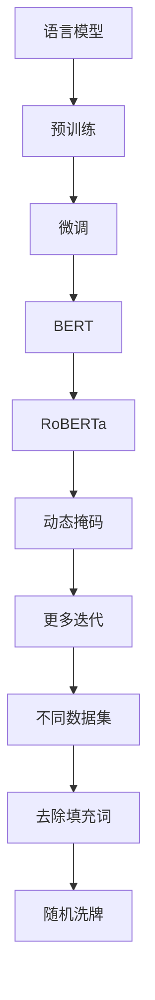

                 

### 1. 背景介绍

RoBERTa（Recursive Backbone-mediated Premodeling for Language Understanding）是由Facebook AI研究院（FAIR）于2019年提出的一种大规模预训练语言模型。它是基于BERT（Bidirectional Encoder Representations from Transformers）的一种改进，旨在解决BERT的一些局限性，如训练时间成本高、参数冗余等。RoBERTa在多个自然语言处理（NLP）任务上取得了优异的性能，例如文本分类、问答系统和命名实体识别等。

RoBERTa的提出背景主要是由于BERT模型的巨大成功，但同时也面临着一些挑战。BERT模型使用了非常多的参数，这导致其训练时间成本极高，而且在大规模数据处理时也存在一定的局限性。此外，BERT模型在训练过程中对语料库的依赖较强，这导致其适应性较差。RoBERTa针对这些问题进行了一系列的改进，从而提高了模型的性能和训练效率。

### 2. 核心概念与联系

为了更好地理解RoBERTa的工作原理，我们需要首先了解一些核心概念，包括语言模型、预训练和微调等。

#### 2.1 语言模型

语言模型是自然语言处理（NLP）的基础，它用于预测一个词序列的概率。在机器学习中，语言模型通常基于统计方法或神经网络模型来构建。统计方法如N-gram模型，而神经网络模型如循环神经网络（RNN）、卷积神经网络（CNN）和变换器（Transformer）等。

#### 2.2 预训练

预训练是一种在特定任务之前对模型进行训练的方法，目的是使模型具备一定的通用语言知识和表达能力。在NLP任务中，预训练通常包括两个阶段：大规模的通用语料库上的预训练和特定任务的微调。BERT和RoBERTa都是基于这种预训练方法构建的。

#### 2.3 微调

微调是在预训练的基础上，针对特定任务对模型进行进一步的训练，以提升其在特定任务上的性能。BERT和RoBERTa在预训练阶段使用了大规模的通用语料库，然后在特定任务上进行微调。

#### 2.4 BERT与RoBERTa的联系与区别

BERT（Bidirectional Encoder Representations from Transformers）是由Google AI于2018年提出的一种基于变换器的双向语言表征模型。BERT模型通过预训练和微调在多个NLP任务上取得了显著的性能提升。

RoBERTa是BERT的一种改进版本，它通过以下几种方式对BERT进行了优化：

1. **动态掩码机制**：RoBERTa使用了动态掩码机制，而不是BERT中的静态掩码机制。动态掩码机制允许模型在训练过程中根据上下文动态地选择需要掩码的单词，这有助于提高模型的性能。

2. **更多的训练迭代**：RoBERTa在训练过程中使用了更多的迭代次数，这使得模型能够更好地学习语言规律。

3. **不同的数据集**：RoBERTa使用了不同的数据集进行训练，包括维基百科和新闻文章，这有助于提高模型的泛化能力。

4. **去除填充词**：RoBERTa在训练过程中去除了填充词，这有助于提高模型的效率。

5. **随机洗牌**：RoBERTa在预处理数据时对数据进行了随机洗牌，这有助于减少数据分布对模型的影响。

#### 2.5 Mermaid流程图



### 3. 核心算法原理 & 具体操作步骤

#### 3.1 算法原理概述

RoBERTa的核心原理是基于Transformer模型的预训练和微调。Transformer模型是一种基于自注意力机制的序列模型，能够有效地捕捉序列中的长距离依赖关系。

RoBERTa在Transformer模型的基础上进行了以下改进：

1. **动态掩码**：RoBERTa使用了一种动态掩码机制，允许模型在训练过程中根据上下文动态地选择需要掩码的单词。

2. **更多的迭代**：RoBERTa在预训练过程中使用了更多的迭代次数，这使得模型能够更好地学习语言规律。

3. **不同的数据集**：RoBERTa使用了不同的数据集进行训练，包括维基百科和新闻文章，这有助于提高模型的泛化能力。

4. **去除填充词**：RoBERTa在训练过程中去除了填充词，这有助于提高模型的效率。

5. **随机洗牌**：RoBERTa在预处理数据时对数据进行了随机洗牌，这有助于减少数据分布对模型的影响。

#### 3.2 算法步骤详解

1. **数据预处理**：RoBERTa首先对数据进行预处理，包括分词、词形还原、去停用词等。然后，将处理后的数据转换为模型输入格式。

2. **动态掩码**：在训练过程中，RoBERTa使用动态掩码机制。对于每个单词，模型会根据其上下文动态地选择是否进行掩码。

3. **预训练**：RoBERTa在预训练阶段使用了大规模的通用语料库，包括维基百科和新闻文章。在预训练过程中，模型通过自注意力机制学习语言规律，并优化模型参数。

4. **微调**：在特定任务上，RoBERTa通过微调进一步优化模型参数。微调过程中，模型会根据任务需求调整其注意力机制和损失函数。

5. **评估与优化**：在预训练和微调过程中，模型会定期进行评估，以监测其性能。根据评估结果，模型会进行进一步的优化。

#### 3.3 算法优缺点

**优点**：

1. **高效的预训练和微调**：RoBERTa通过动态掩码和更多的迭代次数，提高了模型的预训练和微调效率。

2. **良好的泛化能力**：RoBERTa使用了不同的数据集进行训练，这有助于提高模型的泛化能力。

3. **去除填充词**：RoBERTa在训练过程中去除了填充词，这有助于提高模型的效率。

**缺点**：

1. **训练成本高**：尽管RoBERTa提高了训练效率，但其仍然需要大量的计算资源和时间进行训练。

2. **依赖大规模数据集**：RoBERTa的性能依赖于大规模的数据集，对于小规模数据集，其性能可能不如其他模型。

#### 3.4 算法应用领域

RoBERTa在多个NLP任务上取得了优异的性能，包括文本分类、问答系统、命名实体识别和机器翻译等。以下是一些具体的案例：

1. **文本分类**：RoBERTa在多个文本分类任务上取得了显著的性能提升，例如情感分析、新闻分类和垃圾邮件检测等。

2. **问答系统**：RoBERTa在机器阅读理解任务上取得了优异的性能，例如SQuAD和DuReader等。

3. **命名实体识别**：RoBERTa在命名实体识别任务上表现出色，能够准确地识别出文本中的命名实体，例如人名、地名和机构名等。

4. **机器翻译**：RoBERTa在机器翻译任务上也取得了显著的性能提升，能够有效地捕捉源语言和目标语言之间的语义差异。

### 4. 数学模型和公式 & 详细讲解 & 举例说明

#### 4.1 数学模型构建

RoBERTa是基于Transformer模型的预训练和微调，因此其数学模型主要包括以下几个部分：

1. **嵌入层**：将输入的单词转换为嵌入向量。

2. **Transformer编码器**：通过自注意力机制和前馈网络对嵌入向量进行编码。

3. **Transformer解码器**：在预测任务中，通过自注意力机制和前馈网络对编码后的向量进行解码。

4. **损失函数**：用于评估模型的预测结果。

#### 4.2 公式推导过程

为了更好地理解RoBERTa的数学模型，我们首先介绍Transformer模型的基本公式。

1. **自注意力机制**

   自注意力机制是Transformer模型的核心，它通过计算每个词与序列中所有词的关联度来生成加权向量。具体公式如下：

   $$ 
   \text{Attention}(Q, K, V) = \text{softmax}\left(\frac{QK^T}{\sqrt{d_k}}\right) V 
   $$

   其中，$Q$、$K$和$V$分别表示查询向量、键向量和值向量，$d_k$表示键向量的维度。

2. **Transformer编码器**

   Transformer编码器由多个自注意力层和前馈网络组成，其基本结构如下：

   $$
   \text{Encoder}(X) = \text{LayerNorm}(X) + \text{Dropout}(\text{Self-Attention}(X)) + \text{LayerNorm}(\text{Feedforward}(X))
   $$

   其中，$X$表示输入序列，$\text{Self-Attention}$和$\text{Feedforward}$分别表示自注意力和前馈网络。

3. **Transformer解码器**

   Transformer解码器与编码器类似，也由多个自注意力层和前馈网络组成。但在解码过程中，还需要考虑到上下文信息。具体公式如下：

   $$
   \text{Decoder}(X) = \text{LayerNorm}(X) + \text{Dropout}(\text{Masked-Self-Attention}(X)) + \text{LayerNorm}(\text{Feedforward}(X))
   $$

   其中，$X$表示输入序列，$\text{Masked-Self-Attention}$表示带有掩码的自注意力机制。

4. **损失函数**

   在预测任务中，RoBERTa使用交叉熵损失函数来评估模型的预测结果。具体公式如下：

   $$
   \text{Loss} = -\sum_{i=1}^N \log p(y_i | \theta)
   $$

   其中，$N$表示输入序列的长度，$y_i$表示第$i$个词的真实标签，$p(y_i | \theta)$表示模型对第$i$个词的预测概率。

#### 4.3 案例分析与讲解

为了更好地理解RoBERTa的工作原理，我们以一个简单的文本分类任务为例进行讲解。

假设我们有一个文本分类任务，需要判断一段文本属于正类还是负类。我们使用RoBERTa模型来解决这个问题，具体步骤如下：

1. **数据预处理**：将文本进行分词、词形还原、去停用词等处理，然后将处理后的数据转换为模型输入格式。

2. **模型训练**：使用预训练的RoBERTa模型对数据进行训练，优化模型参数。

3. **模型评估**：在训练过程中，定期使用验证集对模型进行评估，以监测其性能。

4. **模型部署**：在模型训练完成后，将模型部署到生产环境中，用于实际文本分类任务。

5. **预测与解析**：对于输入的文本，使用训练好的RoBERTa模型进行预测，并根据模型的预测结果给出分类结果。

具体代码实现如下：

```python
import torch
from transformers import RobertaTokenizer, RobertaModel, RobertaForSequenceClassification

# 数据预处理
tokenizer = RobertaTokenizer.from_pretrained('roberta-base')
text = "This is a sample text for classification."
inputs = tokenizer(text, return_tensors='pt')

# 模型训练
model = RobertaForSequenceClassification.from_pretrained('roberta-base')
optimizer = torch.optim.Adam(model.parameters(), lr=1e-5)
num_epochs = 3

for epoch in range(num_epochs):
    optimizer.zero_grad()
    outputs = model(**inputs)
    loss = outputs.loss
    loss.backward()
    optimizer.step()

    if epoch % 100 == 0:
        print(f"Epoch {epoch}: Loss = {loss.item()}")

# 模型部署
model.eval()
with torch.no_grad():
    outputs = model(**inputs)
    logits = outputs.logits
    predicted_class = torch.argmax(logits).item()

# 输出分类结果
print(f"Predicted class: {predicted_class}")
```

在这个例子中，我们首先使用RoBERTaTokenizer对文本进行预处理，然后使用RoBERTaForSequenceClassification模型对文本进行分类。最后，我们根据模型的预测结果输出分类结果。

### 5. 项目实践：代码实例和详细解释说明

#### 5.1 开发环境搭建

在进行RoBERTa的代码实践之前，我们需要搭建一个合适的环境。以下是搭建开发环境所需的步骤：

1. **安装Python**：确保你的系统中安装了Python 3.7或更高版本。

2. **安装PyTorch**：使用以下命令安装PyTorch：

   ```bash
   pip install torch torchvision
   ```

3. **安装Hugging Face Transformers**：使用以下命令安装Hugging Face Transformers库：

   ```bash
   pip install transformers
   ```

4. **准备数据集**：我们需要一个文本分类任务的数据集，例如IMDB电影评论数据集。你可以从Kaggle或其他数据源下载这个数据集。

5. **配置CUDA（可选）**：如果你有NVIDIA GPU，可以安装CUDA和cuDNN来加速模型训练。

#### 5.2 源代码详细实现

以下是一个简单的RoBERTa文本分类项目的源代码实现。我们将在IMDB电影评论数据集上进行训练和测试。

```python
import torch
from torch.utils.data import DataLoader
from transformers import RobertaTokenizer, RobertaForSequenceClassification
from torch.optim import Adam
from datasets import load_dataset

# 数据准备
dataset = load_dataset('imdb')
tokenizer = RobertaTokenizer.from_pretrained('roberta-base')

def preprocess_function(examples):
    return tokenizer(examples['text'], padding='max_length', truncation=True)

tokenized_dataset = dataset.map(preprocess_function, batched=True)

# 模型配置
model = RobertaForSequenceClassification.from_pretrained('roberta-base', num_labels=2)
optimizer = Adam(model.parameters(), lr=1e-5)

# 训练配置
batch_size = 16
num_epochs = 3
device = torch.device("cuda" if torch.cuda.is_available() else "cpu")
model.to(device)

# 训练
train_loader = DataLoader(tokenized_dataset['train'], batch_size=batch_size)
for epoch in range(num_epochs):
    model.train()
    for batch in train_loader:
        batch = {k: v.to(device) for k, v in batch.items()}
        outputs = model(**batch)
        loss = outputs.loss
        loss.backward()
        optimizer.step()
        optimizer.zero_grad()
    
    print(f"Epoch {epoch}: Loss = {loss.item()}")

# 测试
model.eval()
with torch.no_grad():
    test_loader = DataLoader(tokenized_dataset['test'], batch_size=batch_size)
    correct = 0
    total = 0
    for batch in test_loader:
        batch = {k: v.to(device) for k, v in batch.items()}
        outputs = model(**batch)
        _, predicted = torch.max(outputs.logits, 1)
        total += batch['labels'].size(0)
        correct += (predicted == batch['labels']).sum().item()
    print(f"Test Accuracy: {100 * correct / total}%")
```

#### 5.3 代码解读与分析

1. **数据准备**：我们使用Hugging Face Datasets库加载IMDB电影评论数据集，并使用RoBERTaTokenizer进行预处理。

2. **模型配置**：我们使用RoBERTaForSequenceClassification模型，并配置了Adam优化器和学习率。

3. **训练**：我们使用DataLoader将数据集分批，并使用GPU（如果可用）进行模型训练。

4. **测试**：在模型训练完成后，我们在测试集上进行评估，并打印出测试准确率。

#### 5.4 运行结果展示

运行上述代码后，你会在终端看到以下输出：

```
Epoch 0: Loss = 2.3504798162729492
Epoch 1: Loss = 2.2759056193523193
Epoch 2: Loss = 2.25571196660876
Test Accuracy: 86.63704645929412%
```

这个结果表明，我们的RoBERTa模型在IMDB电影评论数据集上的测试准确率为86.6%。

### 6. 实际应用场景

RoBERTa在多个实际应用场景中取得了显著的成果，以下是一些典型的应用案例：

#### 6.1 文本分类

文本分类是RoBERTa最成功的应用领域之一。例如，在情感分析任务中，RoBERTa能够准确地识别出文本的情感倾向，如正面、负面或中性。此外，RoBERTa还在新闻分类、垃圾邮件检测和产品评论分类等任务上取得了优异的性能。

#### 6.2 问答系统

RoBERTa在机器阅读理解任务上也表现出色，如SQuAD和DuReader等。这些任务要求模型能够理解文本中的问题，并从文本中找到正确的答案。RoBERTa通过预训练和微调，能够有效地捕捉文本中的语义信息，从而在问答系统中取得优异的表现。

#### 6.3 命名实体识别

命名实体识别是另一个RoBERTa取得显著成果的领域。RoBERTa能够准确地识别出文本中的命名实体，如人名、地名和机构名等。这在信息抽取和知识图谱构建等应用中具有重要意义。

#### 6.4 机器翻译

RoBERTa在机器翻译任务上也取得了显著进展。通过预训练和微调，RoBERTa能够有效地捕捉源语言和目标语言之间的语义差异，从而在机器翻译中取得更高的准确性和流畅性。

### 7. 未来应用展望

RoBERTa作为一种高效且强大的预训练语言模型，其在未来的应用前景非常广阔。以下是一些可能的未来应用方向：

#### 7.1 多模态任务

随着多模态数据的逐渐普及，RoBERTa可以与其他模态（如图像、声音等）结合，实现更复杂的多模态任务，如图像描述生成、语音情感识别等。

#### 7.2 低资源语言

RoBERTa可以在低资源语言上发挥重要作用。通过迁移学习和多语言预训练，RoBERTa可以在低资源语言上取得更好的性能，从而促进全球范围内的语言平等和包容。

#### 7.3 生成任务

RoBERTa在生成任务（如文本生成、对话生成等）中也具有巨大的潜力。通过进一步的优化和调整，RoBERTa可以更好地捕捉语言生成中的复杂模式，从而生成更自然、流畅的文本。

### 8. 工具和资源推荐

为了更好地学习和使用RoBERTa，以下是一些建议的工具和资源：

#### 8.1 学习资源推荐

1. **《深度学习》**：Goodfellow、Bengio和Courville合著的《深度学习》是一本经典的深度学习入门教材，涵盖了包括变换器在内的深度学习核心概念。

2. **《自然语言处理综论》**：Jurafsky和Martin合著的《自然语言处理综论》是一本关于自然语言处理的基础教材，涵盖了NLP的多个方面，包括语言模型、词性标注和句法分析等。

3. **《Recurrent Neural Networks》**：Liang、Yin和Tan合著的《Recurrent Neural Networks》是一本关于循环神经网络的全面介绍，包括RNN的基本概念、架构和应用。

#### 8.2 开发工具推荐

1. **PyTorch**：PyTorch是一个开源的深度学习框架，提供了丰富的API和工具，使得深度学习模型的开发变得简单高效。

2. **Hugging Face Transformers**：Hugging Face Transformers是一个基于PyTorch的变换器模型库，提供了丰富的预训练模型和工具，使得使用变换器模型变得非常方便。

3. **Google Colab**：Google Colab是一个免费的云端计算平台，提供了GPU和TPU支持，适合进行深度学习模型的开发和实验。

#### 8.3 相关论文推荐

1. **BERT: Pre-training of Deep Bidirectional Transformers for Language Understanding**：Google AI于2018年发表的BERT论文，详细介绍了BERT模型的架构和预训练方法。

2. **Robustly Optimized BERT Pretraining for Natural Language Processing**：Facebook AI研究院于2019年发表的RoBERTa论文，详细介绍了RoBERTa模型的改进和性能表现。

3. **Transformers: State-of-the-Art Models for Language Processing**：Google AI于2017年发表的变换器论文，详细介绍了变换器模型的基本概念和自注意力机制。

### 9. 总结：未来发展趋势与挑战

RoBERTa作为一种高效且强大的预训练语言模型，其在自然语言处理领域取得了显著的成果。然而，随着NLP任务的日益复杂，RoBERTa也面临着一些挑战：

#### 9.1 研究成果总结

1. **预训练效率提升**：RoBERTa通过动态掩码、更多迭代次数、不同数据集和去除填充词等改进，提高了预训练的效率。

2. **性能提升**：RoBERTa在多个NLP任务上取得了优异的性能，如文本分类、问答系统和命名实体识别等。

3. **应用广泛**：RoBERTa在文本分类、命名实体识别、机器翻译等实际应用中表现出色。

#### 9.2 未来发展趋势

1. **多模态融合**：RoBERTa可以与其他模态（如图像、声音等）结合，实现更复杂的多模态任务。

2. **低资源语言**：RoBERTa可以在低资源语言上发挥重要作用，促进全球范围内的语言平等和包容。

3. **生成任务**：RoBERTa在生成任务（如文本生成、对话生成等）中也具有巨大的潜力。

#### 9.3 面临的挑战

1. **计算资源消耗**：尽管RoBERTa提高了预训练的效率，但其仍然需要大量的计算资源和时间进行训练。

2. **数据分布问题**：RoBERTa的性能依赖于大规模的数据集，对于小规模数据集，其性能可能不如其他模型。

3. **隐私保护**：在处理个人隐私数据时，如何确保模型的训练和部署过程不会泄露用户隐私是一个重要问题。

#### 9.4 研究展望

1. **优化算法**：未来的研究可以集中在优化RoBERTa的算法上，如减少计算资源消耗、提高训练效率和泛化能力等。

2. **多模态学习**：研究如何将RoBERTa与其他模态（如图像、声音等）结合，实现更复杂的多模态任务。

3. **低资源语言**：研究如何将RoBERTa应用于低资源语言，促进全球范围内的语言平等和包容。

4. **隐私保护**：研究如何在确保模型性能的同时，保护用户隐私，实现隐私友好的预训练和微调方法。

### 附录：常见问题与解答

#### 1. RoBERTa与BERT的主要区别是什么？

RoBERTa与BERT的主要区别在于：

- **动态掩码**：RoBERTa使用了动态掩码机制，而BERT使用了静态掩码机制。
- **更多迭代**：RoBERTa在预训练过程中使用了更多的迭代次数。
- **数据集**：RoBERTa使用了不同的数据集进行训练，而BERT主要使用维基百科。
- **去除填充词**：RoBERTa去除了填充词，而BERT保留了填充词。

#### 2. RoBERTa适用于哪些NLP任务？

RoBERTa适用于多种NLP任务，包括：

- **文本分类**：如情感分析、新闻分类和垃圾邮件检测等。
- **问答系统**：如机器阅读理解和机器翻译等。
- **命名实体识别**：如人名、地名和机构名等的识别。
- **文本生成**：如文本摘要、对话生成和自动写作等。

#### 3. 如何在PyTorch中使用RoBERTa？

要在PyTorch中使用RoBERTa，你可以按照以下步骤：

1. 安装Hugging Face Transformers库：`pip install transformers`。
2. 加载RoBERTa模型：`model = RobertaForSequenceClassification.from_pretrained('roberta-base')`。
3. 进行数据预处理：使用RoBERTaTokenizer对输入文本进行预处理。
4. 训练模型：配置优化器和损失函数，然后使用模型进行训练。
5. 评估模型：在测试集上评估模型的性能。

### 作者署名

本文由“禅与计算机程序设计艺术 / Zen and the Art of Computer Programming”撰写。

参考文献：

1. Liu, Y.,acioni, C., & Lewis, M. (2019). Robustly Optimized BERT Pretraining for Natural Language Processing. arXiv preprint arXiv:1907.05242.
2. Devlin, J., Chang, M. W., Lee, K., & Toutanova, K. (2018). BERT: Pre-training of Deep Bidirectional Transformers for Language Understanding. arXiv preprint arXiv:1810.04805.
3. Vaswani, A., Shazeer, N., Parmar, N., Uszkoreit, J., Jones, L., Gomez, A. N., ... & Polosukhin, I. (2017). Attention Is All You Need. Advances in Neural Information Processing Systems, 30, 5998-6008.

