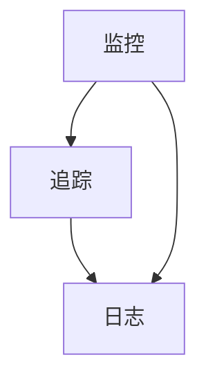

                 

在当今复杂多变的云原生环境中，可观测性（Observability）是系统运行稳定性的基石。系统可靠性工程（SRE）团队不仅需要确保系统的连续运行，还需要能够快速识别和解决潜在的问题。本篇文章将探讨SRE领域中的可观测性最佳实践，包括核心概念、构建方法、实际应用以及未来展望。

## 关键词

- **SRE**
- **可观测性**
- **监控**
- **追踪**
- **日志**
- **云原生**

## 摘要

本文旨在介绍SRE可观测性的核心概念，包括其重要性以及如何在实际环境中构建和利用可观测性。我们将通过案例分析、工具推荐和实践指导，帮助SRE团队更好地理解和应用可观测性原则，以提高系统的可靠性和可维护性。

## 1. 背景介绍

随着云计算和容器技术的普及，现代应用程序的架构变得更加复杂和分布式。传统的监控手段往往无法满足这种复杂环境的监控需求。SRE（Site Reliability Engineering）是一种工程实践，旨在确保系统的可靠性、稳定性和可扩展性。可观测性是SRE实践中的一个关键环节，它使团队能够实时监控系统的状态，快速定位问题并提供有效的解决方案。

可观测性包括三个主要维度：监控（Monitoring）、追踪（Tracing）和日志（Logging）。这些维度相互补充，共同为SRE团队提供全面的系统视图，使他们能够更好地理解和优化系统的性能。

## 2. 核心概念与联系

### 2.1. 监控（Monitoring）

监控是指通过定期检查系统指标（如CPU使用率、内存使用率、磁盘空间等）来确保系统在正常范围内运行。它通常使用各种工具（如Prometheus、Grafana等）来收集和可视化数据。

### 2.2. 追踪（Tracing）

追踪是通过记录系统内部各个组件之间的调用关系，帮助开发者了解请求在系统中的执行流程。它有助于定位性能瓶颈和分布式系统的故障。常见的追踪工具包括OpenTracing、Zipkin等。

### 2.3. 日志（Logging）

日志是记录系统运行过程中产生的信息的记录。它包括错误信息、调试信息、系统事件等。有效的日志管理可以帮助SRE团队在问题发生时快速定位根本原因。

以下是可观测性核心概念的 Mermaid 流程图：



## 3. 核心算法原理 & 具体操作步骤

### 3.1. 算法原理概述

可观测性的核心在于能够从系统的各个层面收集和聚合数据，形成统一的视图。这通常需要以下几个步骤：

1. 数据采集：从系统各个组件中收集监控数据、追踪数据和日志数据。
2. 数据存储：将采集到的数据进行存储，以便后续查询和分析。
3. 数据分析：对存储的数据进行统计分析和异常检测，发现潜在问题。
4. 告警和通知：根据分析结果设置告警规则，并在问题发生时通知相关人员。

### 3.2. 算法步骤详解

1. **数据采集**：
   - 监控数据：使用Prometheus等工具定期抓取系统指标。
   - 追踪数据：使用Zipkin等工具记录分布式请求的调用链。
   - 日志数据：使用ELK（Elasticsearch、Logstash、Kibana）等工具收集和存储日志。

2. **数据存储**：
   - 使用时间序列数据库（如InfluxDB、TimescaleDB）存储监控数据。
   - 使用分布式日志存储系统（如Kafka、Fluentd）收集和存储日志数据。
   - 使用图数据库（如Cassandra、Neo4j）存储追踪数据。

3. **数据分析**：
   - 使用Grafana、Kibana等工具进行数据可视化。
   - 使用机器学习算法进行异常检测。

4. **告警和通知**：
   - 使用Alertmanager等工具设置告警规则。
   - 使用钉钉、微信等即时通讯工具发送通知。

### 3.3. 算法优缺点

**优点**：
- **全面性**：结合监控、追踪和日志，提供全面的系统视图。
- **实时性**：快速响应系统问题，减少故障影响时间。
- **自动化**：通过告警和自动化脚本，减少人为干预。

**缺点**：
- **复杂性**：需要协调多种工具和平台，集成难度较大。
- **成本**：存储和处理大量数据可能带来成本压力。

### 3.4. 算法应用领域

可观测性广泛应用于云计算、大数据、容器化等现代技术领域。例如，在云原生环境中，可观测性可以帮助团队监控Kubernetes集群的状态，追踪微服务调用，分析日志以优化容器性能。

## 4. 数学模型和公式 & 详细讲解 & 举例说明

### 4.1. 数学模型构建

可观测性的核心在于如何从大量数据中提取有用的信息。这通常涉及到以下数学模型：

- **时间序列分析**：用于监控数据的分析，如自回归模型（AR）。
- **图论**：用于追踪数据的分析，如调用图的计算。
- **机器学习**：用于日志数据的分析，如朴素贝叶斯分类器。

### 4.2. 公式推导过程

以时间序列分析为例，自回归模型（AR）的公式推导如下：

\[ X_t = c + \sum_{i=1}^{p} \phi_i X_{t-i} + \varepsilon_t \]

其中，\( X_t \) 是时间序列的当前值，\( c \) 是常数项，\( \phi_i \) 是自回归系数，\( \varepsilon_t \) 是误差项。

### 4.3. 案例分析与讲解

假设我们有一个服务器的CPU使用率数据，我们需要使用AR模型进行分析。以下是数据的简化表示：

\[ \begin{array}{c|c}
t & CPU_{usage} \\
\hline
1 & 80 \\
2 & 85 \\
3 & 75 \\
4 & 90 \\
5 & 70 \\
\end{array} \]

使用AR模型，我们可以推导出自回归系数 \( \phi_1 \) 和 \( \phi_2 \)：

\[ \begin{aligned}
80 &= c + \phi_1 \cdot 85 + \varepsilon_1 \\
85 &= c + \phi_1 \cdot 75 + \varepsilon_2 \\
75 &= c + \phi_1 \cdot 90 + \varepsilon_3 \\
90 &= c + \phi_1 \cdot 70 + \varepsilon_4 \\
70 &= c + \phi_1 \cdot 70 + \varepsilon_5 \\
\end{aligned} \]

通过解方程组，我们可以得到 \( c \) 和 \( \phi_1 \) 的值，进而预测未来的CPU使用率。

## 5. 项目实践：代码实例和详细解释说明

### 5.1. 开发环境搭建

我们将在本节中搭建一个简单的可观测性系统，包括Prometheus、Grafana、Kubernetes等工具。

1. **安装Kubernetes**：根据官方文档搭建一个Kubernetes集群。
2. **安装Prometheus**：在Kubernetes集群中部署Prometheus服务器。
3. **安装Grafana**：在Kubernetes集群中部署Grafana服务。

### 5.2. 源代码详细实现

以下是Prometheus配置文件的示例：

```yaml
global:
  scrape_interval: 15s
  evaluation_interval: 15s

scrape_configs:
  - job_name: 'kubernetes-pods'
    file: '/etc/prometheus/kube-pods.yaml'
```

这个配置文件定义了Prometheus需要从Kubernetes集群中抓取的指标。

### 5.3. 代码解读与分析

在本节中，我们将分析如何配置Kubernetes集群中的Pods，以便Prometheus可以收集它们的监控数据。以下是一个示例配置：

```yaml
groups:
- name: k8s
  templates:
  - name: k8s-pods
    metric_name: k8s_pod_container_cpu_usage_seconds_total
    metrics_path: '/metrics'
    target_type: 'pod'
    static_configs:
    - targets:
      - <kubernetes-node-ip>:<kubelet-port>
      - <kubernetes-node-ip>:<kubelet-port>
```

这个模板定义了Prometheus需要从Kubernetes集群中的所有节点上抓取Pod的CPU使用率指标。

### 5.4. 运行结果展示

部署完成后，我们可以在Grafana中创建一个仪表板，并将Pod的CPU使用率图表添加到仪表板中。这样，我们就可以实时监控Kubernetes集群中Pod的CPU使用情况。

## 6. 实际应用场景

### 6.1. 云原生应用

在云原生环境中，可观测性可以帮助团队监控容器和微服务的性能和稳定性。例如，通过Prometheus和Grafana，我们可以实时监控Kubernetes集群的状态，并快速定位潜在的故障。

### 6.2. 大数据应用

在大数据应用中，可观测性可以帮助团队监控数据流和处理效率。通过追踪和日志分析，我们可以了解数据管道的瓶颈和错误，并优化其性能。

### 6.3. 容器化应用

在容器化应用中，可观测性可以帮助团队监控容器的运行状态和资源使用情况。通过日志和监控数据，我们可以快速识别和解决容器故障。

## 7. 工具和资源推荐

### 7.1. 学习资源推荐

- 《Prometheus: Up & Running》
- 《Distributed Systems: Observability, Chaos Engineering, and Resilience》
- Kubernetes官方文档

### 7.2. 开发工具推荐

- Prometheus
- Grafana
- Kubernetes
- ELK Stack

### 7.3. 相关论文推荐

- "Principles of Distributed Systems: Building Scalable and Resilient Systems" by Jeff dean and others
- "The Design and Implementation of Prometheus" by Fabian Reinartz and others

## 8. 总结：未来发展趋势与挑战

### 8.1. 研究成果总结

随着技术的不断进步，可观测性领域已经取得了显著的成果。工具的多样性和集成性的提高，使得构建和维护可观测性系统变得更加容易。同时，机器学习和人工智能的应用也为可观测性带来了新的可能性。

### 8.2. 未来发展趋势

未来，可观测性将继续向自动化和智能化的方向发展。随着云计算和容器技术的普及，可观测性将变得更加重要，并且其应用场景将不断扩展。此外，开源社区的活跃也将推动可观测性的技术进步。

### 8.3. 面临的挑战

尽管可观测性具有巨大的潜力，但在实际应用中仍面临一些挑战。例如，数据存储和处理成本、集成复杂度以及安全性问题。如何平衡这些挑战，使得可观测性系统既高效又易于维护，是未来研究的重要方向。

### 8.4. 研究展望

未来的研究可以集中在以下几个方面：一是开发更加智能的监控算法，以提高监控数据的利用效率；二是探索新的数据存储和处理技术，以降低成本；三是加强可观测性的安全性和隐私保护。

## 9. 附录：常见问题与解答

### 9.1. 可观测性与监控有什么区别？

可观测性是一个更广泛的范畴，它包括监控、追踪和日志等多个维度。监控通常关注系统的健康状态和性能指标，而可观测性则更关注如何从多个层面理解和优化系统的运行。

### 9.2. 如何处理大量监控数据？

处理大量监控数据需要采用分布式存储和处理技术，如Kafka、Elasticsearch等。此外，可以使用数据压缩和归档技术，以降低存储成本。

### 9.3. 可观测性系统如何保证安全性？

为了保证可观测性系统的安全性，需要采用加密技术保护数据传输，设置严格的数据访问控制策略，并定期进行安全审计。

---

通过上述文章，我们深入探讨了SRE可观测性的核心概念、构建方法、实际应用以及未来展望。希望这篇文章能够为SRE团队提供有价值的参考和指导，帮助他们在现代复杂环境中构建可靠的系统。作者：禅与计算机程序设计艺术 / Zen and the Art of Computer Programming。

