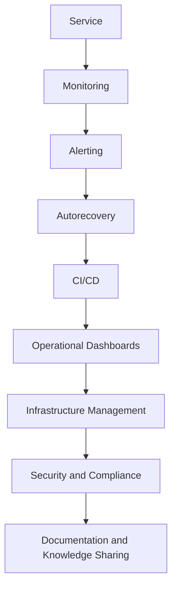
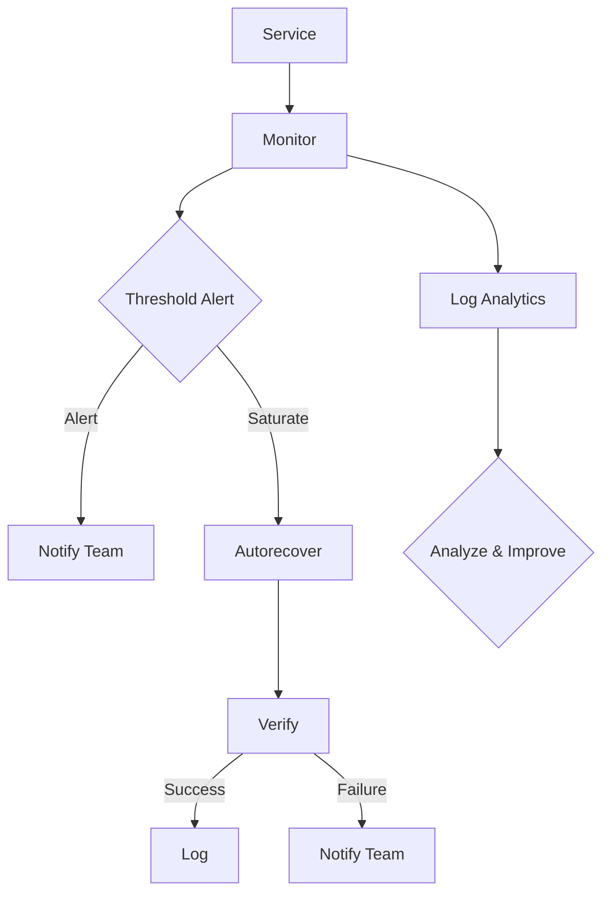

                 

关键词：SRE、自动化运维、最佳实践、监控、故障处理、基础设施管理

> 摘要：本文将深入探讨SRE（Site Reliability Engineering）在自动化运维中的应用，通过具体案例和实践经验，详细阐述如何构建高效的SRE自动化运维体系，从而提升系统可靠性、稳定性和可扩展性。

## 1. 背景介绍

### SRE的起源与发展

SRE（Site Reliability Engineering）起源于谷歌，是谷歌为了确保其大规模分布式系统的稳定性和可靠性而创建的一种工程实践。随着云计算和大数据的兴起，SRE的理念逐渐受到业界的关注和认可，并逐渐在各个大型互联网公司中推广应用。SRE的核心目标是确保系统的可靠性，同时保持敏捷的开发和发布流程。

### 自动化运维的重要性

自动化运维已经成为现代IT基础设施的标配，它能够显著提高运维效率，降低人工干预的风险，从而保障系统的稳定运行。通过自动化，运维团队可以将更多的精力投入到策略优化和系统改进上，而不仅仅是日常的维护和故障处理。

## 2. 核心概念与联系

### SRE自动化运维架构

以下是一个简化的SRE自动化运维架构图：



### Mermaid 流程图



## 3. 核心算法原理 & 具体操作步骤

### 3.1 算法原理概述

SRE自动化运维的核心算法包括监控算法、告警算法、自愈算法等。以下是这些算法的基本原理：

- **监控算法**：基于阈值或异常检测模型，实时监测系统状态，识别异常行为。
- **告警算法**：根据监控结果，触发告警通知，包括告警级别、告警内容和告警方式等。
- **自愈算法**：在检测到系统故障时，自动执行恢复操作，减少人工干预。

### 3.2 算法步骤详解

#### 监控算法步骤

1. **数据采集**：从系统中采集各种性能指标和日志数据。
2. **预处理**：对采集的数据进行清洗、格式化，确保数据质量。
3. **特征提取**：从预处理后的数据中提取关键特征，用于模型训练和实时监控。
4. **异常检测**：使用机器学习模型或规则引擎，对特征数据进行分析，识别异常行为。
5. **告警触发**：当检测到异常时，触发相应的告警通知。

#### 告警算法步骤

1. **阈值设定**：根据业务需求，设定各种性能指标的阈值。
2. **实时监控**：持续监测系统状态，与阈值进行比较。
3. **告警分类**：根据告警级别和内容，将告警分类。
4. **通知发送**：通过邮件、短信、微信等方式，将告警通知发送给相关人员。

#### 自愈算法步骤

1. **故障检测**：通过监控算法，检测到系统故障。
2. **故障定位**：分析故障原因，定位故障点。
3. **自动恢复**：根据预定义的恢复策略，自动执行恢复操作。
4. **验证恢复**：执行恢复操作后，验证系统状态是否恢复正常。
5. **记录日志**：记录故障和处理过程，以便后续分析和改进。

### 3.3 算法优缺点

- **监控算法**：优点是能够实时监测系统状态，快速识别异常行为；缺点是可能误报，需要不断的调整阈值和模型。
- **告警算法**：优点是能够及时通知相关人员，快速响应故障；缺点是可能导致大量无效告警，增加运维负担。
- **自愈算法**：优点是能够减少人工干预，提高系统稳定性；缺点是可能无法处理复杂故障，需要人工干预。

### 3.4 算法应用领域

SRE自动化运维算法广泛应用于云计算、大数据、人工智能等领域，特别是在大规模分布式系统中，能够显著提高系统的可靠性和稳定性。

## 4. 数学模型和公式 & 详细讲解 & 举例说明

### 4.1 数学模型构建

假设我们使用一种基于阈值的监控算法，以下是该算法的数学模型：

$$
f(x) =
\begin{cases}
0 & \text{如果 } x \text{ 在阈值范围内} \\
1 & \text{如果 } x \text{ 超出阈值}
\end{cases}
$$

其中，$x$ 是系统性能指标，$f(x)$ 是监控结果。

### 4.2 公式推导过程

假设我们使用一种基于机器学习的异常检测模型，以下是该模型的基本推导过程：

$$
\hat{y} = \sigma(\omega_0 + \omega_1 x_1 + \omega_2 x_2 + ... + \omega_n x_n)
$$

其中，$\hat{y}$ 是预测结果，$x_1, x_2, ..., x_n$ 是输入特征，$\omega_0, \omega_1, \omega_2, ..., \omega_n$ 是模型参数。

### 4.3 案例分析与讲解

假设我们使用一种基于阈值的监控算法来监测服务器CPU负载，阈值为80%。以下是该算法在一天内的应用情况：

| 时间 | CPU负载 | 监控结果 |
| ---- | ------ | -------- |
| 08:00 | 75%    | 未超出阈值 |
| 10:00 | 85%    | 超出阈值  |
| 12:00 | 70%    | 未超出阈值 |
| 14:00 | 90%    | 超出阈值  |
| 16:00 | 65%    | 未超出阈值 |

在这个例子中，监控算法能够实时监测服务器CPU负载，并在负载超出阈值时触发告警。

## 5. 项目实践：代码实例和详细解释说明

### 5.1 开发环境搭建

为了实现SRE自动化运维，我们需要搭建一个包含监控、告警和自愈功能的开发环境。以下是一个简单的环境搭建步骤：

1. **安装Prometheus**：Prometheus是一个开源的监控解决方案，用于收集和存储监控数据。
2. **安装Grafana**：Grafana是一个开源的数据可视化工具，用于展示监控数据和告警信息。
3. **安装Kubernetes**：Kubernetes是一个开源的容器编排平台，用于部署和管理容器化应用。
4. **安装自愈组件**：如Helm、Kubernetes自带的自愈机制等。

### 5.2 源代码详细实现

以下是一个简单的Prometheus监控配置文件示例：

```yaml
# prometheus.yml
global:
  scrape_interval: 15s
  evaluation_interval: 15s

scrape_configs:
  - job_name: 'kubernetes-objects'
    kubernetes_sd_configs:
      - role: pod
    metrics_path: /metrics
    scheme: https
    tls_config:
      ca_file: /var/run/secrets/kubernetes.io/serviceaccount/ca.crt
    bearer_token_file: /var/run/secrets/kubernetes.io/serviceaccount/token
```

### 5.3 代码解读与分析

在这个配置文件中，我们定义了一个名为`kubernetes-objects`的监控任务，它将从Kubernetes集群中收集各种对象的监控数据，如Pod、Node等。通过Prometheus，我们可以实时监控这些数据，并在数据异常时触发告警。

### 5.4 运行结果展示

通过Grafana，我们可以可视化Prometheus收集到的监控数据，并设置告警规则。以下是一个简单的Grafana仪表板示例：


在这个仪表板中，我们可以实时监控服务器的CPU、内存、磁盘等性能指标，并在指标超出阈值时收到告警通知。

## 6. 实际应用场景

SRE自动化运维在云计算、大数据、人工智能等领域有着广泛的应用。以下是一些实际应用场景：

1. **云计算平台**：通过SRE自动化运维，云服务提供商可以确保其基础设施的稳定性和可靠性，提供高质量的云服务。
2. **大数据平台**：大数据平台通常处理海量数据，SRE自动化运维可以确保数据处理流程的稳定性，提高数据处理效率。
3. **人工智能平台**：人工智能平台需要实时处理大量的数据和任务，SRE自动化运维可以确保系统的稳定运行，提高任务处理效率。

## 7. 工具和资源推荐

### 7.1 学习资源推荐

- 《Google SRE》
- 《Site Reliability Engineering: How Google Runs Production Systems》
- 《Prometheus: The Definitive Guide》

### 7.2 开发工具推荐

- Prometheus
- Grafana
- Kubernetes
- Helm

### 7.3 相关论文推荐

- "The Art of SRE" by Ben Treynor
- "The Design of the BDFL-Site Reliability Engineering Function at Google" by Ben Treynor, Chris Jones, and Jennifer Pinkerton
- "Monitoring,告警和自动化" by Google SRE Team

## 8. 总结：未来发展趋势与挑战

### 8.1 研究成果总结

SRE自动化运维已经成为现代IT基础设施的重要组成部分，通过监控、告警和自愈等算法，显著提高了系统的可靠性和稳定性。

### 8.2 未来发展趋势

- **智能化**：利用人工智能和机器学习技术，提高监控和自愈算法的精度和效率。
- **云原生**：随着云原生技术的发展，SRE自动化运维将更加集成和灵活。
- **微服务化**：微服务架构的普及，将推动SRE自动化运维在服务层面的应用。

### 8.3 面临的挑战

- **复杂度**：随着系统规模的扩大，SRE自动化运维的复杂度将增加，需要更好的工具和方法来管理。
- **成本**：自动化运维需要投入大量的人力、物力和财力，如何平衡成本和效益是一个重要挑战。

### 8.4 研究展望

SRE自动化运维将在未来继续发展和完善，通过技术创新和最佳实践的应用，将进一步提高系统的可靠性和稳定性。

## 9. 附录：常见问题与解答

### 9.1 什么是SRE？

SRE（Site Reliability Engineering）是一种工程实践，旨在确保系统的可靠性、稳定性和可扩展性。

### 9.2 自动化运维和传统的运维有何区别？

自动化运维通过脚本、工具和平台，自动完成传统的手动操作，如监控、告警、故障处理等，从而提高运维效率和降低风险。

### 9.3 Prometheus和Grafana有什么区别？

Prometheus是一个开源的监控解决方案，用于收集、存储和监控指标数据；Grafana是一个开源的数据可视化工具，用于展示监控数据和告警信息。

### 9.4 Kubernetes和Helm有什么区别？

Kubernetes是一个开源的容器编排平台，用于部署和管理容器化应用；Helm是一个Kubernetes的包管理工具，用于创建、配置和部署应用程序。

----------------------------------------------------------------

以上便是关于《SRE自动化运维最佳实践》的文章正文部分内容，后续我们将在文章末尾添加作者署名和文章封面等内容。希望这篇文章能够为您的学习和工作带来帮助。如果您有任何疑问或建议，欢迎在评论区留言讨论。作者：禅与计算机程序设计艺术 / Zen and the Art of Computer Programming。

