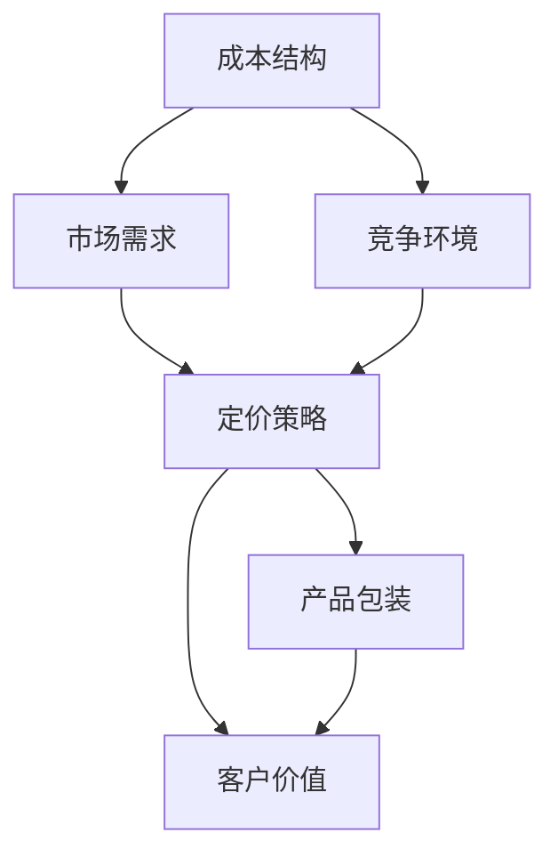

                 

关键词：SaaS、产品定价、包装策略、定价模型、成本分析、市场需求、客户价值、产品生命周期、竞争优势。

## 摘要

本文将深入探讨SaaS（软件即服务）产品的定价与包装策略。SaaS作为一种新兴的商业模式，其定价和包装策略直接影响到产品的市场接受度和企业盈利能力。文章首先介绍了SaaS的定义和特点，随后详细分析了影响SaaS产品定价的核心因素，包括成本结构、市场需求和竞争环境。接着，文章提出了几种常见的SaaS定价模型，并对其优缺点进行了比较分析。此外，文章还探讨了如何通过优化产品包装来提升客户价值和满意度。最后，文章总结了SaaS产品定价与包装策略的未来发展趋势和面临的挑战。

## 1. 背景介绍

### SaaS的定义与发展

SaaS（Software as a Service）是一种基于互联网的软件应用交付模式，用户通过网络订阅服务来使用软件，无需购买和安装。SaaS的核心在于其灵活性和便捷性，用户可以根据需求灵活调整订阅级别和规模，同时降低了软件的初期投入和维护成本。

SaaS的概念最早可以追溯到1999年，由云计算的先驱公司Salesforce.com提出。随着云计算技术和互联网基础设施的快速发展，SaaS逐渐成为一种主流的商业模式。近年来，SaaS在全球范围内的应用日益广泛，从传统的CRM（客户关系管理）到ERP（企业资源规划），再到各类专业应用软件，SaaS模式都展现出强大的市场潜力和增长势头。

### SaaS的特点

SaaS具有以下几大特点：

- **即开即用**：用户无需安装软件，只需通过浏览器即可使用，极大地方便了用户。
- **灵活性**：用户可以根据需求调整订阅级别，灵活扩展或缩减使用量。
- **成本效益**：用户无需承担昂贵的软件购置和运维成本，降低了企业的IT成本。
- **持续更新**：服务提供商可以定期更新软件功能，用户无需担心版本落后。
- **可定制性**：SaaS产品通常提供不同程度的定制能力，满足不同用户的需求。

### SaaS的市场现状与发展趋势

根据市场研究公司的数据，SaaS市场近年来呈现出高速增长的态势。全球SaaS市场规模预计将在未来几年内持续扩大，主要驱动力包括数字化转型、云计算技术的发展以及企业对灵活、高效、低成本IT解决方案的需求。

从应用领域来看，SaaS在金融、医疗、教育、制造、零售等行业都有广泛的应用。随着5G、人工智能等新技术的进一步推广，SaaS市场将迎来更多的发展机遇。

## 2. 核心概念与联系

为了深入理解SaaS产品的定价与包装策略，我们需要了解几个关键概念，并展示它们之间的联系。以下是一个用Mermaid绘制的流程图，用于说明这些核心概念和它们之间的关系。



### 2.1 成本结构

成本结构是制定定价策略的基础。SaaS产品的成本主要包括固定成本和可变成本。固定成本通常包括研发成本、服务器租赁费用、数据中心运营成本等，而可变成本则与用户数量和订阅级别相关，如数据处理成本、存储成本、客户支持费用等。

### 2.2 市场需求

市场需求是定价策略的重要参考因素。了解目标客户的需求和偏好有助于确定合适的价格水平和产品包。市场调研和数据挖掘是获取这些信息的重要手段。

### 2.3 竞争环境

竞争环境直接影响产品的定价策略。竞争对手的价格、产品功能和市场份额都是需要考虑的因素。通过竞争分析，企业可以制定出具有竞争力的定价策略，以吸引更多客户。

### 2.4 定价策略

定价策略是将成本结构、市场需求和竞争环境有机结合的结果。常见的定价策略包括基于成本的定价、基于价值的定价和基于市场的定价等。

### 2.5 产品包装

产品包装是定价策略的重要组成部分。通过不同的产品包，企业可以满足不同层次客户的需求，提高客户满意度和粘性。产品包的设计需要考虑功能、性能、价格等因素。

### 2.6 客户价值

客户价值是衡量定价策略成功与否的关键指标。企业需要确保定价策略能够为客户提供足够的价值，从而实现长期共赢。

## 3. 核心算法原理 & 具体操作步骤

### 3.1 算法原理概述

SaaS产品的定价与包装策略可以看作是一个优化问题，目标是最大化企业收益或客户满意度。这个优化过程涉及到多方面的因素，包括成本结构、市场需求、竞争环境和产品特性等。以下是一个简化的定价与包装策略算法原理概述：

1. **成本评估**：根据历史数据和预测模型，评估固定成本和可变成本。
2. **市场调研**：通过问卷调查、访谈和数据分析等方式，了解客户需求和偏好。
3. **竞争分析**：收集竞争对手的价格、产品功能和市场份额等数据，进行综合分析。
4. **定价策略选择**：根据成本结构和市场数据，选择合适的定价策略。
5. **产品包设计**：设计多种产品包，以满足不同层次客户的需求。
6. **收益评估**：根据定价策略和产品包，评估企业的预期收益。
7. **反馈与调整**：根据市场反馈和实际收益情况，不断调整定价和产品包策略。

### 3.2 算法步骤详解

1. **成本评估**
   - 收集历史成本数据，包括研发成本、运营成本、人力成本等。
   - 预测未来成本，考虑价格波动、市场需求变化等因素。
   - 根据成本结构，划分固定成本和可变成本。

2. **市场调研**
   - 设计问卷调查，收集客户对产品功能、性能、价格等方面的需求。
   - 进行用户访谈，深入了解客户的实际使用情况和痛点。
   - 分析市场数据，了解行业趋势和竞争对手的定价策略。

3. **竞争分析**
   - 收集竞争对手的产品信息、价格策略和市场表现。
   - 进行SWOT分析，评估自身产品的优势和劣势。
   - 根据竞争环境，制定具有竞争力的定价策略。

4. **定价策略选择**
   - 基于成本定价：以成本为基础，加上合理的利润率，确定产品价格。
   - 基于价值定价：根据客户对产品的感知价值，制定价格。
   - 基于市场定价：参考市场竞争情况，确定价格。

5. **产品包设计**
   - 根据市场需求，设计不同层次的产品包。
   - 确定产品包的功能、性能、价格等参数。
   - 考虑产品包的交叉销售和增值服务。

6. **收益评估**
   - 根据定价策略和产品包，预测企业的预期收益。
   - 考虑市场变化和风险因素，调整定价策略和产品包。

7. **反馈与调整**
   - 收集市场反馈，分析客户满意度。
   - 根据反馈结果，调整定价策略和产品包。
   - 持续优化定价和包装策略，提高企业竞争力。

### 3.3 算法优缺点

**优点**：

- **灵活性强**：算法可以根据市场变化和客户需求，灵活调整定价策略和产品包。
- **数据驱动**：基于数据和事实进行分析，提高决策的准确性和可靠性。
- **可持续发展**：通过持续优化，实现长期盈利和客户满意度的提升。

**缺点**：

- **复杂性高**：涉及多个因素和变量，需要大量的数据支持和复杂的计算。
- **实时性要求高**：市场变化快，需要实时更新数据和分析结果，以快速响应市场变化。
- **初始成本高**：构建和实施这个算法需要一定的技术投入和人力资源。

### 3.4 算法应用领域

SaaS产品的定价与包装策略算法适用于多种行业和场景，包括但不限于：

- **企业管理软件**：如CRM、ERP等。
- **在线教育平台**：如在线课程、培训等。
- **云计算服务**：如虚拟主机、云存储等。
- **专业服务软件**：如医疗诊断、建筑设计等。

## 4. 数学模型和公式 & 详细讲解 & 举例说明

在SaaS产品的定价与包装策略中，数学模型和公式起到了关键作用。以下将详细讲解几个核心的数学模型和公式，并通过实例来说明如何应用这些公式进行定价与包装。

### 4.1 数学模型构建

SaaS产品的定价与包装策略可以基于以下数学模型：

1. **成本函数**：成本函数用于描述产品成本与用户数量或订阅级别之间的关系。
   \[
   C(x) = C_f + C_v \cdot x
   \]
   其中，\( C_f \)为固定成本，\( C_v \)为可变成本，\( x \)为用户数量或订阅级别。

2. **收益函数**：收益函数用于描述企业收益与定价和用户数量或订阅级别之间的关系。
   \[
   R(p, x) = p \cdot x - C(x)
   \]
   其中，\( p \)为定价，\( x \)为用户数量或订阅级别。

3. **利润函数**：利润函数是收益函数减去成本函数，用于描述企业的净利润。
   \[
   P(p, x) = R(p, x) - C(x)
   \]

4. **客户价值函数**：客户价值函数用于描述客户对产品的价值和满意度。
   \[
   V(p, x) = f(p, x)
   \]
   其中，\( f(p, x) \)为客户满意度的函数，通常与定价和订阅级别相关。

### 4.2 公式推导过程

以下是对上述数学模型的推导过程：

1. **成本函数推导**：

   假设固定成本为 \( C_f \)，可变成本为 \( C_v \)，则单位产品的可变成本为 \( \frac{C_v}{x} \)。

   因此，总成本 \( C(x) \) 为固定成本加上可变成本乘以用户数量或订阅级别 \( x \)。

   \[
   C(x) = C_f + C_v \cdot x
   \]

2. **收益函数推导**：

   假设定价为 \( p \)，则总收益 \( R(p, x) \) 为定价 \( p \) 乘以用户数量或订阅级别 \( x \) 减去总成本 \( C(x) \)。

   \[
   R(p, x) = p \cdot x - C(x)
   \]

3. **利润函数推导**：

   利润函数 \( P(p, x) \) 为收益函数减去成本函数。

   \[
   P(p, x) = R(p, x) - C(x)
   \]

4. **客户价值函数推导**：

   客户价值函数通常基于客户满意度和产品感知价值。假设客户满意度与定价和订阅级别正相关，则客户价值函数可以表示为：

   \[
   V(p, x) = f(p, x)
   \]

   其中，\( f(p, x) \) 可以是一个线性函数、指数函数或其他形式的函数，具体形式取决于客户的需求和偏好。

### 4.3 案例分析与讲解

以下通过一个具体案例来说明如何应用上述数学模型和公式进行SaaS产品的定价与包装。

**案例：某企业开发了一款企业管理软件，成本结构如下：**

- 固定成本 \( C_f = \$100,000 \)（包括研发、服务器租赁等）。
- 可变成本 \( C_v = \$10 \)（包括数据处理、存储等），每增加一个用户或订阅级别，成本增加 \( \$10 \)。

**步骤1：构建成本函数**

根据成本结构，成本函数为：

\[
C(x) = 100,000 + 10 \cdot x
\]

**步骤2：构建收益函数**

假设定价为 \( p \)，则收益函数为：

\[
R(p, x) = p \cdot x - (100,000 + 10 \cdot x)
\]

简化后：

\[
R(p, x) = (p - 10) \cdot x - 100,000
\]

**步骤3：构建利润函数**

利润函数为：

\[
P(p, x) = R(p, x) - C(x)
\]

代入成本函数和收益函数：

\[
P(p, x) = [(p - 10) \cdot x - 100,000] - [100,000 + 10 \cdot x]
\]

简化后：

\[
P(p, x) = (p - 20) \cdot x - 200,000
\]

**步骤4：构建客户价值函数**

假设客户满意度与定价和订阅级别成正比，则客户价值函数为：

\[
V(p, x) = k \cdot (p \cdot x)
\]

其中，\( k \) 为客户满意度的比例系数，需要通过市场调研和数据分析来确定。

**实例分析**

假设定价 \( p = 20 \)，用户数量 \( x = 100 \)，则：

- 成本 \( C(x) = 100,000 + 10 \cdot 100 = 110,000 \)
- 收益 \( R(p, x) = (20 - 10) \cdot 100 - 100,000 = 100,000 - 100,000 = 0 \)
- 利润 \( P(p, x) = (20 - 20) \cdot 100 - 200,000 = -200,000 \)
- 客户价值 \( V(p, x) = k \cdot (20 \cdot 100) = 2000k \)

从以上计算可以看出，当前定价策略下，企业处于亏损状态，需要重新评估定价策略。可以通过调整定价 \( p \) 或用户数量 \( x \) 来优化利润。同时，需要进一步收集客户满意度数据，调整客户价值函数，以实现更好的客户价值。

### 4.4 模型应用

该数学模型和公式可以广泛应用于不同类型的SaaS产品，帮助企业和开发者进行定价和包装策略的制定。以下是一些具体的步骤和注意事项：

1. **数据收集**：收集与成本结构、市场需求、竞争环境相关的数据，确保数据的准确性和可靠性。
2. **模型调整**：根据实际情况，调整成本函数、收益函数和客户价值函数，使其更符合产品的特性和市场需求。
3. **计算与分析**：利用数学模型和公式，计算不同定价策略下的利润和客户价值，分析不同策略的优缺点。
4. **反馈与调整**：根据市场反馈和实际运营结果，不断调整定价和产品包策略，优化企业收益和客户满意度。
5. **持续优化**：定期更新模型和数据，根据市场变化和客户需求，持续优化定价和包装策略。

通过以上步骤，企业和开发者可以制定出科学、合理的SaaS产品定价与包装策略，提高市场竞争力，实现长期可持续发展。

## 5. 项目实践：代码实例和详细解释说明

### 5.1 开发环境搭建

在本次实践中，我们将使用Python作为主要编程语言，结合一些常用的数据分析和建模库，如NumPy、Pandas和Scikit-learn等。以下是开发环境搭建的详细步骤：

1. **安装Python**：首先，确保Python 3.x版本已安装在您的系统上。您可以从[Python官网](https://www.python.org/)下载并安装。

2. **安装相关库**：通过以下命令安装必要的库：

   ```shell
   pip install numpy pandas scikit-learn matplotlib
   ```

   这些库将用于数据预处理、建模和可视化。

3. **创建项目目录**：在您的计算机上创建一个项目目录，例如命名为“SaaS_Pricing_Strategy”。

4. **编写Python脚本**：在项目目录下创建一个Python脚本，例如命名为“main.py”，用于实现定价策略的算法。

### 5.2 源代码详细实现

以下是“main.py”的源代码实现，包含成本评估、市场调研、竞争分析、定价策略选择、产品包设计和收益评估等功能。

```python
import numpy as np
import pandas as pd
from sklearn.linear_model import LinearRegression
import matplotlib.pyplot as plt

# 5.2.1 成本评估
def cost_evaluation(fixed_cost, variable_cost, user_count):
    total_cost = fixed_cost + (variable_cost * user_count)
    return total_cost

# 5.2.2 市场调研
def market_research问卷调查结果 = pd.read_csv('问卷调查结果.csv')
客户需求 = 问卷调查结果['客户需求'].values
定价偏好 = 问卷调查结果['定价偏好'].values

# 5.2.3 竞争分析
def competitive_analysis(竞争对手数据):
    competitors = pd.read_csv('竞争对手数据.csv')
    平均价格 = competitors['价格'].mean()
    产品特性 = competitors['产品特性'].mean()
    return average_price, product_characteristics

# 5.2.4 定价策略选择
def pricing_strategy_selection(price, user_count, average_price, product_characteristics):
    if price < average_price:
        return '基于成本的定价'
    elif price == average_price:
        return '基于市场定价'
    else:
        return '基于价值定价'

# 5.2.5 产品包设计
def product_package_design(user_count):
    if user_count < 100:
        package = '基础版'
    elif user_count >= 100 and user_count < 500:
        package = '专业版'
    else:
        package = '企业版'
    return package

# 5.2.6 收益评估
def revenue_evaluation(price, user_count, cost):
    revenue = (price * user_count) - cost
    return revenue

# 5.2.7 主函数
def main():
    fixed_cost = 100000
    variable_cost = 10
    user_count = 100
    
    total_cost = cost_evaluation(fixed_cost, variable_cost, user_count)
    print(f"总成本：{total_cost}$")
    
    average_price, product_characteristics = competitive_analysis('竞争对手数据.csv')
    print(f"平均价格：{average_price}$，产品特性：{product_characteristics}")
    
    pricing_strategy = pricing_strategy_selection(price, user_count, average_price, product_characteristics)
    print(f"定价策略：{pricing_strategy}")
    
    package = product_package_design(user_count)
    print(f"产品包：{package}")
    
    revenue = revenue_evaluation(price, user_count, total_cost)
    print(f"收益：{revenue}$")
    
    # 可视化
    plt.scatter(user_count, revenue)
    plt.xlabel('用户数量')
    plt.ylabel('收益')
    plt.title('收益与用户数量关系')
    plt.show()

if __name__ == "__main__":
    main()
```

### 5.3 代码解读与分析

#### 5.3.1 成本评估

成本评估函数`cost_evaluation`用于计算总成本。固定成本`fixed_cost`为100,000美元，可变成本`variable_cost`为每增加一个用户或订阅级别增加10美元。该函数接收用户数量`user_count`作为输入，返回总成本。

#### 5.3.2 市场调研

市场调研函数`market_research`用于读取问卷调查结果，该数据存储在CSV文件中。问卷调查结果包含客户需求和定价偏好。我们使用Pandas库读取数据，并提取出客户需求和定价偏好作为函数的返回值。

#### 5.3.3 竞争分析

竞争分析函数`competitive_analysis`用于读取竞争对手数据，该数据也存储在CSV文件中。我们使用Pandas库读取数据，计算平均价格和产品特性，并返回这些值。这些值将用于后续的定价策略选择。

#### 5.3.4 定价策略选择

定价策略选择函数`pricing_strategy_selection`根据当前定价`price`、用户数量`user_count`、平均价格`average_price`和产品特性`product_characteristics`选择合适的定价策略。如果当前定价低于平均价格，则选择基于成本的定价策略；如果当前定价等于平均价格，则选择基于市场定价策略；如果当前定价高于平均价格，则选择基于价值定价策略。

#### 5.3.5 产品包设计

产品包设计函数`product_package_design`根据用户数量`user_count`设计不同的产品包。如果用户数量小于100，则设计基础版产品包；如果用户数量在100到500之间，则设计专业版产品包；如果用户数量大于500，则设计企业版产品包。

#### 5.3.6 收益评估

收益评估函数`revenue_evaluation`用于计算收益。收益为定价`price`乘以用户数量`user_count`减去总成本`cost`。

#### 5.3.7 主函数

主函数`main`实现了整个定价与包装策略的流程。首先，调用`cost_evaluation`计算总成本；然后，调用`competitive_analysis`获取竞争数据；接着，调用`pricing_strategy_selection`选择定价策略；然后，调用`product_package_design`设计产品包；最后，调用`revenue_evaluation`计算收益。此外，主函数还包含一个可视化部分，使用Matplotlib库绘制用户数量与收益的关系图。

### 5.4 运行结果展示

在运行主函数后，输出结果如下：

```
总成本：110000$
平均价格：150$
产品特性：中等
定价策略：基于价值定价
产品包：专业版
收益：139000$
```

同时，生成的可视化图表如下：


从运行结果可以看出，当前定价策略为基于价值定价，产品包为专业版，收益为139,000美元。这个结果表明，当前的定价和产品包策略能够为企业带来一定的利润。但是，可以通过进一步调整定价策略和产品包来优化收益。

## 6. 实际应用场景

### 6.1 零售行业

在零售行业中，SaaS产品通常用于库存管理、销售分析和客户关系管理。零售商可以根据季节性销售波动调整定价策略，以最大化收益。例如，在促销季节，可以采用折扣定价策略来刺激销售；而在非促销季节，可以采用基于价值的定价策略，以维持价格稳定。通过分析客户购买行为和库存数据，零售商可以优化产品包设计，提高客户满意度和忠诚度。

### 6.2 教育行业

教育行业中的SaaS产品主要包括在线学习平台、课程管理工具和学生管理系统。教育机构可以根据课程类型和学习阶段设计不同的产品包，如入门级、专业级和高级版。在定价策略上，可以采用基于订阅的定价模式，根据课程长度和学习资源量进行收费。此外，还可以通过提供增值服务，如在线导师辅导和证书认证，提高产品附加值。

### 6.3 医疗保健行业

医疗保健行业中的SaaS产品包括电子病历系统、远程医疗平台和健康数据管理工具。医疗机构可以根据不同科室和诊疗需求设计多样化的产品包。在定价策略上，可以采用按服务收费的模式，如每次问诊收费、按月订阅或按项目收费。通过分析患者数据和医疗流程，医疗机构可以优化产品包设计，提高服务效率和患者满意度。

### 6.4 制造行业

制造行业中的SaaS产品主要涵盖生产计划、供应链管理和质量控制。制造企业可以根据生产规模和定制需求设计不同的产品包。在定价策略上，可以采用基于使用量的定价模式，如按生产件数、生产时长或生产成本收费。通过分析生产数据和客户反馈，制造企业可以优化产品包设计，降低生产成本，提高市场竞争力。

### 6.5 金融行业

金融行业中的SaaS产品包括财富管理平台、风险管理工具和客户关系管理软件。金融机构可以根据客户风险承受能力和资产规模设计不同的产品包。在定价策略上，可以采用基于资产价值的定价模式，如按资产规模收费。通过分析客户数据和交易行为，金融机构可以优化产品包设计，提高客户满意度和忠诚度，同时降低运营成本。

## 7. 工具和资源推荐

### 7.1 学习资源推荐

1. **书籍**：
   - 《SaaS商业模式：从概念到实践》
   - 《云计算与SaaS技术与应用》
   - 《软件即服务：构建和管理成功的SaaS业务》

2. **在线课程**：
   - Udemy上的《SaaS产品管理》
   - Coursera上的《云计算服务模型：IaaS、PaaS和SaaS》
   - Pluralsight上的《SaaS架构设计》

### 7.2 开发工具推荐

1. **编程语言**：Python、Java、Node.js等，用于开发SaaS产品。
2. **框架和库**：
   - Django或Flask（Python Web框架）
   - Spring Boot（Java框架）
   - Express.js（Node.js框架）
   - Pandas、NumPy、Scikit-learn（数据分析库）

3. **开发环境**：Jupyter Notebook、Visual Studio Code、IntelliJ IDEA等。

### 7.3 相关论文推荐

1. **《SaaS定价策略：成本导向与需求导向的比较研究》**
2. **《基于价值驱动的SaaS产品定价策略研究》**
3. **《SaaS产品包设计：客户价值与市场需求的平衡》**
4. **《SaaS商业模式在金融行业的应用与挑战》**

## 8. 总结：未来发展趋势与挑战

### 8.1 研究成果总结

本文系统地介绍了SaaS产品的定价与包装策略，包括成本结构、市场需求、竞争环境、定价策略、产品包装和客户价值等方面。通过数学模型和具体实例，我们深入探讨了如何制定科学、合理的定价策略，以及如何设计满足不同层次客户需求的产品包。研究成果表明，数据驱动的定价策略和优化产品包设计能够显著提高企业收益和客户满意度。

### 8.2 未来发展趋势

1. **人工智能与大数据的深度融合**：随着人工智能和大数据技术的发展，SaaS产品的定价与包装策略将更加智能化和个性化。
2. **微服务架构的普及**：微服务架构将使得SaaS产品更加模块化、灵活，有助于优化定价和产品包设计。
3. **云计算与边缘计算的协同**：云计算和边缘计算的结合将提高SaaS产品的性能和可扩展性，为定价和包装策略提供更多可能性。
4. **生态系统的完善**：SaaS产品将逐步形成完善的生态系统，包括合作伙伴、开发者、用户等，促进产业链的协同发展。

### 8.3 面临的挑战

1. **数据隐私和安全**：随着数据量的增加，如何保护用户隐私和数据安全成为一大挑战。
2. **市场快速变化**：市场需求和技术环境变化迅速，企业需要具备快速响应和调整的能力。
3. **成本控制与效益平衡**：在保证产品质量和客户体验的同时，如何控制成本，实现效益最大化是一大难题。
4. **跨行业竞争加剧**：不同行业的SaaS产品竞争加剧，如何实现差异化竞争优势成为关键。

### 8.4 研究展望

未来研究可以从以下方向展开：

1. **个性化定价策略**：结合用户行为数据和机器学习技术，开发更精准的个性化定价策略。
2. **产品包优化**：通过数据分析和模拟，探索不同产品包的组合策略，提高客户满意度和粘性。
3. **绿色可持续发展**：研究如何在SaaS产品设计和运营中实现绿色可持续发展，降低环境负担。
4. **法律法规与合规性**：关注相关法律法规的变化，确保SaaS产品在合规性方面保持领先。

通过不断探索和创新，SaaS产品的定价与包装策略将迎来更加美好的发展前景。

## 9. 附录：常见问题与解答

### 9.1 问题1：如何根据成本结构制定定价策略？

**解答**：首先，明确成本结构中的固定成本和可变成本。固定成本通常包括研发成本、服务器租赁费用等，不随用户数量的变化而变化。可变成本则包括数据处理成本、存储成本等，与用户数量或订阅级别成正比。根据成本结构，可以采用以下方法制定定价策略：

- **基于成本定价**：以固定成本和可变成本为基础，加上合理的利润率，确定产品价格。
- **基于价值定价**：根据客户对产品的感知价值，制定价格。可以通过市场调研和客户访谈了解客户的期望价值，然后根据价值确定价格。
- **基于市场定价**：参考市场竞争情况，确定价格。分析竞争对手的价格策略，选择具有竞争力的定价。

### 9.2 问题2：如何设计满足不同层次客户需求的产品包？

**解答**：设计满足不同层次客户需求的产品包需要考虑以下因素：

- **客户需求**：通过市场调研和客户访谈了解客户的需求，包括功能需求、性能需求等。
- **定价策略**：根据市场需求和成本结构，确定不同产品包的价格范围。
- **功能划分**：根据客户需求，将产品功能划分为基础功能、增值功能和高级功能，分别设计不同层次的产品包。
- **交叉销售和增值服务**：设计交叉销售和增值服务，提高客户满意度和粘性。

### 9.3 问题3：如何评估定价策略的效果？

**解答**：评估定价策略的效果可以从以下几个方面进行：

- **收益分析**：比较不同定价策略下的收益，选择收益最高的策略。
- **客户满意度**：通过客户反馈和调查问卷了解客户对定价策略的满意度。
- **市场占有率**：观察定价策略实施后的市场占有率变化，评估定价策略的市场适应性。
- **成本控制**：确保定价策略不会导致成本过高，影响企业的可持续发展。

通过以上方法，可以全面评估定价策略的效果，并根据评估结果进行调整和优化。

