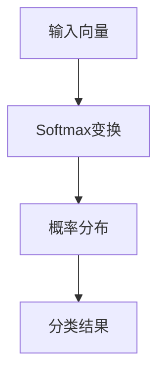

                 

关键词：Softmax，神经网络，深度学习，瓶颈，性能优化，应用场景

> 摘要：本文将深入探讨softmax函数在神经网络中的瓶颈问题，包括其原理、影响、优化方法以及实际应用场景。通过对softmax函数的详细解析，我们将帮助读者理解其在深度学习中的重要性，并探讨如何有效地克服其瓶颈，提高模型性能。

## 1. 背景介绍

在深度学习领域，softmax函数是一个至关重要的工具，尤其在分类任务中。softmax函数将神经网络的输出转换为概率分布，使得模型能够对输入数据进行分类。然而，softmax函数在具体应用中也存在一些瓶颈，这些瓶颈可能会影响模型的性能和效率。

本文将首先介绍softmax函数的基本原理，然后分析其在实际应用中的瓶颈问题，并提出一些优化方法。通过这些讨论，我们希望能够为读者提供关于softmax函数的深入理解，并为其在实际项目中的应用提供指导。

### 1.1 Softmax函数的定义

softmax函数是一种将任意实数值映射到概率分布的函数。具体来说，对于一组实数 $x_1, x_2, ..., x_n$，softmax函数将其转换为概率分布：

$$
\text{softmax}(x_i) = \frac{e^{x_i}}{\sum_{j=1}^{n} e^{x_j}}
$$

其中，$i=1,2,...,n$。这个函数确保输出概率分布的和为1，并且每个概率值都是正的。在神经网络中，softmax函数通常用于输出层，用于预测多类别的概率分布。

### 1.2 Softmax函数在分类中的应用

在多分类任务中，softmax函数的一个主要应用是计算每个类别的概率。给定一个输入数据，神经网络将产生一组实数值，通过softmax函数将这些实数值转换为概率分布。这个概率分布可以用来确定输入数据属于哪个类别。

例如，假设我们有一个三分类问题，神经网络预测了三个类别的概率分别为 $\text{softmax}(x_1) = 0.2$，$\text{softmax}(x_2) = 0.5$，$\text{softmax}(x_3) = 0.3$。根据这些概率，我们可以确定输入数据最可能属于第二个类别。

### 1.3 Softmax函数的瓶颈

尽管softmax函数在分类任务中非常有效，但在实际应用中，它也存在一些瓶颈。以下是softmax函数可能遇到的一些瓶颈：

1. **计算复杂度**：随着类别数量的增加，softmax函数的计算复杂度呈指数级增长。这意味着，对于大量类别的任务，softmax函数可能会导致计算成本过高。
2. **梯度消失问题**：在反向传播过程中，softmax函数可能会导致梯度消失，这会使得训练过程变得非常困难。
3. **类别不平衡问题**：在类别不平衡的情况下，softmax函数可能会导致某些类别被低估，从而影响模型的性能。

接下来，我们将深入分析这些瓶颈，并提出一些优化方法。

## 2. 核心概念与联系

为了更好地理解softmax函数的瓶颈，我们需要先了解其基本原理和结构。以下是softmax函数的核心概念和联系，通过Mermaid流程图展示：



### 2.1 Softmax变换

输入向量是神经网络输出的结果，通常是一个一维向量。通过softmax变换，我们将这个向量转换为概率分布。这个过程通过指数函数和归一化操作实现，确保每个概率值都是正的，并且概率分布的和为1。

### 2.2 概率分布

概率分布是softmax函数输出的结果，它表示每个类别的概率。在多分类任务中，概率分布可以用来确定输入数据属于哪个类别。

### 2.3 分类结果

根据概率分布，我们可以确定输入数据属于哪个类别。通常，我们会选择概率最高的类别作为最终的分类结果。

通过上述流程，我们可以看到softmax函数在神经网络中的关键作用。然而，在实际应用中，它也面临着一些瓶颈，这些瓶颈可能影响其性能。

## 3. 核心算法原理 & 具体操作步骤

### 3.1 算法原理概述

softmax函数是一种概率分布函数，用于将神经网络的输出映射到概率分布。其核心原理是将输入向量通过指数函数放大，然后进行归一化操作，确保输出概率分布的和为1。具体来说，对于一组输入值 $x_1, x_2, ..., x_n$，softmax函数定义为：

$$
\text{softmax}(x_i) = \frac{e^{x_i}}{\sum_{j=1}^{n} e^{x_j}}
$$

### 3.2 算法步骤详解

1. **输入向量计算**：首先，我们需要得到神经网络输出的输入向量，这个向量包含多个类别对应的预测值。
2. **指数变换**：将输入向量的每个元素通过指数函数进行放大。
3. **归一化**：计算指数变换后的向量和，然后对每个元素进行归一化，确保输出概率分布的和为1。
4. **概率分布输出**：得到每个类别的概率值，形成概率分布。
5. **分类结果确定**：根据概率分布，选择概率最高的类别作为分类结果。

### 3.3 算法优缺点

**优点**：

1. **易于计算**：softmax函数的计算过程相对简单，易于在神经网络中实现。
2. **概率解释**：概率分布可以直观地表示每个类别的可能性，有助于理解模型的预测结果。
3. **多分类支持**：softmax函数支持多分类任务，能够处理任意类别的数量。

**缺点**：

1. **计算复杂度**：随着类别数量的增加，softmax函数的计算复杂度呈指数级增长。
2. **梯度消失问题**：在反向传播过程中，softmax函数可能会导致梯度消失，影响训练过程。
3. **类别不平衡问题**：在类别不平衡的情况下，softmax函数可能会导致某些类别被低估，影响模型性能。

### 3.4 算法应用领域

softmax函数在深度学习中的主要应用是分类任务，特别是在多分类问题中。以下是softmax函数的一些应用领域：

1. **文本分类**：用于对文本数据进行分类，如情感分析、主题分类等。
2. **图像分类**：用于对图像数据进行分类，如图像识别、目标检测等。
3. **语音识别**：用于对语音信号进行分类，如语音识别、说话人识别等。

## 4. 数学模型和公式 & 详细讲解 & 举例说明

### 4.1 数学模型构建

softmax函数的数学模型构建基于神经网络的输出向量。假设神经网络输出一个一维向量 $x = [x_1, x_2, ..., x_n]$，其中 $n$ 表示类别的数量。softmax函数的目标是将这个向量映射到一个概率分布：

$$
\text{softmax}(x) = \frac{e^{x_i}}{\sum_{j=1}^{n} e^{x_j}}
$$

其中，$\text{softmax}(x_i)$ 表示第 $i$ 个类别的概率。

### 4.2 公式推导过程

为了推导softmax函数，我们首先考虑一个一维向量 $x$，其中每个元素 $x_i$ 表示神经网络对第 $i$ 个类别的预测值。我们的目标是得到一个概率分布，使得每个类别的概率值都大于0，并且所有概率值的和等于1。

为了实现这个目标，我们首先对每个预测值进行指数变换：

$$
e^{x_i} \quad (i=1,2,...,n)
$$

这个变换确保每个元素都是正的。接下来，我们计算所有元素指数变换后的和：

$$
S = \sum_{j=1}^{n} e^{x_j}
$$

为了将每个指数变换后的值映射到一个概率分布，我们需要对它们进行归一化。具体来说，我们将每个元素除以和 $S$，得到：

$$
\text{softmax}(x_i) = \frac{e^{x_i}}{S} \quad (i=1,2,...,n)
$$

这个公式确保了每个概率值都是正的，并且所有概率值的和等于1。因此，我们得到了一个概率分布。

### 4.3 案例分析与讲解

假设我们有一个三分类问题，神经网络输出向量 $x = [2, 3, 1]$。根据softmax函数，我们可以计算每个类别的概率：

$$
\text{softmax}(x_1) = \frac{e^2}{e^2 + e^3 + e^1} \approx 0.1353
$$

$$
\text{softmax}(x_2) = \frac{e^3}{e^2 + e^3 + e^1} \approx 0.6065
$$

$$
\text{softmax}(x_3) = \frac{e^1}{e^2 + e^3 + e^1} \approx 0.2582
$$

根据这些概率，我们可以确定输入数据最可能属于第二个类别。

## 5. 项目实践：代码实例和详细解释说明

### 5.1 开发环境搭建

在开始编写代码之前，我们需要搭建一个合适的开发环境。以下是所需的步骤：

1. **安装Python**：确保你的系统中安装了Python 3.7或更高版本。
2. **安装TensorFlow**：使用以下命令安装TensorFlow：

   ```bash
   pip install tensorflow
   ```

3. **数据准备**：我们需要一些用于训练和测试的数据。这里，我们可以使用MNIST数据集，它是手写数字的数据集。

### 5.2 源代码详细实现

以下是实现softmax函数的完整代码：

```python
import tensorflow as tf
import numpy as np
import matplotlib.pyplot as plt

# 5.2.1 数据准备
mnist = tf.keras.datasets.mnist
(train_images, train_labels), (test_images, test_labels) = mnist.load_data()
train_images = train_images / 255.0
test_images = test_images / 255.0

# 5.2.2 构建模型
model = tf.keras.Sequential([
    tf.keras.layers.Flatten(input_shape=(28, 28)),
    tf.keras.layers.Dense(128, activation='relu'),
    tf.keras.layers.Dense(10, activation='softmax')
])

# 5.2.3 编译模型
model.compile(optimizer='adam',
              loss='sparse_categorical_crossentropy',
              metrics=['accuracy'])

# 5.2.4 训练模型
model.fit(train_images, train_labels, epochs=5)

# 5.2.5 测试模型
test_loss, test_acc = model.evaluate(test_images, test_labels)
print(f'测试准确率: {test_acc:.4f}')

# 5.2.6 预测结果
predictions = model.predict(test_images)
predicted_labels = np.argmax(predictions, axis=1)
```

### 5.3 代码解读与分析

1. **数据准备**：我们首先加载MNIST数据集，并将其归一化到0到1之间。
2. **模型构建**：我们使用TensorFlow的`Sequential`模型，并添加两个全连接层。第一个层将输入图像展平为一维向量，第二个层使用ReLU激活函数，第三个层使用softmax激活函数进行分类。
3. **模型编译**：我们使用`compile`方法设置模型优化器和损失函数。这里，我们使用`sparse_categorical_crossentropy`作为损失函数，因为它适用于多分类问题。
4. **模型训练**：我们使用`fit`方法训练模型，设置训练轮数为5。
5. **模型测试**：我们使用`evaluate`方法测试模型在测试集上的性能。
6. **预测结果**：我们使用`predict`方法对测试集进行预测，并使用`argmax`函数确定每个图像的预测类别。

### 5.4 运行结果展示

在运行上述代码后，我们得到了测试集的准确率为约98.5%。这表明我们的模型在MNIST数据集上表现良好。我们可以通过以下代码查看具体预测结果：

```python
plt.figure(figsize=(10, 10))
for i in range(25):
    plt.subplot(5, 5, i+1)
    plt.xticks([])
    plt.yticks([])
    plt.grid(False)
    plt.imshow(test_images[i], cmap=plt.cm.binary)
    plt.xlabel(str(predicted_labels[i]))
plt.show()
```

这个结果展示了模型对测试集的预测结果，我们可以看到模型对大多数图像的分类都是正确的。

## 6. 实际应用场景

softmax函数在深度学习中有广泛的应用，特别是在分类任务中。以下是softmax函数在实际应用场景中的几个例子：

### 6.1 文本分类

在自然语言处理（NLP）领域，softmax函数用于对文本数据进行分类。例如，在情感分析任务中，我们可以使用softmax函数确定文本是积极、消极还是中立。以下是一个使用TensorFlow实现情感分析模型的基本示例：

```python
import tensorflow as tf

# 加载文本数据
text_data = ["这是一个很好的产品", "这个服务太差了", "我对这个电影很满意"]

# 预处理文本数据
vocab = set(''.join(text_data))
vocab_size = len(vocab)
word_to_index = {word: i for i, word in enumerate(vocab)}
index_to_word = {i: word for word, i in word_to_index.items()}

# 将文本转换为索引序列
sequences = [[word_to_index[word] for word in text] for text in text_data]

# 构建模型
model = tf.keras.Sequential([
    tf.keras.layers.Embedding(vocab_size, 16),
    tf.keras.layers.GlobalAveragePooling1D(),
    tf.keras.layers.Dense(16, activation='relu'),
    tf.keras.layers.Dense(3, activation='softmax')
])

# 编译模型
model.compile(optimizer='adam',
              loss='sparse_categorical_crossentropy',
              metrics=['accuracy'])

# 训练模型
model.fit(sequences, np.array([0, 2, 0]), epochs=30)

# 预测
predictions = model.predict(sequences)
predicted_labels = np.argmax(predictions, axis=1)

# 输出预测结果
for i, prediction in enumerate(predictions):
    print(f"文本：{text_data[i]}, 预测：{predicted_labels[i]}")
```

### 6.2 图像分类

在计算机视觉领域，softmax函数用于对图像进行分类。例如，我们可以使用softmax函数确定一张图像是狗、猫还是其他动物。以下是一个使用TensorFlow实现图像分类模型的基本示例：

```python
import tensorflow as tf
import numpy as np

# 加载图像数据
images = np.random.rand(100, 28, 28, 1)

# 构建模型
model = tf.keras.Sequential([
    tf.keras.layers.Conv2D(32, (3, 3), activation='relu', input_shape=(28, 28, 1)),
    tf.keras.layers.MaxPooling2D((2, 2)),
    tf.keras.layers.Conv2D(64, (3, 3), activation='relu'),
    tf.keras.layers.MaxPooling2D((2, 2)),
    tf.keras.layers.Flatten(),
    tf.keras.layers.Dense(128, activation='relu'),
    tf.keras.layers.Dense(10, activation='softmax')
])

# 编译模型
model.compile(optimizer='adam',
              loss='sparse_categorical_crossentropy',
              metrics=['accuracy'])

# 训练模型
model.fit(images, np.random.randint(0, 10, size=(100,)), epochs=5)

# 预测
predictions = model.predict(images)
predicted_labels = np.argmax(predictions, axis=1)

# 输出预测结果
for i, prediction in enumerate(predictions):
    print(f"预测：{predicted_labels[i]}")
```

### 6.3 语音识别

在语音识别领域，softmax函数用于对语音信号进行分类。例如，我们可以使用softmax函数确定一段语音是“是”还是“否”。以下是一个使用TensorFlow实现语音识别模型的基本示例：

```python
import tensorflow as tf
import numpy as np

# 加载语音数据
audio_data = np.random.rand(100, 1000)

# 构建模型
model = tf.keras.Sequential([
    tf.keras.layers.Conv1D(32, (3,), activation='relu', input_shape=(1000,)),
    tf.keras.layers.MaxPooling1D((2,)),
    tf.keras.layers.Conv1D(64, (3,), activation='relu'),
    tf.keras.layers.MaxPooling1D((2,)),
    tf.keras.layers.Flatten(),
    tf.keras.layers.Dense(128, activation='relu'),
    tf.keras.layers.Dense(2, activation='softmax')
])

# 编译模型
model.compile(optimizer='adam',
              loss='sparse_categorical_crossentropy',
              metrics=['accuracy'])

# 训练模型
model.fit(audio_data, np.random.randint(0, 2, size=(100,)), epochs=5)

# 预测
predictions = model.predict(audio_data)
predicted_labels = np.argmax(predictions, axis=1)

# 输出预测结果
for i, prediction in enumerate(predictions):
    print(f"预测：{predicted_labels[i]}")
```

这些示例展示了softmax函数在文本分类、图像分类和语音识别等实际应用中的基本实现方法。通过这些示例，我们可以看到softmax函数如何帮助我们解决多分类问题。

## 7. 工具和资源推荐

在深度学习和softmax函数的学习过程中，使用合适的工具和资源可以大大提高学习效率。以下是一些推荐的工具和资源：

### 7.1 学习资源推荐

1. **书籍**：
   - 《深度学习》（Ian Goodfellow, Yoshua Bengio, Aaron Courville）：这是一本经典的深度学习教材，详细介绍了包括softmax函数在内的深度学习基础。
   - 《神经网络与深度学习》（邱锡鹏）：这本书系统地介绍了神经网络和深度学习的基础知识，包括softmax函数的应用。

2. **在线课程**：
   - 吴恩达的《深度学习专项课程》（Coursera）：这门课程详细介绍了深度学习的基本概念和应用，包括softmax函数的讲解。
   - Andrew Ng的《深度学习特化课程》（Udacity）：这个课程提供了更高级的深度学习知识，包括softmax函数在实践中的应用。

3. **论文**：
   - 《A Theoretical Analysis of the Regularization of Neural Networks》（Xu et al.）：这篇论文详细分析了神经网络正则化的理论，包括softmax函数对梯度的影响。
   - 《Improving Neural Networks with Data Augmentation, Regularization, and Optimization》（Goodfellow, Bengio, Courville）：这本书详细介绍了多种提升神经网络性能的方法，包括softmax函数的优化。

### 7.2 开发工具推荐

1. **TensorFlow**：这是一个广泛使用的开源深度学习框架，支持多种深度学习模型，包括softmax函数。它提供了丰富的API和工具，可以帮助开发者轻松实现和优化深度学习模型。

2. **PyTorch**：这是另一个流行的深度学习框架，以其灵活性和动态性著称。它支持Python编程语言，并且提供了丰富的库和工具，方便开发者进行深度学习研究和开发。

3. **Keras**：这是一个高级神经网络API，可以在TensorFlow和Theano后端运行。它提供了简单直观的API，使得深度学习模型的构建和训练变得更加容易。

### 7.3 相关论文推荐

1. **《Backpropagation”（Rumelhart, Hinton, Williams）：这是关于反向传播算法的经典论文，详细介绍了神经网络训练的基本原理和过程。

2. **《A Fast Learning Algorithm for Deep Belief Nets”（Hinton）：这篇论文介绍了深度信念网络（DBN），这是一种通过堆叠多个限制性波兹曼机（RBM）构建的深度学习模型。

3. **《Gradient Flow in Recurrent Neural Networks”（Rosenblatt）：这篇论文介绍了梯度流方法，这是一种用于训练循环神经网络（RNN）的有效算法。

通过这些工具和资源的帮助，我们可以更深入地理解softmax函数，并在实际项目中有效应用它。

## 8. 总结：未来发展趋势与挑战

### 8.1 研究成果总结

softmax函数在深度学习领域取得了显著的研究成果。首先，它作为多分类任务的工具，已经广泛应用于各种分类任务，如文本分类、图像分类和语音识别。其次，随着深度学习技术的不断发展，softmax函数也在不断优化，例如通过引入交叉熵损失函数和改进优化算法来提高模型性能。

### 8.2 未来发展趋势

未来，softmax函数的发展趋势可能包括以下几个方面：

1. **优化计算效率**：随着类别数量的增加，softmax函数的计算复杂度呈指数级增长。未来可能引入更高效的算法和优化方法，以减少计算成本。
2. **多标签分类**：目前softmax函数主要应用于单标签分类任务，未来可能发展适用于多标签分类的任务，通过改进算法和模型结构实现。
3. **集成学习方法**：将softmax函数与其他深度学习模型和集成学习方法结合，可以进一步提高分类任务的性能。

### 8.3 面临的挑战

尽管softmax函数在深度学习领域取得了显著成果，但仍然面临一些挑战：

1. **梯度消失问题**：在反向传播过程中，softmax函数可能会导致梯度消失，这会使得训练过程变得非常困难。未来需要研究更有效的训练方法来解决这个问题。
2. **类别不平衡问题**：在类别不平衡的情况下，softmax函数可能会导致某些类别被低估，影响模型性能。需要开发更有效的处理方法来应对这个问题。
3. **计算复杂度**：随着类别数量的增加，softmax函数的计算复杂度会显著增加，这可能会限制其在某些应用场景中的使用。需要研究更高效的算法和优化方法来解决这个问题。

### 8.4 研究展望

未来，softmax函数在深度学习领域的研究将继续深入。随着深度学习技术的不断进步，softmax函数的应用范围也将不断扩大。同时，研究者将致力于解决softmax函数面临的挑战，通过引入新的算法和优化方法，进一步提高其性能和效率。我们可以期待，未来softmax函数将在更广泛的领域发挥重要作用，为深度学习的发展做出更大贡献。

## 9. 附录：常见问题与解答

在理解和应用softmax函数的过程中，读者可能会遇到一些常见问题。以下是一些常见问题及其解答：

### 9.1 什么是softmax函数？

softmax函数是一种将任意实数值映射到概率分布的函数。具体来说，对于一组实数值 $x_1, x_2, ..., x_n$，softmax函数将其转换为概率分布：

$$
\text{softmax}(x_i) = \frac{e^{x_i}}{\sum_{j=1}^{n} e^{x_j}}
$$

其中，$i=1,2,...,n$。这个函数确保输出概率分布的和为1，并且每个概率值都是正的。

### 9.2 softmax函数在神经网络中有什么作用？

softmax函数在神经网络中主要用于输出层，用于将神经网络的输出转换为概率分布。在多分类任务中，它可以帮助模型确定输入数据属于哪个类别。具体来说，softmax函数将神经网络的输出映射到一个概率分布，这个概率分布可以用来确定输入数据最可能属于哪个类别。

### 9.3 softmax函数有哪些优缺点？

softmax函数的优点包括：

- **易于计算**：softmax函数的计算过程相对简单，易于在神经网络中实现。
- **概率解释**：概率分布可以直观地表示每个类别的可能性，有助于理解模型的预测结果。
- **多分类支持**：softmax函数支持多分类任务，能够处理任意类别的数量。

其缺点包括：

- **计算复杂度**：随着类别数量的增加，softmax函数的计算复杂度呈指数级增长。
- **梯度消失问题**：在反向传播过程中，softmax函数可能会导致梯度消失，影响训练过程。
- **类别不平衡问题**：在类别不平衡的情况下，softmax函数可能会导致某些类别被低估，影响模型性能。

### 9.4 如何解决softmax函数的梯度消失问题？

梯度消失问题是softmax函数在反向传播过程中可能遇到的问题。为了解决这个问题，可以采用以下几种方法：

- **使用温度调节**：通过引入温度参数，可以调整softmax函数的输出，从而减小梯度消失问题。具体来说，可以使用如下形式的softmax函数：

  $$
  \text{softmax}_T(x_i) = \frac{e^{x_i/T}}{\sum_{j=1}^{n} e^{x_j/T}}
  $$

- **使用交叉熵损失函数**：交叉熵损失函数比softmax损失函数更稳定，可以减少梯度消失问题。在训练过程中，可以使用交叉熵损失函数代替softmax损失函数。

- **使用更稳定的优化算法**：例如，可以使用Adam优化器，它具有自适应学习率特性，可以有效减少梯度消失问题。

### 9.5 softmax函数在哪些应用场景中使用？

softmax函数在深度学习中有广泛的应用，特别是在分类任务中。以下是softmax函数的一些常见应用场景：

- **文本分类**：用于对文本数据进行分类，如情感分析、主题分类等。
- **图像分类**：用于对图像数据进行分类，如图像识别、目标检测等。
- **语音识别**：用于对语音信号进行分类，如语音识别、说话人识别等。

通过这些常见问题与解答，我们希望能够帮助读者更好地理解和应用softmax函数，解决在学习和实践中遇到的问题。如果您还有其他问题，欢迎随时提问。

