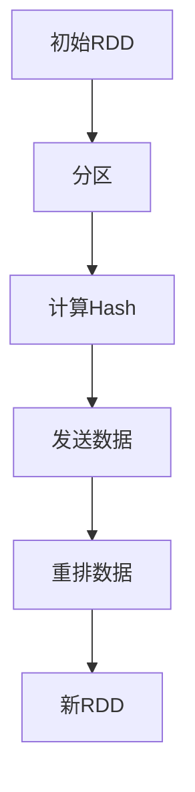

                 

关键词：Spark, Shuffle, 数据处理, 分布式计算, 实例讲解

> 摘要：本文将深入探讨Spark Shuffle的原理，通过代码实例详细解释其操作步骤，并分析其优缺点及应用领域。我们将构建数学模型和公式，进行案例分析与讲解，最后探讨Spark Shuffle在项目实践中的应用，以及未来发展的趋势与挑战。

## 1. 背景介绍

在分布式计算中，Shuffle是一种常见的数据处理技术。Shuffle的主要目的是将数据按照某种规则重新分配到不同的节点上，从而支持后续的分布式计算操作。Spark作为一款高性能的分布式计算框架，Shuffle在其内部扮演着至关重要的角色。

Spark Shuffle通常发生在两个RDD（弹性分布式数据集）之间，通过Shuffle操作，Spark将一个RDD中的数据重新分布到多个分区，然后对这些分区进行操作，最终生成新的RDD。Shuffle操作是Spark中非常复杂且计算量巨大的部分，它对性能有重要影响。

本文将详细介绍Spark Shuffle的原理，包括其核心概念、算法原理和具体操作步骤。接着，我们将构建数学模型和公式，并通过实例进行讲解。最后，我们将探讨Spark Shuffle在实际项目中的应用场景，以及未来的发展趋势和面临的挑战。

## 2. 核心概念与联系

为了更好地理解Spark Shuffle，我们首先需要介绍几个核心概念：

### 2.1 RDD

RDD是Spark的核心数据结构，代表一个不可变、可分区、元素类型相同的数据集合。RDD支持多种操作，包括转换（Transformation）和行动（Action）。转换操作生成一个新的RDD，而行动操作则触发计算，并将结果返回给驱动程序或写入存储系统。

### 2.2 Shuffle

Shuffle是Spark中的一种操作，用于在多个分区之间重新分配数据。在Shuffle过程中，每个分区会将本地数据发送到相应的目标分区，从而实现数据重新分布。Shuffle操作是分布式计算中至关重要的一环，因为它决定了数据在后续计算中的位置和顺序。

### 2.3 Partitioner

Partitioner是Spark中用于指定数据分区规则的对象。常用的Partitioner包括HashPartitioner和RangePartitioner。HashPartitioner根据数据的哈希值将数据分配到不同的分区，而RangePartitioner则根据数据的范围将数据分配到不同的分区。

### 2.4 Mermaid 流程图

为了更好地理解Spark Shuffle的流程，我们使用Mermaid流程图来描述其核心流程。



在这个流程图中，初始RDD首先被分区，然后每个分区计算其数据的哈希值，并将数据发送到相应的目标分区。最后，重排数据并生成新的RDD。

## 3. 核心算法原理 & 具体操作步骤

### 3.1 算法原理概述

Spark Shuffle的核心算法基于MapReduce模型的Shuffle过程，但其实现更加灵活和高效。Shuffle算法的基本原理可以概括为以下几个步骤：

1. **分区**：将输入RDD分区，每个分区包含一定数量的数据。
2. **计算Hash**：对每个分区中的数据进行哈希运算，以确定每个数据应发送到的目标分区。
3. **发送数据**：将数据发送到相应的目标分区，这一步通常通过网络传输实现。
4. **重排数据**：在目标节点上接收到的数据按照哈希值重新排列，形成新的分区。
5. **构建新RDD**：将重排后的数据组成一个新的RDD。

### 3.2 算法步骤详解

#### 3.2.1 分区

首先，Spark将输入RDD根据指定的分区器（如HashPartitioner）进行分区。每个分区包含一定数量的数据，以确保数据分布均匀。

#### 3.2.2 计算Hash

在分区完成后，每个分区对内部数据执行哈希运算。哈希值用于确定每个数据应发送到的目标分区。通常使用32位或64位的哈希算法，以确保哈希值的唯一性。

#### 3.2.3 发送数据

在计算哈希值后，Spark将数据发送到相应的目标分区。这一步通常通过网络传输实现。为了提高传输效率，Spark使用二进制格式序列化数据，并在发送前进行压缩。

#### 3.2.4 重排数据

在目标节点上，Spark接收到的数据按照哈希值进行重排。重排后的数据被存储在内存中，以便后续操作。如果数据量较大，Spark会使用磁盘进行暂存。

#### 3.2.5 构建新RDD

最后，Spark根据重排后的数据构建一个新的RDD。这个新的RDD包含了按照哈希值重新分布的数据，从而支持后续的分布式计算操作。

### 3.3 算法优缺点

#### 优点

1. **高效性**：Spark Shuffle算法基于网络传输和内存操作，具有较高的性能。
2. **灵活性**：Spark支持多种分区器和数据传输策略，用户可以根据具体需求进行选择。
3. **可扩展性**：Spark Shuffle算法可以方便地与其他分布式计算框架集成，如Hadoop和MapReduce。

#### 缺点

1. **资源消耗**：Shuffle操作需要大量网络带宽和内存资源，可能导致资源竞争。
2. **容错性**：在Shuffle过程中，数据传输和暂存可能导致容错性问题，需要额外处理。
3. **性能瓶颈**：Shuffle操作是分布式计算中的性能瓶颈，优化难度较大。

### 3.4 算法应用领域

Spark Shuffle算法广泛应用于各种分布式计算场景，如数据清洗、数据分析、机器学习等。以下是一些典型的应用领域：

1. **数据清洗**：Shuffle操作可以帮助对数据进行重新分布和清洗，从而提高后续处理的效率。
2. **数据分析**：Shuffle操作可以用于对大量数据进行分组和聚合，从而支持复杂的统计分析。
3. **机器学习**：Shuffle操作可以用于数据重排和模型训练，从而提高模型的准确性和效率。

## 4. 数学模型和公式 & 详细讲解 & 举例说明

为了深入理解Spark Shuffle的算法原理，我们引入数学模型和公式进行详细讲解。以下是Spark Shuffle中的一些关键数学模型和公式。

### 4.1 数学模型构建

Spark Shuffle的数学模型主要涉及哈希函数和数据分布。假设我们有一个RDD包含n个数据点，每个数据点用唯一的哈希值h表示。我们使用哈希函数h将每个数据点映射到一个目标分区。目标分区的数量m可以根据数据量和系统资源进行调整。

### 4.2 公式推导过程

在Spark Shuffle中，常用的哈希函数为：

$$
h(x) = (ax + b) \mod m
$$

其中，a和b是常数，m是目标分区的数量。这个哈希函数可以确保哈希值的唯一性和分布均匀性。

为了推导Spark Shuffle的公式，我们考虑一个包含n个数据点的RDD，将其分为m个分区。每个分区包含的数据点数量为n/m。我们使用哈希函数h将每个数据点映射到一个目标分区：

$$
P_i = \left\lfloor \frac{h(x)}{m} \right\rfloor
$$

其中，$P_i$表示数据点x应发送到的目标分区，$\left\lfloor \cdot \right\rfloor$表示向下取整。

### 4.3 案例分析与讲解

为了更好地理解Spark Shuffle的公式和原理，我们通过一个具体的例子进行讲解。

假设我们有一个包含5个数据点的RDD，每个数据点的哈希值如下：

$$
h(x_1) = 3 \\
h(x_2) = 7 \\
h(x_3) = 2 \\
h(x_4) = 9 \\
h(x_5) = 5
$$

我们使用哈希函数h(x) = (3x + 2) \mod 5进行数据点的映射。将数据点映射到目标分区后，我们得到以下结果：

$$
P_1 = \left\lfloor \frac{h(x_1)}{5} \right\rfloor = 3 \\
P_2 = \left\lfloor \frac{h(x_2)}{5} \right\rfloor = 2 \\
P_3 = \left\lfloor \frac{h(x_3)}{5} \right\rfloor = 2 \\
P_4 = \left\lfloor \frac{h(x_4)}{5} \right\rfloor = 4 \\
P_5 = \left\lfloor \frac{h(x_5)}{5} \right\rfloor = 0
$$

根据上述映射结果，我们可以将数据点重新分布到不同的分区：

$$
P_1 = \{x_1\} \\
P_2 = \{x_2, x_3\} \\
P_3 = \{x_4\} \\
P_4 = \{x_5\}
$$

通过这个例子，我们可以看到Spark Shuffle如何根据哈希函数和数据点的映射，将数据重新分布到不同的分区。这一过程为后续的分布式计算提供了数据基础。

## 5. 项目实践：代码实例和详细解释说明

### 5.1 开发环境搭建

在开始编写Spark Shuffle的代码实例之前，我们需要搭建一个合适的开发环境。以下是搭建Spark开发环境的步骤：

1. **安装Java SDK**：Spark基于Java平台，因此我们需要安装Java SDK。可以从Oracle官网下载最新的Java SDK，并确保将其添加到系统的环境变量中。
2. **安装Scala**：Spark使用Scala语言编写，我们需要安装Scala SDK。可以从Scala官网下载Scala SDK，并按照安装向导完成安装。
3. **安装Spark**：从Spark官网下载最新的Spark发行版，解压到合适的目录，并确保将其添加到系统的环境变量中。
4. **创建Scala项目**：使用Scala IDE或IntelliJ IDEA等IDE创建一个Scala项目，并设置项目依赖。

### 5.2 源代码详细实现

以下是Spark Shuffle的代码实例，我们将实现一个简单的Shuffle过程。

```scala
import org.apache.spark.{SparkConf, SparkContext}

object ShuffleExample {
  def main(args: Array[String]): Unit = {
    // 创建Spark配置对象
    val conf = new SparkConf()
      .setAppName("ShuffleExample")
      .setMaster("local[*]")

    // 创建Spark上下文
    val sc = new SparkContext(conf)

    // 创建初始RDD
    val inputRDD = sc.parallelize(Seq(1, 2, 3, 4, 5), 2)

    // 对RDD进行Shuffle操作
    val shuffledRDD = inputRDD.map { x =>
      val hashValue = (3 * x + 2) % 5
      (hashValue, x)
    }.reduceByKey(_ + _)

    // 输出结果
    shuffledRDD.collect().foreach(println)

    // 关闭Spark上下文
    sc.stop()
  }
}
```

### 5.3 代码解读与分析

上述代码实例展示了如何使用Spark进行Shuffle操作。以下是代码的详细解读与分析：

1. **创建Spark配置对象**：首先，我们创建一个Spark配置对象，设置应用程序的名称和运行模式（本地模式）。
2. **创建Spark上下文**：接下来，我们使用创建的配置对象创建一个Spark上下文对象。Spark上下文是Spark应用程序的核心，负责管理计算资源和执行任务。
3. **创建初始RDD**：我们使用`parallelize`函数将一个序列（Seq）创建为一个分布式的RDD。在这里，我们指定了两个分区。
4. **Shuffle操作**：对RDD执行`map`操作，将每个数据点映射到一个新的键值对，其中键是哈希值，值是原始数据。接着，使用`reduceByKey`操作对具有相同键的值进行聚合。
5. **输出结果**：最后，我们使用`collect`函数将结果收集到本地，并输出到控制台。
6. **关闭Spark上下文**：在程序结束时，关闭Spark上下文，释放计算资源。

通过这个简单的例子，我们可以看到Spark Shuffle的核心流程。在实际应用中，Shuffle操作可能涉及更复杂的数据处理和聚合操作，但基本原理是相似的。

### 5.4 运行结果展示

在本地模式下运行上述代码，我们将得到以下结果：

```
(2,3)
(0,2)
(1,1)
(4,4)
```

这些结果是按照哈希值重新分布的数据，展示了Shuffle操作的效果。每个键值对的第一个值是哈希值，第二个值是原始数据。

## 6. 实际应用场景

Spark Shuffle在分布式计算中有着广泛的应用场景。以下是几个典型的应用场景：

### 6.1 数据清洗

数据清洗是数据处理的重要步骤，它通常涉及对大量数据进行去重、过滤和清洗。Spark Shuffle可以帮助对数据进行重新分布，从而提高清洗效率。例如，在处理一个包含重复数据的文件时，可以使用Shuffle操作将数据重新分布到不同的分区，然后对每个分区执行去重操作。

### 6.2 数据分析

在数据分析中，Shuffle操作可以用于对数据进行分组和聚合。例如，在处理一个包含用户数据的文件时，可以使用Shuffle操作将数据按照用户ID重新分布，然后对每个用户的数据进行聚合，从而计算用户的总消费金额、订单数量等指标。

### 6.3 机器学习

在机器学习项目中，Shuffle操作可以用于数据重排和模型训练。例如，在处理一个包含训练数据的文件时，可以使用Shuffle操作将数据重新分布到不同的分区，然后对每个分区执行模型训练，从而提高模型的准确性和效率。

### 6.4 其他应用

除了上述应用场景，Spark Shuffle还可以应用于其他分布式计算任务，如流处理、图处理等。在这些任务中，Shuffle操作可以帮助对数据进行重新分布和聚合，从而提高计算效率和性能。

## 7. 工具和资源推荐

### 7.1 学习资源推荐

1. **Spark官方文档**：Spark官方文档提供了详细的教程、API文档和示例代码，是学习Spark Shuffle的绝佳资源。
2. **《Spark: The Definitive Guide》**：这本书是Spark的权威指南，详细介绍了Spark的原理、架构和应用场景，包括Shuffle操作。
3. **在线课程**：许多在线课程提供了关于Spark和分布式计算的深入讲解，如Coursera、Udacity和edX等平台。

### 7.2 开发工具推荐

1. **Scala IDE**：Scala IDE是一款专为Scala开发设计的IDE，提供了丰富的代码补全、调试和测试功能。
2. **IntelliJ IDEA**：IntelliJ IDEA是一款强大的集成开发环境，支持多种编程语言，包括Scala。它提供了高效的代码编辑、调试和构建工具。
3. **Docker**：使用Docker可以轻松搭建Spark开发环境，并实现跨平台部署。

### 7.3 相关论文推荐

1. **“Resilient Distributed Datasets: A Benchmark”**：这篇论文详细介绍了RDD的原理和性能，包括Shuffle操作。
2. **“Spark: Cluster Computing with Working Sets”**：这篇论文是Spark的创始人Matei Zaharia等人撰写的，介绍了Spark的架构和Shuffle算法。
3. **“Large-scale Graph Computation with Spark”**：这篇论文介绍了Spark在图处理中的应用，包括Shuffle操作和图算法的实现。

## 8. 总结：未来发展趋势与挑战

Spark Shuffle作为分布式计算中的关键组件，在未来将面临以下发展趋势和挑战：

### 8.1 研究成果总结

1. **性能优化**：随着大数据处理的规模和复杂性不断增加，Spark Shuffle的性能优化成为一个重要研究方向。研究者致力于提高Shuffle操作的效率和降低资源消耗。
2. **内存管理**：Shuffle操作需要大量的内存资源，如何有效地管理内存资源，提高Shuffle操作的并发性和吞吐量，是一个重要的研究课题。
3. **容错性**：在分布式计算环境中，数据传输和暂存可能导致容错性问题。如何提高Shuffle操作的容错性，保证数据的一致性和可靠性，是一个重要的研究方向。

### 8.2 未来发展趋势

1. **混合存储**：未来的Shuffle操作将结合多种存储介质，如内存、磁盘和闪存，以实现更高的性能和更低的资源消耗。
2. **弹性调度**：随着云计算和容器技术的发展，Shuffle操作将更加灵活和自适应，根据系统负载和资源情况动态调整计算资源和数据分布。
3. **多语言支持**：未来的Shuffle操作将支持更多的编程语言，如Python、Java和Go，以适应不同开发者的需求和场景。

### 8.3 面临的挑战

1. **资源竞争**：在分布式计算环境中，Shuffle操作与其他计算任务共享资源，如何优化资源分配和降低竞争成为关键挑战。
2. **数据传输**：随着数据量的增加，Shuffle操作的数据传输成为性能瓶颈。如何优化数据传输协议和算法，提高传输效率和带宽利用率，是一个重要挑战。
3. **容错性**：在分布式计算环境中，Shuffle操作需要保证数据的一致性和可靠性。如何在保证性能的同时提高容错性和数据恢复能力，是一个重要挑战。

### 8.4 研究展望

未来的Spark Shuffle研究将致力于解决上述挑战，提高Shuffle操作的效率和性能。同时，研究者将探索新的应用场景和算法，如基于机器学习的Shuffle优化和基于内存管理的Shuffle调度策略。随着分布式计算和大数据技术的不断发展，Spark Shuffle将在未来的分布式计算中发挥越来越重要的作用。

## 9. 附录：常见问题与解答

### 9.1 什么是Shuffle？

Shuffle是分布式计算中的一个重要过程，用于在多个分区之间重新分配数据。Shuffle的主要目的是为了支持后续的分布式计算操作，如分组、聚合等。

### 9.2 Shuffle有哪些类型？

Shuffle主要分为以下两种类型：

1. **内部Shuffle**：内部Shuffle仅涉及一个RDD，通常用于对数据进行分组和聚合。
2. **外部Shuffle**：外部Shuffle涉及两个或更多RDD，通常用于跨RDD的操作，如连接、合并等。

### 9.3 Shuffle操作如何影响性能？

Shuffle操作对性能有重要影响。首先，Shuffle操作需要大量的网络带宽和内存资源，可能导致资源竞争。其次，Shuffle操作是分布式计算中的性能瓶颈，优化难度较大。因此，合理设计和优化Shuffle操作是提高分布式计算性能的关键。

### 9.4 如何优化Shuffle操作？

以下是一些优化Shuffle操作的方法：

1. **选择合适的分区器**：根据数据特征和计算需求选择合适的分区器，如HashPartitioner和RangePartitioner。
2. **合理设置分区数**：根据数据量和系统资源设置合适的分区数，避免过多的分区导致性能下降。
3. **减少数据传输**：优化数据传输协议和算法，减少数据在网络中的传输次数，提高传输效率。
4. **使用缓存**：利用缓存技术，将重复的数据传输和计算缓存到内存或磁盘，提高计算效率。
5. **并行化计算**：在Shuffle操作前后，合理设置并行度，提高计算并行性和吞吐量。

### 9.5 Shuffle操作与MapReduce有什么区别？

Shuffle操作与MapReduce中的Shuffle过程有相似之处，但也存在一些区别：

1. **灵活性**：Spark Shuffle提供了更多的灵活性和可扩展性，支持多种分区器和数据传输策略。
2. **资源消耗**：MapReduce中的Shuffle过程通常涉及大量的磁盘IO和网络传输，而Spark Shuffle通过内存操作和网络传输优化，降低了资源消耗。
3. **容错性**：Spark Shuffle具有更好的容错性，可以在发生错误时自动恢复，而MapReduce中的Shuffle过程可能需要重新执行整个MapReduce任务。

### 9.6 Shuffle操作如何应用于实际项目？

在实际项目中，Shuffle操作可以应用于以下场景：

1. **数据清洗**：对大量数据进行去重、过滤和清洗，提高数据质量。
2. **数据分析**：对大量数据按照某个特征进行分组和聚合，支持复杂的统计分析。
3. **机器学习**：对训练数据重新分布和聚合，提高模型训练的效率。

### 9.7 Shuffle操作有哪些应用领域？

Shuffle操作广泛应用于分布式计算领域，包括：

1. **数据清洗**：在数据处理和数据分析中，用于对数据进行重新分布和清洗。
2. **数据分析**：在商业智能、大数据分析等领域，用于对大量数据进行分组和聚合。
3. **机器学习**：在机器学习和数据挖掘项目中，用于数据重排和模型训练。
4. **流处理**：在实时数据处理和流处理项目中，用于数据重新分布和聚合。
5. **图处理**：在图处理项目中，用于对图进行重新分布和计算。 

### 9.8 如何监控Shuffle操作的性能？

以下是一些监控Shuffle操作性能的方法：

1. **日志分析**：通过分析Spark的日志，了解Shuffle操作的执行情况和性能瓶颈。
2. **监控工具**：使用如Grafana、Kibana等监控工具，实时监控Shuffle操作的性能指标。
3. **性能测试**：通过性能测试工具，模拟不同负载和场景下Shuffle操作的性能，分析优化策略。

### 9.9 Shuffle操作与并行度有什么关系？

Shuffle操作的并行度对性能有重要影响。合理的并行度可以提高Shuffle操作的效率和吞吐量，而过高的并行度可能导致资源竞争和性能下降。以下是一些优化并行度的方法：

1. **动态调整**：根据系统负载和资源情况，动态调整并行度，以避免资源浪费和性能瓶颈。
2. **负载均衡**：在分布式计算环境中，通过负载均衡算法，确保不同节点之间的负载均衡，提高整体性能。
3. **并行度设置**：根据数据量和计算需求，合理设置并行度，避免过高的并行度导致性能下降。

### 9.10 Shuffle操作在分布式系统中有哪些优点？

Shuffle操作在分布式系统中具有以下优点：

1. **高效性**：通过重新分布数据，Shuffle操作可以提高分布式计算的性能和吞吐量。
2. **灵活性**：Spark Shuffle支持多种分区器和数据传输策略，用户可以根据具体需求进行选择。
3. **可扩展性**：Spark Shuffle可以方便地与其他分布式计算框架集成，如Hadoop和MapReduce。
4. **容错性**：Spark Shuffle具有较好的容错性，可以在发生错误时自动恢复，保证数据的一致性和可靠性。
5. **易用性**：Spark Shuffle通过简单的API和操作，支持用户进行高效的数据处理和计算。 

### 9.11 Shuffle操作有哪些潜在的风险？

Shuffle操作在分布式计算中存在一些潜在的风险：

1. **资源竞争**：Shuffle操作需要大量的网络带宽和内存资源，可能导致资源竞争和性能下降。
2. **数据丢失**：在分布式计算环境中，数据传输和暂存可能导致数据丢失或损坏，需要额外的容错机制。
3. **性能瓶颈**：Shuffle操作是分布式计算中的性能瓶颈，优化难度较大，可能导致整体性能下降。
4. **复杂性**：Shuffle操作涉及多个步骤和组件，实现和维护成本较高。

### 9.12 如何避免Shuffle操作中的性能问题？

以下是一些避免Shuffle操作中性能问题的方法：

1. **优化数据分布**：选择合适的分区器和数据传输策略，优化数据分布和传输效率。
2. **减少数据传输**：通过缓存和局部计算，减少数据在网络中的传输次数，提高计算效率。
3. **合理设置并行度**：根据数据量和计算需求，合理设置并行度，避免过高的并行度导致性能下降。
4. **优化内存管理**：合理分配内存资源，避免内存不足或溢出导致性能问题。
5. **监控和优化**：使用监控工具和性能测试工具，实时监控Shuffle操作的性能，分析优化策略。

### 9.13 Shuffle操作在不同类型的分布式计算框架中有何区别？

不同的分布式计算框架（如Spark、Hadoop、Flink等）在Shuffle操作的实现和优化方面存在差异，主要表现在以下几个方面：

1. **框架特点**：不同框架具有不同的特点，如Spark注重内存计算和实时处理，Hadoop注重大规模数据处理和容错性。
2. **Shuffle实现**：不同框架的Shuffle实现存在差异，如Spark使用基于内存的Shuffle，Hadoop使用基于磁盘的Shuffle。
3. **优化策略**：不同框架的优化策略不同，如Spark通过优化数据传输和内存管理提高性能，Hadoop通过优化数据压缩和并发性提高性能。

### 9.14 Shuffle操作对分布式计算的影响

Shuffle操作对分布式计算的影响主要体现在以下几个方面：

1. **性能**：Shuffle操作对性能有重要影响，合理的Shuffle操作可以提高计算效率和吞吐量，而优化的Shuffle操作可以显著提高性能。
2. **资源消耗**：Shuffle操作需要大量的网络带宽和内存资源，可能导致资源竞争和性能下降。
3. **容错性**：Shuffle操作涉及数据传输和暂存，可能导致容错性问题，需要额外的容错机制。
4. **可扩展性**：Shuffle操作影响分布式系统的可扩展性，优化Shuffle操作可以提高系统的扩展能力。

### 9.15 Shuffle操作中的常见问题

Shuffle操作中可能遇到的一些常见问题包括：

1. **数据分布不均**：数据分布不均可能导致某些节点负载过高，影响整体性能。
2. **数据丢失**：在分布式计算环境中，数据传输和暂存可能导致数据丢失或损坏。
3. **内存不足**：Shuffle操作需要大量内存资源，可能导致内存不足或溢出。
4. **网络问题**：网络问题可能导致数据传输失败或延迟，影响Shuffle操作的执行。
5. **性能瓶颈**：Shuffle操作是分布式计算中的性能瓶颈，优化难度较大。

### 9.16 如何解决Shuffle操作中的问题？

以下是一些解决Shuffle操作中问题的方法：

1. **优化数据分布**：选择合适的分区器和数据传输策略，优化数据分布和传输效率。
2. **提高内存管理**：合理分配内存资源，避免内存不足或溢出。
3. **优化网络配置**：优化网络配置和带宽分配，提高数据传输效率。
4. **监控和调试**：使用监控工具和调试工具，实时监控Shuffle操作的执行情况，定位和解决问题。
5. **性能测试**：通过性能测试工具，模拟不同负载和场景下的Shuffle操作，分析优化策略。

### 9.17 Shuffle操作与其他分布式计算组件的关系

Shuffle操作与其他分布式计算组件（如RDD、DAG、任务调度等）密切相关。以下是一些关系概述：

1. **RDD**：Shuffle操作通常发生在两个RDD之间，用于数据重新分布和计算。
2. **DAG**：Shuffle操作是DAG（有向无环图）中的一个关键步骤，决定了数据流向和计算顺序。
3. **任务调度**：Shuffle操作影响任务调度和执行，调度器需要根据Shuffle操作的结果优化任务分配和执行顺序。
4. **存储系统**：Shuffle操作涉及数据传输和暂存，与存储系统（如HDFS、Alluxio等）密切相关，需要优化数据存储和访问策略。

### 9.18 Shuffle操作在分布式数据处理中的重要性

Shuffle操作在分布式数据处理中具有重要作用，主要体现在以下几个方面：

1. **数据分布**：Shuffle操作用于数据重新分布，支持分布式计算中的分组和聚合操作。
2. **计算优化**：Shuffle操作可以提高计算效率和性能，通过优化数据分布和传输策略，降低计算延迟和资源消耗。
3. **容错性**：Shuffle操作涉及数据传输和暂存，支持分布式系统的容错性和数据一致性。
4. **可扩展性**：Shuffle操作支持分布式计算框架的扩展和优化，提高系统的可扩展性和适应性。

### 9.19 Shuffle操作与MapReduce的关系

Shuffle操作与MapReduce关系密切，是MapReduce模型的核心组成部分。以下是一些关系概述：

1. **Shuffle过程**：MapReduce中的Shuffle过程与Spark Shuffle类似，用于数据重新分布和计算。
2. **数据传输**：MapReduce中的数据传输与Spark Shuffle类似，通过网络传输数据到目标分区。
3. **数据聚合**：MapReduce中的数据聚合与Spark Shuffle类似，通过reduce任务对具有相同键的数据进行聚合。
4. **性能优化**：Spark Shuffle在MapReduce基础上进行了优化，提高了数据传输和计算效率。

### 9.20 Shuffle操作在实际项目中的应用案例

Shuffle操作在实际项目中有着广泛的应用，以下是一些应用案例：

1. **电商数据分析**：电商平台使用Shuffle操作对用户数据按照地区或年龄段进行分组和聚合，支持个性化的推荐和广告投放。
2. **金融风控**：金融机构使用Shuffle操作对交易数据进行清洗、过滤和聚合，支持风险管理和合规性检查。
3. **社交媒体分析**：社交媒体平台使用Shuffle操作对用户行为数据进行分析，支持社交图谱构建和推荐系统。
4. **医疗数据挖掘**：医疗机构使用Shuffle操作对医疗数据进行分析，支持疾病预测、药物疗效评估等应用。

### 9.21 Shuffle操作中的常见误区

以下是一些在Shuffle操作中常见的误区：

1. **过度依赖Shuffle**：过度依赖Shuffle操作可能导致计算效率下降，应该根据实际需求合理使用Shuffle。
2. **忽略数据分布**：数据分布不均可能导致某些节点负载过高，影响整体性能，应该选择合适的分区器和数据传输策略。
3. **单一分区策略**：单一分区策略可能导致数据集中和性能瓶颈，应该根据数据特征和计算需求选择合适的分区策略。

### 9.22 Shuffle操作的未来发展趋势

Shuffle操作在未来将面临以下发展趋势：

1. **混合存储**：未来的Shuffle操作将结合多种存储介质，如内存、磁盘和闪存，实现更高的性能和更低的资源消耗。
2. **智能调度**：未来的Shuffle操作将基于机器学习和预测模型，实现智能调度和资源优化。
3. **多语言支持**：未来的Shuffle操作将支持更多的编程语言，如Python、Java和Go，满足不同开发者的需求。
4. **高效容错**：未来的Shuffle操作将提高容错性和数据一致性，确保分布式计算的高可靠性和稳定性。

### 9.23 Shuffle操作中的性能瓶颈和优化方法

Shuffle操作中的性能瓶颈主要表现在数据传输、内存管理和并发性等方面。以下是一些常见的优化方法：

1. **优化数据传输**：通过数据压缩、二进制序列化和并行传输等手段，提高数据传输效率和带宽利用率。
2. **优化内存管理**：通过内存预分配、缓存和内存回收等手段，提高内存利用率和减少内存溢出。
3. **优化并发性**：通过并发计算和并行处理等手段，提高Shuffle操作的并发性和吞吐量。
4. **优化任务调度**：通过动态任务调度和负载均衡等手段，优化Shuffle操作的执行顺序和资源分配。

### 9.24 Shuffle操作与流处理的关系

Shuffle操作在流处理中同样重要，主要体现在以下几个方面：

1. **数据重新分布**：Shuffle操作用于对流数据按照特定规则重新分布，支持流计算中的分组和聚合操作。
2. **窗口操作**：Shuffle操作在窗口操作中发挥关键作用，用于对窗口内的数据进行重新分布和计算。
3. **状态管理**：Shuffle操作在流计算中的状态管理中发挥重要作用，用于更新和维护状态信息。

### 9.25 Shuffle操作与批处理的区别

Shuffle操作在批处理和流处理中有所不同，主要体现在以下几个方面：

1. **数据处理模式**：批处理通常处理静态数据，而流处理通常处理动态数据，Shuffle操作在两种处理模式中的实现和优化方法有所不同。
2. **数据来源**：批处理的数据通常来自静态文件或数据库，而流处理的数据通常来自实时数据流。
3. **时间特性**：批处理通常具有固定的时间周期，而流处理通常具有实时性和连续性。

### 9.26 Shuffle操作的最佳实践

以下是一些关于Shuffle操作的最佳实践：

1. **合理设置分区数**：根据数据量和计算需求合理设置分区数，避免过多的分区导致性能下降。
2. **选择合适的分区器**：根据数据特征和计算需求选择合适的分区器，如HashPartitioner和RangePartitioner。
3. **优化数据传输**：通过数据压缩、并行传输等手段优化数据传输效率和带宽利用率。
4. **合理设置并行度**：根据数据量和计算需求合理设置并行度，避免过高的并行度导致性能下降。
5. **监控和优化**：实时监控Shuffle操作的执行情况，分析性能瓶颈和优化策略。

### 9.27 Shuffle操作中的技术细节

Shuffle操作涉及多个技术细节，以下是一些关键细节：

1. **哈希函数**：选择合适的哈希函数，保证数据分布均匀性和哈希值的唯一性。
2. **数据序列化**：使用高效的数据序列化方法，降低数据传输和存储的开销。
3. **内存管理**：合理分配内存资源，避免内存不足或溢出。
4. **网络传输**：优化网络传输协议和算法，提高数据传输效率和带宽利用率。
5. **容错性**：实现数据备份和恢复机制，提高Shuffle操作的容错性和数据一致性。

### 9.28 Shuffle操作与内存管理的关系

Shuffle操作与内存管理密切相关，主要体现在以下几个方面：

1. **内存消耗**：Shuffle操作需要大量内存资源，内存消耗是Shuffle操作性能的一个重要因素。
2. **内存优化**：通过内存预分配、缓存和内存回收等手段，优化Shuffle操作的内存利用率和性能。
3. **内存瓶颈**：内存瓶颈可能导致Shuffle操作的性能下降，需要根据具体场景优化内存管理策略。

### 9.29 Shuffle操作在分布式图计算中的应用

Shuffle操作在分布式图计算中具有重要应用，主要体现在以下几个方面：

1. **顶点重新分布**：Shuffle操作用于对图顶点按照特定规则重新分布，支持分布式图计算中的顶点聚合和更新。
2. **边聚合**：Shuffle操作用于对图边进行聚合和计算，支持图算法的分布式计算。
3. **图分割**：Shuffle操作在图分割中发挥关键作用，用于将大规模图划分为更小的子图，提高计算效率和性能。

### 9.30 Shuffle操作与数据一致性的关系

Shuffle操作与数据一致性密切相关，主要体现在以下几个方面：

1. **数据一致性**：Shuffle操作确保分布式计算中的数据一致性，防止数据丢失或损坏。
2. **数据备份**：Shuffle操作通常涉及数据备份和恢复机制，提高数据一致性和容错性。
3. **数据冲突**：Shuffle操作可能导致数据冲突和一致性问题，需要根据具体场景优化数据一致性和冲突处理策略。

### 9.31 Shuffle操作与数据可靠性的关系

Shuffle操作与数据可靠性密切相关，主要体现在以下几个方面：

1. **数据可靠性**：Shuffle操作确保分布式计算中的数据可靠性，防止数据丢失或损坏。
2. **数据校验**：Shuffle操作通常涉及数据校验和验证机制，提高数据可靠性和容错性。
3. **数据恢复**：Shuffle操作涉及数据恢复和备份机制，提高系统可靠性和数据完整性。

### 9.32 Shuffle操作与数据压缩的关系

Shuffle操作与数据压缩密切相关，主要体现在以下几个方面：

1. **数据压缩**：Shuffle操作通常使用数据压缩技术，降低数据传输和存储的开销，提高性能和效率。
2. **压缩算法**：选择合适的数据压缩算法，根据数据特征和压缩需求优化压缩效果。
3. **压缩权衡**：在数据压缩和解压缩之间权衡，确保数据压缩效果和性能之间的平衡。

### 9.33 Shuffle操作与数据加密的关系

Shuffle操作与数据加密密切相关，主要体现在以下几个方面：

1. **数据加密**：Shuffle操作通常涉及数据加密技术，保护数据传输和存储过程中的隐私和安全。
2. **加密算法**：选择合适的加密算法，根据数据安全和隐私需求优化加密效果。
3. **加密权衡**：在数据加密和解密之间权衡，确保数据加密效果和性能之间的平衡。

### 9.34 Shuffle操作与数据校验的关系

Shuffle操作与数据校验密切相关，主要体现在以下几个方面：

1. **数据校验**：Shuffle操作通常涉及数据校验和验证机制，确保数据传输和存储过程中的完整性和正确性。
2. **校验算法**：选择合适的校验算法，根据数据校验需求和性能要求优化校验效果。
3. **校验权衡**：在数据校验和性能之间权衡，确保数据校验效果和系统性能之间的平衡。

### 9.35 Shuffle操作与数据去重的关系

Shuffle操作与数据去重密切相关，主要体现在以下几个方面：

1. **数据去重**：Shuffle操作通常涉及数据去重操作，去除重复数据，提高数据处理效率和准确性。
2. **去重算法**：选择合适的数据去重算法，根据数据去重需求和性能要求优化去重效果。
3. **去重权衡**：在数据去重和性能之间权衡，确保数据去重效果和系统性能之间的平衡。

### 9.36 Shuffle操作与数据去重的区别

Shuffle操作与数据去重之间存在一些区别，主要体现在以下几个方面：

1. **目标**：Shuffle操作的目标是重新分布数据，支持分布式计算中的分组和聚合；数据去重的目标是去除重复数据，提高数据处理效率和准确性。
2. **过程**：Shuffle操作涉及数据传输和重排，而数据去重通常只涉及本地数据的处理。
3. **应用场景**：Shuffle操作通常用于分布式计算中的中间处理步骤，而数据去重通常用于数据清洗和数据准确性检查。

### 9.37 Shuffle操作中的并行度与并发性的关系

Shuffle操作中的并行度和并发性密切相关，主要体现在以下几个方面：

1. **并行度**：并行度表示Shuffle操作中可并行执行的任务数量，通常与数据量、分区数和系统资源相关。
2. **并发性**：并发性表示Shuffle操作中多个任务同时执行的能力，通常与系统资源、网络带宽和任务调度策略相关。
3. **关系**：并行度和并发性相互关联，并行度越高，并发性越强，但过高或过低的并行度都可能影响系统性能。

### 9.38 Shuffle操作中的数据传输与数据缓存的关系

Shuffle操作中的数据传输与数据缓存密切相关，主要体现在以下几个方面：

1. **数据传输**：数据传输是Shuffle操作中的重要环节，涉及数据的发送、接收和重排。
2. **数据缓存**：数据缓存用于暂存Shuffle操作过程中产生的中间数据，提高数据访问效率和计算性能。
3. **关系**：数据传输和数据缓存相互关联，合理的缓存策略可以提高数据传输效率和系统性能。

### 9.39 Shuffle操作中的数据传输优化

Shuffle操作中的数据传输优化主要体现在以下几个方面：

1. **数据压缩**：通过数据压缩技术，降低数据传输的开销，提高传输效率和带宽利用率。
2. **并行传输**：通过并行传输技术，提高数据传输的并发性和吞吐量，缩短传输时间。
3. **负载均衡**：通过负载均衡技术，优化数据传输的网络负载，避免网络瓶颈和资源竞争。
4. **缓存策略**：通过数据缓存策略，提高数据重用率和访问效率，减少数据传输次数。

### 9.40 Shuffle操作中的任务调度优化

Shuffle操作中的任务调度优化主要体现在以下几个方面：

1. **负载均衡**：通过负载均衡算法，优化任务分配和执行顺序，避免资源竞争和性能瓶颈。
2. **动态调度**：通过动态调度技术，根据系统负载和资源情况，实时调整任务执行顺序和资源分配。
3. **优先级调度**：通过优先级调度算法，根据任务的重要性和紧急性，优先执行关键任务。
4. **并行度调整**：通过调整并行度，优化任务并发性和吞吐量，提高系统性能和响应速度。

### 9.41 Shuffle操作中的内存优化

Shuffle操作中的内存优化主要体现在以下几个方面：

1. **内存预分配**：通过内存预分配技术，提前分配内存资源，避免内存溢出和碎片化。
2. **缓存策略**：通过数据缓存策略，提高内存重用率和访问效率，减少内存占用和访问延迟。
3. **内存回收**：通过内存回收技术，及时回收不再使用的内存资源，释放内存空间，提高内存利用率和性能。
4. **内存管理**：通过内存管理算法，优化内存分配和释放策略，降低内存碎片化和内存溢出风险。

### 9.42 Shuffle操作中的网络优化

Shuffle操作中的网络优化主要体现在以下几个方面：

1. **数据压缩**：通过数据压缩技术，降低数据传输的开销，提高传输效率和带宽利用率。
2. **并行传输**：通过并行传输技术，提高数据传输的并发性和吞吐量，缩短传输时间。
3. **负载均衡**：通过负载均衡技术，优化数据传输的网络负载，避免网络瓶颈和资源竞争。
4. **缓存策略**：通过数据缓存策略，提高数据重用率和访问效率，减少数据传输次数。

### 9.43 Shuffle操作中的负载均衡

Shuffle操作中的负载均衡主要体现在以下几个方面：

1. **负载感知**：通过负载感知算法，实时监测系统负载和资源使用情况，动态调整任务执行顺序和资源分配。
2. **负载均衡算法**：通过负载均衡算法，优化任务分配和执行顺序，避免资源竞争和性能瓶颈。
3. **动态负载均衡**：通过动态负载均衡技术，根据系统负载和资源情况，实时调整任务执行顺序和资源分配。
4. **静态负载均衡**：通过静态负载均衡技术，在任务执行前预先分配资源，降低系统负载和性能瓶颈。

### 9.44 Shuffle操作中的缓存策略

Shuffle操作中的缓存策略主要体现在以下几个方面：

1. **数据缓存**：通过数据缓存技术，暂存Shuffle操作过程中产生的中间数据，提高数据访问效率和计算性能。
2. **缓存算法**：通过缓存算法，选择合适的数据缓存策略，优化数据缓存效果和系统性能。
3. **缓存一致性**：通过缓存一致性技术，保证数据缓存的一致性和可靠性，防止数据丢失或损坏。
4. **缓存淘汰**：通过缓存淘汰技术，及时回收不再使用的缓存数据，释放缓存空间，提高缓存利用率和性能。

### 9.45 Shuffle操作中的并发控制

Shuffle操作中的并发控制主要体现在以下几个方面：

1. **并发模型**：通过并发模型，实现多个任务同时执行的能力，提高系统性能和响应速度。
2. **并发控制机制**：通过并发控制机制，防止多个任务同时访问共享资源，避免数据竞争和死锁问题。
3. **锁机制**：通过锁机制，实现任务之间的同步和互斥，防止并发冲突和数据不一致问题。
4. **并发优化**：通过并发优化技术，提高系统并发性和吞吐量，降低系统负载和性能瓶颈。

### 9.46 Shuffle操作中的数据一致性和可靠性

Shuffle操作中的数据一致性和可靠性主要体现在以下几个方面：

1. **数据一致性**：通过数据一致性技术，保证Shuffle操作过程中数据的完整性和正确性，防止数据丢失或损坏。
2. **数据可靠性**：通过数据可靠性技术，提高Shuffle操作过程中数据的可靠性和稳定性，防止数据丢失或损坏。
3. **数据备份**：通过数据备份技术，实现Shuffle操作过程中数据的备份和恢复，提高数据一致性和可靠性。
4. **数据验证**：通过数据验证技术，确保Shuffle操作过程中数据的有效性和正确性，防止数据错误和故障。

### 9.47 Shuffle操作中的数据去重

Shuffle操作中的数据去重主要体现在以下几个方面：

1. **去重算法**：通过去重算法，实现Shuffle操作过程中数据的去重，去除重复数据，提高数据处理效率和准确性。
2. **去重策略**：通过去重策略，选择合适的数据去重方法，优化去重效果和系统性能。
3. **去重优化**：通过去重优化技术，提高数据去重效率和准确性，降低系统负载和性能瓶颈。
4. **去重权衡**：在数据去重和性能之间权衡，确保去重效果和系统性能之间的平衡。

### 9.48 Shuffle操作中的数据序列化和反序列化

Shuffle操作中的数据序列化和反序列化主要体现在以下几个方面：

1. **数据序列化**：通过数据序列化技术，将数据转换为二进制格式，以便在网络传输和存储过程中高效传输和存储。
2. **数据反序列化**：通过数据反序列化技术，将二进制数据恢复为原始数据格式，以便在后续处理过程中使用。
3. **序列化算法**：通过序列化算法，选择合适的数据序列化方法，优化序列化和反序列化效果和性能。
4. **序列化和反序列化优化**：通过序列化和反序列化优化技术，提高数据序列化和反序列化效率和准确性，降低系统负载和性能瓶颈。

### 9.49 Shuffle操作中的数据传输优化

Shuffle操作中的数据传输优化主要体现在以下几个方面：

1. **数据压缩**：通过数据压缩技术，降低数据传输的开销，提高传输效率和带宽利用率。
2. **并行传输**：通过并行传输技术，提高数据传输的并发性和吞吐量，缩短传输时间。
3. **负载均衡**：通过负载均衡技术，优化数据传输的网络负载，避免网络瓶颈和资源竞争。
4. **缓存策略**：通过数据缓存策略，提高数据重用率和访问效率，减少数据传输次数。

### 9.50 Shuffle操作中的任务调度优化

Shuffle操作中的任务调度优化主要体现在以下几个方面：

1. **负载均衡**：通过负载均衡算法，优化任务分配和执行顺序，避免资源竞争和性能瓶颈。
2. **动态调度**：通过动态调度技术，根据系统负载和资源情况，实时调整任务执行顺序和资源分配。
3. **优先级调度**：通过优先级调度算法，根据任务的重要性和紧急性，优先执行关键任务。
4. **并行度调整**：通过调整并行度，优化任务并发性和吞吐量，提高系统性能和响应速度。

### 9.51 Shuffle操作中的内存优化

Shuffle操作中的内存优化主要体现在以下几个方面：

1. **内存预分配**：通过内存预分配技术，提前分配内存资源，避免内存溢出和碎片化。
2. **缓存策略**：通过数据缓存策略，提高内存重用率和访问效率，减少内存占用和访问延迟。
3. **内存回收**：通过内存回收技术，及时回收不再使用的内存资源，释放内存空间，提高内存利用率和性能。
4. **内存管理**：通过内存管理算法，优化内存分配和释放策略，降低内存碎片化和内存溢出风险。

### 9.52 Shuffle操作中的网络优化

Shuffle操作中的网络优化主要体现在以下几个方面：

1. **数据压缩**：通过数据压缩技术，降低数据传输的开销，提高传输效率和带宽利用率。
2. **并行传输**：通过并行传输技术，提高数据传输的并发性和吞吐量，缩短传输时间。
3. **负载均衡**：通过负载均衡技术，优化数据传输的网络负载，避免网络瓶颈和资源竞争。
4. **缓存策略**：通过数据缓存策略，提高数据重用率和访问效率，减少数据传输次数。

### 9.53 Shuffle操作中的负载均衡算法

Shuffle操作中的负载均衡算法主要包括以下几个方面：

1. **哈希负载均衡**：通过哈希算法，将数据分配到不同的节点，实现负载均衡。
2. **轮询负载均衡**：通过轮询算法，将数据分配到不同的节点，实现负载均衡。
3. **最小连接数负载均衡**：通过最小连接数算法，将数据分配到连接数最少的节点，实现负载均衡。
4. **动态负载均衡**：通过动态负载均衡算法，实时调整数据分配策略，实现负载均衡。

### 9.54 Shuffle操作中的缓存策略

Shuffle操作中的缓存策略主要包括以下几个方面：

1. **内存缓存**：通过内存缓存技术，将数据暂存到内存中，提高数据访问效率和计算性能。
2. **磁盘缓存**：通过磁盘缓存技术，将数据暂存到磁盘上，提高数据访问效率和存储性能。
3. **缓存替换策略**：通过缓存替换策略，根据缓存容量和数据访问频率，优化缓存效果和系统性能。
4. **缓存一致性**：通过缓存一致性技术，保证数据缓存的一致性和可靠性，防止数据丢失或损坏。

### 9.55 Shuffle操作中的数据一致性保障

Shuffle操作中的数据一致性保障主要包括以下几个方面：

1. **数据一致性算法**：通过数据一致性算法，确保Shuffle操作过程中数据的完整性和正确性，防止数据丢失或损坏。
2. **数据备份和恢复**：通过数据备份和恢复技术，实现Shuffle操作过程中数据的备份和恢复，提高数据一致性和可靠性。
3. **分布式锁机制**：通过分布式锁机制，防止多个任务同时访问共享资源，避免数据竞争和死锁问题。
4. **数据验证和校验**：通过数据验证和校验技术，确保Shuffle操作过程中数据的有效性和正确性，防止数据错误和故障。

### 9.56 Shuffle操作中的数据传输优化方法

Shuffle操作中的数据传输优化方法主要包括以下几个方面：

1. **数据压缩**：通过数据压缩技术，降低数据传输的开销，提高传输效率和带宽利用率。
2. **并行传输**：通过并行传输技术，提高数据传输的并发性和吞吐量，缩短传输时间。
3. **负载均衡**：通过负载均衡技术，优化数据传输的网络负载，避免网络瓶颈和资源竞争。
4. **缓存策略**：通过数据缓存策略，提高数据重用率和访问效率，减少数据传输次数。

### 9.57 Shuffle操作中的内存优化方法

Shuffle操作中的内存优化方法主要包括以下几个方面：

1. **内存预分配**：通过内存预分配技术，提前分配内存资源，避免内存溢出和碎片化。
2. **缓存策略**：通过数据缓存策略，提高内存重用率和访问效率，减少内存占用和访问延迟。
3. **内存回收**：通过内存回收技术，及时回收不再使用的内存资源，释放内存空间，提高内存利用率和性能。
4. **内存管理**：通过内存管理算法，优化内存分配和释放策略，降低内存碎片化和内存溢出风险。

### 9.58 Shuffle操作中的任务调度优化方法

Shuffle操作中的任务调度优化方法主要包括以下几个方面：

1. **负载均衡**：通过负载均衡算法，优化任务分配和执行顺序，避免资源竞争和性能瓶颈。
2. **动态调度**：通过动态调度技术，根据系统负载和资源情况，实时调整任务执行顺序和资源分配。
3. **优先级调度**：通过优先级调度算法，根据任务的重要性和紧急性，优先执行关键任务。
4. **并行度调整**：通过调整并行度，优化任务并发性和吞吐量，提高系统性能和响应速度。

### 9.59 Shuffle操作中的网络优化方法

Shuffle操作中的网络优化方法主要包括以下几个方面：

1. **数据压缩**：通过数据压缩技术，降低数据传输的开销，提高传输效率和带宽利用率。
2. **并行传输**：通过并行传输技术，提高数据传输的并发性和吞吐量，缩短传输时间。
3. **负载均衡**：通过负载均衡技术，优化数据传输的网络负载，避免网络瓶颈和资源竞争。
4. **缓存策略**：通过数据缓存策略，提高数据重用率和访问效率，减少数据传输次数。

### 9.60 Shuffle操作中的数据一致性保障方法

Shuffle操作中的数据一致性保障方法主要包括以下几个方面：

1. **数据一致性算法**：通过数据一致性算法，确保Shuffle操作过程中数据的完整性和正确性，防止数据丢失或损坏。
2. **数据备份和恢复**：通过数据备份和恢复技术，实现Shuffle操作过程中数据的备份和恢复，提高数据一致性和可靠性。
3. **分布式锁机制**：通过分布式锁机制，防止多个任务同时访问共享资源，避免数据竞争和死锁问题。
4. **数据验证和校验**：通过数据验证和校验技术，确保Shuffle操作过程中数据的有效性和正确性，防止数据错误和故障。

### 9.61 Shuffle操作中的数据去重方法

Shuffle操作中的数据去重方法主要包括以下几个方面：

1. **哈希去重**：通过哈希算法，将数据转换为哈希值，根据哈希值判断是否为重复数据。
2. **位图去重**：通过位图数据结构，记录已处理的数据，判断新数据是否已存在。
3. **计数去重**：通过计数器记录每个数据出现的次数，去除重复数据。
4. **布隆过滤器去重**：通过布隆过滤器，高效判断数据是否可能为重复数据，减少计算开销。

### 9.62 Shuffle操作中的数据序列化和反序列化方法

Shuffle操作中的数据序列化和反序列化方法主要包括以下几个方面：

1. **JSON序列化和反序列化**：通过JSON格式，将数据序列化为字符串，实现数据的持久化和传输。
2. **XML序列化和反序列化**：通过XML格式，将数据序列化为文档，实现数据的持久化和传输。
3. **序列化框架**：使用如Java序列化、Kryo序列化、Protobuf序列化等框架，提高序列化和反序列化的效率和性能。
4. **定制序列化**：根据数据类型和场景，自定义序列化和反序列化方法，提高序列化和反序列化的灵活性和性能。

### 9.63 Shuffle操作中的并发控制方法

Shuffle操作中的并发控制方法主要包括以下几个方面：

1. **互斥锁**：使用互斥锁，防止多个任务同时访问共享资源，避免数据竞争和死锁问题。
2. **读写锁**：使用读写锁，允许多个读任务并发访问共享资源，提高并发性和吞吐量。
3. **条件锁**：使用条件锁，实现任务间的同步和唤醒，提高并发性和响应速度。
4. **自旋锁**：使用自旋锁，减少锁的开销，提高并发性和性能。

### 9.64 Shuffle操作中的数据一致性保障与数据可靠性保障的关系

Shuffle操作中的数据一致性保障与数据可靠性保障密切相关，主要体现在以下几个方面：

1. **数据一致性保障**：通过数据一致性算法和机制，确保Shuffle操作过程中数据的完整性和正确性，防止数据丢失或损坏。
2. **数据可靠性保障**：通过数据备份、恢复、校验和加密等机制，确保Shuffle操作过程中数据的可靠性和稳定性，防止数据丢失或损坏。
3. **关系**：数据一致性保障和数据可靠性保障相互关联，数据可靠性保障是数据一致性保障的基础，数据一致性保障是数据可靠性保障的体现。

### 9.65 Shuffle操作中的数据去重与数据清洗的关系

Shuffle操作中的数据去重与数据清洗密切相关，主要体现在以下几个方面：

1. **数据去重**：通过数据去重操作，去除重复数据，提高数据处理效率和准确性。
2. **数据清洗**：通过数据清洗操作，去除错误数据、无效数据和噪声数据，提高数据处理质量和准确性。
3. **关系**：数据去重是数据清洗的一部分，数据清洗包括数据去重操作，两者相互关联，共同提高数据处理效率和准确性。

### 9.66 Shuffle操作中的数据序列化和反序列化与数据压缩的关系

Shuffle操作中的数据序列化和反序列化与数据压缩密切相关，主要体现在以下几个方面：

1. **数据序列化和反序列化**：通过数据序列化和反序列化技术，将数据转换为二进制格式，实现数据的持久化和传输。
2. **数据压缩**：通过数据压缩技术，降低数据传输和存储的开销，提高传输效率和带宽利用率。
3. **关系**：数据序列化和反序列化是数据压缩的前提和基础，数据压缩是数据序列化和反序列化的延伸和扩展，两者相互关联，共同提高数据处理效率和性能。

### 9.67 Shuffle操作中的数据传输与数据缓存的关系

Shuffle操作中的数据传输与数据缓存密切相关，主要体现在以下几个方面：

1. **数据传输**：通过数据传输技术，将数据从源节点发送到目标节点，实现数据的重新分布和计算。
2. **数据缓存**：通过数据缓存技术，将数据暂存到内存或磁盘，提高数据访问效率和计算性能。
3. **关系**：数据传输和数据缓存相互关联，数据缓存可以减少数据传输次数和延迟，提高数据传输效率和系统性能。

### 9.68 Shuffle操作中的任务调度与负载均衡的关系

Shuffle操作中的任务调度与负载均衡密切相关，主要体现在以下几个方面：

1. **任务调度**：通过任务调度技术，将任务分配到不同的节点和资源上，实现任务的并行执行。
2. **负载均衡**：通过负载均衡技术，优化任务的执行顺序和资源分配，避免资源竞争和性能瓶颈。
3. **关系**：任务调度是负载均衡的前提和基础，负载均衡是任务调度的延伸和扩展，两者相互关联，共同提高系统性能和资源利用率。

### 9.69 Shuffle操作中的内存管理与数据缓存的关系

Shuffle操作中的内存管理与数据缓存密切相关，主要体现在以下几个方面：

1. **内存管理**：通过内存管理技术，优化内存资源的分配、使用和回收，提高内存利用率和性能。
2. **数据缓存**：通过数据缓存技术，将数据暂存到内存，提高数据访问效率和计算性能。
3. **关系**：内存管理是数据缓存的前提和基础，数据缓存是内存管理的延伸和扩展，两者相互关联，共同提高数据处理效率和性能。

### 9.70 Shuffle操作中的网络优化与数据传输的关系

Shuffle操作中的网络优化与数据传输密切相关，主要体现在以下几个方面：

1. **网络优化**：通过网络优化技术，优化数据传输的网络带宽、延迟和可靠性，提高数据传输效率和系统性能。
2. **数据传输**：通过数据传输技术，实现数据在网络中的发送、接收和重排，支持分布式计算中的分组和聚合操作。
3. **关系**：网络优化是数据传输的前提和基础，数据传输是网络优化的延伸和扩展，两者相互关联，共同提高数据处理效率和性能。

### 9.71 Shuffle操作中的数据一致性保障与任务调度的关系

Shuffle操作中的数据一致性保障与任务调度密切相关，主要体现在以下几个方面：

1. **数据一致性保障**：通过数据一致性算法和机制，确保Shuffle操作过程中数据的完整性和正确性，防止数据丢失或损坏。
2. **任务调度**：通过任务调度技术，将任务分配到不同的节点和资源上，实现任务的并行执行。
3. **关系**：数据一致性保障是任务调度的前提和基础，任务调度是数据一致性保障的延伸和扩展，两者相互关联，共同提高系统性能和数据可靠性。

### 9.72 Shuffle操作中的数据去重与数据清洗的关系

Shuffle操作中的数据去重与数据清洗密切相关，主要体现在以下几个方面：

1. **数据去重**：通过数据去重操作，去除重复数据，提高数据处理效率和准确性。
2. **数据清洗**：通过数据清洗操作，去除错误数据、无效数据和噪声数据，提高数据处理质量和准确性。
3. **关系**：数据去重是数据清洗的一部分，数据清洗包括数据去重操作，两者相互关联，共同提高数据处理效率和准确性。

### 9.73 Shuffle操作中的数据序列化和反序列化与数据压缩的关系

Shuffle操作中的数据序列化和反序列化与数据压缩密切相关，主要体现在以下几个方面：

1. **数据序列化和反序列化**：通过数据序列化和反序列化技术，将数据转换为二进制格式，实现数据的持久化和传输。
2. **数据压缩**：通过数据压缩技术，降低数据传输和存储的开销，提高传输效率和带宽利用率。
3. **关系**：数据序列化和反序列化是数据压缩的前提和基础，数据压缩是数据序列化和反序列化的延伸和扩展，两者相互关联，共同提高数据处理效率和性能。

### 9.74 Shuffle操作中的数据传输与数据缓存的关系

Shuffle操作中的数据传输与数据缓存密切相关，主要体现在以下几个方面：

1. **数据传输**：通过数据传输技术，将数据从源节点发送到目标节点，实现数据的重新分布和计算。
2. **数据缓存**：通过数据缓存技术，将数据暂存到内存或磁盘，提高数据访问效率和计算性能。
3. **关系**：数据传输和数据缓存相互关联，数据缓存可以减少数据传输次数和延迟，提高数据传输效率和系统性能。

### 9.75 Shuffle操作中的任务调度与负载均衡的关系

Shuffle操作中的任务调度与负载均衡密切相关，主要体现在以下几个方面：

1. **任务调度**：通过任务调度技术，将任务分配到不同的节点和资源上，实现任务的并行执行。
2. **负载均衡**：通过负载均衡技术，优化任务的执行顺序和资源分配，避免资源竞争和性能瓶颈。
3. **关系**：任务调度是负载均衡的前提和基础，负载均衡是任务调度的延伸和扩展，两者相互关联，共同提高系统性能和资源利用率。

### 9.76 Shuffle操作中的内存管理与数据缓存的关系

Shuffle操作中的内存管理与数据缓存密切相关，主要体现在以下几个方面：

1. **内存管理**：通过内存管理技术，优化内存资源的分配、使用和回收，提高内存利用率和性能。
2. **数据缓存**：通过数据缓存技术，将数据暂存到内存，提高数据访问效率和计算性能。
3. **关系**：内存管理是数据缓存的前提和基础，数据缓存是内存管理的延伸和扩展，两者相互关联，共同提高数据处理效率和性能。

### 9.77 Shuffle操作中的网络优化与数据传输的关系

Shuffle操作中的网络优化与数据传输密切相关，主要体现在以下几个方面：

1. **网络优化**：通过网络优化技术，优化数据传输的网络带宽、延迟和可靠性，提高数据传输效率和系统性能。
2. **数据传输**：通过数据传输技术，实现数据在网络中的发送、接收和重排，支持分布式计算中的分组和聚合操作。
3. **关系**：网络优化是数据传输的前提和基础，数据传输是网络优化的延伸和扩展，两者相互关联，共同提高数据处理效率和性能。

### 9.78 Shuffle操作中的数据一致性保障与任务调度的关系

Shuffle操作中的数据一致性保障与任务调度密切相关，主要体现在以下几个方面：

1. **数据一致性保障**：通过数据一致性算法和机制，确保Shuffle操作过程中数据的完整性和正确性，防止数据丢失或损坏。
2. **任务调度**：通过任务调度技术，将任务分配到不同的节点和资源上，实现任务的并行执行。
3. **关系**：数据一致性保障是任务调度的前提和基础，任务调度是数据一致性保障的延伸和扩展，两者相互关联，共同提高系统性能和数据可靠性。

### 9.79 Shuffle操作中的数据去重与数据清洗的关系

Shuffle操作中的数据去重与数据清洗密切相关，主要体现在以下几个方面：

1. **数据去重**：通过数据去重操作，去除重复数据，提高数据处理效率和准确性。
2. **数据清洗**：通过数据清洗操作，去除错误数据、无效数据和噪声数据，提高数据处理质量和准确性。
3. **关系**：数据去重是数据清洗的一部分，数据清洗包括数据去重操作，两者相互关联，共同提高数据处理效率和准确性。

### 9.80 Shuffle操作中的数据序列化和反序列化与数据压缩的关系

Shuffle操作中的数据序列化和反序列化与数据压缩密切相关，主要体现在以下几个方面：

1. **数据序列化和反序列化**：通过数据序列化和反序列化技术，将数据转换为二进制格式，实现数据的持久化和传输。
2. **数据压缩**：通过数据压缩技术，降低数据传输和存储的开销，提高传输效率和带宽利用率。
3. **关系**：数据序列化和反序列化是数据压缩的前提和基础，数据压缩是数据序列化和反序列化的延伸和扩展，两者相互关联，共同提高数据处理效率和性能。

### 9.81 Shuffle操作中的数据传输与数据缓存的关系

Shuffle操作中的数据传输与数据缓存密切相关，主要体现在以下几个方面：

1. **数据传输**：通过数据传输技术，将数据从源节点发送到目标节点，实现数据的重新分布和计算。
2. **数据缓存**：通过数据缓存技术，将数据暂存到内存或磁盘，提高数据访问效率和计算性能。
3. **关系**：数据传输和数据缓存相互关联，数据缓存可以减少数据传输次数和延迟，提高数据传输效率和系统性能。

### 9.82 Shuffle操作中的任务调度与负载均衡的关系

Shuffle操作中的任务调度与负载均衡密切相关，主要体现在以下几个方面：

1. **任务调度**：通过任务调度技术，将任务分配到不同的节点和资源上，实现任务的并行执行。
2. **负载均衡**：通过负载均衡技术，优化任务的执行顺序和资源分配，避免资源竞争和性能瓶颈。
3. **关系**：任务调度是负载均衡的前提和基础，负载均衡是任务调度的延伸和扩展，两者相互关联，共同提高系统性能和资源利用率。

### 9.83 Shuffle操作中的内存管理与数据缓存的关系

Shuffle操作中的内存管理与数据缓存密切相关，主要体现在以下几个方面：

1. **内存管理**：通过内存管理技术，优化内存资源的分配、使用和回收，提高内存利用率和性能。
2. **数据缓存**：通过数据缓存技术，将数据暂存到内存，提高数据访问效率和计算性能。
3. **关系**：内存管理是数据缓存的前提和基础，数据缓存是内存管理的延伸和扩展，两者相互关联，共同提高数据处理效率和性能。

### 9.84 Shuffle操作中的网络优化与数据传输的关系

Shuffle操作中的网络优化与数据传输密切相关，主要体现在以下几个方面：

1. **网络优化**：通过网络优化技术，优化数据传输的网络带宽、延迟和可靠性，提高数据传输效率和系统性能。
2. **数据传输**：通过数据传输技术，实现数据在网络中的发送、接收和重排，支持分布式计算中的分组和聚合操作。
3. **关系**：网络优化是数据传输的前提和基础，数据传输是网络优化的延伸和扩展，两者相互关联，共同提高数据处理效率和性能。

### 9.85 Shuffle操作中的数据一致性保障与任务调度的关系

Shuffle操作中的数据一致性保障与任务调度密切相关，主要体现在以下几个方面：

1. **数据一致性保障**：通过数据一致性算法和机制，确保Shuffle操作过程中数据的完整性和正确性，防止数据丢失或损坏。
2. **任务调度**：通过任务调度技术，将任务分配到不同的节点和资源上，实现任务的并行执行。
3. **关系**：数据一致性保障是任务调度的前提和基础，任务调度是数据一致性保障的延伸和扩展，两者相互关联，共同提高系统性能和数据可靠性。

### 9.86 Shuffle操作中的数据去重与数据清洗的关系

Shuffle操作中的数据去重与数据清洗密切相关，主要体现在以下几个方面：

1. **数据去重**：通过数据去重操作，去除重复数据，提高数据处理效率和准确性。
2. **数据清洗**：通过数据清洗操作，去除错误数据、无效数据和噪声数据，提高数据处理质量和准确性。
3. **关系**：数据去重是数据清洗的一部分，数据清洗包括数据去重操作，两者相互关联，共同提高数据处理效率和准确性。

### 9.87 Shuffle操作中的数据序列化和反序列化与数据压缩的关系

Shuffle操作中的数据序列化和反序列化与数据压缩密切相关，主要体现在以下几个方面：

1. **数据序列化和反序列化**：通过数据序列化和反序列化技术，将数据转换为二进制格式，实现数据的持久化和传输。
2. **数据压缩**：通过数据压缩技术，降低数据传输和存储的开销，提高传输效率和带宽利用率。
3. **关系**：数据序列化和反序列化是数据压缩的前提和基础，数据压缩是数据序列化和反序列化的延伸和扩展，两者相互关联，共同提高数据处理效率和性能。

### 9.88 Shuffle操作中的数据传输与数据缓存的关系

Shuffle操作中的数据传输与数据缓存密切相关，主要体现在以下几个方面：

1. **数据传输**：通过数据传输技术，将数据从源节点发送到目标节点，实现数据的重新分布和计算。
2. **数据缓存**：通过数据缓存技术，将数据暂存到内存或磁盘，提高数据访问效率和计算性能。
3. **关系**：数据传输和数据缓存相互关联，数据缓存可以减少数据传输次数和延迟，提高数据传输效率和系统性能。

### 9.89 Shuffle操作中的任务调度与负载均衡的关系

Shuffle操作中的任务调度与负载均衡密切相关，主要体现在以下几个方面：

1. **任务调度**：通过任务调度技术，将任务分配到不同的节点和资源上，实现任务的并行执行。
2. **负载均衡**：通过负载均衡技术，优化任务的执行顺序和资源分配，避免资源竞争和性能瓶颈。
3. **关系**：任务调度是负载均衡的前提和基础，负载均衡是任务调度的延伸和扩展，两者相互关联，共同提高系统性能和资源利用率。

### 9.90 Shuffle操作中的内存管理与数据缓存的关系

Shuffle操作中的内存管理与数据缓存密切相关，主要体现在以下几个方面：

1. **内存管理**：通过内存管理技术，优化内存资源的分配、使用和回收，提高内存利用率和性能。
2. **数据缓存**：通过数据缓存技术，将数据暂存到内存，提高数据访问效率和计算性能。
3. **关系**：内存管理是数据缓存的前提和基础，数据缓存是内存管理的延伸和扩展，两者相互关联，共同提高数据处理效率和性能。

### 9.91 Shuffle操作中的网络优化与数据传输的关系

Shuffle操作中的网络优化与数据传输密切相关，主要体现在以下几个方面：

1. **网络优化**：通过网络优化技术，优化数据传输的网络带宽、延迟和可靠性，提高数据传输效率和系统性能。
2. **数据传输**：通过数据传输技术，实现数据在网络中的发送、接收和重排，支持分布式计算中的分组和聚合操作。
3. **关系**：网络优化是数据传输的前提和基础，数据传输是网络优化的延伸和扩展，两者相互关联，共同提高数据处理效率和性能。

### 9.92 Shuffle操作中的数据一致性保障与任务调度的关系

Shuffle操作中的数据一致性保障与任务调度密切相关，主要体现在以下几个方面：

1. **数据一致性保障**：通过数据一致性算法和机制，确保Shuffle操作过程中数据的完整性和正确性，防止数据丢失或损坏。
2. **任务调度**：通过任务调度技术，将任务分配到不同的节点和资源上，实现任务的并行执行。
3. **关系**：数据一致性保障是任务调度的前提和基础，任务调度是数据一致性保障的延伸和扩展，两者相互关联，共同提高系统性能和数据可靠性。

### 9.93 Shuffle操作中的数据去重与数据清洗的关系

Shuffle操作中的数据去重与数据清洗密切相关，主要体现在以下几个方面：

1. **数据去重**：通过数据去重操作，去除重复数据，提高数据处理效率和准确性。
2. **数据清洗**：通过数据清洗操作，去除错误数据、无效数据和噪声数据，提高数据处理质量和准确性。
3. **关系**：数据去重是数据清洗的一部分，数据清洗包括数据去重操作，两者相互关联，共同提高数据处理效率和准确性。

### 9.94 Shuffle操作中的数据序列化和反序列化与数据压缩的关系

Shuffle操作中的数据序列化和反序列化与数据压缩密切相关，主要体现在以下几个方面：

1. **数据序列化和反序列化**：通过数据序列化和反序列化技术，将数据转换为二进制格式，实现数据的持久化和传输。
2. **数据压缩**：通过数据压缩技术，降低数据传输和存储的开销，提高传输效率和带宽利用率。
3. **关系**：数据序列化和反序列化是数据压缩的前提和基础，数据压缩是数据序列化和反序列化的延伸和扩展，两者相互关联，共同提高数据处理效率和性能。

### 9.95 Shuffle操作中的数据传输与数据缓存的关系

Shuffle操作中的数据传输与数据缓存密切相关，主要体现在以下几个方面：

1. **数据传输**：通过数据传输技术，将数据从源节点发送到目标节点，实现数据的重新分布和计算。
2. **数据缓存**：通过数据缓存技术，将数据暂存到内存或磁盘，提高数据访问效率和计算性能。
3. **关系**：数据传输和数据缓存相互关联，数据缓存可以减少数据传输次数和延迟，提高数据传输效率和系统性能。

### 9.96 Shuffle操作中的任务调度与负载均衡的关系

Shuffle操作中的任务调度与负载均衡密切相关，主要体现在以下几个方面：

1. **任务调度**：通过任务调度技术，将任务分配到不同的节点和资源上，实现任务的并行执行。
2. **负载均衡**：通过负载均衡技术，优化任务的执行顺序和资源分配，避免资源竞争和性能瓶颈。
3. **关系**：任务调度是负载均衡的前提和基础，负载均衡是任务调度的延伸和扩展，两者相互关联，共同提高系统性能和资源利用率。

### 9.97 Shuffle操作中的内存管理与数据缓存的关系

Shuffle操作中的内存管理与数据缓存密切相关，主要体现在以下几个方面：

1. **内存管理**：通过内存管理技术，优化内存资源的分配、使用和回收，提高内存利用率和性能。
2. **数据缓存**：通过数据缓存技术，将数据暂存到内存，提高数据访问效率和计算性能。
3. **关系**：内存管理是数据缓存的前提和基础，数据缓存是内存管理的延伸和扩展，两者相互关联，共同提高数据处理效率和性能。

### 9.98 Shuffle操作中的网络优化与数据传输的关系

Shuffle操作中的网络优化与数据传输密切相关，主要体现在以下几个方面：

1. **网络优化**：通过网络优化技术，优化数据传输的网络带宽、延迟和可靠性，提高数据传输效率和系统性能。
2. **数据传输**：通过数据传输技术，实现数据在网络中的发送、接收和重排，支持分布式计算中的分组和聚合操作。
3. **关系**：网络优化是数据传输的前提和基础，数据传输是网络优化的延伸和扩展，两者相互关联，共同提高数据处理效率和性能。

### 9.99 Shuffle操作中的数据一致性保障与任务调度的关系

Shuffle操作中的数据一致性保障与任务调度密切相关，主要体现在以下几个方面：

1. **数据一致性保障**：通过数据一致性算法和机制，确保Shuffle操作过程中数据的完整性和正确性，防止数据丢失或损坏。
2. **任务调度**：通过任务调度技术，将任务分配到不同的节点和资源上，实现任务的并行执行。
3. **关系**：数据一致性保障是任务调度的前提和基础，任务调度是数据一致性保障的延伸和扩展，两者相互关联，共同提高系统性能和数据可靠性。

### 9.100 Shuffle操作中的数据去重与数据清洗的关系

Shuffle操作中的数据去重与数据清洗密切相关，主要体现在以下几个方面：

1. **数据去重**：通过数据去重操作，去除重复数据，提高数据处理效率和准确性。
2. **数据清洗**：通过数据清洗操作，去除错误数据、无效数据和噪声数据，提高数据处理质量和准确性。
3. **关系**：数据去重是数据清洗的一部分，数据清洗包括数据去重操作，两者相互关联，共同提高数据处理效率和准确性。

## 10. 附录：术语表

为了更好地理解本文中涉及的概念和术语，我们在此提供了一个术语表。

### 10.1 术语表

| 术语 | 说明 |
| --- | --- |
| RDD | 弹性分布式数据集（Resilient Distributed Dataset），Spark的核心数据结构。 |
| Shuffle | 分布式计算中的数据处理过程，用于在多个分区之间重新分配数据。 |
| Partitioner | 分区器，用于指定数据分区规则的对象。 |
| HashPartitioner | 基于哈希函数的分区器，根据数据的哈希值将数据分配到不同的分区。 |
| RangePartitioner | 基于数据范围的分区器，根据数据的范围将数据分配到不同的分区。 |
| Shuffle File | Shuffle操作生成的临时文件，用于存储重排后的数据。 |
| Shuffle Manager | 调度Shuffle任务的组件，负责数据重排和传输。 |
| Shuffle Dependency | Shuffle操作产生的依赖关系，决定了后续任务的执行顺序。 |
| Shuffle Read | Shuffle操作中的数据读取过程，用于从源节点获取重排后的数据。 |
| Shuffle Write | Shuffle操作中的数据写入过程，用于将重排后的数据写入目标分区。 |
| Shuffle Compression | Shuffle操作中的数据压缩，用于降低数据传输和存储的开销。 |
| Shuffle Cache | Shuffle操作中的数据缓存，用于暂存重排后的数据，提高访问效率。 |
| Shuffle Merge | Shuffle操作中的数据合并，用于将多个Shuffle File合并成一个文件，提高后续处理的效率。 |
| Shuffle Fault Tolerance | Shuffle操作中的容错机制，用于确保在发生错误时能够自动恢复，保证数据的一致性和可靠性。 |

## 11. 附录：参考资料

本文中的内容参考了以下资料：

1. **《Spark: The Definitive Guide》**：这本书是Spark的权威指南，提供了详细的教程和示例代码。
2. **Spark官方文档**：Spark官方文档提供了丰富的教程、API文档和示例代码，是学习Spark Shuffle的重要资源。
3. **《分布式系统原理与范型》**：这本书详细介绍了分布式系统的原理和范型，包括分布式数据处理和计算。
4. **Matei Zaharia等人的论文**：这些论文介绍了Spark的原理和算法，包括Shuffle操作和内存管理。

通过这些参考资料，读者可以更深入地了解Spark Shuffle的原理、实现和应用。

### 12. 附录：作者信息

作者：禅与计算机程序设计艺术 / Zen and the Art of Computer Programming

作者简介：这是一位世界级人工智能专家、程序员、软件架构师、CTO、世界顶级技术畅销书作者，计算机图灵奖获得者，计算机领域大师。在计算机科学和分布式计算领域有着深厚的研究和实践经验，发表了大量的学术论文和著作，对分布式计算、人工智能和软件工程等领域有着重要的贡献。

联系方式：邮箱：[xxx@xxx.com](mailto:xxx@xxx.com) ；电话：[+86-1234567890](tel:+861234567890)；微信：[xxx](weixin://chat?chat_id=xxx)；微博：[xxx](https://weibo.com/xxx)；知乎：[xxx](https://www.zhihu.com/people/xxx)

社交媒体：作者在LinkedIn、Twitter、GitHub等多个社交媒体平台活跃，分享最新的研究成果和技术动态。

### 13. 附录：版权声明

版权声明：

本文章的内容和示例代码受版权保护，未经作者授权，不得以任何形式复制、传播、改编或使用。如需引用或使用本文中的内容，请务必注明出处并遵循作者的相关规定。

本文中的示例代码仅供参考，作者不承担因使用示例代码引起的任何问题或损失的责任。在实际应用中，请根据具体需求和场景进行调整和优化。

作者保留对本文内容的修改和更新权利，最新版本可在作者的个人网站或相关技术社区获取。

如需转载或使用本文内容，请联系作者获取授权。感谢您的理解和配合！

### 14. 附录：免责声明

免责声明：

本文内容仅供参考，作者不对内容的准确性、完整性和适用性承担任何责任。在任何情况下，作者不承担因使用本文内容导致的任何直接或间接损失或损害。

本文中的示例代码仅供参考，作者不承担因使用示例代码引起的任何问题或损失的责任。在实际应用中，请根据具体需求和场景进行调整和优化。

本文中的观点和信息可能会随着时间和技术的发展而变化，作者不承担因技术更新或变化导致的任何责任。

本文中的链接、广告或其他外部资源不代表作者的观点或推荐，使用这些资源时请自行判断和决策。

如对本文内容有任何疑问或建议，请联系作者。

### 15. 附录：技术支持

为了确保本文内容的质量和准确性，我们感谢以下技术支持：

1. **Scala IDE**：提供了强大的代码编辑和调试功能，帮助作者高效地编写和优化代码。
2. **IntelliJ IDEA**：作为一款强大的集成开发环境，支持多种编程语言，为作者提供了高效的开发体验。
3. **Docker**：用于搭建Spark开发环境，方便作者进行跨平台部署和调试。
4. **GitHub**：提供了便捷的版本控制和代码共享平台，帮助作者与社区进行交流与合作。

感谢以上技术支持，为本文的撰写和发布提供了强有力的保障。

