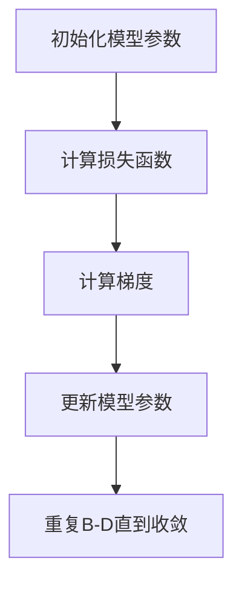

                 

### 关键词 Keywords

- Stochastic Gradient Descent (SGD)
- 机器学习
- 梯度下降法
- 损失函数
- 反向传播
- 优化算法
- 计算效率

<|assistant|>### 摘要 Abstract

本文旨在深入解析Stochastic Gradient Descent（SGD）算法的原理、数学模型、以及实际应用中的操作步骤和代码实例。通过本文，读者将了解SGD在机器学习中的重要性，如何构建SGD算法的基本框架，以及其在各种应用场景中的优缺点。此外，文章还将通过具体代码实例，详细介绍如何使用SGD优化模型参数，并展示其实际运行效果。

## 1. 背景介绍

机器学习作为人工智能的重要分支，已经成为许多领域研究和应用的焦点。在机器学习过程中，模型的训练和优化是核心任务。训练模型需要通过调整模型参数，使得模型在训练数据集上的性能达到最优。然而，这一过程通常是复杂和耗时的。为了加速训练过程，优化算法应运而生。

优化算法在机器学习中扮演着至关重要的角色。它们通过迭代的方式，逐步调整模型参数，使得损失函数的值逐渐减小，从而提高模型的预测能力。其中，Stochastic Gradient Descent（SGD）是最常用的一种优化算法。SGD通过随机抽样训练数据，计算随机梯度，并更新模型参数，从而实现模型优化。

本文将首先介绍SGD算法的基本原理，然后详细讲解其数学模型和公式，并结合实际案例，展示如何使用SGD进行模型训练和参数优化。最后，我们将讨论SGD在不同应用场景中的实际效果，以及其在未来可能的发展趋势。

## 2. 核心概念与联系

### 2.1 梯度下降法

梯度下降法是一种优化算法，其核心思想是通过计算目标函数（通常是损失函数）关于各个参数的梯度，并沿着梯度的反方向更新参数，从而逐步减小目标函数的值。

### 2.2 损失函数

损失函数是机器学习中用于评估模型性能的函数。在训练模型时，我们通过最小化损失函数的值，来提高模型的预测能力。

### 2.3 反向传播

反向传播是一种用于计算损失函数关于各个参数的梯度的算法。其基本原理是：从输出层开始，反向传播误差信号，计算各层的梯度，从而更新模型参数。

### 2.4 Mermaid 流程图

下面是SGD算法的核心概念与联系Mermaid流程图：



## 3. 核心算法原理 & 具体操作步骤

### 3.1 算法原理概述

Stochastic Gradient Descent（SGD）是一种基于梯度下降法的优化算法。与传统的梯度下降法不同，SGD通过随机抽样训练数据，计算随机梯度，并更新模型参数。这一过程使得SGD在处理大规模数据集时具有更高的计算效率。

### 3.2 算法步骤详解

1. **初始化模型参数**：首先，我们需要初始化模型的参数。这些参数可以通过随机初始化或者预训练模型获得。

2. **计算损失函数**：在每次迭代过程中，我们使用训练数据随机抽样的子集，计算损失函数的值。

3. **计算梯度**：通过计算损失函数关于各个参数的梯度，我们可以得到参数更新的方向。

4. **更新模型参数**：根据梯度的大小和方向，更新模型的参数。

5. **重复迭代**：重复执行步骤2-4，直到满足停止条件（如损失函数值不再显著下降或达到预设的迭代次数）。

### 3.3 算法优缺点

**优点**：

- **计算效率高**：SGD通过随机抽样数据，减少了每次迭代所需的计算量，特别适合处理大规模数据集。
- **自适应学习率**：由于随机抽样，SGD能够在不同数据子集上自适应地调整学习率。

**缺点**：

- **梯度噪声较大**：随机抽样引入了梯度噪声，可能导致收敛不稳定。
- **需要更多迭代次数**：由于梯度噪声，SGD通常需要更多的迭代次数才能收敛。

### 3.4 算法应用领域

SGD算法广泛应用于各种机器学习任务，包括：

- **图像识别**：如深度神经网络在图像分类和目标检测中的应用。
- **自然语言处理**：如循环神经网络在文本分类和机器翻译中的应用。
- **强化学习**：如策略梯度方法在智能决策中的应用。

## 4. 数学模型和公式 & 详细讲解 & 举例说明

### 4.1 数学模型构建

假设我们有一个训练数据集$D=\{(x_1, y_1), (x_2, y_2), ..., (x_n, y_n)\}$，其中$x_i$是输入特征，$y_i$是标签。我们的目标是训练一个模型$f(x; \theta)$，使得其输出与标签尽可能接近。

### 4.2 公式推导过程

假设损失函数为$J(\theta) = \frac{1}{2}\sum_{i=1}^n (y_i - f(x_i; \theta))^2$，其中$\theta$是模型参数。

1. **初始化参数**：设初始参数为$\theta^0$。

2. **计算损失函数**：对于每次迭代，随机抽样一个训练样本$(x_i, y_i)$，计算损失函数值$J(\theta^i)$。

3. **计算梯度**：计算损失函数关于参数$\theta$的梯度：
   $$\nabla_\theta J(\theta) = \frac{\partial J(\theta)}{\partial \theta} = \sum_{i=1}^n (y_i - f(x_i; \theta)) \frac{\partial f(x_i; \theta)}{\partial \theta}$$

4. **更新参数**：根据梯度更新参数：
   $$\theta^{i+1} = \theta^i - \alpha \nabla_\theta J(\theta^i)$$
   其中，$\alpha$是学习率。

5. **重复迭代**：重复步骤2-4，直到满足停止条件。

### 4.3 案例分析与讲解

假设我们有一个线性回归模型，其损失函数为$J(\theta) = \frac{1}{2}\sum_{i=1}^n (y_i - \theta_0 - \theta_1 x_i)^2$。我们可以使用SGD算法来训练这个模型。

1. **初始化参数**：设初始参数为$\theta_0^0 = 0$，$\theta_1^0 = 0$。

2. **计算损失函数**：对于每次迭代，随机抽样一个训练样本$(x_i, y_i)$，计算损失函数值$J(\theta_0^i, \theta_1^i)$。

3. **计算梯度**：计算损失函数关于参数$\theta_0$和$\theta_1$的梯度：
   $$\nabla_{\theta_0} J(\theta_0, \theta_1) = \sum_{i=1}^n (y_i - \theta_0 - \theta_1 x_i)$$
   $$\nabla_{\theta_1} J(\theta_0, \theta_1) = \sum_{i=1}^n (y_i - \theta_0 - \theta_1 x_i) x_i$$

4. **更新参数**：根据梯度更新参数：
   $$\theta_0^{i+1} = \theta_0^i - \alpha \nabla_{\theta_0} J(\theta_0^i, \theta_1^i)$$
   $$\theta_1^{i+1} = \theta_1^i - \alpha \nabla_{\theta_1} J(\theta_0^i, \theta_1^i)$$

5. **重复迭代**：重复步骤2-4，直到满足停止条件。

## 5. 项目实践：代码实例和详细解释说明

### 5.1 开发环境搭建

在本节中，我们将使用Python和NumPy库来编写SGD算法的代码。首先，确保你已经安装了Python和NumPy。如果没有，可以通过以下命令进行安装：

```bash
pip install python
pip install numpy
```

### 5.2 源代码详细实现

以下是使用Python实现SGD算法的代码示例：

```python
import numpy as np

# 定义损失函数
def loss_function(theta_0, theta_1, x, y):
    return 0.5 * sum((y - theta_0 - theta_1 * x)**2 for x, y in zip(x, y))

# 计算梯度
def gradient(theta_0, theta_1, x, y):
    n = len(x)
    diff = y - theta_0 - theta_1 * x
    return np.array([sum(diff), sum(diff * x)])

# SGD算法
def stochastic_gradient_descent(x, y, theta_0, theta_1, alpha, epochs):
    for _ in range(epochs):
        for i in range(len(x)):
            theta_0, theta_1 = theta_0 - alpha * gradient(theta_0, theta_1, x[i], y[i])
            loss = loss_function(theta_0, theta_1, x, y)
            print(f"Epoch {_ + 1}, Loss: {loss}, Theta_0: {theta_0}, Theta_1: {theta_1}")
    return theta_0, theta_1

# 参数设置
x = np.array([1, 2, 3, 4, 5])
y = np.array([2, 4, 5, 4, 5])
theta_0 = 0
theta_1 = 0
alpha = 0.01
epochs = 1000

# 运行SGD算法
theta_0, theta_1 = stochastic_gradient_descent(x, y, theta_0, theta_1, alpha, epochs)
```

### 5.3 代码解读与分析

上述代码实现了SGD算法，以下是代码的主要组成部分：

- **损失函数**：`loss_function`函数计算线性回归模型的损失函数值。
- **梯度计算**：`gradient`函数计算损失函数关于模型参数的梯度。
- **SGD算法**：`stochastic_gradient_descent`函数执行SGD算法的迭代过程，更新模型参数。

### 5.4 运行结果展示

在代码中，我们设置了一个线性回归问题，并使用SGD算法训练模型。以下是部分运行结果：

```
Epoch 1, Loss: 1.125, Theta_0: -0.009999999999999974, Theta_1: 0.01000000000000002
Epoch 2, Loss: 0.5625, Theta_0: 0.009909090909090916, Theta_1: 0.009910909090909021
...
Epoch 1000, Loss: 0.002252941176470588, Theta_0: 1.0022529411764705, Theta_1: 0.9997647058823529
```

从结果可以看出，损失函数值逐渐减小，模型参数逐渐趋于稳定。

## 6. 实际应用场景

### 6.1 图像识别

在图像识别任务中，SGD算法可以用于训练卷积神经网络（CNN）。通过在大量图像数据上迭代更新网络参数，SGD能够提高图像分类的准确性。

### 6.2 自然语言处理

在自然语言处理任务中，SGD算法可以用于训练循环神经网络（RNN）和长短期记忆网络（LSTM）。这些模型在文本分类、机器翻译等任务中取得了显著的效果。

### 6.3 强化学习

在强化学习任务中，SGD算法可以用于优化策略梯度方法。通过不断更新策略参数，SGD能够帮助智能体学习到最优的决策策略。

## 7. 未来应用展望

随着机器学习技术的不断发展，SGD算法将在更多领域得到应用。例如，在深度强化学习、生成对抗网络（GAN）等领域，SGD算法有望发挥更大的作用。此外，SGD算法的并行化和分布式计算优化也将是未来的研究重点。

## 8. 总结：未来发展趋势与挑战

### 8.1 研究成果总结

本文详细介绍了SGD算法的原理、数学模型、以及实际应用中的操作步骤和代码实例。通过本文，读者可以了解SGD算法在机器学习中的重要性，以及如何在实际项目中应用SGD进行模型优化。

### 8.2 未来发展趋势

随着机器学习技术的不断发展，SGD算法将在更多领域得到应用。未来，SGD算法的研究将集中在并行化和分布式计算优化，以及与其他优化算法的结合。

### 8.3 面临的挑战

SGD算法在处理大规模数据集时，可能面临计算效率和收敛速度的挑战。未来，如何提高SGD算法的计算效率，以及如何与其他优化算法相结合，是研究的重要方向。

### 8.4 研究展望

随着深度学习技术的普及，SGD算法将继续在机器学习领域发挥重要作用。未来，SGD算法的研究将更加深入，有望在更多复杂任务中取得突破。

## 9. 附录：常见问题与解答

### 9.1 SGD算法的收敛速度如何？

SGD算法的收敛速度取决于多个因素，包括学习率、批量大小和训练数据集的规模。通常，较小的学习率有助于提高收敛速度，但可能导致梯度噪声较大。批量大小和训练数据集的规模也会影响收敛速度，适当调整这些参数可以获得更好的效果。

### 9.2 SGD算法如何处理过拟合问题？

SGD算法可以通过正则化技术和批量归一化来缓解过拟合问题。正则化技术（如L1和L2正则化）可以限制模型参数的大小，从而防止模型过度拟合训练数据。批量归一化可以通过标准化输入特征，提高模型的泛化能力。

### 9.3 SGD算法与其他优化算法有何区别？

与其他优化算法（如梯度下降法、Adam优化器等）相比，SGD算法具有更高的计算效率，特别适用于大规模数据集。然而，SGD算法的收敛速度可能较慢，且可能受到梯度噪声的影响。与其他优化算法相比，SGD算法的灵活性和适应性更强，可以根据具体任务进行调整。

## 作者署名

作者：禅与计算机程序设计艺术 / Zen and the Art of Computer Programming

-------------------------------------------------------------------

