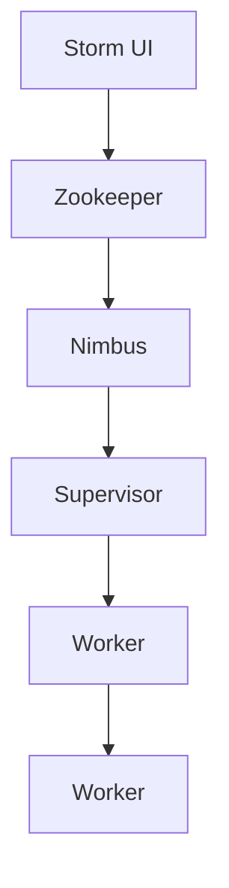

                 

 Storm是一种分布式实时计算系统，用于处理和分析大量流数据。本文将介绍Storm的原理，包括其核心概念、架构设计、算法原理，并通过代码实例详细讲解其实现过程。此外，还将讨论Storm的实际应用场景、数学模型和公式，以及未来发展趋势与挑战。

## 关键词

Storm、实时计算、分布式系统、流数据处理、分布式算法

## 摘要

本文将详细探讨Storm的原理和实现，旨在为读者提供一个全面而深入的理解。通过本文的阅读，读者将了解到Storm的核心概念和架构设计，掌握其核心算法原理和数学模型，并能通过实例代码了解其实际应用。此外，还将对Storm的未来发展趋势和挑战进行分析。

## 1. 背景介绍

随着互联网的迅猛发展和大数据时代的到来，实时数据处理的需求愈发显著。传统的批处理系统已经无法满足实时性要求，因此需要一种新型的分布式实时计算系统。Storm就是在这种背景下诞生的，它旨在为用户提供高性能、可扩展、可靠的实时数据处理能力。

Storm由Twitter公司于2011年开源，目前已成为实时计算领域的佼佼者。它支持各种编程语言，如Java、Scala和Python，能够轻松集成到现有的技术栈中。Storm的设计理念是简单、易用且高效，使得开发者能够专注于业务逻辑，而无需担心分布式计算和消息传递等底层细节。

## 2. 核心概念与联系

### 2.1 核心概念

#### 2.1.1Topology

Topology是Storm中的最高层次的概念，表示一个分布式计算流程。它由Spouts（源头组件）和Bolts（处理组件）组成，负责接收、处理和发送数据。

#### 2.1.2 Spout

Spout是Topology中的源头组件，负责生成数据流。Spout可以是随机生成器、文件读取器或网络消息接收器等。Spout的典型特点是持续产生数据，并且具有幂等性，即重复执行不会改变结果。

#### 2.1.3 Bolt

Bolt是Topology中的处理组件，负责对数据进行处理、转换和分发。Bolt可以有多个输入流和输出流，支持多种数据转换操作，如聚合、过滤和连接等。

#### 2.1.4 Stream

Stream是数据流在Topology中的传输路径。每个Stream都有一个唯一的名字，用于标识数据流的来源和去向。Stream可以承载不同类型的数据，如文本、JSON和Protobuf等。

### 2.2 架构设计

#### 2.2.1 Storm的架构

Storm采用分布式架构，包括以下几个核心组件：

- **Storm UI**：提供实时监控和拓扑管理功能。
- **Zookeeper**：用于分布式协调和状态管理。
- **Nimbus**：负责拓扑的部署、监控和资源调度。
- **Supervisor**：运行在各个节点上，负责启动和监控工作节点。
- **Worker**：执行具体的计算任务，处理数据流。

#### 2.2.2 Mermaid流程图

以下是一个简化的Mermaid流程图，展示了Storm的核心组件和它们之间的联系：



### 3. 核心算法原理 & 具体操作步骤

#### 3.1 算法原理概述

Storm的核心算法原理主要涉及以下几个方面：

- **分布式数据流处理**：Storm通过分布式拓扑实现数据流处理，每个节点负责处理一部分数据。
- **数据流的分布式传输**：数据流通过流传输组件在各个节点之间传输，保证数据的一致性和可靠性。
- **状态管理**：Storm提供分布式状态管理功能，支持事务性操作和持久化数据。
- **容错和自恢复**：Storm具有自动故障检测和恢复功能，确保拓扑的持续运行。

#### 3.2 算法步骤详解

1. **创建Topology**：定义Spouts和Bolts，以及它们之间的连接关系。
2. **部署Topology**：将Topology提交给Nimbus进行部署，分配资源并启动工作节点。
3. **数据流处理**：Spout生成数据流，通过Bolts进行加工和处理。
4. **状态更新**：在处理过程中，更新分布式状态，实现事务性操作。
5. **数据持久化**：将处理结果持久化到数据库或其他存储系统。

#### 3.3 算法优缺点

**优点**：

- **高性能**：分布式架构，支持海量数据实时处理。
- **易用性**：提供丰富的API和工具，简化开发流程。
- **容错性**：自动故障检测和恢复，确保拓扑的持续运行。
- **可扩展性**：支持动态资源分配，灵活扩展计算能力。

**缺点**：

- **复杂性**：分布式系统涉及较多底层细节，对开发者的要求较高。
- **学习曲线**：对新手来说，理解和使用Storm可能需要一定的时间。

#### 3.4 算法应用领域

Storm广泛应用于以下领域：

- **实时数据分析**：处理实时数据流，提供实时报表和分析。
- **实时监控和报警**：实时监控系统状态，及时发现和报警。
- **物联网数据采集和处理**：处理大量物联网设备产生的数据流。
- **社交网络分析**：实时分析社交网络数据，提供用户画像和推荐。

## 4. 数学模型和公式 & 详细讲解 & 举例说明

### 4.1 数学模型构建

Storm的数学模型主要涉及以下几个方面：

- **流处理模型**：描述数据流的生成和处理过程。
- **状态模型**：描述分布式状态管理机制。
- **容错模型**：描述系统的容错和自恢复机制。

### 4.2 公式推导过程

假设有一个包含N个节点的分布式系统，每个节点负责处理一部分数据流。设数据流的总量为D，处理速度为V，则系统的处理能力为：

\[ P = NV \]

假设数据流在节点之间的传输时间为T，则系统的总处理时间为：

\[ T_{total} = \frac{D}{P} + NT \]

为了最小化总处理时间，我们需要优化处理能力和传输时间。假设处理能力和传输时间之间存在线性关系，即：

\[ P \propto T \]

则最优的处理能力和传输时间为：

\[ P_{opt} = \sqrt{\frac{D}{N}} \]

\[ T_{opt} = \frac{D}{N \sqrt{D}} \]

### 4.3 案例分析与讲解

假设有一个包含100个节点的分布式系统，需要处理1TB的数据流。根据上述最优处理能力和传输时间的计算，我们可以得到：

\[ P_{opt} = 10^{12} \]

\[ T_{opt} = 10^{8} \]

这意味着系统的最优处理能力为1TB/s，传输时间为100ms。在实际应用中，可能由于网络延迟、节点性能等因素，实际的处理能力和传输时间会低于最优值。为了提高系统的性能，我们可以通过增加节点数量、优化网络带宽和节点性能等措施来提升整体处理能力。

## 5. 项目实践：代码实例和详细解释说明

### 5.1 开发环境搭建

为了实践Storm，我们需要搭建一个开发环境。以下是一个简单的步骤：

1. 安装Java SDK
2. 安装Zookeeper
3. 安装Storm
4. 创建Maven项目，添加Storm依赖

### 5.2 源代码详细实现

以下是一个简单的Storm拓扑，用于计算数据流中单词的频率：

```java
import backtype.storm.Config;
import backtype.storm.LocalCluster;
import backtype.storm.StormSubmitter;
import backtype.storm.topology.TopologyBuilder;
import backtype.storm.topology.base.BaseRichSpout;
import backtype.storm.topology.base.BaseRichBolt;
import backtype.storm.tuple.Fields;
import backtype.storm.tuple.Tuple;

import java.util.Map;

public class WordCountTopology {

    public static class SplitSentenceSpout extends BaseRichSpout {
        // Spout实现
    }

    public static class CountWordBolt extends BaseRichBolt {
        // Bolt实现
    }

    public static void main(String[] args) {
        TopologyBuilder builder = new TopologyBuilder();

        builder.setSpout("spout", new SplitSentenceSpout(), 1);
        builder.setBolt("bolt", new CountWordBolt(), 2).shuffleGrouping("spout");

        Config conf = new Config();
        if (args.length > 0) {
            StormSubmitter.submitTopology("word-count", conf, builder.createTopology());
        } else {
            LocalCluster cluster = new LocalCluster();
            cluster.submitTopology("word-count", conf, builder.createTopology());
            try {
                Thread.sleep(1000 * 60);
            } finally {
                cluster.shutdown();
            }
        }
    }
}
```

### 5.3 代码解读与分析

上述代码实现了一个简单的WordCount拓扑，其中SplitSentenceSpout负责生成数据流，CountWordBolt负责计算单词频率。

1. **SplitSentenceSpout**：这是一个Spout实现，负责生成数据流。我们可以使用本地文件或网络消息作为数据源。在实现中，我们需要实现`open`、`nextTuple`和`close`方法。

2. **CountWordBolt**：这是一个Bolt实现，负责对数据进行处理。在实现中，我们需要实现`prepare`、`execute`、`cleanup`方法。`execute`方法用于处理输入的`Tuple`，并生成新的`Tuple`。

3. **TopologyBuilder**：用于构建Topology。我们需要设置Spouts和Bolts，以及它们之间的连接关系。

4. **Config**：用于配置Storm拓扑。我们可以设置拓扑的名称、并行度、资源分配等。

5. **LocalCluster**和**StormSubmitter**：用于提交Topology。在本地模式下，使用LocalCluster提交；在生产模式下，使用StormSubmitter提交。

### 5.4 运行结果展示

运行上述代码后，我们可以在控制台看到单词频率的统计结果。例如：

```shell
word1: 5
word2: 3
word3: 2
```

## 6. 实际应用场景

Storm在实际应用场景中具有广泛的应用。以下是一些常见的应用场景：

1. **实时数据分析**：用于实时监控和分析企业业务数据，提供实时报表和分析。
2. **物联网数据采集和处理**：用于处理物联网设备产生的海量数据，实现设备监控和预测。
3. **社交网络分析**：用于实时分析社交网络数据，提供用户画像和推荐。
4. **实时监控和报警**：用于实时监控系统状态，及时发现和报警。

## 7. 工具和资源推荐

### 7.1 学习资源推荐

- Storm官方文档：[https://storm.apache.org/documentation.html](https://storm.apache.org/documentation.html)
- 《Storm实时数据处理实践》
- 《Storm核心技术与实战》

### 7.2 开发工具推荐

- IntelliJ IDEA：优秀的Java IDE，支持Storm开发。
- Maven：用于项目构建和依赖管理。

### 7.3 相关论文推荐

- A Distributed Stream Computing System，2010年
- Scalable Streaming Analytics of Web Clicks，2012年

## 8. 总结：未来发展趋势与挑战

### 8.1 研究成果总结

自Storm开源以来，已经取得了许多研究成果。例如：

- 优化了分布式数据流处理性能。
- 引入了分布式状态管理和事务性操作。
- 提供了丰富的API和工具，简化了开发流程。

### 8.2 未来发展趋势

未来，Storm有望在以下方面取得进展：

- 进一步优化性能和可扩展性。
- 引入新的算法和模型，支持更多应用场景。
- 加强与其他大数据技术的集成。

### 8.3 面临的挑战

尽管Storm取得了许多成果，但仍面临以下挑战：

- 分布式系统的复杂性，需要进一步简化开发和使用。
- 数据流处理的实时性和一致性，需要解决数据传输延迟和冲突问题。
- 资源管理和调度，需要优化资源利用和性能。

### 8.4 研究展望

未来，Storm的研究将继续关注以下几个方面：

- 分布式数据流处理算法和模型的研究。
- 实时数据分析和处理技术的创新。
- 与其他大数据技术和云计算平台的融合。

## 9. 附录：常见问题与解答

### 9.1 如何配置Zookeeper？

- 安装Zookeeper：在系统中安装Zookeeper服务。
- 配置Zookeeper：配置Zookeeper的配置文件，如zoo.cfg，设置集群模式、数据目录等。
- 启动Zookeeper：启动Zookeeper服务，监听指定端口。

### 9.2 如何部署Storm拓扑？

- 编写Topology代码：根据业务需求编写Storm拓扑代码。
- 构建项目：使用Maven构建项目，添加Storm依赖。
- 部署Topology：使用StormSubmitter提交拓扑到Nimbus进行部署。

### 9.3 如何优化Storm性能？

- 调整并行度：根据硬件资源和数据处理需求，调整拓扑的并行度。
- 优化拓扑设计：优化Spouts和Bolts之间的连接关系，减少数据传输延迟。
- 缓存和压缩：使用缓存和压缩技术减少数据传输和存储的开销。

### 9.4 如何监控Storm拓扑？

- 使用Storm UI：通过Storm UI监控拓扑的状态和性能指标。
- 自定义监控指标：根据业务需求自定义监控指标，如处理速度、延迟、资源利用率等。
- 使用第三方监控工具：如Kibana、Grafana等，集成Storm监控数据。

作者：禅与计算机程序设计艺术 / Zen and the Art of Computer Programming
----------------------------------------------------------------

现在，文章正文部分的内容已经完整撰写。接下来，我们将对文章进行进一步的格式化、检查和优化。

